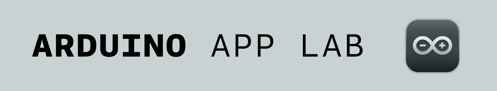
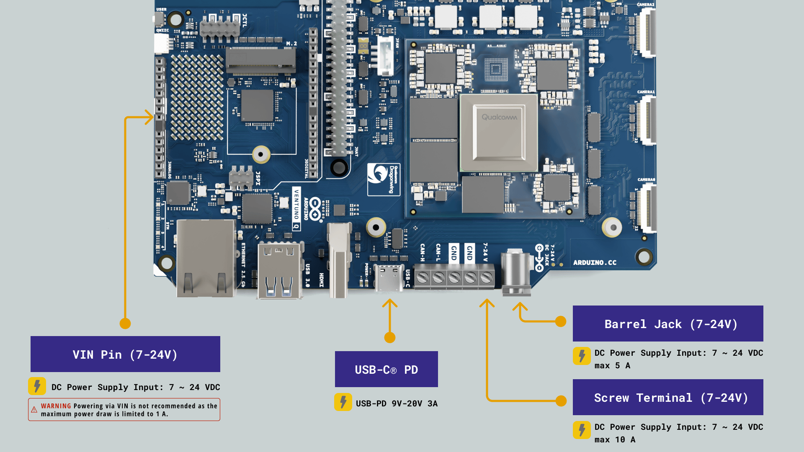
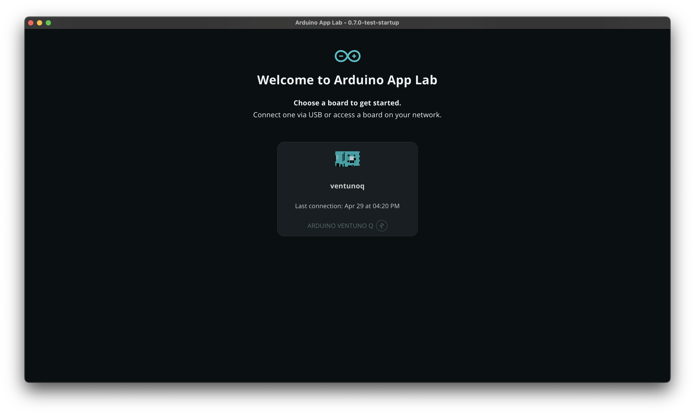
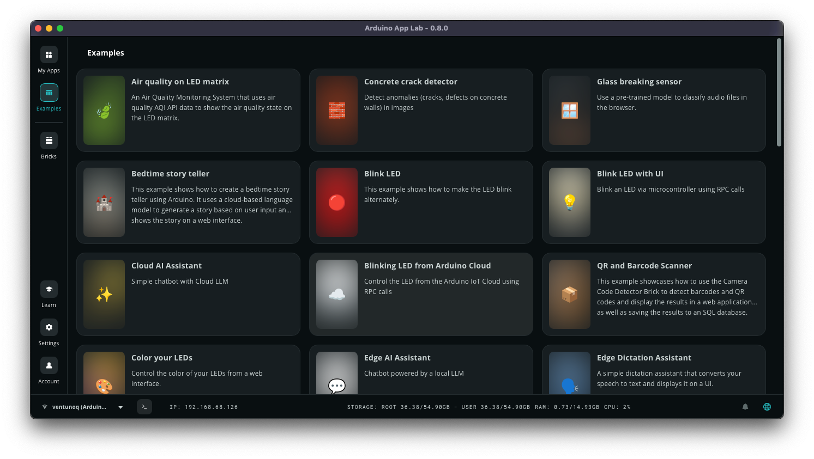
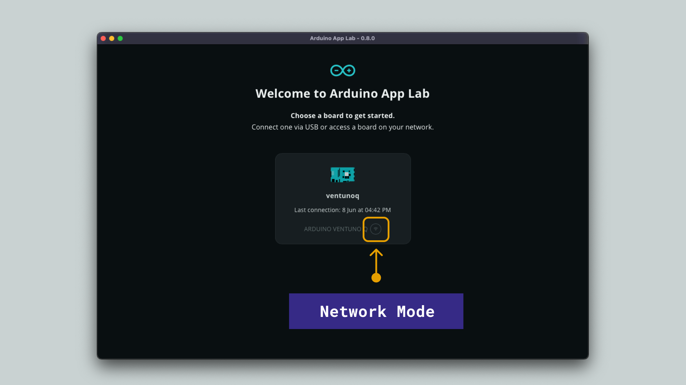
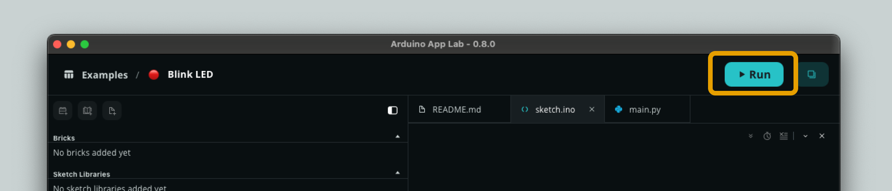

## Overview

In this tutorial, you will learn how to set up your [Arduino® VENTUNO™ Q](https://store.arduino.cc/products/ventuno-q) with the [Arduino App Lab](/software/app-lab/) and run your first App on the board. By the end, you will have a blinking LED as proof that everything is working correctly.

<Alert type="info">This tutorial focuses on setting up your VENTUNO Q using a host computer. To use the VENTUNO Q as a standalone computer with display, mouse & keyboard, see the [Single Board Computer](/tutorials/ventuno-q/sbc-mode-setup/) tutorial.</Alert>

## Hardware and Software Requirements

### Hardware Requirements

- [Arduino® VENTUNO™ Q](https://store.arduino.cc/products/ventuno-q) (1x)
- [Arduino® USB Type-C® Cable 2in1](https://store.arduino.cc/products/usb-cable2in1-type-c) (1x)
- [Arduino® USB-C Power Supply (65W)](https://store.arduino.cc/products/usb-c-power-supply-65w)\*

\*Other power supplies can be used, within the range of 7-24 V and ≥ 3 A. See the [User Manual - Power Section](/tutorials/ventuno-q/user-manual/#power-overview) for more information.

<Alert type="note" text="Note">
The Arduino USB-C Power Supply (65W) includes a small adapter that converts USB-C® into a DC barrel jack. Use this adapter to power the board via the barrel jack connector if needed.
</Alert>

### Software Requirements

- [Arduino App Lab](https://www.arduino.cc/en/software/#app-lab-section)

## Arduino App Lab

The [Arduino App Lab](/software/app-lab/) is a unified development environment for programming Linux-based Arduino boards. It allows you to run Python scripts on the Linux processor (Qualcomm® Dragonwing™ QCS8275) and sketches on the MCU (STM32H5F5), by creating and deploying **Apps***.

*Apps are created in Arduino App Lab, and contains a sketch (MCU) and a Python environment (Linux) that use [Bricks](https://docs.arduino.cc/software/app-lab/bricks/about-bricks/) to run anything from web servers to AI models.

## Step 1: Power the Board

To power the board during the first setup, we can use either the **barrel jack** or **screw terminal**:

- An external +7-24 VDC (max 5 A) [power supply](https://store.arduino.cc/products/usb-c-power-supply-65w) connected with the barrel jack plug.
- An external +7-24 VDC power supply (max 10 A) connected to the screw terminal headers.
- An external [USB-C® with Power Delivery](https://store.arduino.cc/products/usb-c-power-supply-65w) support (9-20 VDC, 3 A).
  
<Alert type="warning" text="Warning">
Please note that the board can not be powered directly via the USB port on your computer.
</Alert>

## Step 2: Setup Arduino App Lab

To set up Arduino App Lab on your computer, follow the steps below:

1. Download the latest version from the [Arduino downloads page](https://www.arduino.cc/en/software/#app-lab-section).
2. Run the application on your Operating System.
3. Connect the board to your computer via the USB-C® port (make sure the board is powered, see the [power section](#step-1-power-the-board) above).
4. The VENTUNO Q should appear in the Arduino App Lab, where you can select it.
   
5. You will be prompted to set **Board Name**, **Keyboard Language** and **Wi-Fi®** credentials when launching it for the first time.
6. After configuring the settings, you will need to perform a **board update**. This is necessary to get the latest updates. Note that this may take several minutes.
7. Once the update is finished, you will be ready to run the examples in the Arduino App Lab.

### Network Mode

When the board has been configured, the board is available in **Network Mode**:

- When opening Arduino App Lab the next time, if your board is connected to your local network, it will appear with a **network symbol instead of USB**.
- When entering it from network mode, enter the password created during the configuration of your board.
- You have now accessed the board over network, meaning no physical connection is required to your board from your computer.

With this method, you can access your VENTUNO Q from any machine in your local network and develop & run Apps in the same way as if it was connected via USB-C®.

## Step 3: Run an App on VENTUNO Q

To test the VENTUNO Q, we will run the classic **Blink** example. This example verifies that the board is correctly connected to the Arduino App Lab and is working properly.

1. Make sure your board is [powered correctly](#step-1-power-the-board).
2. Open the Arduino App Lab and connect to your board (via USB-C® or Network mode).
3. Go to the **Examples** tab, and click on the **Blink LED** example.

   

4. Click on the **Run** button in the top right corner and wait for the app to be uploaded.

   

You should now see the red LED of the built-in RGB LED turning on for one second, then off for one second, repeatedly.

## Summary

You have successfully set up the VENTUNO Q with the Arduino App Lab and run your first App. From here, you can explore the other built-in examples, build your own Apps using Bricks, or connect to the board via SSH or ADB for more advanced control.

### Further Reading

- [Arduino VENTUNO Q User Manual](/tutorials/ventuno-q/user-manual/) - a complete reference to the features of the VENTUNO Q.
- [Arduino App Lab Documentation](/software/app-lab/) - a complete reference to the Arduino App Lab.
- [Blink Example](https://github.com/arduino/app-bricks-examples/blob/main/examples/blink/README.md) - full documentation of this example, also available inside the Arduino App Lab.
