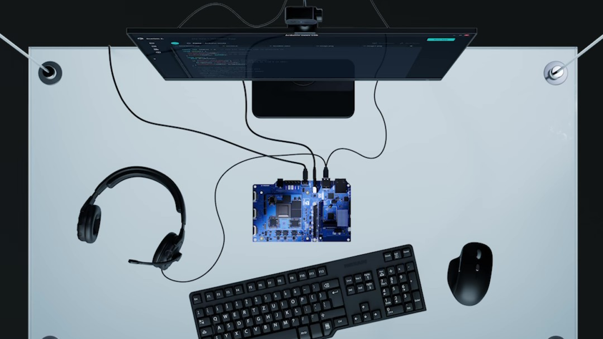
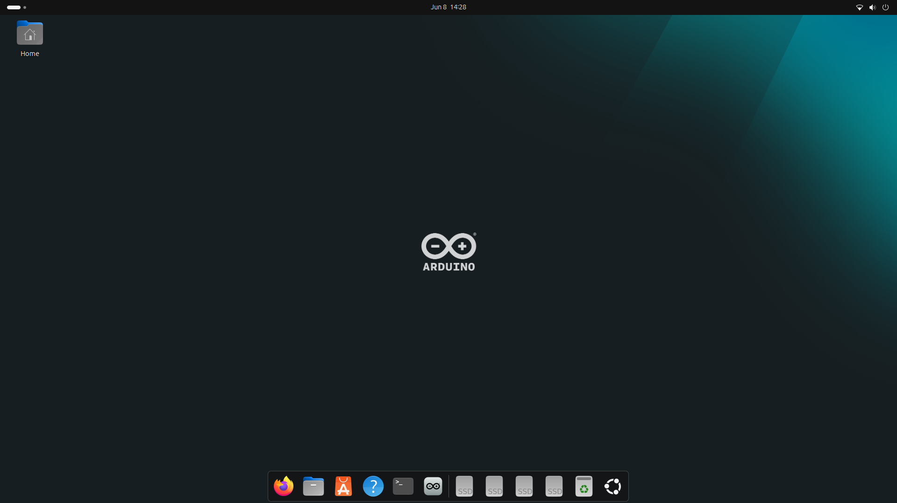
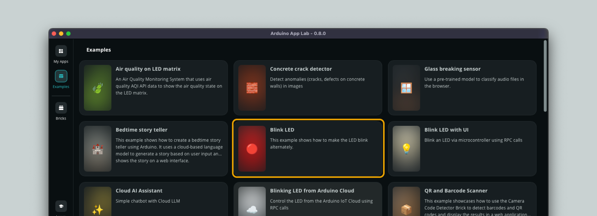
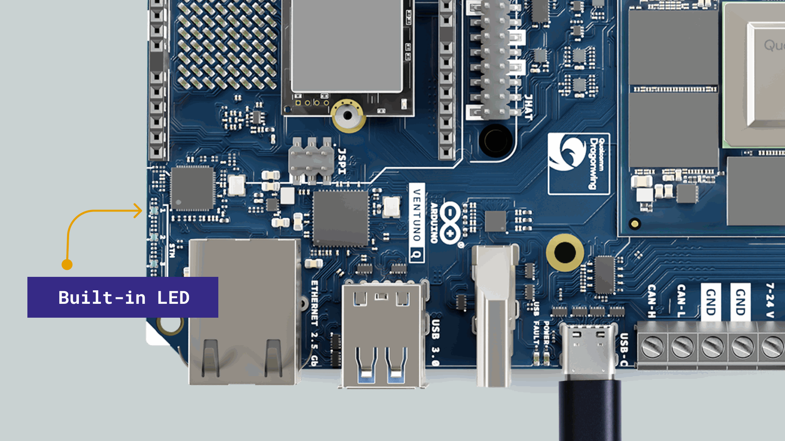

## Overview

In this tutorial, you will learn how to set up your [Arduino® VENTUNO™ Q](https://store.arduino.cc/products/ventuno-q) as a Single-Board Computer (SBC). In this mode, we can use the [Arduino App Lab](/software/app-lab/) directly from the board, by connecting a display, mouse & keyboard.

## Hardware and Software Requirements

### Hardware Requirements

- [Arduino® VENTUNO™ Q](https://store.arduino.cc/products/ventuno-q) (1x)
- [Arduino® USB-C Power Supply (65W)](https://store.arduino.cc/products/usb-c-power-supply-65w)\*
- Display + HDMI cable
- USB Keyboard
- USB Mouse

### Software Requirements

- [Arduino App Lab](https://www.arduino.cc/en/software/#app-lab-section) (pre-installed on VENTUNO Q)

## Powering the Board

Powering the board can be done through the following options:

- An external +7-24 VDC (max 5 A) [power supply](https://store.arduino.cc/products/usb-c-power-supply-65w) connected with the barrel jack plug.
- An external +7-24 VDC power supply (max 10 A) connected to the screw terminal headers.
- An external [USB-C® with Power Delivery](https://store.arduino.cc/products/usb-c-power-supply-65w) support (9-20 VDC, 3 A)

<Alert type="warning" text="Warning">

Power over USB requires **at least** 9 V (Power Delivery negotiation). Powering with e.g. 5 V only (e.g. via computer USB port) is not accepted and will result in a USB fault (blinking red LED next to the USB). This error is not damaging to the board and a power-cycle to reset it will remove the LED blinking sequence.

</Alert>

## Connect Display, Mouse & Keyboard

The VENTUNO Q has dedicated USB-A connectors and an HDMI connector, which can be used to connect a keyboard & mouse as well as a display over HDMI.

## Setup Arduino App Lab in SBC Mode

Arduino App Lab comes **pre-installed** on the VENTUNO Q and can be used in Single-Board Computer (SBC) mode.

1. Connect a display to the HDMI connector.
2. Connect keyboard and mouse to the USB-A connectors.
3. Power the board by connecting a power supply to the barrel jack connector.
4. Create your Linux password when prompted on first boot.

Once you have created the password, you should see the following screen:

To launch **Arduino App Lab**, click the icon in the navbar:

Once you are in Arduino App Lab, you will need to complete the configuration which involves:

- Setting **Wi-Fi®** credentials
- Updating the board to the latest version (you will be prompted to inside the Arduino App Lab)

Once the board has finished updating, we can try out running our **first app**.

## Running Your First App: Blink

1. Go to the **Examples** tab and click the **Blink LED** example.

  

1. Click the **Run** button in the top right corner and wait for the app to be uploaded.

You should now see the red LED of the built-in RGB LED turning on for one second, then off for one second, repeatedly.

## Summary

You have successfully set up VENTUNO Q in SBC mode and run your first App directly on the board.

As the board runs a full Ubuntu OS, you can now also start using it as a regular computer: browse the web, use the terminal for installing packages and develop new Apps using the Arduino App Lab.

### Further Reading

- [Arduino® VENTUNO Q User Manual](/tutorials/ventuno-q/user-manual/) - a complete reference to the features of the VENTUNO Q.
- [Arduino App Lab Documentation](/software/app-lab/) - a complete reference to the Arduino App Lab.
- [Blink Example](https://github.com/arduino/app-bricks-examples/blob/main/inspirational/common/blink/README.md) - full documentation of this example, also available inside the Arduino App Lab.
