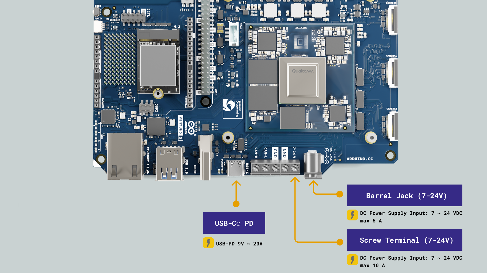
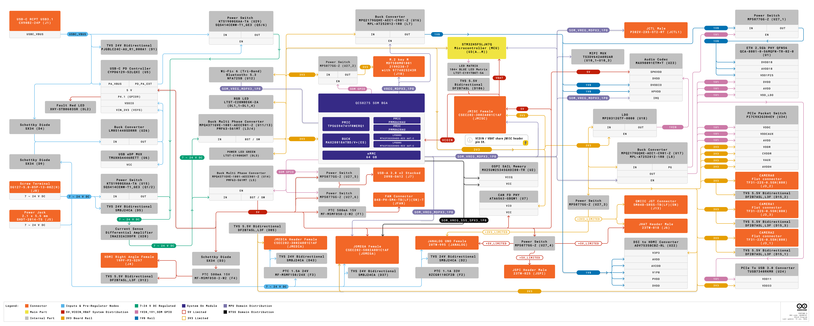
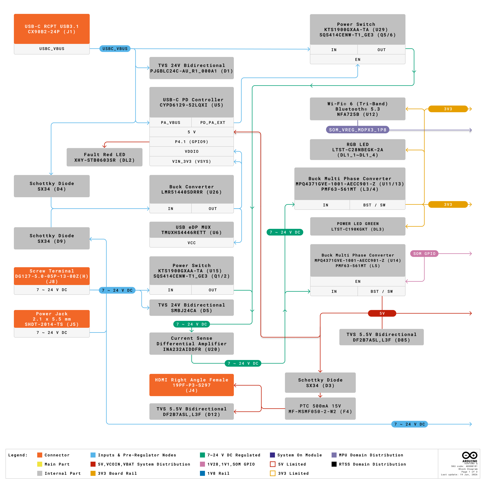
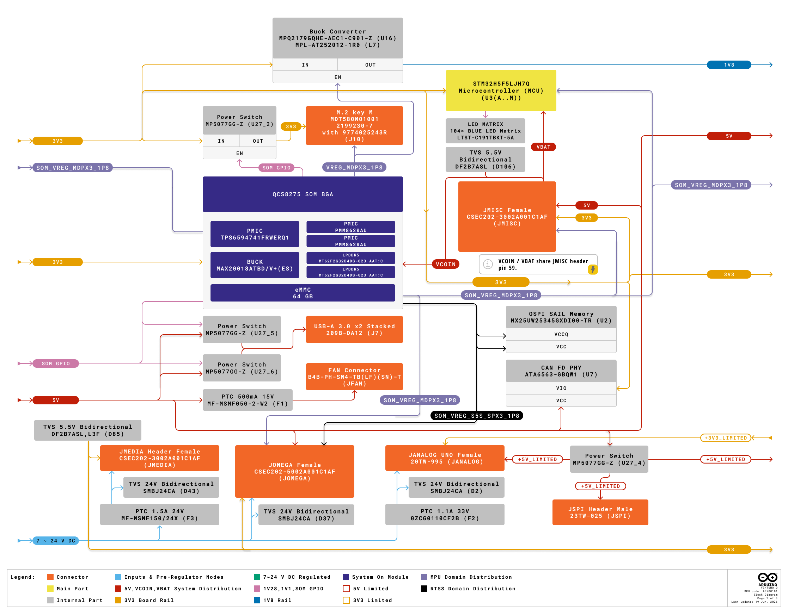
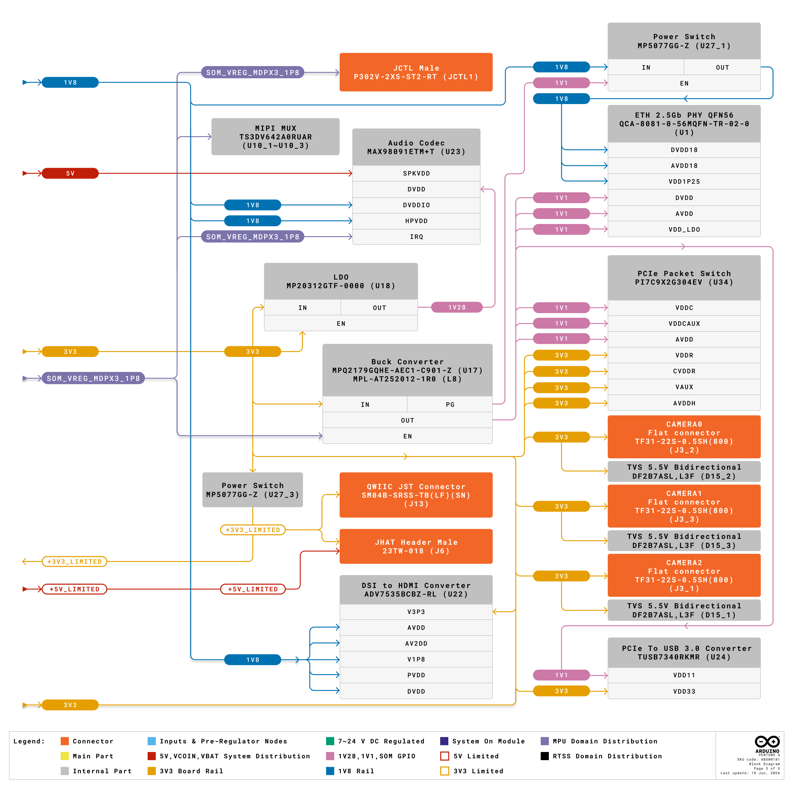
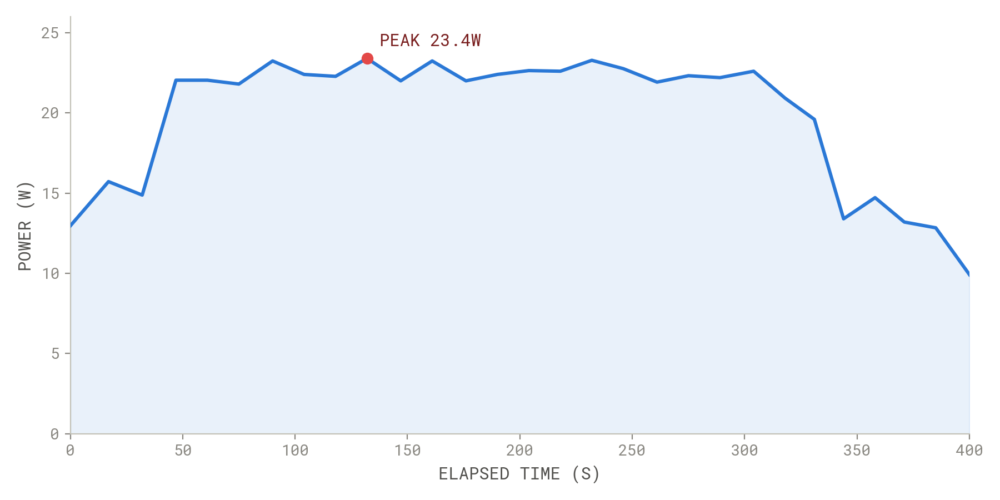
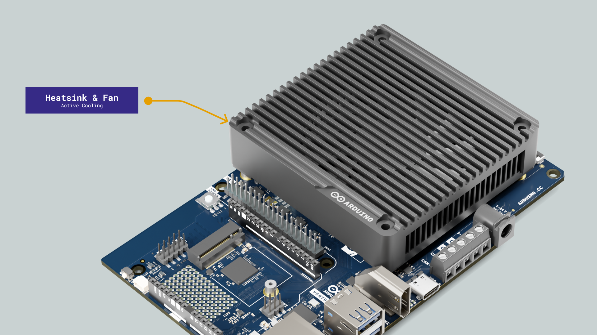
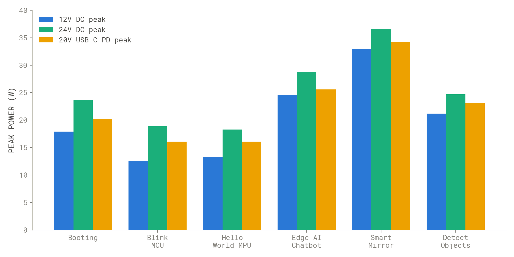
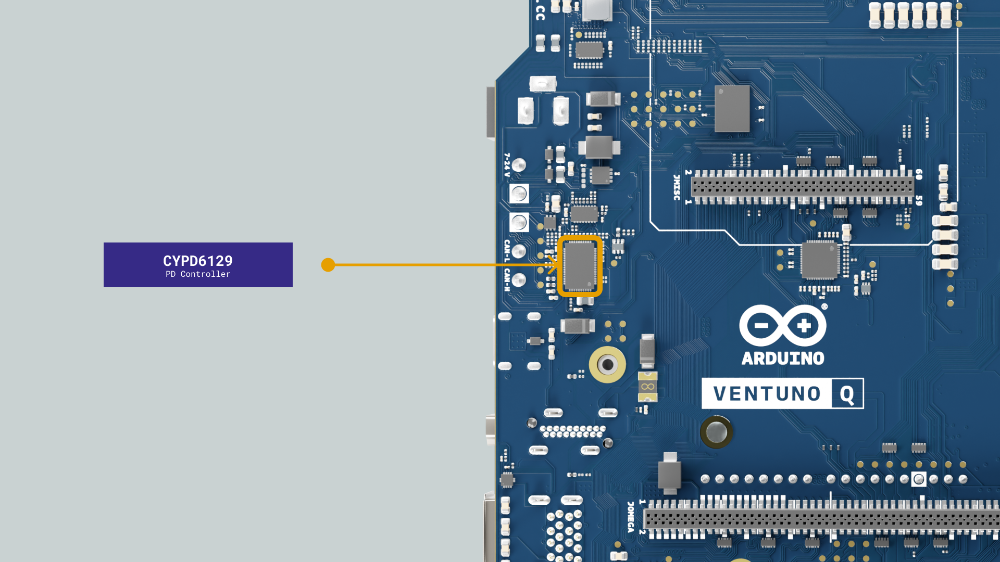

## Overview

This tutorial walks you through the power domain of the Arduino® VENTUNO™ Q, covering the two independent input paths, how the on-board rails are generated, the safe operating limits for each rail and connector, and the budgeting rules you need to know before connecting peripherals, shields, HATs or a carrier board.

You will also learn which headers export which rails, what the current limits are and how the board handles multiple simultaneous power sources.

## Goals

- Get to know the board's input voltage and current ratings for each power source.
- Get to know how the board protects, switches, and combines the USB-C® and DC inputs before reaching the buck converters.
- Get to know how the `+3V3`, `+5V`, `+1V8`, `+1V1` and `+1.28V` rails are generated and what each one powers.
- Get to know the safe electrical limits for rails, headers and peripheral power draws, and how to budget a power supply correctly.

## Power Tree Architecture

The VENTUNO Q gets power from two independent paths, a **USB-C® Power Delivery** port negotiating 9-20 V and a **DC input** via either the 5.5×2.1 mm barrel jack or the screw terminal, both rated 7-24 V.

Both DC paths are protected by bidirectional 24 V TVS diodes (SMBJ24CA) and routed through a power OR stage consisting of independent, reverse-polarity and reverse current protected power switches (KTS1900GXAA-TA + SQS414CENW-T1_GE3) before reaching the buck converters.

The USB-C® VBUS path has its own TVS equivalent (PJGBLC24C-AU_R1_000A1) and a power-OR switch ahead of the same downstream rails.

From there, power is distributed in stages: first into the main `+3V3` and `+5V` rails, then into the SoM and a set of load-switched peripheral rails, and finally into the current-limited rails exposed on the maker-facing headers.

The walkthrough below follows the power tree diagram page by page to show how that happens.



## Power Tree Walkthrough

The power tree diagram is split across three pages, each covering one stage of the distribution. This section follows the diagram in that same order, from the raw input down to the current-limited header rails.

### Input Stage and Voltage Regulation



This page covers how power enters the board and how it is first regulated. The USB-C® connector supplies VBUS through a TVS diode (PJGBLC24C-AU_R1_000A1) to the CYPD6129-52LQXI PD controller, which negotiates the voltage profile and drives a dedicated power switch (KTS1900GXAA-TA + SQS414CENW-T1_GE3) to the rest of the board.

The barrel jack and screw terminal are diode-combined through a pair of Schottky diodes and TVS protection (SMBJ24CA), then pass through a second, independent power switch of the same family. Both switches implement the power OR. Whichever source is active and at the higher voltage feeds forward, while the other is blocked.

Immediately downstream of the DC power switch sits the current-sensing IC (INA232AIDDFR), which measures the total input current and voltage on the combined bus before they reach any buck converter.

From that same combined bus, three multi-phase buck converters (MPQ4371GVE) do the main conversion work, where U11 and U13 run in parallel to generate `+3V3` and U14 generates `+5V`, with its enable line tied to a SOM GPIO so the MPU can control when the 5 V rail is active.

A small, always-on buck converter (LMR51440SDRRR, U26) draws directly from the pre-switch combined input, keeping the CYPD6129 PD controller and the USB eDP MUX (TMUXHS4446RETT) powered even before the main power path is enabled.

This is also the page where the first direct consumers of `+3V3` appear, the Wi-Fi® 6/Bluetooth 5.3 module (NFA725B), the RGB LEDs and the green Power LED. The HDMI connector draws from `+5V` here, protected separately by its own TVS, Schottky diode and PTC fuse.

### Load Switches, SoM and Initial Rail Distribution



This page builds on `+3V3` and `+5V` and shows where those rails go after they leave the regulation stage. A dedicated buck converter (MPQ2179GQHE, U16) steps `+3V3` down to `+1V8` here. A SOM GPIO-controlled load switch (MP5077GG-Z) gates power to the M.2 Key M connector, letting the MPU control the NVMe slot independently.

The QCS8275 SoM is centered on this page. Internally, it integrates a TPS6594741FRWERQ1 PMIC, two PMM8620AU PMICs and a MAX20018ATBD/V+ buck converter, all powered from `+3V3` and supplying the SoM's internal processor, memory and I/O rails. From this block, the SoM exposes the `SOM_VREG_MDPX3_1P8` rail and its GPIO control lines outward to the rest of the board.

Around the SoM, this page also shows the first load-switched peripheral rails and connectors. The USB-A 3.0 stacked ports are each gated by their own MP5077GG-Z switch, the JMISC connector receives `+5V`, `+3V3` and the SOM 1.8 V rail, and the JMEDIA and JOMEGA headers receive the DC input passthrough. It is also where `+5V_LIMITED` first appears, providing both the JANALOG and JSPI headers from the same switch.

### Limited Rails and Peripheral Distribution



The third page covers the remaining regulations and the current-limited rails that reach the maker-facing connectors. A second MPQ2179GQHE buck converter generates `+1V1` here, supplying the PCIe packet switch (PI7C9X2G304EV), the Ethernet PHY (QCA-8081), and the USB 3.0 PCIe converter (TUSB7340RKMR).

An LDO (MP20312GTF) supplies `+1.28V` for the MAX98091 audio codec's digital core, while the rest of the codec's domains (`SPKVDD`, `HPVDD`, `DVDDIO`) are supplied directly from `+5V` and `+1V8`.

This is the page where `+3V3_LIMITED` is distributed to its final destination via a dedicated MP5077GG-Z load switch, powering the Qwiic connector and the JHAT header. The DSI-to-HDMI converter (ADV7535BCBZ-RL) draws directly from `+3V3` and `+1V8` rails.

The JCTL header also appears here, carrying the SoM's 1.8 V rail and console UART. The remaining items on this page, the three onboard MIPI CSI camera connectors, the Ethernet PHY and the PCIe packet switch, all derive from the rails established on the previous two pages rather than introducing new regulation.

## Power Specifications

This section summarizes what the board expects as input and what it provides internally as reference tables. Use these values when choosing a power supply and budgeting loads connected to the headers.

### Input Power

| **Source**               | **Voltage Range** | **Maximum Current** | **Connector**          |
|--------------------------|------------------:|--------------------:|------------------------|
| USB-C® PD                |            9-20 V |           up to 3 A | USB-C® connector       |
| Barrel Jack (5.5×2.1 mm) |            7-24 V |           up to 5 A | 5.5×2.1 mm Barrel Jack |
| Screw Terminal           |            7-24 V |          up to 10 A | Screw Terminal         |

The VENTUNO Q does not take a standard 5V-only USB supply. The CYPD6129 PD controller is programmed to require a PD voltage profile above 5 V before allowing the main power path.

Connecting a standard USB-C® to USB-A cable or any USB-C® port that only supplies 5 V without PD negotiation, will not power the board and will cause the Fault LED to blink. Always use a USB-C® PD-capable supply that supports 9 V, 15 V or 20 V. Both DC input paths, barrel jack and screw terminal, take raw DC directly, with no PD negotiation required.

The JOMEGA and JMEDIA expansion headers also expose the active DC input voltage (7-24 V) as a passthrough rail for expansion accessories. It is not an independent power input, it reflects whichever DC source is currently active on the board.

On JMEDIA, the passthrough is limited to 1.5 A by a dedicated PTC fuse. It is intended to power a carrier board, not the entire VENTUNO Q.

The barrel jack connector is rated for a maximum of 5 A. The available power budget depends on the input voltage. At 7 V (5 A), the maximum deliverable power is 35 W, at 12 V it is 60 W, and at 24 V it is 120 W. Under worst-case conditions, with the MPU, NPU and GPU running simultaneously at full performance, the SoM alone can draw approximately 23-25 W.

The entire board, including the Ethernet PHY, audio codec, USB hub and other on-board ICs, will draw more, leaving limited headroom at 7 V before reaching the connector's limit.

When powering the board at 7 V, budget for cable voltage drop. The board requires a minimum of 7 V at its connectors and will not switch on below that threshold.

The two USB Type-A ports can each deliver up to 8.55 W, for a combined maximum of approximately 17 W of additional draw. With the board at full power and both USB-A ports at maximum load, total draw can approach 42 W, exceeding the 35 W limit of the barrel jack at 7 V and risking connector damage.

The 3.3 V rail for UNO Shields, HATs and Qwiic (`+3V3_LIMITED`) is limited to 2.8 A (~9.3 W maximum). The 5 V rail for shields and HATs (`+5V_LIMITED`) is also limited to 2.8 A (~14 W maximum). The 3.3 V and 5 V rails provided on the carrier connectors (JMISC, JMEDIA) and JOMEGA are **not** current-limited.

Operating at 12 V or 24 V is strongly recommended for any deployment that simultaneously involves AI inference, USB peripherals and connected shields or HATs.

For heavy workloads involving AI inference, USB peripherals or expanded applications, a power supply rated at **60 W or greater** is recommended for all power sources to make sure operation stays stable during peak consumption. When using the barrel jack (max 5 A), a **12 V / 5 A** or **24 V / 3 A** supply is a good target.

### Recommended Operating Conditions

Use the limits below to size power sources, define rail tolerances and plan thermal margin.

| **Parameter**         | **Symbol** | **Minimum** | **Typical** | **Maximum** | **Unit** |
| --------------------- | ---------- | :---------: | :---------: | :---------: | :------: |
| USB-C® PD input       | V_USBC     |     9.0     |      -      |    20.0     |    V     |
| DC input (Jack/Screw) | V_IN       |     7.0     |      -      |    24.0     |    V     |
| 5.0 V rail (output)   | V_+5V      |    4.75     |     5.0     |    5.25     |    V     |
| 3.3 V rail (output)   | V_3P3      |    3.14     |     3.3     |    3.47     |    V     |
| Operating temperature | T_OP       |     -10     |      -      |     60      |    °C    |

**Minimum** is the lowest continuous value required for regular operation. Brief dips below this can cause resets or brownouts on the SoM. **Typical** is the nominal design point. **Maximum** must not be exceeded. For DC inputs, use short and adequately rated cables to minimize voltage drop under load.

<Alert type="info">

**Note:** The USB-C® PD controller supports multiple voltage profiles (9 V, 15 V, 20 V) when connected to a PD-capable power supply.

</Alert>

### On-Board Voltage Rails

|  **Voltage** | **Rail**                | **Origin / Regulator**                                                                             |
|-------------:|-------------------------|----------------------------------------------------------------------------------------------------|
|       7-24 V | `VIN`                   | Jack / screw terminal input (TVS protected, SMBJ24CA)                                              |
|        5.0 V | `+5V`                   | 1× MPQ4371GVE buck converter (U14)                                                                 |
|        3.3 V | `+3V3`                  | 2× MPQ4371GVE buck converters (U11, U13)                                                           |
|        1.8 V | `SOM_VREG_MDPX3_1P8`    | SOM main application domain rail (user-accessible via JMISC, JCTL, JOMEGA)                         |
|        1.8 V | `SOM_VREG_S5S_SPX3_1P8` | SOM safety subsystem (RTSS) domain only, not for general use                                       |
|        1.8 V | `+1V8`                  | 1× MPQ2179GQHE buck converter (U16, for QCA8081, ADV7535, MAX98091)                                |
|       1.28 V | `+1.28V`                | MP20312GTF LDO (for audio codec MAX98091)                                                          |
|        1.1 V | `+1V1`                  | 1× MPQ2179GQHE buck converter (U17, for TUSB7340RKMR, QCA8081, PI7C9X2G304EV)                      |

The board features three independent 1.8 V rails. `SOM_VREG_MDPX3_1P8` is the QCS8275 SoM main application domain rail and is the recommended reference for all user-accessible 1.8 V interfaces, including JMISC, JCTL and JOMEGA.

`SOM_VREG_S5S_SPX3_1P8` is the SoM safety subsystem (RTSS) domain rail and should not be used as a general-purpose supply or reference. It is exposed on JOMEGA.

`+1V8` is the board-level 1.8 V rail provided by the MPQ2179GQHE buck converter, supplying the QCA-8081 Ethernet PHY, the ADV7535 display bridge, and the MAX98091 audio codec. It is a separate net from the SOM-internal 1.8 V domain and is not exposed on a user header.

Separately from the rails above, `SOM_VCOIN` (SOM RTC) and `VBAT` (MCU RTC) are two RTC backup battery inputs that are physically tied together at a single pin, JMISC pin 59, rather than a shared power rail. Each connects through its own 0 Ω resistor to a common node, which is protected by a bidirectional TVS diode (Vr = 5.5 V) referenced to ground.

JMISC pin 59 accepts an RTC backup battery of up to 3.3 V to maintain the SOM and MCU real-time clocks when the board is otherwise unpowered. The expected current draw is very low, and this pin does not supply power to keep the rest of the board on.

## SoM QCS8275 Power Domain

The Qualcomm Dragonwing™ IQ8 (QCS8275) is the System on Module at the heart of the VENTUNO Q. It integrates an octa-core Arm® Cortex® CPU, an Adreno™ 623 GPU and VPU, a Hexagon™ Tensor AI Processor (NPU, up to 40 dense TOPS), and a Qualcomm Spectra 692 ISP, all powered from the board's `+3V3` rail.

As covered on page 2 of the power tree, the SoM module integrates its own power management circuitry. It has one TPS6594741FRWERQ1 PMIC, two PMM8620AU PMICs and a MAX20018ATBD/V+ buck converter, alongside the LPDDR5 memory chips. These provide the SoM's internal processor, memory and I/O domain rails from the `+3V3` supply. They are not individually accessible on any user header.

From these internal regulators, the SoM exposes exactly two 1.8 V rails externally. `SOM_VREG_MDPX3_1P8` is the main application domain rail, available on JMISC, JCTL and JOMEGA. `SOM_VREG_S5S_SPX3_1P8` is dedicated to the real-time safety subsystem (RTSS) and exposed only on JOMEGA.

The two domains are electrically separate and should never be bridged or treated as interchangeable, even though both derive from the same SoM.

Under worst-case conditions, with the MPU, NPU and GPU all running simultaneously at full performance, the SoM alone can draw approximately 23-25 W from `+3V3`. A combined CPU, NPU and GPU stress test showed a measured peak of 23.4 W. For the NPU-only load scaling breakdown, isolated from CPU and GPU, see [NPU Load Power Scaling](#npu-load-power-scaling).

The board total, including the Ethernet PHY, audio codec, USB hub and other on board ICs, can draw more than the SoM figure alone, which is why the board-level worst case figure used for power budgeting is approximately 25 W or more.

<Alert type="warning">

**Warning:** The `+3V3` rail feeds the SoM directly. Any significant droop on `+3V3` under load, for example due to an undersized supply or long cable resistance, will affect the SoM's internal power management and can cause instability or an unexpected reset. Use a supply and cabling sized to hold `+3V3` within the tolerances in the [Recommended Operating Conditions](#recommended-operating-conditions) table under your expected peak load.

</Alert>

## Key Power Components

This table maps each block in the power tree to its component and function.

| **Component**               | **Part Number**                      | **Function**                                                                                                |
|-----------------------------|--------------------------------------|-------------------------------------------------------------------------------------------------------------|
| TVS diodes (DC inputs)      | SMBJ24CA                             | Bidirectional 24 V TVS, transient overvoltage protection on barrel jack and screw terminal                  |
| TVS diode (USB-C® VBUS)     | PJGBLC24C-AU_R1_000A1                | Bidirectional 24 V TVS, transient overvoltage protection on USB-C® VBUS                                     |
| Power switches (power OR)   | KTS1900GXAA-TA + SQS414CENW-T1_GE3   | Independent reverse-polarity and reverse-current protected switches, implement the power OR between sources |
| Input current monitor       | INA232AIDDFR                         | Monitors total DC input current and power via I2C                                                           |
| `+3V3` buck converters      | MPQ4371GVE-1001-AECC901-Z (U11, U13) | Multi-phase buck, generate `+3V3` from the combined input                                                   |
| `+5V` buck converter        | MPQ4371GVE-1001-AECC901-Z (U14)      | Buck converter, generates `+5V` from the combined input, enable tied to SOM GPIO                            |
| `+1V8` buck converter       | MPQ2179GQHE-AEC1-C901-Z (U16)        | Generates `+1V8` for QCA8081, ADV7535, MAX98091                                                             |
| `+1V1` buck converter       | MPQ2179GQHE-AEC1-C901-Z (U17)        | Generates `+1V1` for TUSB7340RKMR, QCA8081, PI7C9X2G304EV                                                   |
| `+3V3_LIMITED` load switch  | MP5077GG-Z (U27_3)                   | Limits `+3V3` to 2.8 A for Qwiic and the JHAT header                                                        |
| `+5V_LIMITED` load switch   | MP5077GG-Z (U27_4)                   | Limits `+5V` to 2.8 A for the JANALOG and JSPI headers                                                      |
| Audio LDO                   | MP20312GTF                           | LDO, generates `+1.28V` for the MAX98091 audio codec                                                        |
| Always-on PD supply buck    | LMR51440SDRRR (U26)                  | Keeps the CYPD6129 PD controller powered from any active source before main power path enable               |
| USB-C® PD controller        | CYPD6129-52LQXI                      | Negotiates USB-C® PD profiles from 9 V to 20 V, monitors VBUS and VIN                                       |
| USB 3.0 host / port control | TUSB7340RKMR                         | xHCI host controller, enables and protects each USB-A port's VBUS                                           |
| M.2 load switch             | MP5077GG-Z (U27_2)                   | Gates power to the M.2 NVMe slot, SOM GPIO controlled                                                       |

**TVS diodes** clamp transient overvoltage events on each input path before they reach the power switches or converters. The DC inputs (barrel jack, screw terminal) share the SMBJ24CA part. The USB-C® VBUS path uses a separate PJGBLC24C-AU_R1_000A1 device, the same TVS family used to protect the CAN-H/CAN-L lines on the screw terminal.

**Power switches** provide independent reverse-polarity and reverse-current protection for each input path and implement the power OR function between the USB-C® path and the combined DC path. When more than one source is active, the higher-voltage path dominates and the other switch blocks reverse current.

**INA232AIDDFR** monitors the combined DC input current and is accessible from Linux via I2C, allowing software-side power monitoring of total board consumption. Its `hwmon` path is dynamically assigned at runtime and must be detected before use.

```bash
INA232=$(grep -l "ina232" /sys/class/hwmon/hwmon*/name 2>/dev/null | head -1 | xargs dirname)
```

```bash
echo "Board input voltage: $(cat ${INA232}/in1_input) mV"
```

```bash
echo "Board input power: $(($(cat ${INA232}/power1_input)/1000)) mW"
```

**MPQ4371GVE (U11, U13, U14)** are the multi-phase buck converters performing the main voltage conversion. U11 and U13 run in parallel to provide `+3V3` and U14 provides `+5V`. All three operate directly from the protected and combined input.

**MPQ2179GQHE (U16, U17)** generate the board-level `+1V8` (U16) and `+1V1` (U17) rails respectively, each supplying a specific set of on-board ICs rather than user headers.

**LMR51440SDRRR (U26)** is a small, always-on buck converter that keeps the CYPD6129 PD controller powered from whichever source is connected, regardless of whether the main board power path is enabled. It lets the PD controller negotiate and monitor power before deciding to power up the rest of the board.

**MP5077GG-Z (U27_2)** appears multiple times on the board as independent load switches, each gating a different rail. U27_2 gates the M.2 NVMe slot, U27_3 gates `+3V3_LIMITED`, U27_4 gates `+5V_LIMITED`, and additional instances gate other peripheral rails such as the USB-A ports. The fan connector is not load-switched, it draws from `+5V` through a dedicated PTC fuse instead. SOM GPIO controls most enable lines, letting the MPU power-gate unused subsystems.

## Power Budget and Safety

It is important to know that exceeding the input source's rated power can damage the board or the connected supply.

### Board and SoM Power Draw

Under worst-case conditions, with the MPU, NPU and GPU all running simultaneously at full performance, the board can draw approximately **25 W or more**, with the SoM itself accounting for roughly 23-25 W of that figure.



The board ships with an active cooling solution, a heatsink and a fan, sized for this thermal load. Make sure the fan remains operational during sustained high-performance workloads.



The following measurements were taken using an *Otii Ace Pro* power analyzer at an ambient temperature of **24.4°C**, across three input sources and six representative workload scenarios. All scenarios ran App Lab examples without modification unless otherwise noted.

| **Scenario**                        | **12 V DC** |         |         | **24 V DC** |         |         | **20 V USB-C PD** |         |         |
|-------------------------------------|------------:|--------:|--------:|------------:|--------:|--------:|------------------:|--------:|--------:|
|                                     |     Average | Minimum | Maximum |     Average | Minimum | Maximum |           Average | Minimum | Maximum |
| Booting                             |           - |  7.07 W |  17.9 W |           - |  9.71 W |  23.7 W |                 - |  6.56 W |  20.2 W |
| Blink on MCU                        |      7.42 W |  5.30 W |  12.6 W |      10.6 W |  7.04 W |  18.9 W |            7.84 W |  6.33 W |  16.1 W |
| Hello World on MPU                  |      7.52 W |  5.32 W |  13.3 W |      10.8 W |  7.09 W |  18.3 W |            9.68 W |  6.42 W |  16.1 W |
| Edge AI Chatbot                     |      13.5 W |  6.13 W |  24.6 W |      15.5 W |  7.44 W |  28.8 W |            15.3 W |  6.61 W |  25.6 W |
| Smart Mirror App                    |      14.7 W |  7.65 W |  33.0 W |      17.3 W |  8.47 W |  36.6 W |            15.1 W |  8.05 W |  34.2 W |
| Detect Objects on Smartphone Camera |      9.63 W |  5.80 W |  21.2 W |      11.5 W |  7.88 W |  24.7 W |            11.3 W |  7.85 W |  23.1 W |



The Smart Mirror App scenario represents the most demanding real-world workload tested, using a USB camera (Logitech BRIO 4K), USB audio (headset with microphone and speakers), an HDMI display and a local LLM running simultaneously.

Peak draw reached **33.0 W** at 12 V, **36.6 W** at 24 V and **34.2 W** at 20 V USB-C PD. The Edge AI Chatbot scenario shows characteristically transient consumption, drawing peak power during LLM inference before settling back during idle. No average is reported during boot since boot is a transient, non-steady-state event.

<Alert type="info">

**Note:** These figures reflect board-level input power measured at the supply. Differences between input voltages reflect real measurement variation and regulator efficiency, not a difference in what the board is doing.

</Alert>

The table below shows the maximum power budget available at the barrel jack's rated 5 A limit, at three representative input voltages.

| **Input Voltage** | **Max Current** | **Max Power Budget** |
|:------------------|:----------------|:---------------------|
| 7 V               | 5 A             | 35 W                 |
| 12 V              | 5 A             | 60 W                 |
| 24 V              | 5 A             | 120 W                |

At 7 V, the Smart Mirror peak of 33.0 W leaves less than 2 W of headroom before the barrel jack's 35 W limit, with no room for USB-A peripherals. At 12 V or 24 V, the same 5 A limit provides significantly more headroom across all tested workloads.

### NPU Load Power Scaling

A separate test isolated NPU power scaling specifically, running ResNet-3D (w8a8, QNNExecutionProvider, Hexagon HTP V75) with an increasing number of parallel instances. This test was run on a direct USB-C® PD supply at approximately 20 V, with board input power measured via the on-board INA232 hardware monitor at 10-second intervals.

| **Configuration**                  | **Total Board Power** | **NPU Contribution Above Idle** |
|------------------------------------|----------------------:|--------------------------------:|
| Idle                               |                 9.4 W |                               - |
| ResNet-3D x1                       |                11.2 W |                          +1.8 W |
| ResNet-3D x2                       |                12.6 W |                          +3.2 W |
| ResNet-3D x3                       |                13.4 W |                          +4.0 W |
| ResNet-3D x4 (sustained inference) |           17.6-18.4 W |                      +8.2-9.0 W |

This data shows NPU power scaling approximately linearly with the number of parallel model instances, adding roughly 2 W per instance up to three instances, with a larger jump to four instances as the Hexagon HTP approaches saturation.

A follow-up 5-minute sustained peak run combined this NPU x4 load with a CPU stress test (`stress-ng`, 8 workers) running simultaneously. The board completed the full run with no instability and negligible voltage sag (26 mV), showing stable operation under this combined CPU and NPU load, within the supply's rated capacity.

<Alert type="info">

**Note:** These NPU figures isolate compute load only, with no camera, display or USB audio active. They are lower than the Smart Mirror figures above, which combine compute load with a USB camera, USB audio and an HDMI display simultaneously. Both datasets describe different workloads, use whichever is closer to your intended application when budgeting a power supply.

</Alert>

### USB-A Power Draw

Each USB Type-A port delivers up to *8.55 W*. With both ports at maximum simultaneous load, the USB-A subsystem can draw up to approximately *17 W* from the `+5V` rail.

<Alert type="warning">

**Warning:** With the board at full power (~25 W) and both USB-A ports at maximum load (~17 W), total draw can approach 42 W. At 7 V from the barrel jack, this exceeds the connector's 35 W budget and risks damaging the connector. Use 12 V or 24 V input when running the board at full SoM load with active USB-A peripherals.

</Alert>

### Limited Rails

The 3.3 V and 5 V rails exported to UNO Shields, the JHAT header and the Qwiic connector are current-limited to 2.8 A each via dedicated MP5077GG-Z load switches.

The carrier connectors (JMISC, JMEDIA) and the JOMEGA expansion header carry the main, *non-limited* `+3V3` and `+5V` rails, subject only to the regulator's total rated output and the overall supply budget.

`+5V` comes from buck converter U14 and `+3V3` comes from buck converters U11 and U13. Neither is current-limited beyond the regulator's own rated output. To make `+5V_LIMITED`, the `+5V` rail is routed through a dedicated MP5077GG-Z switch (U27_4) that limits the current to 2.8 A. To make `+3V3_LIMITED`, the `+3V3` rail is routed through a second MP5077GG-Z switch (U27_3), also limited to 2.8 A.

Both switches use the same voltage coming in as going out, they don't change the voltage, only limit how much current can flow through them. This protects the board, since the UNO Shield headers (JANALOG and JSPI), JHAT, and Qwiic are all meant to connect third-party and user-attached hardware.

The current limit keeps a faulty or shorted accessory from pulling excessive power and affecting the rest of the board. JMISC, JMEDIA and JOMEGA connect directly to the unlimited `+5V` and `+3V3` rails, since they are intended for known, higher-current carrier and expansion use.

### Recommended Power Supply

**Operating at 12 V or 24 V is strongly recommended** for any deployment that simultaneously involves AI inference, USB peripherals and connected shields or HATs.

For heavy workloads, a power supply rated for **60 W or greater** is recommended across all input sources. When using the barrel jack (max 5 A), a **12 V / 5 A** or **24 V / 3 A** supply is a good target.

## Pin-Level Power Domains

The VENTUNO Q separates signal pins by voltage domain across its headers. The actual domain depends on the specific header and pin, so always check the pinout table before connecting external hardware.

| **Header / Pin Group**      | **Domain**                                       | **Notes**                                                                                                                                             |
|-----------------------------|--------------------------------------------------|-------------------------------------------------------------------------------------------------------------------------------------------------------|
| JMEDIA signal pins          | 1.8 V MPU                                        | MIPI CSI/DSI D-PHY lines and camera control I2C. Do not use as general I/O                                                                            |
| JMISC MPU pins              | 1.8 V MPU                                        | SoC SPI and I2S, interface-dedicated, not general-purpose maker GPIO                                                                                  |
| JMISC MCU pins              | 3.3 V MCU                                        | PSSI, trace, I2C, GPIO                                                                                                                                |
| JCTL pins 4, 6 (UART)       | 1.8 V MPU                                        | MPU debug UART TX/RX                                                                                                                                  |
| JCTL pins 2, 8              | 3.3 V                                            | Boot override and hot-reboot control                                                                                                                  |
| JCTL pin 9                  | Power (`+1V8` direct)                            | Exposes `SOM_VREG_MDPX3_1P8` directly. Never apply external voltage                                                                                   |
| JCTL pin 10                 | 7-24 V domain (up to 5 V max), not TVS protected | Cold-reboot control. Never drive above 5 V, never apply external voltage above 5 V                                                                    |
| JOMEGA JTAG / SPI ICS pins  | 1.8 V MPU                                        | Do not apply 3.3 V logic directly                                                                                                                     |
| JOMEGA USB and control pins | 3.3 V                                            | USB 3.0 data lines and port control signals                                                                                                           |
| JHAT (RPi-compatible) GPIO  | 3.3 V (level-translated from 1.8 V MPU)          | Do not apply voltages above 3.3 V. UART pins (8, 10, 11, 36) are shared with onboard Bluetooth® and unavailable for HAT use while Bluetooth is active |
| UNO Shield headers          | 3.3 V                                            | Standard Arduino UNO Shield logic level                                                                                                               |
| Qwiic                       | 3.3 V                                            | I2C signals from MCU. 3.3 V only, not compatible with 5 V I2C devices                                                                                 |

<Alert type="danger">

**Danger:** Applying incorrect voltages to active pins on JCTL, JMEDIA or JMISC can permanently damage the QCS8275 SoM. Pin 9 on JCTL exposes the SoM's internal 1.8 V rail directly. Never apply external voltage to it, and never back-feed power into any `+3V3 OUT`, `+5V OUT`, or `SOM_VREG_MDPX3_1P8` pin from an attached shield, HAT or carrier.

</Alert>

## Header Rails

The headers export the following power rails:

- **JMEDIA** carries 1.8 V MPU-domain signals for camera and display, alongside `+3V3 OUT` and a 7-24 V `VIN` passthrough (pins 57 and 59, same net, 1.5 A max via a dedicated PTC fuse, TVS protected). This passthrough can power a carrier board, but is not intended to power the entire VENTUNO Q from an external source.

- **JMISC** exports `+3V3 OUT` (×2), `+5V OUT` (×2), `SOM_VREG_MDPX3_1P8` (pin 57), and `SOM_VCOIN` / `VBAT` (pin 59, [two RTC backup battery inputs for the SOM and MCU](#on-board-voltage-rails)) as power pins, alongside MCU signals at 3.3 V, MPU SoC signals at 1.8 V, and analog audio.

- **JCTL** carries the SoM main UART console and boot/reset control across mixed domains. Pins 2 and 8 are 3.3 V, pins 4 and 6 (UART) are 1.8 V, pin 9 exposes `SOM_VREG_MDPX3_1P8` directly, and pin 10 sits in the 7-24 V domain but is limited to 5 V maximum and is not TVS protected. The [Arduino Bughopper](https://docs.arduino.cc/hardware/bughopper/) is recommended for safe JCTL connection.

- **JOMEGA** provides seven `VIN` pins (7-24 V DC passthrough), three `+3V3 OUT` pins, two `+5V OUT` pins, and direct access to both SoM 1.8 V domains: `SOM_VREG_MDPX3_1P8` (×2 pins) and `SOM_VREG_S5S_SPX3_1P8` (×1 pin, RTSS domain only), alongside USB 3.0, CAN-FD (no PHY), and JTAG/SPI signals.

- **UNO Shield headers** provide `+3V3_LIMITED` and `+5V_LIMITED`, each limited to 2.8 A, for connected shields.

- **JHAT (RPi-compatible 40-pin header)** includes `+3V3 OUT` (×2) and `+5V OUT` (×2) pins drawn from the limited rails, matching the standard Raspberry Pi® HAT pinout. GPIO signals are level-translated from the MPU's 1.8 V domain to 3.3 V via four onboard bidirectional translators, three TXS0108ERKSR for most signals and one TXS0104ERUTR for UART CTS and three additional GPIO pins. JHAT's UART pins (TX, RX, RFR, CTS on pins 8, 10, 11 and 36) share the same UART peripheral as the onboard Wi-Fi®/Bluetooth® module and are unavailable for HAT use while Bluetooth is active.

- **Qwiic** is a 3.3 V I2C connector, powered from `+3V3_LIMITED` with signals driven by the MCU. It is 3.3 V only and not compatible with 5 V I2C devices.

## Current Limits

Header power is shared with on board loads. The available current on any exported rail at a given moment depends on the active input source, the regulator's remaining headroom and the board's own consumption.

Plan external peripherals within the rail budget described in [Power Budget and Safety](#power-budget-and-safety) and verify under the expected load and temperature for your application.

When drawing current from headers, use nearby GND pins as the return path. For higher loads, use multiple GND returns to minimize voltage drop and noise on the rail.

## Power Sequencing

The CYPD6129 PD controller continuously monitors both the USB-C® VBUS and the DC VIN inputs to determine the board's power state and prioritizes the source already powering the board.



A USB-C® source should meet PD negotiation above 5 V before it is allowed to power the board at all. The CYPD6129 remains powered at all times via a dedicated, always-on buck converter (LMR51440SDRRR, U26), independent of the main power path, allowing it to monitor and negotiate with sources before enabling the rest of the board.

Once the main power path is enabled, the MPQ4371GVE buck converters start with a soft-start sequence limiting inrush current. The `+3V3` rail stabilizes first, and the SoM then begins its own internal power-up sequence using its internal PMICs.

Dedicated MP5077GG-Z load switches, mostly under SOM GPIO control, gate the M.2 NVMe slot, `+3V3_LIMITED`, `+5V_LIMITED` and other peripheral rails after boot.

<Alert type="warning">

**Warning:** Avoid connecting or disconnecting DC sources while the board is under heavy load. Rapid source switching during the power-OR transition can cause brief undervoltage events that may reset the SoM.

</Alert>

## Conclusion

In this tutorial, you learned how the VENTUNO Q takes power from USB-C® PD (9-20 V) or DC inputs via the barrel jack and screw terminal (both 7-24 V), how all input paths are TVS-protected and routed through a power-OR switching stage into the buck converters, and how the `+3V3`, `+5V`, `+1V8`, `+1V1` and `+1.28V` rails are each supplied and what they power.

You also followed the power tree page by page, from the input and regulation stage through the SoM and its first load-switched rails to the current-limited rails that reach the maker-facing headers. You saw the current limits on the limited-net headers, the voltage domains for each header's signal pins, what each header exports, and how to read the on-board INA232 current monitor from Linux, for example.

With this, you can select a suitable power supply, budget peripheral loads against the regulator outputs, and check input power health at runtime using the on board monitoring hardware.
