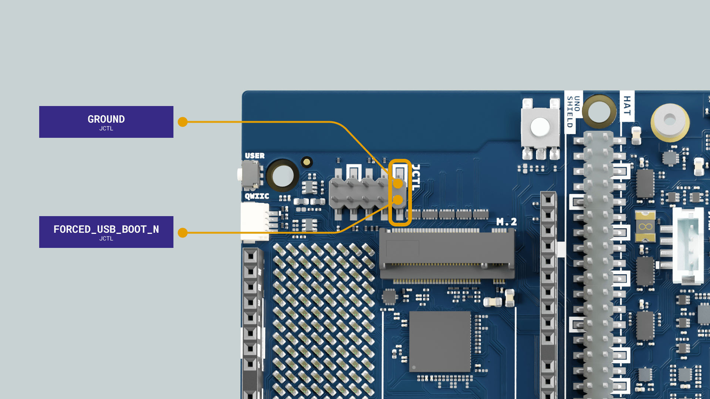

## Overview

In this tutorial, you will learn how to flash a fresh Ubuntu® operating system image onto your [Arduino® VENTUNO™ Q](https://store.arduino.cc/products/ventuno-q) using the **Arduino Flasher CLI** tool.

Flashing a new Linux® image allows you to install a clean operating system, perform system upgrades, or recover a board if the filesystem has become corrupted.

## Hardware and Software Requirements

### Hardware Requirements

- [Arduino® VENTUNO™ Q](https://store.arduino.cc/products/ventuno-q) (1x)
- [Arduino USB-C® Power Supply (65 W)](https://store.arduino.cc/products/usb-c-power-supply-65w) with DC barrel jack adapter (or external 7-24 V, ≥ 3 A power source)
- [Arduino USB Type-C® Cable 2in1](https://store.arduino.cc/products/usb-cable2in1-type-c) (or standard USB-C data cable)
- Jumper cap or female-to-female jumper wire (1x)

### Software Requirements

- [Arduino Flasher CLI](https://www.arduino.cc/en/software/#flasher-tool) (version 0.5.4 or newer)
- *(Optional)* A locally downloaded Ubuntu image archive (`.tar.zst` or `.tar.xz`)

## Step 1: Set the Board to Bootloader (EDL) Mode

To flash the board, the Qualcomm® Dragonwing™ IQ8 (QCS8275) processor must enter **Emergency Download Mode (EDL)**.

<Alert type="warning">

**Important:** Bridge the bootloader pins and power the board **before** connecting the USB-C cable to your computer. Failure to do so may prevent the flasher tool from detecting the device.

</Alert>

1. Disconnect the USB-C cable and unplug power from the VENTUNO Q.
2. Locate the 10-pin (2×5) **JCTL** (MPU Remote Debug) header on the board.
3. Bridge **Pin 1 (`GND`)** and **Pin 2 (`FORCED_USB_BOOT_N`)** using a jumper cap or female-to-female jumper wire.

   

4. Connect the external power supply to the barrel jack or screw terminal.
5. With the board powered and the jumper in place, connect the USB-C data cable to your computer.

<Alert type="info">

**Tip:** Once the board is powered and connected to your computer in EDL mode, you can safely remove the jumper. The board will stay in bootloader mode until it is power-cycled.

</Alert>

## Step 2: Download and Prepare the Arduino Flasher CLI

Download the latest **Arduino Flasher CLI** release from the [Arduino Software](https://www.arduino.cc/en/software/#flasher-tool) page or the [GitHub Releases page](https://github.com/arduino/arduino-flasher-cli/releases). Choose the package for your operating system and architecture:

| Operating system | Package                                                  |
| :--------------- | :------------------------------------------------------- |
| macOS            | Apple Silicon (`darwin-arm64`) or Intel (`darwin-amd64`) |
| Linux            | 64-bit x86 (`linux-amd64`) or ARM64 (`linux-arm64`)      |
| Windows          | 64-bit (`windows-amd64.zip`)                             |

Extract the archive, then open a terminal or command prompt and navigate to the extracted directory.

<Alert type="info">

**macOS tip:** Use **Archive Utility** to preserve the executable permissions.

</Alert>

<Alert type="info">

**Linux users:** Configure the `udev` rule for Qualcomm devices with vendor ID `05c6` and add your user to the `dialout` group. Follow the [Linux setup guide](/software/app-lab/setup/linux/#step-2-configure-udev-rules) for instructions.

</Alert>

## Step 3: Flash the Ubuntu Image

Arduino Flasher CLI 0.5.4 adds the `ventunoq` board identifier used to download and flash the latest official Ubuntu image.

<Alert type="warning">

Flashing a VENTUNO Q erases the existing system and user data. Back up important files before continuing.

</Alert>

### Automatically Download and Flash the Latest Image

Run the command for your operating system:

**macOS / Linux:**

```bash
./arduino-flasher-cli flash ventunoq
```

**Windows:**

```bash
.\arduino-flasher-cli.exe flash ventunoq
```

When prompted to confirm, type `y` and press **Enter**. The tool finds the latest official VENTUNO Q Ubuntu image, downloads it, verifies its checksum, and flashes the board.

**Tip:** List the available versions using `list`, then use `--version` to flash a specific one. Replace `VERSION` with one shown by the `list` command.

```bash
./arduino-flasher-cli list ventunoq # this lists the available image versions
./arduino-flasher-cli flash ventunoq --version VERSION # this flashes the specified version
```

<Alert type="info">

On Windows, replace `./arduino-flasher-cli` with `.\arduino-flasher-cli.exe`.

</Alert>

## Step 4: Finalize, Reboot, and Verify

Once the CLI displays the message `The board has been successfully flashed`:

1. Disconnect the USB-C cable and unplug the power supply from the VENTUNO Q.
2. Remove the jumper from JCTL Pin 1 and Pin 2 if you have not already done so.
3. Reconnect the power supply to the barrel jack or screw terminal. Then reconnect the USB-C data cable, display, or network cable as needed.
4. Allow the board to complete its first boot into Ubuntu.

### Verify the Flashed Image

1. Open a terminal on the board or connect from your computer with ADB. For ADB setup instructions, see the [VENTUNO Q user manual](/tutorials/ventuno-q/user-manual/#access-via-adb).

   ```bash
   adb shell
   ```

2. Check the system build information:

   ```bash
   cat /etc/buildinfo
   ```

3. Confirm that the build information matches the image version you flashed.

## Troubleshooting

### Waiting for EDL Device

If the tool hangs with a `Waiting for EDL device` message:

- **Jumper not making contact:** Ensure the jumper securely shorts Pin 1 (`GND`) and Pin 2 (`FORCED_USB_BOOT_N`) on the JCTL header.
- **Power sequence:** Connect external power through the barrel jack or screw terminal before connecting the USB-C data cable to your computer.
- **Linux permissions:** Configure the `udev` rule for vendor ID `05c6` and add your user to the `dialout` group. See the [Linux setup guide](/software/app-lab/setup/linux/#step-2-configure-udev-rules).

### Communication Errors / USB Disconnects

- Avoid unpowered USB hubs or keyboard passthrough ports. Connect the USB-C cable directly to a native USB port on your computer.
- Use a high-quality USB-C data cable.

### Insufficient Temporary Disk Space

Downloading and extracting an image can require up to 12 GiB of free space. Use `--temp-dir` to select a location with enough capacity:

**macOS / Linux:**

```bash
./arduino-flasher-cli flash ventunoq --temp-dir /path/to/large/disk
```

**Windows:**

```bash
.\arduino-flasher-cli.exe flash ventunoq --temp-dir D:\path\to\large\disk
```
