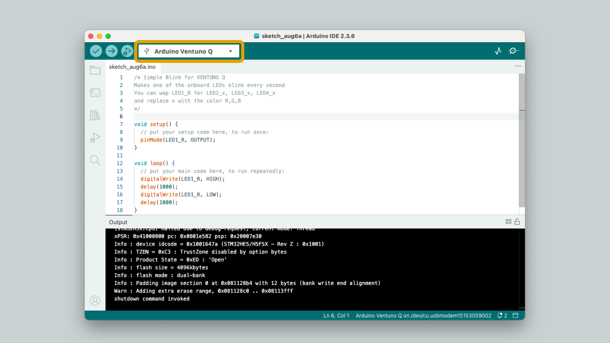
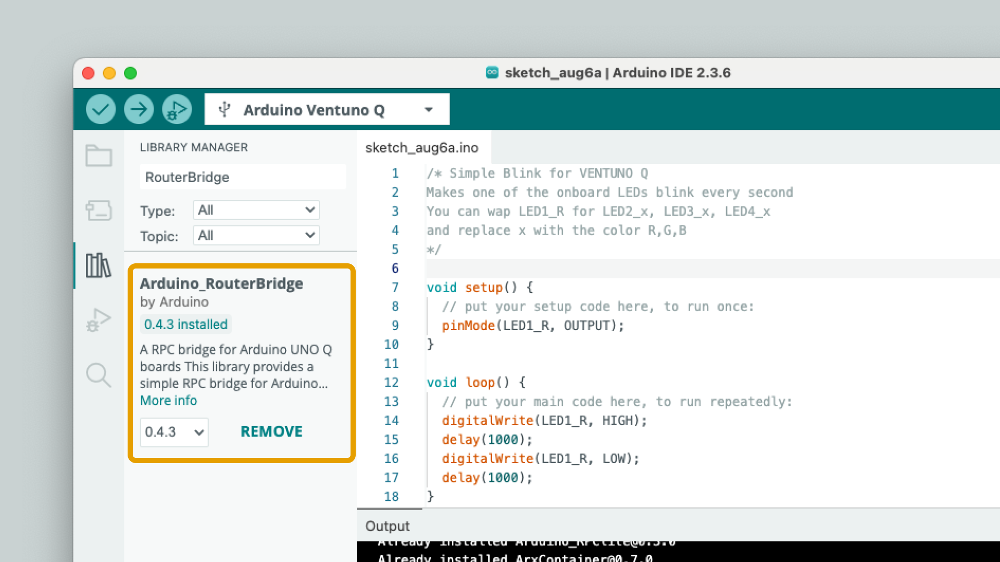

## Overview

This guide covers how to set up the Arduino IDE to program the **STM32H5F5 microcontroller** on the Arduino® VENTUNO™ Q using the Zephyr-based core.

## Hardware & Software Requirements

### Hardware Requirements

- [Arduino® VENTUNO™ Q](https://store.arduino.cc/products/ventuno-q) (1x)
- [Arduino® USB Type-C® Cable 2in1](https://store.arduino.cc/products/usb-cable2in1-type-c) (1x)

### Software Requirements

- [Arduino IDE 2+](https://www.arduino.cc/en/software)

## Arduino IDE (Beta)

The Arduino VENTUNO Q is compatible with the standard Arduino IDE, allowing you to program the board using the familiar Arduino language and ecosystem.



**The Arduino VENTUNO Q features a dual-processor architecture. The Arduino IDE targets and programs only the STM microcontroller. If you wish to program the Qualcomm Microprocessor, please refer to [Arduino App Lab](/software/app-lab/).***

## Installing the Arduino Q Board Core

To start using the board, you must first install the specific core that supports the VENTUNO Q board's architecture (based on Zephyr).

1. Open the Arduino IDE.
2. Navigate to **Tools > Board > Boards Manager...** or click the **Boards Manager** icon in the left sidebar.
3. In the search bar, type `Arduino Q Boards`.
4. Locate the **Arduino Q Boards** core and click **Install**.

<Alert type="info">**Troubleshooting:** If the core does not appear in the search results, you may need to add the package manually. Go to `File > Preferences` and add the following link to the Additional Boards Manager URLs field: `https://downloads.arduino.cc/packages/package_zephyr_index.json`</Alert>

## Hello World (Blink)

Once the core is installed, you can verify that everything is working by uploading the classic Blink sketch.

1. **Select the Board:** Go to **Tools > Board > Arduino VENTUNO Q Board** and select **Arduino VENTUNO Q**.
2. **Select the Port:** Connect your board via USB-C. Go to **Tools > Port** and select the port corresponding to your VENTUNO Q.
3. **Open the Example:** Go to **File > Examples > 01.Basics > Blink**.
4. **Upload:** Click the **Upload** button (right arrow icon) in the top toolbar.

Alternatively, copy and paste the code from below (blinks the RED LED every second).

```arduino
/* Simple Blink for VENTUNO Q
Makes one of the onboard LEDs blink every second
You can wap LED1_R for LED2_x, LED3_x, LED4_x 
and replace x with the color R,G,B
*/

void setup() {
  // put your setup code here, to run once:
  pinMode(LED1_R, OUTPUT);
}

void loop() {
  // put your main code here, to run repeatedly:
  digitalWrite(LED1_R, HIGH);
  delay(1000);
  digitalWrite(LED1_R, LOW);
  delay(1000);
}
```

The IDE will compile the sketch and upload it to the STM32 microcontroller. You should now see the red LED of the built-in RGB LED turning on for one second, then off for one second, repeatedly.


## RouterBridge Library

To use the **Arduino_RouterBridge** library that enables communication between the MCU and MPU, you need to install it first.

Open the library manager, and search for "Arduino_RouterBridge", and install it.


