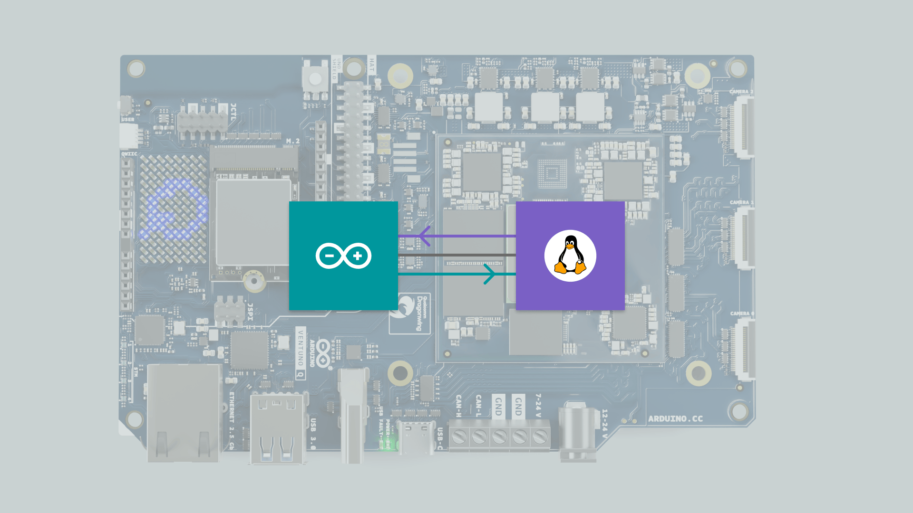
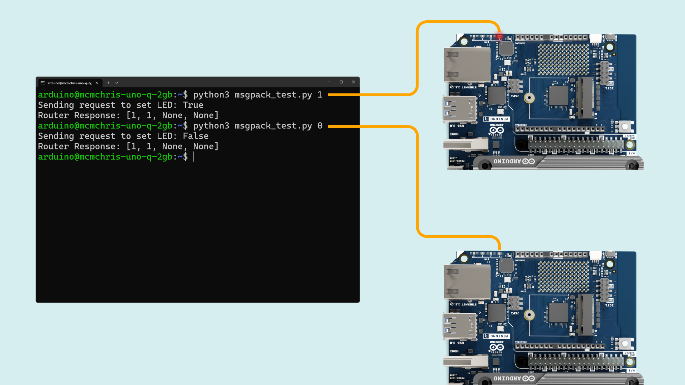

## Overview

This guide covers the **Bridge RPC library**, which enables communication between the Linux side (Qualcomm® QCS8275) and the real-time STM32H5F5 microcontroller on the Arduino® VENTUNO™ Q.

The Bridge library comes pre-bundled with the software installed on the VENTUNO Q, requiring no additional installation.

## Hardware & Software Requirements

### Hardware Requirements

- [Arduino® VENTUNO™ Q](https://store.arduino.cc/products/ventuno-q) (1x)
- [Arduino® USB Type-C® Cable 2in1](https://store.arduino.cc/products/usb-cable2in1-type-c) (1x)

### Software Requirements

- [Arduino App Lab](https://www.arduino.cc/en/software/#app-lab-section)

<Alert type="info">You can also use the [Arduino IDE 2+](https://www.arduino.cc/en/software) to program only the microcontroller side of the VENTUNO Q.</Alert>

### Bridge - Remote Procedure Call (RPC) Library

The VENTUNO Q uses RPC (Remote Procedure Call) to exchange data between the Linux (Qualcomm MPU) side and the real-time STM32 MCU. This mechanism allows functions running on one processor to be invoked transparently from the other, as if they were local calls.



#### Overview

The `Bridge` library provides a communication layer built on top of the `Arduino_RPClite` framework. It manages bidirectional RPC traffic between the SoC and MCU, handling method binding, request forwarding, and asynchronous responses.

- **Linux side (Qualcomm® QCS8275)**: Runs higher-level services and can remotely invoke MCU functions.
- **MCU side (STM32, Zephyr RTOS)**: Handles time-critical tasks and exposes functions to the Linux processor via RPC.

#### The Arduino Router (Infrastructure)

Under the hood, the communication is managed by a background Linux service called the **Arduino Router** (`arduino-router`).

While the `Bridge` library is what you use in your code, the Router is the traffic controller that makes it possible. It implements a **Star Topology** network using MessagePack RPC.

**Key Features:**

- **Multipoint Communication:** Unlike simple serial communication (which is typically point-to-point), the Router allows multiple Linux processes to communicate with the MCU simultaneously (and with each other).

  **Linux ↔ MCU:** Multiple Linux processes can interact with the MCU simultaneously (e.g., a Python® script reading sensors while a separate C++ application commands motors).

  **Linux ↔ Linux:** You can use the Router to bridge different applications running on the Linux system. For example, a Python script can expose an RPC function that another Python® or C++ application calls directly, allowing services to exchange data without involving the MCU at all.

- **Service Discovery:** Clients (like your Python® script or the MCU Sketch) "register" functions they want to expose. The Router keeps a directory of these functions and routes calls to the correct destination.

**Source Code:**

- **[Arduino Router Service](https://github.com/arduino/arduino-router)**
- **[Arduino_RouterBridge Library](https://github.com/arduino-libraries/Arduino_RouterBridge/tree/main)**

#### System Configuration & Hardware Interfaces

The Router manages the physical connection between the two processors. It is important to know which hardware resources are claimed by the Router to avoid conflicts in your own applications.

- **Linux Side (Dragonwing™ QCS8275):** The router claims the serial device `/dev/ttyHS1`.
- **MCU Side (STM32H5F5):** The router claims the hardware serial port `Serial1`.

<Alert type="warning" text="Warning">
**⚠️ WARNING: Reserved Resources**: Do not attempt to open `/dev/ttyHS1` (on Linux) or `Serial1` (on Arduino/Zephyr) in your own code. These interfaces are exclusively locked by the `arduino-router` service. Attempting to access them directly will cause the Bridge to fail.
</Alert>

#### Managing the Router Service

The arduino-router runs automatically as a system service. In most cases, you do not need to interact with it directly. However, if you are debugging advanced issues or need to restart the communication stack, you can control it via the Linux terminal:

**Check Status** to see if the router is running and connected:

```bash
systemctl status arduino-router
```

**Restart the Service** if the communication seems stuck, you can restart the router without rebooting the board:

```bash
sudo systemctl restart arduino-router
```

**View Logs** to view the real-time logs for debugging (e.g., to see if RPC messages are being rejected or if a client has disconnected):

```bash
journalctl -u arduino-router -f
```

To capture more detailed information in the logs, you can append the `--verbose` argument to the systemd service configuration.

- Open the service file for editing:

  ```bash
  sudo nano /etc/systemd/system/arduino-router.service
  ```

- Locate the line beginning with `ExecStart=` and append `--verbose` to the end of the command. The updated service file should look like this:

  ```bash
  [Unit]
  Description=Arduino Router Service
  After=network-online.target
  Wants=network-online.target
  Requires=

  [Service]
  # Put the micro in a ready state.
  ExecStartPre=-/usr/bin/gpioset -c /dev/gpiochip1 -t0 37=0
  ExecStart=/usr/bin/arduino-router --unix-port /var/run/arduino-router.sock --serial-port /dev/ttyHS1 --serial-baudrate 115200 --verbose # <--- ADD THIS
  # End the boot animation after the router is started.
  ExecStartPost=/usr/bin/gpioset -c /dev/gpiochip1 -t0 70=1
  StandardOutput=journal
  StandardError=journal
  Restart=always
  RestartSec=3

  [Install]
  WantedBy=multi-user.target
  ```

- You must reload the systemd daemon for the configuration changes to take effect.

  ```bash
  sudo systemctl daemon-reload
  ```

- Restart the Router:

  ```bash
  sudo systemctl restart arduino-router
  ```

- View the verbose logs:

  ```bash
  journalctl -u arduino-router -f
  ```

#### Core Components

`BridgeClass` The main class managing RPC clients and servers.

- `begin()`: Initializes the bridge and the internal serial transport.
- `call(method, args...)`: Invokes a function on the Linux side and waits for a result.
- `notify(method, args...)`: Invokes a function on the Linux side without waiting for a response (fire-and-forget).
- `provide(name, function)`: Exposes a local MCU function to Linux. Note: The function executes in the high-priority background RPC thread. Keep these functions short and thread-safe.
- `provide_safe(name, function)`: Exposes a local MCU function, but ensures it executes within the main `loop()` context. Use this if your function interacts with standard Arduino APIs (like `digitalWrite` or `Serial`) to avoid concurrency crashes.

<Alert type="warning" text="Warning">
**Warning:** Do not use `Bridge.call()` or `Monitor.print()` inside `provide()` functions. Initiating a new communication while responding to one causes system deadlocks.
</Alert>

`RpcCall`

- Helper class representing an asynchronous RPC. If its `.result` method is invoked, it waits for the response, extracts the return value, and propagates error codes if needed.

`Monitor`

- The library includes a pre-defined Monitor object. This allows the Linux side to send text streams to the MCU (acting like a virtual Serial Monitor) via the RPC method mon/write.

#### Threading and Safety

- The bridge uses Zephyr mutexes (`k_mutex`) to guarantee safe concurrent access when reading/writing over the transport. Updates are handled by a background thread that continuously polls for requests.
- **Incoming Updates**: Handled by a dedicated background thread (`updateEntryPoint`) that continuously polls for requests.
- **Safe Execution**: The provide_safe mechanism hooks into the main loop (`__loopHook`) to execute user callbacks safely when the processor is idle.

#### Usage Example (Arduino App Lab)

This example shows the **Linux side (Dragonwing™ QCS8275)** toggling an LED on the **MCU (STM32)** by calling a remote function over the Bridge.

Create a new App in the Arduino App Lab, then copy and paste the example below in the "Python" and "sketch" parts of your new App respectively.


1. **Linux (Dragonwing™ QCS8275) example to call a remote MCU function**

   This Python script runs on the Dragonwing™ QCS8275 and calls an MCU-exposed RPC named `set_led_state` once per second:

   ```python
   # main.py (Linux side)
   from arduino.app_utils import *
   import time

   led_state = False

   def loop():
       global led_state
       time.sleep(1)
       led_state = not led_state
       Bridge.call("set_led_state", led_state)

   App.run(user_loop=loop)
   ```

   This sends a boolean to the MCU every second using `Bridge.call("set_led_state", <bool>)`

2. **MCU (STM32) setup to include the Bridge and start it**

   This sketch includes the Bridge library and configures the LED pin.

   ```cpp
   #include "Arduino_RouterBridge.h"

   void setup() {
       pinMode(LED_BUILTIN, OUTPUT);

       Bridge.begin();
       Bridge.provide("set_led_state", set_led_state);
   }

   void loop() {
   }

   void set_led_state(bool state) {
       // LOW state means LED is ON
       digitalWrite(LED_BUILTIN, state ? LOW : HIGH);
   }
   ```

   This registers the local MCU function `set_led_state` as an RPC service named `"set_led_state"`, so that the Linux (Dragonwing™ QCS8275) side can call it remotely as if it were a local function using `Bridge.provide("set_led_state", set_led_state);`

<Alert type="info">You can do the same the other way around, Python functions can be provided to the MCU sketch to be used locally.</Alert>

After pasting the Python script into your App’s Python file and the Arduino code to the sketch, you can run the App and observe LED #1 blinking in red every second.


<Alert type="info">There are more advanced methods in the Bridge RPC library that you can discover by testing our different built-in examples inside Arduino App Lab.</Alert>

#### Interacting via Unix Socket (Advanced)

Linux processes communicate with the Router using a **Unix Domain Socket** located at:

`/var/run/arduino-router.sock`

While the `Bridge` library handles this automatically for you, you can manually connect to this socket to interact with the MCU or other Linux services using any language that supports **MessagePack RPC** (e.g., Python, C++, Rust, Go).

#### Usage Example (Custom Python Client)

The following example demonstrates how to control an MCU function (`set_led_state`) from a standard Python script using the `msgpack` library, without using the Arduino App Lab helper classes. This is useful for integrating Arduino functions into existing Linux applications.

**Prerequisites:**

1. **Flash the MCU Sketch**

   Upload the following code using the Arduino IDE or Arduino App Lab. This registers the function we want to call.

   ```cpp
   #include "Arduino_RouterBridge.h"

   void setup() {
     pinMode(LED_BUILTIN, OUTPUT);

     Bridge.begin();
     // We use provide_safe to ensure the hardware call runs in the main loop context
     Bridge.provide_safe("set_led_state", set_led_state);
   }

   void loop() {
   }

   void set_led_state(bool state) {
     digitalWrite(LED_BUILTIN, state ? LOW : HIGH);
   }
   ```

2. **Install the Python Dependency**

   Install the msgpack library using the system package manager:

   ```bash
   sudo apt install python3-msgpack
   ```

3. **Create the Python Script**

   Create a new file named msgpack_test.py:

   ```bash
   nano msgpack_test.py
   ```

4. **Add the Script Content**

   Copy and paste the following code. This script connects manually to the Router's Unix socket and sends a raw RPC request.

   ```python
   import socket
   import msgpack
   import sys

   # 1. Define the connection to the Router's Unix Socket
   SOCKET_PATH = "/var/run/arduino-router.sock"

   # 2. Parse command line arguments
   # Default to turning LED ON (True) if no argument is provided
   led_state = True

   if len(sys.argv) > 1:
       arg = sys.argv[1]
       if arg == "1":
           led_state = True
       elif arg == "0":
           led_state = False
       else:
           print("Usage: python3 msgpack_test.py [1|0]")
           sys.exit(1)

   print(f"Sending request to set LED: {led_state}")

   # 3. Create the MessagePack RPC Request
   # Format: [type=0 (Request), msgid=1, method="set_led_state", params=[led_state]]
   request = [0, 1, "set_led_state", [led_state]]
   packed_req = msgpack.packb(request)

   # 4. Send the request
   try:
       with socket.socket(socket.AF_UNIX, socket.SOCK_STREAM) as client:
           client.connect(SOCKET_PATH)
           client.sendall(packed_req)

           # 5. Receive the response
           response_data = client.recv(1024)
           response = msgpack.unpackb(response_data)

           # Response Format: [type=1 (Response), msgid=1, error=None, result=None]
           print(f"Router Response: {response}")

    except Exception as e:
        print(f"Connection failed: {e}")
    ```

#### Running the Example

You can now test the connection by running the script from the terminal and passing `1` (ON) or `0` (OFF):

```bash
python3 msgpack_test.py 1 # to turn on the LED
# or
python3 msgpack_test.py 0 # to turn off the LED
```


