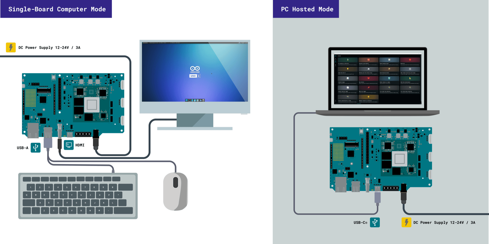
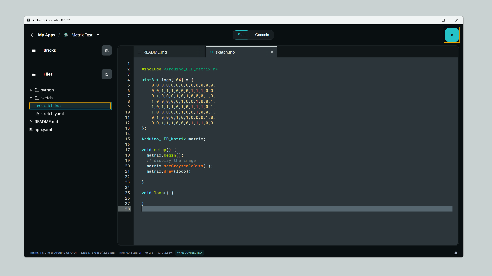
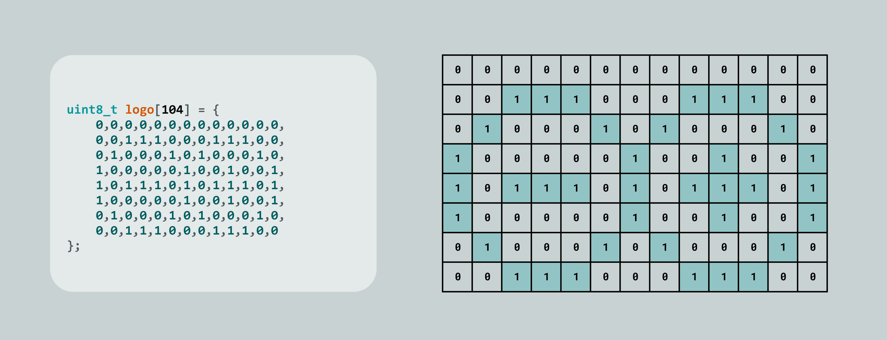

## Overview

This guide covers how to use the **8×13 LED matrix** on the Arduino® VENTUNO™ Q, which is controlled by the STM32H5F5 microcontroller. Examples include drawing custom images and using the built-in grayscale support.

## Hardware & Software Requirements

### Hardware Requirements

- [Arduino® VENTUNO™ Q](https://store.arduino.cc/products/ventuno-q) (1x)
- [Arduino® USB Type-C® Cable 2in1](https://store.arduino.cc/products/usb-cable2in1-type-c) (1x)

### Software Requirements

- [Arduino App Lab](https://www.arduino.cc/en/software/#app-lab-section)

---

Here is a list of basic examples for using the **LED matrix**. To test them, follow the steps below:

- Connect the VENTUNO Q to your PC (if you are not in single-board computer mode).

  

- Open the Arduino App Lab, navigate to **My Apps** and click on **Create new app+**.

  

- A new App must be created to test each of the examples below.

#### Image Drawing

This example is for drawing **custom frames** in the LED matrix, specifically the Arduino logo.

You can copy and paste the following example into the "sketch" part of your new App in the Arduino App Lab.

```cpp
#include <Arduino_LED_Matrix.h>

uint8_t logo[104] = {
    0,0,0,0,0,0,0,0,0,0,0,0,0,
    0,0,1,1,1,0,0,0,1,1,1,0,0,
    0,1,0,0,0,1,0,1,0,0,0,1,0,
    1,0,0,0,0,0,1,0,0,1,0,0,1,
    1,0,1,1,1,0,1,0,1,1,1,0,1,
    1,0,0,0,0,0,1,0,0,1,0,0,1,
    0,1,0,0,0,1,0,1,0,0,0,1,0,
    0,0,1,1,1,0,0,0,1,1,1,0,0
};

Arduino_LED_Matrix matrix;

void setup() {
  matrix.begin();
  // display the image
  matrix.setGrayscaleBits(1);
  matrix.draw(logo);

}

void loop() {

}

```

It should look like this in the Arduino App Lab:



You can create your own frame by creating an array following the matrix format (8x13) with 1's and 0's as in the example from above:



Execute the App by clicking on the **Run** button in the Arduino App Lab and you should see the LED matrix showing your frame.

#### Dimmable LEDs

The LED matrix supports 8 levels of grayscale (3 bits) so you can manage the LED brightness individually.

You can set the brightness bits with the function `setGrayscaleBits(bits)` as shown below:

```cpp
matrix.setGrayscaleBits(3); // 3 bits result on 8 brightness levels (0 to 7)
```

As usual conversion tools to grayscale uses 256 levels (8 bits) so you can also use this range, and it will be automatically mapped.

```cpp
matrix.setGrayscaleBits(8); // 8 bits result on 256 brightness levels (0 to 255)
```

This example is for showing the **supported grayscale** in the LED matrix.

You can copy and paste the following example into the "sketch" part of your new App in the Arduino App Lab.

```cpp
#include <Arduino_LED_Matrix.h>

uint8_t shades[104] = {
    0,0,0,0,0,0,0,0,0,0,0,0,0,
    1,1,1,1,1,1,1,1,1,1,1,1,1,
    2,2,2,2,2,2,2,2,2,2,2,2,2,
    3,3,3,3,3,3,3,3,3,3,3,3,3,
    4,4,4,4,4,4,4,4,4,4,4,4,4,
    5,5,5,5,5,5,5,5,5,5,5,5,5,
    6,6,6,6,6,6,6,6,6,6,6,6,6,
    7,7,7,7,7,7,7,7,7,7,7,7,7
};

Arduino_LED_Matrix matrix;

void setup() {
  matrix.begin();
  // display the image
  matrix.setGrayscaleBits(3);
  matrix.draw(shades);

}

void loop() {

}
```

Execute the App by clicking on the **Run** button in the Arduino App Lab and you should see the LED matrix showing your frame.
