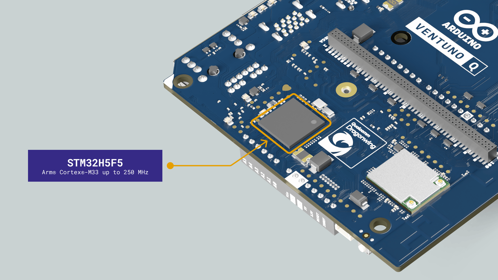
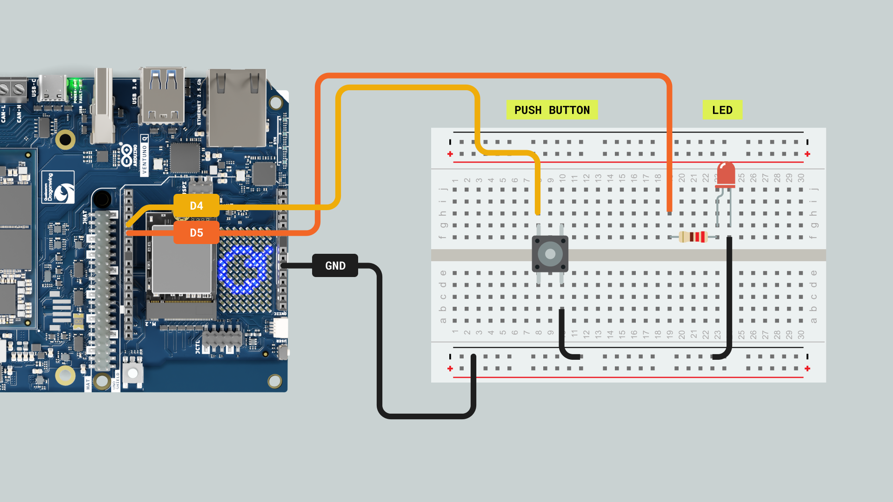
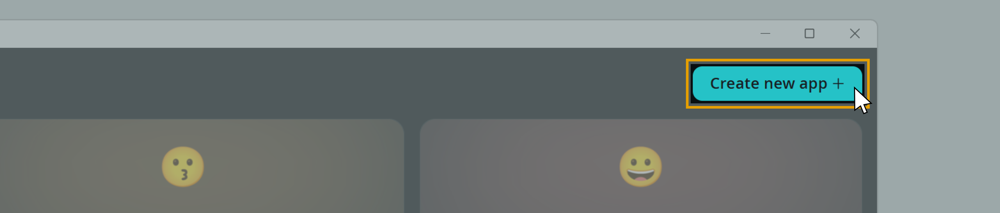
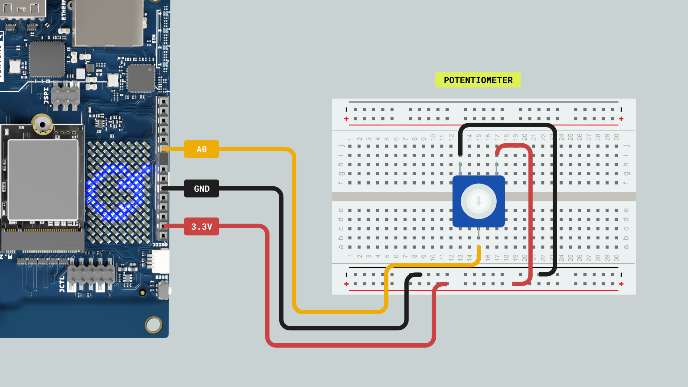
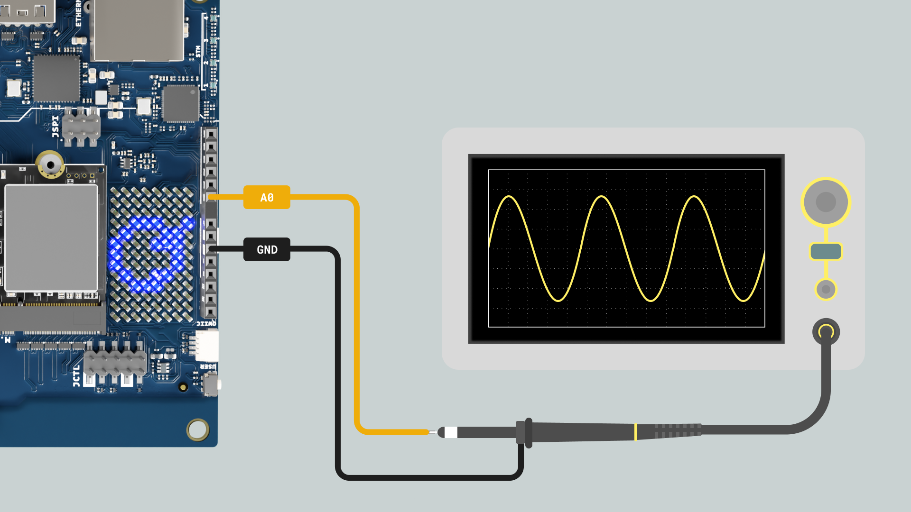
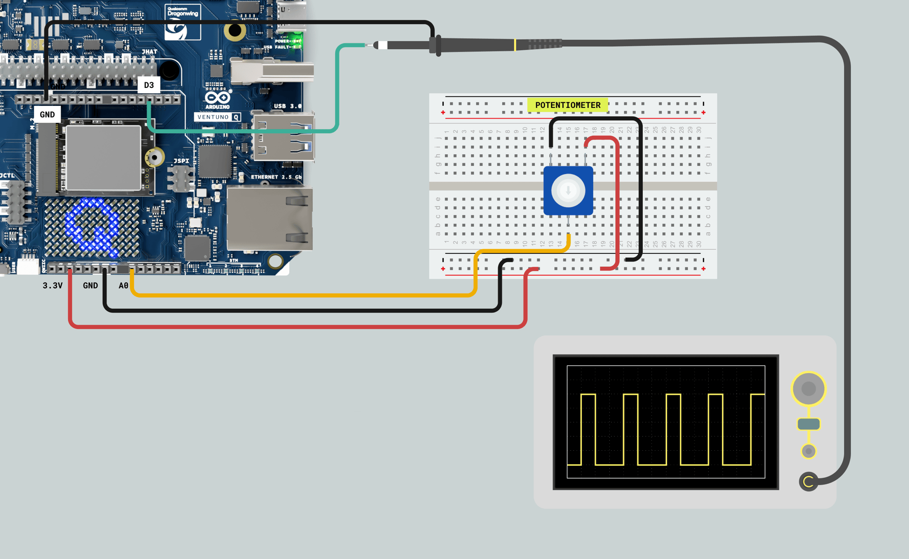
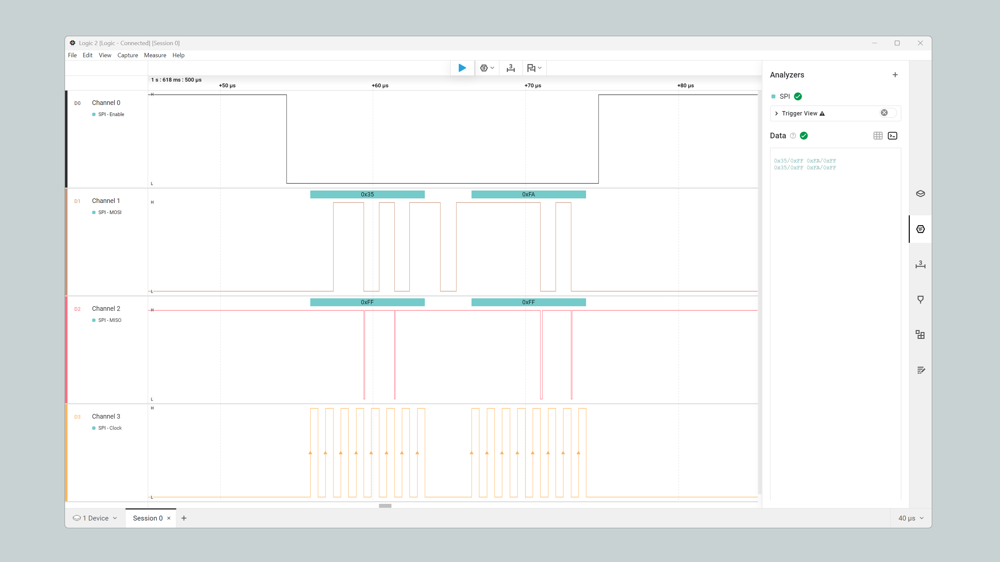
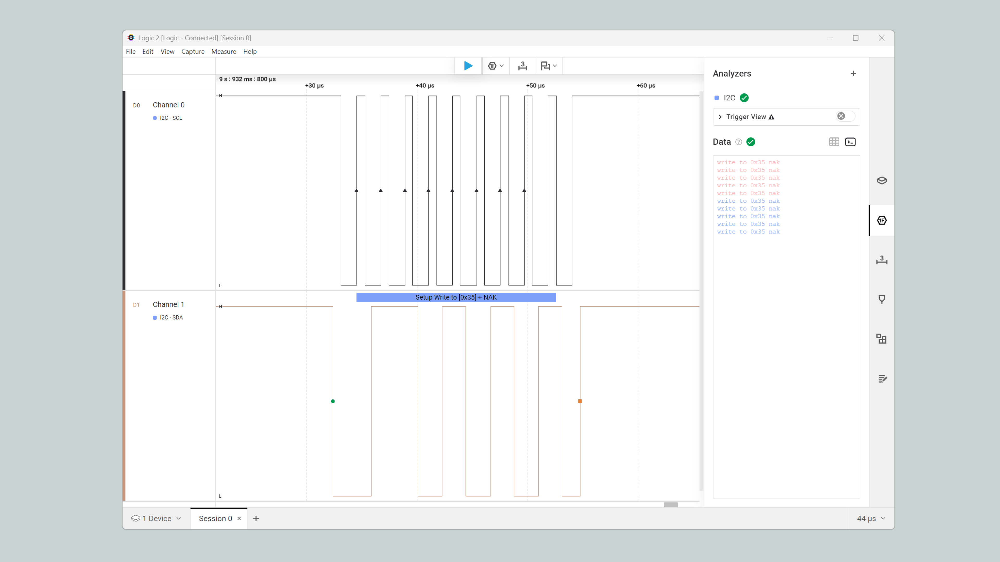
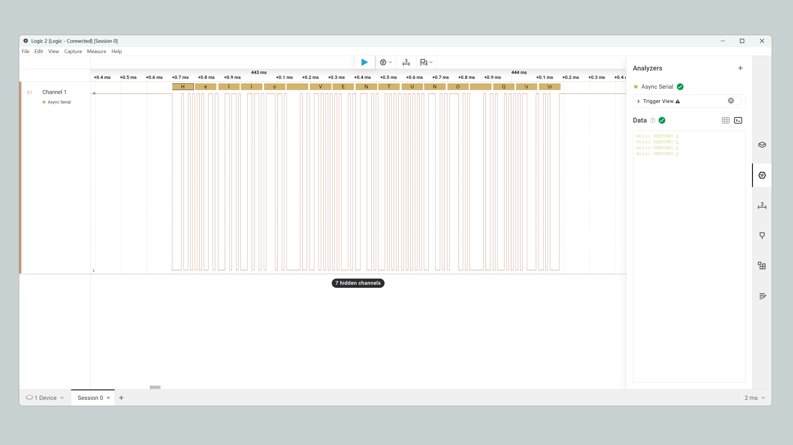
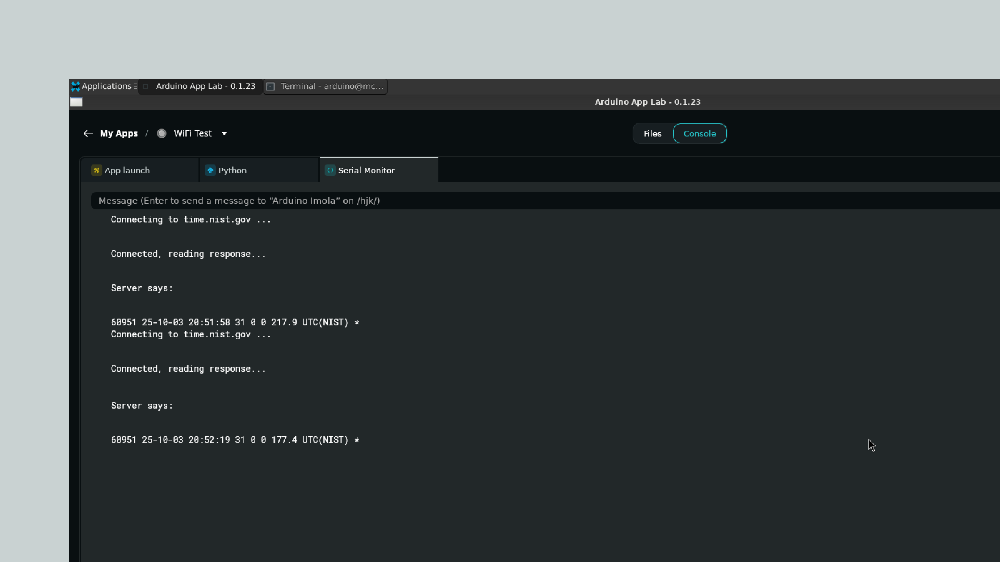

## Overview

This guide covers common examples that run on the Arduino® VENTUNO™ Q's MCU, including I2C, SPI, UART, and analog & digital I/O.



Examples in this guide are designed to run in the Arduino App Lab environment, with a complete set of instructions to run them on the VENTUNO Q.

## Hardware & Software Requirements

### Hardware Requirements

- [Arduino® VENTUNO™ Q](https://store.arduino.cc/products/ventuno-q) (1x)
- [Arduino® USB Type-C® Cable 2in1](https://store.arduino.cc/products/usb-cable2in1-type-c) (1x)
- [Arduino® USB-C Power Supply (65W)](https://store.arduino.cc/products/usb-c-power-supply-65w)

<Alert type="info">Most examples require additional components to work, such as common electronic components (LEDs, pushbuttons, resistors).</Alert>

### Software Requirements

- [Arduino App Lab](https://www.arduino.cc/en/software/#app-lab-section)

## Digital Pins

The digital pins of the VENTUNO Q can be used as inputs or outputs through the built-in functions of the Arduino programming language.

The configuration of a digital pin is done in the `setup()` function with the built-in function `pinMode()` as shown below:

```cpp
// Pin configured as an input
pinMode(pin, INPUT);
// Pin configured as an output
pinMode(pin, OUTPUT);
// Pin configured as an input, internal pull-up resistor enabled
pinMode(pin, INPUT_PULLUP);
```

The state of a digital pin, configured as an input, can be read using the built-in function `digitalRead()` as shown below:

```cpp
// Read pin state, store value in a state variable
state = digitalRead(pin);
```

The state of a digital pin, configured as an output, can be changed using the built-in function `digitalWrite()` as shown below:

```cpp
// Set pin on
digitalWrite(pin, HIGH);
// Set pin off
digitalWrite(pin, LOW);
```

The example code shown below uses digital pin `D5` to control an LED and reads the state of a button connected to digital pin `D4`:



Create a new App in the Arduino App Lab, then copy and paste the example below in the "sketch" part of your new App.



**sketch.ino:**

```cpp
// Define button and LED pin
int buttonPin = D4;
int ledPin = D5;

// Variable to store the button state
int buttonState = 0;

void setup() {
  // Configure button and LED pins
  pinMode(buttonPin, INPUT_PULLUP);
  pinMode(ledPin, OUTPUT);

  // Initialize Serial communication
  Serial.begin(9600);
}

void loop() {
  // Read the state of the button
  buttonState = digitalRead(buttonPin);

  // If the button is pressed, turn on the LED and print its state to the Serial Monitor
  if (buttonState == LOW) {
    digitalWrite(ledPin, HIGH);
    Serial.println("- Button is pressed. LED is on.");
  } else {
    // If the button is not pressed, turn off the LED and print to the Serial Monitor
    digitalWrite(ledPin, LOW);
    Serial.println("- Button is not pressed. LED is off.");
  }

  // Wait for 1000 milliseconds
  delay(1000);
}
```

## Analog Pins

The VENTUNO Q features the well-known analog pins in the **JANALOG** connector; more details on how to use them below:

### Analog to Digital Converter (ADC)

The example code shown below reads the analog input value from a potentiometer connected to `A0` and displays it on the Serial Monitor. To understand how to properly connect a potentiometer to the VENTUNO Q, take the following image as a reference:



Create a new App in the Arduino App Lab, then copy and paste the example below in the "sketch" part of your new App.


**sketch.ino:**

```cpp
int sensorPin = A0;   // select the input pin for the potentiometer

int sensorValue = 0;  // variable to store the value coming from the sensor

void setup() {
  Serial.begin(9600);
}

void loop() {
  // read the value from the sensor:
  sensorValue = analogRead(sensorPin);

  Serial.println(sensorValue);
  delay(100);
}
```

### Digital to Analog Converter (DAC)

To output an analog voltage value through a DAC pin, use the `analogWrite()` function with the DAC channel as an argument. See the example below:

```cpp
analogWrite(DAC0, value);   // the value should be in the range of the DAC resolution (e.g. 0-4095 with a 12 bits resolution)
```

<Alert type="info">If a normal GPIO is passed to the `analogWrite()` function, the output will be a PWM signal.</Alert>

The following sketch will create a **60 Hz sine wave** signal in the `A0/DAC0` VENTUNO Q pin:

Create a new App in the Arduino App Lab, then copy and paste the example below in the "sketch" part of your new App.


**sketch.ino:**

```cpp
const float freq = 60.0f;
const int   N    = 256;     // 256 samples/cycle
const uint32_t Ts_us = (uint32_t)llroundf(1e6f / (freq * N));

uint16_t lut[N]; // store the sine wave here

void setup() {
  analogWriteResolution(12);

  for (int i = 0; i < N; ++i){
      lut[i] = 2048 + (1000.0 * sin(2 * PI * i / N));
  }

}

void loop() {
  static uint32_t t_next = micros();
  for (int i = 0; i < N; ++i) {
    analogWrite(DAC0, lut[i]);  // output the sine wave values
    t_next += Ts_us;
    while ((int32_t)(micros() - t_next) < 0) { /* spin */ }
  }
}

```

The DAC output should look like the image below:



## PWM Example

Here is an example of how to create a variable duty-cycle PWM signal:

Create a new App in the Arduino App Lab, then copy and paste the example below in the "sketch" part of your new App.


**sketch.ino:**

```cpp
const int analogInPin = A0;  // Analog input pin that the potentiometer is attached to
const int pwmOutPin = D3;    // PWM output pin

int sensorValue = 0;  // value read from the pot
int outputValue = 0;  // value output to the PWM (analog out)

void setup() {
  // Define the PWM output resolution
  analogWriteResolution(10);  // 0 - 1023 -> 0 - 100% duty-cycle
  analogReadResolution(14);   // 0 - 16383
}

void loop() {
  // read the analog in value:
  sensorValue = analogRead(analogInPin);
  // map it to the range of the analog out:
  outputValue = map(sensorValue, 0, 16383, 0, 1024);
  // change the analog out value:
  analogWrite(pwmOutPin, outputValue);

  // wait 2 milliseconds before the next loop for the ADC
  // to settle after the last reading:
  delay(2);
}
```

Now you can control the PWM signal duty-cycle by turning the potentiometer.



<Alert type="info">PWM frequency is fixed to 500 Hz.</Alert>

## Communication Protocols

### SPI

To transmit data to an SPI-compatible device, you can use the commands used in the following example:

Create a new App in the Arduino App Lab, then copy and paste the example below in the "sketch" part of your new App.


```cpp
#include <SPI.h>

#define SS D10

void setup() {
  // Set the chip select pin as output
  pinMode(SS, OUTPUT);

  // Pull the SS pin HIGH to unselect the device
  digitalWrite(SS, HIGH);

  // Initialize the SPI communication
  SPI.begin();
}

void loop() {
  // Replace with the target device’s address
  byte address = 0x35;
  // Replace with the value to send
  byte value = 0xFA;
  // Pull the SS pin LOW to select the device
  digitalWrite(SS, LOW);
  // Send the address
  SPI.transfer(address);
  // Send the value
  SPI.transfer(value);
  // Pull the SS pin HIGH to unselect the device
  digitalWrite(SS, HIGH);

  delay(2000);
}
```

The example code above should output this:



### I2C

To transmit data to an I2C-compatible device, you can use the commands used in the following example:

Create a new App in the Arduino App Lab, then copy and paste the example below in the "sketch" part of your new App.


```cpp
#include <Wire.h>

void setup() {
  // Initialize the I2C communication
  Wire.begin();
}

void loop() {
  // Replace with the target device’s I2C address
  byte deviceAddress = 0x35;
  // Replace with the appropriate instruction byte
  byte instruction = 0x00;
  // Replace with the value to send
  byte value = 0xFA;
  // Begin transmission to the target device
  Wire.beginTransmission(deviceAddress);
  // Send the instruction byte
  Wire.write(instruction);
  // Send the value
  Wire.write(value);
  // End transmission
  Wire.endTransmission();

  delay(2000);
}
```

The example code above should output this:



### UART

To test the UART transmit method use the following example, remember to create a new App in the Arduino App Lab, then copy and paste the example below:

```cpp
void setup() {
  // Initialize the hardware UART at 115200 bps
  Serial1.begin(115200);
}

void loop() {
  // Transmit the string "Hello VENTUNO Q" followed by a newline character
  Serial1.println("Hello VENTUNO Q");
  delay(1000);
}
```

You should get the following in the **TX** and **RX** pins of your VENTUNO Q board, I am using a logic analyzer to capture the data:



To read incoming data, you can use a `while()` loop to continuously check for available data and read individual characters. The code shown below stores the incoming characters in a String variable and processes the data when a line-ending character is received:

```cpp
String incoming = "";

void setup() {
  // Initialize the hardware UART at 115200 baud
  Serial1.begin(115200);
}

void loop() {
  while (Serial1.available()) {
    char c = Serial1.read();

    if (c == '\n') {
      // Echo the buffered message and add a newline
      Serial1.println(incoming);

      // Clear for the next message
      incoming = "";
    } else {
      incoming += c;
    }
  }
}
```

With this example the VENTUNO Q will send back whatever it receives on the UART.

<Alert type="info">To communicate over the hardware serial pins on the JDIGITAL connector, the `Serial1` object must be used. Otherwise, `Serial` will communicate with your USB serial terminal.</Alert>

## Enabling Wi-Fi® on the MCU

Since the radio module is connected to the Dragonwing™ QCS8275, we need the **Bridge** to expose the connectivity to the microcontroller.

The following example gets the UTC time using TCP over socket RPC calls and prints it in the Serial Monitor:

Create a new App in the Arduino App Lab, then copy and paste the example below in the "sketch" part of your new App.


```cpp
BridgeTCPClient<> client(Bridge);

void setup() {
  if (!Bridge.begin()) {
    while (true) {}
  }

  Serial.begin(9600);

  Serial.println("TCP Daytime Demo started");
}

void loop() {
  Serial.println("\nConnecting to time.nist.gov ...");

  if (client.connect("time.nist.gov", 13) < 0) {
    Serial.println("Connection failed!");
    delay(5000);
    return;
  }

  Serial.println("Connected, reading response...");
  String line;
  while (client.connected() || client.available()) {
    if (client.available()) {
      char c = client.read();
      if (c == '\n') break; // daytime sends one line
      if (c != '\r') line += c;
    }
  }

  Serial.print("Server says: ");
  Serial.println(line);

  client.stop();
  delay(10000);
}
```

Once running, open the Arduino App Lab Serial Monitor and you will see the time and date retrieved from the `time.nist.gov` server.



## Summary

In this guide, you have successfully explored the microcontroller capabilities of the VENTUNO Q. You learned how to interact with the physical world using digital and analog I/O, generate PWM signals, and communicate with external sensors and modules using SPI, I2C, and UART protocols.

Additionally, you experienced the power of the VENTUNO Q's hybrid architecture by using the `Bridge` library, allowing the STM32 MCU to seamlessly access the Wi-Fi connectivity provided by the Linux-based MPU.

### Further Reading

- [Arduino VENTUNO Q User Manual](/tutorials/ventuno-q/user-manual/) - a complete reference to the features of the VENTUNO Q.
- [Arduino App Lab Documentation](/software/app-lab/) - a complete reference to the Arduino App Lab.
