## Introduction

This tutorial explains how to install RetroArch on the **Arduino® VENTUNO™ Q**, making it into a standalone gaming console. Using console commands to easily install all the software needed, using RetroArch as the primary software to run games and configure game, input and video settings. With the built in connectors present on the board connect everything you need, a screen, keyboard and mouse. And if you want to output sound use a USB or Bluetooth speaker.

## What You'll Build

In this tutorial you will:

- Set up the VENTUNO Q with hardware.
- Install and configure RetroArch.
- Control games with Keyboard and mouse connected to the VENTUNO Q.
- Connect a speaker to the VENTUNO Q.

## Hardware Requirements

- [Arduino® VENTUNO™ Q](https://store.arduino.cc/products/ventuno-q)
- [Arduino® USB-C Power Supply (65W)](https://store.arduino.cc/products/usb-c-power-supply-65w) (or another 12-24 V power supply)
- HDMI display and cable
- USB keyboard and mouse
- A USB or Bluetooth speaker (optional)

## Hardware Setup

For the next steps we need to have a monitor, keyboard and mouse connected to the VENTUNO Q.

- Connect your monitor, mouse and keyboard directly to the VENTUNO Q.
- The VENTUNO Q will power on by connecting a power supply to the barrel jack connector.
- Make sure the monitor has its own power supply.

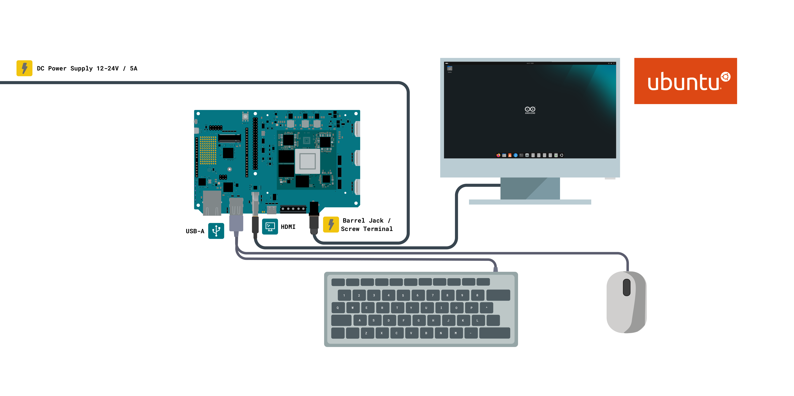

<Alert type="info">

The barrel jack supports 7-24 V up to 5 A. With 12 V / 5 A or 24 V / 3 A as the recommended target. Please make sure your power supply meets these requirements.

</Alert>

## Board Setup

Once the VENTUNO Q has booted and the monitor is connected, complete the initial board setup.

- Connect the board to your network.
- Create a password for the board. You will need this password later during software installation.
- Open the command line terminal.

## RetroArch's Installation

RetroArch is an open-source frontend that provides a unified interface for running software components known as cores. This allows you to configure controllers, video settings, save states, and other features once and use them across different gaming platforms.

A typical RetroArch setup consists of:

- **RetroArch** - The frontend application that provides the user interface and manages input, audio, video, and save states.
- **Cores** - Software components that add support for specific gaming platforms.
- **ROMs** - Game files loaded by a core. These contain the data from the original cartridge, disk, or game media.

In this tutorial we will install the following open-source components:

- **RetroArch** (GPLv3)
- **RetroArch Assets** - the menu themes, icons, and graphical assets
- **libretro-core-info** - the metadata files RetroArch uses to identify and list cores
- **Beetle PSX** (GPL-2+) - a PlayStation 1 core

<Alert type="info">

Important: RetroArch and its cores do not include games. Before downloading or using any ROM, verify that you have the legal right to use it and that its license permits your intended use. Many commercial games remain protected by copyright even if the original hardware is no longer sold.

</Alert>

Install RetroArch and the selected components by running:

```arduino
sudo apt install -y retroarch retroarch-assets libretro-core-info libretro-beetle-psx
```

This will provide a core that support Playstation 1 games.

## Setting Up RetroArch

Now that RetroArch has been installed, it is time to configure it to make it work! You can close the terminal and click on: Show Apps -> RetroArch

The first time you open RetroArch you will see something similar to:

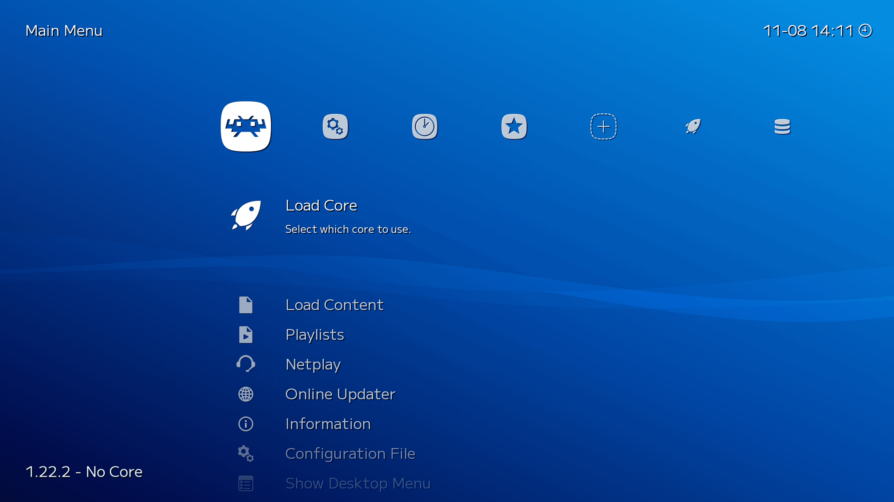

You will need to use your mouse and keyboard to move through the menu!

Move to the right to Settings and go down to Input and enter the menu:

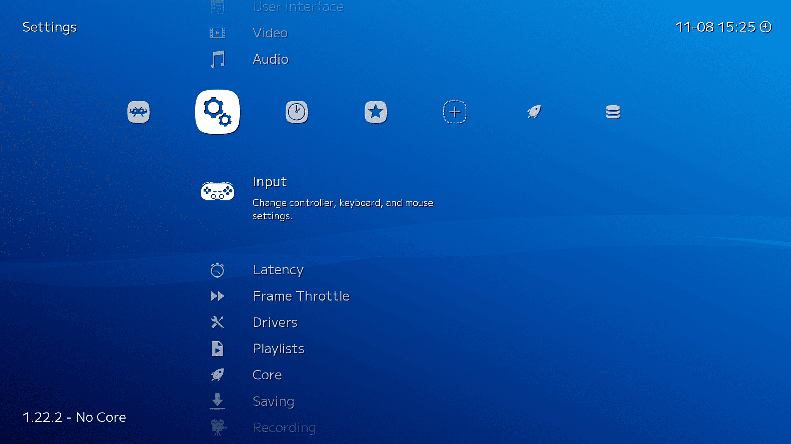

Click on RetroPad Binds and select Port 1 Controls:

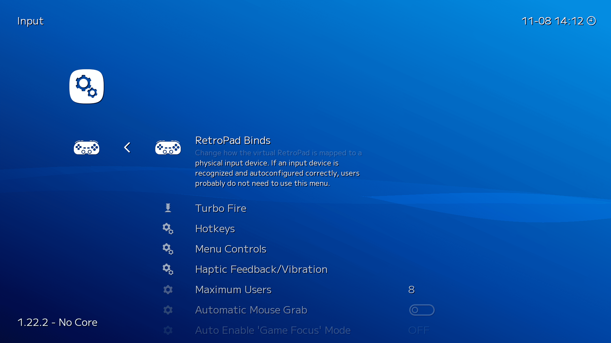

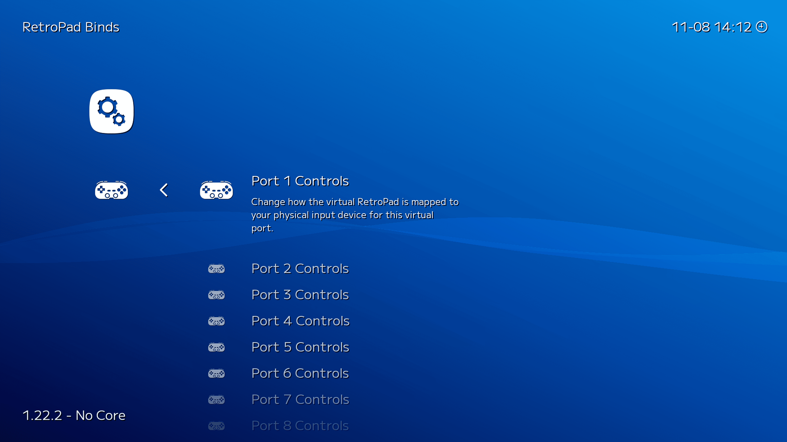

Inside the menu make sure you bind the controls to the keyboard keys that you want to use to control the game.

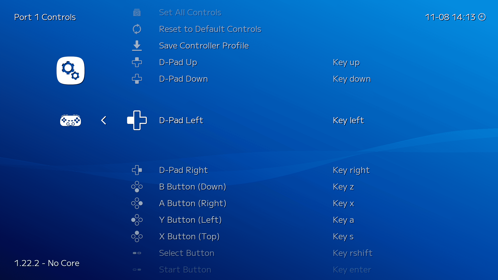

Now your controller should work perfectly! Repeat the process with player 2 and any additional controllers!

## Setting the Video Driver

The video driver that RetroArch uses can easily be changed using the RetroArch UI, it can also be changed directly in the config file. The different options for video drivers are:

- Vulkan
- GL
- SDL2

The driver that works best for the VENTUNO Q is Vulkan. Make sure this driver is selected. Go to the "Settings" tab, it is one step to the right of the main menu that RetroArch launches on. On the "Settings" tab scroll down to "Drivers"

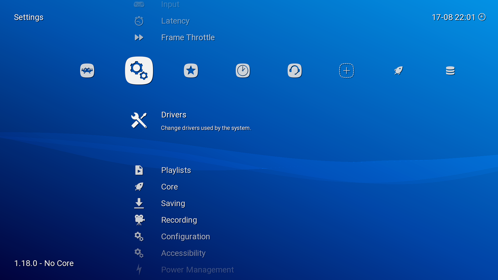

After going in to drivers find the "Video" option, here you can change the video drivers. If it is not already set to "vulkan" then go ahead and do so.

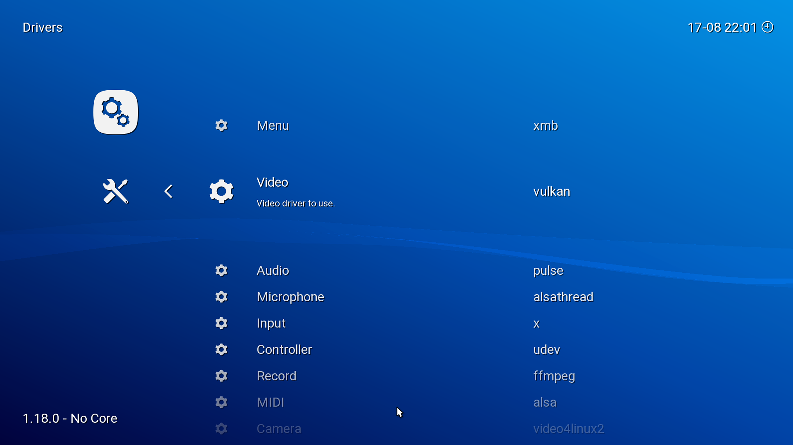

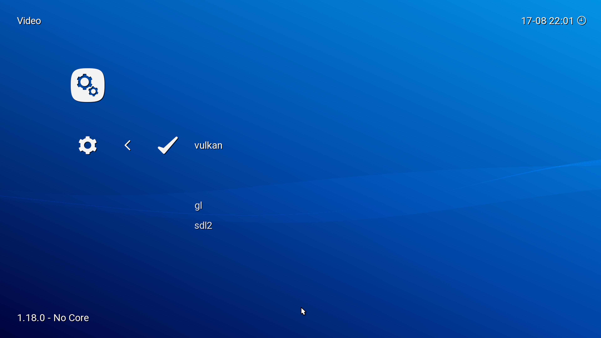

## Setting Up Core and Games

To play any game with RetroArch a "Core" and BIOS file is required. The core has been installed with the RetroArch install command we used before. The BIOS file however have to be downloaded separately, you can find these files online.

<Alert type="info">

Important: The BIOS file required is dependent on the region the game is made for, there are different BIOS files for different regions. Make sure you have the correct BIOS file for the game you are trying to run.

</Alert>

The BIOS files should be placed in the "System" folder inside the RetroArch folder. This folder can be found in the "Home" folder, press CTRL + H to show hidden folders, then go into the ".config" folder.

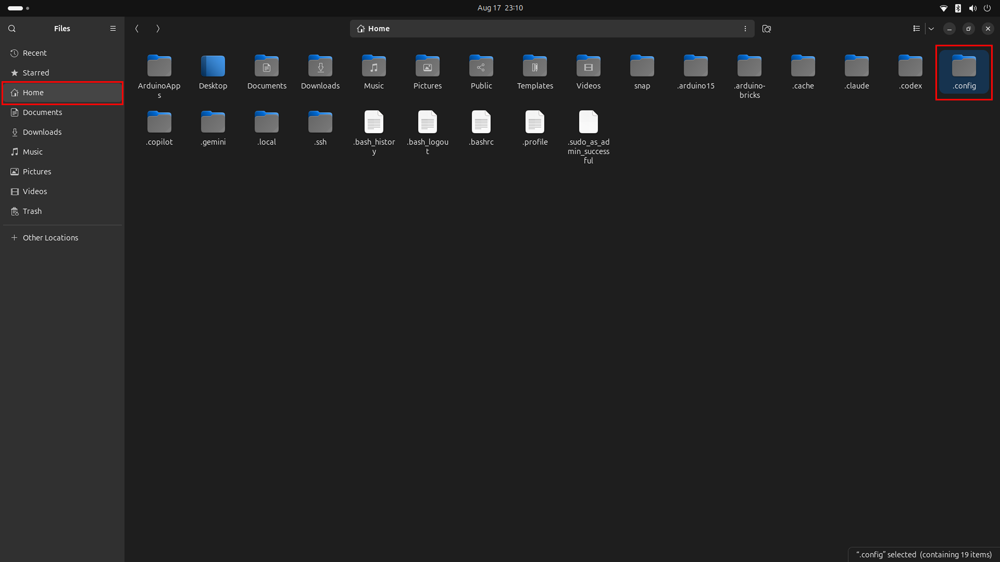

In here find the "RetroArch" folder.

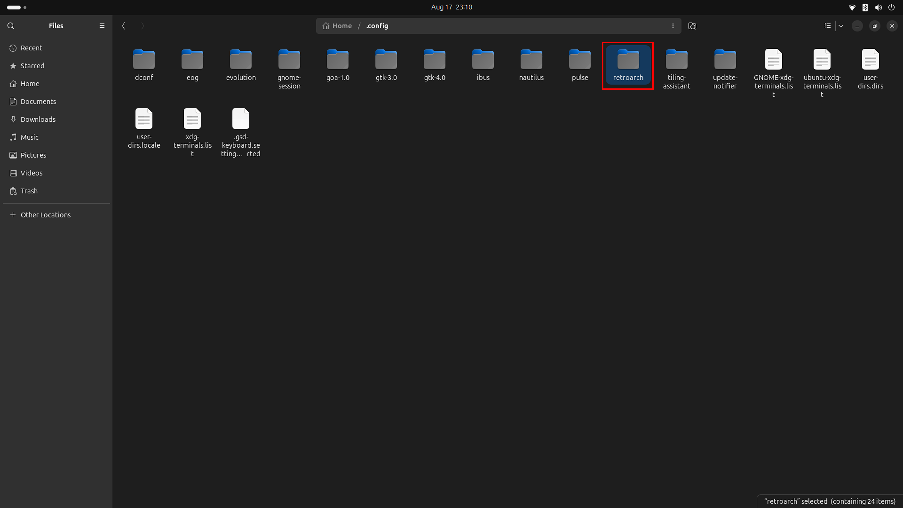

And finally in the RetroArch folder find the "System" folder. You can put all the BIOS files in here, no subfolders inside "System" is needed.

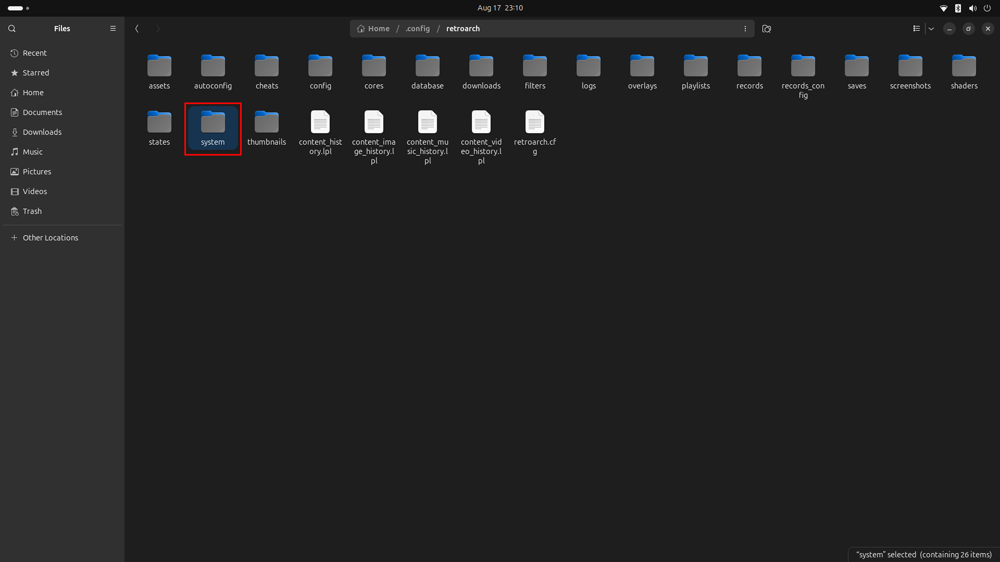

Now we can load the core. Load it by going to the "Load Core" option in the left most menu. As shown here:

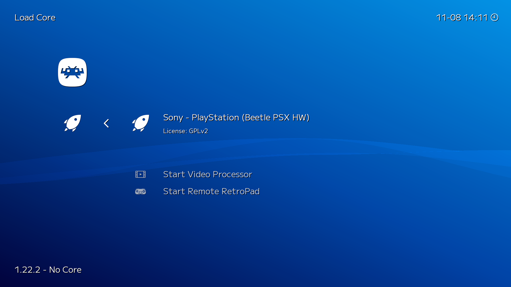

When a Core is loaded, information about the loaded Core will be displayed in the bottom left corner. Now you are ready to download and play playstation 1 games!

You can find free indie games that are created for playstation 1 emulators here: <http://itch.io/>.

Find and download a game that you want to play! When the game is downloaded go to "Load Content", find the folder that contains the game you downloaded and run the *.cue* file.

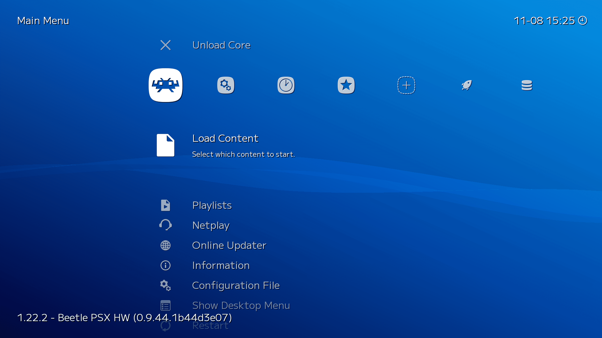

If the game is stuttering try to reboot the board if you have not done so after the RetroArch installation.

## Configuring Sound

To output sound from your games the easiest way is to connect a Bluetooth speaker to your VENTUNO Q!

First click on the top right bar on the desktop of your VENTUNO Q, where the wifi symbol is displayed. Then click on the Bluetooth option. Open the "Advanced settings" and pair your bluetooth speaker. Make sure your speaker is in pairing mode and it should show up under "Devices"

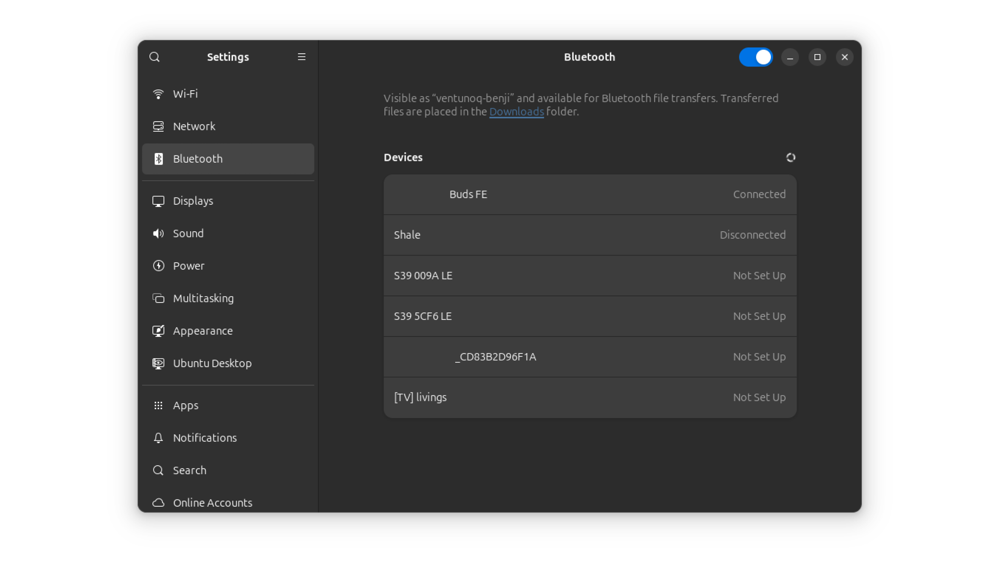

Then to make sure it is out putting from the correct device head to "Sound" settings, it can be found under the "Bluetooth" option in the left hand menu.

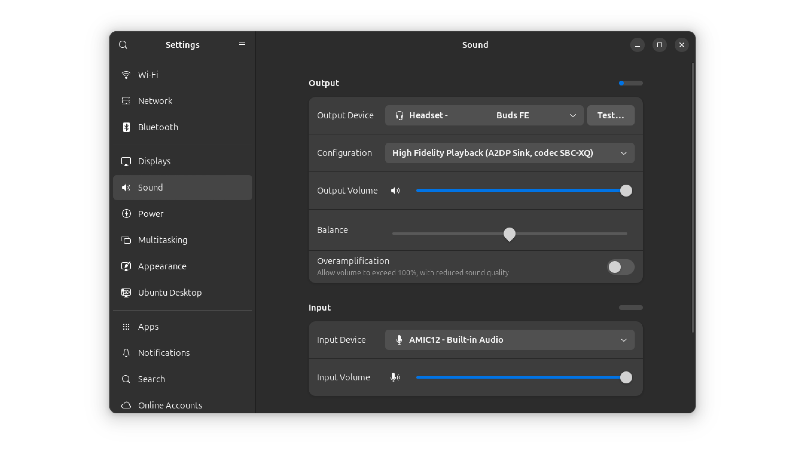

Make sure the "Output Device" is set as the Bluetooth speaker you want to use. Now all the sound from the games running on RetroArch will play from your Bluetooth speaker.

## Conclusion

This tutorial has showed you how to set up the hardware to run and download RetroArch with its assets on your VENTUNO Q. Then we went through how to configure the controls of games running on RetroArch. This tutorial also shows how to configure the video drivers and core so games can run perfectly on the board. As an optional step you can also set up a Bluetooth speaker to play the game sounds. Now that you know how everything works you can try out different games and consoles!
