## Overview

In this tutorial, you will learn how to set up and run ROS 2 (Robot Operating System 2) natively on the Arduino® VENTUNO™ Q. The VENTUNO Q runs Ubuntu on its main processor, which makes it compatible with a standard ROS 2 installation directly on the system.

You will install ROS 2 Jazzy Jalisco based on the official ROS environment setup, verify the installation through the `turtlesim` simulation example, and then create your first ROS 2 project from scratch with a publisher and subscriber node.

<Alert type="info">**Note:** This tutorial can also be replicated on the Arduino® UNO™ Q with minor adaptations.</Alert>

## Goals

- Access the VENTUNO Q shell via SSH, ADB or SBC mode.
- Install ROS 2 Jazzy Jalisco natively on Ubuntu.
- Understand the fundamental concepts of ROS 2: nodes, topics, services and actions.
- Verify the installation by running the `turtlesim` example.
- Create a colcon workspace and a ROS 2 Python package.
- Write a publisher and subscriber node and verify communication between them.

## Hardware and Software Requirements

### Hardware Requirements

- [Arduino® VENTUNO™ Q](https://store.arduino.cc/products/ventuno-q) (x1)
- USB-C® cable for ADB connection (x1)
- USB keyboard and mouse (x1 each)
- HDMI display (x1)
- Wi-Fi® Access Point or Ethernet with internet access (x1)

### Software Requirements

Before you begin, verify that your VENTUNO Q has the latest system image installed. We will also need:

- Terminal access to the VENTUNO Q via ADB, SSH, or SBC mode. If you are not familiar with either method, refer to the [VENTUNO Q User Manual](/tutorials/ventuno-q/user-manual/).
- An active internet connection on the board.

## What Is ROS 2

ROS (Robot Operating System) is an open-source middleware framework that enables robotic and embedded systems to exchange data through standardized nodes, topics, services and actions. ROS is a trademark of Open Source Robotics Foundation.

It provides reusable libraries and tools, visualization, package management and message passing, so developers can focus on application logic rather than low-level infrastructure.

ROS 2 is the modern version of ROS. While the core concepts remain the same, ROS 2 replaces the original research-oriented architecture with an industrial-grade foundation built on the Data Distribution Service (DDS) standard. Key improvements include:

- Real-time and deterministic performance suitable for safety-critical and time-bounded tasks.
- Improved security with built-in authentication, encryption and access control.
- Improved cross-platform support covering Linux, Windows, macOS and embedded RTOSs.
- Multi-robot and distributed-system readiness with better discovery, namespace isolation and QoS settings.
- Long-term maintenance (LTS) releases for predictable upgrade paths in production deployments.

Throughout this tutorial, we use [ROS 2 Jazzy Jalisco](https://docs.ros.org/en/jazzy/index.html), the current LTS release supported on Ubuntu 24.04, which is the operating system running on the VENTUNO Q's main processor.

## Accessing the VENTUNO Q

Before installing anything, you need a working shell session on the board. All the steps in this tutorial are run directly on the VENTUNO Q, not on your computer. There are three ways to get a terminal on the board.

The first option for initial access is ADB (Android Debug Bridge). It provides direct shell access over USB-C without requiring any network setup, making it the best starting point before Wi-Fi has been configured. Connect the VENTUNO Q to your computer via USB-C and run:

```bash
adb devices
```

This lists connected devices and confirms the board is recognized. Then open the shell:

```bash
adb shell
```

Once you are in, you can navigate the Ubuntu system through the terminal. If you have not yet connected the board to a Wi-Fi network, you can do so from the ADB shell using `nmtui`:

```bash
sudo nmtui
```

The second option is SSH, which is available once the board has been connected to a local network and the first-time setup in the Arduino App Lab has been completed. From your computer's terminal, run:

```bash
ssh arduino@<boardname>.local
```

Replace `<boardname>` with your board's configured hostname. When connecting for the first time, you will be asked to verify the connection by typing `yes` to confirm the fingerprint. After that, enter the password for your board.

The third option is SBC mode, which is useful if you prefer to work directly on the board with a physical display. Connect a keyboard and mouse to the VENTUNO Q's USB-A ports and an HDMI display to the HDMI port, power the board on, and log in. You will have access to the full desktop environment with Ubuntu and can open a terminal from there.

<Alert type="info">For detailed instructions on setting up ADB, SSH, or SBC mode, refer to the [VENTUNO Q User Manual](/tutorials/ventuno-q/user-manual/).</Alert>

## Installing ROS 2

### Setting Up the System

Before installing ROS 2, it is good practice to make sure the system package lists and any already-installed packages are up to date. This prevents situations where a package being installed by the ROS 2 installer depends on a version newer than what is currently cached on the system:

```bash
sudo apt update && sudo apt upgrade
```

The `apt update` command refreshes the list of available packages from the configured repositories, and `apt upgrade` installs any pending updates for packages already on the system. Once this completes, you are ready to proceed with the ROS 2 installation.

### Installing ROS 2 Jazzy

The VENTUNO Q runs Ubuntu 24.04 on its main processor, which is one of the officially supported platforms for ROS 2 Jazzy Jalisco. This means you can follow the standard ROS 2 installation procedure without any board-specific modifications.

The installation process involves three main steps: making sure the locale is correctly configured, adding the official ROS 2 apt repository to the system, and then installing the packages. Follow the steps below in your terminal.

First, check that your system locale is set to UTF-8, which is required by ROS 2:

```bash
locale
```

If the output shows `UTF-8` in the locale settings, you are good to proceed. If not, run the following to configure it:

```bash
sudo apt update && sudo apt install locales
```

```bash
sudo locale-gen en_US en_US.UTF-8
```

```bash
sudo update-locale LC_ALL=en_US.UTF-8 LANG=en_US.UTF-8
```

```bash
export LANG=en_US.UTF-8
```

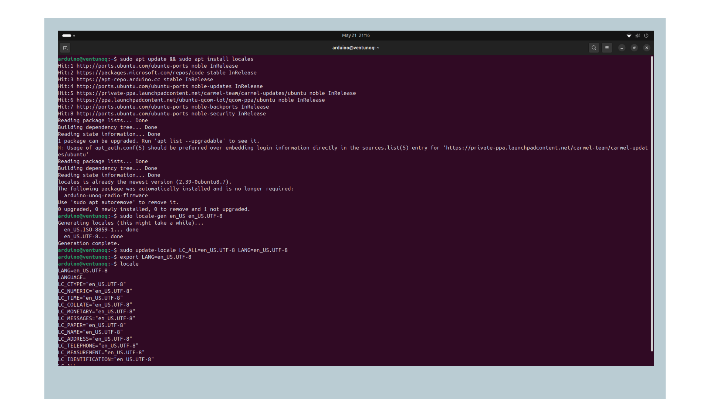

Next, add the ROS 2 apt repository to your system. It tells the package manager where to find the ROS 2 packages:

```bash
sudo apt install software-properties-common
```

```bash
sudo add-apt-repository universe
```

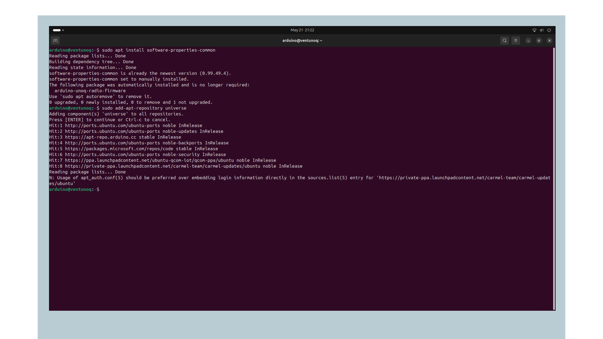

Then, add the ROS 2 GPG signing key, which allows your system to verify the authenticity of the packages it downloads:

```bash
sudo apt update && sudo apt install curl -y
```

```bash
sudo curl -sSL https://raw.githubusercontent.com/ros/rosdistro/master/ros.key \
    -o /usr/share/keyrings/ros-archive-keyring.gpg
```

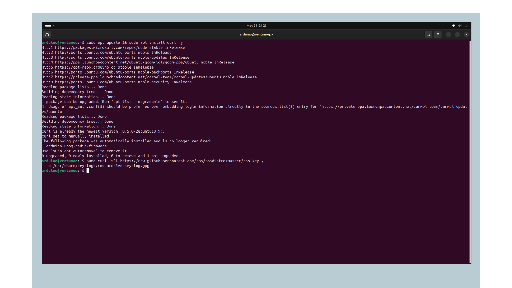

Add the ROS 2 repository to the apt sources list:

```bash
echo "deb [arch=$(dpkg --print-architecture) signed-by=/usr/share/keyrings/ros-archive-keyring.gpg] \
    http://packages.ros.org/ros2/ubuntu \
    $(. /etc/os-release && echo $UBUNTU_CODENAME) main" \
    | sudo tee /etc/apt/sources.list.d/ros2.list > /dev/null
```

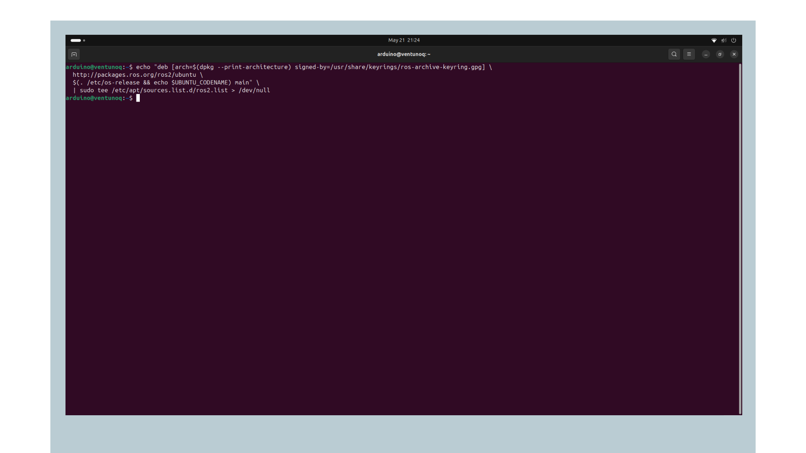

Update the package list and install ROS 2 Jazzy desktop, which includes the core libraries, tools, and the standard desktop visualization packages:

```bash
sudo apt update
```

```bash
sudo apt upgrade
```

```bash
sudo apt install ros-jazzy-desktop
```

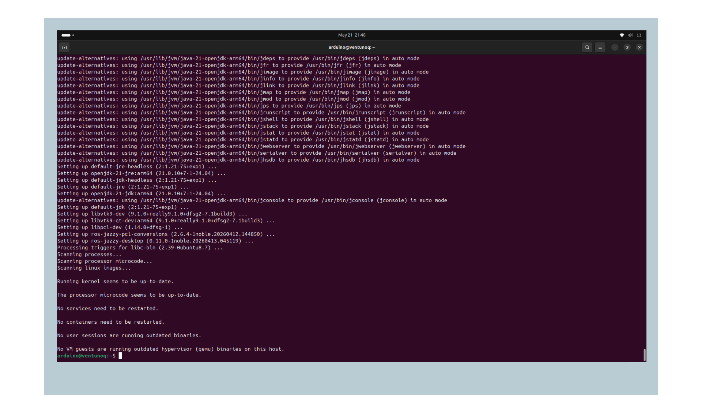

The installation may take a few minutes, depending on your internet connection. Once it completes, continue to the verification step below.

<Alert type="info">For the full official installation reference, see [ROS 2 Jazzy Installation on Ubuntu (ros.org)](https://docs.ros.org/en/jazzy/Installation/Ubuntu-Install-Debs.html).</Alert>

### Verifying the Installation

After the installation finishes, confirm that ROS 2 is working correctly before proceeding. ROS 2 includes a set of demo packages specifically for this purpose.

You will run two of them:

- `talker`, which publishes a simple string message on a topic once per second
- `listener`, which subscribes to that topic and prints each message it receives.

If the two nodes can find each other and exchange messages, it confirms that the core communication layer is working as expected.

Before you can run any ROS 2 command, you need to source the ROS 2 setup file. This script configures your shell environment with the paths and variables that ROS 2 needs to locate its packages and tools. Open a terminal on the board and run:

```bash
source /opt/ros/jazzy/setup.bash
```

With the environment ready, start the talker node:

```bash
ros2 run demo_nodes_cpp talker
```

The `ros2 run` command takes two arguments:

- the package name (`demo_nodes_cpp`)
- the node executable (`talker`)

You should see it printing a new message every second:

```text
[INFO] [talker]: Publishing: 'Hello World: 1'
[INFO] [talker]: Publishing: 'Hello World: 2'
[INFO] [talker]: Publishing: 'Hello World: 3'
```

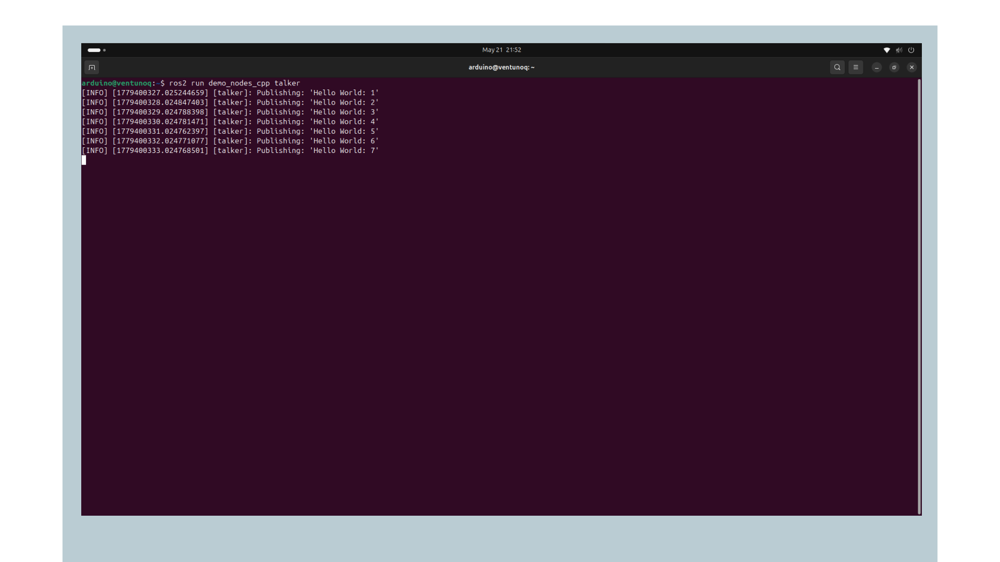

Now open a second terminal on the board, source the environment again and start the listener:

```bash
source /opt/ros/jazzy/setup.bash
```

```bash
ros2 run demo_nodes_cpp listener
```

The listener subscribes to the same topic the talker is publishing on and prints each message it receives:

```text
[INFO] [listener]: I heard: [Hello World: 1]
[INFO] [listener]: I heard: [Hello World: 2]
[INFO] [listener]: I heard: [Hello World: 3]
```

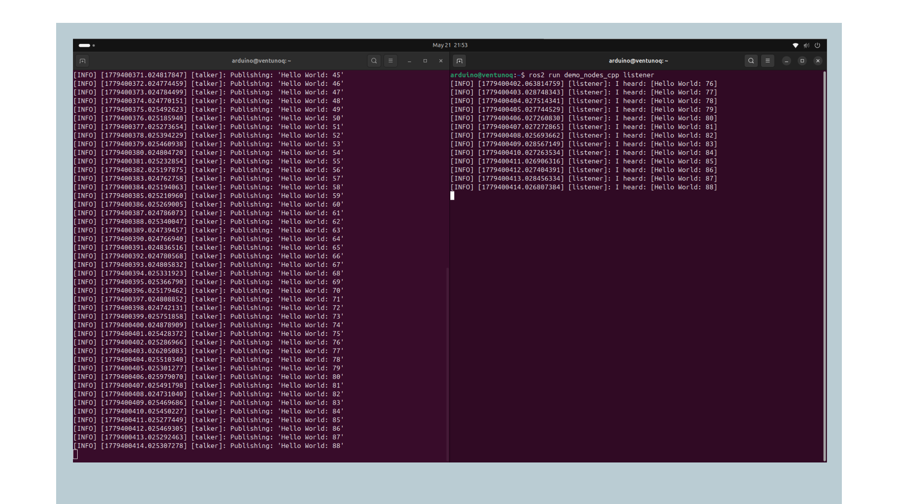

If you see both nodes producing output like this, your ROS 2 installation is working correctly. You can stop both nodes with `Ctrl+C`.

### Making the Environment Persistent

You may have noticed that you had to run `source /opt/ros/jazzy/setup.bash` in each terminal before using ROS 2. It is because the setup file configures environment variables that are local to the current shell session and do not carry over automatically when you open a new terminal.

To avoid running this command every time, you can append it to your `.bashrc` file, which is a shell script that runs automatically whenever a new terminal session starts:

```bash
echo "source /opt/ros/jazzy/setup.bash" >> ~/.bashrc
```

```bash
source ~/.bashrc
```

The first line appends the source command to the end of `.bashrc`. The second line reloads `.bashrc` in the current session, so the change takes effect immediately without opening a new terminal.

From this point on, every new terminal you open on the VENTUNO Q will have ROS 2 available automatically.

## Turtlesim Example

`turtlesim` is a lightweight 2D simulation that comes with ROS 2. It is the standard starting point for learning how the framework works in practice, because it provides visual and interactive elements that make it easy to work with.

A turtle appears on a canvas and can be moved by publishing velocity commands to a topic, which makes it a straightforward way to see nodes, topics, and services in action before working with real hardware.

### Installing Turtlesim

Install the `turtlesim` package from the ROS 2 package repository:

```bash
sudo apt install ros-jazzy-turtlesim
```

### Running Turtlesim

Launch the turtlesim node in a terminal:

```bash
ros2 run turtlesim turtlesim_node
```

The terminal will print initialization messages confirming the node started and spawned the turtle:

```text
[INFO] [turtlesim]: Starting turtlesim with node name /turtlesim
[INFO] [turtlesim]: Spawning turtle [turtle1] at x=[5.544445], y=[5.544445], theta=[0.000000]
```

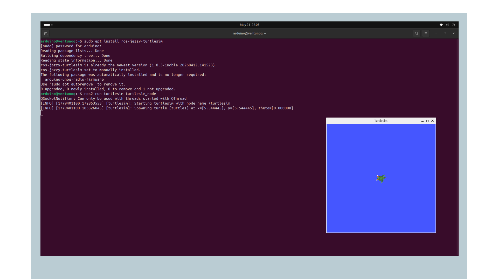

The turtlesim window will appear on screen with a turtle at the center of the canvas. Since the VENTUNO Q has a native HDMI output, this works directly in SBC mode without any additional configuration. If you are connected via SSH without a display attached, the node will still run and publish topics, but the graphical window will not render.

### Controlling the Turtle

The turtle listens for velocity commands published to the `/turtle1/cmd_vel` topic. With the turtlesim node running, open a second terminal and send commands to move the turtle.

The following command makes it trace a continuous circle by combining forward speed with a rotation rate:

```bash
ros2 topic pub --rate 1 /turtle1/cmd_vel geometry_msgs/msg/Twist \
 "{linear: {x: 2.0, y: 0.0, z: 0.0}, angular: {x: 0.0, y: 0.0, z: 1.8}}"
```

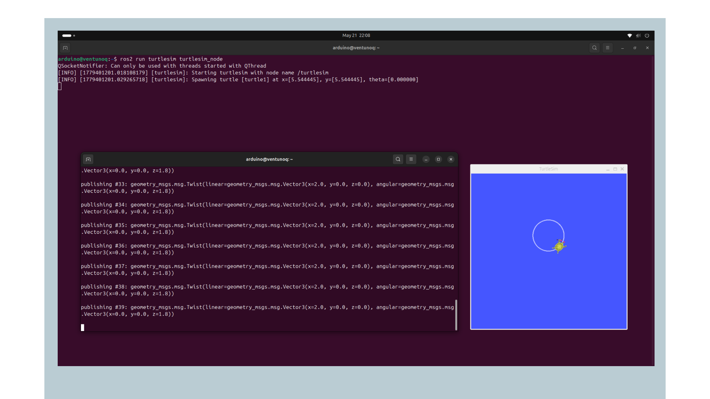

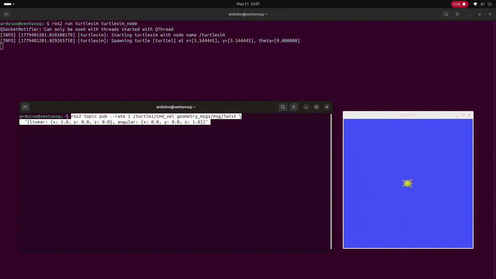

It publishes a Twist message at 1 Hz telling the turtle to move forward at 2.0 units per second while rotating at 1.8 radians per second.

Press `Ctrl+C` to stop. Alternatively, you can run the built-in square-drawing demo, which will move the turtle in a square pattern automatically:

```bash
ros2 run turtlesim draw_square
```

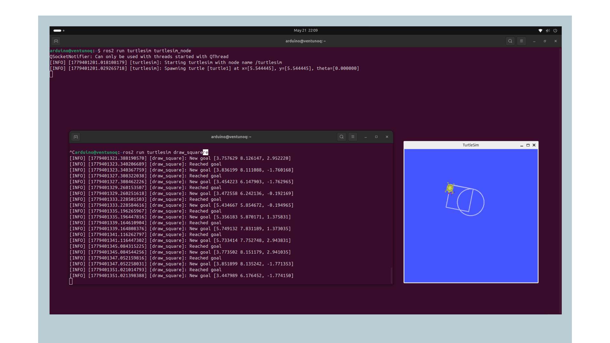

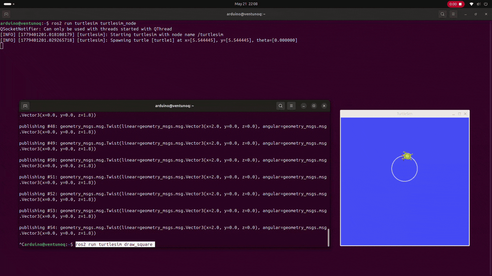

### Resetting and Clearing

You can also interact with turtlesim via ROS 2 services. Services work differently from topics. Instead of a continuous data stream, a service is a request-response call.

The following commands use the `/clear` and `/reset` services to clear the drawing trail and reset the turtle's position:

```bash
ros2 service call /clear std_srvs/srv/Empty {}
```

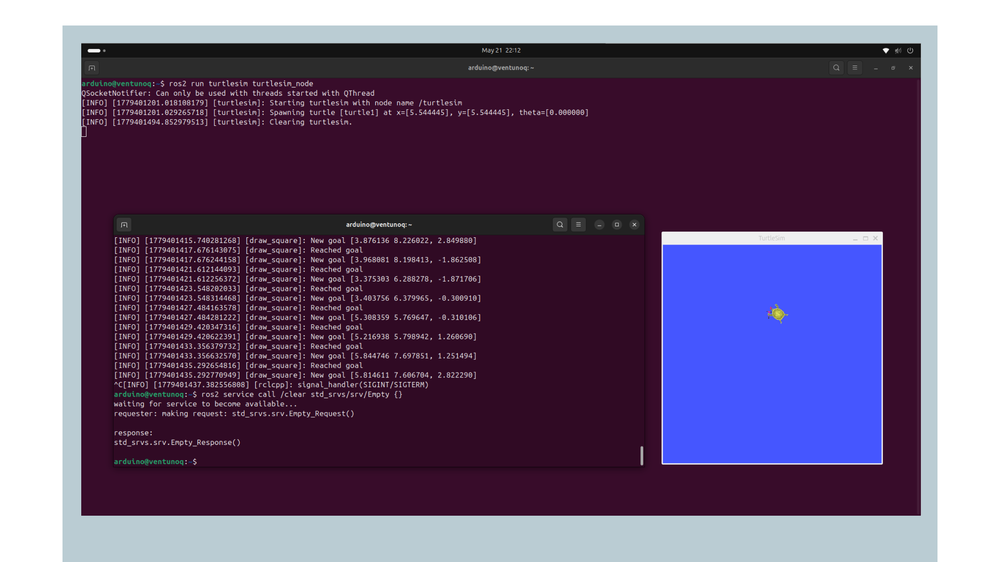

```bash
ros2 service call /reset std_srvs/srv/Empty {}
```

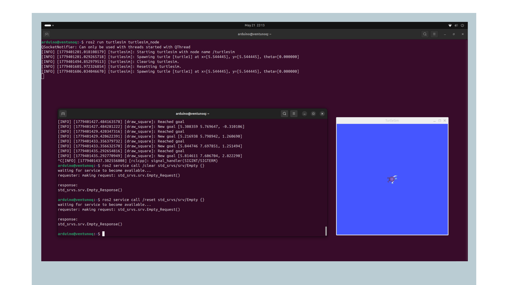

### Exploring the ROS 2 Graph

With `turtlesim` running, open a third terminal and use the ROS 2 command-line tools to inspect what is happening in the system.

`ros2 node list` shows all nodes currently running. With turtlesim active, you should see `/turtlesim` listed:

```bash
ros2 node list
```

`ros2 topic list` shows all active topics. You will see `/turtle1/cmd_vel` for velocity commands and `/turtle1/pose` for the turtle's current position, among others:

```bash
ros2 topic list
```

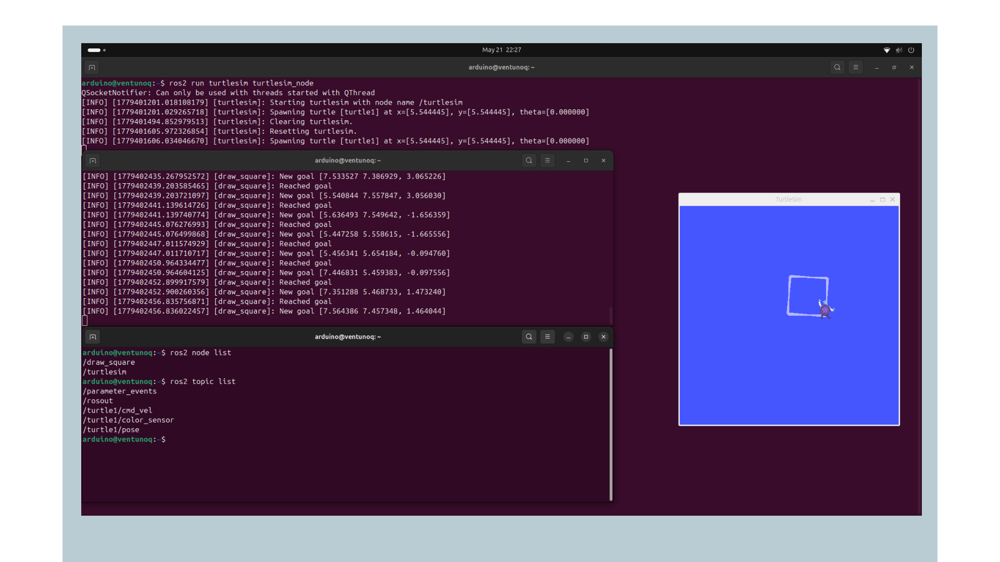

`ros2 topic echo` prints every message being published on a topic in real time. Running it on `/turtle1/cmd_vel` lets you see the velocity commands flowing while the turtle is moving:

```bash
ros2 topic echo /turtle1/cmd_vel
```

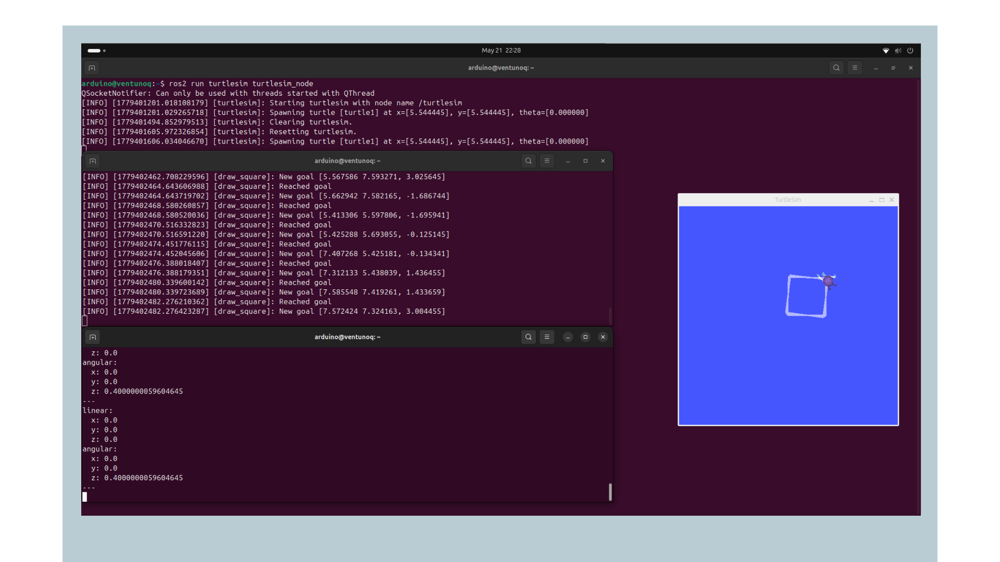

`ros2 node info` shows the full details of a specific node, including which topics it publishes to, which it subscribes to, and which services it exposes:

```bash
ros2 node info /turtlesim
```

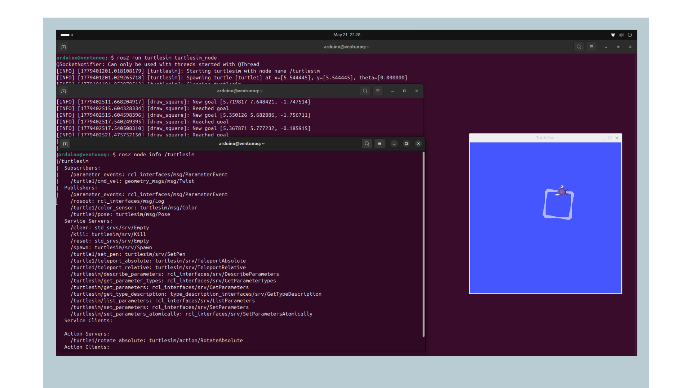

Getting comfortable with these commands is useful because they work the same way regardless of what nodes are running, so you will use them throughout all the tutorials in this series.

## Creating First ROS 2 Project

With ROS 2 installed and verified, the next step is to build a project from scratch. You will create a workspace, write a publisher node and a subscriber node in Python, build the package, and run both nodes to see them communicate.

This section follows the official ROS 2 Python publisher and subscriber guide, adapted to run on the VENTUNO Q. The full reference is available at [Writing a Simple Publisher and Subscriber (Python)](https://docs.ros.org/en/jazzy/Tutorials/Beginner-Client-Libraries/Writing-A-Simple-Py-Publisher-And-Subscriber.html).

### ROS 2 Core Concepts

Before writing code, it is useful to understand the key concepts you will work with:

- **Node:** a single process that performs one specific task, such as reading a sensor, processing data, or sending commands to a motor. Nodes communicate with each other using topics, services and actions. In a real robot, dozens of nodes can be running simultaneously, each responsible for a different piece of the system.
- **Topic:** a named channel over which nodes exchange messages asynchronously. Think of it as a radio frequency where any node can broadcast on it, and any node can tune in to listen. Any number of nodes can publish to or subscribe from the same topic at the same time.
- **Publisher:** a component of a node that sends messages to a topic.
- **Subscriber:** a component of a node that receives messages from a topic and passes them to a callback function.
- **Package:** the basic unit of software organization in ROS 2. A package groups related nodes, libraries, configuration files, and build instructions.
- **Workspace:** a directory where you build and install one or more packages using the `colcon` build tool.

### Installing Colcon

`colcon` is the standard build tool for ROS 2. It reads the build configuration from each package in your workspace and compiles them in the correct order. Install it with:

```bash
sudo apt update
```

```bash
sudo apt install python3-colcon-common-extensions
```

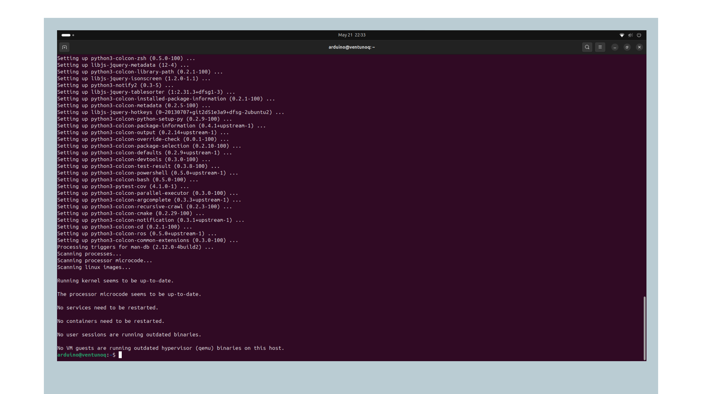

### Creating a Workspace

Create a directory to use as your colcon workspace:

```bash
mkdir -p ~/ros2_ws/src
```

```bash
cd ~/ros2_ws
```

All packages go inside `src/`. When you run `colcon build` from the workspace root, it compiles them.

It generates three directories alongside `src/`:

- `build/` for intermediate files
- `install/` for the compiled outputs
- `log/` for build logs

### Creating a Python Package

Navigate into `src/` and create a new package using the `ament_python` build type, which is the standard for pure Python packages in ROS 2:

```bash
cd ~/ros2_ws/src
```

```bash
ros2 pkg create --build-type ament_python vntq_pubsub
```

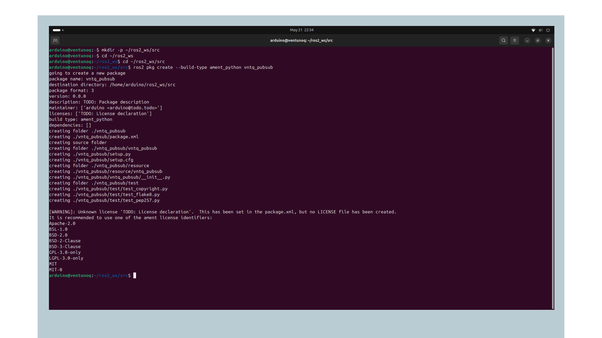

The command creates the following structure:

```text
src/
└── vntq_pubsub/
    ├── package.xml
    ├── setup.py
    ├── setup.cfg
    ├── resource
    ├── test
    └── vntq_pubsub/
        └── __init__.py
```

The `package.xml` file describes the package metadata and dependencies. The `setup.py` file is where you register your Python scripts as executable ROS 2 nodes. The inner `vntq_pubsub/` directory is the Python module where your node scripts will live.

### Writing the Publisher Node

Create the publisher script inside the package's Python module directory:

```bash
nano ~/ros2_ws/src/vntq_pubsub/vntq_pubsub/publisher.py
```

```python
import rclpy
from rclpy.node import Node
from std_msgs.msg import String

class VNTQPublisher(Node):
    def __init__(self):
        super().__init__('vntq_publisher')
        self.publisher_ = self.create_publisher(String, 'vntq_topic', 10)
        self.timer = self.create_timer(1.0, self.timer_callback)
        self.count = 0

    def timer_callback(self):
        msg = String()
        msg.data = f'Hello from VENTUNO Q: {self.count}'
        self.publisher_.publish(msg)
        self.get_logger().info(f'Publishing: "{msg.data}"')
        self.count += 1

def main(args=None):
    rclpy.init(args=args)
    node = VNTQPublisher()
    rclpy.spin(node)
    node.destroy_node()
    rclpy.shutdown()

if __name__ == '__main__':
    main()
```

This node inherits from the ROS 2 `Node` base class and registers itself with the name `vntq_publisher`. In the constructor, it creates a publisher on the topic `vntq_topic` with a queue size of 10, and sets up a timer that calls `timer_callback` once per second.

Each time the callback fires, it builds a `String` message with the current count, publishes it to the topic, and logs the content to the console.

### Writing the Subscriber Node

Create the subscriber script in the same directory:

```bash
nano ~/ros2_ws/src/vntq_pubsub/vntq_pubsub/subscriber.py
```

```python
import rclpy
from rclpy.node import Node
from std_msgs.msg import String

class VNTQSubscriber(Node):

    def __init__(self):
        super().__init__('vntq_subscriber')
        self.subscription = self.create_subscription(
            String,
            'vntq_topic',
            self.listener_callback,
            10
        )

    def listener_callback(self, msg):
        self.get_logger().info(f'Received: "{msg.data}"')

def main(args=None):
    rclpy.init(args=args)
    node = VNTQSubscriber()
    rclpy.spin(node)
    node.destroy_node()
    rclpy.shutdown()

if __name__ == '__main__':
    main()
```

This node creates a subscription on `vntq_topic` with a matching queue size of 10. Whenever a message arrives on that topic, the `listener_callback` function is called, and the message content is printed to the console. The node name is `vntq_subscriber`.

### Registering the Entry Points

For nodes to be launchable with the `ros2 run` command, they need to be registered as console script entry points in `setup.py`. It tells colcon to create executable wrappers for each node during the build. Open the file:

```bash
nano ~/ros2_ws/src/vntq_pubsub/setup.py
```

Find the `entry_points` dictionary and update it as follows:

```python
entry_points={
    'console_scripts': [
        'publisher = vntq_pubsub.publisher:main',
        'subscriber = vntq_pubsub.subscriber:main',
    ],
},
```

### Building the Workspace

Return to the workspace root and build the package:

```bash
cd ~/ros2_ws
```

```bash
colcon build --packages-select vntq_pubsub
```

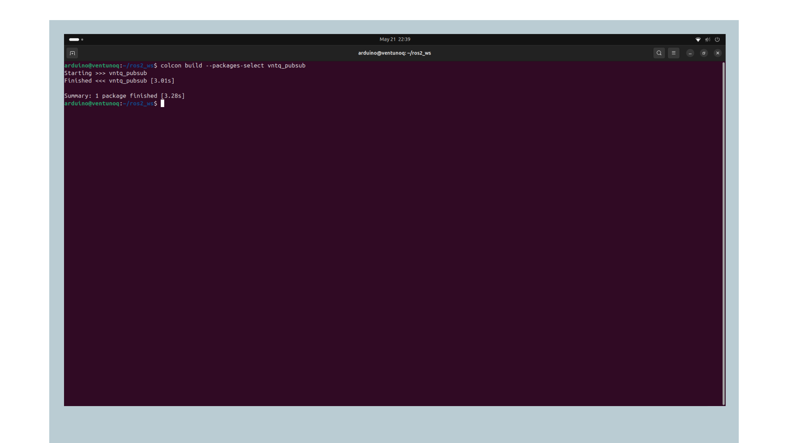

Once the build completes, source the workspace install directory to make the package available in the current shell session:

```bash
source install/setup.bash
```

The `--packages-select` flag tells colcon to build only the specified package instead of everything in the workspace. It is useful when you have multiple packages and want to save time by rebuilding only the one you are working on. Without it, colcon would attempt to build all packages found inside `src/`.

To avoid sourcing the workspace manually in every new terminal, add it to your shell profile:

```bash
echo "source ~/ros2_ws/install/setup.bash" >> ~/.bashrc
```

```bash
source ~/.bashrc
```

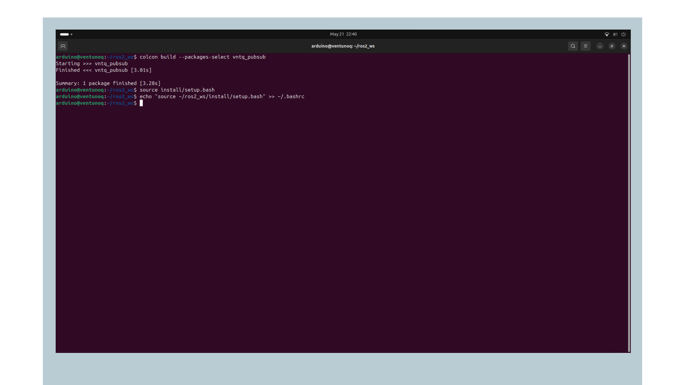

### Running the Nodes

Open two terminal sessions on the VENTUNO Q. In the first one, start the publisher:

```bash
ros2 run vntq_pubsub publisher
```

You should see it printing a new message every second:

```text
[INFO] [vntq_publisher]: Publishing: "Hello from VENTUNO Q: 0"
[INFO] [vntq_publisher]: Publishing: "Hello from VENTUNO Q: 1"
[INFO] [vntq_publisher]: Publishing: "Hello from VENTUNO Q: 2"
```

In the second terminal, start the subscriber:

```bash
ros2 run vntq_pubsub subscriber
```

You should see it receiving and printing each message the publisher sends:

```text
[INFO] [vntq_subscriber]: Received: "Hello from VENTUNO Q: 0"
[INFO] [vntq_subscriber]: Received: "Hello from VENTUNO Q: 1"
[INFO] [vntq_subscriber]: Received: "Hello from VENTUNO Q: 2"
```

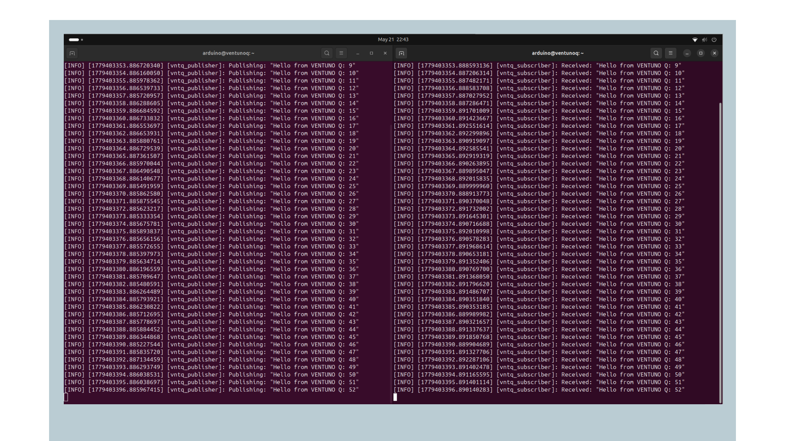

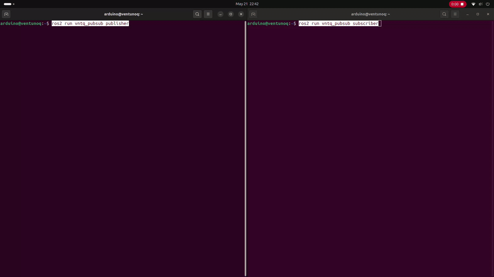

If both nodes show the expected output, your first ROS 2 project is working correctly.

### Inspecting the System

With both nodes running, open a third terminal and use the ROS 2 command-line tools to inspect the graph. These are the same tools you used with turtlesim, and they work the same way here.

`ros2 node list` will show both nodes you just launched:

```bash
ros2 node list
```

```text
/vntq_publisher
/vntq_subscriber
```

`ros2 topic list` will show `/vntq_topic` alongside the default ROS 2 system topics:

```bash
ros2 topic list
```

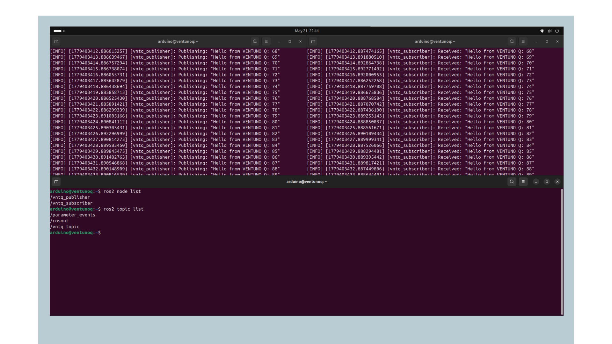

`ros2 topic echo` prints each message as it arrives on the topic in real time, which is a quick way to confirm data is flowing without running a dedicated subscriber node:

```bash
ros2 topic echo /vntq_topic
```

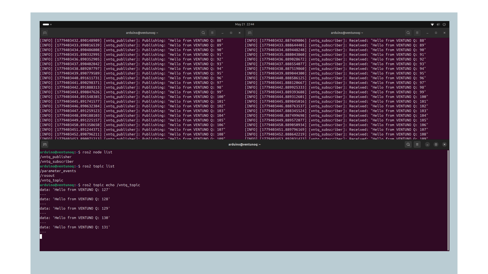

`ros2 topic info` shows the message type, how many nodes are publishing to the topic, and how many are subscribed to it:

```bash
ros2 topic info /vntq_topic
```

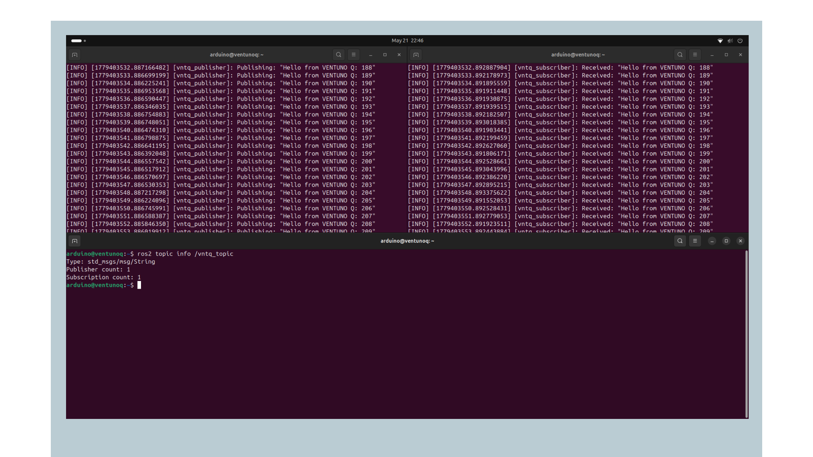

## Troubleshooting

If the `ros2` command is not found, make sure you have sourced the ROS 2 setup file with `source /opt/ros/jazzy/setup.bash`, or that this line is present in your `.bashrc`. Refer to the [Making the Environment Persistent](#making-the-environment-persistent) section if you have not done this yet.

If nodes running in different terminals cannot discover each other, check that all terminals share the same `ROS_DOMAIN_ID`. By default, this is 0, but if it has been changed in one session, the nodes will not find each other. You can set it explicitly and make it permanent:

```bash
export ROS_DOMAIN_ID=0
echo "export ROS_DOMAIN_ID=0" >> ~/.bashrc
```

If the `turtlesim` window does not appear, check whether you are connected via SSH without a display attached. The turtlesim window requires a local display to render

Connecting an HDMI display to the HDMI port and a keyboard and mouse to the USB-A ports or switching to SBC mode will resolve this. The node itself will still run and publish topics over SSH even without a display.

If the `vntq_pubsub` package is not found after building, source the workspace install directory:

```bash
source ~/ros2_ws/install/setup.bash
```

If the build fails due to missing dependencies, run `rosdep` from the workspace root before building:

```bash
cd ~/ros2_ws
```

```bash
rosdep install --from-paths src --ignore-src -r -y
```

## Conclusion

In this tutorial, you have installed ROS 2 Jazzy on the VENTUNO Q, verified the installation through the `turtlesim` example and built your first ROS 2 project with a publisher and subscriber communicating over a topic. The patterns introduced here, nodes, topics, packages and workspaces, are the base of every tutorial in this series.

### Next Steps

Now that ROS 2 is running and you have a working project structure, you can move on to connecting real sensors to the VENTUNO Q.

For a broader introduction to ROS 2 concepts, the [official ROS 2 tutorials](https://docs.ros.org/en/jazzy/Tutorials.html) are a recommended starting point.

## Acknowledgments

ROS is a trademark of Open Source Robotics Foundation. This tutorial is provided for educational purposes to help users learn ROS 2 on Arduino hardware. This content does not imply endorsement, partnership, or affiliation between Arduino and Open Source Robotics Foundation.
