## Overview

Cameras give a robot the ability to see, detect objects, and estimate distances. In ROS 2, camera data is published over topics as standard message types, so any node in the system can subscribe to and process it regardless of which specific camera produced it.

In this tutorial, you will connect and configure the two RGB camera options available on the Arduino® VENTUNO™ Q, a standard USB webcam using the [`usb_cam`](https://github.com/ros-drivers/usb_cam) driver, and a CSI camera using Qualcomm's [`qrb_ros_camera`](https://github.com/qualcomm-qrb-ros/qrb_ros_camera) package.

## Goals

- Connect a USB webcam and publish its image stream as a ROS 2 topic.
- Install the Qualcomm camera driver stack and stream a CSI camera through `qrb_ros_camera`.
- Verify each camera's data rate from the terminal and view it with `rqt_image_view`.
- Run object detection on a camera stream with Edge Impulse.

## Hardware and Software Requirements

### Hardware Requirements

- [Arduino® VENTUNO™ Q](https://store.arduino.cc/products/ventuno-q) (x1)
- UVC-compatible USB webcam (x1)
- CSI camera module, such as [Arducam IMX577](https://www.arducam.com/arducam-imx577-mini-camera-module-for-qualcomm-rb3g2.html) (x1)
- [Arduino® USB-C Hub (8in1)](https://store.arduino.cc/products/usb-c-hub-8-in-1) (x1)
- USB keyboard, mouse and HDMI display

### Hardware Setup

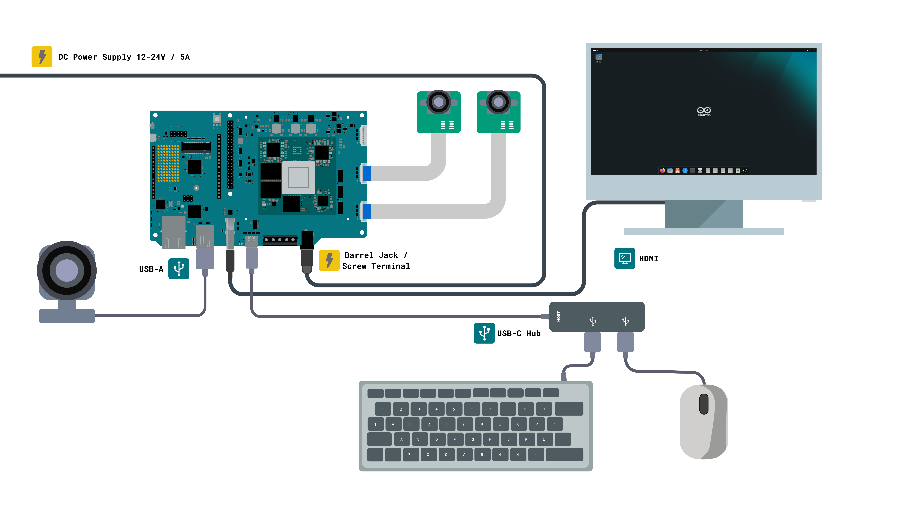

The diagram above shows the base VENTUNO Q setup used throughout this tutorial, the board, power supply, HDMI display, USB keyboard and mouse, running Ubuntu in SBC mode. This is the starting point before any sensor is connected. The USB webcam connects to one of the board's USB-A ports in addition to this base setup, while the CSI camera connects via the board's onboard MIPI-CSI-2 connector.

The VENTUNO Q has two USB-A ports, which the keyboard and mouse already occupy in this base setup. Since the USB webcam also needs a USB port, a USB-C hub connected to the board's USB-C port is recommended to provide an additional USB-A port, so you do not need to disconnect the keyboard or mouse each time you connect the webcam.

<Alert type="info">

In this tutorial, the display connects through the board's native HDMI port, keeping the USB-C port free for the hub.

</Alert>

### Software Requirements

- ROS 2 Jazzy installed on the VENTUNO Q, and a colcon workspace at `~/ros2_ws` set up, see [Getting Started with ROS 2 on VENTUNO Q](/tutorials/ventuno-q/getting-started-ros2).

<Alert type="warning">

Make sure your VENTUNO Q has the latest system image installed and that ROS 2 Jazzy is working correctly before proceeding with this tutorial.

</Alert>

## USB Webcam

A USB webcam is the simplest way to get image data into a ROS 2 system. The VENTUNO Q has two USB-A ports and is compatible with any camera that follows the *UVC (USB Video Class)* standard, which covers most consumer webcams available today.

The `usb_cam` package is a *V4L (Video for Linux)* based driver, which is a broader standard than UVC and covers most USB cameras on Linux. It reads frames from the camera device and publishes them as `sensor_msgs/Image` messages on a ROS 2 topic.

### Connecting the Camera

Plug the webcam into one of the VENTUNO Q's USB-A ports. To verify it appeared as a video device, open a terminal and run:

```bash
ls /dev/video*
```

You should see at least `/dev/video0`. If you have multiple USB cameras connected, each will appear as a separate numbered device.

### Installing USB CAM

Install the binary release directly from the ROS 2 package repository:

```bash
sudo apt-get install ros-jazzy-usb-cam
```

If for some reason the binary is not available, build the package from source instead. Clone it into your workspace, install dependencies with rosdep, and build with colcon:

```bash
cd ~/ros2_ws/src
```

```bash
git clone https://github.com/ros-drivers/usb_cam.git
```

```bash
cd ~/ros2_ws
```

```bash
rosdep install --from-paths src --ignore-src -y
```

```bash
colcon build
```

```bash
source ~/ros2_ws/install/setup.bash
```

For full package documentation and source code, refer to the [usb_cam GitHub repository](https://github.com/ros-drivers/usb_cam).

### Running the Camera Node

Since this tutorial also covers the CSI camera, installing its driver stack can shift the USB webcam's device index, `/dev/video0` may no longer be the webcam once the CSI driver is installed. Confirm the correct device before running the node:

```bash
ls /dev/video*
```

If more than one video device is listed and you are unsure which is the webcam, run the node once without specifying a device, the console output lists every detected device by name at the end:

```bash
ros2 run usb_cam usb_cam_node_exe
```

You may also see a series of `Could not retrieve device capabilities` or `Cannot open device` lines for `/dev/v4l-subdev*` paths. These are the CSI camera's internal ISP subdevices being scanned during enumeration, not the webcam, and can be safely ignored.

There are two ways to start the node once you know the correct device.

The simplest is passing the device directly:

```bash
ros2 run usb_cam usb_cam_node_exe --ros-args -p video_device:=/dev/video2
```

You can also load parameters from a YAML file, which is the way to configure the camera device, resolution and pixel format together. Two example parameter files ship with the package, `params_1.yaml` and `params_2.yaml`, installed under the package's share directory. Since that directory is read-only, copy the file to your home directory first:

```bash
cp /opt/ros/jazzy/share/usb_cam/config/params_1.yaml ~/usb_cam_params.yaml
```

Edit the `video_device` field in your copy to match the correct device:

```bash
sed -i 's|video_device: "/dev/video0"|video_device: "/dev/video2"|' ~/usb_cam_params.yaml
```

Then run the node with your edited copy:

```bash
ros2 run usb_cam usb_cam_node_exe --ros-args --params-file ~/usb_cam_params.yaml
```

You only need to run one of these two, not both together. A successful launch should resemble the following logs:

```text
[INFO] [usb_cam]: camera_name value: test_camera
[WARN] [usb_cam]: framerate: 30.000000
[INFO] [usb_cam]: Starting 'test_camera' (/dev/video2) at 640x480 via mmap (mjpeg2rgb) at 30 FPS
```

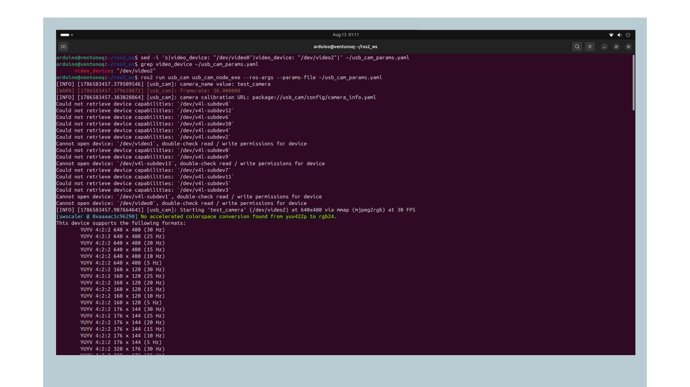

The `Starting` line shows the device, resolution, capture method and requested framerate the node is using, check the device path here matches the one you identified above. If this line doesn't appear, the node failed to open the camera, we need to check the [Troubleshooting section](#troubleshooting) below.

### Expected Warnings on First Run

The first time you run the node, you will likely see a calibration warning like this:

```text
[ERROR] [camera_calibration_parsers]: Unable to open camera calibration file [...]
[WARN] [usb_cam]: Camera calibration file ... not found
```

It is expected and harmless. The node has no calibration file yet because none has been generated for this camera, and it will continue running normally without one.

Calibration is needed to use the camera for tasks that require accurate distance or geometry measurements.

You may also see warnings like these once the node starts capturing frames:

```text
unknown control 'white_balance_temperature_auto'
unknown control 'exposure_auto'
unknown control 'focus_auto'
```

It means your specific camera model does not expose that particular V4L2 control. It varies by camera and does not affect the image stream.

### Checking Supported Formats

Every camera reports a different set of supported resolutions and formats. To see what your specific camera supports, run the node and observe the console output when it starts. It shows a list similar to this:

```text
This device supports the following formats:
    YUYV 4:2:2 640 x 480 (30 Hz)
    YUYV 4:2:2 640 x 480 (25 Hz)
    YUYV 4:2:2 320 x 240 (30 Hz)
    YUYV 4:2:2 800 x 600 (20 Hz)
    YUYV 4:2:2 960 x 720 (10 Hz)
    YUYV 4:2:2 1280 x 720 (7 Hz)
    YUYV 4:2:2 1280 x 960 (7 Hz)
    Motion-JPEG 640 x 480 (30 Hz)
    Motion-JPEG 320 x 240 (30 Hz)
    Motion-JPEG 800 x 600 (30 Hz)
    Motion-JPEG 960 x 720 (30 Hz)
    Motion-JPEG 1280 x 720 (30 Hz)
    Motion-JPEG 1280 x 960 (30 Hz)
    ... (full list includes every framerate down to 5 Hz for each resolution)
```

Notice that *YUYV* drops to 7 Hz at higher resolutions like 1280x720, while Motion-JPEG maintains the full 30 Hz across all listed resolutions up to 1280x960.

This is a direct, camera-reported example of the bandwidth difference between the two formats mentioned earlier. *YUYV* is uncompressed and needs more USB bandwidth per frame than Motion-JPEG, which is why higher resolutions and framerates remain available in the compressed format.

Once you know what your camera supports, set the `pixel_format` field in your `~/usb_cam_params.yaml` copy to match one of the listed formats. If you are unsure whether a format string is valid, you can test it directly, specifying the device explicitly the same way as before:

```bash
ros2 run usb_cam usb_cam_node_exe --ros-args -p video_device:=/dev/video2 -p pixel_format:="test"
```

This intentionally invalid value produces a clear error listing every format name the driver actually accepts:

```bash
[INFO] [1786583769.755635724] [usb_cam]: Starting 'default_cam' (/dev/video2) at 640x480 via mmap (test) at 30 FPS
...
This driver supports the following formats:
    rgb8
    yuyv
    yuyv2rgb
    uyvy
    uyvy2rgb
    mono8
    mono16
    y102mono8
    raw_mjpeg
    mjpeg2rgb
    m4202rgb
terminate called after throwing an instance of 'std::invalid_argument'
  what():  Specified format `test` is unsupported by this ROS driver
```

This list is the set of `pixel_format` values the ROS driver itself understands, separate from the resolution and framerate list your specific camera reports above. Use one of these exact names when setting `pixel_format`. Replacing `"test"` with any format name will tell you whether the driver recognizes it as supported.

### Verifying the Image Stream

With the node running, open a second terminal and check that the image topic is being published:

```bash
ros2 topic list | grep image
```

Check the actual publishing rate:

```bash
ros2 topic hz /image_raw
```

Let this run for at least 60 seconds rather than reading the first few samples. On the VENTUNO Q, the rate starts close to the camera's configured framerate for both `mjpeg` and `yuyv`, then gradually decreases over the first minute before settling at a lower sustained rate, often somewhere between 10 and 15 Hz at 640x480, even when using `mjpeg`.

This decrease is consistent with software-based colorspace conversion, visible as a `swscaler` warning in the node's startup output. If you need a higher sustained frame rate, consider a lower resolution, since less data per frame reduces the software conversion cost.

Here is a shortened example from a 60+ second session on the VENTUNO Q with `mjpeg2rgb`, showing the pattern described above:

```text
average rate: 29.992
        min: 0.030s max: 0.037s std dev: 0.00225s window: 31
average rate: 26.360
        min: 0.026s max: 0.167s std dev: 0.01857s window: 107
average rate: 18.021
        min: 0.026s max: 1.853s std dev: 0.13195s window: 311
average rate: 13.034
        min: 0.026s max: 3.232s std dev: 0.24949s window: 500
average rate: 10.397
        min: 0.024s max: 3.523s std dev: 0.30513s window: 1960
```

Notice the `max` column growing alongside the declining rate, this is the widening gap between individual frames, not just a slower average. The rate stabilizes somewhere in this lower range and does not recover for the remainder of the session.

### Compression

The `usb_cam` node publishes compressed image topics automatically through `image_transport`, as long as the `image_transport_plugins` package is installed on your system.

This gives you a `compressed` topic alongside the raw one without any extra configuration. However, tools like RViz2 cannot visualize compressed images directly, so if you want to view a compressed stream in RViz2, republish it as raw first:

```bash
ros2 run image_transport republish compressed raw \
  --ros-args --remap in/compressed:=image_raw/compressed --remap out:=image_raw/uncompressed
```

### Visualizing the Stream

If you have a monitor connected to the VENTUNO Q, `rqt_image_view` gives you instant visual feedback that the camera is working, without needing to interpret topic rates from the terminal:

```bash
sudo apt install ros-jazzy-rqt-image-view
```

```bash
ros2 run rqt_image_view rqt_image_view
```

Select `/image_raw` from the topic dropdown at the top of the window.

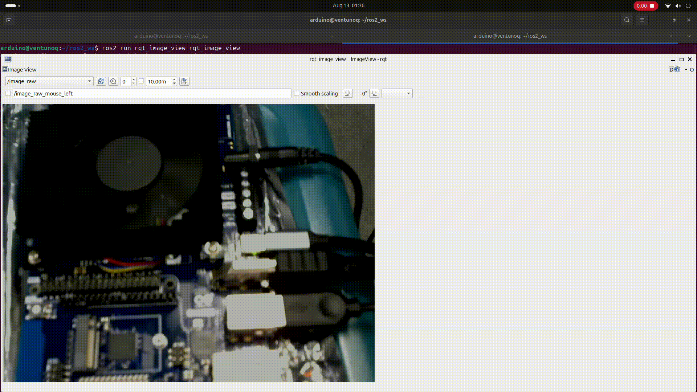

### Using Multiple Cameras

If you connect more than one USB webcam to the VENTUNO Q's two USB-A ports, each node needs a unique namespace, otherwise both would try to publish to the same `/image_raw` topic and collide.

Confirm both device paths first with `ls /dev/video*`, then remap the namespace for each, substituting your actual device paths in place of `/dev/video0` and `/dev/video2` below:

```bash
ros2 run usb_cam usb_cam_node_exe --ros-args --remap __ns:=/usb_cam_0 -p video_device:=/dev/video0
```

```bash
ros2 run usb_cam usb_cam_node_exe --ros-args --remap __ns:=/usb_cam_1 -p video_device:=/dev/video2
```

This publishes the two streams separately on `/usb_cam_0/image_raw` and `/usb_cam_1/image_raw`.

## CSI Camera

The VENTUNO Q features a MIPI-CSI-2 interface supporting camera modules including the IMX577. Getting a CSI camera working requires installing Qualcomm's camera driver stack first, since the sensor connects directly to the SoC's image signal processor rather than appearing as a standard USB device.

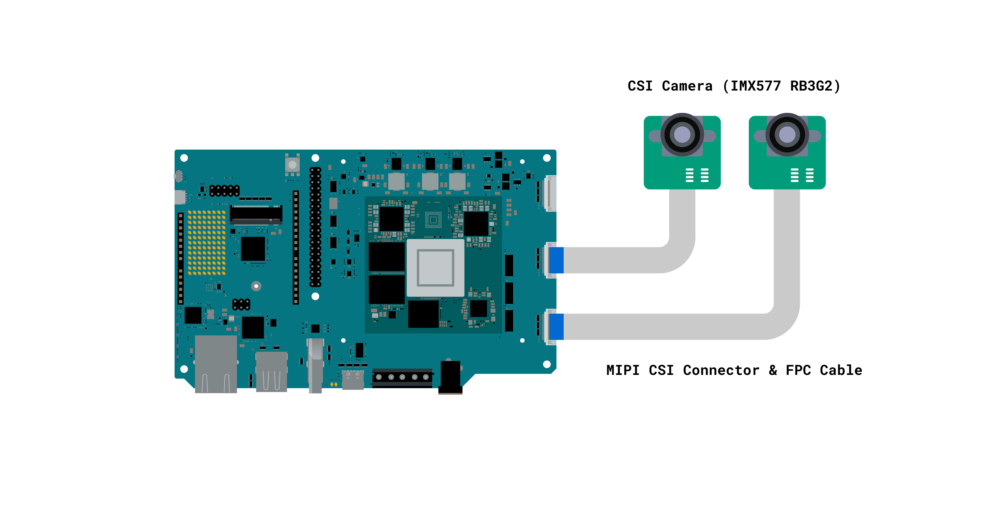

The [Arducam IMX577 Mini Camera Module for Qualcomm RB3G2](https://www.arducam.com/arducam-imx577-mini-camera-module-for-qualcomm-rb3g2.html) (SKU B0488) works with the VENTUNO Q without any hardware modification.

There are two ways to bring the CSI camera into ROS 2 on this platform. [**`qrb_ros_camera`**](https://github.com/qualcomm-qrb-ros/qrb_ros_camera) is Qualcomm's ROS 2 camera package and is the recommended path on the VENTUNO Q, since it talks to the camera ISP directly and publishes frames in the sensor's native NV12 format with zero-copy transport. `gscam` wraps a GStreamer pipeline and converts to RGB8, which suits tools that expect a standard color encoding. Both are covered below, starting with `qrb_ros_camera`.

### Installing the Camera Driver

Install the Qualcomm-flavored GStreamer plugins, CamX, and the related kernel drivers:

```bash
sudo apt update && sudo apt upgrade -y && sudo apt install gstreamer1.0-plugins-qcom -y
```

With the camera connected, reboot the board so the driver can properly initialize the sensor:

```bash
sudo reboot
```

When connecting the camera's flat cable, the blue side of the cable must face up, toward the front of the connector.

### Verifying Camera Detection

After rebooting, check that the board recognized the connected camera:

```bash
sudo dmesg | grep Probe
```

```text
CAM_INFO: CAM-SENSOR: cam_sensor_driver_cmd: 1250: Probe failed for cmk_imx577 slot:23, slave_addr:0x34, sensor_id:0x577
CAM_INFO: CAM-SENSOR: cam_sensor_driver_cmd: 1290: Probe success for cmk_imx577 slot:24,slave_addr:0x34,sensor_id:0x577
CAM_INFO: CAM-SENSOR: cam_sensor_driver_cmd: 1250: Probe failed for cmk_imx577 slot:25, slave_addr:0x34, sensor_id:0x577
```

The driver sweeps several possible I2C slot addresses, so seeing multiple `Probe failed` lines is not a problem. What matters is the number of `Probe success` lines, which should match the number of cameras you have physically connected.

### QRB ROS Camera

[**`qrb_ros_camera`**](https://github.com/qualcomm-qrb-ros/qrb_ros_camera) is Qualcomm's ROS 2 camera package for CSI and GMSL cameras on Qualcomm platforms. It reads frames through the Camera Service and CamX layers the sensor already uses, then publishes them with zero-copy transport backed by a Linux DMA buffer, so image data is not copied on its way to a subscriber in the same process.

#### Installing QRB ROS Camera

The package is distributed through two Qualcomm IoT package archives, `qcom-ppa` and `qirp`. The first one was already added when installing the camera driver earlier in this tutorial, so check which archives are present before adding anything:

```bash
grep -rn "ubuntu-qcom-iot" /etc/apt/sources.list.d/ /etc/apt/sources.list 2>/dev/null
```

Add the `qirp` archive if it is not listed, then refresh the package lists so the new packages become available:

```bash
sudo add-apt-repository ppa:ubuntu-qcom-iot/qirp
```

```bash
sudo apt update
```

Now install the package:

```bash
sudo apt install ros-jazzy-qrb-ros-camera
```

This also pulls `ros-jazzy-qrb-camera`, `ros-jazzy-qrb-ros-transport-image-type` and `ros-jazzy-lib-mem-dmabuf`. These are the supporting libraries for the camera stack and its zero-copy transport.

#### Running the Camera Node

The package ships a launch file that starts the camera with a working default configuration, so you don't need to pass any parameters for a first run. Source the ROS 2 environment, then launch the node:

```bash
source /opt/ros/jazzy/setup.bash
```

```bash
ros2 launch qrb_ros_camera qrb_ros_camera_launch.py
```

The launch file composes the camera node into a container and starts streaming. The last line repeats periodically while the camera runs, reporting the stream name, pixel format, resolution and measured frame rate:

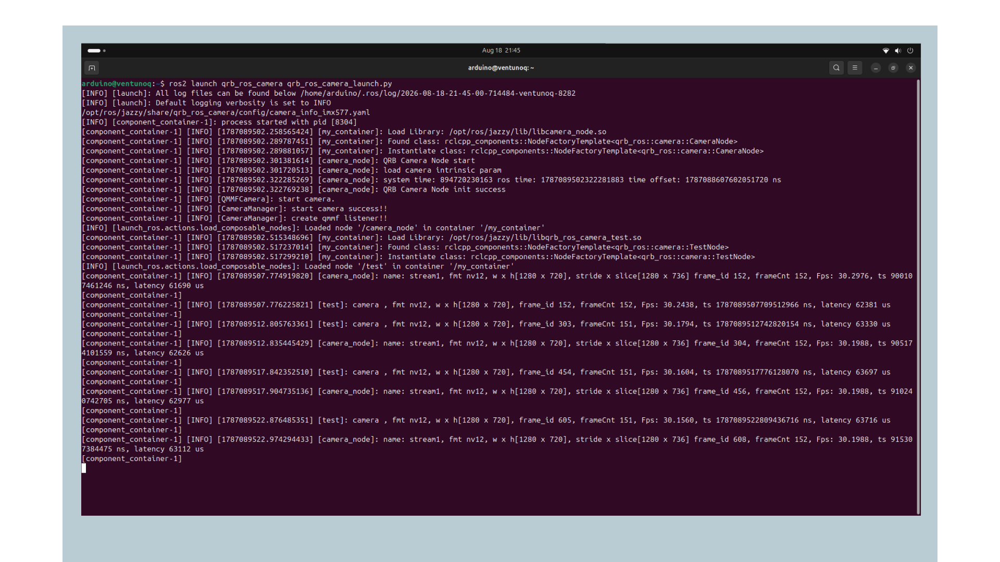

Leave this running in the terminal for as long as you want the camera, closing it stops the stream for every downstream node.

<Alert type="info">

The launch file configures 1280x720 at 30 FPS. The QRB ROS Camera repository documents 1920x1080 as the parameter default, but the launch file sets its own values, which take precedence.

</Alert>

With the camera running, open a second terminal to check what it is publishing. The node creates one topic per stream, named after the camera ID and the stream name, so the default single-stream configuration gives `/cam0_stream1` for the image and `/cam0_stream1_camera_info` for the calibration data:

```bash
ros2 topic list
```

```text
/cam0_stream1
/cam0_stream1_camera_info
/parameter_events
/rosout
```

Although the publisher uses a type-adapted, DMA-buffer-backed image internally, ordinary subscribers see a standard `sensor_msgs/msg/Image`:

```bash
ros2 topic info -v /cam0_stream1
```

```text
Type: sensor_msgs/msg/Image
Publisher count: 1
Node name: camera_node
QoS profile:
  Reliability: RELIABLE
  Durability: VOLATILE
```

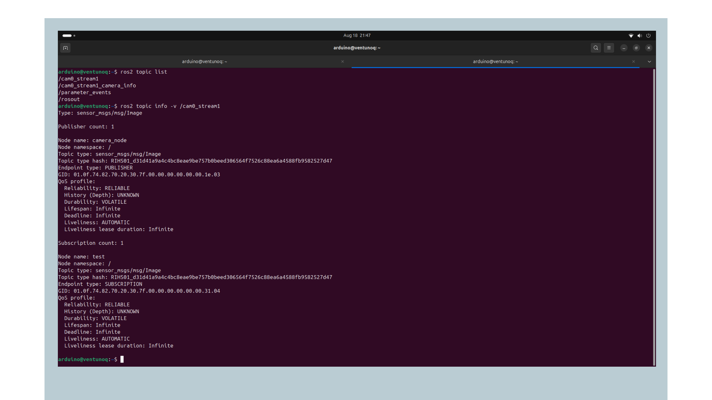

Check the publishing rate:

```bash
ros2 topic hz /cam0_stream1
```

```text
average rate: 21.370
 min: 0.017s max: 0.301s std dev: 0.03076s window: 332
average rate: 21.222
 min: 0.017s max: 0.301s std dev: 0.03122s window: 351
average rate: 21.168
 min: 0.017s max: 0.301s std dev: 0.03137s window: 394
```

The rate holds steady across a sustained session rather than declining over time. An external subscriber measures a lower rate than the node reports internally, since the zero-copy path benefits nodes composed into the same container.

Read back the published frame's format:

```bash
ros2 topic echo /cam0_stream1 --no-arr
```

```text
height: 720
width: 1280
encoding: nv12
is_bigendian: 0
step: 1280
data: '<sequence type: uint8, length: 1382400>'
```

<Alert type="warning">

`rqt_image_view` cannot display this topic directly. It relies on `cv_bridge`, which does not recognize `nv12` as an image encoding and reports `Unrecognized image encoding [nv12]`. The subscription itself works, only the conversion for display fails. To view the camera output, use a node that decodes NV12, such as the Edge Impulse integration covered below, or use `gscam` which publishes RGB8.

</Alert>

### Gscam

<Alert type="info">

A CSI camera pipeline improvement is currently in progress and will be included in this section once it becomes available.

</Alert>

`gscam` is the alternative path. It wraps a GStreamer pipeline using Qualcomm's `qtiqmmfsrc` source and converts to RGB8 before publishing, which is useful when a downstream tool expects a standard color encoding rather than NV12.

Install the package using the following command:

```bash
sudo apt install ros-jazzy-gscam
```

Run the node, pointing it at the camera pipeline:

```bash
ros2 run gscam gscam_node \
  --ros-args \
  -p gscam_config:="qtiqmmfsrc camera=0 ! video/x-raw,format=NV12,width=1920,height=1080,framerate=30/1 ! queue ! videoconvert" \
  -p image_encoding:="rgb8" \
  -p sync_sink:=false \
  -p use_gst_timestamps:=true \
  -p frame_id:="camera_link"
```

On a successful start, the node reports the pipeline being used, then confirms the stream is running:

```text
[INFO] [gscam_publisher]: Using gstreamer config from rosparam: "qtiqmmfsrc camera=0 ! video/x-raw,format=NV12,width=1920,height=1080,framerate=30/1 ! queue ! videoconvert"
[INFO] [gscam_publisher]: Publishing stream...
[INFO] [gscam_publisher]: Started stream.
```

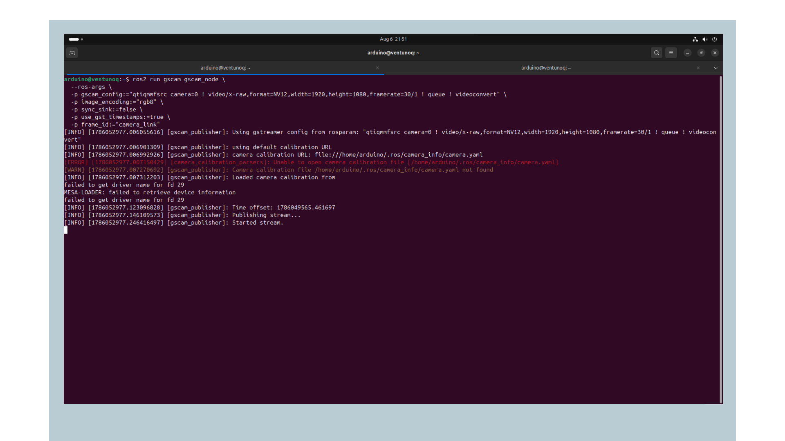

Leave this node running in its own terminal for as long as you want to use the camera, closing it stops the image stream entirely, including for any downstream node using it, such as the [Edge Impulse integration](#using-csi-camera-with-edge-impulse) covered later in this section.

The node publishes under the `/camera` namespace rather than at the root, so the actual image topic is `/camera/image_raw`, not `/image_raw`:

```bash
ros2 topic list | grep image
```

```bash
ros2 topic hz /camera/image_raw
```

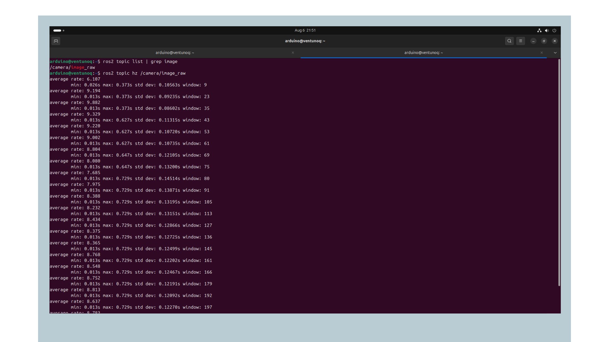

The pipeline captures the camera's native NV12 output. It converts it to **RGB8** in software before publishing, similar to the conversion covered in the USB Webcam section.

On a single camera at 1920x1080, the sustained rate settles in the 8 to 9 Hz range, well below the requested 30 FPS, since the conversion happens on the CPU rather than in hardware.

### Visualizing the Stream

If you have a monitor connected to the VENTUNO Q, you can view the live camera feed with `rqt_image_view`:

```bash
sudo apt install ros-jazzy-rqt-image-view
```

```bash
ros2 run rqt_image_view rqt_image_view
```

Select `/camera/image_raw` from the topic dropdown at the top of the window.

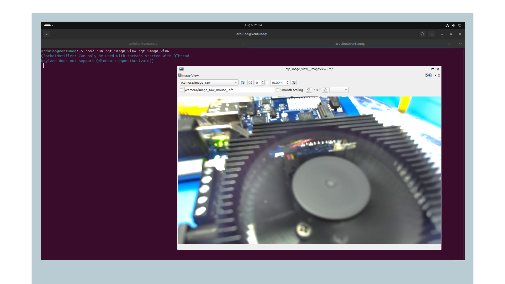

### Using Multiple Cameras

If more than one CSI camera is connected, each `Probe success` line in the detection step corresponds to one usable camera index, starting from `0`. Run a second `gscam` instance for the next camera, remapping its node name and namespace so it does not collide with the first:

```bash
ros2 run gscam gscam_node \
  --ros-args \
  -r __node:=gscam_publisher_1 \
  -r __ns:=/camera1 \
  -p gscam_config:="qtiqmmfsrc camera=1 ! video/x-raw,format=NV12,width=1920,height=1080,framerate=30/1 ! queue ! videoconvert" \
  -p image_encoding:="rgb8" \
  -p sync_sink:=false \
  -p use_gst_timestamps:=true \
  -p frame_id:="camera_link_1"
```

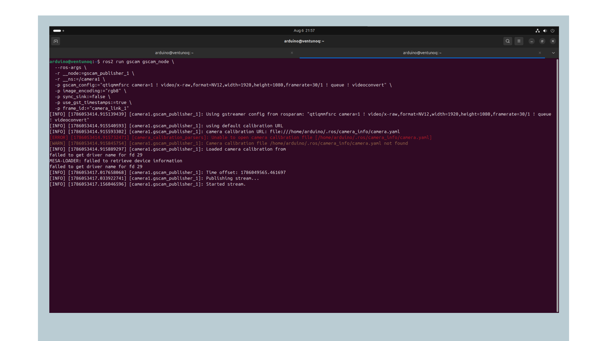

With both nodes running, the namespace remap places the second camera's topic at `/camera1/camera/image_raw`, not `/camera1/image_raw` as the remap alone might suggest:

```bash
ros2 topic list | grep image
```

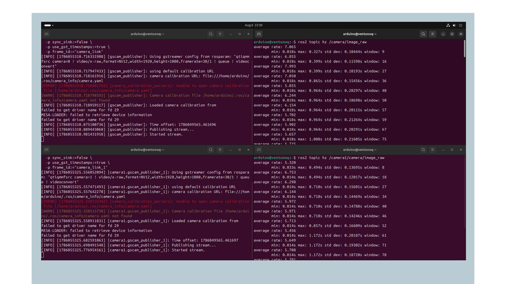

Running two cameras at the same time with `gscam` is possible, although each stream's sustained rate drops compared to running a single camera alone, typically into the 5 to 7 Hz range each, since both streams share the same CPU-side conversion work and camera ISP.

### Using CSI Camera with Edge Impulse

[`edgeimpulse_ros`](https://github.com/edgeimpulse/edgeimpulse-ros) is Edge Impulse's official ROS 2 package. It wraps a trained `.eim` model as a camera-agnostic node, `edgeimpulse_detector`, that subscribes to any `sensor_msgs/Image` topic and publishes results as standard `vision_msgs`, no custom message types to learn.

The node decodes several encodings natively, including `bgr8`, `rgb8`, `yuyv`, and **NV12**. This matters directly for the VENTUNO Q, since it means the node can subscribe to `qrb_ros_camera`'s NV12 output directly, with no separate color-conversion step required, avoiding the `gscam` CPU conversion overhead covered earlier in this section.

#### Installing Edgeimpulse_ROS

Install the ROS message dependencies and Python bindings:

```bash
sudo apt update
```

```bash
sudo apt install ros-jazzy-vision-msgs ros-jazzy-diagnostic-msgs \
  python3-opencv python3-numpy portaudio19-dev
```

Install the Edge Impulse Linux SDK. The SDK imports `pyaudio` at load time even for vision models, so it needs to be present regardless of model type:

```bash
pip install --user --break-system-packages edge_impulse_linux pyaudio
```

<Alert type="warning">

Do not clone the Edge Impulse Linux SDK (`linux-sdk-python`) into your workspace `src/` directory, colcon will try to build it as a ROS package. Install it with `pip` as shown above instead.

</Alert>

<Alert type="warning">

If you previously tested the community `edgeimpulse_ros` package earlier in this series, remove it first, both packages declare the same internal ROS package name and cannot coexist in the same workspace:

```bash
rm -rf ~/ros2_ws/src/edgeimpulse_ros
```

If you already attempted a build before removing it, also clear the stale build artifacts to avoid a broken entry point registration:

```bash
rm -rf ~/ros2_ws/build/edgeimpulse_ros ~/ros2_ws/install/edgeimpulse_ros
```

</Alert>

Clone and build the package:

```bash
cd ~/ros2_ws/src
```

```bash
git clone https://github.com/edgeimpulse/edgeimpulse-ros.git
```

```bash
cd ~/ros2_ws
```

```bash
colcon build --packages-select edgeimpulse_ros
```

```bash
source install/setup.bash
```

#### Model

This section uses a **QNN-accelerated YOLO11 model**, [`yolo11-small-linux-aarch64-qnn-v1-impulse-2-480px`](assets/yolo11-small-linux-aarch64-qnn-v1-impulse-2-480px.eim), exported from Edge Impulse Studio and provided alongside this documentation.

[](assets/yolo11-small-linux-aarch64-qnn-v1-impulse-2-480px.eim)

QNN-accelerated models run on the Qualcomm Hexagon NPU rather than the CPU, so this model is expected to run significantly faster than a standard CPU-based `.eim` model. As with any `.eim` file, make sure it is executable before running:

```bash
chmod +x yolo11-small-linux-aarch64-qnn-v1-impulse-2-480px.eim
```

#### Running with Qrb_ros_camera

`qrb_ros_camera` must already be running in its own terminal, as covered earlier in this section. Point the detection node at its image topic, the built-in decoder handles the NV12 conversion internally:

```bash
ros2 launch edgeimpulse_ros edgeimpulse_detector.launch.py \
  model_path:="/path/to/yolo11-small-linux-aarch64-qnn-v1-impulse-2-480px.eim" \
  image_topic:=/cam0_stream1 \
  image_qos:=sensor_data
```

On a successful load, the node reports the model details, confirms the subscription, and begins inference:

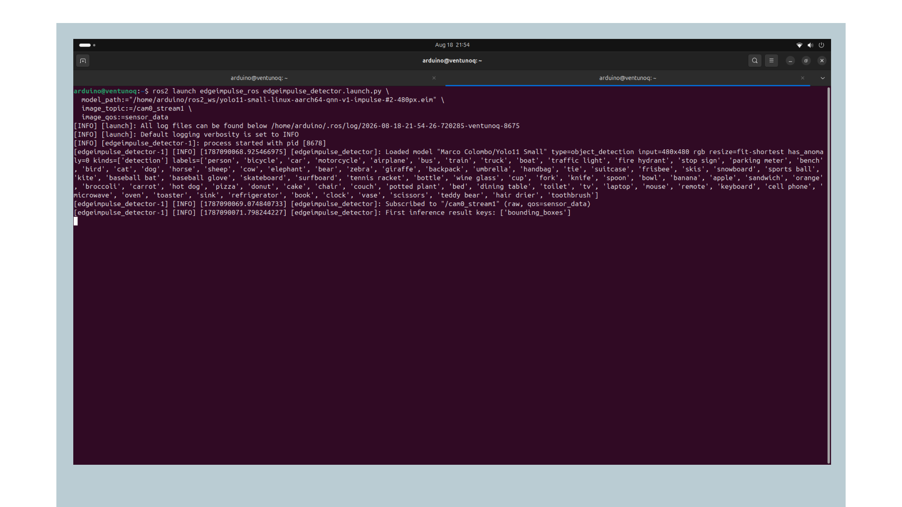

This is the pairing that makes the NV12 stream directly usable, `edgeimpulse_ros` decodes it natively, so no color conversion node is needed between the camera and the model.

#### Running with Gscam

`gscam` must already be running in its own terminal before starting the detection node, as covered earlier in this section. Point the node at the `gscam` topic:

```bash
ros2 launch edgeimpulse_ros edgeimpulse_detector.launch.py \
  model_path:="/path/to/yolo11-small-linux-aarch64-qnn-v1-impulse-2-480px.eim" \
  image_topic:=/camera/image_raw \
  image_qos:=sensor_data
```

On a successful load, the node reports the model details and begins inference:

```text
[INFO] [edgeimpulse_detector]: Loaded model "Marco Colombo/Yolo11 Small" type=object_detection input=480x480 rgb resize=fit-shortest has_anomaly=0 kinds=['detection'] labels=['person', 'bicycle', 'car', ...]
[INFO] [edgeimpulse_detector]: Subscribed to "/camera/image_raw" (raw, qos=sensor_data)
[INFO] [edgeimpulse_detector]: First inference result keys: ['bounding_boxes']
```


#### Verifying Detections

```bash
ros2 topic echo /edgeimpulse_detector/detections
```

On a successful detection, the topic reports a class label, confidence score, and bounding box in the original image's pixel coordinates:

```text
detections:
- header:
    stamp:
      sec: 1787090150
      nanosec: 737264321
    frame_id: cam0_stream1
  results:
  - hypothesis:
      class_id: chair
      score: 0.5727539658546448
    pose:
      pose:
        position: {x: 0.0, y: 0.0, z: 0.0}
        orientation: {x: 0.0, y: 0.0, z: 0.0, w: 1.0}
  bbox:
    center:
      position: {x: 389.25, y: 332.25}
      theta: 0.0
    size_x: 217.5
    size_y: 346.5
  id: ''
```

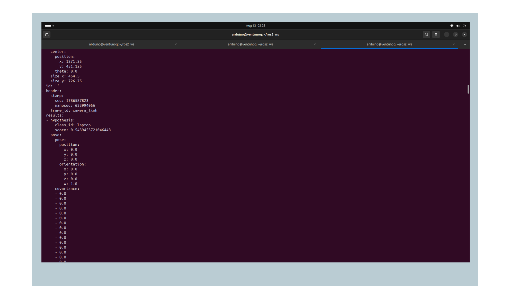

To view the annotated feed, launch with `publish_debug_image:=true` and open it in `rqt_image_view`:

```bash
ros2 run rqt_image_view rqt_image_view /edgeimpulse_detector/debug_image
```

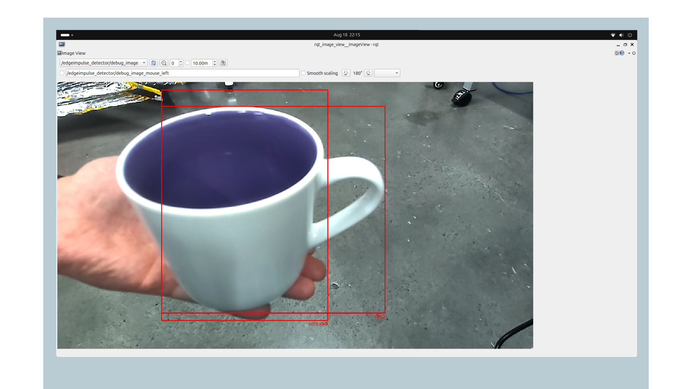

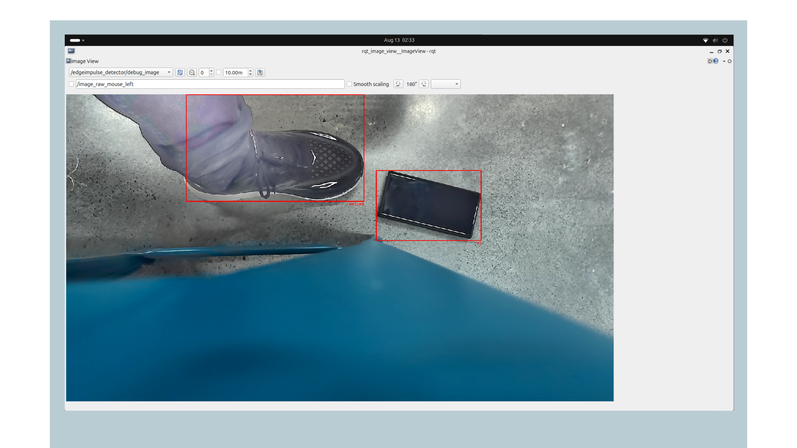

#### Edge Impulse Troubleshooting

If the node fails to start with `dependency "pyaudio" is missing`, the Edge Impulse SDK imports `pyaudio` at load time regardless of model type. Install both the system library and the Python wheel:

```bash
sudo apt install portaudio19-dev
```

```bash
pip install --user --break-system-packages pyaudio
```

If the node fails with `Model file ... is not executable`, the `.eim` file needs its execute bit set with `chmod +x`.

If no messages appear on `~/detections`, confirm the camera topic is actually publishing with `ros2 topic hz <image_topic>`, and confirm `image_qos` is compatible with the publisher, a `reliable` subscriber cannot receive from a `best_effort` publisher, `sensor_data` is the safe default used above.

## Troubleshooting

If `/dev/video0` is not found after connecting the webcam, try a different USB port and check the kernel log for device errors with:

```bash
dmesg | tail -30
```

If the `usb_cam` node starts but you are unsure which pixel format to use, run the node once and read the supported formats printed to the console, then set `pixel_format` in `config/params.yaml` to match one exactly.

If the frame rate reported by `ros2 topic hz /image_raw` climbs slowly after starting the node rather than reading close to the target framerate immediately, this is normal, the rate estimate needs a number of samples to stabilize. Let it run for at least 30 seconds before judging the actual maintained rate.

If `ros2 node list` or `ros2 topic list` come back empty even though a node is clearly running in another terminal, the ROS 2 discovery daemon may be in a stale state, which can happen after repeatedly starting and stopping nodes during testing. Restart it directly:

```bash
ros2 daemon stop
```

```bash
ros2 daemon start
```

If the webcam stops appearing under `/dev/video*` partway through a session, even though it worked earlier, check the kernel log for a disconnect event:

```bash
dmesg | tail -30
```

Look for lines mentioning the camera being disconnected or reset. If this happens repeatedly during sustained use, it can indicate a USB power delivery issue rather than a software problem, try a different USB port, and avoid USB hubs or extension cables that add resistance to the power path.

If the node reports `unknown control 'focus_auto'` and the image never comes into focus regardless of parameters set, your camera may simply not have an autofocus motor. The Logitech C270, for example, is a fixed-focus camera, factory-set for a range of roughly infinity down to about 40cm, and no ROS parameter can add autofocus capability that is not physically present in the hardware. Reposition the camera within its native focus range rather than trying to adjust focus in software.

If the CSI camera image appears out of focus, the lens can be adjusted manually. The lens is held in its mount by small screws, loosen them slightly, rotate the lens until the image is sharp, then retighten. Check the result live while adjusting, using the Edge Impulse debug image or a `gscam` stream in `rqt_image_view`.

If `rqt_image_view` reports `Unrecognized image encoding [nv12]` when viewing a `qrb_ros_camera` topic, this is expected. `cv_bridge`, which `rqt_image_view` uses to convert images for display, does not support NV12. The subscription itself is working, only the display conversion fails. View the stream through a node that decodes NV12, such as the Edge Impulse debug image, or use `gscam` which publishes RGB8.

If a CSI camera does not appear in the `dmesg | grep Probe` output, confirm the flat cable is seated correctly with the blue side facing up and toward the front of the connector, and that the board was rebooted after connecting the camera. If `gscam` starts but never publishes any image data, confirm `gstreamer1.0-plugins-qcom` is installed, this is the package that provides the `qtiqmmfsrc` element the pipeline depends on.

## Conclusion

In this tutorial, you have connected a USB webcam and a CSI camera to the VENTUNO Q and published their data as ROS 2 topics. These topics are standard ROS 2 message types that can be used directly by SLAM, navigation and AI nodes in the rest of this series.

### Next Steps

With RGB image data flowing over ROS 2 topics, you can move on to depth sensing or 2D mapping:

- [RGBD Cameras with ROS 2 on VENTUNO Q](/tutorials/ventuno-q/ros2-perception-rgbd-cam), covers the RealSense depth camera for 3D perception.
- [LiDAR with ROS 2 on VENTUNO Q](/tutorials/ventuno-q/ros2-perception-lidar), covers 2D scanning for mapping and navigation.

## Acknowledgments

ROS is a trademark of Open Source Robotics Foundation. This tutorial is provided for educational purposes to help users learn ROS 2 on Arduino hardware. This content does not imply endorsement, partnership, or affiliation between Arduino and Open Source Robotics Foundation.

## Support

If you encounter any issues or have questions while working with the VENTUNO Q, we provide various support resources to help you find answers and solutions.

### Help Center

Explore our Help Center, which offers a comprehensive collection of articles and guides for the VENTUNO Q. The Arduino Help Center is designed to provide in-depth technical assistance and help you make the most of your device.

- [Arduino Help Center](https://support.arduino.cc/hc)

### Forum

Join our community forum to connect with other users, share your experiences, and ask questions.

- [VENTUNO Q category in the Arduino Forum](https://forum.arduino.cc/c/official-hardware/uno-family/ventuno-q/222)

### Contact Us

Please get in touch with our support team if you need personalized assistance or have questions not covered by the help and support resources described above.

- [Contact us page](https://www.arduino.cc/pro/contact-us)
