## Overview

Depth cameras give a robot the ability to measure how far away every point in a scene is, not just what it looks like. In ROS 2, camera data is published over topics as standard message types, so any node in the system can subscribe to and process it regardless of which specific camera produced it.

In this tutorial, you will build the RealSense SDK and ROS wrapper on the Arduino® VENTUNO™ Q using the [`realsense-ros`](https://github.com/realsenseai/realsense-ros) package, and publish color, depth, and point cloud data as ROS 2 topics.

## Goals

- Build the RealSense SDK and ROS wrapper on the VENTUNO Q.
- Launch the RealSense node and verify color, depth, and point cloud topics.
- Verify the camera's data rate from the terminal and view it with `rqt_image_view` and RViz2.

## Hardware and Software Requirements

### Hardware Requirements

- [Arduino® VENTUNO™ Q](https://store.arduino.cc/products/ventuno-q) (x1)
- RealSense depth camera, D400 series such as the D435 (x1)
- [Arduino® USB-C Hub (8in1)](https://store.arduino.cc/products/usb-c-hub-8-in-1) (x1)
- USB keyboard, mouse and HDMI display

### Hardware Setup

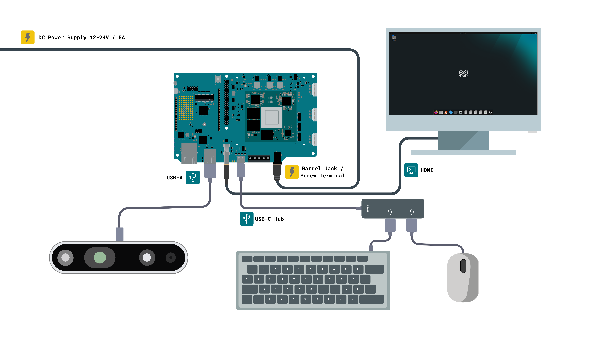

The diagram above shows the base VENTUNO Q setup used throughout this tutorial, the board, power supply, HDMI display, USB keyboard and mouse, running Ubuntu in SBC mode. This is the starting point before the camera is connected. The RealSense connects to one of the board's USB-A ports in addition to this base setup.

The VENTUNO Q has two USB-A ports, which the keyboard and mouse already occupy in this base setup. Since the RealSense also needs a USB port, a USB-C hub connected to the board's USB-C port is recommended to provide an additional USB-A port, so you do not need to disconnect the keyboard or mouse each time you connect the camera.

<Alert type="info">In this tutorial, the display connects through the board's native HDMI port, keeping the USB-C port free for the hub.</Alert>

### Software Requirements

- ROS 2 Jazzy installed on the VENTUNO Q, and a colcon workspace at `~/ros2_ws` set up, see [Getting Started with ROS 2 on VENTUNO Q](/tutorials/ventuno-q/getting-started-ros2).

<Alert type="warning">**Warning:** Make sure your VENTUNO Q has the latest system image installed and that ROS 2 Jazzy is working correctly before proceeding with this tutorial.</Alert>

## RealSense Camera

The RealSense is a depth camera that combines a standard RGB image with depth data from an infrared stereo sensor. It also produces a 3D point cloud, a set of points in space each with a position and a color, which is the main input for 3D SLAM algorithms such as *RTABMap*.

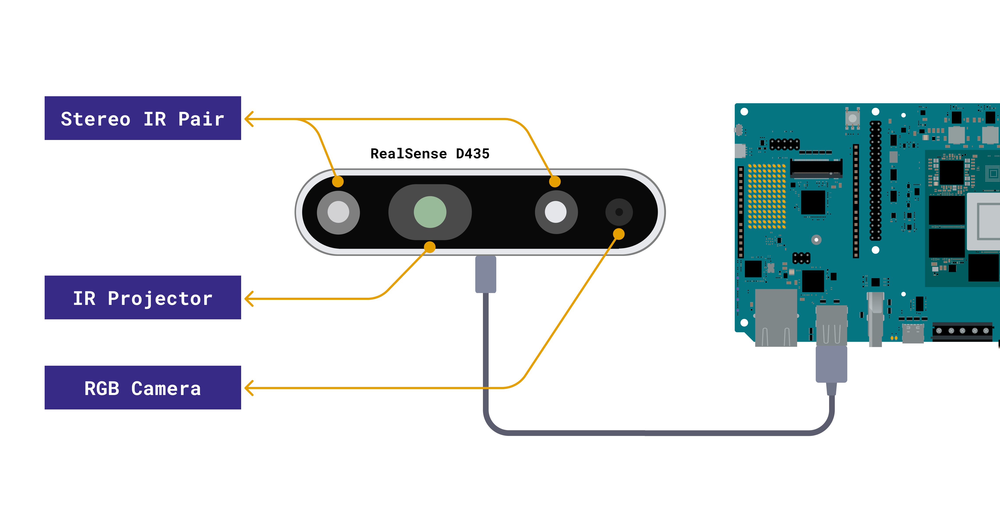

The D435 has four openings on its front face. Two of them make a stereo IR pair, working together to calculate depth by comparing the slight difference between their two views of the same scene.

Between them sits an IR projector, which casts an invisible dot pattern onto the scene, giving the stereo pair texture to match against so depth still works on plain, featureless surfaces like a blank wall.

The fourth opening is the RGB camera, capturing the normal color image. Depth comes from the stereo IR pair, color comes from the RGB camera, and the point cloud combines both.

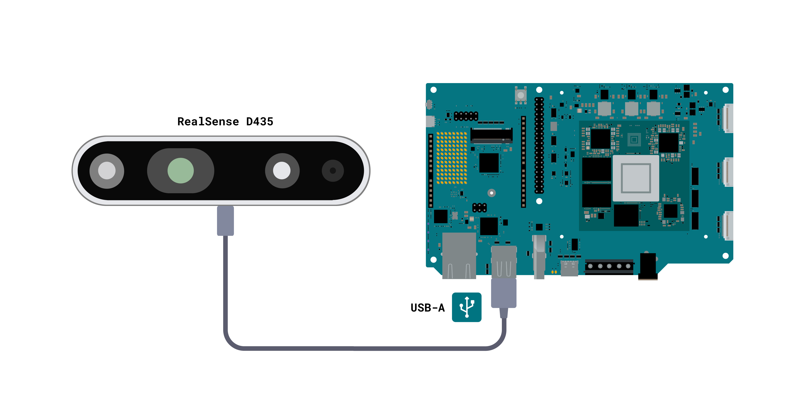

<Alert type="info">The RealSense GitHub organization was migrated to RealSenseAI. Please refer to [`realsenseai/realsense-ros`](https://github.com/realsenseai/realsense-ros) in case you find references to `IntelRealSense/realsense-ros`.</Alert>

### Installing the RealSense SDK

The RealSense ROS wrapper depends on the librealsense SDK being installed first. There are three installation options, and it is recommended to use a single installation path to avoid conflicting installations.

The first option installs the `librealsense2` Debian package directly from Intel's servers, following the [Linux Debian Installation Guide](https://github.com/realsenseai/librealsense/blob/master/doc/distribution_linux.md#installing-the-packages).

Make sure to also install the `librealsense2-dkms`, `librealsense2-utils` and `librealsense2-dev` packages alongside the base package. The `librealsense2-utils` package provides `realsense-viewer`, a graphical tool for inspecting the camera's color and depth streams directly, useful if you have a monitor connected to the VENTUNO Q.

The second option installs it through the ROS package servers:

```bash
sudo apt install ros-jazzy-librealsense2*
```

The third option builds [`librealsense`](https://github.com/realsenseai/librealsense) from source. The [Linux Installation guide](https://github.com/realsenseai/librealsense/blob/master/doc/installation.md) can be referenced which gives you access to the latest features and specific SDK versions as they are released. There are two ways to build from source, depending on whether kernel patching is available to you.

#### Kernel-Patched Build

This is RealSense's recommended build for the best performance and full multi-camera support. It uses a script that patches and rebuilds the kernel's `uvcvideo` module with RealSense-specific fixes for metadata support and frame handling.

The script fetches a matching Ubuntu kernel source from `git.launchpad.net`, based on your running kernel version:

```bash
git clone --depth 1 https://github.com/realsenseai/librealsense.git
```

```bash
cd librealsense/scripts
```

```bash
sudo bash patch-realsense-ubuntu-lts-hwe.sh
```

<Alert type="warning">**Warning:** This method requires network access to `git.launchpad.net`. If that host is unreachable in your environment, for example due to network policy restrictions, the script will hang or fail at the kernel source fetch step. Please check the connectivity first:

```bash
curl -v https://git.launchpad.net
```

If this does not connect, use the *RSUSB backend build below instead*.
</Alert>

#### RSUSB Backend Build

This method avoids kernel patching entirely, using a userspace USB driver instead of a patched kernel module. It is the standard alternative for platforms where kernel patching is not practical:

```bash
git clone --depth 1 https://github.com/realsenseai/librealsense.git
```

```bash
cd librealsense
```

```bash
mkdir build && cd build
```

```bash
cmake .. -DCMAKE_BUILD_TYPE=Release -DFORCE_RSUSB_BACKEND=true
```

```bash
make -j$(nproc)
```

```bash
sudo make install
```

After building, apply the udev rules so the camera can be accessed without root:

```bash
sudo cp ../config/99-realsense-libusb.rules /etc/udev/rules.d/
```

```bash
sudo udevadm control --reload-rules && sudo udevadm trigger
```

<Alert type="warning">If `ros-jazzy-librealsense2` is also installed, it takes priority when the ROS wrapper is built, regardless of `CMAKE_PREFIX_PATH` or `-Drealsense2_DIR` overrides. To build the ROS wrapper against this source build specifically, remove the apt package first:

```bash
sudo apt remove --purge ros-jazzy-librealsense2*
```

</Alert>

On the VENTUNO Q, the RSUSB backend can be used directly with the D435, both through the standalone SDK tools (`realsense-viewer`, `rs-enumerate-devices`) and through the ROS 2 wrapper.

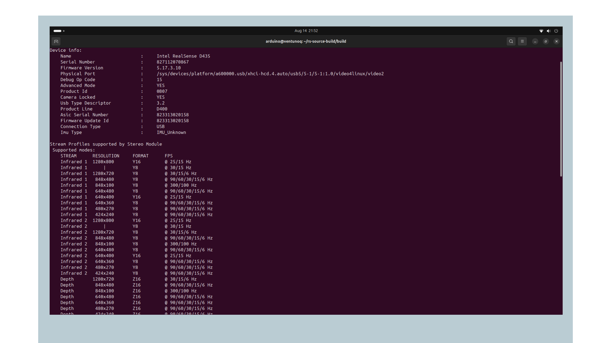

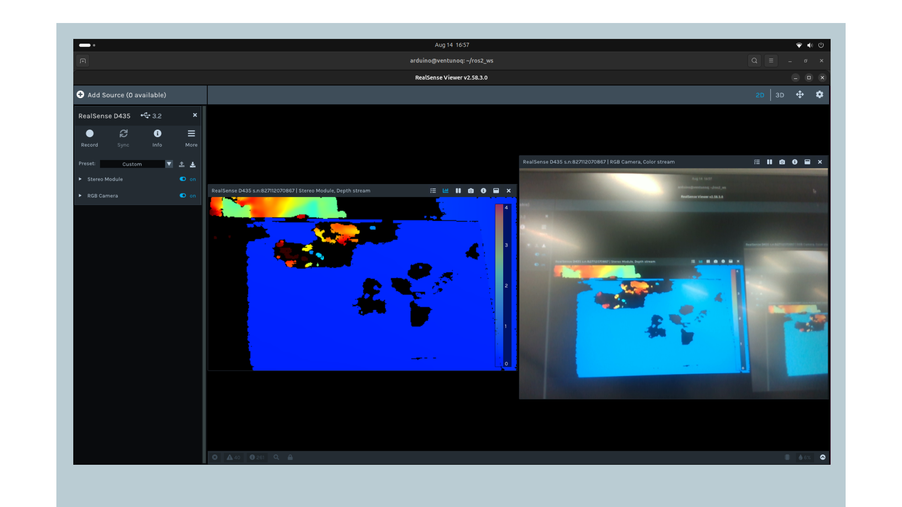

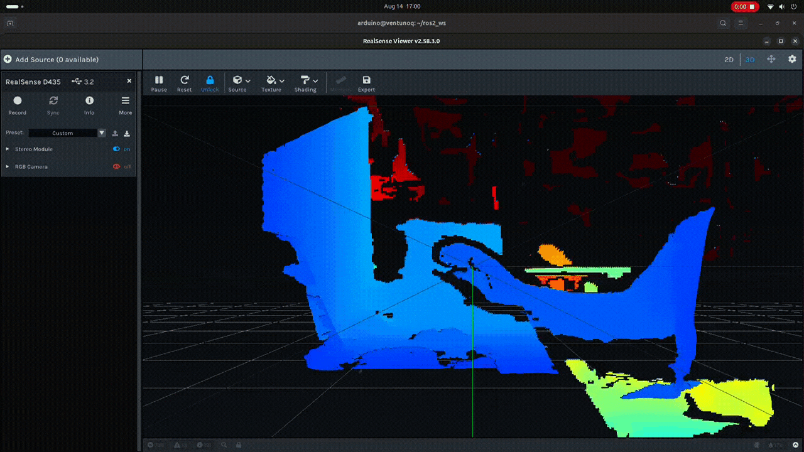

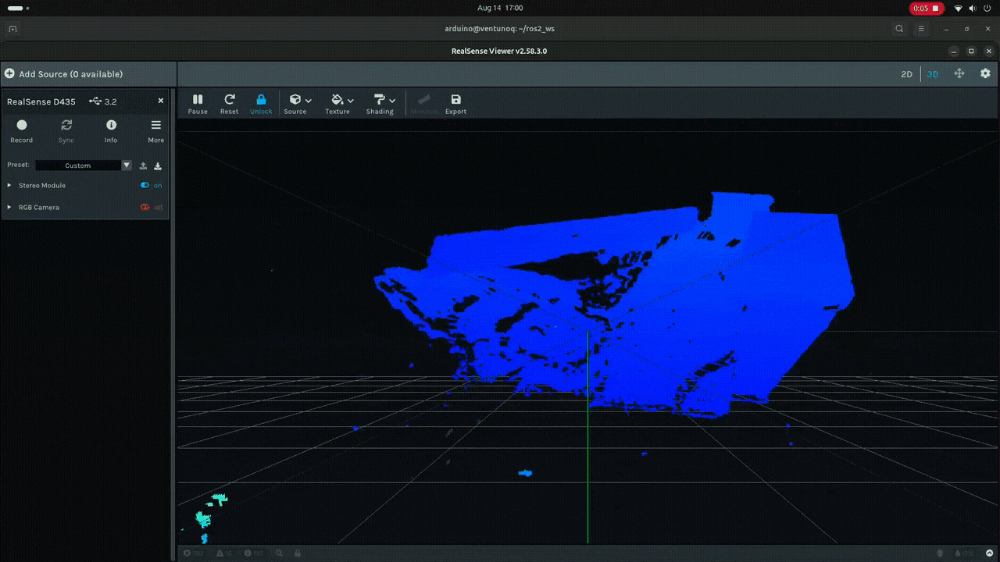

### Installing the ROS Wrapper

With the SDK installed, install the ROS wrapper. There are two options. The first option installs the wrapper directly from the ROS package servers:

```bash
sudo apt install ros-jazzy-realsense2-camera
```

If you already installed the SDK using the `ros-jazzy-librealsense2*` command above, this package may already be present as a dependency.

The second option builds it from source, giving you access to features not yet in the packaged release. Clone it into your workspace, making sure to use the `ros2-master` branch:

```bash
mkdir -p ~/ros2_ws/src
```

```bash
cd ~/ros2_ws/src/
```

```bash
git clone https://github.com/realsenseai/realsense-ros.git -b ros2-master
```

```bash
cd ~/ros2_ws
```

Install dependencies with `rosdep`. The `--skip-keys=librealsense2` flag tells rosdep not to try installing `librealsense2` again, since you already installed it in the previous step:

```bash
sudo apt-get install python3-rosdep -y
```

```bash
sudo rosdep init
```

```bash
rosdep update
```

```bash
rosdep install -i --from-path src --rosdistro jazzy --skip-keys=librealsense2 -y
```

Build and source the workspace:

```bash
colcon build
```

```bash
source /opt/ros/jazzy/setup.bash
```

```bash
cd ~/ros2_ws
```

```bash
. install/local_setup.bash
```

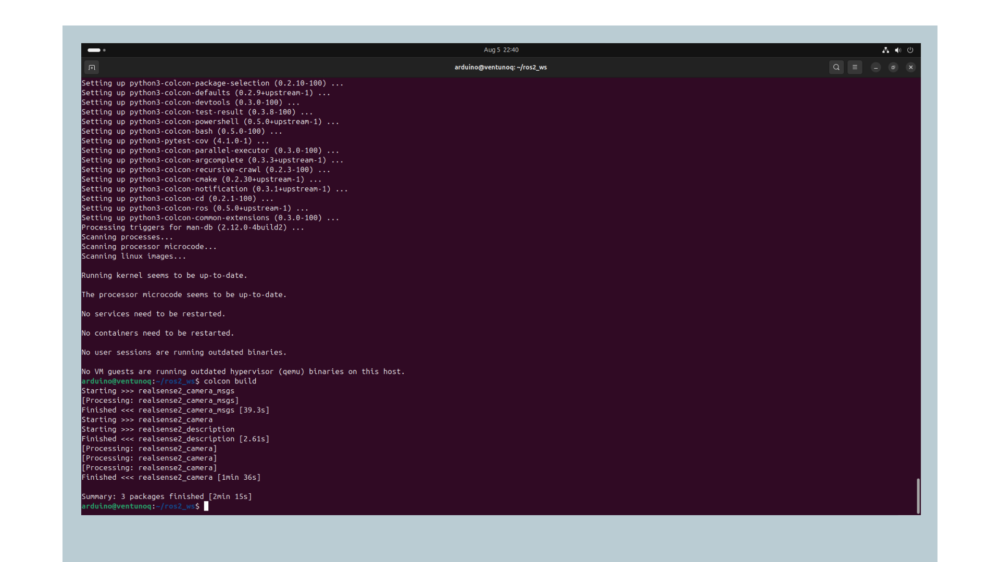

### Updating the Firmware

`librealsense` ships with a firmware update tool, `rs-fw-update`, already available once the SDK is installed. Check the camera's current firmware version:

```bash
rs-fw-update -l
```

```text
Connected devices:
1) [USB] Intel RealSense D435 s/n 827112070867, update serial number: 823313020158, firmware version: 5.17.3.10
```

Compare this against the [latest D400 series firmware release](https://dev.realsenseai.com/docs/firmware-releases-d400/). If a newer version is available, download it directly using a browser on the VENTUNO Q itself in SBC mode, this takes you through the required license agreement and downloads a compressed file containing a `Signed_Image_UVC_<version>.bin` file, by default into `~/Downloads`.

Extract the firmware file:

```bash
cd ~/Downloads
```

```bash
unzip d400_series_production_fw_<version>.zip
```

Since only one camera is connected, update it directly by path, no serial number needed. The tool requires `sudo`, and since `sudo` resets the environment by default, the library path needs to be passed explicitly:

```bash
sudo LD_LIBRARY_PATH=/opt/ros/jazzy/lib/aarch64-linux-gnu /opt/ros/jazzy/bin/rs-fw-update -f ~/Downloads/Signed_Image_UVC_<version>.bin
```

Do not disconnect the camera while the update is in progress.

<Alert type="warning">

**Warning:** If the update is interrupted, for example by a missing library path causing the command to fail partway through, the camera can be left in recovery mode, where it only responds to firmware commands and not normal operation. If a later `rs-fw-update` reports `Device is in recovery mode, use -r to recover`, rerun the same command with the `-r` flag added:

```bash
sudo LD_LIBRARY_PATH=/opt/ros/jazzy/lib/aarch64-linux-gnu /opt/ros/jazzy/bin/rs-fw-update -r -f ~/Downloads/Signed_Image_UVC_<version>.bin
```

</Alert>

On success, the tool reports the update completing and the device reconnecting:

```text
Update to FW: /home/arduino/Downloads/Signed_Image_UVC_5_17_3_10.bin
No recovery devices were found!
Warning! the camera is connected via USB 2 port, in case the process fails, connect the camera to a USB 3 port and try again
Updating device FW: 
[USB] Intel RealSense D435 s/n 827112070867, update serial number: 823313020158, firmware version: 5.17.3.10
Firmware update started. Please don't disconnect device!
Firmware update done
Waiting for device to reconnect...
Device 827112070867 successfully updated to FW: 5.17.3.10
```

### Verifying the Installation Without a Camera Connected

Before connecting a camera, you can check that the installation itself is working correctly. Launch the node with no device attached:

```bash
ros2 launch realsense2_camera rs_launch.py
```

With no camera connected, the node starts, reports its version and repeats a warning while it waits for a device:

```text
[INFO] [camera.camera]: RealSense ROS v4.58.3
[INFO] [camera.camera]: Built with LibRealSense v2.58.1
[WARN] [camera.camera]: No RealSense devices were found!
```

This verifies the node itself is installed and running correctly, it is simply waiting for a device. The warning repeats every few seconds until a camera is connected or the node is stopped with `Ctrl+C`.

You can also check the launch file's available arguments, including `pointcloud.enable` and `align_depth.enable` covered below:

```bash
ros2 launch realsense2_camera rs_launch.py --show-args
```

### Starting the Camera Node

You can start the node directly:

```bash
ros2 run realsense2_camera realsense2_camera_node
```

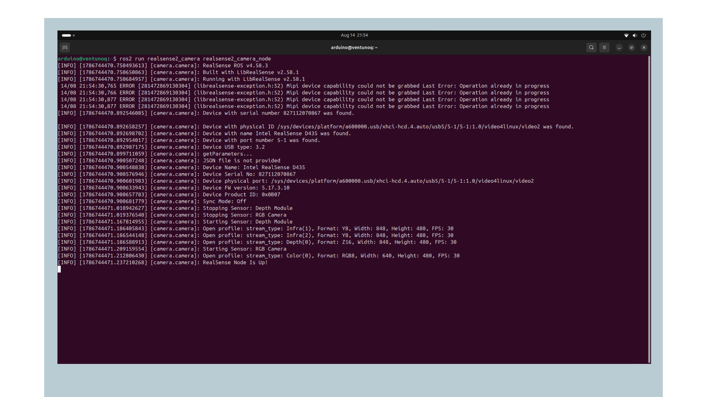

Or with the launch file, which is the recommended way since it exposes convenient arguments:

```bash
ros2 launch realsense2_camera rs_launch.py
```

With a camera connected, the node reports the detected device and opens its default streams:

```text
[INFO] [camera.camera]: Device with name Intel RealSense D435 was found.
[INFO] [camera.camera]: Device USB type: 3.2
[INFO] [camera.camera]: Set ROS param depth_module.depth_profile to default: 848x480x30
[INFO] [camera.camera]: Set ROS param depth_module.infra_profile to default: 848x480x30
[INFO] [camera.camera]: Set ROS param rgb_camera.color_profile to default: 640x480x30
[INFO] [camera.camera]: RealSense Node Is Up!
```

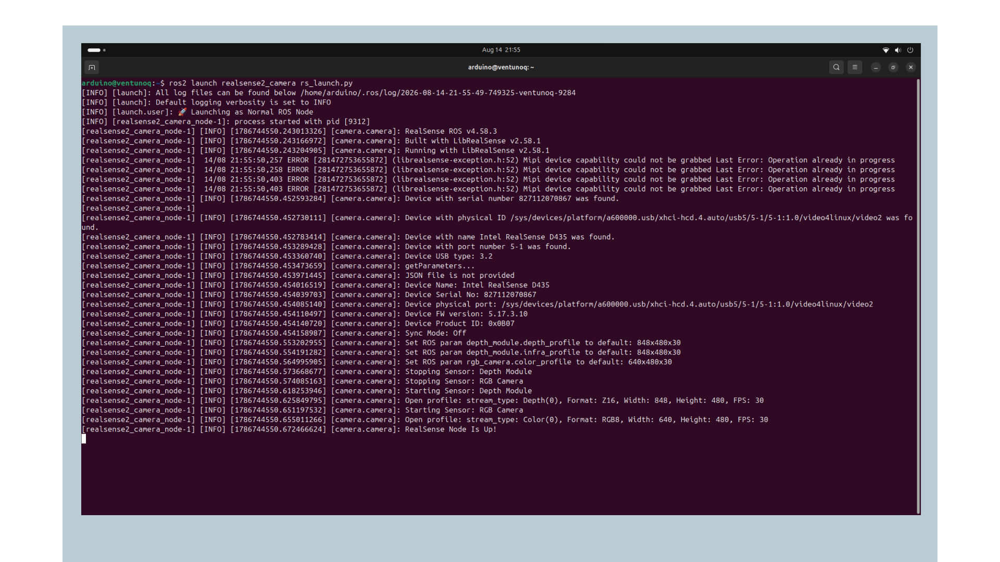

### Camera Name and Topic Structure

By default, if you do not set `camera_name` or `camera_namespace`, the node uses `camera` for both, resulting in a node called `/camera/camera` and topics nested under `/camera/camera/`. It is important to know because it affects every topic name you will use going forward. With the default settings and a D435 attached, you will see topics including:

```text
/camera/camera/color/image_raw
/camera/camera/color/camera_info
/camera/camera/color/metadata
/camera/camera/depth/image_rect_raw
/camera/camera/depth/camera_info
/camera/camera/depth/metadata
/camera/camera/extrinsics/depth_to_color
/camera/camera/extrinsics/depth_to_depth
```

Like the USB webcam, the RealSense node also publishes compressed variants of each image stream automatically through `image_transport`, for example `/camera/camera/color/image_raw/compressed`, `.../theora`, and `.../zstd`, without any extra configuration.

If you set a custom `camera_name` and `camera_namespace`, for example `camera_namespace:=robot1 camera_name:=D455_1`, the topics will be nested under `/robot1/D455_1/` instead.

### Enabling the Point Cloud and Depth Alignment

By default, `enable_color` and `enable_depth` are true, but the point cloud is not generated automatically.

Depth alignment, which most 3D mapping tools such as `RTABMap` require, can be enabled directly at launch:

```bash
ros2 launch realsense2_camera rs_launch.py align_depth.enable:=true
```

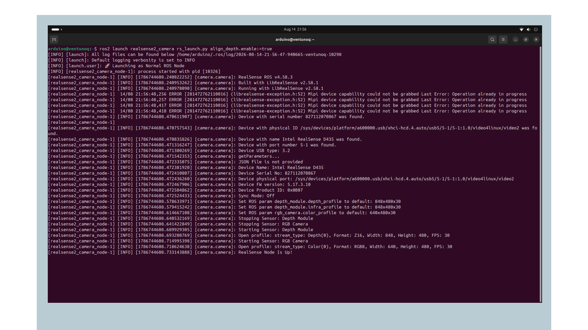

Aligning depth to color makes each pixel in the depth image correspond to the same pixel in the color image. It publishes the aligned stream on `/camera/camera/aligned_depth_to_color/image_raw`.

<Alert type="warning">On the VENTUNO Q's ARM64 build of realsense-ros, the point cloud filter is registered internally as `pointcloud__neon_`, a NEON-optimized variant, rather than the standard `pointcloud` name used in most RealSense documentation. Enable it using the corresponding parameter name at runtime, once the node is already running.</Alert>

With the node already running, enable the point cloud by setting the correct parameter directly at runtime instead:

```bash
ros2 param set /camera/camera pointcloud__neon_.enable true
```

The `/camera/camera/depth/color/points` topic appears once this parameter is set. You can check the exact parameter name on your build at any time by listing all `pointcloud` related parameters on the running node:

```bash
ros2 param list /camera/camera | grep pointcloud
```

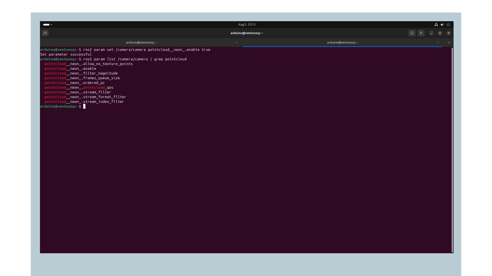

By default, the point cloud on this build publishes geometry only, `x`, `y`, `z`, and intensity, with no color data, even with the color stream running. This can be verified by checking the message fields directly:

```bash
ros2 topic echo /camera/camera/depth/color/points --no-arr
```

A geometry-only cloud reports `fields: length: 3` and `point_step: 16`. To combine color into the point cloud, set the stream filter to explicitly select the color stream:

```bash
ros2 param set /camera/camera pointcloud__neon_.stream_filter 2
```

After this, the same field check reports `fields: length: 4` and `point_step: 20`, showing color data is now included. In RViz2, the PointCloud2 display's Color Transformer will now offer `RGB8` as an option, allowing you to view the cloud in its actual captured colors instead of an intensity gradient.

### USB Bandwidth and Display Sharing

Before adjusting resolution, you can check which USB generation the camera is connected at directly from the terminal:

```bash
lsusb -t
```

Look for the bus the RealSense appears on. A bus reporting `5000M` or `10000M` is USB 3.x, a bus reporting `480M` is USB 2.x:

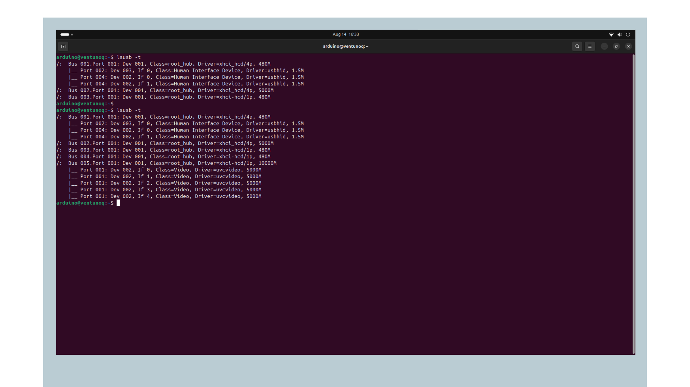

Depth and color maintain separate, independent lists of valid profiles, so query both directly rather than assuming a resolution is valid for both streams:

```bash
ros2 param describe /camera/camera depth_module.depth_profile
```

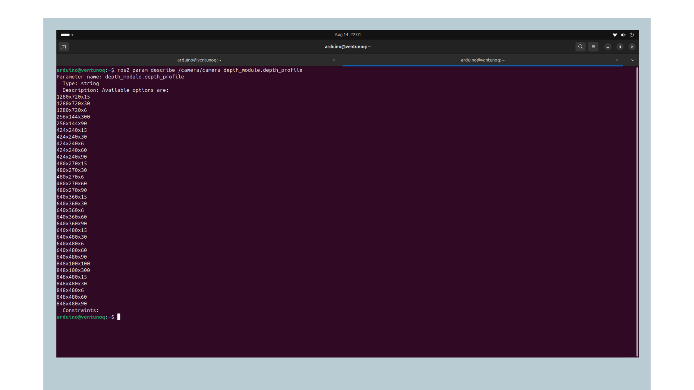

```bash
ros2 param describe /camera/camera rgb_camera.color_profile
```

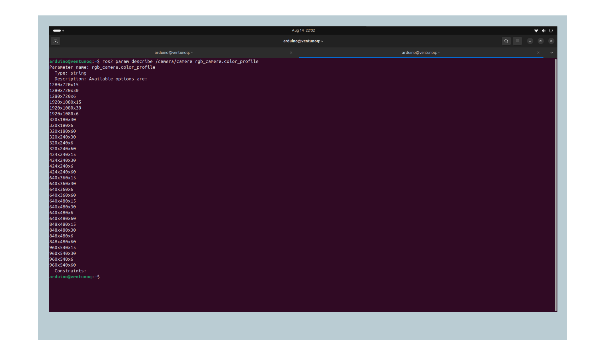

Launch with a lower resolution on both streams. For example, on a D435:

```bash
ros2 launch realsense2_camera rs_launch.py \
  align_depth.enable:=true \
  depth_module.depth_profile:=480x270x15 \
  rgb_camera.color_profile:=424x240x15
```

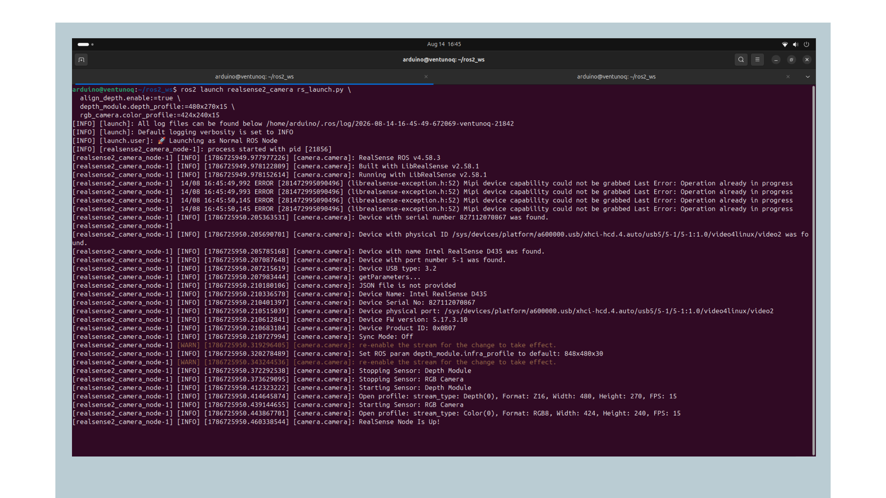

Then re-enable the point cloud as before:

```bash
ros2 param set /camera/camera pointcloud__neon_.enable true
```

At this resolution, the color stream maintains a stable 15 Hz:

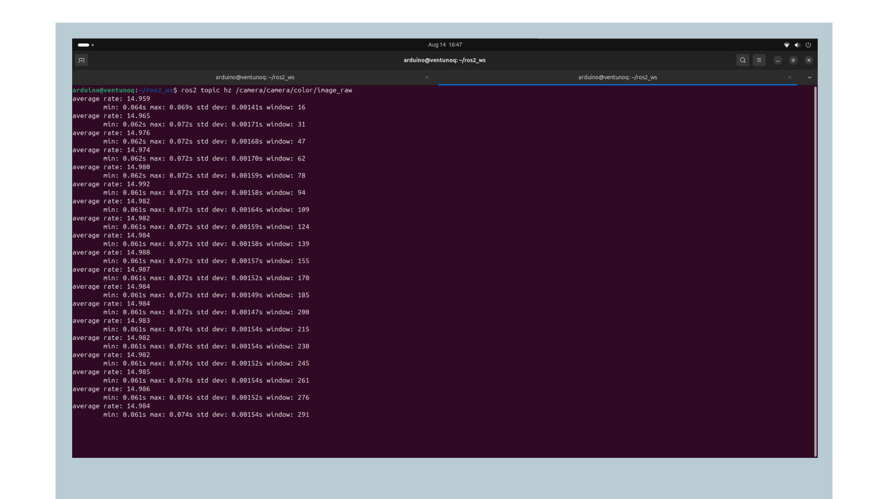

<Alert type="info">If the node reports `Device USB type: 2.1` at startup, check that the camera's firmware is current, see the [Updating the Firmware section](#updating-the-firmware) above. At this reduced resolution, a USB 3.x connection produces the most consistent results measured on this board, with tighter frame timing and no dropped connections over sustained use.</Alert>

### Verifying the Topics

With the node running, open a second terminal and list the active topics:

```bash
ros2 topic list | grep camera
```

Check the publishing rate of the color image:

```bash
ros2 topic hz /camera/camera/color/image_raw
```

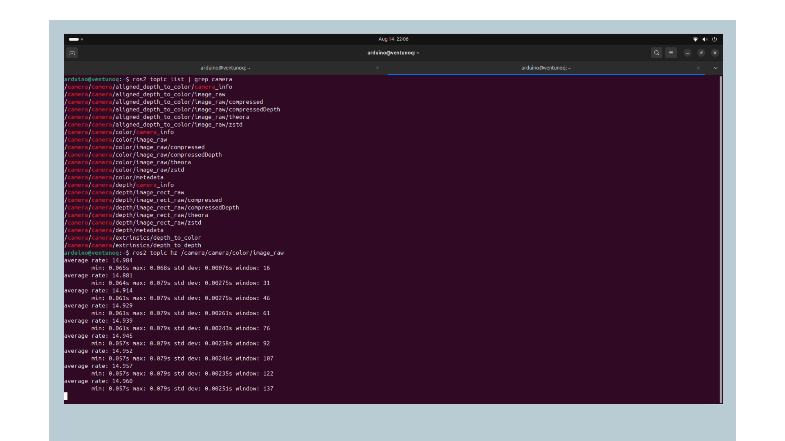

The `/camera/camera/depth/color/points` topic carries the 3D point cloud as a `sensor_msgs/PointCloud2` message, and is the topic consumed by `RTABMap` for 3D SLAM. On the VENTUNO Q, this topic only appears after setting `pointcloud__neon_.enable` at runtime, as covered above.

With a monitor connected to the VENTUNO Q, you can visualize the color stream with `rqt_image_view`:

```bash
sudo apt install ros-jazzy-rqt-image-view
```

```bash
ros2 run rqt_image_view rqt_image_view
```

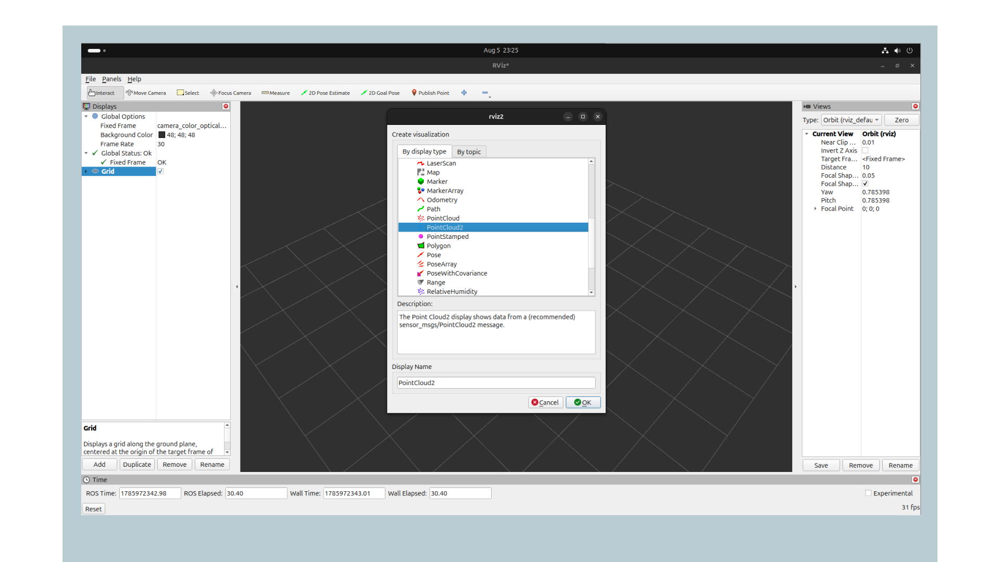

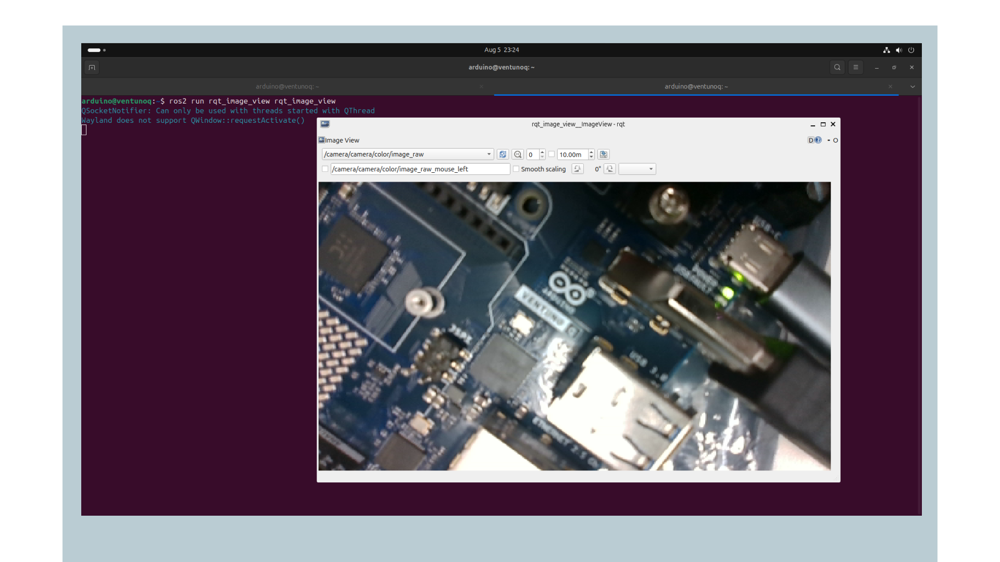

Select `/camera/camera/color/image_raw` from the topic dropdown at the top of the window. For the point cloud specifically, use [**RViz2** with a `PointCloud2` display](#visualizing-sensors-in-rviz2) set to the `/camera/camera/depth/color/points` topic, and set the Color Transformer to `RGB8` to see the actual camera colors rather than an intensity gradient.

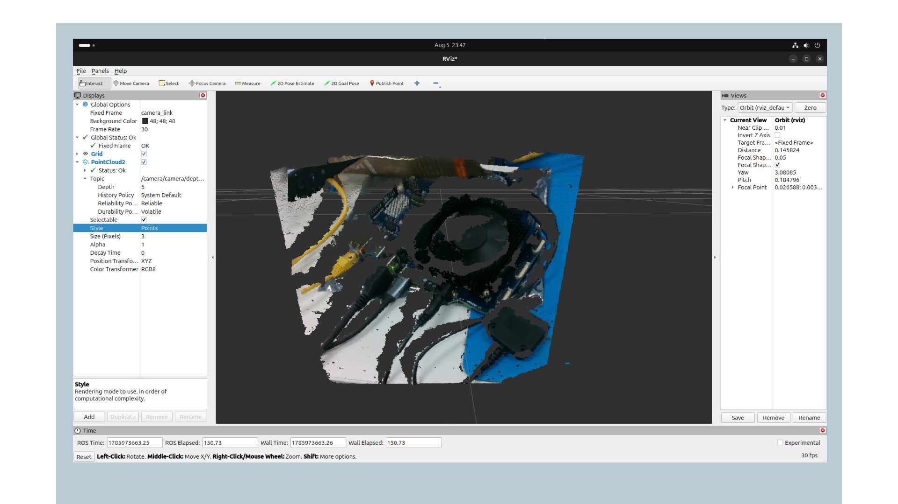

This full sequence, reduced resolution, `pointcloud__neon_.enable`, and `pointcloud__neon_.stream_filter:=2`, produces a stable, correctly colored 3D reconstruction in RViz2 on a physical D435 connected to a VENTUNO Q, at close range. At typical room-scale distances, the reduced resolution will produce a sparser cloud, since fewer points are captured overall, but the same steps apply.

## Visualizing Sensors in RViz2

You can open RViz2 manually to visualize the color image or the point cloud:

```bash
ros2 run rviz2 rviz2
```

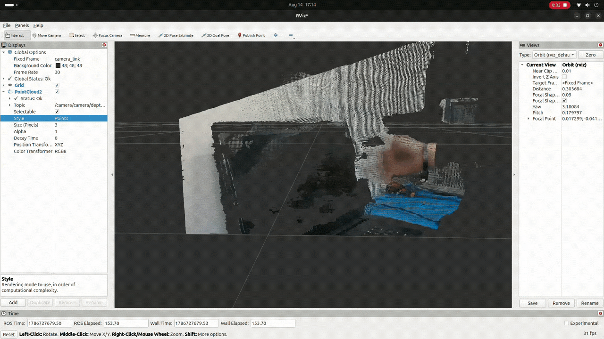

For the color image, add an Image display and set its Topic to `/camera/camera/color/image_raw`. For the point cloud, add a PointCloud2 display and set its Topic to `/camera/camera/depth/color/points`.

## Troubleshooting

If `librealsense` and the ROS wrapper conflict or produce version mismatch errors, make sure you only installed the SDK through one of the three methods described in this tutorial, not multiple. Mixing a Debian package install with a source build is the most common cause of this problem.

If `rosdep install` reports packages that cannot be found for the RealSense wrapper, make sure you passed `--skip-keys=librealsense2`, since rosdep would otherwise try to reinstall the SDK through a method that may conflict with what you already installed.

## Conclusion

In this tutorial, you have built the RealSense SDK and ROS wrapper on the VENTUNO Q and published color, depth, and point cloud data as ROS 2 topics. These topics are standard ROS 2 message types that can be used directly by SLAM, navigation and AI nodes in the rest of this series.

### Next Steps

With depth data flowing over ROS 2 topics, you can move on to 3D mapping or explore other perception sensors:

- [RGB Cameras with ROS 2 on VENTUNO Q](/tutorials/ventuno-q/ros2-perception-rgb-cam/), covers the USB webcam and CSI camera.
- [LiDAR with ROS 2 on VENTUNO Q](/tutorials/ventuno-q/ros2-perception-lidar/), covers 2D scanning for mapping and navigation.

## Acknowledgments

ROS is a trademark of Open Source Robotics Foundation. This tutorial is provided for educational purposes to help users learn ROS 2 on Arduino hardware. This content does not imply endorsement, partnership, or affiliation between Arduino and Open Source Robotics Foundation.

## Support

If you encounter any issues or have questions while working with the VENTUNO Q, we provide various support resources to help you find answers and solutions.

### Help Center

Explore our Help Center, which offers a comprehensive collection of articles and guides for the VENTUNO Q. The Arduino Help Center is designed to provide in-depth technical assistance and help you make the most of your device.

- [Arduino Help Center](https://support.arduino.cc/hc)

### Forum

Join our community forum to connect with other users, share your experiences, and ask questions.

- [VENTUNO Q category in the Arduino Forum](https://forum.arduino.cc/c/official-hardware/uno-family/ventuno-q/222)

### Contact Us

Please get in touch with our support team if you need personalized assistance or have questions not covered by the help and support resources described above.

- [Contact us page](https://www.arduino.cc/pro/contact-us)
