## Overview

A 2D LiDAR gives a robot a precise ring of distance measurements around it, which is the primary input for 2D SLAM algorithms, obstacle detection, and basic navigation. In ROS 2, all of this sensor data is published over topics as standard message types, so any node in the system can subscribe to and process it regardless of which specific sensor produced it.

In this tutorial, you will connect and configure a 2D LiDAR on the Arduino® VENTUNO™ Q, using either the [RPLidar](https://github.com/Slamtec/rplidar_ros/tree/ros2) or [LDLidar](https://github.com/ldrobotSensorTeam/ldlidar_ros2) driver.

## Goals

- Connect an RPLidar or LDROBOT LiDAR and publish scan data as a ROS 2 topic.
- Verify the LiDAR's data rate from the terminal and view it with RViz2.

## Hardware and Software Requirements

### Hardware Requirements

- [Arduino® VENTUNO™ Q](https://store.arduino.cc/products/ventuno-q) (x1)
- Slamtec RPLidar / LDROBOT LiDAR (x1)
- [Arduino® USB-C Hub (8in1)](https://store.arduino.cc/products/usb-c-hub-8-in-1) (x1)
- USB keyboard, mouse and HDMI display

### Hardware Setup

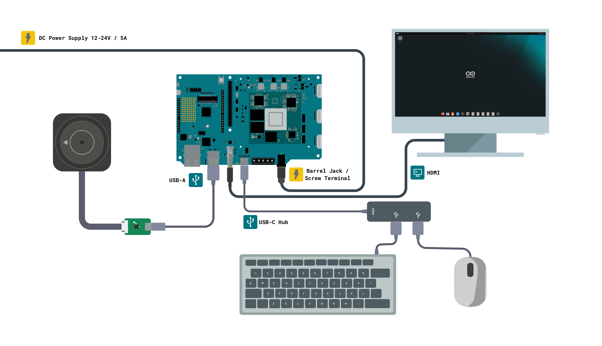

The diagram above shows the base VENTUNO Q setup used throughout this tutorial, the board, power supply, HDMI display, USB keyboard and mouse, running Ubuntu in SBC mode. This is the starting point before the LiDAR is connected. The LiDAR connects to one of the board's USB-A ports in addition to this base setup.

The VENTUNO Q has two USB-A ports, which the keyboard and mouse already occupy in this base setup. Since the LiDAR also needs a USB port, a USB-C hub connected to the board's USB-C port is recommended to provide an additional USB-A port, so you do not need to disconnect the keyboard or mouse each time you connect the sensor.

<Alert type="info">

In this tutorial, the display connects through the board's native HDMI port, keeping the USB-C port free for the hub.

</Alert>

### Software Requirements

- ROS 2 Jazzy installed on the VENTUNO Q, and a colcon workspace at `~/ros2_ws` set up, see [Getting Started with ROS 2 on VENTUNO Q](/tutorials/ventuno-q/getting-started-ros2/).

<Alert type="warning">

Make sure your VENTUNO Q has the latest system image installed and that ROS 2 Jazzy is working correctly before proceeding with this tutorial.

</Alert>

## LiDAR

A 2D LiDAR gives the robot a precise ring of distance measurements around it. This data is the main input for 2D SLAM algorithms such as *Cartographer*, obstacle detection and basic navigation.

In ROS 2, LiDAR data is published as `sensor_msgs/LaserScan` messages on the `/scan` topic.

Two options are covered here, the Slamtec RPLidar family and the LDROBOT LiDAR family. Both connect over USB and appear as a serial device on Linux.

### Connecting the LiDAR

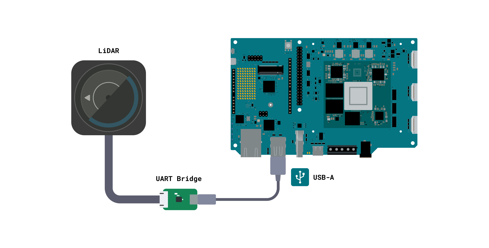

Both LiDAR units have a small marker on the housing indicating the zero-degree reference direction. Scan angles in the `/scan` topic are measured from this point, so when mounting the sensor on a robot, aligning this marker with the robot's forward direction keeps the scan data oriented the way you would expect in RViz2 and in any navigation stack using it.

Plug the LiDAR into one of the USB-A ports and check that it was detected:

```bash
ls /dev/ttyUSB*
```

You should see `/dev/ttyUSB0`. In actual use, the exact device name depends on how your system mounts it, so use `ls -l /dev` to check if you are unsure. Setting the read and write permissions can be done manually for the current session:

```bash
sudo chmod 777 /dev/ttyUSB0
```

The RPLidar driver includes a script that creates a persistent udev rule so you do not need to repeat this step after every reconnection. This is covered in the RPLidar section below.

### Slamtec RPLidar

The RPLidar is a family of 2D LiDARs from Slamtec. The ROS 2 driver, maintained on the `ros2` branch of the [rplidar_ros repository](https://github.com/Slamtec/rplidar_ros/tree/ros2), supports the following models: A1, A2, A3, S1, S2, S2E, S3, T1 and C1.

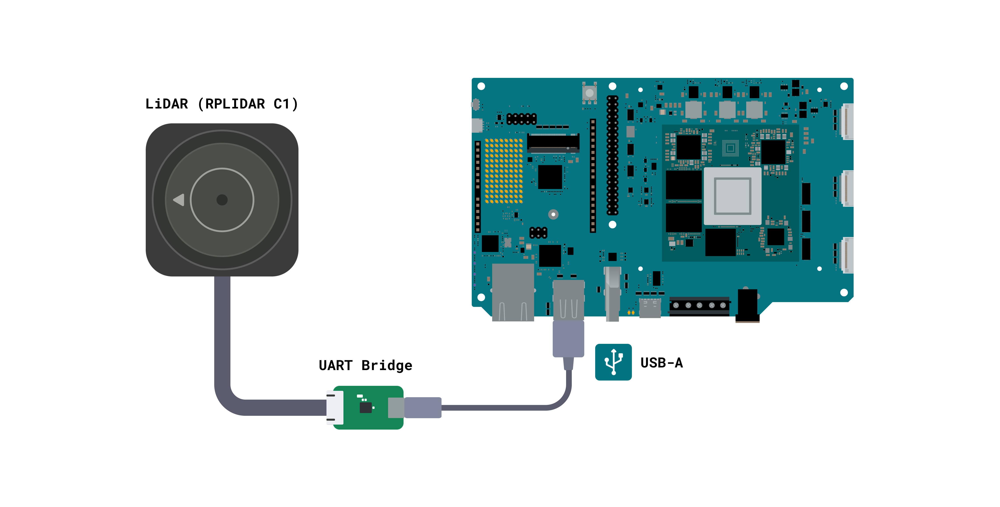

Clone the repository into your workspace, making sure to use the `ros2` branch specifically, since the default branch targets ROS 1:

```bash
cd ~/ros2_ws/src
```

```bash
git clone -b ros2 https://github.com/Slamtec/rplidar_ros.git
```

Build the package from the workspace root:

```bash
cd ~/ros2_ws/
```

```bash
source /opt/ros/jazzy/setup.bash
```

```bash
colcon build --symlink-install
```

Source the workspace:

```bash
source ./install/setup.bash
```

To avoid sourcing manually every time, add it permanently to your shell profile:

```bash
echo "source ~/ros2_ws/install/setup.bash" >> ~/.bashrc
```

```bash
source ~/.bashrc
```

### Setting Up the Udev Rule

Running the RPLidar node requires read and write permissions on the serial device. Rather than setting these manually every time, the package includes a script that creates a persistent udev rule:

```bash
cd ~/ros2_ws/src/rplidar_ros/
```

```bash
source scripts/create_udev_rules.sh
```

### Launching the RPLidar Node

Each RPLidar model has its own launch file, and the file must match your specific hardware exactly. Check the model printed on your unit before choosing a launch file, since each one is configured for its specific model. For an RPLidar C1 in this tutorial:

```bash
ros2 launch rplidar_ros rplidar_c1_launch.py
```

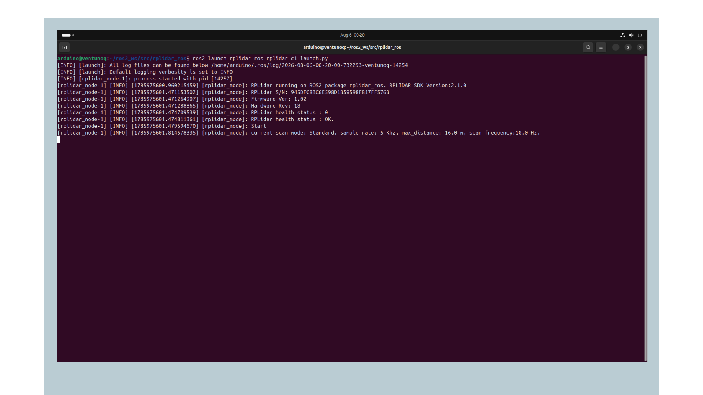

For other models, replace the model portion of the filename accordingly, for example `rplidar_a1_launch.py`, `rplidar_a2m8_launch.py`, or `rplidar_s1_launch.py`. The full list of supported models is available in the [rplidar_ros repository](https://github.com/Slamtec/rplidar_ros/tree/ros2).

On a successful connection, the node reports the unit's serial number, firmware version, and health status, then begins scanning:

```text
[INFO] [rplidar_node]: RPLidar S/N: 945DFC8BC6E598D1B59598F817FF5763
[INFO] [rplidar_node]: Firmware Ver: 1.02
[INFO] [rplidar_node]: Hardware Rev: 18
[INFO] [rplidar_node]: RPLidar health status : OK.
[INFO] [rplidar_node]: Start
[INFO] [rplidar_node]: current scan mode: Standard, sample rate: 5 Khz, max_distance: 16.0 m, scan frequency:10.0 Hz,
```

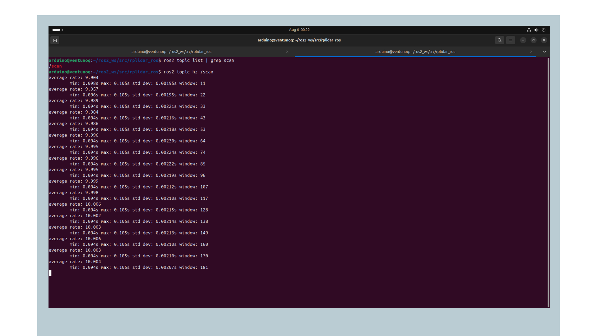

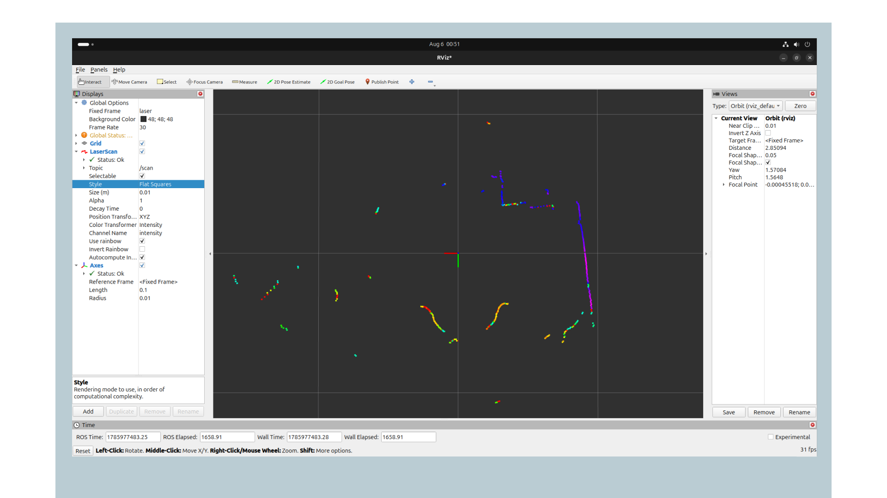

Each model also has a corresponding `view_` variant that launches RViz2 alongside the node for immediate visualization, for example `view_rplidar_c1_launch.py`. This requires a display connected to the VENTUNO Q. Without one, RViz2 fails to start with a Qt platform plugin error, while the LiDAR node itself continues to run normally.

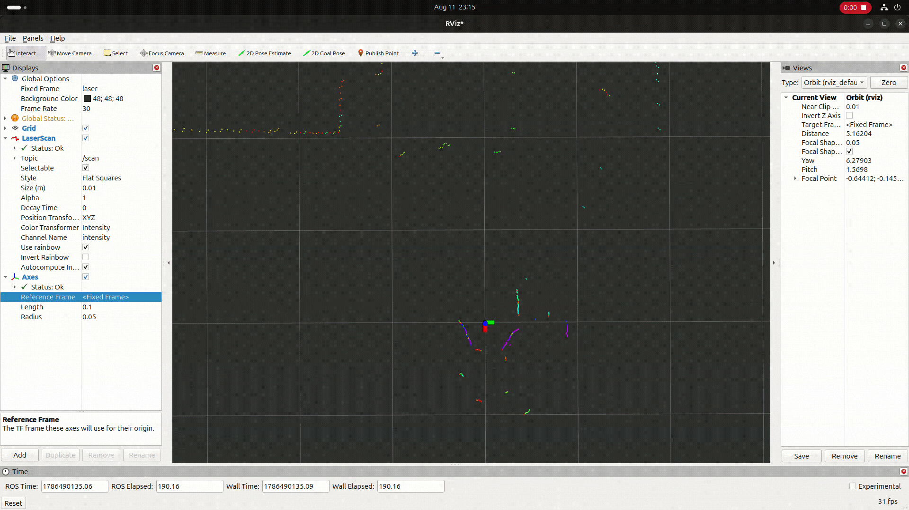

If you are working over SSH, use the plain launch file above and visualize the data separately, as covered in the Visualizing Sensors section later in this tutorial.

<Alert type="info">

Different RPLidar models use different serial baud rates. This is already configured correctly inside each model-specific launch file, so you do not need to set it manually as long as you use the correct launch file for your hardware.

</Alert>

### LDROBOT LiDAR

The LDROBOT LiDAR family includes several models such as the LD14, LD14P, LD06 and LD19. The ROS 2 driver is maintained at the [ldlidar_ros2 repository](https://github.com/ldrobotSensorTeam/ldlidar_ros2).

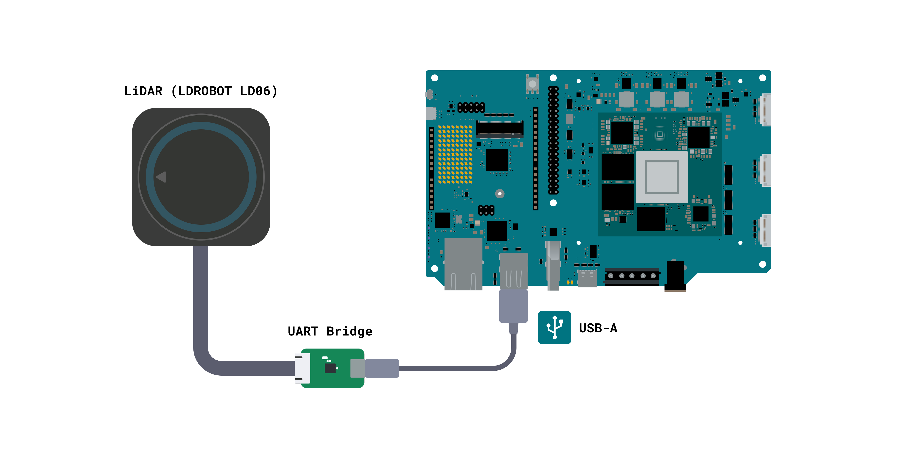

### Cloning the Driver

Create a dedicated workspace and clone the repository, then move into it to fetch its submodule:

```bash
cd ~
```

```bash
mkdir -p ldlidar_ros2_ws/src
```

```bash
cd ldlidar_ros2_ws/src
```

```bash
git clone https://github.com/ldrobotSensorTeam/ldlidar_ros2.git
```

```bash
cd ldlidar_ros2
```

```bash
git submodule update --init --recursive
```

This pulls in the `sdk/` directory, which is maintained as a separate repository and is required to build the driver.

### System Setup

Connect the LiDAR via an onboard serial port or a USB-to-serial adapter, then set the permissions on the corresponding device. Use `ls -l /dev` to check the exact device name on your system if it differs.

```bash
cd ~/ldlidar_ros2_ws
```

```bash
sudo chmod 777 /dev/ttyUSB0
```

If your device is on a different port, you will need to modify the `port_name` value inside the launch file matching your LiDAR model, found under the `launch/` directory of the cloned repository. For example, in `ld06.launch.py`, the relevant line looks like this:

```python
{'port_name': '/dev/ttyUSB0'},
```

### Building the Driver

Before building, add the `pthread.h` include to the SDK's log module, this helps the build compile cleanly on Linux:

```bash
sed -i '/#include <stdlib.h>/a #include <pthread.h>' ~/ldlidar_ros2_ws/src/ldlidar_ros2/sdk/src/log_module.cpp
```

```bash
cd ~/ldlidar_ros2_ws
```

```bash
colcon build
```

Source the workspace:

```bash
source install/local_setup.bash
```

To avoid sourcing manually every time, add it to your shell profile:

```bash
echo "source ~/ldlidar_ros2_ws/install/local_setup.bash" >> ~/.bashrc
```

```bash
source ~/.bashrc
```

### Launching the LiDAR Node

Use the launch file matching your specific LiDAR model. For the LD06:

```bash
ros2 launch ldlidar_ros2 ld06.launch.py
```

For the LD14, LD14P or LD19, replace the model name accordingly, for example `ld14.launch.py` or `ld19.launch.py`.

On startup, the node prints the parameters it is using, verifies the connected module and reports a successful connection:

```text
[INFO] [ldlidar_publisher_ld06]: LDLIDAR SDK Pack Version is:3.3.1
[INFO] [ldlidar_publisher_ld06]: ROS2 param input:
[INFO] [ldlidar_publisher_ld06]: <product_name>: LDLiDAR_LD06
[INFO] [ldlidar_publisher_ld06]: <laser_scan_topic_name>: scan
[INFO] [ldlidar_publisher_ld06]: <frame_id>: base_laser
[INFO] [ldlidar_publisher_ld06]: <port_name>: /dev/ttyUSB0
[INFO] [ldlidar_publisher_ld06]: <serial_baudrate>: 230400
[INFO] [ldlidar_publisher_ld06]: <range_min>: 0.020000
[INFO] [ldlidar_publisher_ld06]: <range_max>: 12.000000
[INFO] [ldlidar_publisher_ld06]: ldlidar serial connect is success
[INFO] [ldlidar_publisher_ld06]: ldlidar communication is normal.
[INFO] [ldlidar_publisher_ld06]: ldlidar driver start is success.
[INFO] [ldlidar_publisher_ld06]: start normal, pub lidar data
```

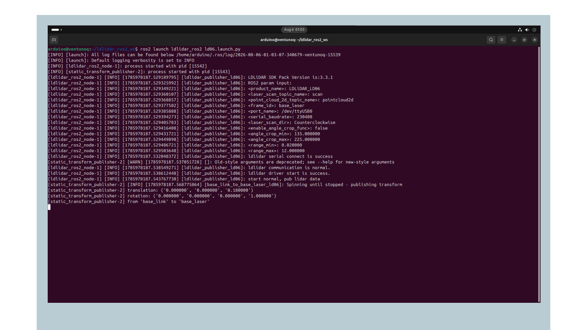

Note that the LDROBOT driver publishes on the `base_laser` frame, unlike the plain `laser` frame used by the RPLidar driver, which is worth keeping in mind when setting the Fixed Frame in RViz2.

Without a LiDAR connected, the node fails immediately rather than retrying, printing an error log before exiting:

```text
[ERROR] [ldlidar_publisher_ld06]: ldlidar serial connect is fail
[LOG][ERROR][.../serial_interface_linux.cpp][Open][41][Open open error,No such file or directory]
[LOG][ERROR][.../ldlidar_driver_linux.cpp][Connect][78][serial is not open:/dev/ttyUSB0]
```

This verifies that the node, its parameters, and the ROS 2 launch file are all working correctly. Connect the LiDAR and rerun the launch command once you see this.

To launch the node together with RViz2 visualization already configured, use the corresponding viewer launch file instead:

```bash
ros2 launch ldlidar_ros2 viewer_ld06.launch.py
```

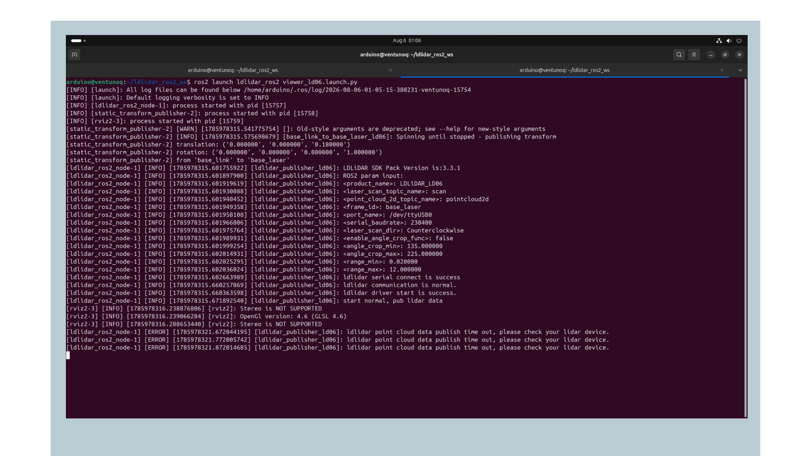

The same pattern applies to the other models, for example `viewer_ld14.launch.py` or `viewer_ld19.launch.py`. This requires a display connected to the VENTUNO Q. Without one, RViz2 fails to start with a Qt platform plugin error, while the LiDAR node's own connection attempt proceeds independently. If you are working over SSH, use the plain launch file above.

The viewer launch file also starts a static transform publisher automatically, connecting the `base_laser` frame to a `base_link` frame, giving RViz2 a complete transform tree to work with immediately.

### Verifying the Scan Data

With either driver running, open a second terminal and confirm that the `/scan` topic is being published, using the following command:

```bash
ros2 topic list | grep scan
```

Check the publishing rate:

```bash
ros2 topic hz /scan
```

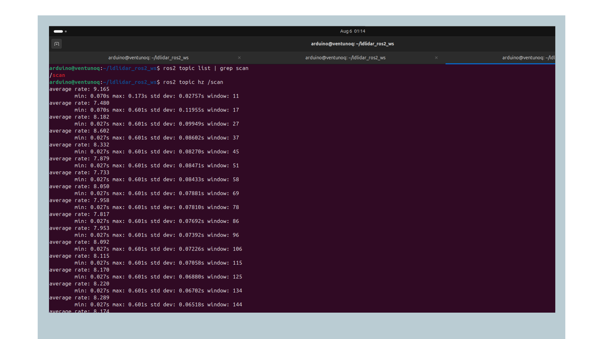

On an RPLidar C1, it maintains a stable 10 Hz, matching the scan frequency the node reports at startup. On an LDROBOT LD06, the rate settles in the 7 to 9 Hz range.

To visualize the scan in RViz2:

```bash
ros2 run rviz2 rviz2
```

Set the Fixed Frame under Global Options to match your driver, `laser` for RPLidar or `base_laser` for LDROBOT LiDARs, checking the exact frame name if needed:

```bash
ros2 topic echo /scan --no-arr | grep frame_id
```

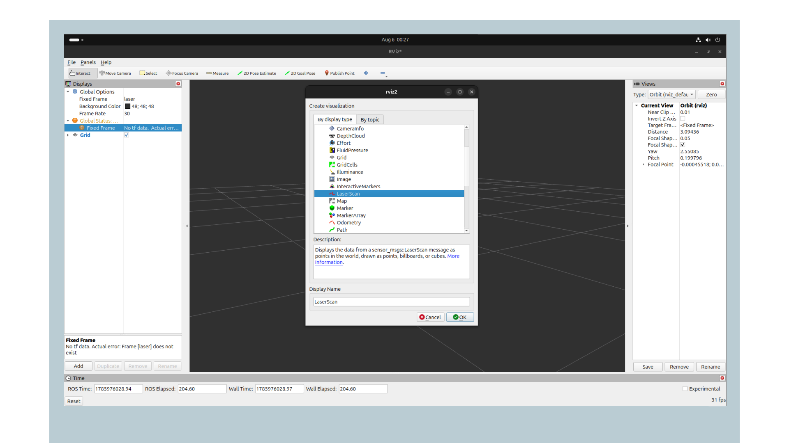

Add a *LaserScan* display (not *PointCloud2*), since scan data and point cloud data are different message types, and set its Topic to `/scan`.

You should see the scan render as a flat ring or arc of colored points tracing the outline of nearby obstacles and walls, updating in real time as the environment or sensor moves.

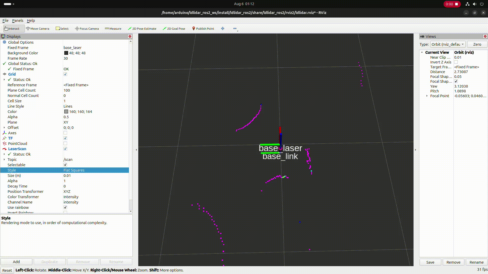


## Troubleshooting

If the RPLidar driver fails to open the serial port, make sure you ran the udev rule script from inside the `rplidar_ros` package directory, and try reconnecting the sensor afterward.

If the `colcon build` step fails for the RPLidar driver, make sure you cloned the `ros2` branch specifically, since the default branch targets ROS 1 and will not build with ROS 2 tooling.

If the LDLidar driver fails to build or is missing files, make sure you ran `git submodule update --init --recursive` after cloning, since the repository depends on a submodule for the underlying SDK.

If the `/scan` topic is not publishing for either LiDAR, check that the motor is spinning. Most LiDARs produce a faint sound when the motor is running. If it is silent, check the power connection to the sensor.

## Conclusion

In this tutorial, you have connected a 2D LiDAR to the VENTUNO Q, using either the RPLidar or LDROBOT family, and published its scan data as a ROS 2 topic. This topic is a standard ROS 2 message type that can be used directly by SLAM, navigation and AI nodes in the rest of this series.

### Next Steps

With scan data flowing over ROS 2 topics, you can move on to other perception sensors or 2D mapping:

- [RGB Cameras with ROS 2 on VENTUNO Q](/tutorials/ventuno-q/ros2-perception-rgb-cam/), covers the USB webcam and CSI camera.
- [RGBD Cameras with ROS 2 on VENTUNO Q](/tutorials/ventuno-q/ros2-perception-rgbd-cam/), covers the RealSense depth camera for 3D perception.

## Acknowledgments

ROS is a trademark of Open Source Robotics Foundation. This tutorial is provided for educational purposes to help users learn ROS 2 on Arduino hardware. This content does not imply endorsement, partnership, or affiliation between Arduino and Open Source Robotics Foundation.

## Support

If you encounter any issues or have questions while working with the VENTUNO Q, we provide various support resources to help you find answers and solutions.

### Help Center

Explore our Help Center, which offers a comprehensive collection of articles and guides for the VENTUNO Q. The Arduino Help Center is designed to provide in-depth technical assistance and help you make the most of your device.

- [Arduino Help Center](https://support.arduino.cc/hc)

### Forum

Join our community forum to connect with other users, share your experiences, and ask questions.

- [VENTUNO Q category in the Arduino Forum](https://forum.arduino.cc/c/official-hardware/uno-family/ventuno-q/222)

### Contact Us

Please get in touch with our support team if you need personalized assistance or have questions not covered by the help and support resources described above.

- [Contact us page](https://www.arduino.cc/pro/contact-us)
