## Introduction

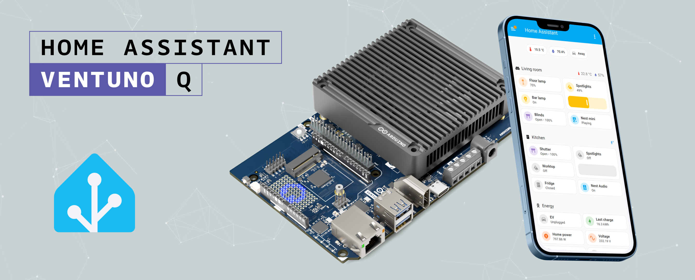

[Home Assistant](https://www.home-assistant.io/) is the ultimate open-source platform for smart home automation. By utilizing the Arduino® VENTUNO™ Q as a Single Board Computer, you can host a robust HomeLab environment locally. This application note guides you through deploying Home Assistant via Docker, ensuring your smart home data remains entirely under your control and offline.

## Goals

The main objectives of this tutorial are:

- **Showcase the simplicity of Docker:** Deploy a local Home Assistant instance using a single container command.
- **Expand your HomeLab:** Transform the Arduino VENTUNO Q from a development board into a dedicated, locally hosted smart home server.
- **Establish a solid foundation:** Configure persistent local storage to ensure your IoT automations, devices, and configurations remain secure and stable across updates and reboots.

## Hardware and Software Requirements

### Hardware Requirements

- [Arduino® VENTUNO™ Q](https://store.arduino.cc/products/ventuno-q) (x1)
- [Modulino Thermo](https://store-usa.arduino.cc/products/modulino-thermo) (x1)
- [Arduino® USB-C Power Supply (65W)](https://store.arduino.cc/products/usb-c-power-supply-65w)\*

\*Other power supplies can be used, within the range of 7-24 V and ≥ 3 A. See the [User Manual - Power Section](/tutorials/ventuno-q/user-manual/#power-overview) for more information.

### Software Requirements

- [Arduino App Lab](https://www.arduino.cc/en/software/#app-lab-section)
- Docker Engine installed.

## Installation Setup

To ensure your smart home configurations, devices, and automations are not lost when the Docker container updates or restarts, we must map a local folder to the container. Furthermore, setting the correct Timezone is critical for time-based automations.

1. **Create the configuration folder:** Open your VENTUNO Q terminal and create a dedicated directory.
   `mkdir -p ~/homeassistant_config`
2. **Verify the absolute path:** Find the exact path to use in your Docker command.
   `cd ~/homeassistant_config && pwd` (This will output something like `/home/arduino/homeassistant_config`).
3. **Run the Docker Container:** Execute the following command. Make sure to replace the volume path with your absolute path, and adjust the `TZ` variable to your [local timezone](https://en.wikipedia.org/wiki/List_of_tz_database_time_zones) (e.g., `America/Santo_Domingo`).
   ```bash
   docker run -d \
     --name homeassistant \
     --privileged \
     --restart=unless-stopped \
     -e TZ=America/Santo_Domingo \
     -v /home/arduino/homeassistant_config:/config \
     -v /run/dbus:/run/dbus:ro \
     --network=host \
     ghcr.io/home-assistant/home-assistant:stable
   ```

Your Home Assistant container is now running in the background! You can access the onboarding web interface by navigating to `http://<VENTUNO_Q_IP>:8123` in your browser.

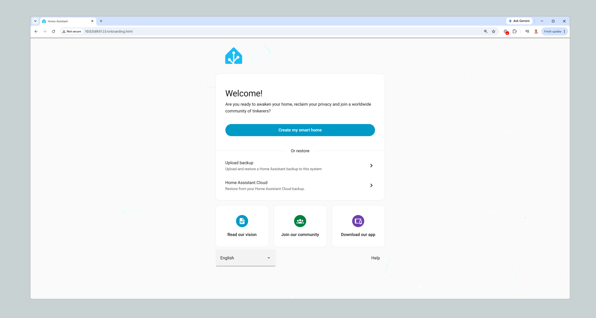

Click on the **Create my Smart Home** button and follow the steps shown:

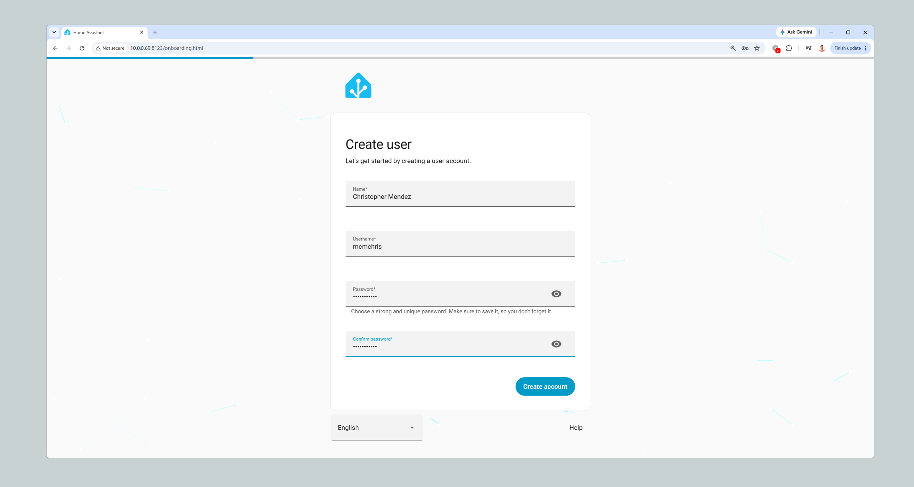

Here, you need to create the primary administrator account for your smart home:

- **Name & Username:** Enter your full name and choose a unique username.
- **Password:** Set a strong and secure password. Since this account will control your entire HomeLab, security is key!
- Click the **Create account** button to proceed.

> **Note:** Keep these credentials safe, as you will need them to log in to your Home Assistant dashboard.

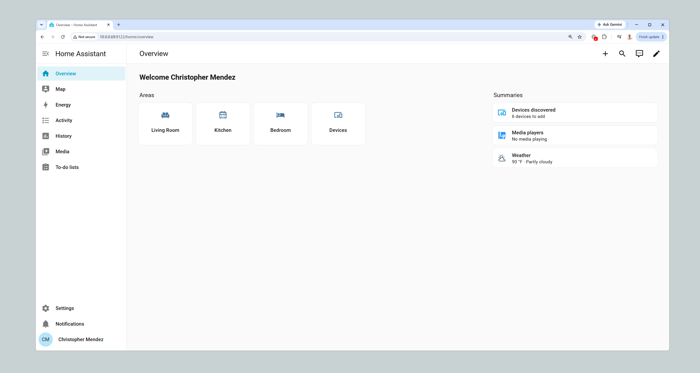

Congratulations, your local Home Assistant instance is up and running! After completing the initial setup, you will be redirected to the main **Overview** dashboard.

This is the command center for your smart home. Right out of the box, you will notice a few key areas:

* **Navigation Sidebar:** Located on the left, this menu gives you access to your Settings, History, Energy monitoring, and more.
* **Areas:** You can organize your smart home logically by assigning devices to specific rooms (like the Living Room or Kitchen).
* **Auto-Discovery:** Notice the "Devices discovered" card on the right. Home Assistant automatically scans your local network for compatible smart devices, making it incredibly easy to start building your HomeLab.

## MQTT Sensor Integration

To truly unlock the power of your HomeLab, we need a way to communicate physical hardware with your Home Assistant dashboard. We will achieve this using **MQTT** (Message Queuing Telemetry Transport), the standard messaging protocol for IoT.

While in this example we are connecting a sensor directly to the VENTUNO Q, **this exact same MQTT architecture applies to any wireless sensor or Arduino node** (like an Arduino Nano 33 IoT or ESP32) sending data over your Wi-Fi network.

### 1. Hardware Connection

We will use the **Modulino Thermo** to read real-time temperature and humidity.
Simply connect the Modulino Thermo to the Qwiic (I2C) connector on your Arduino VENTUNO Q using a Qwiic cable.

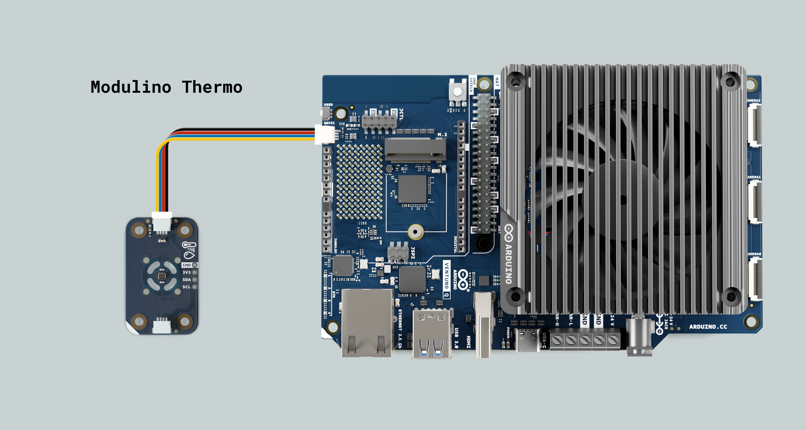

### 2. Setting Up the MQTT Broker (Mosquitto)

Home Assistant needs a "Broker" to receive and route MQTT messages. Since we are using Docker, we can deploy the Eclipse Mosquitto broker alongside Home Assistant.

1. **Create the necessary configuration directories:** Run this on your VENTUNO Q:
   ```bash
   mkdir -p ~/mosquitto/config ~/mosquitto/data ~/mosquitto/log
   ```
2. **Create a basic configuration file:** This demo configuration allows connections without a password, including from other devices on your local network. Use it only on a trusted network; configure authentication before using it in a shared or production environment.
   ```bash
   nano ~/mosquitto/config/mosquitto.conf
   ```
3. **Paste the following lines:** Then save and exit (`Ctrl+O`, `Enter`, `Ctrl+X`):
   ```text
   listener 1883
   allow_anonymous true
   ```
4. **Run the Mosquitto Docker container:**
   ```bash
   docker run -d \
     --name mosquitto \
     --restart unless-stopped \
     -p 1883:1883 \
     -v /home/arduino/mosquitto/config:/mosquitto/config \
     -v /home/arduino/mosquitto/data:/mosquitto/data \
     -v /home/arduino/mosquitto/log:/mosquitto/log \
     eclipse-mosquitto:latest
   ```

### 3. Deploying the Arduino App Lab Project

We have prepared an App Lab project that reads data from the Modulino Thermo (via the MCU) and publishes it to the MQTT Broker (via Python).

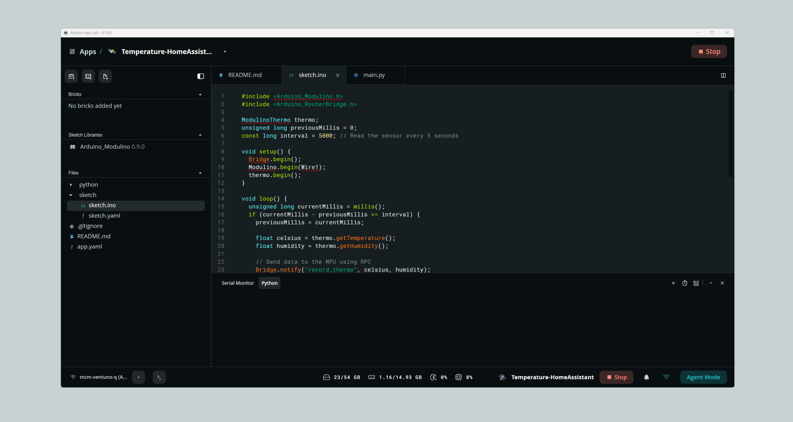

1. **Download the App:** [Download the MQTT Thermo Bridge App here](assets/Temperature-HomeAssistant.zip).
2. **Import the App:** Open Arduino App Lab, create a new app by importing the downloaded file.
3. Click **Run** in Arduino App Lab to start broadcasting data.

### 4. Configuring MQTT in Home Assistant

Now, we need to tell Home Assistant to listen to our new broker.

1. Go to your Home Assistant interface.
2. Navigate to **Settings > Devices & services**.
3. Click the **+ Add Integration** button in the bottom right.
4. Search for **MQTT** and select it.
5. In Home Assistant's MQTT integration, enter `127.0.0.1` in the **Broker** field and `1883` in the **Port** field, without `http://`. Home Assistant uses host networking, so this connects to the broker on your VENTUNO Q without depending on its network IP address. Leave the username and password blank, and click **Submit**.

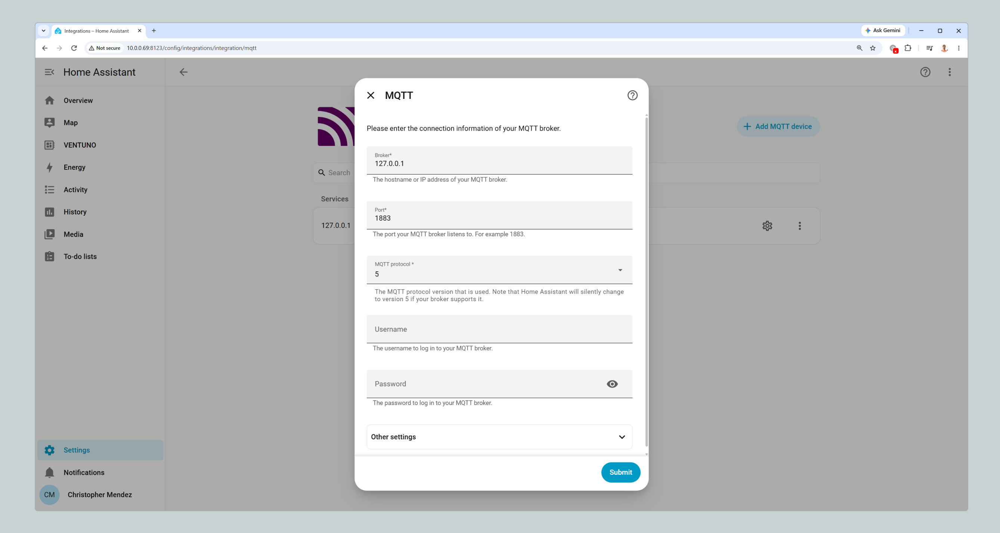

### 5. Verifying the Data Stream

Let's ensure the data is arriving correctly from the Python script.

1. On the MQTT integration page, click on **Configure**.
2. Scroll down to the **Listen to a topic** section.
3. In the "Topic to subscribe to" field, type: `ventuno_q/thermo/state`
4. Toggle the **Format JSON content** switch and click **Start listening**.
5. Every 5 seconds, you should see a new incoming payload with your sensor data.

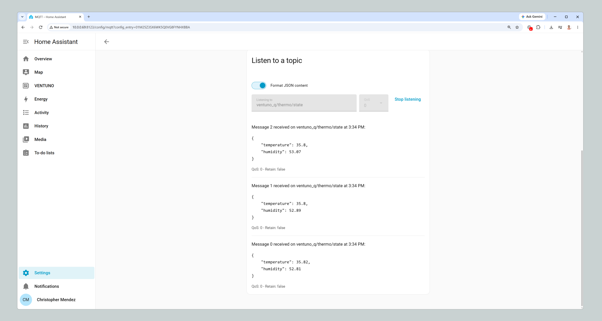

### 6. Mapping the Data to Sensors

To display this data on a dashboard, we must map the raw JSON payload into Home Assistant sensor entities.

1. **Open your VENTUNO Q terminal:** Edit the Home Assistant configuration file. Use `sudo` if necessary depending on your user permissions:
   ```bash
   sudo nano /home/arduino/homeassistant_config/configuration.yaml
   ```
2. **Append the YAML block:** Add the following at the end of the file:
   ```yaml
   mqtt:
     sensor:
       - name: "Ventuno Temperature"
         state_topic: "ventuno_q/thermo/state"
         unit_of_measurement: "°C"
         device_class: temperature
         value_template: "{{ value_json.temperature }}"
   
       - name: "Ventuno Humidity"
         state_topic: "ventuno_q/thermo/state"
         unit_of_measurement: "%"
         device_class: humidity
         value_template: "{{ value_json.humidity }}"
   ```
   It should look like this:

   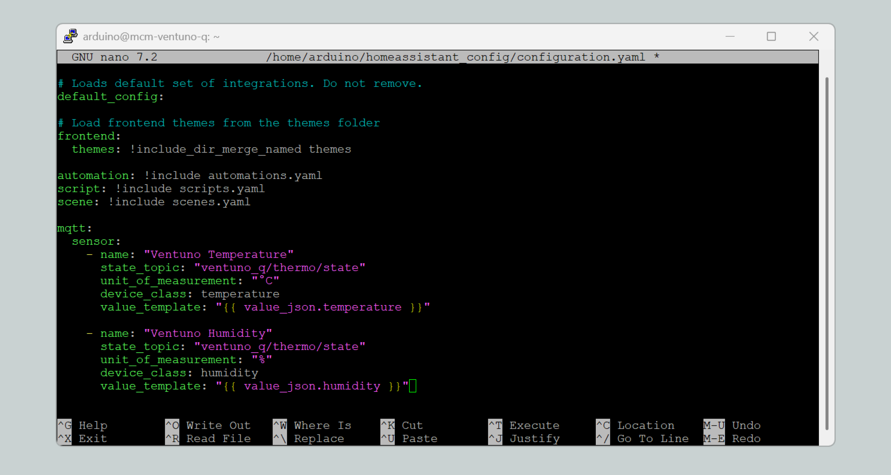

3. **Save the file:** (`Ctrl+O`, `Enter`, `Ctrl+X`).
4. **Go back to Home Assistant:** Navigate to **Developer Tools > YAML**.
5. **Check Configuration:** Click **Check Configuration**. If it is valid, click **Restart** to apply the changes.

### 7. Building the Dashboard

With the sensors created, we can now visualize the environment!

1. Go to **Settings > Dashboards** and click **+ Add Dashboard**.
2. Select **New dashboard from scratch** and name it "VENTUNO".
3. Open your new dashboard from the left sidebar and click the pencil icon (Edit) in the top right.
4. Click **+ Add Card**. You can use **Gauge** cards for a speedometer-like look, or **History graph** cards to see temperature trends over time.
5. Search for the `sensor.ventuno_temperature` and `sensor.ventuno_humidity` entities and add them to your cards.

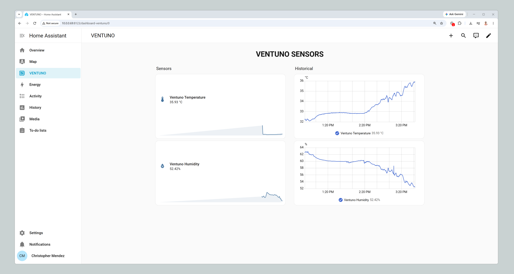

Congratulations! You have successfully bridged physical hardware to a scalable, local IoT platform using Docker, MQTT, and Arduino App Lab.

## Inspiration

From here, you can start adding integrations and building dashboards. To give you an idea of what a fully realized HomeLab looks like, here is a glimpse of a real-world Home Assistant setup. With a bit of time, you can build interactive floorplans, vehicle trackers, local server monitoring, and highly detailed weather dashboards:

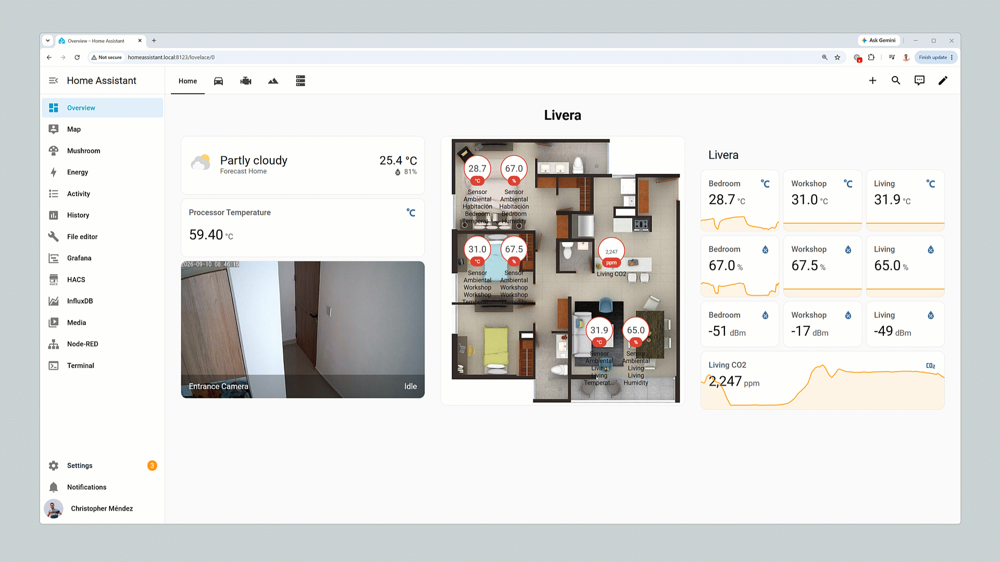

## Conclusion

By following this guide, you have successfully transformed your Arduino VENTUNO Q into a powerful, localized Smart Home Hub. Deploying Home Assistant via Docker gives you a scalable, secure, and privacy-first foundation to build upon. Furthermore, you learned how to bridge the gap between physical hardware and your dashboard by integrating a Modulino Thermo using the board's internal RPC architecture and an MQTT broker. Your HomeLab is now ready to take control of your environment without relying on cloud servers.

### Next Steps

Now that your local hub is live, it is time to expand your ecosystem. Here are some exciting projects you can tackle next to maximize your hardware:

* **Connect Other Arduino Boards:** Set up an MQTT broker (like Eclipse Mosquitto) on your Docker environment to receive wireless sensor data from other Arduino boards around your house via Wi-Fi.
* **Build a Weather Station:** Create a dedicated dashboard for a local weather station by pulling real-time environmental data from your external sensors.
* **Explore ESPHome:** Integrate ESPHome to build custom, locally controlled smart devices and sensors with minimal coding.
* **Expand with Matter and Zigbee:** Plug a Matter/Zigbee USB dongle into the VENTUNO Q to seamlessly integrate standard smart home devices, allowing you to take full advantage of boards like the Arduino Nano Matter.
