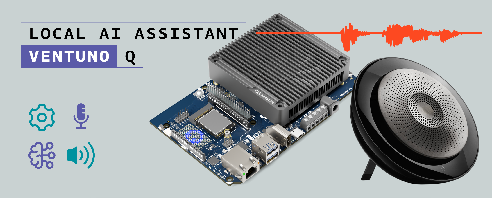
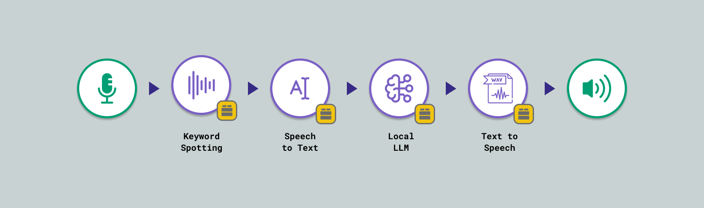
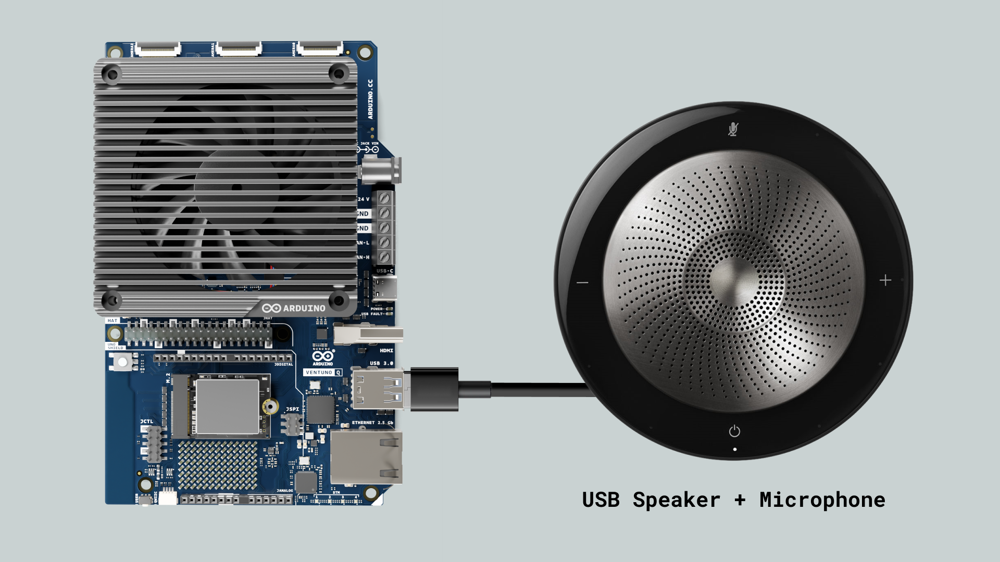
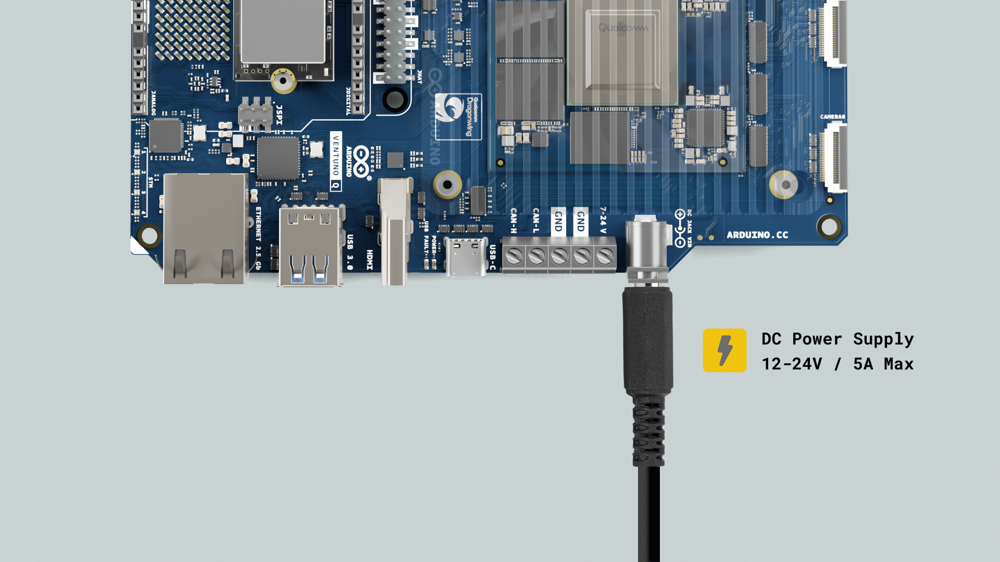
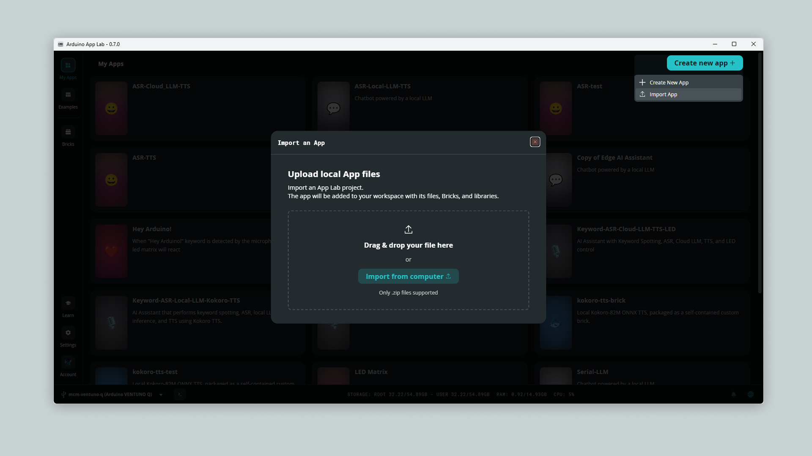
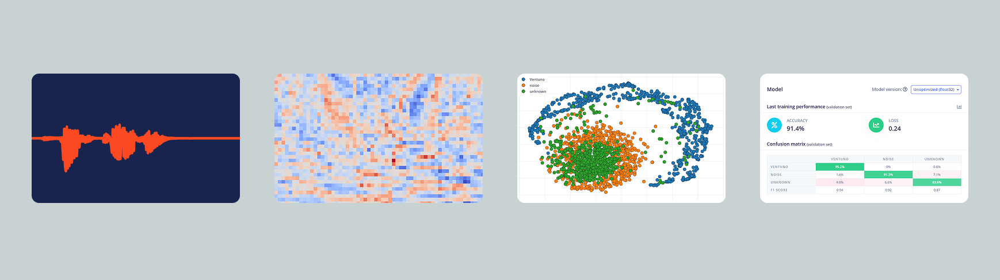
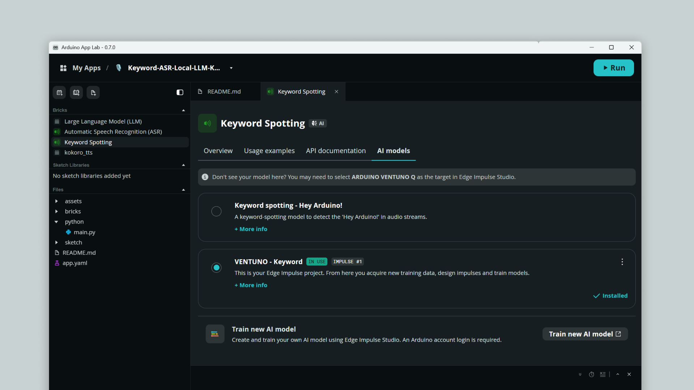
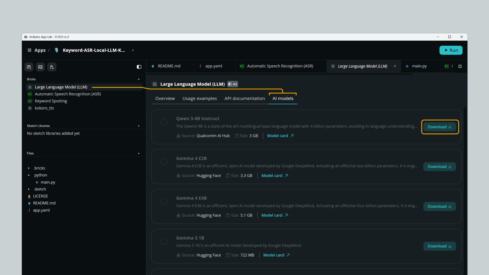
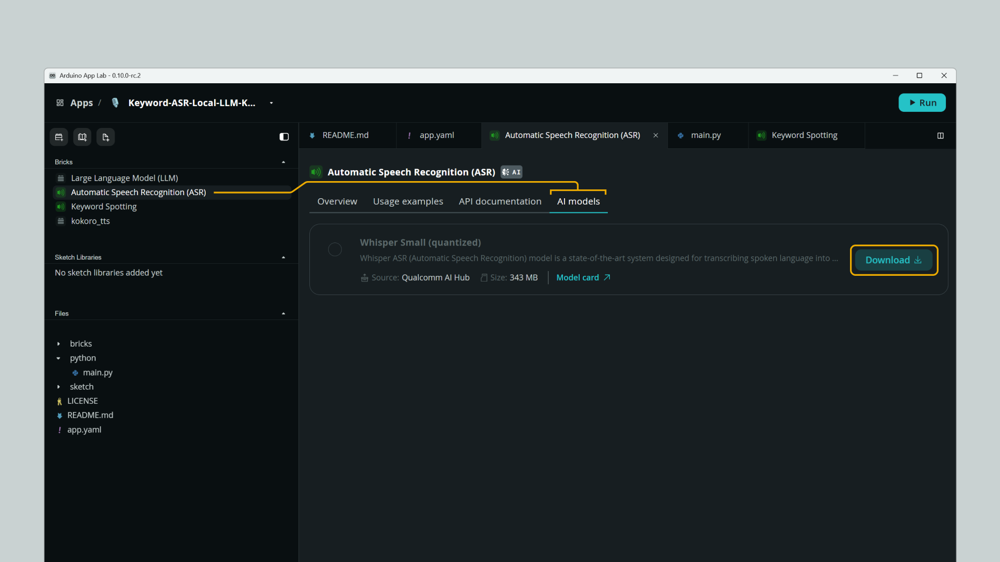
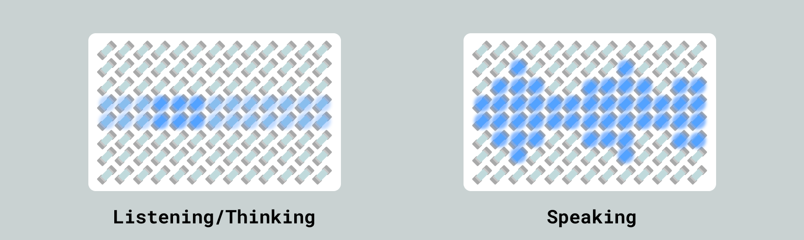

## Introduction

Voice assistants like Alexa or Google Home are incredibly convenient, but they rely heavily on cloud computing. Every time you speak, your voice is recorded, sent over the Internet, processed in a massive data center, and sent back.

What if you could build a smart speaker that does all of that **locally**?



This application note will guide you through creating an offline, privacy-first voice assistant. Using the Arduino® VENTUNO™ Q and its built-in Neural Processing Unit (NPU), we will run a Large Language Model (LLM) and high-fidelity text-to-speech right on the edge. No cloud, no subscriptions, no internet required once set up.

### System Architecture: The Arduino App Lab Bricks

Arduino App Lab makes complex AI workflows simple through modular blocks called **Bricks**. To build our assistant, we will chain these specific components together:

1. **Microphone**: The hardware interface that captures raw audio from your USB microphone.
2. **Keyword Spotting (KWS)**: A lightweight, always-on AI model listening exclusively for a wake word.
3. **Automatic Speech Recognition (ASR)**: Once awake, this Brick transcribes your spoken command into text.
4. **Large Language Model (LLM)**: The brain of the operation. It reads your transcribed text and generates a smart response using the local `genie:qwen3-4b` model.
5. **Kokoro TTS (Custom Brick)**: A high-fidelity, custom-integrated Text-to-Speech engine that converts the LLM's text response back into an audio waveform to be played through your USB speaker.



## Goals

The main objectives of this tutorial are:

- Build a fully functional, offline voice assistant capable of natural conversations.
- Understand how to interconnect standard and Custom AI App Bricks in a single Arduino App Lab application.
- Learn how to manage hardware resources (CPU, NPU, and RAM) efficiently when running heavy Local LLMs.

## Hardware and Software Requirements

### Hardware Requirements

- [Arduino® VENTUNO™ Q](https://store.arduino.cc/products/ventuno-q) (x1)
- USB-A Speaker or Headset (x1)
- USB-A Microphone (x1) (or a combined headset/speakerphone)
- [Arduino® USB-C Power Supply (65W)](https://store.arduino.cc/products/usb-c-power-supply-65w)\*

\*Other power supplies can be used, within the range of 7-24 V and ≥ 3 A. See the [User Manual - Power Section](/tutorials/ventuno-q/user-manual/#power-overview) for more information.

### Software Requirements

- [Arduino App Lab](https://www.arduino.cc/en/software/#app-lab-section)
- [Edge Impulse Studio account](https://studio.edgeimpulse.com/public/985298/live) (Optional, for custom Keyword models)

<Alert type="note">

You can log in to Edge Impulse Studio using your same Arduino account.

</Alert>

## AI Assistant System Setup

### 1. The Hardware Setup

Connect your USB Speaker and USB Microphone to the USB-A ports on your VENTUNO Q.



### 2. Powering the Board

Running multiple AI models simultaneously requires stable and robust power.



It is highly recommended to power the VENTUNO Q using a **12V to 24V DC Power Supply** connected through the Barrel Jack or the Terminal Block.

During this specific voice assistant application, the system consumes around **11 W** of power. However, if you plan to expand the App or connect additional high-power USB peripherals, consumption can spike. Therefore, a power supply rated for **greater than 60W** is suggested to ensure maximum stability and prevent brownouts during heavy task processing.

## System Overview

### Project Download

Download the `.zip` file of the application and import it into your Arduino App Lab workspace:

[](https://github.com/mcmchris/keyword-asr-local-llm-kokoro-tts/releases/download/v1.0.2/Keyword-ASR-Local-LLM-Kokoro-TTS.zip)

- **Local LLM + Kokoro TTS:** ([Download Link](https://github.com/mcmchris/keyword-asr-local-llm-kokoro-tts/releases/download/v1.0.2/Keyword-ASR-Local-LLM-Kokoro-TTS.zip)) - The ultimate offline experience. Uses a Custom Brick for high-fidelity offline voice synthesis.

Once downloaded, import it to the Arduino App Lab as follows:



### 1. Project AI Models

#### The Keyword Spotting Model

Our assistant needs to know when to start listening. You have two options for the wake word:



#### Option A: The Custom "Ventuno" Wake Word (Recommended)

We have trained a highly optimized keyword spotting model that reacts to the word **"Ventuno"**.

1. Go to this public Edge Impulse project: [Ventuno Keyword Model](https://studio.edgeimpulse.com/public/985298/live).
2. Clone the project to your own Edge Impulse account.
3. Pair your Edge Impulse account with the Arduino App Lab environment. Select this model in the Keyword Spotting Brick configuration.
4. In the Python code, use: `spotter.on_detect("Ventuno", on_keyword_detected)`.

#### Option B: The Default "Hey Arduino" Wake Word

If you prefer not to use a custom keyword, you can use the built-in model.

1. Select the default model in the Keyword Spotting Brick configuration.
2. In the Python code, change the detection line to: `spotter.on_detect("hey_arduino", on_keyword_detected)`.

On your Keyword Spotting Brick, select the model to be used:



<Alert type="note">

Learn more in the [Custom AI Models guide](https://docs.arduino.cc/software/app-lab/integrations/ai-models/).

</Alert>

#### Local Large Language Model

On your Large Language Model (LLM) Brick, **download** the model `Qwen 3-4B Instruct`.



<Alert type="warning">

**Warning:** Make sure to download before running the App, the run will fail if the model is missing.

</Alert>

#### Automatic Speech Recognition Model

On your Automatic Speech Recognition Model (ASR) Brick, **download** the model `Whisper Small (quantized)`.



<Alert type="warning">

**Warning:** Make sure to download before running the App, the run will fail if the model is missing.

</Alert>

### 2. Understanding the Code

This application relies on a **State Machine** architecture to manage the different AI models without crashing the board. The system moves between four states: `IDLE` (0), `LISTENING` (1), `PROCESSING` (2), and `SPEAKING` (3).

Let's look at the key concepts and configurable settings that make this application run smoothly:

#### 1. Custom Bricks Integration

This project takes advantage of the **Custom Bricks** feature. Since the advanced Kokoro TTS model is not part of the standard built-in Bricks, it is bundled directly into the project under the `bricks/kokoro_tts/` directory. This allows the Python backend to seamlessly import it (`from kokoro_tts import KokoroTTS`) just like any native component.

<Alert type="success">

Learn more about Custom Bricks on this [Blog Post](https://blog.arduino.cc/2026/04/29/arduino-app-lab-0-7-custom-bricks-are-here/)

</Alert>

#### 2. Microphone Architecture & Hardware Management

Keyword Spotting (always listening) and ASR (listening for commands) can conflict if they access the audio stream simultaneously. We instantiate two separate `Microphone` objects to handle this safely.

Furthermore, running an 8GB LLM model causes massive data traffic on the memory bus. To prevent resource starvation and container crashes, we introduce a vital hardware delay before the LLM wakes up:

```python
# Releasing audio channels safely before waking up the NPU
time.sleep(1.5) 
mic_asr.stop()
```

This 1.5-second sleep acts as a traffic light, giving the CPU enough time to close the microphone connections peacefully before the LLM consumes the memory bandwidth.

#### 3. Context Injection & Timezone Configuration

Local LLMs do not have access to the internet to check the current time. To fix this, we use a technique called Context Injection. The script reads the hardware clock and explicitly injects the current time into an invisible prompt before asking the LLM for an answer.

Because the Python script runs inside an isolated container, it defaults to UTC time. You must configure your local timezone using the `ZoneInfo` module, so the assistant provides accurate local time.

```python
# Configurable Timezone: Change "America/Santo_Domingo" to your local timezone
time_zone = ZoneInfo("America/Santo_Domingo")
local_time = datetime.now(time_zone)
formatted_time = local_time.strftime("%I:%M %p, %A, %B %d, %Y")
```

<Alert type="note">

You can find your specific timezone string in the [Time Zone Database](https://en.wikipedia.org/wiki/List_of_tz_database_time_zones).

</Alert>

#### 4. Audio Output Configuration (ALSA Routing)

The Kokoro TTS Brick generates a temporary `.wav` file, and we use the native ALSA `aplay` command with the `plughw` flag. This forces the audio to a specific hardware port and automatically converts the sample rate on the fly.

```python
# Configurable Audio Output: Change '1,0' to match your specific hardware
os.system(f"aplay -D plughw:1,0 {wav_path} -q")
```

<Alert type="note">

To find your device's numbers, open the Arduino App Lab terminal and type `aplay -l`. If your headset is listed as `card 1` and `device 0`, you will use `plughw:1,0`.

</Alert>

#### 5. MCU Role and RPC Bridge

While the Linux backend handles the heavy artificial intelligence tasks, the VENTUNO Q's embedded microcontroller (MCU) is responsible for real-time hardware control—specifically, driving the onboard 8×13 LED matrix.



Because Python and C++ run in separate environments on the board, they communicate using Remote Procedure Calls (RPC) via the `Bridge` utility. The Python script acts as the "brain," broadcasting the current step of the state machine, while the C++ sketch acts as the "muscle," listening for these state changes to trigger the corresponding visual animations.

**On the Python side (`main.py`):**

Whenever the AI pipeline transitions to a new phase (e.g., from Listening to Processing), Python sends an RPC call over the Bridge with the new state integer:

```python
# Broadcast the state change to the MCU
# 0 = IDLE, 1 = LISTENING, 2 = PROCESSING, 3 = SPEAKING
Bridge.call("set_state", 1) 
```

**On the C++ side (`sketch.ino`):**

The MCU registers a listener for the `set_state` command during its setup phase. When it receives the RPC payload from Python, it updates the `currentState` variable, which instantly alters the rendering logic of the LED matrix to match the assistant's behavior (like switching from the scanning animation to the voice waveforms).

```cpp
#include <Arduino_RouterBridge.h>

int currentState = 0;

// Function triggered remotely by Python
void setSystemState(int state) {
  // Constrain ensures we only receive valid states (0-3)
  currentState = constrain(state, 0, 3);
  
  if (currentState == 1) {
    scanPos = 0.0; // Reset scanner position when starting to listen
  }
}

void setup() {
  // ... Matrix initialization ...
  
  Bridge.begin();
  // Map the "set_state" RPC call to our C++ function
  Bridge.provide("set_state", setSystemState); 
}

void loop() {
  // Render different animations based on the state sent by Python
  if (currentState != 0) {
    renderMatrix(); 
  } else {
    matrix.clear(); // Clear the screen in IDLE mode
  }
  delay(30); // ~33 FPS for smooth animations
}
```

## AI Assistant Demo

Now that your VENTUNO Q is powered on and the project is imported, it's time to run the application and interact with your AI assistant! Follow these simple steps:

1. **Check the Models:** Make sure to have all the AI models downloaded (see [Project AI Models](#1-project-ai-models)).

2. **Run the Application:** Click the **Run** button in Arduino App Lab.

  <Alert type="warning">

  The very first time this could take a while. Custom Brick dependencies are being installed.

  </Alert>

1. **Wake the Assistant:** Speak your configured wake word clearly into the USB microphone (e.g., *"Ventuno"*).
2. **Wait for the Visual Cue:** Wait for the LED matrix to light up and the scanning animation begins. This animation is your hardware confirmation that the Automatic Speech Recognition (ASR) is active and recording.
3. **Speak Your Command:** Ask your question or state your command naturally (e.g., *"What is the capital of Japan?"* or *"Tell me a short joke"*).
4. **Listen to the Response:** The LED matrix will slow its scanning speed while the LLM thinks. Once the response is ready, the matrix will switch to an organic voice waveform animation, and you will hear the assistant's intelligent voice through your USB speaker.

### Troubleshooting

Even the smartest assistants sometimes run into hiccups. Here are the most common issues and how to fix them:

- **App crashes immediately with `no microphone device found`:**
  The application requires an active audio input stream to start the Keyword Spotting brick. Ensure your USB microphone is securely plugged into the USB-A port *before* clicking the Run button in Arduino App Lab.

- **The assistant ignores the wake word "Ventuno":**
  If you are saying "Ventuno" but the LED matrix never lights up, the system is likely listening for the default "Hey Arduino" trigger instead. This happens if the custom model isn't configured correctly. Go back to [The Keyword Spotting Model](#the-keyword-spotting-model) section and ensure you have selected your cloned Edge Impulse model inside the Keyword Spotting Brick configuration.

- **The LLM responds but you hear nothing:**
  If the LLM generates a response but the audio fails to play through your headset or speaker, Linux is routing the `.wav` file to the wrong hardware address. Open the App Lab terminal, run `aplay -l`, and update the `plughw:1,0` parameter in your Python script to match your specific USB audio device card and device numbers.

- **The board reboots or the app crashes during "AI Thinking":**
  If the system crashes right after the ASR finishes and the LLM begins to process, you are experiencing a power brownout. The NPU draws a spike of current when loading the 8GB model into memory. Ensure you are powering the VENTUNO Q with a robust DC Power Supply (12V-24V, >60W).

- **The assistant gives the wrong time:**
  The Python container runs in UTC by default. If the assistant tells you the time in London instead of your local city, locate the `ZoneInfo("America/Santo_Domingo")` line in the Python script and update it to your local [IANA timezone](https://en.wikipedia.org/wiki/List_of_tz_database_time_zones).

## Conclusion

By combining the VENTUNO Q's hardware capabilities with Custom Bricks, we successfully built a powerful voice assistant that lives entirely on your desk. You learned how to orchestrate multiple AI models, handle memory bandwidth constraints, configure system-level timezones, and route ALSA audio hardware.

### Next Steps

Now that you have a local AI brain, you can take it to the next level:

- Leverage the `Bridge RPC` to make your voice assistant control physical relays, LEDs, or motors based on your voice commands.
- Create a custom Brick to integrate Spotify support or the Google Assistant SDK to control your home appliances.
- Try using the Cloud LLM Brick to allow your AI assistant to gather updated information from the internet.
- Tweak the `system_prompt` in the Python code to give your assistant a unique personality or specific rules constraints.
