## Introduction

This application note explores the implementation of an interactive Photo Booth: a self-contained kiosk that captures visitors' photos using a USB camera, tracks hand gestures in real time using an edge AI model to pick a themed graphic frame, and automatically submits the composed photo to a print server on a button press. The entire AI inference and web application host run locally on the [**Arduino® VENTUNO™ Q**](https://store.arduino.cc/products/ventuno-q) without relying on any cloud infrastructure for the user-facing path.

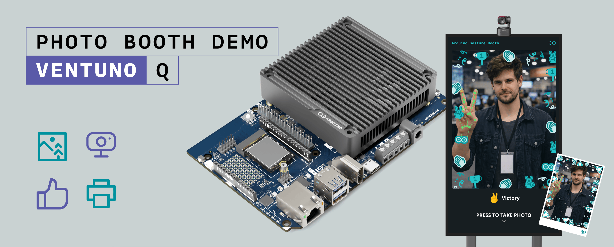

The Photo Booth application brings together core edge-AI and system integration building blocks of the VENTUNO Q ecosystem:

- **On-device hand gesture recognition**: An AI vision model that processes camera frames to detect key hand gestures (*Open Palm*, *Victory*, *Thumb Up*, *Thumb Down*, *Pointing Up*, *Closed Fist*, and *ILoveYou*, surfaced in the interface as *Rock*) in real time. The gesture chooses which themed frame is composited onto the photo, and holding one is what makes a capture possible at all.
- **Physical trigger button (HID abstraction)**: A discrete push-button built around an **Arduino® Nano ESP32** configured as a USB HID keyboard. This button is the booth's only physical control: it starts the session, arms the capture countdown, and confirms printing.
- **Dynamic frame composition**: Web kiosk front-end that swaps graphic frame overlays and visual feedback instantly as the detected gesture changes, then composites the chosen frame onto the captured photo before sending it to print.
- **Asynchronous printing pipeline**: A background worker thread that performs pre-flight health checks against a CUPS-backed print server and manages multi-attempt job submissions without ever blocking the camera or the interface.
- **3D-printed stand mounting**: A custom 3D-printed bracket that secures the VENTUNO Q cleanly to the lower shelf of a mobile kiosk stand.
- **Full-screen kiosk interface**: Web UI served by the VENTUNO Q and presented full-screen on a display or touch monitor in kiosk mode.

By following this application note, you will learn how high-level Arduino Bricks (`gesture_recognition` and `web_ui`) are composed into a single `arduino-app-cli` application, how a Nano ESP32 acts as a hardware-decoupled HID actuator, and how to build a robust, fault-tolerant printing bridge suitable for public exhibitions, trade shows, and retail installations.

## Goals

The main goals of this application note are as follows:

- Build a fully working Photo Booth application on the VENTUNO Q that processes live camera feeds, detects hand poses to select a themed frame, and outputs printed photos on a physical button press.
- Show how to compose the Bricks `arduino:gesture_recognition` and `arduino:web_ui` into a single `arduino-app-cli` application with a Python® orchestration entry point.
- Demonstrate how a separate **Nano ESP32** can act as a USB HID keyboard button so the booth can be triggered by a discrete physical actuator while keeping the host application completely decoupled from actuator hardware.
- Detail the physical assembly and mounting using a 3D-printed VENTUNO Q stand holder.
- Implement an asynchronous, fault-tolerant printing subsystem with pre-flight status verification, transient error retries, and non-blocking event handling.
- Provide a step-by-step setup guide for deploying the application as an automated, unattended kiosk system on the VENTUNO Q.

## Hardware and Software Requirements

### Hardware Requirements

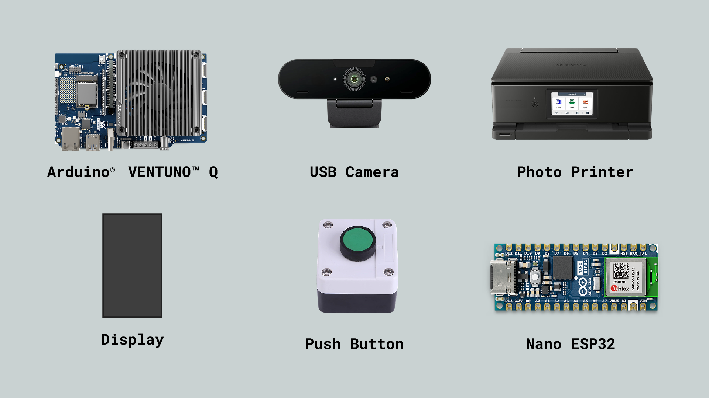

- **[Arduino® VENTUNO™ Q](https://store.arduino.cc/products/ventuno-q)**: compute host that runs the gesture recognition vision model, web UI, and print worker thread.
- **[Arduino® Nano ESP32](https://store.arduino.cc/products/nano-esp32)**: USB HID keyboard controller for the physical trigger button.
- **Momentary push-button** (22 mm panel-mount style) and a small enclosure to host both the button and the Nano ESP32.
- **3D-printed VENTUNO Q holder**: custom bracket for securing the board to a rolling kiosk stand or lower shelf (STL file provided in [3D-Printed VENTUNO Q Stand Holder](#3d-printed-ventuno-q-stand-holder)).
- **USB camera**: HD or Full HD USB camera with autofocus and a wide field of view.
- **Display / monitor**: high-brightness display or touch panel connected to the VENTUNO Q onboard HDMI® output port, **mounted and configured in portrait orientation**. The kiosk front-end is laid out for a portrait screen and the printed photo is 2:3 portrait, so a landscape display leaves the interface as a narrow strip in the middle of the screen.
- **Printer**: any printer CUPS can drive, connected over USB or the network. A 4×6 photo printer gives the best results, but the software negotiates paper size with whatever is attached and works equally well with an office printer for testing.
- **60 W barrel-jack power supply** for the VENTUNO Q.
- **Standard cabling**: HDMI cable for the display, USB-C® to USB-A cable for the Nano ESP32, USB cables for the camera and printer, jumper wires for the button.

### Software Requirements

- [Arduino App Lab](https://docs.arduino.cc/software/app-lab/) and [`arduino-app-cli`](https://github.com/arduino/arduino-app-cli) installed on the VENTUNO Q. Arduino App Lab is the GUI used to manage applications, while `arduino-app-cli` is the daemon and CLI that runs them.
- [Arduino IDE 2.0+](https://www.arduino.cc/en/software) on a separate development machine, used only to flash the HID firmware onto the Nano ESP32.
- The Bricks `arduino:gesture_recognition` and `arduino:web_ui` (pulled and managed automatically by `arduino-app-cli` when the application is started).
- **CUPS** on the VENTUNO Q host, with the printer configured as a queue. Plugging in a USB printer is usually enough for CUPS to set it up automatically.
- The **print server** included in the bundle as `print-server/`, a small HTTP service that runs on the host and hands photos to CUPS. The application reaches it at `http://172.17.0.1:5003` by default, overridable through the `PRINT_SERVER_URL` environment variable. See [The Print Server](#the-print-server) for installation and configuration.
- The Photo Booth application sources and versioned release bundle, published in the public [`91volt/ventuno-q-photo-booth`](https://github.com/91volt/ventuno-q-photo-booth) repository. See [Downloads](#downloads) for the ready-to-import application, scripts, STL file, and firmware sketch.

## Application Architecture Overview

The Photo Booth application uses a modular Bricks architecture. The app manifest is defined in `app.yaml`:

```yaml
name: photo-booth-demo
icon: 📸
description: Strike a pose with hand gestures — capture, composite, and print a photo. Requires a USB webcam.
bricks:
  - arduino:gesture_recognition
  - arduino:web_ui
```

Each brick encapsulates a dedicated service that exposes a clean API to the Python application:

- `arduino:gesture_recognition` attaches to the camera pipeline, processes video frames through a hand landmark model, and emits event callbacks for recognized gestures. The Brick runs in its own container and offloads inference to the Qualcomm® Hexagon™ DSP exposed by the board, so the main Python process stays free for orchestration.
- `arduino:web_ui` serves static assets (HTML/CSS/JavaScript) on port `7000`, provides a Socket.IO connection for real-time bi-directional messaging, and hosts custom API handlers.

When `arduino-app-cli` starts the application, it launches the container environment where the Python script coordinates the camera capture stream, gesture events, front-end socket messages, and background print submissions.

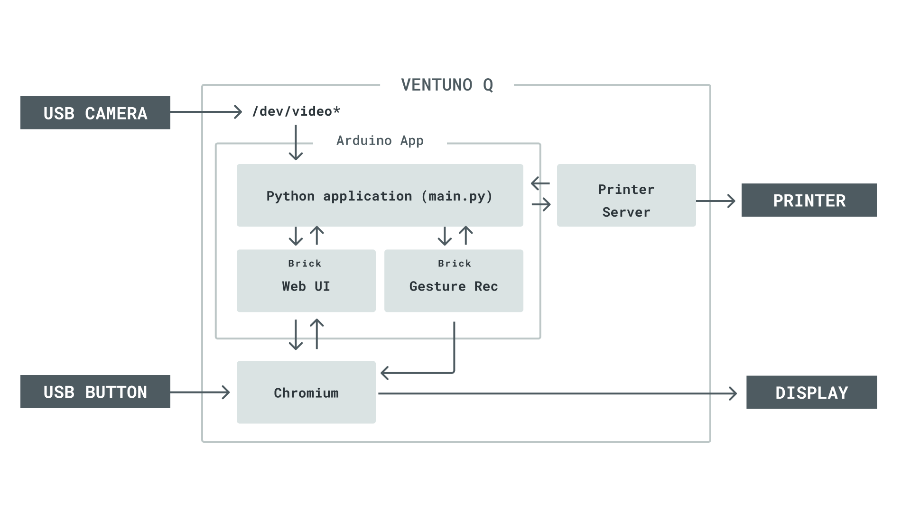

Two details in that diagram are worth calling out, because both are easy to assume the other way round:

- **The Python application owns the camera.** It opens `/dev/video*`, and the gesture recognition client, a library running inside the same process, reads frames from it and relays them to the gesture container over a WebSocket, receiving detections back on a second one.
- **The live preview does not pass through the application.** The gesture container serves the annotated video on its own port, and the front-end points an `` straight at it. The page comes from the Web UI Brick on port `7000`; the video comes from the gesture Brick on port `5002`. They are separate connections, which is why the `` is marked `crossorigin="anonymous"`, without it the browser could not later draw that frame onto a canvas to composite the photo.

## Understanding Key Architectural Concepts

### On-Device Gesture Recognition

Traditional kiosk applications rely solely on touchscreens or cloud vision APIs. The Photo Booth uses on-device gesture recognition running locally on the VENTUNO Q:

- **Hand landmark tracking**: The underlying model locates the hand and returns a set of 3D keypoints per hand, from which the finger configuration, and therefore the pose, is classified. Every detection callback receives the landmark list, a bounding box, the confidence score, and which hand produced it.
- **Left and right hand tracking**: Callbacks can be bound to the left hand, the right hand, or both, so a single gesture can mean different things depending on which hand performs it.
- **Local acceleration**: Inference runs inside the Brick's container against the board's DSP rather than on the CPU, which helps keep the requested 30 FPS camera mode and the web UI responsive at the same time. The actual frame rate still depends on the camera and negotiated video mode.
- **Privacy first**: Video frames never leave the board, making the installation straightforward to deploy in public venues where capturing and transmitting images of visitors would otherwise require additional safeguards.
- **Expressive selection**: Users choose their photo's theme by striking a pose rather than by picking from an on-screen menu, which keeps the interface free of touch targets and makes the choice part of the photo itself.

The seven recognized poses and the themed frame each one selects are shown below. The names here are the ones shown in the interface; the labels passed to `on_gesture()` differ slightly, and are listed in [Main Application](#main-application-pythonmainpy):

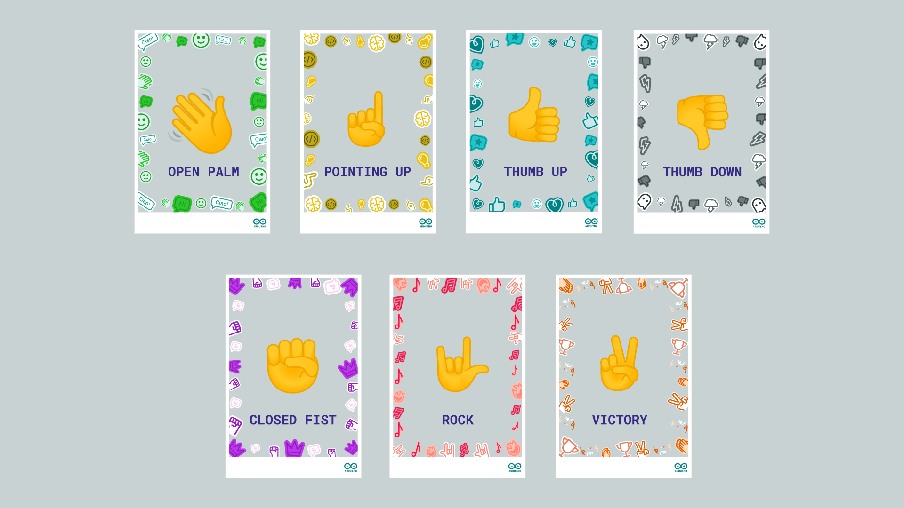

### The Interaction Model: Gesture Selects, Button Triggers

The division of labour between the two inputs drives the whole front-end design.

<Alert type="note">

This is the part most often assumed backwards: **the gesture never takes the photo, and the button never chooses the frame.**

</Alert>

- **The gesture selects the theme.** Each recognized pose maps to a themed frame, and changing pose swaps the on-screen overlay, and nothing else. A 2-second lock after each change absorbs the recognizer briefly oscillating or reporting `None`.
- **The button drives every state transition.** The HID keystroke, or a click on the same on-screen button, starts the session, arms the capture countdown, cancels it, and confirms the print.
- **The gesture is also a precondition for capture.** At the end of the countdown the front-end captures a frame *only if a pose is still held*. If the visitor has dropped their hand, no photo is taken and the kiosk shows a "no gesture" screen.

So the visitor's sequence is: press to begin, strike a pose to pick a frame, press to start a 5-second countdown, hold the pose until the flash, then press once more to print.

Every waiting state is bounded by a timer, so an abandoned session always recovers without staff intervention:

| Timer | Duration | Behavior on expiry |
| :--- | :--- | :--- |
| Capture countdown | 5 s | Captures the photo, or shows the "no gesture" screen |
| Result auto-discard | 10 s | Discards the unprinted photo and returns to idle |
| Printing acknowledgement | Up to 90 s | Shows success or failure when the back-end replies; after 90 seconds, reports that the result is unknown |
| Restart countdown | 5 s | Returns to the idle screen |
| Gesture-change lock | 2 s | Allows the overlay to change again |
| Lost-gesture debounce | 5 s | Reverts to the idle prompt |

Because the physical button is simply an Enter keystroke, every step is equally reachable from a keyboard during development, and the front-end also exposes a "simulate gesture" control that applies a random frame, so the whole flow can be exercised without a camera or a flashed Nano ESP32.

### HID as a Hardware Abstraction

Wiring a push-button directly to a GPIO on the main compute host would couple the application code to specific pin maps and driver configurations.

Routing the trigger button through a **Nano ESP32** configured as a USB HID keyboard eliminates this coupling. The host VENTUNO Q sees a standard USB keyboard sending a generic key event (`KEY_RETURN`). This provides key benefits:

- **Hardware independence**: The host application requires no special GPIO drivers or privilege modifications.
- **Swappable actuators**: The push-button can be swapped for a foot pedal, proximity sensor, or coin acceptor without changing a single line of host Python code.
- **Universal front-end binding**: The web UI binds a single `keydown` handler for Enter and routes it to whichever action is currently on screen, start, take photo, or print. One key therefore drives the entire flow, and the same button behaves correctly in every state without the firmware knowing anything about it.

### Decoupled Kiosk Printing

A printer in a public venue runs out of paper, gets unplugged, and stalls in its driver. Calling a print API synchronously on the main thread would freeze the camera and the interface every time that happened.

The booth avoids it by doing all printing in a daemon worker thread, behind a pre-flight status check that fails fast rather than waiting out a CUPS timeout. [The Print Server](#the-print-server) covers the pipeline and the service that implements it.

## Physical Hardware and Actuator Assembly

The completed installation combines the portrait display, camera, VENTUNO Q, physical trigger, and printer into a self-contained kiosk:

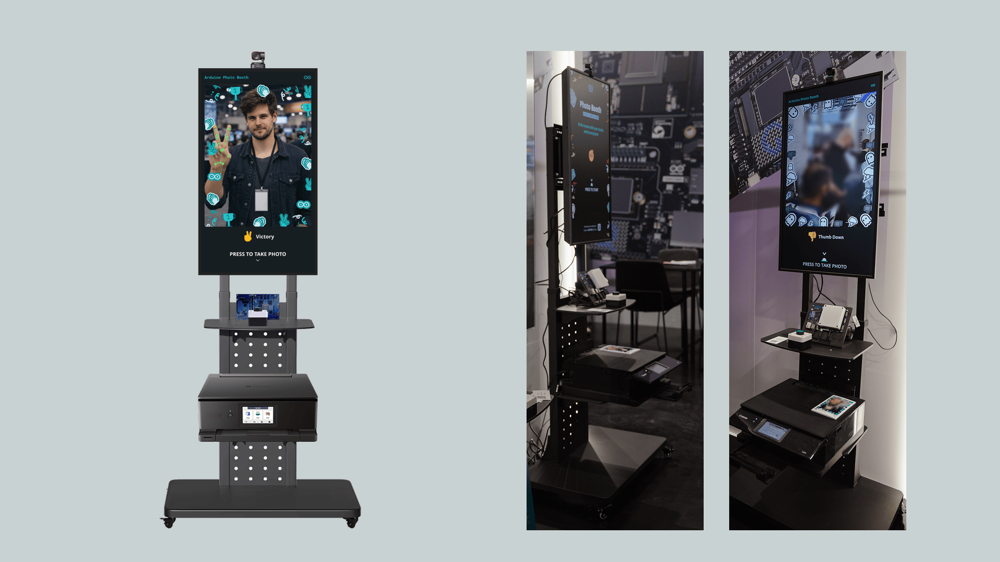

### 3D-Printed VENTUNO Q Stand Holder

A small 3D-printed holder keeps the VENTUNO Q upright and securely mounted on the lower shelf or frame of the kiosk stand. The reference design provides robust mounting points and generous cable clearance for the HDMI, USB-A, and USB-C ports.

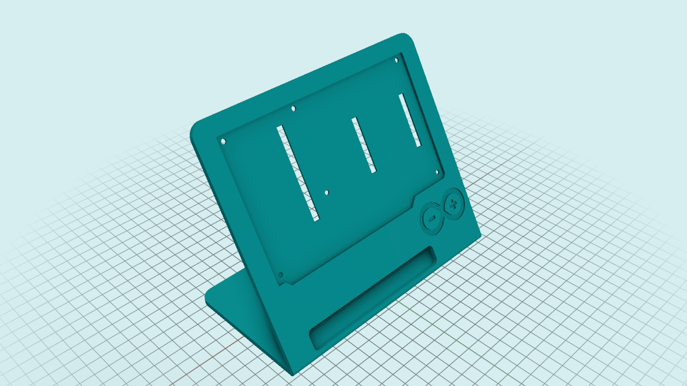

Download the STL file directly from the asset package: [ventuno-q-holder.stl](assets/ventuno-q-holder.stl).

Recommended print settings:

| Parameter | Suggested value |
| --- | --- |
| Layer height | 0.2 mm (0.1 mm for higher quality, 0.25–0.30 mm for fast prints) |
| Wall thickness | Slicer default |
| Infill | 15–20% |
| Supports | Yes (tree/organic recommended) |
| Material | PLA |

### The Physical Trigger Button (Nano ESP32 HID)

The physical trigger uses a 22 mm panel-mount push-button wired to a Nano ESP32 in a compact enclosure:

- Connect one terminal of the push button to **GND** on the Nano ESP32.
- Connect the other terminal of the push button to pin **D2** on the Nano ESP32.

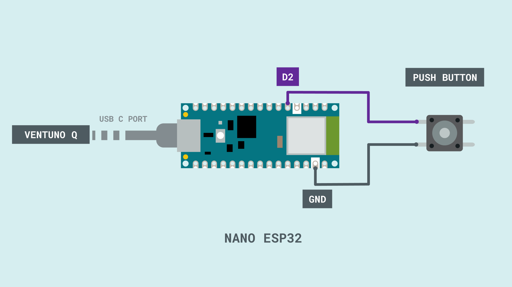

The firmware configures D2 with an internal pull-up resistor; pressing the button pulls the line low and triggers the keystroke. No external resistors or debouncing components are required, since debouncing is handled in firmware.

#### Nano ESP32 Firmware Sketch

The firmware configures `D2` with an internal pull-up resistor, debounces state transitions in software, and emits a `KEY_RETURN` keystroke whenever the button is pressed. Note the initialization order in `setup()`: the HID keyboard is registered with `Keyboard.begin()` **before** the USB stack is started with `USB.begin()`, which is what makes the board enumerate as a keyboard.

```arduino
#include "USB.h"
#include "USBHIDKeyboard.h"

USBHIDKeyboard Keyboard;

const int buttonPin = D2;
const unsigned long debounceDelay = 50;

int buttonState = HIGH;
int lastButtonState = HIGH;
unsigned long lastDebounceTime = 0;

void setup() {
  // Button wired to GND, using the internal pull-up
  pinMode(buttonPin, INPUT_PULLUP);

  // Register the HID keyboard first, then start the USB stack
  Keyboard.begin();
  USB.begin();
}

void loop() {
  int reading = digitalRead(buttonPin);

  // Debounce: reset the timer on any change
  if (reading != lastButtonState) {
    lastDebounceTime = millis();
  }

  // Accept the new value once the line has been stable long enough
  if ((millis() - lastDebounceTime) > debounceDelay) {
    if (reading != buttonState) {
      buttonState = reading;

      // LOW means pressed (because of INPUT_PULLUP)
      if (buttonState == LOW) {
        Keyboard.press(KEY_RETURN);
        delay(10);
        Keyboard.release(KEY_RETURN);
      }
    }
  }

  lastButtonState = reading;
}
```

The choice of `KEY_RETURN` is deliberate. The Photo Booth front-end binds the Enter key to its primary action, start from the splash screen, take the photo from the live preview, so the same firmware works without any host-side configuration.

#### Flashing Workflow

1. Open the sketch in **Arduino IDE 2.0+**.
2. Select **Arduino Nano ESP32** from the boards list.
3. Connect the Nano ESP32 to your development machine via USB-C and click **Upload**.
4. After flashing, verify on the development machine that the board enumerates as an HID keyboard.
5. Plug the Nano ESP32 into one of the VENTUNO Q USB ports. It requires zero host configuration.

### System Cabling and Interconnections

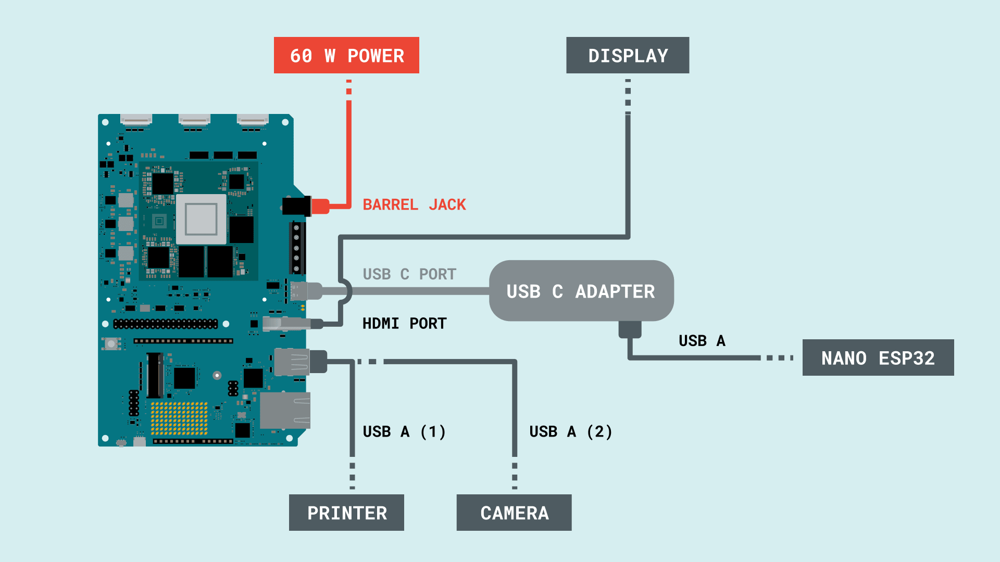

| Peripheral | Board / Port | Notes |
| :--- | :--- | :--- |
| **Kiosk display** | VENTUNO Q onboard HDMI | Full-screen display output |
| **Printer** | VENTUNO Q USB-A (1), or network | Driven by CUPS on the host via the print server |
| **USB camera** | VENTUNO Q USB-A (2) | High-definition webcam |
| **Nano ESP32 button** | VENTUNO Q USB-C, via a USB-C adapter | Enumerates as USB HID keyboard |
| **Power supply** | VENTUNO Q barrel jack | 60 W supply |

## Photo Booth Application Code

The application entry point consists of two primary Python modules in `python/`:

- `python/main.py`: Main application setup, camera configuration, gesture event registration, and UI event binding.
- `python/printer.py`: Thread-safe print client module handling printer status checks, upload retries, and job submission.

### Main Application (`python/main.py`)

The entry point is deliberately small: it opens the camera, binds gesture names to messages, and hands print requests to a worker thread. Everything else lives in the Bricks or in the front-end.

Two blocks are worth reading closely, because they are the ones you would edit.

The camera is opened here and handed straight to the gesture Brick:

```python
camera = Camera(resolution=(1280, 720), fps=30, codec="MJPG", adjustments=cropped_to_aspect_ratio((2, 3)))

pd = GestureRecognition(camera)
```

`GestureRecognition` owns the camera lifecycle and starts the supplied camera when `App.run()` activates the Brick, so the application must not call `camera.start()` separately.

Each recognized pose is then bound to a Socket.IO message. The back-end does nothing else with gestures: it forwards the label and lets the front-end decide what it means, which is why the whole capture and print sequence lives in the browser:

```python
pd.on_gesture("None", lambda meta: ui.send_message('gesture_detected', {'gesture': 'None'}))
pd.on_gesture("Closed_Fist", lambda meta: ui.send_message('gesture_detected', {'gesture': 'Closed Fist'}))
pd.on_gesture("Open_Palm", lambda meta: ui.send_message('gesture_detected', {'gesture': 'Open Palm'}))
pd.on_gesture("Pointing_Up", lambda meta: ui.send_message('gesture_detected', {'gesture': 'Pointing Up'}))
pd.on_gesture("Thumb_Down", lambda meta: ui.send_message('gesture_detected', {'gesture': 'Thumb Down'}))
pd.on_gesture("Thumb_Up", lambda meta: ui.send_message('gesture_detected', {'gesture': 'Thumb Up'}))
pd.on_gesture("Victory", lambda meta: ui.send_message('gesture_detected', {'gesture': 'Victory'}))
pd.on_gesture("ILoveYou", lambda meta: ui.send_message('gesture_detected', {'gesture': 'Rock'}))
```

Note the last line: the model's `"ILoveYou"` label is remapped to the friendlier `"Rock"` used by the interface, and the `"None"` pseudo-gesture is what lets the front-end clear the overlay when no recognized pose is held. To add or rename a themed frame, this list and the front-end's `gestures` array are the two places to change.

Printing is bound the same way, and immediately handed off so the main loop never blocks:

```python
def on_print_photo(client_id, data: dict):
    request_id = data.get("request_id", "")
    image_bytes = base64.b64decode(data["image"], validate=True)
    if not _print_slot.acquire(blocking=False):
        _notify_print("print_failed", request_id, error="Printer is busy")
        return
    threading.Thread(
        target=_print_worker,
        args=(image_bytes, request_id),
        daemon=True,
    ).start()


ui.on_message('print_photo', on_print_photo)
```

The front-end composites the photo with its overlay on a canvas and sends the result as one base64-encoded JPEG at quality 0.9. That keeps a second round-trip and a server-side re-encode off the board; the back-end only forwards validated bytes. Each request carries a unique ID, and the worker reports either `print_success` with the CUPS job ID or `print_failed`. The front-end accepts only a reply matching the active request, so a late response from a previous visitor cannot alter the current screen.

The camera parameters are a request, not a guarantee. If the camera cannot provide that exact mode the driver picks the closest one it supports and logs what it settled on:

```markup
WARNING V4LCamera: Camera codec set to YUYV instead of requested MJPG
WARNING V4LCamera: Camera resolution set to 1280x960 instead of requested 1280x720
WARNING V4LCamera: Camera FPS set to 9 instead of requested 30
```

The application still works (the 2:3 crop is applied to whatever arrives), but an uncompressed format at a low frame rate makes the gesture overlay visibly laggy.

<Alert type="warning">

Check the application logs after the first start. Treat any of these warnings as a reason to change camera rather than to change the code, a Logitech C920, for example, accepts the requested mode with no warnings at all.

</Alert>

The full module is in the bundle under `python/main.py`.

### Print Client Subsystem (`python/printer.py`)

The print client is a thin HTTP wrapper with no printer-specific code in it at all, everything about drivers and paper lives in the print server on the host. Its whole job is to fail fast when the printer is not ready, and to be patient when the network is merely slow.

The pattern that matters is the pre-flight check, which is what stops the booth uploading a photo to a printer that is offline:

```python
def print_photo(image: bytes, request_id: str | None = None) -> dict:
    # 1) Cheap pre-flight: bail out early if the printer is known to be
    #    offline/disabled. Saves the user a 30s+ CUPS timeout.
    status = printer_status()
    if not status.get("available", False):
        raise PrintServerUnavailable(
            f"Printer unavailable: {status.get('status', 'unknown')}"
        )

    # 2) Upload the composed JPEG, then 3) submit the print job.
    upload = _safe_json(_post_with_retry(
        f"{PRINT_SERVER_URL}/api/upload", ..., _UPLOAD_RETRIES
    ), "upload")
    result = _safe_json(_post_with_retry(
        f"{PRINT_SERVER_URL}/api/print",
        lambda: {"json": {"filename": upload["filename"], "request_id": request_id}},
        _PRINT_RETRIES,
    ), "print")
    return result
```

The timeouts and retry policy are set once at the top of the module and are the only values worth tuning:

```python
PRINT_SERVER_URL = os.environ.get("PRINT_SERVER_URL", "http://172.17.0.1:5003")
_UPLOAD_TIMEOUT = (5.0, 30.0)   # (connect, read) seconds — upload is fast
_PRINT_TIMEOUT = (5.0, 60.0)    # read can be longer; CUPS spool varies per driver
_STATUS_TIMEOUT = (3.0, 5.0)
_UPLOAD_RETRIES = 2             # one original attempt + up to 2 upload retries
_PRINT_RETRIES = 2              # safe because /api/print is request-ID idempotent
_RETRY_BACKOFF_S = 0.75
```

Three behaviours follow from those values:

- **Only connection errors and timeouts are retried**: upload and print submission have separate retry counts; the status check is deliberately not retried because it is meant to fail immediately. A fresh byte stream is built for each upload attempt.
- **Print retries cannot create duplicate jobs.** Repeating a request ID returns its in-progress or completed result from the server without submitting another CUPS job.
- **A well-formed `success: false` is final.** The server has answered; retrying would only repeat the same rejection.
- **Every response is parsed defensively.** A proxy or a crashed server returning HTML instead of JSON is reported as a clean error rather than a `JSONDecodeError`.

The full module is in the bundle under `python/printer.py`.

## The Print Server

The Photo Booth application runs inside a container and therefore cannot reach a USB printer directly. Printing is delegated to a small HTTP service that runs on the VENTUNO Q host, alongside CUPS and the printer itself. That service is included in the bundle as `print-server/`.

This split is what keeps the application portable. The booth knows nothing about printers: it posts a JPEG and asks for it to be printed. Everything vendor-specific stays on the host side, where it can be changed without touching the Brick composition.

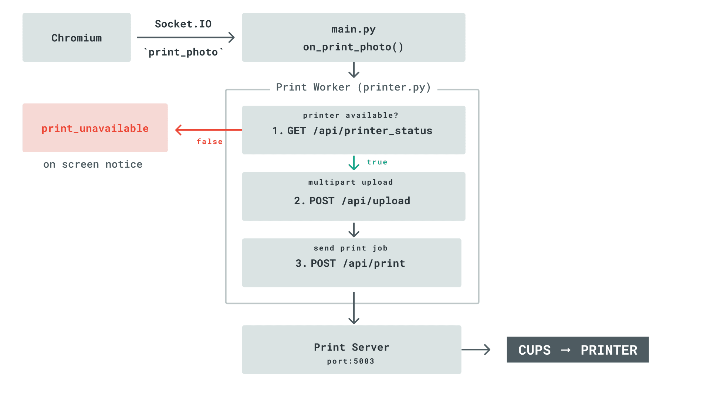

### The Contract

The application depends on exactly three JSON endpoints:

| Method and path | Request | Response |
| :--- | :--- | :--- |
| `GET /api/printer_status` | - | `{"available": true/false, "printer": "<queue>", "status": "<human-readable state>"}` |
| `POST /api/upload` | `multipart/form-data` with a `file` part (`photo.jpg`, `image/jpeg`) | `{"success": true, "filename": "<server-side name>", "size": <bytes>}` |
| `POST /api/print` | `{"filename": "<name returned by upload>", "request_id": "<unique ID>"}` | `{"success": true, "job_id": "<cups id>", "request_id": "<same ID>"}` |

Upload and print failures return `{"success": false, "error": "<reason>"}`, which the application surfaces on the kiosk screen. Connection errors and timeouts are treated as transient and retried; HTTP 5xx responses and well-formed `success: false` responses are final and reported immediately.

Because the application runs inside a container, the default `http://172.17.0.1:5003` points at the Docker host gateway, the VENTUNO Q host. Set `PRINT_SERVER_URL` to target a print server elsewhere on the network.

The included service also serves a test page at `http://<board-ip>:5003`, where you can drag in a photo and print it. Use it to confirm the printer works *before* running the booth; it isolates printer problems from application problems.

### Working With Any Printer

The service contains no vendor-specific code. Any printer CUPS can drive, USB or network, dedicated photo printer or office laser, works without modification, through three mechanisms:

- **Vendor-neutral detection and readiness.** Queues are read from `lpstat -v`, preferring one with a direct device URI (`usb://`, `ipp://`, …) over an `implicitclass` proxy, then the system default, then whatever else is configured. A queue is reported available only when `lpstat -p` says it is enabled and `lpstat -a` says it accepts new jobs.
- **Paper negotiation rather than assumption.** The requested paper is validated against `lpoptions -p <printer> -l` and mapped to the closest size the printer actually reports while preserving the exact CUPS token. The same paper is named differently across vendors, `4x6`, `Postcard`, `L`, `A6`, so aliases and borderless variants are matched as well. Photos are cropped to the **negotiated** paper's aspect ratio before submission; document sizes such as A4 and Letter skip the crop.
- **Hotplug recovery.** If the selected queue disappears, detection re-runs on the next status check, and a failed print is retried once against the newly detected printer. Swapping the USB printer therefore does not require restarting the service. A printer pinned through `PRINTER_NAME` is never replaced automatically.

### Installing the Print Server

CUPS normally configures a USB printer automatically when it is plugged in.

```bash
sudo apt install -y cups python3-venv
sudo usermod -aG lpadmin arduino

cp -r print-server /home/arduino/
sudo cp /home/arduino/print-server/print-server.service /etc/systemd/system/
sudo systemctl daemon-reload
sudo systemctl enable --now print-server
```

<Alert type="warning">

`python3-venv` is required and is **not** present on the stock image. Without it `python3 -m venv` builds the directory tree but never produces `pip`, and the service fails to start with `status=203/EXEC`. A board where the virtual environment already exists will not show this.

</Alert>

Given that package, the unit creates its own virtual environment and installs the requirements on first start, so there is nothing else to prepare by hand. Confirm the printer is visible and the service agrees:

```bash
lpstat -p
lpstat -a
curl localhost:5003/api/printer_status
```

A healthy response names the detected queue:

```json
{"available":true,"printer":"Brother_DCP_L3550CDW_series","status":"printer Brother_DCP_L3550CDW_series is idle. enabled since ...; Brother_DCP_L3550CDW_series accepting requests since ..."}
```

### Configuration

Every setting is optional; the defaults suit a single-printer kiosk. Set them as `Environment=KEY=value` lines in the `[Service]` section of the unit.

| Variable | Default | Meaning |
| :--- | :--- | :--- |
| `PRINTER_NAME` | auto-detect | Pin a specific CUPS queue. Leave unset to detect automatically and follow printer changes. |
| `PAPER_SIZE` | `4x6` | Requested paper, negotiated against what the printer supports. |
| `BORDERLESS` | off | Prefer a borderless variant of the paper size when the printer offers one. |
| `PORT` | `5003` | Listen port. Must match `PRINT_SERVER_URL` in the application. |
| `KEEP_UPLOADS` | `200` | How many recent photos to retain on disk; older ones are pruned automatically. |
| `UPLOAD_DIR` | `print-server/uploads` | Directory in which uploaded photos are retained. |

Options this service does not set, media type, print quality, colour mode, are taken from the CUPS defaults and can be changed system-wide with `lpoptions`:

```bash
sudo lpoptions -p <printer> -o MediaType=Auto
sudo lpoptions -p <printer> -o cupsPrintQuality=High
```

<Alert type="warning">

The service binds to all interfaces and has no authentication, which is appropriate for a kiosk on a trusted network but not for an internet-facing host. Uploaded photos are stored unencrypted in `uploads/`; if the booth captures images of the public, set `KEEP_UPLOADS` in line with how long those images should be retained.

</Alert>

## Running the Application

With the hardware assembled and Arduino App Lab installed on the VENTUNO Q, the Photo Booth can be deployed either from the Arduino App Lab interface or from a shell on the board.

### Importing the Application in Arduino App Lab

The simplest route needs no shell at all. In Arduino App Lab:

1. Select the **My Apps** tab in the left sidebar.
2. In the top-right corner, click **Create new app +**, then **Import App**.
3. Drag `photo-booth-app.zip` into the dialog, or use **Import from computer** to select it.

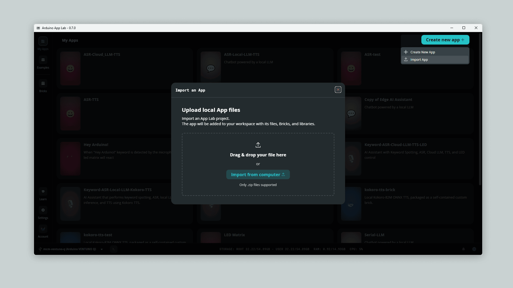

Arduino App Lab accepts a `.zip` only, which is why the bundle ships the application ready-packed as `photo-booth-app.zip` rather than as a loose folder. It copies the application into the user apps directory and lists it alongside the built-in examples, from where it can be started, stopped and monitored. Its logs are available directly in the interface, which is usually the quickest way to confirm the camera and the gesture container have come up.

<Alert type="note">

Import `photo-booth-app.zip` only, not the whole bundle. The `print-server/` folder is not an Arduino App Lab application; it runs on the host and is installed separately, as described in [The Print Server](#the-print-server).

</Alert>

### Starting From the Command Line

The same application can be managed from a shell, which is what the kiosk autostart unit later uses.

1. Unpack `photo-booth-app.zip` into the user apps directory on the VENTUNO Q, so that the application sits at `~/ArduinoApps/photo-booth`. The identifier used by the CLI comes from this **folder name**, not from the `name:` field in `app.yaml`: a folder called `photo-booth` is addressed as `user:photo-booth`.

2. From any shell on the board, start the application:

   ```bash
   arduino-app-cli app start user:photo-booth
   ```

   <Alert type="note">

   The first run pulls the gesture recognition container and may take a few minutes. Subsequent runs start in seconds.

   </Alert>

3. Open `http://<board-ip>:7000` in a browser. The kiosk page should appear, ready to be triggered with the physical button or the on-screen start button.

To follow what the application is doing, for example to confirm that the gesture container has come up and that the camera has been detected, tail the application logs:

```bash
arduino-app-cli app logs user:photo-booth --follow
```

To stop the application (for example before deploying a different one that also binds port 7000):

```bash
arduino-app-cli app stop user:photo-booth
```

The same operations are available from the Arduino App Lab GUI, which lists the application alongside its current state and exposes the logs view directly.

## Kiosk Setup and Auto-Boot Configuration

To deploy the Photo Booth as a dedicated, unattended installation that boots straight into full-screen mode, install the application first, through Arduino App Lab, as described above, then run the setup script last:

```bash
sudo bash setup-kiosk.sh
```

Undo it at any time with the matching teardown script:

```bash
sudo bash remove-kiosk.sh
```

Both are idempotent, so running either twice is harmless.

The setup script clears any existing daemon-level default app so it cannot compete with the kiosk service at boot.

### Set the Display to Portrait First

The booth interface is designed for a portrait screen, so rotate the display before configuring the kiosk. On the board, open **Settings > Displays**, set **Orientation** to **Portrait**, and apply. Many commercial panels can also be rotated from their own on-screen menu, which is worth preferring when available because the rotation then survives any change to the desktop session.

<Alert type="warning">

On a landscape screen the application still runs, but the interface is confined to a narrow portrait strip in the middle of the display with wide empty margins either side. It looks like the kiosk has failed to go full-screen when in fact the browser is full-screen and the layout is simply the wrong shape for the panel.

</Alert>

### What the Script Configures

1. **Chromium**, installed as a snap if no `chromium` binary is present. It is not part of the board image.
2. **Automatic login and a Wayland desktop session** for the `arduino` user, so a compatible desktop session exists without anyone typing a password. If GDM was explicitly forced to X11 with `WaylandEnable=false`, the script comments that setting and records it so `remove-kiosk.sh` can restore it later. Chromium can otherwise retain its title bar and leave the GNOME top bar visible even with `--kiosk`.
3. **A `systemd` unit** that waits for the `arduino-app-cli` daemon socket on port `8800`, then starts the application. It treats "already running" as success, so a boot where something else started the application first does not leave the unit failed.
4. **The kiosk launcher and a GNOME autostart entry**. The launcher polls port `7000` before starting Chromium, so the user-side autostart and the system-side unit can race freely, whichever finishes first waits the other out.
5. **Suppression of the dialogs** an unattended session would otherwise raise (see below).
6. **Sleep, idle blanking and screen lock disabled**, in two layers: the `systemd` sleep targets are masked *and* a system-wide `dconf` default turns off GNOME's idle behaviour. Either alone leaves a gap: `systemd` can suspend the board even when GNOME is told not to idle, and GNOME blanks the screen even on a board that never suspends.

<Alert type="warning">

`apt install chromium` does **not** work on this image, because the package has no candidate in the Ubuntu archive, and `chromium-browser` is only a transitional package that pulls in the same snap.

</Alert>

The script finds the installed application itself rather than assuming a name, because importing through Arduino App Lab produces a timestamped identifier such as `user:photo-booth-20260728-230522`. Where more than one is installed, name the one to boot into:

```bash
APP_ID=user:photo-booth-20260728-230522 sudo -E bash setup-kiosk.sh
```

### Two Traps Worth Knowing About

Automatic login solves one problem and creates two more, both of which put a modal dialog on top of the kiosk where nobody can dismiss it. The script handles both, but they are worth understanding if a board is ever configured by hand.

- **The login keyring** is encrypted with the user's password, and with autologin no password is ever typed, so `pam_gnome_keyring` cannot unlock it and GNOME asks on every boot. The script moves the keyring aside so PAM recreates it with an empty password, backing it up rather than deleting it. The kiosk browser does not need it: Chromium runs with `--password-store=basic`.
- **update-notifier** runs a `pkexec` helper on login, raising a polkit password prompt of its own. The script disables it for the kiosk user.

One further detail about automatic login: the stock image ships `/etc/gdm3/custom.conf` with the relevant lines present but **commented out**, which is easy to mistake for working configuration. The script writes active lines and matches only uncommented entries, so a second run does not add duplicates.

### Verifying and Undoing

Reboot to confirm the whole chain comes up hands-off:

```bash
sudo reboot
```

`remove-kiosk.sh` reverses all kiosk-owned state: it restores any pre-existing unit, launcher, autostart entry, autologin configuration, update-notifier override, keyring, sleep masks and dconf profile state. If one of those files was changed after setup, teardown preserves the newer user-managed content. It leaves the application installed and running and the print server alone. Chromium is removed only with the opt-in below and only when setup recorded installing it:

```bash
STOP_APP=1 sudo -E bash remove-kiosk.sh          # also stop the application
REMOVE_CHROMIUM=1 sudo -E bash remove-kiosk.sh   # also remove the Chromium snap
```

## Photo Booth Demo

With the application running, the print server up and the button plugged in, the booth is ready for visitors. Every screen it can show, and what moves it between them, is below:

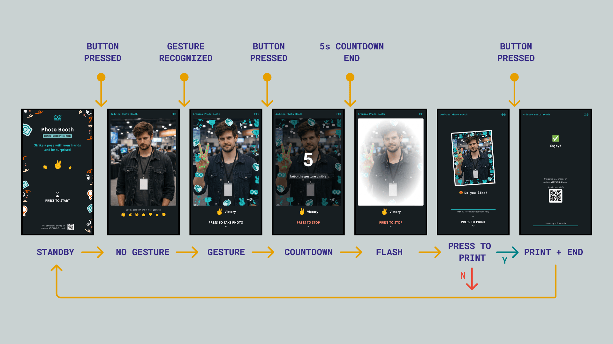

This is the same sequence from the visitor's side:

1. **Press the button to begin.** The splash screen gives way to the live preview, full-screen.
2. **Strike a pose.** Hold up one of the seven recognized gestures and the matching themed frame appears around the preview. Change pose and the frame changes with it. No pose, no frame.
3. **Press the button again.** The label changes to *PRESS TO STOP* and a five-second countdown begins. Pressing again cancels it.
4. **Hold the pose until the flash.** At zero the photo is captured with the themed border applied, and the button relabels to *PRESS TO PRINT*.
5. **Press once more to print.** The photo and its overlay are composited and sent to the print server, and the printing screen appears.
6. **Collect the photo.** The kiosk returns to the splash screen by itself, ready for the next visitor.

<Alert type="note">

If the visitor drops their hand before the flash, no photo is taken and the booth shows a "no gesture" screen instead. Holding the pose all the way through the countdown is the one instruction worth giving people.

</Alert>

Every waiting state is bounded by a timer, so an abandoned session always recovers on its own: an unprinted photo is discarded after 10 seconds. After printing is requested, the screen waits for an explicit success or failure acknowledgement and then returns to idle; if no acknowledgement arrives within 90 seconds, it reports that the print status is unknown before resetting. Elapsed time is never presented as a successful print.

## Troubleshooting and Maintenance

### Common Issues and Remedies

- **No themed frame appears when posing**:
  Ensure sufficient front lighting on the subject's hands. Extremely dark ambient conditions or backlighting can decrease keypoint detection confidence. Remember that the frame only appears while a recognized pose is held.
- **The countdown runs but no photo is taken**:
  This is expected behavior, not a fault: the front-end only captures if a gesture is still held at the end of the countdown, and shows the "no gesture" screen otherwise. Instruct visitors to hold the pose until the flash.
- **Physical trigger button does nothing**:
  Ensure the Nano ESP32 is flashed with the HID firmware and connected to a USB port on the VENTUNO Q. Verify that the button is wired between `D2` and `GND`, and that the sketch calls `Keyboard.begin()` before `USB.begin()`, since reversing the order prevents the board from enumerating as a keyboard. Because the same Enter keystroke drives start, capture and print, a button that fails in one state has failed in all of them; testing with a USB keyboard isolates a firmware fault from a front-end one.
- **Camera stream fails to load**:
  Verify the USB camera connection using `v4l2-ctl --list-devices` or `lsusb`. Replug the camera if necessary. If the camera does not support MJPG at 1280x720, adjust the `Camera(...)` parameters in `main.py` accordingly.
- **Print server error (`PrintServerUnavailable`)**:
  Check the service and the printer separately. `systemctl status print-server` shows whether the service is up; `curl localhost:5003/api/printer_status` shows whether it can see a printer. If the service is running but reports `"available": false`, the problem is CUPS-side, so confirm both the queue state with `lpstat -p` and whether it accepts jobs with `lpstat -a`. Opening `http://<board-ip>:5003` and printing a test photo isolates a printer fault from an application fault.
- **Prints come out cropped or the wrong size**:
  The paper size is negotiated against what the printer reports, so an unexpected result usually means the requested size is not offered. `lpoptions -p <printer> -l` lists the supported `PageSize` values; set `PAPER_SIZE` in the service unit to one of them. A failed `lp` submission reports the page size it attempted in the error message.
- **The print server fails to start with `status=203/EXEC`**:
  `python3-venv` is missing, so the service's virtual environment has no `pip`. Install it with `sudo apt install -y python3-venv`, remove the half-built environment with `sudo rm -rf /home/arduino/print-server/.venv`, then `sudo systemctl restart print-server`.
- **Exiting full-screen kiosk mode for maintenance**:
  Press `Ctrl+Alt+F3` (or any of `F3`–`F6`) to open a TTY terminal, then `Ctrl+Alt+F1` to return to the kiosk session. The board also accepts SSH at all times, independently of the session running the kiosk. To take the board out of kiosk mode permanently, run `sudo bash remove-kiosk.sh`.
- **A dialog is stuck on top of the kiosk after enabling automatic login**:
  This is the login keyring or `update-notifier` asking for a password that nobody is there to type. `setup-kiosk.sh` handles both; if the board was configured by hand, re-run the script.
- **The Chromium title bar or GNOME top bar remains visible**:
  The desktop is probably running under X11 because GDM has an active `WaylandEnable=false` setting. Run `grep -n 'WaylandEnable' /etc/gdm3/custom.conf` to check, then re-run `sudo bash setup-kiosk.sh` and reboot. The setup script enables the default Wayland session while preserving the previous setting for `remove-kiosk.sh` to restore.

## Downloads

[](https://github.com/91volt/ventuno-q-photo-booth/releases/download/v1.0.0/photo-booth-bundle.zip)

Everything required to deploy this build:

- **Complete bundle** ([`photo-booth-bundle.zip`](https://github.com/91volt/ventuno-q-photo-booth/releases/download/v1.0.0/photo-booth-bundle.zip)): version `v1.0.0`, containing everything below in one archive, namely the ready-to-import application, the print server, the kiosk scripts and the 3D-printable holder.
- **Source repository** ([`91volt/ventuno-q-photo-booth`](https://github.com/91volt/ventuno-q-photo-booth)): browsable application, print-server, kiosk and hardware sources under the GPL-3.0 license.
- **Checksums** ([`SHA256SUMS`](https://github.com/91volt/ventuno-q-photo-booth/releases/download/v1.0.0/SHA256SUMS)): SHA-256 hashes for both release archives.

Individual files (also included in the bundle above):

- **Application** ([`photo-booth-app.zip`](https://github.com/91volt/ventuno-q-photo-booth/releases/download/v1.0.0/photo-booth-app.zip)): the Bricks application, ready to import into Arduino App Lab as-is. Contains `app.yaml`, `python/main.py`, `python/printer.py`, the front-end assets and the Nano ESP32 HID firmware sketch.
- **Print server** (`print-server/`, inside the bundle): the host-side service that hands photos to CUPS, with its own README, `systemd` unit and test page.
- **3D model** ([`ventuno-q-holder.stl`](assets/ventuno-q-holder.stl)): 3D-printable holder for mounting the VENTUNO Q on the kiosk stand shelf.
- **Kiosk setup script** ([`setup-kiosk.sh`](assets/setup-kiosk.sh)): installs Chromium if needed, enables automatic login, wires up the systemd unit, the launcher and the GNOME autostart entry, silences the dialogs an unattended session would otherwise show, and disables sleep and blanking. Run once with `sudo`.
- **Kiosk teardown script** ([`remove-kiosk.sh`](assets/remove-kiosk.sh)): reverses everything the setup script did, leaving the application, the print server and Chromium in place unless told otherwise.
- **Kiosk launcher** ([`launch-booth-kiosk.sh`](assets/launch-booth-kiosk.sh)): waits for the back-end on port `7000`, then launches Chromium in kiosk mode. Already embedded by `setup-kiosk.sh`; provided standalone for manual installs.

## Conclusions

In this application note, we built an edge-AI Photo Booth on the VENTUNO Q that uses on-device gesture recognition to pick a themed frame, composed from the `arduino:gesture_recognition` and `arduino:web_ui` Bricks, paired with a Nano ESP32 acting as a USB HID trigger and a 3D-printed stand mount.

The build demonstrates how real-time computer vision models run completely on-device, enabling expressive hands-free user interaction while keeping visitor images on the board. The decoupled HID button and print architecture are what make the installation survive a busy event: a failing printer or a swapped-out trigger never blocks the camera stream or the interface.

### Next Steps

- **Drop the Nano ESP32 and use the onboard MCU**: The VENTUNO Q has its own microcontroller, so the button can be wired straight to a digital pin instead of to a second board. Upload a sketch from the Arduino tab in Arduino App Lab and read the pin over the Bridge, and the trigger becomes part of the same application, with one less board and one less USB cable in the booth.
- **QR code digital download**: Extend the web UI to generate on-screen QR codes linking users to a local web gallery where they can download digital copies of their photos.
- **Custom gesture actions**: Bind additional gestures, or the same gesture on a specific hand, using the `hand` argument of `on_gesture()`, to trigger multi-shot sequences or alternative color filters.
- **Fleet management and usage telemetry**: Send anonymized event metrics (number of photos taken and printed) to the Arduino Cloud for remote monitoring across multiple booth installations.
