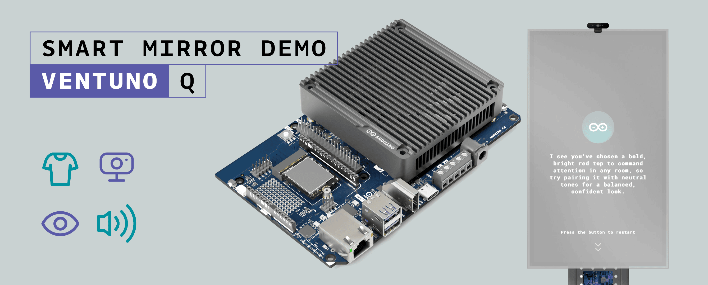
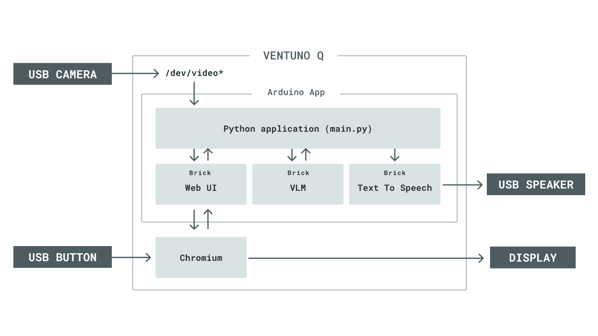
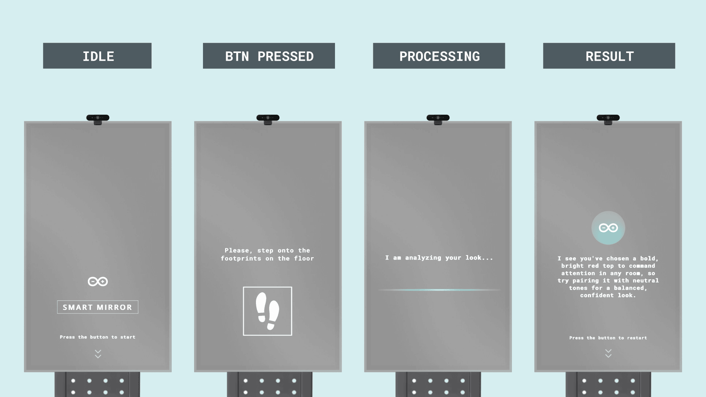
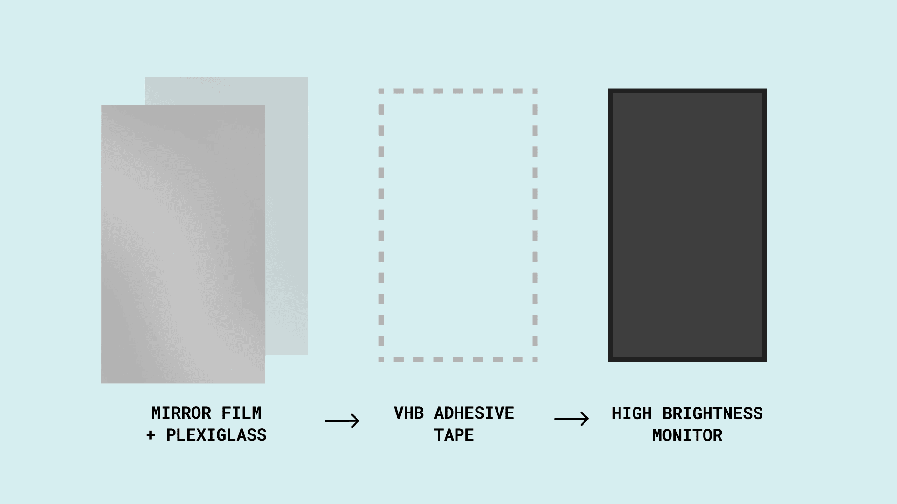
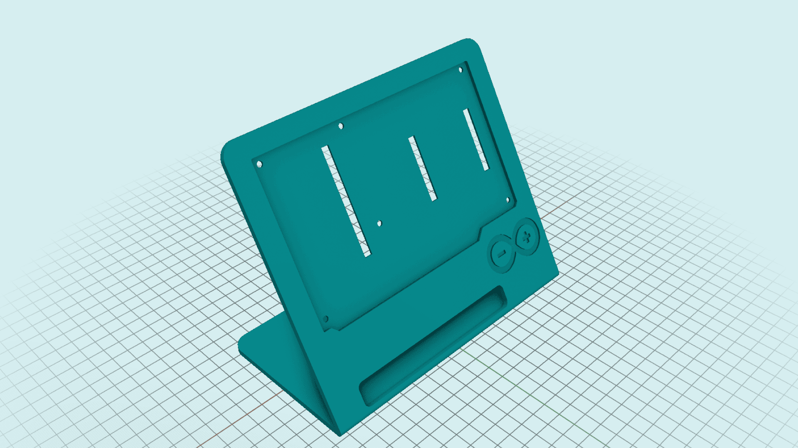
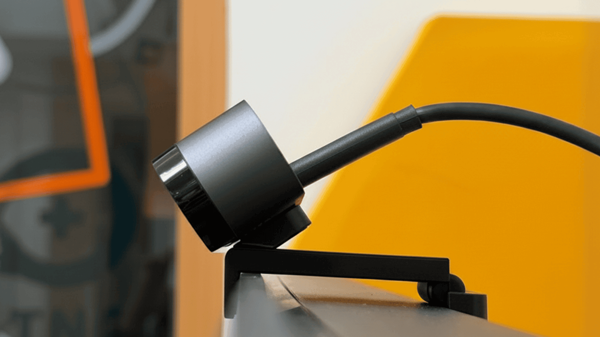
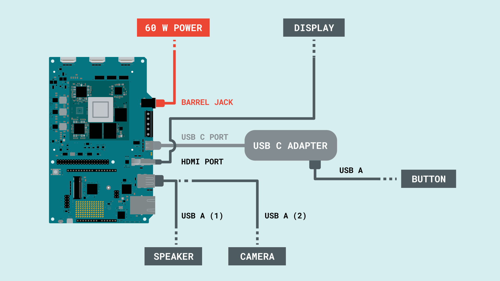
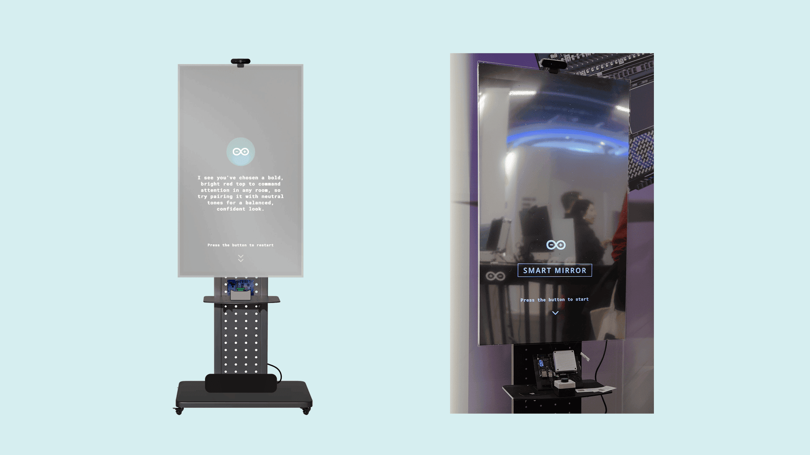
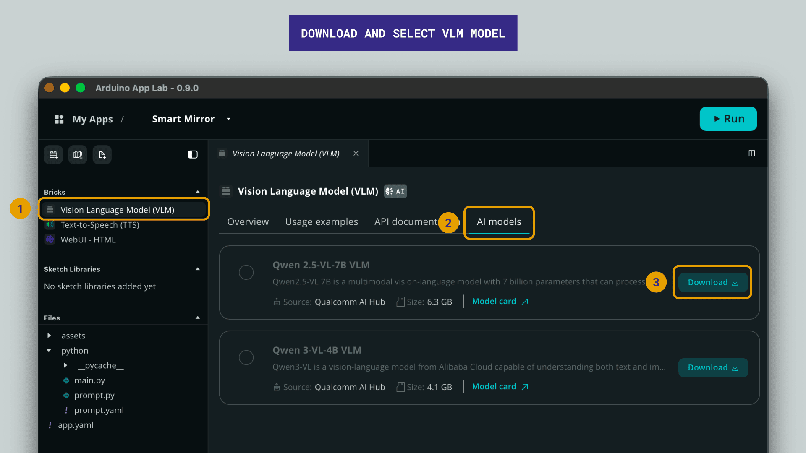
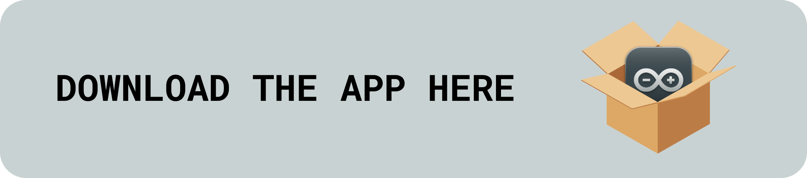

## Introduction

This application note explores the implementation of a Smart Mirror: a kiosk-style installation that captures a user's outfit with a USB camera, analyzes it with an on-device vision-language model (VLM), and replies with a short, friendly style tip that is shown on screen and spoken through a USB speaker. The whole pipeline runs locally on the [**Arduino® VENTUNO™ Q**](https://store.arduino.cc/products/ventuno-q): there is no cloud call in the user-facing path.



The Smart Mirror brings together several edge-AI building blocks of the VENTUNO Q ecosystem:

- A vision-language model that interprets the camera frame and produces a stylistic recommendation in natural language.
- An on-device text-to-speech (TTS) engine that synthesizes the tip into audible speech on a USB-class speaker.
- A web kiosk interface served by the same board and presented full-screen on a portrait monitor mounted behind a partially reflective panel.
- A physical "scan" button, built around an **Arduino® Nano ESP32** acting as a USB HID keyboard, that gives users a tactile way to trigger the analysis without touching the screen.

The result is a self-contained installation whose look and feel is that of a mirror that occasionally lights up to hand out a personal styling tip. By following this application note you will learn how the high-level Arduino Bricks (`vlm`, `tts`, `web_ui`) are composed into a single application, how a Nano ESP32 can act as a HID button so the host application stays decoupled from any specific actuator, and how the physical assembly contributes as much to the illusion as the software does.

## Goals

The main goals of this application note are as follows:

- Build a fully working on-device Smart Mirror that takes a still frame from a USB camera, sends it to a vision-language model, and produces a short style tip without leaving the board.
- Show how to compose the Bricks `vlm`, `tts`, and `web_ui` into a single `arduino-app-cli` application, with a Python® entry point that wires together the camera loop, the model call, the speaker, and a Socket.IO front-end.
- Demonstrate how a separate Nano ESP32 can act as a HID button so the mirror is triggered by a discrete physical actuator while the host application stays unaware of the specific hardware behind it.
- Provide a reproducible kiosk assembly guide: bonding a half-mirror panel to a portrait commercial display, mounting it on a rolling stand, placing the camera and speaker, and configuring the display for a clean reflective look.

## Hardware and Software Requirements

### Hardware Requirements

- **[Arduino® VENTUNO™ Q](https://store.arduino.cc/products/ventuno-q)**: compute host that runs the VLM, TTS and web UI containers.
- **[Arduino® Nano ESP32](https://store.arduino.cc/products/nano-esp32)**: USB HID keyboard for the scan button.
- **A high-brightness commercial display with VESA mounting holes**. The exact size is not critical (the same build works from ~32" up to ~55"), but a high luminance rating (>=1500 nits, ideally 3000+ nits) is essential, because a large fraction of the panel's light is absorbed by the mirror film. Anything sized as a typical "digital signage" panel works well.
- **A rolling stand** with caster wheels and a VESA bracket compatible with the chosen display, capable of holding it in portrait orientation. A built-in power strip on the stand simplifies cabling.
- **A transparent plexiglass sheet** (3–5 mm thick) with a one-way mirror film applied to one face, cut a few millimetres larger than the visible area of the display on each side. The principles behind this "smart panel" stack are described in [The Smart Panel](#the-smart-panel).
- **A momentary push-button** (22 mm panel-mount style) and a small enclosure to host both the button and the Nano ESP32.
- **A USB camera** with autofocus and an adjustable field of view.
- **A USB-class speaker** (UAC) with a built-in DAC for plug-and-play audio out.
- **Display connection**: the VENTUNO Q exposes an onboard HDMI® port, so a standard HDMI cable to the display is enough. A USB-C® hub/dongle that adds HDMI plus extra USB-A ports is optional, and only worth adding if you need more USB-A ports than the two on the board.
- **A 60 W barrel-jack power supply** for the VENTUNO Q.
- **Standard cabling**: HDMI, USB-C-to-USB-A for the Nano ESP32, IEC mains lead, jumper wires for the button.
- **High-bond double-sided VHB tape, zip ties, microfiber cloth**.
- **3D-printed VENTUNO Q holder** for the lower shelf (STL files referenced in the [3D-Printed VENTUNO Q Holder](#3d-printed-ventuno-q-holder) section).

### Software Requirements

- [Arduino App Lab](/software/app-lab/) and [`arduino-app-cli`](https://github.com/arduino/arduino-app-cli) installed on the VENTUNO Q. Arduino App Lab is the GUI used to manage applications, while `arduino-app-cli` is the daemon and CLI that runs them.
- [Arduino IDE 2.0+](https://www.arduino.cc/en/software) on a separate development machine, used only to flash the HID firmware onto the Nano ESP32.
- The Bricks `arduino:vlm`, `arduino:tts`, and `arduino:web_ui`. Their containers are pulled and managed automatically by `arduino-app-cli` when the application is started, but the VLM and TTS **models** are separate downloads, see [Downloading the Models](#downloading-the-models).
- The Smart Mirror application sources, included in this folder. See the [Downloads](#downloads) section at the bottom for ready-to-use setup scripts and the 3D-printable STL.

## Application Architecture Overview

The Smart Mirror application is a typical Bricks composition. The whole stack is described in a single `app.yaml`:

```yaml
name: Smart Mirror
icon: 🪞
description: A smart mirror that scans your outfit and gives a spoken style tip.

bricks:
  - arduino:vlm:
      model: genie:qwen2_5_vl_7b_instruct
  - arduino:tts:
      model: pipertts_en
  - arduino:web_ui
```

Each brick is a self-contained service (a container plus a Python client library) that exposes a clean API to the application:

- `arduino:vlm` runs a quantized, on-device vision-language model, accelerated through the Genie runtime. Which model it loads is set by the `model:` value above and chosen in Arduino App Lab, see [Downloading the Models](#downloading-the-models). The Brick exposes a single `chat(message, images=[...])` method that accepts JPEG bytes for the image input.
- `arduino:tts` runs an on-device text-to-speech model (here `pipertts_en`) in a sibling container. The Brick exposes `speak(text)`, which renders the text to PCM and plays it on the default USB speaker.
- `arduino:web_ui` serves the static front-end (HTML/CSS/JavaScript) on port `7000` and provides a Socket.IO channel and an `expose_api` helper for adding HTTP routes, used here to expose the camera as an MJPEG stream.

When `arduino-app-cli` starts the app it spins up three containers: a `main` container that runs the Python entry point and the web UI, an `audio-analytics-runner` container hosting the TTS engine, and a `genie-models-runner` container hosting the VLM. The `main` container talks to the model containers over a private Docker network; the user only ever sees the kiosk interface on `http://<board-ip>:7000`.



## Understanding On-Device Vision-Language Models

Three theoretical pillars underpin the Smart Mirror: the vision-language model that turns pixels into a styling tip, the half-mirror optical stack that lets the screen "live" inside a mirror, and the HID abstraction that decouples the trigger button from the host application. The design choices in the rest of the document follow directly from them.

### Vision-Language Models on the Edge

A vision-language model (VLM) is a multimodal transformer that ingests images alongside text and produces text out. Where a classical image classifier returns a probability vector over a fixed label set, a VLM returns free-form natural language conditioned on a textual prompt: the same model can describe an outfit, identify objects, read signage, or answer a follow-up question, with no retraining.

Two properties make VLMs interesting for kiosk applications:

- **Open-vocabulary reasoning.** The Smart Mirror does not need a curated taxonomy of garments. The VLM can identify a "linen blazer" or a "cropped denim jacket" with the same machinery, even if neither label was explicitly enumerated in advance.
- **Prompt-controlled behaviour.** The personality, tone, and output shape are configured entirely through the system prompt. Retargeting the same hardware to a different role (gallery docent, fitness coach, children's storyteller) is a text edit, not a retraining cycle.

The trade-off is computational cost: a useful VLM is a multi-billion-parameter model. The Smart Mirror runs either Qwen 2.5-VL-7B or the lighter Qwen 3-VL-4B, quantized and accelerated through the Qualcomm® Genie runtime that the VENTUNO Q ships with. Quantization (typically INT4 weights) shrinks the model to roughly a quarter of its float footprint and lets the NPU evaluate it in a few seconds per frame, which is what makes the local pipeline practical at all. The ceiling for what fits on the board sets the ceiling for what the Smart Mirror can reason about, so model selection is the single biggest knob in any future variation of this build.

### Why On-Device, Not Cloud

A cloud-hosted VLM would be technically simpler: a single HTTPS call. The Smart Mirror is on-device on purpose:

- **Latency.** A round trip to a cloud VLM adds the network RTT plus queueing on top of the model's own decoding time. On-device, the only latency is the inference itself, which is the difference between a kiosk that feels alive and one that feels remote.
- **Privacy.** The camera frames never leave the board. For a public-facing installation that captures images of users' bodies, this property is not optional in many jurisdictions.
- **Operational cost.** A scan is "free" once the hardware is paid for. There is no per-token bill that grows with every visitor.
- **Offline operation.** The kiosk does not depend on a working internet connection or on a third-party service's uptime, important for retail, exhibitions, and trade shows.

These four properties together are what define an *edge-AI* application and motivate the rest of the architecture: dedicated brick containers for VLM and TTS, a private Docker network between them, and a kiosk web UI served by the same board.

### Half-Mirror Panel Optics

The illusion that a display is "a mirror" comes from compounding two partial reflectors in series. With a mirror film transmitting ~70% of incident light and tinted plexiglass transmitting ~7.5%, the combined one-way transmission is `0.70 × 0.075 ≈ 5%`. Ambient light entering the panel reflects off the mirror film, while the bright pixels of an active high-luminance display still punch through that 5% gate with enough residual luminance to be readable. This is the optical principle that justifies the choice of a high-nit display, the low-backlight / high-contrast configuration, and the front-end's preference for thick, white text on dark backgrounds. The mechanical assembly that realizes this stack is described in [The Smart Panel](#the-smart-panel).

### HID as a Hardware Abstraction

Wiring a button directly to a GPIO on the host would couple the application to a specific carrier board and a specific pin map. Routing the button through a Nano ESP32 configured as a USB HID keyboard removes that coupling: the host sees a generic keystroke, indistinguishable from anything else that emits one. The benefit is composability, a foot pedal, a proximity sensor, an IR remote, or a voice trigger can all replace the push-button without a single line of host-side code changing, as long as they emit the same key. The same abstraction principle applies in software through the brick architecture: the application code does not know whether `vlm.chat()` runs on the local NPU or, in a future variant, on a remote model server. Stable interfaces over swappable implementations.

## Smart Mirror Application

The Python entry point of the application is `python/main.py`. It is short by design, since most of the heavy lifting is done by the bricks, but it covers four responsibilities: keeping the camera frame fresh, exposing that frame as a live MJPEG stream, running the analysis pipeline on demand, and speaking the result.

### Application Code

```python
import time
from threading import Lock

from fastapi.responses import StreamingResponse

import prompt

from arduino.app_bricks.tts import TextToSpeech
from arduino.app_bricks.vlm import VisionLanguageModel
from arduino.app_bricks.web_ui import WebUI
from arduino.app_peripherals.camera import Camera
from arduino.app_utils import App, Logger
from arduino.app_utils.image import compressed_to_jpeg


logger = Logger("SmartMirror")

SYSTEM_PROMPT, USER_PROMPT_TEMPLATE = prompt.load_prompts()

frame_lock = Lock()
current_frame: bytes | None = None

ui = WebUI()
vlm = VisionLanguageModel(
    system_prompt=SYSTEM_PROMPT,
    temperature=0.4,
    max_tokens=160,
)
tts = TextToSpeech()


def generate_frames():
    while True:
        with frame_lock:
            frame = current_frame

        if frame is None:
            time.sleep(0.1)
            continue

        yield b"--frame\r\nContent-Type: image/jpeg\r\n\r\n" + frame + b"\r\n"
        time.sleep(0.05)


def video_stream():
    return StreamingResponse(
        generate_frames(),
        media_type="multipart/x-mixed-replace; boundary=frame",
    )


def start_tip_pipeline(sid, _data):
    ui.send_message("tip_pipeline_start", {})

    with frame_lock:
        frame = current_frame

    try:
        if frame is None:
            raise RuntimeError("No camera frame available")

        tip = vlm.chat(
            message=prompt.build_user_prompt(USER_PROMPT_TEMPLATE),
            images=[frame],
        ).strip()
        if not tip:
            tip = "I can't read your look yet. Step into view and try again."
        else:
            tip = " ".join(tip.split())
    except Exception as exc:
        logger.exception(f"Smart mirror tip pipeline failed: {exc}")
        tip = "Sorry, something went wrong while generating the tip."

    ui.send_message("tip_pipeline_end", {"tip": tip})

    try:
        tts.speak(tip)
    except Exception as exc:
        logger.exception(f"TTS playback failed: {exc}")


camera = Camera(fps=30, adjustments=compressed_to_jpeg())


def loop():
    global current_frame

    frame = camera.capture()
    if frame is None:
        return

    with frame_lock:
        current_frame = frame.tobytes()


ui.expose_api("GET", "/stream", video_stream)
ui.on_message("start_tip_pipeline", start_tip_pipeline)

with camera:
    App.run(user_loop=loop)
```

The following sections walk through the main parts of the code.

### Bricks and Shared State

```python
ui = WebUI()
vlm = VisionLanguageModel(
    system_prompt=SYSTEM_PROMPT,
    temperature=0.4,
    max_tokens=160,
)
tts = TextToSpeech()

frame_lock = Lock()
current_frame: bytes | None = None
```

Each brick is instantiated once at module load:

- `WebUI()` boots the embedded HTTP server and Socket.IO endpoint exposed on port `7000`.
- `VisionLanguageModel(...)` opens a connection to the VLM container. The system prompt and decoding parameters are passed in here once and re-used on every call. `temperature=0.4` keeps the answer focused without being mechanical, and `max_tokens=160` caps it at the two-sentence format the prompt asks for.
- `TextToSpeech()` opens a connection to the TTS container and uses the default speaker (the first UAC-class device found on the USB bus).

`current_frame` and `frame_lock` form a small thread-safe cache for the latest JPEG-encoded frame from the camera. The capture loop, the MJPEG endpoint, and the scan handler all read from this same cache, using a lock keeps them in sync without coupling them to each other's timing.

### The Camera Loop

```python
camera = Camera(fps=30, adjustments=compressed_to_jpeg())


def loop():
    global current_frame

    frame = camera.capture()
    if frame is None:
        return

    with frame_lock:
        current_frame = frame.tobytes()
```

The `Camera` peripheral is configured at 30 FPS with a `compressed_to_jpeg()` adjustment baked into the capture pipeline. As a result, every frame returned by `camera.capture()` is already JPEG-encoded, the application never has to call `cv2.imencode` itself, and the same bytes can be reused as both the source for the MJPEG stream and the input to the VLM.

The `loop()` function is registered with `App.run(user_loop=loop)` and is invoked by the framework on a tight loop. Every iteration grabs a fresh frame and replaces the cached one under the lock; older frames are simply discarded. This keeps memory bounded and ensures that the latest available frame is always at most a few tens of milliseconds old.

### Live Video Stream

```python
def generate_frames():
    while True:
        with frame_lock:
            frame = current_frame

        if frame is None:
            time.sleep(0.1)
            continue

        yield b"--frame\r\nContent-Type: image/jpeg\r\n\r\n" + frame + b"\r\n"
        time.sleep(0.05)


def video_stream():
    return StreamingResponse(
        generate_frames(),
        media_type="multipart/x-mixed-replace; boundary=frame",
    )

ui.expose_api("GET", "/stream", video_stream)
```

`generate_frames()` is a Python generator that yields JPEG frames as parts of an HTTP `multipart/x-mixed-replace` response, the standard pattern for browser-friendly MJPEG streaming. Each part starts with the `--frame` boundary, declares its content type, and contains the cached JPEG bytes.

`video_stream()` wraps that generator in a FastAPI `StreamingResponse`, and `ui.expose_api("GET", "/stream", ...)` mounts it on the web UI's HTTP server. From the front-end this is then trivially reachable as ``, allowing the camera feed to be embedded in the kiosk page during framing or debugging.

### The Scan Pipeline

```python
def start_tip_pipeline(sid, _data):
    ui.send_message("tip_pipeline_start", {})

    with frame_lock:
        frame = current_frame

    try:
        if frame is None:
            raise RuntimeError("No camera frame available")

        tip = vlm.chat(
            message=prompt.build_user_prompt(USER_PROMPT_TEMPLATE),
            images=[frame],
        ).strip()
        if not tip:
            tip = "I can't read your look yet. Step into view and try again."
        else:
            tip = " ".join(tip.split())
    except Exception as exc:
        logger.exception(f"Smart mirror tip pipeline failed: {exc}")
        tip = "Sorry, something went wrong while generating the tip."

    ui.send_message("tip_pipeline_end", {"tip": tip})

    try:
        tts.speak(tip)
    except Exception as exc:
        logger.exception(f"TTS playback failed: {exc}")


ui.on_message("start_tip_pipeline", start_tip_pipeline)
```

The scan pipeline is registered as a Socket.IO handler on the `start_tip_pipeline` event. The front-end emits this event when the user presses the physical button (or its on-screen equivalent), and the back-end runs the full pipeline:

1. Notify the front-end that the pipeline has started (`tip_pipeline_start`). The kiosk uses this signal to switch to its "scanning" screen and start a looping animation.
2. Snapshot the latest cached frame under the lock.
3. Build a user prompt from the template and call `vlm.chat(message, images=[frame])`. The prompt template fills in stylistic openers and tip starters that vary between runs to keep the experience fresh; the result is a short paragraph in natural language.
4. Sanitize the result (collapse whitespace, fall back to a friendly message on empty answers, log and recover from exceptions).
5. Send the final text to the front-end (`tip_pipeline_end`), which switches to the "result" screen and displays the tip.
6. Speak the tip out loud through the USB speaker via `tts.speak(tip)`.

Errors at any step are caught and turned into a graceful spoken response, so a transient model glitch never leaves the kiosk silent.

### Prompt Engineering

Getting consistent, on-brand answers from a small on-device VLM is largely a prompt-engineering exercise. The Smart Mirror keeps its prompts in a separate `prompt.yaml` file with two top-level keys, `system` and `user`, that are loaded once at startup and re-used on every scan.

#### System Prompt

The system prompt is what the VLM sees first, before any image. It is the place to install the model's *role* and the hard *output rules*:

```yaml
system: |
  You are a Smart Mirror Stylist specialized in detecting garments and giving style advice based on them.

  Task:
  - Identify the single most prominent clothing item worn by the person.
  - Identify its exact type (e.g. "shirt", "t-shirt", "dress", "jacket", "sweater", "suit", etc.).
  - Identify its single main color.
  - Provide style advice based on that item and its color.

  Tone (must follow):
  - Warm, simple, friendly.
  - Not formal.

  Output format (strict rules):
  - Write ONE single paragraph in English with no newlines, and output ONLY that paragraph as plain text (no quotes, no markdown, no bullet points/lists, no emojis).
  - No extra text before or after the paragraph.
  - Exactly TWO sentences.
  - {opener} and {tip_starter} are provided in the user message and must be used exactly as given.
  - The first sentence MUST start with the exact string provided as {opener}.
  - The first sentence MUST explicitly mention the exact item type and the exact color detected.
  - The second sentence MUST start with the exact string provided as {tip_starter}.
  - The second sentence MUST contain exactly ONE styling tip related to that item and its color.
```

The structure is intentional and addresses the most common failure modes of small VLMs in a kiosk setting:

- **Role framing first.** Telling the model it is a "Smart Mirror Stylist" before listing tasks anchors its style and reduces drift toward generic image-description answers.
- **Explicit task decomposition.** Instead of asking "describe the outfit", the prompt forces a four-step pipeline (find item → name type → name color → suggest tip). This dramatically reduces hallucinated garment types and produces tips that reference what is actually visible.
- **Tone, then output format.** The tone block sets register; the format block then enforces machine-readable structure. Splitting them is what lets the same model be retargeted (gallery docent, fitness coach, ...) by editing only the tone lines.
- **Hard output rules.** "Exactly two sentences", "no newlines", "no markdown", "no emojis". These constraints exist because the front-end displays the tip as a single paragraph in a strictly-styled container. Anything else (bullet lists, extra paragraphs, stray punctuation) breaks the kiosk layout. Stating the rules in the system prompt is far cheaper and more reliable than post-processing the output.
- **Slot placeholders.** The `{opener}` and `{tip_starter}` placeholders create *shape constraints* for the two sentences. The model is told a specific word or phrase will arrive in the user message and must be used verbatim at the start of each sentence, this gives the application a foothold to enforce variation without retraining the model.

#### User Prompt and Per-Call Variation

The user prompt is much shorter and is the place where per-call variation is injected:

```yaml
user: |
  opener = "{opener}"
  tip_starter = "{tip_starter}"

  Look at the image and give me a style tip.
```

On every scan, the application picks a random `opener` (e.g. `"You're rocking"`, `"Today you've got"`, ...) and a random `tip_starter` (e.g. `"Try"`, `"For a cleaner look"`, ...) from short curated lists, and substitutes them into the template before sending it to the VLM. Because the system prompt forces the model to use those exact strings as the opening of each sentence, this lightweight randomization produces six-by-six (= 36) different tip "shapes" without changing the underlying logic, enough to make the mirror feel alive when several people use it in a row, while keeping every answer well-formed.

This split between *static rules* (system prompt) and *per-call slots* (user prompt) is the core pattern of the application: the system prompt defines what a valid Smart Mirror answer looks like, and the user prompt parametrizes the surface variation. Tweaking the personality of the mirror is then a matter of editing the role + tone lines in the system prompt and restarting the app, no Python change required.

#### Prompt Module

A tiny Python helper loads the YAML at startup and builds the per-call user message:

```python
from pathlib import Path
import random
import yaml


PROMPT_PATH = Path(__file__).with_name("prompt.yaml")

MESSAGE_OPENERS = [
    "Looks like you've got on",
    "You're wearing",
    "Today you've got",
    "You're rocking",
    "I see you've chosen",
    "Your outfit includes",
]

TIP_STARTERS = [
    "Try",
    "Next time",
    "To level it up",
    "For a cleaner look",
    "Maybe try",
    "Why not",
]


def load_prompts() -> tuple[str, str]:
    with PROMPT_PATH.open("r", encoding="utf-8") as prompt_file:
        prompt_data = yaml.safe_load(prompt_file) or {}

    system_prompt = (prompt_data.get("system") or "").strip()
    user_prompt_template = (prompt_data.get("user") or "").strip()

    if not system_prompt:
        raise ValueError(f"Missing 'system' prompt in {PROMPT_PATH}")
    if not user_prompt_template:
        raise ValueError(f"Missing 'user' prompt in {PROMPT_PATH}")

    return system_prompt, user_prompt_template


def build_user_prompt(user_prompt_template: str) -> str:
    return user_prompt_template.format(
        opener=random.choice(MESSAGE_OPENERS),
        tip_starter=random.choice(TIP_STARTERS),
    )
```

The two curated lists `MESSAGE_OPENERS` and `TIP_STARTERS` are the source of the per-call variation described above; `load_prompts()` reads `prompt.yaml` once at startup, and `build_user_prompt()` performs the per-scan substitution. Keeping the prompts in a separate YAML file is also a deployment-time benefit: tweaking the mirror's personality, tone, or rules is a matter of editing `prompt.yaml` and restarting the app, no Python change, no container rebuild.

### Front-End and Kiosk Behavior

The static front-end lives under `assets/` and is served by the `arduino:web_ui` brick. It is intentionally a kiosk experience rather than a typical web app:

- The page uses a fixed 1080×1920 portrait design canvas, scaled at runtime to whatever resolution the browser reports. A small `applyMirrorScale()` function in `app.js` computes `min(innerWidth/1080, innerHeight/1920)` and writes the result into a CSS variable, so the layout fits both the on-mirror portrait monitor and a typical landscape browser used during development without the user having to zoom.
- The flow is split into four screens: a welcome screen with the prompt to press the button, a preparation screen that asks the user to step into view, a scanning screen that loops a few status phrases while the VLM is working, and a result screen that displays the tip and offers a restart button.
- All transitions are driven by Socket.IO events (`tip_pipeline_start`, `tip_pipeline_end`) emitted by the back-end, so the front-end never has to poll. The same events are also available to a small "debug next" key binding that lets developers walk through all four screens without actually invoking the model.

The HID button covered in [The Scan Button](#the-scan-button) emits an Enter keystroke when pressed; the front-end listens for `keydown` and turns it into a click on either the start button (from screen one) or the restart button (from the result screen).



## Building the Smart Mirror Kiosk

The physical build is split into two phases separated by a curing window. The mirror panel is glued to the display while the assembly is laying flat, and the high-bond adhesive needs at least 12 hours to cure before the assembly can be lifted into its vertical kiosk orientation. Plan accordingly: the bonding step is best done in the evening so that the curing period spans the night.

The Smart Mirror is designed to be display-agnostic: any portrait-mounted display from roughly 32" to 55" will work as long as the camera is placed correctly relative to the user. The two ergonomic constraints that actually matter are:

- **Camera placement**: the camera sits at the top of the panel, centered horizontally, and is tilted slightly downward so that the optical axis falls on the user's chest at standing distance.
- **User positioning**: at conversational distance (roughly an arm's length plus a step back), the camera's framing should cover from the head down to the waist. This is what gives the VLM a clean view of the dominant garment.

Mark a "step here" footprint on the floor at the right distance once the kiosk is assembled. A piece of vinyl tape is enough, and it makes the experience reproducible session after session, regardless of the underlying display size.

### The Smart Panel

What turns a plain display into a "mirror" is a four-layer optical stack bonded together at the perimeter:



From the viewer back to the display, the layers are:

1. **Mirror film**, a thin polyester film with a partially reflective metal coating on one side. It transmits roughly **60–80%** of the incident light and reflects most of the rest. Applied to the front face of the plexiglass.
2. **Plexiglass (3–5 mm)**, a transparent acrylic sheet that gives the assembly its rigidity and protects the film. For the Smart Mirror we use a *tinted* (smoked) plexiglass with a light transmission of about **5–10%**, which is what makes the panel look dark when the screen is off.
3. **VHB adhesive tape**, a high-bond double-sided tape applied as a continuous frame around the perimeter, ~1 cm in from the edges. It glues the panel to the display bezel and seals out dust along the edge.
4. **The display**, any portrait-mounted high-brightness panel.

Because the bond is permanent, all of this happens once: the moment the plexiglass is pressed onto the display, the smart panel is finalized.

### Bonding the Mirror Panel

This is the most delicate step, because the bond is permanent on contact.

1. Lay the display face-up on a large flat surface (a table or floor protected with a soft blanket).
2. Clean the front bezel and the panel surface thoroughly with a microfiber cloth. Any dust or fingerprints trapped under the mirror panel will be visible afterwards.
3. Peel the protective film off the back of the plexiglass panel.
4. Apply VHB tape strips along the full perimeter of the plexiglass back surface, about 1 cm in from the edges.
5. Peel the VHB backing strips. From this point on, do not let the adhesive touch anything until alignment is final.
6. Carefully lower the plexiglass onto the display with the mirror film side facing up (toward the eventual viewer). Two people make alignment much easier.
7. Press firmly along all taped edges with even, steady pressure to activate the bond.
8. Optionally, distribute a few flat weights (e.g. books) on the perimeter to keep the panel flat while curing. Avoid putting weight on the center of the panel.
9. Leave the assembly flat and undisturbed for at least 12 hours.

> **Warning:** VHB tape creates a permanent bond on contact. The plexiglass cannot be repositioned once the strips touch the display. Confirm the alignment before pressing.

### Assembling and Mounting the Stand

While the panel cures, assemble the rolling stand. The stand ships with its own illustrated manual; only a few choices are specific to this build.

- Assemble the stand following its native instructions (base, column, shelf, casters).
- Set the VESA mount to the highest available position so that a standing user's eye line falls naturally inside the upper third of the panel.
- Lock at least two diagonally opposite caster wheels once the stand is in its final position.
- Use the lower shelf to host the VENTUNO Q (mounted on the 3D-printed holder described below), any USB-C hub if used, and the button enclosure.

Once the bond has cured, attach the VESA mount bolts to the back of the display while it is still laying flat, which avoids juggling a heavy assembly later. With a second person, lift the assembly, engage the VESA plate onto the stand bracket, and tighten the retention hardware. Rotate the display to portrait, with the long edge vertical.

> **Warning:** A commercial display plus a plexiglass panel can easily exceed 20 kg on larger sizes. Always lift with two people and confirm that the casters are locked before mounting.

### 3D-Printed VENTUNO Q Holder

A small 3D-printed holder keeps the VENTUNO Q upright on the lower shelf. The reference design is the standard VENTUNO Q stand with minor tweaks for cable clearance. Download the STL: [ventuno-q-holder.stl](assets/ventuno-q-holder.stl).



Recommended print settings:

| Parameter      | Suggested value                                                  |
| -------------- | ---------------------------------------------------------------- |
| Layer height   | 0.2 mm (0.1 mm for higher quality, 0.25–0.30 mm for fast prints) |
| Wall thickness | Slicer default                                                   |
| Infill         | 15–20%                                                           |
| Supports       | Yes (tree/organic recommended)                                   |
| Material       | PLA                                                              |

The default flat orientation prints cleanly with organic supports in a reasonable amount of time. Vertical orientation gives an even nicer finish but may exceed the build height of typical entry-level printers.

### Camera and Speaker Placement

The USB camera is clipped to the top edge of the plexiglass panel, centered horizontally, and tilted slightly downward (around 45°) so that the framing is roughly head-to-waist on a person standing in front of the mirror at conversational distance. Route the USB cable down the back of the display toward the stand column so that it is not visible from the front.



The USB speaker sits on the lower shelf. Routing its cable up along the back of the column keeps the front clear and makes the audio source feel like it is coming from "the mirror itself".

### Cable Map

The VENTUNO Q exposes an onboard HDMI port, one USB-C port, and two USB-A ports. The display connects directly to the onboard HDMI; the two native USB-A ports host the camera and the speaker. The Nano ESP32 button uses the USB-C port (with a short USB-C-to-USB-A cable) or, if a USB-C hub is fitted, one of its spare USB-A ports.

| From                | To                                         |
| ------------------- | ------------------------------------------ |
| Display HDMI in     | VENTUNO Q HDMI out                         |
| USB speaker         | VENTUNO Q USB-A (1/2)                      |
| USB camera          | VENTUNO Q USB-A (2/2)                      |
| Nano ESP32 (button) | VENTUNO Q USB-C (via USB-C-to-USB-A cable) |
| Mains outlet        | VENTUNO Q 60 W barrel-jack power supply    |

If you do need extra USB-A ports, a USB-C hub plugged into the VENTUNO Q's USB-C port can host the Nano ESP32 (and optionally drive the display through the hub's HDMI out instead of the onboard one). The application is agnostic to which option you pick.

All data and power cables run behind the display and down through the stand column to the lower shelf, where the VENTUNO Q (and the USB-C hub, if used) live.



### Display Configuration

The display configuration is what sells the "mirror" illusion: dark areas of the UI must be dark enough for the panel to look reflective, while text and graphics still need to be readable through the mirror film.



| Setting            | Recommended value                                        |
| ------------------ | -------------------------------------------------------- |
| Backlight          | 20–30                                                    |
| Brightness         | 20–30 (matched to backlight)                             |
| Contrast           | 100 (maximum)                                            |
| Sharpness          | 0 (disabled, avoids edge halos through the mirror layer) |
| Input source       | HDMI from the VENTUNO Q                                  |
| Auto power off     | Disabled                                                 |
| Backlight schedule | Disabled                                                 |

Start at the low end of the backlight/brightness range and only increase if the on-site lighting requires it. Excess backlight is the most common cause of a "washed-out mirror" effect.

For orientation, a single 90° portrait rotation is usually exposed by the display's OSD. Whether you need to enable it depends on which way the display ends up sitting on the stand. Power up the display before configuring the VENTUNO Q and check whether the boot logo appears right-side up:

- If the logo is upright in portrait, set the OSD orientation to **Portrait** and let the display handle the rotation.
- If the logo is upside-down, leave the OSD in **Landscape** and rotate the image at the OS level on the VENTUNO Q (Settings > Display > Orientation).

### The Scan Button

The physical button is a momentary 22 mm push-button driven by a Nano ESP32 acting as a USB HID keyboard. Pressing the button sends a single keystroke to the host VENTUNO Q, which the front-end interprets as a scan trigger. This decouples the mirror application from any specific button hardware: the host does not need a custom driver, and the button can be replaced by anything else that emits the same keystroke (a foot pedal, a proximity sensor, an IR remote, ...).

#### Wiring

The wiring is intentionally minimal:

- Connect one terminal of the push button to the **GND** pin on the Nano ESP32.
- Connect the other terminal of the push button to **D2** on the Nano ESP32.


The firmware configures D2 with an internal pull-up resistor; pressing the button pulls the line low and triggers the keystroke. No external resistors or debouncing components are required, debouncing is handled in firmware.

#### Firmware Code

The complete firmware is short. It configures the button pin with an internal pull-up, enumerates the board as a USB HID keyboard, and emits a single Enter keystroke on each clean press. Software debouncing is built in, so no external RC network is needed.

```arduino
#include "USB.h"
#include "USBHIDKeyboard.h"

USBHIDKeyboard Keyboard;

const int buttonPin = D2;
const unsigned long debounceDelay = 50;

bool lastReading = HIGH;
bool stableState = HIGH;
unsigned long lastDebounceTime = 0;

void setup() {
  // Button wired to GND, using internal pull-up
  pinMode(buttonPin, INPUT_PULLUP);

  // Start USB device stack and HID keyboard
  USB.begin();
  Keyboard.begin();
}

void loop() {
  int reading = digitalRead(buttonPin);

  // Debounce: reset timer on any change
  if (reading != lastReading) {
    lastDebounceTime = millis();
  }

  // If the state is stable long enough, accept it
  if (millis() - lastDebounceTime > debounceDelay) {
    if (reading != stableState) {
      stableState = reading;

      // LOW means pressed (because of INPUT_PULLUP)
      if (stableState == LOW) {
        Keyboard.press(KEY_RETURN);
        delay(10);
        Keyboard.release(KEY_RETURN);
      }
    }
  }

  lastReading = reading;
}
```

#### Debouncing and Keystroke Emission

The `loop()` function is a textbook software debouncer. On every iteration it samples `D2` and resets `lastDebounceTime` whenever the raw reading changes. Only after the line has been stable for at least `debounceDelay` (50 ms) is the new value committed to `stableState`. A press transition (`HIGH → LOW`, because of `INPUT_PULLUP`) is what fires a keystroke: `Keyboard.press(KEY_RETURN)` followed by a 10 ms `delay()` and `Keyboard.release(KEY_RETURN)`. The brief delay between press and release ensures the host's HID stack registers a complete key event and not a spurious modifier-only state.

The choice of `KEY_RETURN` is deliberate. The Smart Mirror front-end already binds the Enter key to its primary action (start scan, restart from result), so the same firmware works without any host-side configuration, and the same button works on any other application that treats Enter as "OK".

#### Flashing the HID Firmware

The sketch above is uploaded to the Nano ESP32 with the standard Arduino IDE workflow:

1. Paste the firmware code into a new sketch in the Arduino IDE.
2. Select **Nano ESP32** from the boards list.
3. Connect the Nano ESP32 to your development machine via USB-C.
4. Click **Upload** to flash the firmware.
5. After flashing, verify on the development machine that the board enumerates as an HID keyboard.

Once the firmware is in place, plugging the Nano ESP32 into the VENTUNO Q (directly via the USB-C port, or through a USB-C hub if one is fitted) is enough to make the button "just work", no further configuration is needed on the host side.

#### Enclosure

The button and the Nano ESP32 share a small ABS enclosure mounted on the lower shelf. The USB-C cable from the Nano ESP32 exits the enclosure on the side facing the stand column and is routed up along the column toward the VENTUNO Q (or the USB-C hub, if one is fitted).

## Running the Application

With the hardware assembled and Arduino App Lab installed on the VENTUNO Q, the Smart Mirror can be deployed either from the Arduino App Lab interface or from a shell on the board.

### Importing the Application in Arduino App Lab

The simplest route needs no shell at all. In Arduino App Lab:

1. Select the **My Apps** tab in the left sidebar.
2. In the top-right corner, click **Create new app +**, then **Import App**.
3. Drag `smart-mirror-app.zip` into the dialog, or use **Import from computer** to select it.


Arduino App Lab accepts a `.zip` only, which is why the bundle ships the application ready-packed as `smart-mirror-app.zip` rather than as a loose folder. It copies the application into the user apps directory and lists it alongside the built-in examples, from where it can be started, stopped and monitored.

### Downloading the Models

The Bricks pull their own containers automatically, but their **models are separate downloads** that have to be on disk before the mirror can start. Both are fetched the same way: open the Brick in Arduino App Lab, switch to its **AI models** tab, then download and select a model.

Start with the **Vision Language Model (VLM)** Brick, which is by far the larger of the two. Select the Brick, open its **AI models** tab, then **Download** the model you want:



Either model works, and the choice is a straight trade between quality and footprint:

| Model          | Size   | Notes                                       |
| :------------- | :----- | :------------------------------------------ |
| Qwen 2.5-VL-7B | 6.3 GB | More capable, slower per scan, more disk    |
| Qwen 3-VL-4B   | 4.1 GB | Lighter and quicker to load, a good default |

Whichever you pick, the `model:` value in `app.yaml` has to match it. The listing earlier in this note shows `genie:qwen2_5_vl_7b_instruct`; change it to `genie:qwen3_vl_4b_instruct` if you downloaded the 4B model instead.

Then do the same for the **Text-to-Speech (TTS)** Brick, whose voice model the mirror needs in order to speak. It is small by comparison, around 79 MB for `pipertts_en`, and easy to forget precisely because the VLM download dominates the setup. Pick the voice matching the language you want; `app.yaml` selects it with `model: pipertts_en`.

<Alert type="warning">

A model that has not finished downloading is the single most common reason a freshly-imported Smart Mirror fails to start. It is also why the kiosk unit installed later waits for the model directory on disk rather than for the application alone. That guard watches the **VLM** only, since it is the long download; a missing TTS voice surfaces as an error at startup instead.

</Alert>

### Starting From the Command Line

The same application can be managed from a shell, which is what the kiosk autostart unit later uses.

1. Unpack `smart-mirror-app.zip` into the user apps directory on the VENTUNO Q, so that the application sits at `~/ArduinoApps/smart-mirror`. The identifier used by the CLI comes from this **folder name**, not from the `name:` field in `app.yaml`.
2. From any shell on the board, start the application:

   ```bash
   arduino-app-cli app start user:smart-mirror
   ```

   The first run will pull or load the VLM and TTS containers and may take a few minutes. Subsequent runs start in seconds.

3. Open `http://<board-ip>:7000` in a browser. The kiosk page should appear, ready to be triggered with the physical button or the on-screen start button.

To follow what the application is doing, for example to confirm that the model containers are initializing and that the camera and speaker have been detected, tail the application logs:

```bash
arduino-app-cli app logs user:smart-mirror
```

A healthy startup ends with messages similar to `Successfully started USB Camera`, `Successfully started <speaker name>`, and `App started`.

To stop the application (for example before deploying a different one that also binds port 7000):

```bash
arduino-app-cli app stop user:smart-mirror
```

The same operations are available from the Arduino App Lab GUI, which lists the application alongside its current state and exposes the logs view directly.

## Running as a Kiosk

For a deployed installation, a public-facing demo, a retail corner or an event stand, the Smart Mirror should come up by itself when the board is powered on, with no keyboard, mouse or shell interaction required.

Install the application first, download its model, then run the setup script last:

```bash
sudo bash setup-kiosk.sh
```

Undo it at any time with the matching teardown script:

```bash
sudo bash remove-kiosk.sh
```

Both are idempotent, so running either twice is harmless.

### Set the Display to Portrait First

The mirror interface is designed around a 1080x1920 portrait canvas, so rotate the display before configuring the kiosk. Many commercial panels can be rotated from their own on-screen menu, which is worth preferring because the rotation then survives any change to the desktop session. Otherwise open **Settings > Displays** on the board, set **Orientation** to **Portrait**, and apply.

### Finding the Application

A kiosk unit has to name the application it starts, and that name cannot be hard-coded. Importing through the Arduino App Lab interface gives the application a timestamped identifier such as `user:smart-mirror-20260725-075847`, not the plain `user:smart-mirror` that copying a folder by hand produces.

The script therefore discovers the installed application rather than assuming its name, and stops with an explicit message if it finds none or more than one. Where several are installed, name the one to boot into:

```bash
APP_ID=user:smart-mirror-20260725-075847 sudo -E bash setup-kiosk.sh
```

The lookup runs as the `arduino` user on purpose. Applications are resolved from that user's home directory, so `arduino-app-cli app list` returns nothing at all when run under `sudo`.

### What the Script Configures

1. **Chromium**, installed as a snap if no `chromium` binary is present. It is not part of the board image.

    <Alert type="warning">

    `apt install chromium` does **not** work on this image, because the package has no candidate in the Ubuntu archive, and `chromium-browser` is only a transitional package that pulls in the same snap.

    </Alert>

2. **GDM's default Wayland session**, restored if the board has been forced to X11. Chromium's `--kiosk` mode remains a decorated window on this image when `WaylandEnable=false` is active, so the script comments that line out and records the original so the teardown script can put it back.
3. **Automatic login** for the `arduino` user, so a desktop session exists without anyone typing a password. Existing active autologin settings are recorded before the kiosk values are normalized and restored during teardown.
4. **A `systemd` unit** that waits for the `arduino-app-cli` daemon socket on port `8800` *and* for the vision-language model to be present on disk, then starts the application. It treats "already running" as success, so a boot where something else started the application first does not leave the unit failed.
5. **The kiosk launcher and a GNOME autostart entry**. The launcher polls port `7000` before starting Chromium, so the user-side autostart and the system-side unit can race freely, whichever finishes first waits the other out.
6. **Suppression of the dialogs** an unattended session would otherwise raise (see below).
7. **Sleep, idle blanking and screen lock disabled**, in two layers: the `systemd` sleep targets are masked *and* a system-wide `dconf` default turns off GNOME's idle behaviour. Either alone leaves a gap: `systemd` can suspend the board even when GNOME is told not to idle, and GNOME blanks the screen even on a board that never suspends. The script records which targets were already masked and whether it had to alter the `dconf` profile, so teardown changes only kiosk-owned state.

### Waiting for the Model, Not the Model List

The mirror cannot start before its vision-language model is on disk. On a board with a freshly-imported bundle the daemon's own default-app hook fires a few seconds after the service starts, earlier than the model registry finishes scanning, and the app fails with:

```text
ERROR Failed to start default app
  error="model \"genie:qwen2_5_vl_7b_instruct\" not found"
```

The guard installed by the script waits for the model **directory** to exist, be non-empty and carry no `.download` marker. It deliberately does not use `arduino-app-cli model list`, which lists models even when they are not installed and would let the unit fire early.

Which model it waits for is read from the application's own `app.yaml` at boot, so changing the model in the Arduino App Lab interface does not require editing the unit. Force a specific directory if you need to:

```bash
MODEL_DIR=qwen2_5_vl_7b_instruct-genie-w4a16-qualcomm_qcs8275 sudo -E bash setup-kiosk.sh
```

### Two Traps Worth Knowing About

Automatic login solves one problem and creates two more, both of which put a modal dialog on top of the kiosk where nobody can dismiss it. The script handles both, but they are worth understanding if a board is ever configured by hand.

- **The login keyring** is encrypted with the user's password, and with autologin no password is ever typed, so `pam_gnome_keyring` cannot unlock it and GNOME asks on every boot. The script moves the keyring aside so PAM recreates it with an empty password, records the backup and restores it during teardown. Any keyring created while the kiosk is active is preserved separately. The kiosk browser does not need it: Chromium runs with `--password-store=basic`.
- **update-notifier** runs a `pkexec` helper on login, raising a polkit password prompt of its own. The script disables it for the kiosk user, preserving and later restoring any existing per-user override.

One further detail about automatic login: the stock image ships `/etc/gdm3/custom.conf` with the relevant lines present but **commented out**, which is easy to mistake for working configuration. The script writes active lines and matches only uncommented entries, so a second run does not add duplicates.

### Verifying and Undoing

Reboot to confirm the whole chain comes up hands-off:

```bash
sudo reboot
```

`remove-kiosk.sh` reverses all kiosk-owned state: the unit, the model-wait helper, the launcher and autostart entries, the previous autologin and keyring configuration, the X11 setting if it changed one, and the prior sleep and blanking state. It preserves user changes made after setup wherever they can be distinguished safely. The application remains installed and running, downloaded models remain in place, and Chromium is kept by default. Two opt-ins change that:

```bash
STOP_APP=1 sudo -E bash remove-kiosk.sh          # also stop the application
REMOVE_CHROMIUM=1 sudo -E bash remove-kiosk.sh   # remove Chromium only if setup installed it
```

### If the Kiosk Does Not Come Up

Three failures account for almost every case, and none of them are obvious from the screen alone.

- **Another application is using the same port or hardware.** Current releases can run more than one application, but two apps cannot bind the same host port or claim the same camera or speaker safely. Check with `arduino-app-cli app list`, then stop the conflicting application before starting the mirror again.
- **No USB speaker is connected.** The mirror speaks its tip, so the text-to-speech Brick claims a speaker at startup. Without one the application exits with `SpeakerConfigError: No USB speakers found` and never binds port `7000`, leaving the browser waiting.
- **The browser is showing a connection error.** If Chromium reaches the page before the back-end is serving, it displays `ERR_CONNECTION_REFUSED` and does not retry on its own. Restart the application, then reboot so the launcher runs again once port `7000` is open.

### Recovering Console Access

A board configured this way swallows keyboard and mouse, which is useful for the demo and less useful for maintenance. Two reliable ways to break out:

- **Switch to a virtual terminal:** `Ctrl+Alt+F3` (or any of `F3`-`F6`) drops you to a text login. `Ctrl+Alt+F1` (or `F2`, depending on the distribution) returns to the GNOME session running the kiosk.
- **SSH from another machine:** the board accepts SSH at all times, completely independently from the session running the kiosk.

To take the board out of kiosk mode permanently, run `sudo bash remove-kiosk.sh` and reboot.

## Downloads

[](assets/smart-mirror-bundle.zip)

Everything required to replicate this build:

- **Complete bundle** ([`smart-mirror-bundle.zip`](assets/smart-mirror-bundle.zip)): everything below in one archive, namely the ready-to-import application, the Nano ESP32 firmware sketch, the kiosk scripts and the 3D-printable holder.

Individual files (also included in the bundle above):

- **Application** (`smart-mirror-app.zip`, inside the bundle): the Bricks application, ready to import into Arduino App Lab as-is. Contains `app.yaml`, `python/main.py`, `python/prompt.py`, `prompt.yaml` and the front-end assets.
- **3D model** ([`ventuno-q-holder.stl`](assets/ventuno-q-holder.stl)): the holder for the VENTUNO Q on the lower shelf of the stand.
- **Kiosk setup script** ([`setup-kiosk.sh`](assets/setup-kiosk.sh)): installs Chromium if needed, restores GDM's Wayland session, enables automatic login, wires up the systemd unit with its model guard, the launcher and the GNOME autostart entry, silences the dialogs an unattended session would otherwise show, and disables sleep and blanking. Run once with `sudo`.
- **Kiosk teardown script** ([`remove-kiosk.sh`](assets/remove-kiosk.sh)): reverses everything the setup script did, leaving the application, any downloaded models and Chromium in place unless told otherwise.
- **Kiosk launcher** ([`launch-mirror-kiosk.sh`](assets/launch-mirror-kiosk.sh)): waits for the back-end on port `7000`, then launches Chromium in kiosk mode. Already embedded by `setup-kiosk.sh`; provided standalone for manual installs.

## Conclusions

In this application note, we walked through the full Smart Mirror build: the physical assembly of a portrait kiosk with a half-mirror panel, a Nano ESP32 acting as a HID button, and the on-device Smart Mirror application that ties together a vision-language model, a text-to-speech engine, and a kiosk web UI through Bricks.

The key takeaway is how compact the application code can be when the heavy AI machinery is encapsulated in Bricks: a single short Python file orchestrates a real-time camera feed, an on-device multimodal model, speech synthesis on a USB speaker, and a Socket.IO front-end, all running locally on a single VENTUNO Q, with no cloud dependency in the user-facing path.

### Next Steps

Now that you have a working Smart Mirror, you can extend it in several directions:

- **Wardrobe memory:** persist a history of detected outfits across sessions so the mirror can avoid repeating a tip, suggest pairings with previously worn items, or build up a picture of the user's wardrobe over time.
- **Multi-turn interaction:** pair the VLM with the ASR brick so users can ask follow-up questions about the styling tip and have the mirror answer back, turning the one-shot scan into a short conversation.
- **Cloud-side analytics:** while the mirror itself runs on-device, anonymized session metadata (number of scans, average response time, language distribution) can be pushed to the Arduino Cloud for fleet-level monitoring across multiple installations.
- **Different prompts and personalities:** swap the system prompt to retarget the mirror, an art-gallery docent, a fitness coach, a children's storyteller, without changing a single line of code.
- **Different physical actuators:** because the VENTUNO Q only sees keystrokes from the Nano ESP32, the button can be replaced by a foot pedal, a proximity sensor, or any other input that is easier to flash as a HID device than to integrate as a custom driver.

These extensions all build on the same brick composition shown here, illustrating how the VENTUNO Q ecosystem turns a sophisticated edge-AI installation into a small, maintainable codebase.
