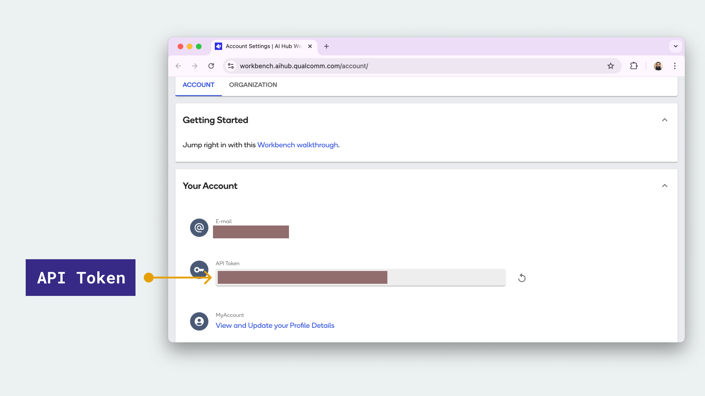
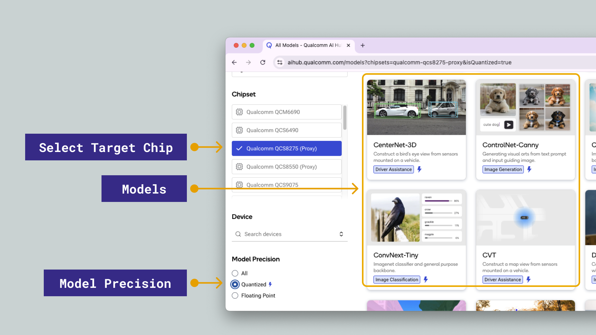
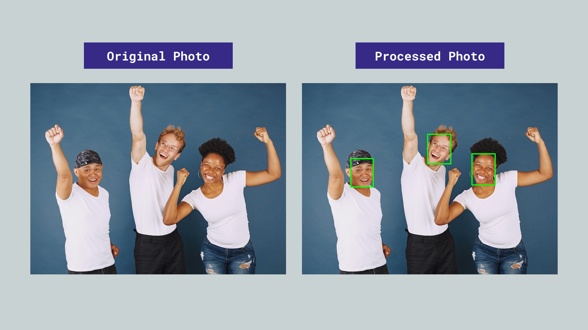

## Overview

[Qualcomm AI Hub](https://aihub.qualcomm.com) is a library of pre-trained, pre-quantized AI models ready to download and run on Dragonwing™ hardware, which the Arduino® VENTUNO™ Q is based on (Qualcomm® Dragonwing™ QCS8275).

Models are available in TFLite (w8a8) and ONNX formats, targeting the NPU directly.

In this guide we will cover:

1. Accessing the VENTUNO Q's shell.
2. Creating a Python virtual environment on the VENTUNO Q.
3. Setting up the Qualcomm AI Hub toolchain on the VENTUNO Q.
4. Finding a compatible model for the VENTUNO Q.
5. Exporting and downloading the compiled model.
6. Running the exported model on the VENTUNO Q's NPU.
7. Running a model's reference demo on the VENTUNO Q.

<Alert type="info">

**Note:** The [QAI Hub Models package](https://pypi.org/project/qai-hub-models/) used in this tutorial takes up ~5-8 GB of disk space. Make sure you have a reliable Internet connection and enough space on your disk before starting this tutorial. For a full list of packages installed, click the link above.

</Alert>

## Hardware & Software Requirements

### Hardware

- [Arduino® VENTUNO™ Q](https://store.arduino.cc/products/ventuno-q)
- [Arduino® USB-C Power Supply (65W)](https://store.arduino.cc/products/usb-c-power-supply-65w)

<Alert type="info">

**Note:** If you are using this board as a Single Board Computer (SBC), you will need a keyboard, mouse & display.

</Alert>

### Software

To access the VENTUNO Q's shell you will need to have either SSH or ADB supported on your local machine (mac/Windows/Linux). You can also set it up as a single board computer and run commands directly on the VENTUNO Q.

Additional software requirements will be covered in the guide.

## Setting up the Environment

All commands in this guide are run **on the VENTUNO Q**. Connect to the board using one of the following methods:

### Shell Access

- **SSH:** `ssh arduino@<device-ip>`
- **ADB:** `adb shell`
- **Directly:** Connect a keyboard, mouse and monitor (the VENTUNO Q runs a full Linux desktop).

Once you have access to the shell we can start running commands on the board.

### Create a Virtual Environment

After accessing your VENTUNO Q's shell, create and activate a Python virtual environment to keep dependencies isolated:

```bash
python3 -m venv .venv
source .venv/bin/activate
```

<Alert type="info">

If activating the environment fails, you may need to manually install `-venv` by running `sudo apt install python3.12-venv`.

</Alert>

The `(venv)` prefix in your prompt confirms the environment is active. Activate it again each session before running any of the commands below.

### Install the AI Hub Python Package

With the virtual environment active, install the `qai-hub-models` package:

```bash
pip install qai-hub-models
```

<Alert type="info">

**Note:** This is a large package and requires a fast & stable Internet connection to download.

</Alert>

Some models require additional dependencies. Check the model's README for any extras, e.g.:

```bash
pip install "qai-hub-models[yolov7]"
```

### Qualcomm® ID and API Token

AI Hub Workbench requires a Qualcomm® ID to compile and profile models on cloud-hosted hardware.

1. [Create a Qualcomm® ID](https://myaccount.qualcomm.com/signup) if you don't already have one.
2. Log in to [Qualcomm® AI Hub Workbench](https://workbench.aihub.qualcomm.com/).
3. Go to your [account page](https://workbench.aihub.qualcomm.com/account/) and copy your **API token**.



Configure the CLI with your token:

```bash
qai-hub configure --api_token YOUR_API_TOKEN
```

<Alert type="info">

API token access is only needed for compilation and profiling on AI Hub Workbench. You can browse the model library and download pre-compiled models from [aihub.qualcomm.com/models](https://aihub.qualcomm.com/models) without an account.

</Alert>

## Find a Compatible Model

Go to the [AI Hub model list](https://aihub.qualcomm.com/models) and filter by:

- **Chipset:** `Qualcomm QCS8275 (Proxy)`
- **Model precision:** `Quantized`



Quantized models give the best throughput and the smallest file size on the NPU, so they are the recommended starting point. Unquantized models are not excluded, though: the NPU cannot execute FP32, but the runtime converts a floating-point graph to FP16 when it loads it, so a `float` export still runs on the NPU. See the [NPU guide](/tutorials/ventuno-q/npu-guide/) for the trade-off between the two.

Each model page links to a reference repository that shows the exact input preprocessing and output postprocessing code. Read it carefully — details like input resolution, color channel order, and normalization values are easy to get wrong.

### Export and Compile the Model

With your API token configured, use the export script to compile a model for the VENTUNO Q and download it directly to the VENTUNO Q:

```bash
# Example: export YOLOv7 for the VENTUNO Q (TFLite runtime)
python3 -m qai_hub_models.models.yolov7.export --target-runtime tflite --device "Arduino VENTUNO Q"
```

AI Hub lists the VENTUNO Q itself as a target device, so you can compile against the real board rather than a proxy chipset. To see every device that matches this silicon, run:

```bash
qai-hub list-devices | grep -i 8275
```

This returns two usable targets:

| Device | OS | Notes |
| ------ | -- | ----- |
| `Arduino VENTUNO Q` | Ubuntu 24.04 | The actual board — use this one. |
| `QCS8275 (Proxy)` | Android 14 | A proxy for the same chipset, useful as a fallback. |

The export script will:

1. Compile the model for the QCS8275 target and chosen runtime.
2. Quantize the model if applicable.
3. Profile it on a real cloud-hosted device.
4. Download the compiled model (`.tflite`) to your working directory on the VENTUNO Q.

When the job completes, the script prints a profiling summary from the cloud device and saves the model. For the YOLOv7 example above, the artifacts land in `export-out/yolov7-tflite-float/`, and the summary reports how the graph was distributed across the board's processors:

```text
Device                          : Arduino VENTUNO Q (UBUNTU 24.04)
Runtime                         : TFLITE
Estimated inference time (ms)   : 10.8
Compute Unit(s)                 : npu (201 ops) gpu (0 ops) cpu (0 ops)
```

All 201 operations were placed on the NPU, which is what you want to see before moving to the next step.

<Alert type="info">

**Note:** Not every model in the AI Hub library can be re-exported from source. Some fail with `Model cannot be published: no release assets available` — the `face_det_lite` model used later in this tutorial is currently one of them, which is why the export example above uses YOLOv7. This only affects `export`; the already-compiled asset can still be downloaded with `qai-hub-models fetch <model> --runtime tflite --precision w8a8`, which is how the [Face Detection](/tutorials/ventuno-q/face-detection) tutorial obtains it.

</Alert>

## Running the Exported Model on the NPU

The export step gives you a `.tflite` file that is already compiled for this board. To execute it on the Hexagon™ NPU, you load it through LiteRT with the QNN HTP delegate.

### Install the Qualcomm AI Runtime

The delegate library is provided by the **Qualcomm® AI Runtime (QAIRT)**, which is not installed by default and is not pulled in by any `pip` package. Install it from the board's apt repositories:

```bash
sudo apt update
sudo apt install qairt-libs qairt-dsp-binaries
```

Verify that the delegate is present before continuing:

```bash
ls /usr/lib/libQnnTFLiteDelegate.so
```

### Run the Model

Install LiteRT into your virtual environment:

```bash
pip install ai-edge-litert==1.3.0
```

<Alert type="note">

**Important:** The version matters. `qai-hub-models`, installed earlier in this tutorial, depends on `ai-edge-litert>=2.0.2` and will already have pulled in a 2.x release, so the command above is a deliberate downgrade. Version 2.x does not work with the QNN HTP delegate — it rejects every convolution with `Failed to validate op ... Conv2d`, silently falls back to the CPU, and runs slower than plain CPU execution because of the added delegation overhead. Confirm the version before continuing:

</Alert>

```bash
pip show ai-edge-litert | grep Version   # must report 1.3.0
```

<Alert type="info">

**Note:** `pip` prints a line beginning with `ERROR:` reporting that `qai-hub-models` requires a newer `ai-edge-litert`. The downgrade still succeeds, and `qai-hub-models fetch` keeps working afterwards, so this message can be ignored.

</Alert>

Then create `benchmark.py`, which loads the exported model and times it with and without the NPU delegate:

```python
import sys, time, numpy as np
from ai_edge_litert.interpreter import Interpreter, load_delegate

MODEL = "export-out/yolov7-tflite-float/yolov7.tflite"
use_npu = "--use-npu" in sys.argv

if use_npu:
    delegate = load_delegate("libQnnTFLiteDelegate.so", options={"backend_type": "htp"})
    interpreter = Interpreter(model_path=MODEL, experimental_delegates=[delegate])
else:
    interpreter = Interpreter(model_path=MODEL)

interpreter.allocate_tensors()
input_details = interpreter.get_input_details()[0]

sample = np.zeros(input_details["shape"], dtype=input_details["dtype"])
interpreter.set_tensor(input_details["index"], sample)
interpreter.invoke()  # warm-up pass

runs = 20
start = time.perf_counter()
for _ in range(runs):
    interpreter.invoke()
elapsed = (time.perf_counter() - start) / runs * 1000

print("Mode: %s" % ("NPU" if use_npu else "CPU"))
print("Average latency: %.2f ms" % elapsed)
```

Run it on the CPU first, then on the NPU:

```bash
python3 benchmark.py
python3 benchmark.py --use-npu
```

On a VENTUNO Q running Ubuntu 24.04, this produces:

| Mode | Average latency | Speedup |
| ---- | --------------- | ------- |
| CPU  | 440.42 ms       | —       |
| NPU  | 12.60 ms        | ~35x    |

The measured NPU figure is close to the 10.8 ms that AI Hub estimated during export, which is a good sign that the graph is running the way the profiler predicted.

<Alert type="info">

**Note:** The first NPU run takes noticeably longer than later ones. The delegate has to prepare and finalize the graph for the Hexagon™ hardware before the first inference, which is why the script above performs a warm-up pass before timing.

</Alert>

## Running a Model's Reference Demo

Besides running an exported model yourself, `qai-hub-models` ships a reference demo for each model. These are useful for checking that a model behaves as expected, and for seeing the exact preprocessing and postprocessing a model needs.

<Alert type="info">

**Note:** These demos run the model's original PyTorch weights on the CPU, not on the NPU. The `--quantize w8a8` flag simulates the numerics of the quantized model, but it does not dispatch the graph to the Hexagon™ hardware. The demo's `--eval-mode on-device` option runs on a cloud-hosted device through AI Hub Workbench rather than on your board. To use the NPU on the VENTUNO Q itself, follow [Running the Exported Model on the NPU](#running-the-exported-model-on-the-npu) above.

</Alert>

### Face Detection Example

The [Lightweight Face Detection](https://aihub.qualcomm.com/iot/models/face_det_lite) model is a good example to start off with.

For this example, there are two ways to test it out:

- Running it on a static image, covered below.
- Running it on a live feed from a camera, covered in the [Real-Time Face Detection](/tutorials/ventuno-q/face-detection) tutorial (this requires a USB camera connected to the USB-A connector on the VENTUNO Q).

To set it up, follow the steps below:

1. Activate the virtual environment we created earlier by running `source .venv/bin/activate`
2. Install the dependencies `pip3 install numpy setuptools Cython shapely ai-edge-litert==1.3.0 Pillow`
3. Install the Face Detection Model by running `pip3 install --no-build-isolation "qai-hub-models[face-det-lite]"`
4. Create a directory for the example, e.g. `face-detection-example` and navigate to the directory using `cd`.

#### Static Image Example

Running the static image example is straightforward. First, we need a sample image to run the model on. This can be downloaded directly through the following command:

```bash
wget https://cdn.edgeimpulse.com/qc-ai-docs/example-images/three-people-640-480.jpg
```

Then, to run the inference, run:

```bash
python3 -m qai_hub_models.models.face_det_lite.demo --quantize w8a8 --image ./three-people-640-480.jpg --output-dir out/
```

The first run downloads the model weights (~3.6 MB), so allow a little extra time before inference starts.

This will run the inference on the image, and draw boxes around the faces of the people in the image. Two files are written to `out/`:

- `FaceDetLitebNet_output.png` — the input image with bounding boxes drawn on the detected faces.
- `FaceDetLitebNet_output.json` — the raw detection results.

The image is saved and can be retrieved either via `adb pull /path/to/image` or `scp arduino@<ipaddress>:/path/to/image /path/to/local/folder`. The image path *should* be `~/face-detection-example/out/FaceDetLitebNet_output.png`.

The result should be like the image below:



## Live Feed Examples

Models can also run on a live feed from a USB camera, with results drawn on-screen in real time. Each of the following walkthroughs — including the full script, model download steps, and a CPU vs. NPU comparison — has been moved to its own tutorial:

- **[Real-Time Face Detection on the VENTUNO Q](/tutorials/ventuno-q/face-detection)**: live face detection using the `face_det_lite` model.
- **[Real-Time Face Mesh on the VENTUNO Q](/tutorials/ventuno-q/face-mesh)**: live face detection and a 468-point face mesh using the `mediapipe_face` model.
- **[Real-Time Semantic Segmentation on the VENTUNO Q](/tutorials/ventuno-q/segformer-seg)**: live per-pixel scene segmentation using the `segformer_base` model.
