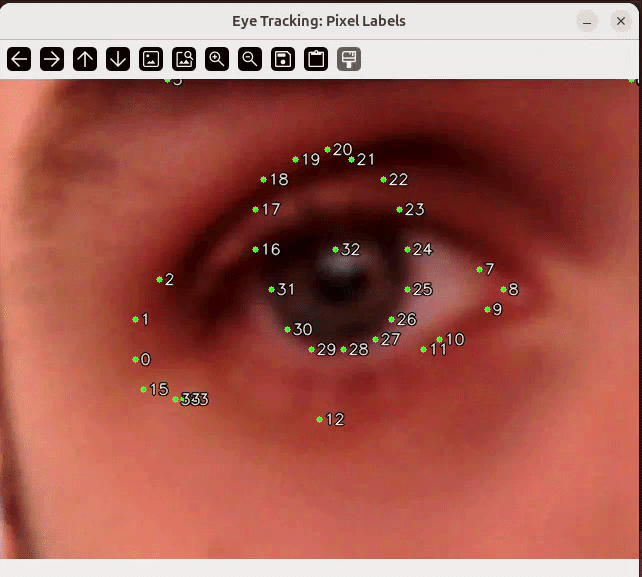

## Overview

The Arduino® VENTUNO™ Q's NPU (Qualcomm® Hexagon™ Tensor Processor) can accelerate inference on ONNX models via [ONNX Runtime](https://onnxruntime.ai/) and the `QNNExecutionProvider`. This guide covers the full workflow: setting up the runtime, obtaining a compatible model from [Qualcomm AI Hub](https://aihub.qualcomm.com), and running inference on the NPU.

In this guide we will cover:

1. Accessing the VENTUNO Q's shell (using `adb` or `ssh`).
2. Creating a Python virtual environment.
3. Installing the specific ONNX Runtime QNN wheel required to run inference on the NPU.
4. Finding and downloading a compatible model from AI Hub.
5. Fixing dynamic input shapes.
6. Running inference on the NPU.

At the end, a complete eye gaze tracking example is provided to demonstrate the full workflow in practice.

## Hardware & Software Requirements

### Hardware

- [Arduino® VENTUNO™ Q](https://store.arduino.cc/products/ventuno-q)
- [Arduino® USB-C Power Supply (65W)](https://store.arduino.cc/products/usb-c-power-supply-65w)

The eye gaze tracking example at the end of this guide additionally needs:

- A USB camera connected to one of the USB-A ports
- A display, keyboard, and mouse connected to the board (the script opens a live window on-screen)

<Alert type="info">**Note:** The setup and inference sections up to that example need only the board and a power supply, and can be followed entirely over SSH or ADB.</Alert>

### Software

To access the VENTUNO Q, you will need SSH or ADB available on your machine. All other dependencies will be installed directly on the board.

## Accessing the Board Shell

All commands in this guide are run **on the VENTUNO Q**. Connect to the board using one of the following methods:

- **SSH:** `ssh arduino@<device-ip>`
- **ADB:** `adb shell`
- **Directly:** Connect a keyboard, mouse, and monitor (the VENTUNO Q runs a full Linux desktop).

## Setting Up the Python Environment

### 1. Create a Virtual Environment

Create and activate a Python virtual environment to keep dependencies isolated:

```bash
python3 -m venv .venv
source .venv/bin/activate
```

The `(.venv)` prefix in your prompt confirms the environment is active. Run the activate command again at the start of each new session.

<Alert type="note">**Important:** The virtual environment is not optional here. The VENTUNO Q's system Python is [externally managed](https://peps.python.org/pep-0668/) (PEP 668), so `pip install` outside a virtual environment is refused outright.</Alert>

### 2. Install ONNX Runtime with QNN Support

The QNN-enabled build of ONNX Runtime is not a plain `pip install onnxruntime` — getting it onto the board takes three steps: install the AI Hub models package, remove the CPU-only ONNX Runtime it pulls in, then install the QNN wheel in its place (to enable it to run on the NPU).

#### Step 1: Install the AI Hub Models Package

```bash
pip install qai-hub-models
```

<Alert type="info">**Note:** This will install a large collection of libraries, which will take up a lot of memory.</Alert>

#### Step 2: Remove the Default ONNX Runtime Package

`qai-hub-models` pulls in a CPU-only `onnxruntime` package as a dependency, which conflicts with the QNN-enabled build installed in the next step (both provide the same `onnxruntime` module, so only one can be installed at a time). Remove it, and pin `onnx` to the version the QNN wheel expects:

```bash
pip uninstall -y onnxruntime
pip install onnx==1.18.0
```

#### Step 3: Install the ONNX Runtime QNN Wheel

Download and install the pre-compiled wheel directly on the VENTUNO Q. This is a specific build that works on the VENTUNO Q:

```bash
wget https://cdn.edgeimpulse.com/qc-ai-docs/wheels/onnxruntime_qnn-1.23.0-cp312-cp312-linux_aarch64.whl
pip install onnxruntime_qnn-*-linux_aarch64.whl
```

This wheel includes the `QNNExecutionProvider`, which routes inference through the Hexagon™ Tensor Processor (NPU) rather than the CPU.

## Finding and Downloading a Model

The quickest way to get a model is the `qai-hub-models` CLI, which downloads a pre-compiled asset straight onto the board and unpacks it for you:

```bash
qai-hub-models fetch eyegaze --runtime onnx --precision w8a16 --output-dir models/
```

Pre-compiled ONNX assets are **device agnostic**, so no chipset or device argument is needed — the `--chipset` and `--device` flags only apply to runtimes that are ahead-of-time compiled for one target. To see the download URL without fetching it, add `--url-only`.

The command extracts an `.onnx` graph next to a separate `.data` file holding the weights:

```text
models/eyegaze-onnx-w8a16/eyegaze.onnx
models/eyegaze-onnx-w8a16/eyegaze.data
models/eyegaze-onnx-w8a16/metadata.json
```

`metadata.json` is worth reading before you write any preprocessing code — it lists each input and output with its exact shape, dtype, and quantization scale and zero point.

<Alert type="info">**Note:** `fetch` downloads a published asset and works even for models whose `export` path is unavailable. If `python -m qai_hub_models.models.<model>.export` fails with `Model cannot be published: no release assets available`, try `fetch` before assuming the model is unusable.</Alert>

You can also browse the [AI Hub model list](https://aihub.qualcomm.com/models) and use the **Download Model** button, choosing **ONNX Runtime** as the runtime and `w8a8` or `w8a16` as the precision. The chipset filter on the website controls which models display performance data for a given silicon — it does not restrict which files you can download, so a model may be downloadable even when no QCS8275 figures are listed.

If you downloaded the model on your host computer instead of directly on the board, transfer it over with `scp` or `adb push` before continuing.

In the example further below, we use the [EyeGaze](https://aihub.qualcomm.com/iot/models/eyegaze) model.

<Alert type="info">**Note:** Quantized models give the best throughput and the smallest download, so `w8a8` or `w8a16` is the recommended choice. A `float` model is not excluded, though — the NPU cannot execute FP32, but the QNN backend converts the graph to FP16 when it loads it, so a float ONNX model still runs on the NPU. See the [NPU guide](/tutorials/ventuno-q/npu-guide) for the trade-off.</Alert>

## Fixing Dynamic Input Shapes

Models exported from AI Hub may have dynamic input dimensions. The `QNNExecutionProvider` requires **fixed** shapes to target the NPU. If your model has dynamic inputs, convert it before running:

```bash
python3 -m onnxruntime.tools.make_dynamic_shape_fixed \
    model.onnx \
    model_fixed.onnx \
    --input_name "<input_name>" \
    --input_shape <shape>
```

Replace `<input_name>` and `<shape>` with the values from your model. You can inspect a model's inputs by running:

```python
import onnxruntime as ort
sess = ort.InferenceSession("model.onnx")
for inp in sess.get_inputs():
    print(inp.name, inp.shape)
```

<Alert type="info">**Note:** Some AI Hub models, including the EyeGaze model used below, already export with static input shapes. Running the fixed-shape conversion on them is still worth doing, since it also inlines the model's external weight data (normally stored in a separate `.data` file next to the `.onnx` file) into a single self-contained `.onnx` file.</Alert>

## Running Inference on the NPU

Load the model with the `QNNExecutionProvider` targeting the `"htp"` backend (HTP stands for Hexagon™ Tensor Processor):

```python
import onnxruntime as ort
import os

MODEL_PATH = "model_fixed.onnx"
QNN_LIB = "/usr/lib/libQnnHtp.so"
os.environ["LD_LIBRARY_PATH"] = "/usr/lib:" + os.environ.get("LD_LIBRARY_PATH", "")

so = ort.SessionOptions()
so.add_session_config_entry("session.disable_cpu_ep_fallback", "0")

providers = [("QNNExecutionProvider", {"backend_type": "htp", "library_path": QNN_LIB})]
sess = ort.InferenceSession(MODEL_PATH, sess_options=so, providers=providers)

input_name = sess.get_inputs()[0].name
output = sess.run(None, {input_name: input_data})
```

Replace `input_data` with a NumPy array matching the model's expected input shape and dtype. Check the model page on AI Hub for the exact preprocessing steps (input resolution, normalization, channel order, and quantization range).

<Alert type="info">**Note:** Calling `sess.get_providers()` after loading the session typically reports both `QNNExecutionProvider` and `CPUExecutionProvider`. This is expected — a small number of shape-related operations always fall back to the CPU, while the rest of the graph still runs on the NPU.</Alert>

### Three Steps Every Inference Follows

Regardless of the model, NPU inference always follows the same pattern:

1. **Preprocess** — resize, normalize, and format the input to match what the model expects (dtype, shape, value range).
2. **Inference** — pass the input through the session using `QNNExecutionProvider` with `"htp"` as the backend.
3. **Postprocess** — interpret the raw output tensor (bounding boxes, class scores, keypoints, etc.) into application-level results.

## Example: Eye Gaze Tracking

The following example uses a quantized eye landmark detection model from AI Hub (`w8a16`, ONNX runtime) to track gaze direction in real time from a USB camera feed.

For this example, you will need the following hardware:

- USB camera connected to the USB-A port on the VENTUNO Q
- A display, keyboard, and mouse (the script opens a window on-screen)

### 1. Install the Additional Dependencies

On top of the ONNX Runtime QNN wheel already installed, the script only needs OpenCV and NumPy:

```bash
pip install opencv-python numpy
```

### 2. Download and Fix the Model

Download the eye landmark model:

```bash
qai-hub-models fetch eyegaze --runtime onnx --precision w8a16 --output-dir models/
```

Then run the fixed-shape conversion on it. The EyeGaze model already has a static `[1, 96, 160]` input (batch × height × width), so this step is really being used to inline `eyegaze.data` into a single self-contained file:

```bash
python3 -m onnxruntime.tools.make_dynamic_shape_fixed \
    models/eyegaze-onnx-w8a16/eyegaze.onnx \
    model_fixed.onnx \
    --input_name "image" \
    --input_shape 1,96,160
```

`model_fixed.onnx` now contains both the graph and the weights, so it is around 10.8 MB where the original `.onnx` was only 824 KB. It is self-contained: you can move it on its own, without the `.data` file beside it.

### 3. Create the Script

```bash
touch gaze_tracker.py
```

Add the following code to `gaze_tracker.py`:

```python
import numpy as np
import cv2
import onnxruntime as ort
import os
import argparse
import time  # Added for timing

# 1. SETUP ARGUMENT PARSER
parser = argparse.ArgumentParser(description="Inference script with NPU toggle.")
parser.add_argument("--use-npu", action="store_true", help="Enable Qualcomm NPU (QNN HTP)")
parser.add_argument("--camera-index", type=int, default=None,
                     help="Force a specific /dev/videoN index instead of auto-detecting the USB camera")
args = parser.parse_args()

# --- CONFIGURATION ---
MODEL_PATH = "model_fixed.onnx"
QNN_LIB = "/usr/lib/libQnnHtp.so"

# 2. SELECT EXECUTION PROVIDER BASED ON FLAG
so = ort.SessionOptions()

if args.use_npu:
    print("--- Initializing NPU (QNN HTP) ---")
    os.environ["LD_LIBRARY_PATH"] = "/usr/lib:" + os.environ.get("LD_LIBRARY_PATH", "")
    so.add_session_config_entry("session.disable_cpu_ep_fallback", "0")
    providers = [
        ("QNNExecutionProvider", {
            "backend_type": "htp",
            "library_path": QNN_LIB
        })
    ]
    mode_text = "NPU Mode"
else:
    print("--- Initializing standard CPU ---")
    providers = ["CPUExecutionProvider"]
    mode_text = "CPU Mode"

# Initialize Session
try:
    sess = ort.InferenceSession(MODEL_PATH, sess_options=so, providers=providers)
except Exception as e:
    print(f"Failed to initialize session with providers {providers}. Error: {e}")
    exit(1)

input_name = sess.get_inputs()[0].name

# Global variable to store latency for display
current_latency = 0.0

def get_landmarks(eye_crop):
    global current_latency
    resized = cv2.resize(eye_crop, (160, 96))
    gray = cv2.cvtColor(resized, cv2.COLOR_BGR2GRAY)
    
    input_data = (gray.astype(np.float32) * (65535.0 / 255.0)).astype(np.uint16)
    input_tensor = np.expand_dims(input_data, axis=0)
    
    # --- TIMER START ---
    start = time.perf_counter()
    outputs = sess.run(None, {input_name: input_tensor})
    end = time.perf_counter()
    # --- TIMER END ---
    
    current_latency = (end - start) * 1000  # Convert to ms
    
    heatmaps = outputs[0][0, 2, :34, :, :] 
    points = []
    for i in range(34):
        _, _, _, max_loc = cv2.minMaxLoc(heatmaps[i])
        points.append((max_loc[0] * 2, max_loc[1] * 2))
    return np.array(points)

def find_camera_index(max_index=5):
    """/dev/video0 on the VENTUNO Q is the CSI/ISP control node, not a USB webcam,
    so it opens successfully but never returns a frame. Probe indices in order and
    stop at the first one that actually returns a frame."""
    for index in range(max_index + 1):
        cap = cv2.VideoCapture(index)
        if cap.isOpened():
            ret, _ = cap.read()
            if ret:
                return index, cap
        cap.release()
    return None, None

# --- MAIN LOOP ---
if args.camera_index is not None:
    cap = cv2.VideoCapture(args.camera_index)
else:
    found_index, cap = find_camera_index()
    if cap is not None:
        print(f"Using camera index {found_index}")

if cap is None or not cap.isOpened():
    print("No usable camera found. Pass --camera-index N to force one (check `ls /dev/video*`).")
    exit(1)

DISPLAY_W, DISPLAY_H = 800, 600

while True:
    ret, frame = cap.read()
    if not ret: break

    h, w = frame.shape[:2]
    x1, y1 = (w//2 - DISPLAY_W//2), (h//2 - DISPLAY_H//2)
    y_start, y_end = max(0, y1), min(h, y1 + DISPLAY_H)
    x_start, x_end = max(0, x1), min(w, x1 + DISPLAY_W)
    eye_zone = frame[y_start:y_end, x_start:x_end].copy()
    
    landmarks = get_landmarks(eye_zone)

    if landmarks is not None:
        actual_h, actual_w = eye_zone.shape[:2]
        sx, sy = actual_w / 160.0, actual_h / 96.0

        for i, pt in enumerate(landmarks):
            lx, ly = int(pt[0] * sx), int(pt[1] * sy)
            cv2.circle(eye_zone, (lx, ly), 3, (0, 255, 0), -1)
            label = str(i)
            cv2.putText(eye_zone, label, (lx + 5, ly + 5), 
                        cv2.FONT_HERSHEY_SIMPLEX, 0.5, (0, 0, 0), 2, cv2.LINE_AA)
            cv2.putText(eye_zone, label, (lx + 5, ly + 5), 
                        cv2.FONT_HERSHEY_SIMPLEX, 0.5, (255, 255, 255), 1, cv2.LINE_AA)

    # --- LATENCY OVERLAY ---
    # Draw a black box for the background
    cv2.rectangle(eye_zone, (0, 0), (250, 80), (0, 0, 0), -1)
    # Draw the Mode and Latency
    cv2.putText(eye_zone, mode_text, (10, 30), 
                cv2.FONT_HERSHEY_SIMPLEX, 0.8, (255, 255, 255), 2)
    cv2.putText(eye_zone, f"{current_latency:.2f} ms", (10, 65), 
                cv2.FONT_HERSHEY_SIMPLEX, 0.8, (0, 255, 0), 2)

    cv2.imshow("Eye Tracking", eye_zone)
    if cv2.waitKey(1) & 0xFF == ord('q'): break

cap.release()
cv2.destroyAllWindows()
```

<Alert type="info">**Note:** The VENTUNO Q exposes several `/dev/videoN` nodes, and not all of them are cameras — the hardware video codec registers its own nodes, and a USB webcam usually claims two indices (only the first delivers frames). Which index your camera lands on depends on what else is attached, so it is not safe to assume `cv2.VideoCapture(0)`. The script above probes indices in order and picks the first one that actually returns a frame; pass `--camera-index N` to force a specific device. Run `ls /dev/video*` to see what is available, and `cat /sys/class/video4linux/video0/name` to check what a given node is.</Alert>

### 4. Run the Demo

If you are running the script from a remote host (`adb` or `ssh`), first allow it to render on the display:

```bash
xhost +
export DISPLAY=:0   # replace 0 with your display number
```

To find your display number instead of assuming `0`, run `ls /tmp/.X11-unix/` on the board and use the number after the `X` (for example, `X1` means `DISPLAY=:1`).

The script accepts a `--use-npu` flag, so you can compare the CPU and NPU execution providers:

```bash
python3 gaze_tracker.py            # runs on the CPU
python3 gaze_tracker.py --use-npu  # runs on the Hexagon NPU (QNN)
```

On a VENTUNO Q running Ubuntu 24.04, this model averages about **23 ms** per inference on the NPU versus about **190 ms** on the CPU — roughly an **8x** speedup. Exact figures vary with the camera frame rate and what else the board is doing.

### Result

After running the example, you should see a frame pop up in the display connected to the VENTUNO Q. This frame displays the camera feed with a large number of dots (34 to be exact). Moving the camera closer to your eye, you can see that it will form around your eye, and track your iris/pupil movement.

Dot number 32 follows your pupil, and as you move your eye it will follow. This example was designed to demonstrate how the model works and does not have any triggers when the values changes, but provides a good visual reference that can be expanded upon.

<Alert type="info">**Note:** The script derives the landmark positions from the `heatmaps` output, but the model returns two more outputs that are useful if you want to build on this example. `landmarks` (shape `[1, 34, 2]`) contains the same 34 points already decoded, as `(y, x)` pairs in heatmap coordinates — dequantize them, swap the axes and multiply by two to get the same pixel positions the script draws. `gaze_pitchyaw` (shape `[1, 2]`) gives the gaze direction directly, in radians, which is what you would act on to detect where someone is looking rather than only where their eye is. Both are quantized `uint16`; `metadata.json` in the downloaded model folder lists the scale and zero point for each.</Alert>



<Alert type="info">**Note:** This example was run with a low-quality USB web camera, with different results expected upon using a higher quality camera.</Alert> The script's center-crop targets an 800 × 600 region; a low-resolution webcam (for example 640 × 480) is smaller than that in both dimensions, so the crop becomes a no-op and you see the full, uncropped frame instead — this is why moving the camera close to your eye is necessary to fill the frame on cameras like this. A higher-resolution camera will show the crop actually taking effect.
