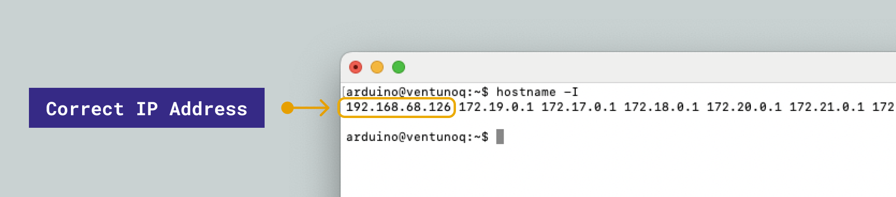
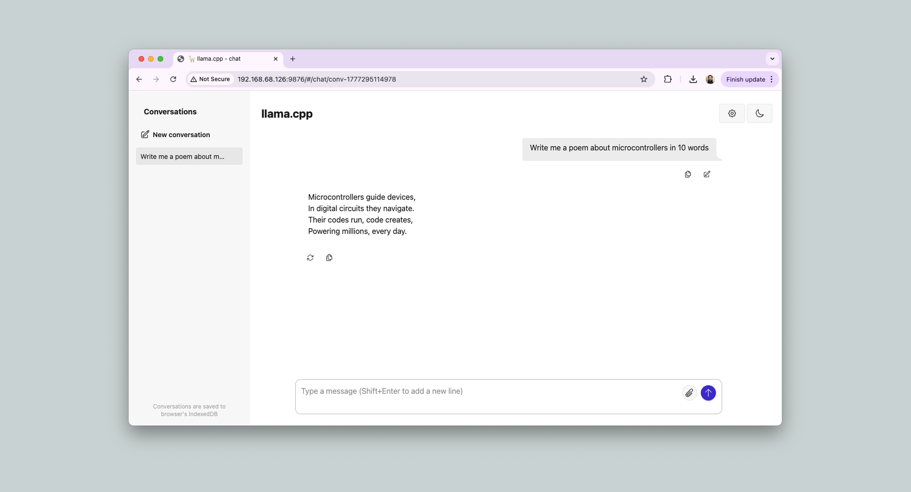
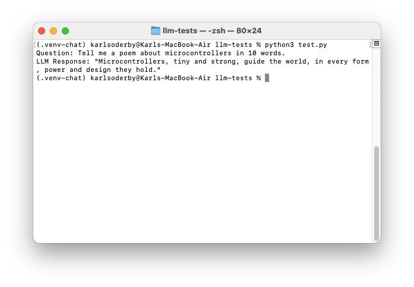

## Overview

The Arduino® VENTUNO™ Q is powered by the Qualcomm® Dragonwing™ QCS8275, which features an Adreno™ GPU with OpenCL 3.0 support. This makes it possible to run Large Language Models (LLMs) directly on the board using [llama.cpp](https://github.com/ggml-org/llama.cpp).

Models running under llama.cpp execute on the **GPU**. The board's Hexagon™ NPU can also run the same model, through Qualcomm's GenieX runtime, and does so about three times faster — both routes are covered here. See [Choosing Between the GPU and the NPU](#choosing-between-the-gpu-and-the-npu) for how they differ.

In this tutorial you will learn how to:

1. Install OpenCL dependencies on the VENTUNO Q.
2. Build llama.cpp with the OpenCL backend.
3. Download and quantize an LLM.
4. Serve the model and access it from a browser on your local network.
5. Run the same model on the Hexagon™ NPU with GenieX, and compare the two.

<Alert type="info">

**Note:** The [Qwen2.5-1.5B model](https://huggingface.co/Qwen/Qwen2.5-1.5B-Instruct-GGUF/blob/main/qwen2.5-1.5b-instruct-fp16.gguf) used in this tutorial is about 3.6 GB, and the quantized copy you create from it needs additional space. Make sure you have enough free disk space before starting this tutorial.

</Alert>

### Choosing Between the GPU and the NPU

There are three ways to run an LLM on this board. Two of them work today, and they reach different processors.

| Route | Runs on | Status on the VENTUNO Q |
| ----- | ------- | ----------------------- |
| **llama.cpp with the OpenCL backend** | Adreno™ GPU | Supported. This is the path built from source below. |
| **[GenieX](https://github.com/qualcomm/GenieX)** | Hexagon™ NPU | Supported, and considerably faster. Covered in [Running LLMs and VLMs on the NPU with GenieX](/tutorials/ventuno-q/geniex). |
| **llama.cpp with the `ggml-hexagon` backend** | Hexagon™ NPU | Experimental, and newer than the llama.cpp revision pinned here. Requires the Hexagon™ SDK to build. |

This tutorial builds llama.cpp from source against the GPU because doing so shows how the pieces fit together, and because the resulting binaries (`llama-cli`, `llama-quantize`, `llama-server`) are useful in their own right — `llama-quantize` in particular is what produces the model file used in both routes.

If your goal is simply the fastest local LLM on this board, **the NPU route through GenieX is the better choice**, and it is covered at the end of this tutorial using the exact same model file.

### llama.cpp on the NPU

llama.cpp has its own Hexagon™ NPU backend, [`ggml-hexagon`](https://github.com/ggml-org/llama.cpp/tree/master/ggml/src/ggml-hexagon), which builds HTP skeletons for architectures v73, v75, v79 and v81. The VENTUNO Q's DSP is **HTP v75** (visible as `/usr/lib/dsp/cdsp/libQnnHtpV75Skel.so` on the board), so the hardware is supported, and models served this way run at around 25 tokens per second.

The backend is not part of the llama.cpp revision pinned in this guide, and its authors mark it experimental. Building it requires the Qualcomm® Hexagon™ SDK in addition to the tools installed below. If you want to try it, see llama.cpp's [Snapdragon backend documentation](https://github.com/ggml-org/llama.cpp/tree/master/docs/backend/snapdragon) and its [Linux build instructions](https://github.com/ggml-org/llama.cpp/blob/master/docs/backend/snapdragon/linux.md). It currently supports `Q4_0` models, which is the quantization this guide produces, so the model file carries over.

For the NPU without the SDK, [GenieX](/tutorials/ventuno-q/geniex) reaches the same hardware at the same speed with a single install command.

## Hardware & Software Requirements

### Hardware Requirements

- [Arduino® VENTUNO™ Q](https://store.arduino.cc/products/ventuno-q) (1x)
- [Arduino® USB-C® Power Supply (65W)](https://store.arduino.cc/products/usb-c-power-supply-65w), or a 7–24 V DC supply on the barrel jack
- [Arduino® USB Type-C® Cable (2in1)](https://store.arduino.cc/products/usb-cable2in1-type-c) (1x)

<Alert type="warning">

**Important:** Always connect the power supply to the barrel jack **before** connecting a USB-C® cable. Connecting USB-C® first while the board is unpowered may cause the board to crash.

</Alert>

## Accessing the Board Shell

To access the Ubuntu® shell on the VENTUNO Q, use either `adb` or `ssh`.

**Via `adb`** — connect a USB-C® cable between the VENTUNO Q and your computer, then run:

```bash
adb shell
```

**Via `ssh`** — ensure the VENTUNO Q is connected to the same network as your computer, then run:

```bash
ssh arduino@<ip-address>
```

<Alert type="info">

For more alternatives to remotely access your board, please see the [Remote Access](https://docs.arduino.cc/tutorials/uno-q/remote-access/) tutorial.

</Alert>

## Building llama.cpp

### Step 1: Install Build Dependencies

Install the essential build tools:

```bash
sudo apt update
sudo apt install -y cmake ninja-build curl libcurl4-openssl-dev build-essential
```

### Step 2: Install OpenCL Dependencies

There are two ways to get OpenCL headers and the ICD loader on the VENTUNO Q.

**Option A — Package manager (recommended):**

Install the OpenCL headers and the ICD loader, together with Qualcomm's Adreno™ OpenCL driver:

```bash
sudo apt update
sudo apt install ocl-icd-opencl-dev opencl-headers qcom-adreno-cl1
```

<Alert type="note">

**Important:** `qcom-adreno-cl1` is the Qualcomm® Adreno™ OpenCL user-mode driver, and llama.cpp will not use the GPU without it. The open-source Mesa driver (`mesa-opencl-icd`, also known as `rusticl`) does detect the Adreno™ 623 and will show up in `clinfo`, but it does not expose the OpenCL subgroups extension that llama.cpp's OpenCL backend requires. With only Mesa installed, llama.cpp prints `drop unsupported device` and silently falls back to the CPU.

</Alert>

To verify that OpenCL is detected, install `clinfo`:

```bash
sudo apt install -y clinfo
clinfo | grep -E "Platform Name|Device Name"
```

With the Qualcomm® driver in place you should see the `QUALCOMM Snapdragon(TM)` platform, not just `rusticl`.

**Option B — Build from source (for full control over versions):**

<Alert type="warning">

**Caution:** Option B replaces files that belong to the system. It deletes `/usr/lib/libOpenCL.so` and the entire `/usr/include/CL` directory before symlinking its own copies in their place, which affects every other program on the board that uses OpenCL. Only use it if you specifically need header or loader versions that differ from the packaged ones — Option A is sufficient for building llama.cpp, and leaves the system packages intact.

</Alert>

```bash
mkdir -p ~/dev/llm

# Symlink the OpenCL shared library
sudo rm -f /usr/lib/libOpenCL.so
sudo ln -s /lib/aarch64-linux-gnu/libOpenCL.so.1.0.0 /usr/lib/libOpenCL.so

# OpenCL headers
cd ~/dev/llm
git clone https://github.com/KhronosGroup/OpenCL-Headers
cd OpenCL-Headers
git checkout 5d52989617e7ca7b8bb83d7306525dc9f58cdd46
mkdir -p build && cd build
cmake .. -G Ninja \
    -DBUILD_TESTING=OFF \
    -DOPENCL_HEADERS_BUILD_TESTING=OFF \
    -DOPENCL_HEADERS_BUILD_CXX_TESTS=OFF \
    -DCMAKE_INSTALL_PREFIX="$HOME/dev/llm/opencl"
cmake --build . --target install

# ICD Loader
cd ~/dev/llm
git clone https://github.com/KhronosGroup/OpenCL-ICD-Loader
cd OpenCL-ICD-Loader
git checkout 02134b05bdff750217bf0c4c11a9b13b63957b04
mkdir -p build && cd build
cmake .. -G Ninja \
    -DCMAKE_BUILD_TYPE=Release \
    -DCMAKE_PREFIX_PATH="$HOME/dev/llm/opencl" \
    -DCMAKE_INSTALL_PREFIX="$HOME/dev/llm/opencl"
cmake --build . --target install

# Symlink OpenCL headers for the compiler to find them
sudo rm -rf /usr/include/CL
sudo ln -s ~/dev/llm/opencl/include/CL/ /usr/include/CL
```

### Step 3: Build llama.cpp

Clone and build llama.cpp with the OpenCL backend enabled:

```bash
cd ~/dev/llm

# Clone the repository
git clone https://github.com/ggml-org/llama.cpp
cd llama.cpp

# This commit has been explicitly tested; use main for the latest changes
git checkout f6da8cb86a28f0319b40d9d2a957a26a7d875f8c

# Build
mkdir -p build && cd build
cmake .. -G Ninja \
    -DCMAKE_BUILD_TYPE=Release \
    -DBUILD_SHARED_LIBS=OFF \
    -DGGML_OPENCL=ON
ninja -j$(nproc)
```

### Step 4: Add llama.cpp to PATH

```bash
cd ~/dev/llm/llama.cpp/build/bin

echo "" >> ~/.bash_profile
echo "# Begin llama.cpp" >> ~/.bash_profile
echo "export PATH=\$PATH:$PWD" >> ~/.bash_profile
echo "# End llama.cpp" >> ~/.bash_profile
echo "" >> ~/.bash_profile

# Apply changes to the current session
source ~/.bash_profile
```

Verify the installation:

```bash
llama-cli --version
```

Then confirm that llama.cpp can actually use the GPU:

```bash
llama-cli --list-devices
```

A working setup reports the Qualcomm® platform and keeps the device:

```text
ggml_opencl: selected platform: 'QUALCOMM Snapdragon(TM)'
ggml_opencl: device: 'QUALCOMM Adreno(TM) 623 (OpenCL 3.0 Adreno(TM) 623)'
ggml_opencl: vector subgroup broadcast support: true
```

If you instead see `rusticl` as the platform followed by `drop unsupported device` and an empty device list, the Qualcomm® Adreno™ driver is missing — go back to Step 2 and install `qcom-adreno-cl1`.

## Downloading and Quantizing a Model

To get GPU-accelerated performance, you need **pure Q4_0 quantized** models in **GGUF format**. You can download pre-quantized models or quantize them yourself using `llama-quantize`.

The following example uses [Qwen2.5-1.5B-Instruct](https://huggingface.co/Qwen/Qwen2.5-1.5B-Instruct-GGUF):

```bash
# Download the fp16 base model
wget https://huggingface.co/Qwen/Qwen2.5-1.5B-Instruct-GGUF/resolve/main/qwen2.5-1.5b-instruct-fp16.gguf

# Quantize to pure Q4_0
llama-quantize --pure qwen2.5-1.5b-instruct-fp16.gguf qwen2.5-1.5b-instruct-q4_0-pure.gguf Q4_0
```

<Alert type="info">

**Note:** The same repository also publishes a ready-made `qwen2.5-1.5b-instruct-q4_0.gguf`, but do not use it as a shortcut here. A standard `Q4_0` file keeps some tensors at higher precision, while the `--pure` flag forces every tensor to `Q4_0`, which is what the OpenCL backend needs in order to run the whole model on the GPU. Downloading the fp16 model and quantizing it yourself is the reliable way to get a genuinely pure file.

</Alert>

## Serving the LLM on Your Local Network

`llama-server` starts a web server with a built-in chat interface accessible from any browser on the same network.

**1.** First we need to locate the IP address of your VENTUNO Q:

```bash
hostname -I
```



<Alert type="info">

Running `hostname -I` should reveal the IP address of your board. Make sure it is connected to a Wi-Fi® network.

</Alert>

**2.** Start the server on port `9876`:

```bash
llama-server -m ./qwen2.5-1.5b-instruct-q4_0-pure.gguf \
    --no-warmup -b 128 -c 2048 -s 11 -n 128 \
    --host 0.0.0.0 --port 9876
```

You should see output confirming the server is running:

```text
llama server listening at http://0.0.0.0:9876
```

When the model loads, llama.cpp reports how much of it went to the GPU. All layers should be offloaded:

```text
load_tensors: offloading 28 repeating layers to GPU
load_tensors: offloading output layer to GPU
load_tensors: offloaded 29/29 layers to GPU
load_tensors:       OpenCL model buffer size =   828.59 MiB
```

No extra flag is needed for this — llama.cpp offloads the whole model to the Adreno™ GPU by default once it is built with the OpenCL backend. On a VENTUNO Q running Ubuntu 24.04, this model generates at roughly **7.4 tokens per second**.

<Alert type="info">

**Note:** You may see `libOpenCL.so.1: no version information available` printed a few times at startup. This comes from the Qualcomm® driver's symbol versioning and is harmless — check the `offloaded 29/29 layers to GPU` line instead to confirm the GPU is being used.

</Alert>

**3.** On any device connected to the same network, open a browser and navigate to:

```text
http://<ip-address>:9876
```

<Alert type="info">

**Note:** Replace `<ip-address>` with the address found in step 1.

</Alert>

**4.** The built-in chat interface lets you send prompts directly to the model:



### Access Server via Code (Python Example)

We can also query the LLM using a script. In the example below, we are using Python to test it out. Note that you need the `requests` module installed (`pip install requests`).

```python
import requests

# Replace with the IP address of your VENTUNO Q, from step 1 (`hostname -I`)
VENTUNO_Q_IP = "192.168.1.100"

url = f"http://{VENTUNO_Q_IP}:9876/v1/chat/completions"

payload = {
    "messages": [
        {"role": "user", "content": "Tell me a poem about microcontrollers in 10 words."}
    ],
}

response = requests.post(url, headers={ "Content-Type": "application/json" }, json=payload)
print(response.json().get("choices", [{}])[0].get("message", {}).get("content", "No response"))
```

The response should be something akin to:

```text
Microcontrollers, tiny and strong, guide the world, in every form, power and design they hold.
```



## Running the Same Model on the NPU

The `Q4_0` file you just produced is not tied to llama.cpp. **[GenieX](https://github.com/qualcomm/GenieX)**, Qualcomm's on-device generative AI runtime, can load the same file and run it on the Hexagon™ NPU instead of the GPU — about three times faster, and without compiling anything.

Register the file you built and run it:

```bash
mkdir -p ~/dev/llm/qwen25pure
cp ~/dev/llm/qwen2.5-1.5b-instruct-q4_0-pure.gguf ~/dev/llm/qwen25pure/

geniex pull qwen25-pure --model-hub localfs --local-path ~/dev/llm/qwen25pure
geniex infer qualcomm/qwen25-pure:Q4_0 --compute npu --prompt "Say hello in 5 words."
```

Measured on a VENTUNO Q running Ubuntu 24.04, with the same `Q4_0` model file throughout:

| Runtime | Compute unit | Generation speed |
| ------- | ------------ | ---------------- |
| llama.cpp (OpenCL build from this guide) | Adreno™ GPU | 7.4 tok/s |
| GenieX | Adreno™ GPU | 9.2 tok/s |
| GenieX | CPU | 11.4 tok/s |
| GenieX | Hybrid | 13.9 tok/s |
| **GenieX** | **Hexagon™ NPU** | **~25 tok/s** |

For installing GenieX, downloading models from Hugging Face or Qualcomm® AI Hub, and serving an OpenAI-compatible API, see [Running LLMs and VLMs on the NPU with GenieX](/tutorials/ventuno-q/geniex).

## Conclusion

In this tutorial you learned how to:

- Install OpenCL dependencies on the VENTUNO Q using the package manager or by building from source.
- Build llama.cpp with the Adreno™ GPU OpenCL backend.
- Download and quantize an LLM to Q4_0 GGUF format.
- Serve the model with `llama-server` and access the chat interface from a browser on your local network.
- Run the same quantized model on the Hexagon™ NPU with GenieX, at roughly 3x the speed of the GPU path — see [Running LLMs and VLMs on the NPU with GenieX](/tutorials/ventuno-q/geniex).
