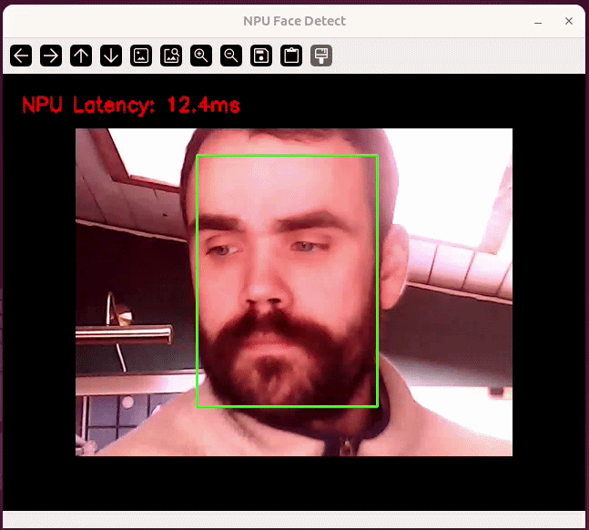

## Overview

In this tutorial you will run a live face detection demo on the Arduino® VENTUNO™ Q, using the [`face_det_lite`](https://aihub.qualcomm.com/iot/models/face_det_lite) (Lightweight Face Detection) model from [Qualcomm® AI Hub](https://aihub.qualcomm.com/). The model is quantized and runs entirely on the Qualcomm® Hexagon™ NPU of the board's Qualcomm® Dragonwing™ QCS8275 processor.

The demo is a single, self-contained Python script (`face_detection_camera.py`) that reads from a USB camera, detects each face frame by frame, and overlays a bounding box around it in real time.

In this guide we will cover:

1. Powering and accessing the VENTUNO Q.
2. Setting up a Python virtual environment.
3. Downloading the model file directly on the board.
4. Running the face detection demo on the CPU and on the NPU.

## Hardware & Software Requirements

### Hardware

- [Arduino® VENTUNO™ Q](https://store.arduino.cc/products/ventuno-q)
- [Arduino® USB-C Power Supply (65W)](https://store.arduino.cc/products/usb-c-power-supply-65w), or a 7–24 V DC supply on the power jack
- USB camera connected to the USB-A port, reachable as `/dev/video0`
- A display, keyboard, and mouse\* connected to the board (the script opens a live window on-screen)

<Alert type="info">**Note:** To use the VENTUNO Q as an SBC, a mouse is not required (but makes it easier).</Alert>

### Software

- `adb` (Android® Platform Tools) or `ssh` available on your host machine
- Python 3.12 (pre-installed on the VENTUNO Q)

<Alert type="warning">The VENTUNO Q must be powered with its power supply **before** connecting a USB-C® cable to a host computer, otherwise the board may crash. The recommended power supply is a minimum of 65 W in the range of 7–24 V.</Alert>

## Accessing the Board Shell

With the board powered from its power jack, you can access the shell (terminal) on the VENTUNO Q using either `adb` or `ssh`.

To connect via `adb`, connect a USB-C® cable between the VENTUNO Q and your computer, then run:

```bash
# Using adb (Android Debug Bridge)
adb shell
```

To connect via `ssh`, ensure the VENTUNO Q is connected to the same network as your computer, then run:

```bash
# Using ssh (Secure Shell)
ssh arduino@<ip-address>
```

If you don't know the board's IP address, connect a keyboard and monitor and run `hostname -I` on the board, or configure Wi-Fi® on the board first with `sudo nmtui`.

<Alert type="info">For more alternatives to remotely access your board, please see the [Remote Access](https://docs.arduino.cc/tutorials/uno-q/remote-access/) tutorial.</Alert>

<Alert type="warning">
**Note:** Because this demo opens a live camera window on-screen, run it from the board's actual desktop session (a physical monitor and keyboard, or a VNC/X11 session into the board). `adb` and `ssh` are still the easiest way to install dependencies and confirm the script runs before switching to the desktop session to watch the camera feed.
</Alert>

## Setting Up the Python Environment

All commands in this section are run **on the VENTUNO Q**.

### 1. Create a Virtual Environment

Create and activate a Python virtual environment to keep dependencies isolated:

```bash
python3 -m venv ~/.venv
source ~/.venv/bin/activate
```

The `(.venv)` prefix in your prompt confirms the environment is active. Run the `source` command again at the start of each new session.

### 2. Install the Dependencies

This demo needs `opencv-python`, `numpy`, and `ai-edge-litert` (which bundles the TFLite interpreter and the QNN HTP delegate loader used for NPU execution):

```bash
pip install ai-edge-litert==1.3.0 opencv-python numpy
```

NPU execution additionally needs the QNN HTP delegate (`libQnnTFLiteDelegate.so`), which is provided by the **Qualcomm® AI Runtime (QAIRT)**. It is not installed by default and is not pulled in by any `pip` package, so install it from the board's apt repositories:

```bash
sudo apt update
sudo apt install qairt-libs qairt-dsp-binaries
```

Confirm the delegate is present before continuing:

```bash
ls /usr/lib/libQnnTFLiteDelegate.so
```

## Downloading the Model File

The demo requires a single model file in addition to the Python script. You can download and prepare it **directly on the board** — no host-side transfer needed:

| File | Description | Source |
| ------------------------------------------------------ | -------------------------------------------- | --------------- |
| `face_det_lite-lightweight-face-detection-w8a8.tflite` | Quantized face detection model, runs on the NPU | Qualcomm AI Hub |

First, create and move into a working directory on the board:

```bash
mkdir -p /home/arduino/face-detection
cd /home/arduino/face-detection
```

The model comes from the [`face_det_lite`](https://aihub.qualcomm.com/iot/models/face_det_lite) model on Qualcomm AI Hub, fetched with the `qai-hub-models` CLI. Install it (a large package, so this may take a while), then fetch the quantized precision:

```bash
pip install qai-hub-models

# Quantized precision -> extracts face_det_lite-tflite-w8a8/
qai-hub-models fetch face_det_lite -r tflite -p w8a8 -o .
```

This extracts a `face_det_lite-tflite-w8a8/` folder containing a single `face_det_lite.tflite`. Unlike a multi-stage model, this is a single-stage model, so there are no extra files to discard. Rename it to match what the script expects:

```bash
cp face_det_lite-tflite-w8a8/face_det_lite.tflite ./face_det_lite-lightweight-face-detection-w8a8.tflite
```

After this step, your `/home/arduino/face-detection` directory should contain `face_det_lite-lightweight-face-detection-w8a8.tflite`.

<Alert type="warning">
**Important:** `qai-hub-models` depends on `ai-edge-litert>=2.0.2`, so installing it **upgrades** the `ai-edge-litert==1.3.0` you installed earlier. Version 2.x does not work with the QNN HTP delegate: the delegate rejects every convolution with `Failed to validate op ... Conv2d`, silently falls back to the CPU, and ends up *slower* than plain CPU execution because of the added delegation overhead. After fetching the model, put version 1.3.0 back:
</Alert>

```bash
pip install ai-edge-litert==1.3.0
```

Confirm you are on the working version before running the demo:

```bash
pip show ai-edge-litert | grep Version   # must report 1.3.0
```

<Alert type="info">**Note:** `pip` prints a line beginning with `ERROR:` reporting that `qai-hub-models` requires a newer `ai-edge-litert`. The downgrade still succeeds, and `qai-hub-models fetch` keeps working afterwards, so this message can be ignored.</Alert>

Alternatively, keep `qai-hub-models` in a separate virtual environment used only for downloading models, and leave the demo environment pinned to `ai-edge-litert==1.3.0`.

## Creating the Script

On the VENTUNO Q, move into the working directory and create the script file:

```bash
cd /home/arduino/face-detection
nano face_detection_camera.py
```

Paste the full script from the [Code Example](#code-example) section below into the editor. In `nano`, save and exit with `Ctrl+X`, then `Y`, then `Enter`.

## Running the Demo

With the virtual environment active and the model file in `/home/arduino/face-detection`, run the demo from the board's desktop session:

```bash
cd /home/arduino/face-detection
source ~/.venv/bin/activate            # if not already active

python3 face_detection_camera.py            # model on the CPU
python3 face_detection_camera.py --use-npu  # model on the Hexagon NPU
```

A window titled **"Face Detect"** opens showing the live camera feed with a **green** bounding box drawn around each detected face. The on-screen overlay reports the model invoke time, the round-trip time (set + invoke + get tensor), and the total per-frame latency. Press **`q`** in the window to quit.

Running on the NPU noticeably lowers the invoke and round-trip latency compared to the CPU.

If you launch the script from a remote host (`adb` or `ssh`), you will first need to allow it to render on the display.

On the board itself (not using `adb` or `ssh`), open a terminal and run the following:

```bash
xhost +
export DISPLAY=:0   # replace 0 with your display number
```

This will enable a remote host to run applications on the display. If you do not do this, when running the script from a remote host, you will see `xcb` related error.



## Code Example

The full, self-contained demo is shown below. Save it as `face_detection_camera.py` in the working directory alongside the model file.

```python
import numpy as np
import cv2
from ai_edge_litert.interpreter import Interpreter, load_delegate
import time
import sys

# --- SETUP ---
MODEL_PATH = 'face_det_lite-lightweight-face-detection-w8a8.tflite'
use_npu = True if len(sys.argv) >= 2 and sys.argv[1] == '--use-npu' else False

experimental_delegates = []
if use_npu:
    experimental_delegates = [load_delegate("libQnnTFLiteDelegate.so", options={"backend_type": "htp"})]

interpreter = Interpreter(model_path=MODEL_PATH, experimental_delegates=experimental_delegates)
interpreter.allocate_tensors()

input_details  = interpreter.get_input_details()
output_details = interpreter.get_output_details()

_, M_H, M_W, M_C = input_details[0]['shape']
input_dtype = input_details[0]['dtype']
in_scale = float(input_details[0]['quantization'][0])
in_zp    = int(input_details[0]['quantization'][1])   # int() cast matches official code

# Confirm how many outputs the delegate sees
print(f"Number of outputs: {len(output_details)}")

# Pre-allocate reusable buffers
_canvas       = np.zeros((M_H, M_W, 3), dtype=np.uint8)
_input_tensor = np.zeros((1, M_H, M_W, 1), dtype=input_dtype)

# --- NPU WARMUP ---
if use_npu:
    print("Warming up NPU...")
    for _ in range(3):
        interpreter.set_tensor(input_details[0]['index'], _input_tensor)
        interpreter.invoke()
    print("Warmup done.")

class BBox:
    def __init__(self, xyrb, score, landmark=None):
        self.score    = score
        self.landmark = landmark
        x, y, r, b   = xyrb
        self.x = min(x, r)
        self.y = min(y, b)
        self.r = max(x, r)
        self.b = max(y, b)

    @property
    def width(self):  return self.r - self.x + 1
    @property
    def height(self): return self.b - self.y + 1
    @property
    def box(self):    return [self.x, self.y, self.r, self.b]
    @property
    def xywh(self):   return [self.x, self.y, self.width, self.height]

def get_iou(boxA, boxB):
    xA = max(boxA[0], boxB[0]);  yA = max(boxA[1], boxB[1])
    xB = min(boxA[2], boxB[2]);  yB = min(boxA[3], boxB[3])
    inter = max(0, xB - xA + 1) * max(0, yB - yA + 1)
    aA = (boxA[2]-boxA[0]+1) * (boxA[3]-boxA[1]+1)
    aB = (boxB[2]-boxB[0]+1) * (boxB[3]-boxB[1]+1)
    return inter / float(aA + aB - inter + 1e-6)

def nms(objs, iou_thresh=0.5):
    if not objs:
        return []
    objs  = sorted(objs, key=lambda o: o.score, reverse=True)
    flags = [0] * len(objs)
    keep  = []
    for i, obj in enumerate(objs):
        if flags[i]:
            continue
        keep.append(obj)
        for j in range(i + 1, len(objs)):
            if flags[j] == 0 and get_iou(np.array(obj.box), np.array(objs[j].box)) > iou_thresh:
                flags[j] = 1
    return keep

def detect(hm, box, landmark=None, threshold=0.4, nms_iou=0.3, stride=8):
    """
    Postprocessing matching the official AI Hub implementation:
      - sigmoid heatmap
      - 3x3 max-pool local-maxima suppression
      - top-2000 candidates
      - NMS
    """
    hm_hw = 1.0 / (1.0 + np.exp(-np.clip(hm[..., 0].astype(np.float32), -15, 15)))

    # 3x3 max-pool, same padding — mirrors torch F.max_pool2d(kernel=3, stride=1, padding=1)
    H, W = hm_hw.shape
    xpad = np.pad(hm_hw, 1, mode='constant', constant_values=-np.inf)
    s0, s1 = xpad.strides
    windows  = np.lib.stride_tricks.as_strided(
        xpad, shape=(H, W, 3, 3), strides=(s0, s1, s0, s1), writeable=False
    )
    hm_pool  = windows.max(axis=(2, 3))

    candidate_scores = np.where(hm_hw >= hm_pool, hm_hw, 0.0).ravel()

    k = min(int((hm_hw >= hm_pool).sum()), 2000)
    if k == 0:
        return []
    idx_part = np.argpartition(-candidate_scores, k - 1)[:k]
    order    = np.argsort(-candidate_scores[idx_part])
    flat_idx = idx_part[order]
    scores_k = candidate_scores[flat_idx]

    ys = (flat_idx // W).astype(np.int32)
    xs = (flat_idx %  W).astype(np.int32)

    objs = []
    for cx, cy, score in zip(xs, ys, scores_k):
        if score < threshold:
            break  # sorted desc — safe to break early

        x, y, r, b = box[cy, cx].astype(np.float32)
        xyrb = [
            int((cx - x) * stride),
            int((cy - y) * stride),
            int((cx + r) * stride),
            int((cy + b) * stride),
        ]

        lm = None
        if landmark is not None:
            x5y5  = landmark[cy, cx].astype(np.float32)
            x5y5 += np.array([cx]*5 + [cy]*5, dtype=np.float32)
            x5y5 *= float(stride)
            lm = list(zip(x5y5[:5].tolist(), x5y5[5:].tolist()))

        objs.append(BBox(xyrb, float(score), lm))

    return nms(objs, nms_iou)

def preprocess_frame(frame):
    """
    Letterbox + blue-channel extraction + quantization.
    Matches official AI Hub preprocessing exactly.
    """
    h, w = frame.shape[:2]
    f_scale = min(M_W / w, M_H / h) * 0.75
    nw, nh  = int(w * f_scale), int(h * f_scale)

    scaled = cv2.resize(frame, (nw, nh))
    _canvas[:] = 0
    dx, dy = (M_W - nw) // 2, (M_H - nh) // 2
    _canvas[dy:dy+nh, dx:dx+nw] = scaled

    # Blue channel 0..1  (official code: img_array / 255.0, then take index [:,:,:,-1])
    blue = _canvas[:, :, 0].astype(np.float32) / 255.0

    # Quantize using int(zp) — matches official load_image_litert exactly
    if in_scale != 0.0:
        q = np.rint(blue / in_scale) + in_zp
        if input_dtype == np.uint8:
            _input_tensor[0, :, :, 0] = np.clip(q, 0, 255).astype(np.uint8)
        else:
            _input_tensor[0, :, :, 0] = np.clip(q, -128, 127).astype(np.int8)
    else:
        _input_tensor[0, :, :, 0] = blue

    return _canvas.copy()

def process_frame(frame):
    debug_canvas = preprocess_frame(frame)

    t_set = time.perf_counter()
    interpreter.set_tensor(input_details[0]['index'], _input_tensor)
    set_ms = (time.perf_counter() - t_set) * 1000

    t_invoke = time.perf_counter()
    interpreter.invoke()
    invoke_ms = (time.perf_counter() - t_invoke) * 1000

    t_get = time.perf_counter()

    def dequant(idx):
        s, z = output_details[idx]['quantization']
        return (interpreter.get_tensor(output_details[idx]['index']).astype(np.float32) - float(z)) * float(s)

    hm  = dequant(0)[0]
    box = dequant(1)[0]
    lm  = dequant(2)[0] if len(output_details) >= 3 else None
    get_ms = (time.perf_counter() - t_get) * 1000

    infer_ms   = set_ms + invoke_ms + get_ms
    detections = detect(hm, box, lm, threshold=0.4, nms_iou=0.3, stride=8)
    return detections, debug_canvas, infer_ms, invoke_ms

# --- MAIN LOOP ---
mode = "NPU" if use_npu else "CPU"
cap  = cv2.VideoCapture(0)

while True:
    ret, frame = cap.read()
    if not ret:
        break

    t_start = time.perf_counter()
    detections, debug_canvas, infer_ms, invoke_ms = process_frame(frame)
    total_ms = (time.perf_counter() - t_start) * 1000

    for det in detections:
        x, y, w, h = det.xywh
        cv2.rectangle(debug_canvas, (x, y), (x+w, y+h), (0, 255, 0), 2)
        if det.landmark:
            for (lx, ly) in det.landmark:
                cv2.circle(debug_canvas, (int(lx), int(ly)), 2, (0, 128, 255), -1)

    label = (f"{mode}  invoke={invoke_ms:.1f}ms  "
             f"round-trip={infer_ms:.1f}ms  total={total_ms:.1f}ms")
    cv2.putText(debug_canvas, label, (20, 40),
                cv2.FONT_HERSHEY_SIMPLEX, 0.6, (0, 0, 255), 2)

    cv2.imshow('Face Detect', debug_canvas)
    if cv2.waitKey(1) & 0xFF == ord('q'):
        break

cap.release()
cv2.destroyAllWindows()
```

## How It Works

- **Preprocessing.** Each frame is resized (preserving aspect ratio) and centered on a padded canvas, then only the **blue channel** is extracted and quantized to the model's input tensor — this matches the exact preprocessing used by the official AI Hub reference implementation.
- **Postprocessing.** The model outputs a heatmap and a box-regression map. The heatmap is passed through a sigmoid, then a 3×3 max-pool identifies local maxima (mirroring `torch.nn.functional.max_pool2d` with `kernel=3, stride=1, padding=1`). The top 2000 candidates by score are decoded into bounding boxes using the box map and the model's stride, filtered by a score threshold, and reduced with non-maximum suppression (NMS) to produce one box per face.
- **Latency breakdown.** The on-screen overlay separates `invoke` (the NPU/CPU inference call itself) from `round-trip` (set tensor + invoke + get tensor), so you can see how much of the total frame time is the model call versus tensor marshaling.

## Conclusion

In this tutorial you set up the VENTUNO Q, downloaded the `face_det_lite` model file, and ran a self-contained Python script that performs live face detection, accelerated on the Qualcomm® Hexagon™ NPU. From here you can build on the detected bounding boxes — for example to crop and feed faces into a downstream model, count people in frame, or trigger events on detection — directly on the Dragonwing™ QCS8275 processor.
