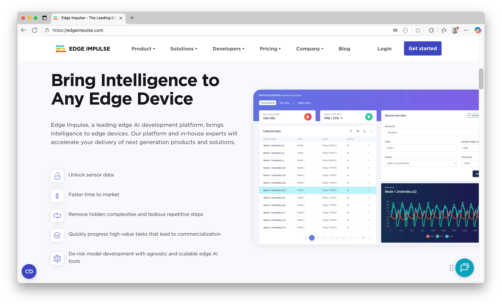
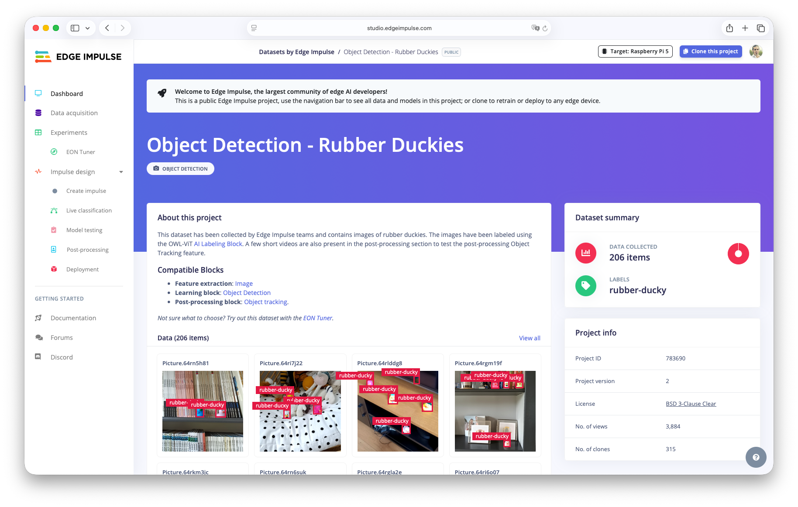
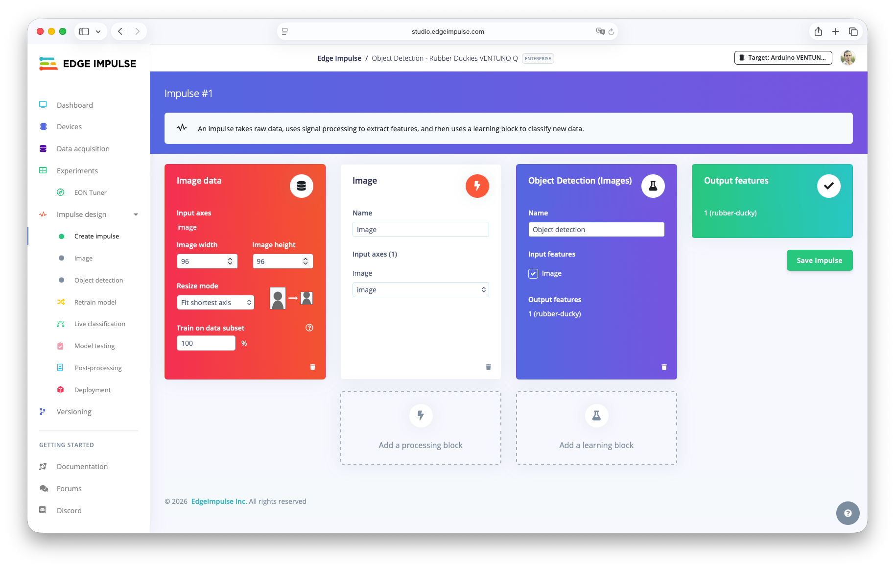
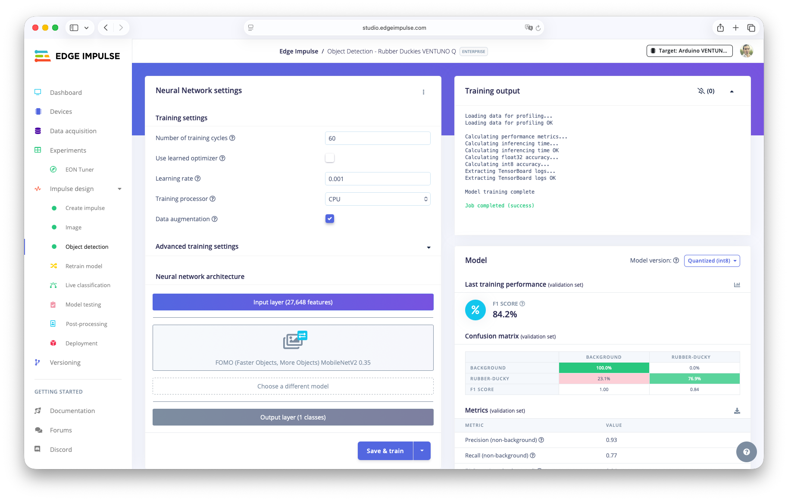
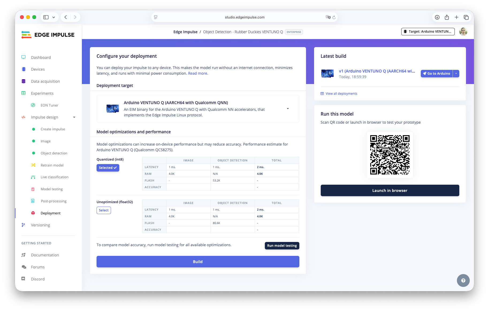

## Overview

[Edge Impulse®](https://edgeimp.com/ei) is the easiest way to build new edge AI models for Qualcomm® Dragonwing™ devices such as the Arduino® VENTUNO™ Q. It’s an end-to-end platform that helps you build datasets, train models, and run models with full hardware acceleration. It supports building AI models using audio, image and other sensor data, or bringing your own model in a variety of formats.

Edge Impulse is deeply integrated into Arduino App Lab's Bricks (object detection, image classification, keyword spotting, anomaly detection and others) under the hood. In addition, you can easily run an Edge Impulse model standalone on the Linux® side using the Python® or C++ SDK, with no Bricks involved.

By the end of this tutorial you will know how to:

* Train a custom machine learning model for object detection in Edge Impulse Studio.
* Deploy it with Bricks in Arduino App Lab.
* Deploy it without Bricks as a standalone `.eim` on Linux via the Edge Impulse Python and C++ SDKs.
* Understand how this small model becomes the cheap, always-on stage of a model cascade that escalates to a VLM/LLM.



### Which AI Tool Should I Use?

To run a pre-trained LLM or VLM locally you can use other technologies that you can find in the docs. If you need to train a custom machine learning model based on neural networks for vision, audio, or sensors from your own data, use Edge Impulse.

The LLM, VLM and Edge Impulse models are not mutually exclusive. The most interesting VENTUNO Q applications cascade small models (trained with Edge Impulse) as a fast gate in front of a heavier AI model. See Going further: model cascading.

## Hardware and Software Requirements

### Hardware

* [Arduino® VENTUNO™ Q](https://store.arduino.cc/products/ventuno-q)
* USB Camera
* [Arduino® USB-C Power Supply (65W)](https://store.arduino.cc/products/usb-c-power-supply-65w)
* A few rubber ducks (or any objects you want to detect)

### Software

* A free [Edge Impulse Studio](https://studio.edgeimpulse.com/signup?utm_medium=community&utm_source=community&utm_campaign=51891547-ventunoq-launch&utm_content=signup-link-ventunoq-docs) account
* Arduino App Lab
* An Arduino account (**IMPORTANT**: use the same email address as your Edge Impulse Studio account)

## How Edge Impulse Runs On The VENTUNO Q

Edge Impulse packages your trained impulse (signal processing + learning + optional anomaly blocks) into a single native binary called an .eim ("Edge Impulse Model"). The .eim is compiled for the board's `aarch64` architecture and can target the Qualcomm Hexagon™ NPU for acceleration. It runs inference natively and exposes a simple interface that any application can call.

There are two ways to consume that model on the VENTUNO Q:

* **With Bricks** (Arduino App Lab): An Arduino App Lab Brick such as `video_object_detection` loads the .eim, handles the camera pipeline, and delivers results to your Python code via callbacks. This is the fastest way to a working, GUI-managed application.
* **Without Bricks** (standalone): You run the .eim AI model directly on the Linux side with the Edge Impulse Python or C++ SDK, giving you full control over the pipeline and letting you embed inference into any Linux program.

## Train a Custom AI Model

To start building with Edge Impulse:

### Step 1: Get a Dataset

The quickest way to start is to clone a public Edge Impulse project. We can use the [Object Detection Rubber Ducks project](https://studio.edgeimpulse.com/public/783690/latest?utm_medium=live_event&utm_source=conference&utm_campaign=38650271-talent_arena_2026&utm_content=workshops), a small object detection dataset (using FOMO) that is perfect for a first end-to-end run.

* Sign in to [Edge Impulse Studio](https://studio.edgeimpulse.com/signup?utm_medium=community&utm_source=community&utm_campaign=51891547-ventunoq-launch&utm_content=signup-link-ventunoq-docs).
* Open the public project: Object Detection Rubber Duckies.
* Click Clone this project (top-right), then Clone project in the dialog. The dataset and a working impulse are copied into your account.



#### Prefer to Build Your Own Dataset?

You can capture images directly from your mobile device, your computer or the VENTUNO Q's camera with the Edge Impulse CLI (edge-impulse-linux) and label them in the Edge Impulse Studio. [Read more here](https://docs.edgeimpulse.com/studio/projects/devices) to connect your device to collect your own dataset.

### Step 2: Set the Target and Train

* Open `Create impulse`: The processing block is Image and the learning block is `Object Detection (Images)` using FOMO (Faster Objects, More Objects) with MobileNetV2 0.35. Click `Save impulse`.



* Open the Image block. Save parameters and then Generate features.

* Open the Object Detection block and click Train.



When training finishes you will see the confusion matrix and the on-device performance estimate. Select on the top-right as a target hardware the VENTUNO Q. FOMO reports detections as centroids (a point and label per object) rather than full bounding boxes. This keeps it extremely fast and small, ideal for an always-on gate. FOMO is intentionally tiny; expect single-digit millisecond inference with a very small memory footprint, which leaves almost all of the board's resources free for a heavier second stage.

## Deploy with Arduino App Lab (Bricks)

In this section the Edge Impulse model will be loaded by an Arduino App Lab Brick. We start from the built-in **Detect Objects on Camera** example, which already uses the `video_object_detection` and `web_ui` Bricks, and create a copy to swap in our custom model.

### App Lab Deployment

* In Edge Impulse Studio Deployment section, select `Arduino VENTUNO Q` as the deployment target and click `Build`. When the build finishes, click `Go to Arduino`.



* In the Arduino App Lab, open the `Detect Objects on Camera` example and click `Copy and edit app` to make an editable copy.

* Select the `Video Object Detection Brick` and open the AI models tab. Your model appears in the list; click `Download`.

If your model is not listed yet, click `Train New AI` model from this tab to jump straight into Edge Impulse Studio for this Brick. Remember that you need to use the same email for your Arduino and Edge Impulse accounts.

* Open Brick Configuration, select your custom model, and click Save. App Lab writes the model into your app's app.yaml for you.

* Click Run. Open a browser at `http://<your-board-ip-address>:7000` to see the live detections, and watch the Python console for labels and confidence scores.

### Bricks and Models Available

Each Arduino App Lab Brick has its own model variable, so the same technique works for other modalities:

| Brick | Model variable |
|-------|----------------|
| video_object_detection | EI_V_OBJ_DETECTION_MODEL |
| object_detection | EI_OBJ_DETECTION_MODEL |
| image_classification | EI_CLASSIFICATION_MODEL |
| audio_classification | EI_AUDIO_CLASSIFICATION_MODEL |
| keyword_spotting | EI_KEYWORD_SPOTTING_MODEL |
| motion_detection | EI_MOTION_DETECTION_MODEL |
| visual_anomaly_detection | EI_V_ANOMALY_DETECTION_MODEL |

You can read more in the [Arduino Bricks documentation](https://docs.arduino.cc/software/app-lab/bricks/about-bricks/).

## Deploy Without Bricks (Standalone Linux)

Sometimes you do not want to use the Arduino App Lab runtime at all. You just want to embed Edge Impulse inference into your own Linux program. Edge Impulse ships open-source SDKs for this case. Here the model is a plain .eim you run yourself.

### Build the .EIM for the Right Target

In Edge Impulse Studio Deployment, choose the deployment target that matches how you will run it, then Build:

* `Linux (AARCH64)` runs inference on the VENTUNO Q's MPU.
* `Linux (AARCH64 with Qualcomm QNN)` runs inference to the Qualcomm Hexagon NPU for maximum performance. Choose this to accelerate on the VENTUNO Q.

### Edge Impulse Linux CLI

The fastest sanity check needs no code. Install the [Edge Impulse for Linux CLI](https://docs.edgeimpulse.com/hardware/boards/arduino-ventuno-q#installing-edge-impulse-dependencies), then let the runner download and execute your model against the camera.

To run your model with the Edge Impulse Linux CLI, run from the terminal or SSH session on your VENTUNO Q board:

```bash
edge-impulse-linux-runner
```

This will automatically build and download your model, and run it on the NPU (quantized models only). Or, to manually download the EIM file, search for “Linux (AARCH64 with Qualcomm QNN)” in the Deployment page in your Edge Impulse project.

### Run the Custom AI Model From the Python or C++ SDKs

The Edge Impulse Linux Python SDK lets you call the `.eim` from your own script, which is perfect for running inference in a larger Linux application.

On the other hand, for the lowest latency and a fully self-contained binary, compile inference into your own C++ application.

For more information, see the [Edge Impulse Linux Python SDK](https://docs.edgeimpulse.com/tools/libraries/sdks/inference/linux/python) and the [Edge Impulse Linux C++ SDK](https://docs.edgeimpulse.com/tools/libraries/sdks/inference/linux/cpp).

## Going Further

### Bring Your Own Model

Edge Impulse also lets you bring your own model (BYOM) in SavedModel, ONNX, TFLite, LiteRT or scikit-learn format. Models deployed through BYOM are fully supported on Dragonwing platforms, with NPU acceleration for quantized models. See [Edge Impulse Bring Your Own Model](https://docs.edgeimpulse.com/studio/projects/dashboard/byom) documentation.

### Model Cascading

A tiny Edge Impulse AI model is the ideal first stage of a cascade. It runs continuously at millisecond cost and only escalates interesting frames to an expensive model. On the VENTUNO Q that second stage can be a local VLM or LLM from elsewhere in this section:

* Use your FOMO detector as an always-on gate. When it flags an object, crop the image and hand it to a VLM to verify and describe it which also filters the small model's false positives.
* Use a keyword-spotting model to wake an LLM only when a phrase is heard, instead of transcribing continuously.

This pattern combines a “cheap” Edge Impulse model with an “expensive” VLM/LLM, letting the VENTUNO Q's NPU deliver rich, contextual AI without burning power on every frame.

Find here [an example of model cascade](https://github.com/edgeimpulse/example-llm-model-cascade-object-tracking) from object tracking to LLM.

## Conclusion

In this AI workflow tutorial you trained a custom AI model in Edge Impulse Studio and ran it on the VENTUNO Q in two ways: as an App Lab Brick and standalone on Linux with the Python and C++ SDKs. From here you can collect your own dataset, target other modalities (audio, motion, anomaly), or wire the model into a cascade that escalates to a VLM or LLM.

## Troubleshooting

However you deployed it, confirm the model behaves and performs as expected:

* Confirm the labels. On the first run, print one detection payload and match your application logic to the exact label strings the model emits (casing matters).
* Watch confidence. Point the camera at your ducks and check that confidence is high on true objects and low elsewhere.
* Improve iteratively. Add more varied images (angles, lighting, backgrounds) in the Studio, retrain, and redeploy. Because a cascade's second stage can verify the first, you can afford to ship a lighter gate than if this model had to be right on its own.
