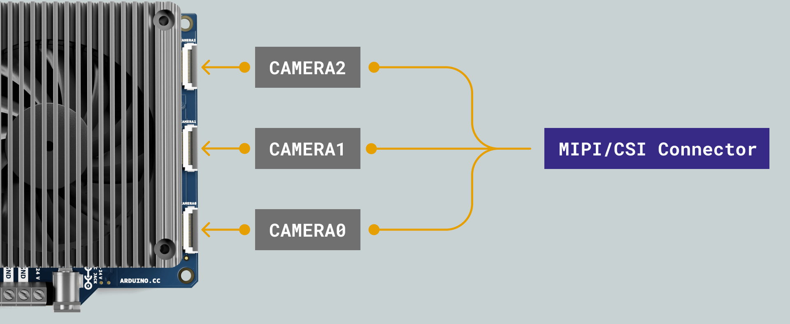
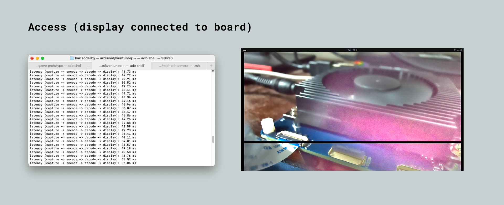
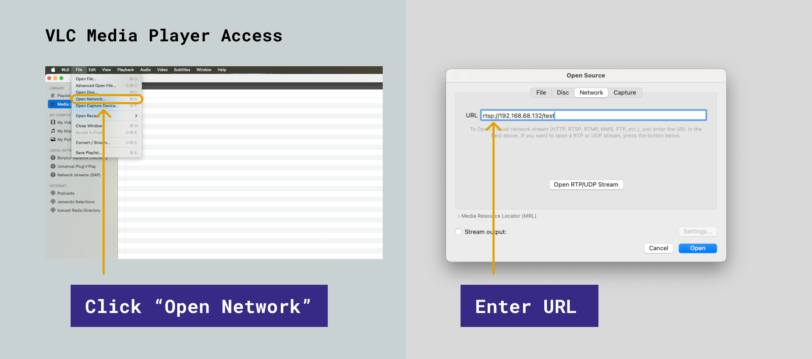
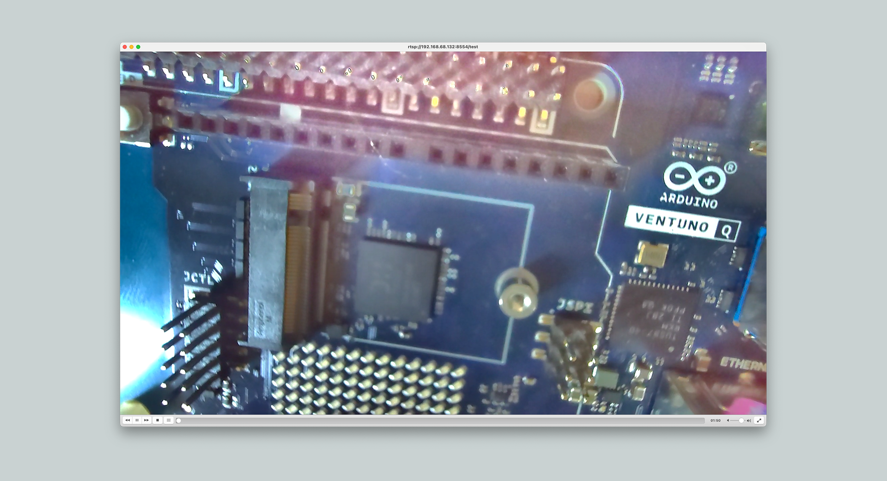
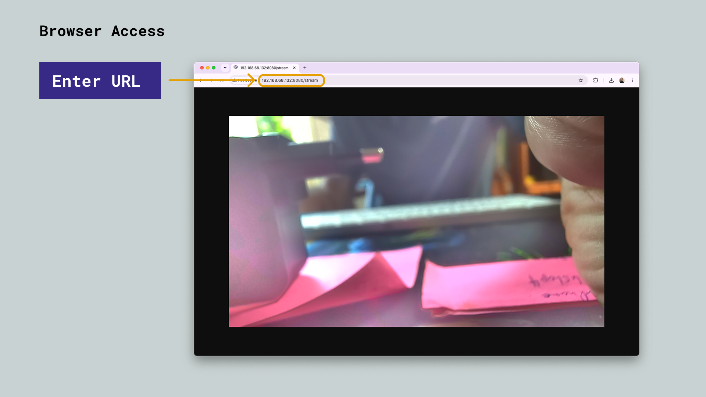

## Overview

This guide covers how to connect, detect and stream video from a **MIPI-CSI camera module** on the Arduino® VENTUNO™ Q. The board features three dedicated camera connectors driven by the Qualcomm® Dragonwing™ QCS8275's built-in image signal processor (ISP), enabling multi-camera edge AI applications directly on the board.



<Alert type="info">

**Note:** Currently, only the IMX577 camera module is supported.

</Alert>

The camera hardware is managed by a single background service, `cam-server` (the QMMF, Qualcomm Multimedia Framework, camera daemon), which every capture pipeline in this guide talks to as a client. Three ready-to-use Python scripts are provided further down to cover the most common ways of viewing the feed:

| Script | Output | View with | Quality / efficiency |
| ------ | ------ | --------- | --------------------- |
| `camera_test.py` | Local display connected to the VENTUNO Q | Nothing extra, the video appears in a window on the board itself | Hardware H264 round-trip (encode + decode), best for measuring local pipeline latency |
| `camera_rtsp_server.py` | RTSP stream over the network | VLC, `ffplay`, or any RTSP-capable player | Best, hardware H264 at low bandwidth |
| `camera_mjpeg_server.py` | HTTP MJPEG stream over the network | Any web browser, plain URL or `` tag | Simplest client, but higher bandwidth (a full JPEG per frame) |

<Alert type="info">

**Note:** Only one of these scripts (or any other camera client) can run at a time, `cam-server` serves a single active capture session against the hardware. Stop one before starting another.

</Alert>

## Goals

- Learn about the three onboard MIPI CSI-2 camera connectors.
- Install the GStreamer plugins required for hardware-accelerated camera capture.
- Detect a connected camera module from the board's shell.
- Record a video stream to a file.
- Stream the camera feed locally to a display connected to the VENTUNO Q.
- Stream the camera feed over the network to VLC (or another RTSP player).
- Stream the camera feed over the network to a web browser (MJPEG).

## Hardware & Software Requirements

### Hardware Requirements

- [Arduino® VENTUNO™ Q](https://store.arduino.cc/products/ventuno-q) (1x)
- [Arduino® USB-C Power Supply (65W)](https://store.arduino.cc/products/usb-c-power-supply-65w) (1x)
- MIPI-CSI camera module based on the IMX577 sensor, such as the [Arducam IMX577 Mini](https://www.arducam.com/arducam-imx577-mini-camera-module-for-qualcomm-rb3g2.html) (1x)
- HDMI display + cable (only required for the [Local Display Stream](#local-display-stream) section)
- A second computer or phone on the same network as the VENTUNO Q (only required for the [VLC Stream](#vlc-stream-rtsp) and [Browser Stream](#browser-stream-mjpeg) sections)

### Software Requirements

- [Arduino App Lab](https://www.arduino.cc/en/software/#app-lab-section)
- [VLC media player](https://www.videolan.org/vlc/) (only required for the [VLC Stream](#vlc-stream-rtsp) section), or another RTSP-capable player such as `ffplay`
- A web browser (only required for the [Browser Stream](#browser-stream-mjpeg) section)

## Hardware Overview

The VENTUNO Q features **three dedicated MIPI CSI-2 camera connectors** (CAMERA0, CAMERA1, CAMERA2), each driven by the Qualcomm® Spectra™ 692 ISP inside the Dragonwing™ QCS8275. This allows simultaneous connection of up to three independent cameras for multi-camera edge AI applications such as stereo vision, 360° capture, or multi-angle object detection.

Each connector is a **22-pin FPC connector** (TF31-22S-0.5SH, 0.5 mm pitch) carrying a full **4-lane MIPI CSI-2** interface, an I²C control bus, one GPIO control line, and a 3.3 V power rail. ESD protection is provided on all high-speed data lanes (RCLAMP0524TCT) and on the power and I²C lines (DF2B7ASL,L3F).

| Connector | Label   | Interface         | Control                | Power |
| --------- | ------- | ----------------- | ---------------------- | ----- |
| J3_1      | CAMERA2 | MIPI CSI-2 4-lane | I²C4 + 1× GPIO (3.3 V) | 3.3 V |
| J3_3      | CAMERA1 | MIPI CSI-2 4-lane | I²C2 + 1× GPIO (3.3 V) | 3.3 V |
| J3_2      | CAMERA0 | MIPI CSI-2 4-lane | I²C0 + 1× GPIO (3.3 V) | 3.3 V |

The GPIO line on each connector (Pin 17) is typically used for camera reset and power-enable control. The I²C bus (SCL/SDA, 3.3 V) is used to configure the camera sensor registers.

## Accessing the Board Shell

To follow the steps in this guide, you need to access the VENTUNO Q's shell. This can be done using `ssh`, `adb`, or by opening a terminal directly on the board in [Single Board Computer (SBC) mode](/tutorials/ventuno-q/user-manual/#single-board-computer-sbc-mode).

To connect via `adb`, connect a USB-C® cable between the VENTUNO Q and your computer, then run:

```bash
adb shell
```

To connect via `ssh`, ensure the VENTUNO Q is connected to the same network as your computer, then run:

```bash
ssh arduino@<ip-address>
```

<Alert type="info">

For more alternatives to remotely access your board, please see the [VENTUNO Q User Manual](/tutorials/ventuno-q/user-manual/#access-via-ssh-or-adb-terminal).

</Alert>

## Connect the Camera Module

<Alert type="warning">

**Warning:** Make sure the VENTUNO Q is powered OFF when connecting a camera module to one of the CSI connectors.

</Alert>

Connect your IMX577-based camera module to any of the three CAMERA connectors (CAMERA0, CAMERA1 or CAMERA2), making sure the flex cable's contacts face the correct direction as indicated by the connector's latch. Once connected, power on the board.

## Install GStreamer

To use a camera connected via MIPI-CSI, we need to install a specific version of `gstreamer`, more specifically `gstreamer1.0-plugins-qcom`.

Open a shell on your board (as described [above](#accessing-the-board-shell)), and install the package:

```bash
sudo apt update
sudo apt upgrade -y
sudo apt install gstreamer1.0-plugins-qcom -y
```

Reboot the board after the installation:

```bash
sudo reboot
```

## Detect the Camera

Once the board has rebooted, open a new shell and run the following command to check whether the camera sensor was detected during boot:

```bash
sudo dmesg | grep Probe
```

You should see something akin to:

```bash
[   28.182686] CAM_INFO: CAM-SENSOR: cam_sensor_driver_cmd: 1250: Probe failed for cmk_imx577 slot:23, slave_addr:0x34, sensor_id:0x577
[   28.213671] CAM_INFO: CAM-SENSOR: cam_sensor_driver_cmd: 1250: Probe failed for cmk_imx577 slot:24, slave_addr:0x34, sensor_id:0x577
[   28.231128] CAM_INFO: CAM-SENSOR: cam_sensor_driver_cmd: 1250: Probe failed for cmk_imx577 slot:25, slave_addr:0x34, sensor_id:0x577
[   28.268640] CAM_INFO: CAM-SENSOR: cam_sensor_driver_cmd: 1290: Probe success for cmk_imx577 slot:26,slave_addr:0x34,sensor_id:0x577
[   28.688703] CAM_INFO: CAM-SENSOR: cam_sensor_driver_cmd: 1250: Probe failed for cmk_imx577 slot:27, slave_addr:0x34, sensor_id:0x577
```

Look for the `Probe success` line (in this case, the 4th entry). This means the camera is identified and is working.

<Alert type="note">

The `Probe failed` lines are expected. The kernel scans several sensor driver slots before finding the one that matches your connected camera, only the `Probe success` line confirms a working connection.

</Alert>

## Capture a Video Recording

To test the camrea, we can record a video stream sample, and save it locally.

Run the following command, which will start a recording. End the recording with `CTRL + C`. The video file will be found in the same directory the command was run from (or in a different location if specified with the `location` flag).

```bash
gst-launch-1.0 -e qtiqmmfsrc camera=0 name=camsrc video_0::type=preview ! video/x-raw,format=NV12_Q08C,width=3840,height=2160,framerate=30/1,interlace-mode=progressive,colorimetry=bt601 ! queue ! v4l2h264enc capture-io-mode=4 output-io-mode=5 ! h264parse ! mp4mux ! queue ! filesink location=capture.mp4
```

<Alert type="info">

The `camera=0` parameter selects CAMERA0. Use `camera=1` or `camera=2` to record from CAMERA1 or CAMERA2 instead.

</Alert>

To view the recording on your local machine, simply pull it from where the video was saved using either `adb pull /home/arduino/<recording>` or via `scp pull arduino@<board-ip>:/home/arduino/<recording>`

## Local Display Stream

To preview the camera feed on a display connected directly to the VENTUNO Q (over HDMI), use the `camera_test.py` script. It captures from the camera, round-trips the frames through hardware H264 encode/decode, and renders the result in a window via `waylandsink`, printing the capture-to-display latency once per second.

Pipeline: `qtiqmmfsrc → v4l2h264enc → h264parse → v4l2h264dec → waylandsink`

<Alert type="note">

You need a display connected via HDMI to the VENTUNO Q to use this example.

</Alert>

### Dependencies

| Package | Provides |
| ------- | -------- |
| `qcom-camera-server` | The `cam-server` service that owns the camera hardware |
| `gstreamer1.0-plugins-qcom-qmmfsrc` | `qtiqmmfsrc`, the camera source element |
| `gstreamer1.0-plugins-qcom-good` | `v4l2h264enc` / `v4l2h264dec`, hardware H264 encode/decode |
| `gstreamer1.0-plugins-qcom-bad` | `h264parse` |
| `libgstreamer-qcom1.0-0` | Core pipeline elements (`queue`, bus) |
| `python3-gi` | Python bindings for GStreamer (`import gi`) |

All of the packages above ship pre-installed on the VENTUNO Q board image. If one is missing, for example after a custom image build, install them with:

```bash
sudo apt update
sudo apt install -y qcom-camera-server gstreamer1.0-plugins-qcom-qmmfsrc gstreamer1.0-plugins-qcom-good gstreamer1.0-plugins-qcom-bad libgstreamer-qcom1.0-0 python3-gi
```

### Create the Script

Create the script directly on the board using `nano`:

```bash
nano camera_test.py
```

Or, if you'd rather write the file on your computer, transfer it to the board with `scp` or `adb`:

```bash
scp camera_test.py arduino@<ip-address>:/home/arduino/
# or, over USB-C®:
adb push camera_test.py /home/arduino/
```

Paste in the contents of the script below, then save and exit (`CTRL+X`, then `Y`, then `Enter`).

**camera_test.py**

```python
import os
import signal
import sys
import time

# Must be set before GStreamer/Wayland touches the display — do this first,
# so the script works whether it's launched from the graphical session or
# from a plain SSH/serial shell that never inherited these.
os.environ.setdefault("XDG_RUNTIME_DIR", f"/run/user/{os.getuid()}")
os.environ.setdefault("WAYLAND_DISPLAY", "wayland-0")

import gi

gi.require_version("Gst", "1.0")
from gi.repository import Gst, GLib

_wayland_socket = os.path.join(
    os.environ["XDG_RUNTIME_DIR"], os.environ["WAYLAND_DISPLAY"]
)
HAS_DISPLAY = os.path.exists(_wayland_socket)

if HAS_DISPLAY:
    _SINK = "waylandsink name=sink sync=false"
else:
    print(
        f"no wayland compositor socket at {_wayland_socket} — "
        "running headless, dropping frames via fakesink instead of displaying them",
        file=sys.stderr,
    )
    _SINK = "fakesink name=sink sync=false"

PIPELINE_DESC = (
    "qtiqmmfsrc camera=0 name=camsrc video_0::type=preview ! "
    "video/x-raw,format=NV12_Q08C,width=1920,height=1080,framerate=30/1,"
    "interlace-mode=progressive,colorimetry=bt601 ! "
    "queue ! v4l2h264enc capture-io-mode=4 output-io-mode=5 ! h264parse ! "
    "v4l2h264dec ! video/x-raw,format=NV12 ! "
    f"queue ! {_SINK}"
)

PRINT_INTERVAL_S = 1.0


def main():
    Gst.init(None)
    pipeline = Gst.parse_launch(PIPELINE_DESC)
    sink = pipeline.get_by_name("sink")
    sinkpad = sink.get_static_pad("sink")

    last_print = [0.0]

    def on_probe(pad, info):
        buf = info.get_buffer()
        if buf is None or buf.pts == Gst.CLOCK_TIME_NONE:
            return Gst.PadProbeReturn.OK

        now_wall = time.monotonic()
        if now_wall - last_print[0] < PRINT_INTERVAL_S:
            return Gst.PadProbeReturn.OK
        last_print[0] = now_wall

        clock = pipeline.get_clock()
        if clock is None:
            return Gst.PadProbeReturn.OK
        running_time = clock.get_time() - pipeline.get_base_time()
        latency_ms = (running_time - buf.pts) / 1e6
        print(f"latency (capture -> encode -> decode -> display): {latency_ms:.2f} ms")
        return Gst.PadProbeReturn.OK

    sinkpad.add_probe(Gst.PadProbeType.BUFFER, on_probe)

    loop = GLib.MainLoop()

    def on_bus_message(bus, message):
        t = message.type
        if t == Gst.MessageType.ERROR:
            err, debug = message.parse_error()
            print(f"gst error: {err} ({debug})", file=sys.stderr)
        elif t == Gst.MessageType.EOS:
            loop.quit()
        return True

    bus = pipeline.get_bus()
    bus.add_signal_watch()
    bus.connect("message", on_bus_message)

    def shutdown():
        print("\nstopping...")
        pipeline.set_state(Gst.State.NULL)
        loop.quit()
        return GLib.SOURCE_REMOVE

    GLib.unix_signal_add(GLib.PRIORITY_DEFAULT, signal.SIGINT, shutdown)

    pipeline.set_state(Gst.State.PLAYING)
    try:
        loop.run()
    finally:
        pipeline.set_state(Gst.State.NULL)


if __name__ == "__main__":
    main()
```

### Run the Script

```bash
python3 camera_test.py
```

After running the script, you should see the logs in the terminal (latency), and a live camera feed should appear on your display.



## VLC Stream (RTSP)

To view the camera feed remotely, `camera_rtsp_server.py` wraps the same capture and hardware H264 encode in an embedded RTSP server (`GstRtspServer`), so any RTSP-capable player on the network can pull the stream on demand. Nothing is displayed locally, the client does its own decoding.

Pipeline (built and run internally by `GstRtspMediaFactory`): `qtiqmmfsrc → v4l2h264enc → h264parse → rtph264pay (pay0)`

### Dependencies

This builds on the same packages as the [Local Display Stream](#local-display-stream), plus:

| Package | Provides |
| ------- | -------- |
| `libgstrtspserver-1.0-0` | RTSP server shared library |
| `gir1.2-gst-rtsp-server-1.0` | Python bindings for `GstRtspServer` (`from gi.repository import GstRtspServer`) |

`libgstrtspserver-1.0-0` ships pre-installed, but `gir1.2-gst-rtsp-server-1.0` does not. Install it with:

```bash
sudo apt update
sudo apt install -y gir1.2-gst-rtsp-server-1.0
```

You will also need [VLC media player](https://www.videolan.org/vlc/) (or `ffplay`) installed on the computer or phone used to view the stream.

### Create the Script

Create the script directly on the board using `nano`:

```bash
nano camera_rtsp_server.py
```

Or, if you'd rather write the file on your computer, transfer it to the board with `scp` or `adb`:

```bash
scp camera_rtsp_server.py arduino@<ip-address>:/home/arduino/
# or, over USB-C®:
adb push camera_rtsp_server.py /home/arduino/
```

Paste in the contents of the script below, then save and exit (`CTRL+X`, then `Y`, then `Enter`).

**camera_rtsp_server.py**

```python
import os
import signal
import sys

# Must be set before GStreamer touches the display — do this first, before
# any gi import, so the script works from SSH/serial too, not just a
# graphical session.
os.environ.setdefault("XDG_RUNTIME_DIR", f"/run/user/{os.getuid()}")
os.environ.setdefault("WAYLAND_DISPLAY", "wayland-0")

import gi

gi.require_version("Gst", "1.0")
gi.require_version("GstRtspServer", "1.0")
from gi.repository import Gst, GstRtspServer, GLib

RTSP_PORT = "8554"
RTSP_MOUNT = "/test"

# Same qtiqmmfsrc capture + hardware h264 encode as camera_test.py, but
# payloaded as RTP instead of decoded back to a local waylandsink — the
# remote client does its own decoding.
PIPELINE_DESC = (
    "qtiqmmfsrc camera=0 name=camsrc video_0::type=preview ! "
    "video/x-raw,format=NV12_Q08C,width=1920,height=1080,framerate=30/1,"
    "interlace-mode=progressive,colorimetry=bt601 ! "
    "queue ! v4l2h264enc capture-io-mode=4 output-io-mode=5 ! h264parse ! "
    "rtph264pay name=pay0 pt=96"
)


def main():
    Gst.init(None)

    server = GstRtspServer.RTSPServer()
    server.set_service(RTSP_PORT)

    factory = GstRtspServer.RTSPMediaFactory()
    factory.set_launch(PIPELINE_DESC)
    # Shared: one capture/encode session feeds every connected client,
    # instead of trying to open the camera again per client.
    factory.set_shared(True)

    mounts = server.get_mount_points()
    mounts.add_factory(RTSP_MOUNT, factory)

    server.attach(None)

    loop = GLib.MainLoop()

    def shutdown(*_):
        print("\nstopping...")
        loop.quit()
        return GLib.SOURCE_REMOVE

    GLib.unix_signal_add(GLib.PRIORITY_DEFAULT, signal.SIGINT, shutdown)
    GLib.unix_signal_add(GLib.PRIORITY_DEFAULT, signal.SIGTERM, shutdown)

    print(f"RTSP stream ready — connect from another device with:")
    print(f"  rtsp://<board-ip>:{RTSP_PORT}{RTSP_MOUNT}")
    sys.stdout.flush()

    try:
        loop.run()
    finally:
        pass


if __name__ == "__main__":
    main()
```

### Run the Script

```bash
python3 camera_rtsp_server.py
```

Find the board's IP address (needed to connect from another device):

```bash
hostname -I
```

### View the Stream in VLC

1. Open VLC on a computer connected to the same network as the VENTUNO Q, then go to **File > Open Network...**

   

2. Enter the stream URL, replacing `<board-ip>` with your board's IP address, and click **Open**:

   ```
   rtsp://<board-ip>:8554/test
   ```

   

<Alert type="info">

You can also use `ffplay` or `gst-launch-1.0` from a terminal instead of VLC:

```bash
ffplay rtsp://<board-ip>:8554/test
# or
gst-launch-1.0 rtspsrc location=rtsp://<board-ip>:8554/test ! rtph264depay ! h264parse ! avdec_h264 ! autovideosink
```

</Alert>

## Browser Stream (MJPEG)

For the simplest client-side experience, `camera_mjpeg_server.py` captures hardware-encoded JPEG frames directly from `qtiqmmfsrc` (no software `jpegenc`/`videoconvert` needed, the ISP emits JPEG natively) and serves them over plain HTTP as a `multipart/x-mixed-replace` stream, the classic MJPEG format that any browser can render directly, with no extra plugins or player needed.

Pipeline: `qtiqmmfsrc (image/jpeg output) → appsink`, with a background Python `http.server` pushing each new frame to connected clients as it arrives.

### Dependencies

This builds on the same base packages as the [Local Display Stream](#local-display-stream), plus:

| Package | Provides |
| ------- | -------- |
| `gstreamer1.0-plugins-base` | `appsink` |

All of the packages required for this script ship pre-installed on the VENTUNO Q board image, no additional installation is required. The script itself only relies on Python's standard library (`threading`, `http.server`) in addition to `python3-gi`.

### Create the Script

Create the script directly on the board using `nano`:

```bash
nano camera_mjpeg_server.py
```

Or, if you'd rather write the file on your computer, transfer it to the board with `scp` or `adb`:

```bash
scp camera_mjpeg_server.py arduino@<ip-address>:/home/arduino/
# or, over USB-C®:
adb push camera_mjpeg_server.py /home/arduino/
```

Paste in the contents of the script below, then save and exit (`CTRL+X`, then `Y`, then `Enter`).

**camera_mjpeg_server.py**

```python
import os
import signal
import sys
import threading

# Must be set before GStreamer touches the display — do this first, before
# any gi import, so the script works from SSH/serial too, not just a
# graphical session.
os.environ.setdefault("XDG_RUNTIME_DIR", f"/run/user/{os.getuid()}")
os.environ.setdefault("WAYLAND_DISPLAY", "wayland-0")

import gi

gi.require_version("Gst", "1.0")
from gi.repository import Gst, GLib
from http.server import BaseHTTPRequestHandler, ThreadingHTTPServer

HTTP_PORT = 8080
BOUNDARY = "frame"

# qtiqmmfsrc's video pad can emit hardware-encoded JPEG directly — no
# software jpegenc/videoconvert needed. Lower resolution/framerate than the
# H264 pipeline since each MJPEG frame is a full independent JPEG.
PIPELINE_DESC = (
    "qtiqmmfsrc camera=0 name=camsrc video_0::type=preview ! "
    "image/jpeg,width=1280,height=720,framerate=15/1 ! "
    "appsink name=sink emit-signals=true max-buffers=1 drop=true sync=false"
)

latest_frame = None
frame_lock = threading.Lock()
frame_available = threading.Condition(frame_lock)


def on_new_sample(sink):
    global latest_frame
    sample = sink.emit("pull-sample")
    if sample is None:
        return Gst.FlowReturn.OK
    buf = sample.get_buffer()
    ok, mapinfo = buf.map(Gst.MapFlags.READ)
    if not ok:
        return Gst.FlowReturn.OK
    data = bytes(mapinfo.data)
    buf.unmap(mapinfo)
    with frame_available:
        latest_frame = data
        frame_available.notify_all()
    return Gst.FlowReturn.OK


class MjpegHandler(BaseHTTPRequestHandler):
    def do_GET(self):
        if self.path not in ("/", "/stream"):
            self.send_error(404)
            return
        self.send_response(200)
        self.send_header("Age", "0")
        self.send_header("Cache-Control", "no-cache, private")
        self.send_header("Pragma", "no-cache")
        self.send_header(
            "Content-Type", f"multipart/x-mixed-replace; boundary={BOUNDARY}"
        )
        self.end_headers()
        last_sent = None
        try:
            while True:
                with frame_available:
                    frame_available.wait(timeout=2.0)
                    frame = latest_frame
                if frame is None or frame is last_sent:
                    continue
                last_sent = frame
                self.wfile.write(f"--{BOUNDARY}\r\n".encode())
                self.wfile.write(b"Content-Type: image/jpeg\r\n")
                self.wfile.write(f"Content-Length: {len(frame)}\r\n\r\n".encode())
                self.wfile.write(frame)
                self.wfile.write(b"\r\n")
        except (BrokenPipeError, ConnectionResetError):
            pass

    def log_message(self, format, *args):
        pass  # quiet by default; comment out to debug per-request logging


def main():
    Gst.init(None)
    pipeline = Gst.parse_launch(PIPELINE_DESC)
    sink = pipeline.get_by_name("sink")
    sink.connect("new-sample", on_new_sample)

    bus = pipeline.get_bus()
    bus.add_signal_watch()

    def on_bus_message(bus, message):
        if message.type == Gst.MessageType.ERROR:
            err, debug = message.parse_error()
            print(f"gst error: {err} ({debug})", file=sys.stderr)
        return True

    bus.connect("message", on_bus_message)
    pipeline.set_state(Gst.State.PLAYING)

    server = ThreadingHTTPServer(("0.0.0.0", HTTP_PORT), MjpegHandler)
    threading.Thread(target=server.serve_forever, daemon=True).start()

    loop = GLib.MainLoop()

    def shutdown(*_):
        print("\nstopping...")
        server.shutdown()
        pipeline.set_state(Gst.State.NULL)
        loop.quit()
        return GLib.SOURCE_REMOVE

    GLib.unix_signal_add(GLib.PRIORITY_DEFAULT, signal.SIGINT, shutdown)
    GLib.unix_signal_add(GLib.PRIORITY_DEFAULT, signal.SIGTERM, shutdown)

    print("MJPEG stream ready — open in a browser at:")
    print(f"  http://<board-ip>:{HTTP_PORT}/stream")
    sys.stdout.flush()

    try:
        loop.run()
    finally:
        pipeline.set_state(Gst.State.NULL)


if __name__ == "__main__":
    main()
```

### Run the Script

```bash
python3 camera_mjpeg_server.py
```

Find the board's IP address (needed to connect from another device):

```bash
hostname -I
```

### View the Stream in a Browser

Open a browser on any device connected to the same network as the VENTUNO Q, and navigate to:

```
http://<board-ip>:8080/stream
```



You can also embed the stream in a web page with a plain `` tag:

```html
:8080/stream">
```

## Troubleshooting

### No "Probe success" Line in `dmesg`

If you cannot find a `Probe success` line, verify that:

- The camera module is based on the IMX577 sensor. Other sensors are not currently supported (more modules will be added)
- The flex cable is fully inserted and locked in the connector's latch. Note that even the slightest misalignment may be enough for a faulty connection. Also, ensure the orientation of the cable is correct.
- The board was rebooted **after** installing `gstreamer1.0-plugins-qcom`.

### Local Stream Shows a Black Screen

- Confirm a display is connected over HDMI **before** powering on the board.
- Check whether the script's output reports running headless. If it does, the Wayland compositor socket was not found, double check the display connection.

### "Failed to Open Camera!" Error

`cam-server` only supports a single active capture session. This error usually means:

- Another script (or client) is already using the camera. Stop it first, only one of `camera_test.py`, `camera_rtsp_server.py` or `camera_mjpeg_server.py` can run at a time.
- A previous script was killed uncleanly (for example with `kill -9`, or a crash), leaving `cam-server`'s internal session state stuck. Clear it by restarting the service:

  ```bash
  sudo systemctl restart cam-server
  ```

### Cannot Connect to the RTSP or MJPEG Stream

- Confirm the board and the viewing device are on the same network, and that you are using the board's current IP address (`hostname -I`).
- Check that nothing on the board (a firewall or `ufw`) is blocking the required port, `8554/tcp` for RTSP or `8080/tcp` for MJPEG.
- Neither stream uses authentication or TLS, this is fine on a trusted local network, but the ports should not be exposed directly to the internet without adding your own authentication or a VPN.

## Conclusion

In this guide, you learned how to connect a MIPI-CSI camera module to the Arduino® VENTUNO™ Q, install the required GStreamer plugins, confirm the camera is detected, and record video with GStreamer. You also set up three different ways of viewing the live feed: locally on a connected display, remotely in VLC over RTSP, and remotely in a web browser over MJPEG. From here, you can build on these pipelines to feed camera frames into edge AI applications running locally on the board.

<Alert type="info">

To learn more about the VENTUNO Q's camera connectors, visit the [VENTUNO Q User Manual](/tutorials/ventuno-q/user-manual/#mipi--csi-camera).

</Alert>
