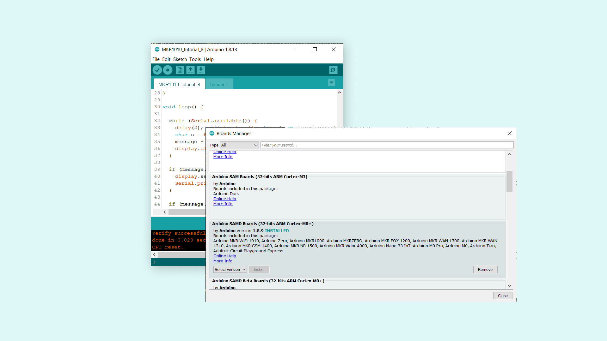
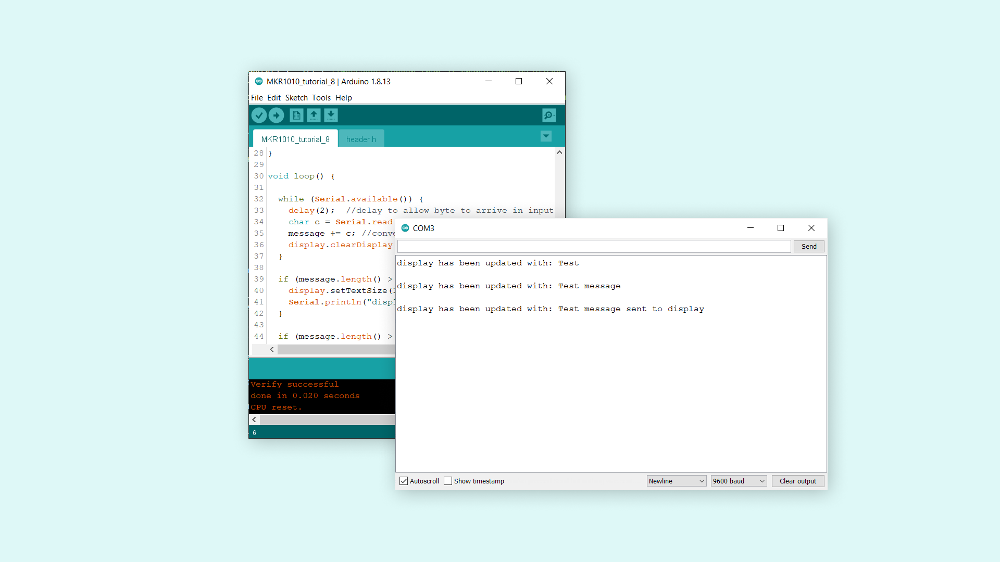
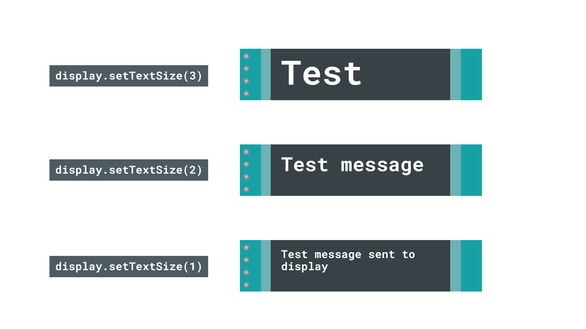

## Introduction

In this tutorial, we will go through a basic setup that allows us to write messages from the Serial Monitor to an SSD1306 OLED screen. We will be using the [Adafruit GFX library](https://github.com/adafruit/Adafruit-GFX-Library) and the [SSD1306 library](https://github.com/adafruit/Adafruit_SSD1306), where the text size adjusts according to the length of the message.

## Goals

The goals of this tutorial are:

- Learning about the OLED screen.
- Learn how to read inputs from the Serial Monitor.
- Learn some useful functions to program the OLED screen.

## Hardware & Software Needed

- Arduino IDE ([online](https://create.arduino.cc/) or [offline](https://www.arduino.cc/en/main/software))
- [Adafruit GFX](https://github.com/adafruit/Adafruit-GFX-Library) and [SSD1306 library](https://github.com/adafruit/Adafruit_SSD1306)
- Arduino MKR WiFi 1010  ([link to store](https://store.arduino.cc/mkr-wifi-1010))
- SSD1306 128x32 OLED Screen (other dimensions works but requires some adjusting)


## The OLED Screen

The Organic Light-Emitting Diode, or simply OLED, is the technology used for the screen in the Arduino Sensor Kit. OLED screens are incredibly popular in the world, and are typically divided into two separate categories: PMOLEDS and AMOLEDS. The PMOLEDS are used for simpler applications, where we can control each row or line of the screen. This results in most pixels being turned off. However, the AMOLEDS are a bit more advanced, and are heavily used for smart phones. It is so popular that hundreds of millions are being produced each year.

The SSD1306 display is of the PMOLED type, and its behavior can be controlled by using simple X and Y coordinates. While it is a small, inexpensive display, it can be used to create basic animations, shapes and include icons and even very lo-fi images.

### Circuit


#### Schematic


## Step by Step

**1.** First, we need to make sure the drivers for the MKR WiFi 1010 board is installed properly. The Web Editor already comes equipped with these, but if we are using an offline editor, we will need to install it manually. This can be done by navigating to **Tools > Board > Board Manager...**. Here we need to look for the **Arduino SAMD boards (32-bits Arm® Cortex®-M0+)** and click on the install button.



**2.** We will first need to make sure we install the libraries needed to program the OLED screen. If we are using the Web Editor, there is no need to install anything. If we are using an offline editor, simply go to **Tools > Manage libraries..**, and search for **Adafruit_GFX** and **Adafruit_SSD1306**. We will need to install both of them.

**3.** With the dependencies now installed, we can now take a look at some of the main functions we will use in the program.

- `display.begin()` - initializes the SSD1306 library.
- `display.setTextColor(screen, address)` - sets display to white color. 
- `display.setTextSize(SSD1306_WHITE)` - sets display to white color.
- `display.display()`- updates the display.
- `display.clearDisplay()` - clears the display.
- `Serial.available()` - get the number of bytes available for reading from the serial port.
- `Serial.read()` - reads the incoming serial data.
- `length()` - checks the length of a string.

The sketch below is based on an example provided in the **Adafruit_SSD1306**. Copy and paste the code in an editor of your choice, and upload the sketch to the board. 

```cpp
#include <SPI.h>
#include <Wire.h>
#include <Adafruit_GFX.h>
#include <Adafruit_SSD1306.h>

#define SCREEN_WIDTH 128 // OLED display width, in pixels
#define SCREEN_HEIGHT 32 // OLED display height, in pixels

// Declaration for an SSD1306 display connected to I2C (SDA, SCL pins)
#define OLED_RESET     4 // Reset pin # (or -1 if sharing Arduino reset pin)
Adafruit_SSD1306 display(SCREEN_WIDTH, SCREEN_HEIGHT, &Wire, OLED_RESET);

String message; //to store messages written in Serial Monitor
int text_size; //changes text size of the display


void setup() {
  Serial.begin(9600);

  // SSD1306_SWITCHCAPVCC = generate display voltage from 3.3V internally
  if (!display.begin(SSD1306_SWITCHCAPVCC, 0x3C)) { // Address 0x3C for 128x32
    Serial.println(F("SSD1306 allocation failed"));
    for (;;); // loop forever if library fails to initialize
  }

  display.setTextColor(SSD1306_WHITE); //set text to white

}

void loop() {

  while (Serial.available()) {
    delay(2);  //delay to allow byte to arrive in input buffer
    char c = Serial.read(); //store serial data in a char
    message += c; //convert char to string
    display.clearDisplay(); //clear display
  }

  if (message.length() > 0 && message.length() <= 5) { //messages between 1 and 5 characters activates text-size 3
    display.setTextSize(3);
    Serial.println("display has been updated with: " + message); // print the message in Serial monitor for feedback
  }

  if (message.length() > 6 &&  message.length() <= 20) { //messages between 6 and 20 characters activates text-size 2
    display.setTextSize(2);
    Serial.println("display has been updated with: " + message); // print the message in Serial monitor for feedback
  }

  if (message.length() >= 21) { //messages longer than 21 characters activates text-size 1
    display.setTextSize(1);
    Serial.println("display has been updated with: " + message); // print the message in Serial monitor for feedback
  }

  display.setCursor(0, 0);  //start printing at top left corner
  display.println(message); //prints the content of the message string on the display
  display.display(); //transfers the buffer to the display
  message = ""; //reset string after each print

}

}

```

## Testing It Out

Once we have uploaded the code to the board, wait a few seconds, then open the Serial Monitor. In the monitor, we can now start writing a message in the input field, and hit enter to send the message. 



When we send the message, the display updates almost immediately. But before it updates, depending on the `length` of the `message` string, the program chooses an appropriate text size. The message is then printed with the size of the text being 1, 2 or 3. 




### Troubleshoot

If the code is not working, there are some common issues we can troubleshoot:

- Missing libraries and drivers.
- Wrong screen (this tutorial uses SSD1306, 128x32).
- Missing brackets.

## Conclusion

In this tutorial, we have mainly covered some basics on using an OLED screen together with the MKR WiFi 1010 board. We have set up a simple Serial Interface that allows us to write and transfer messages from the Serial Monitor to the screen. 

The OLED screen can of course be used for many purposes! To get some more inspiration and try out more things, we can try any of the built in examples from the [Adafruit_SSD1306](https://github.com/adafruit/Adafruit-GFX-Library) library. 
