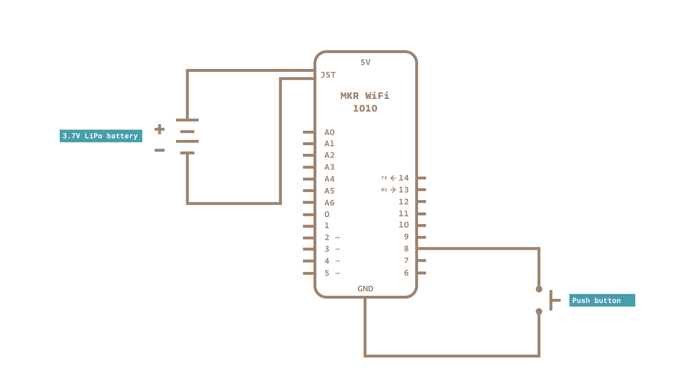
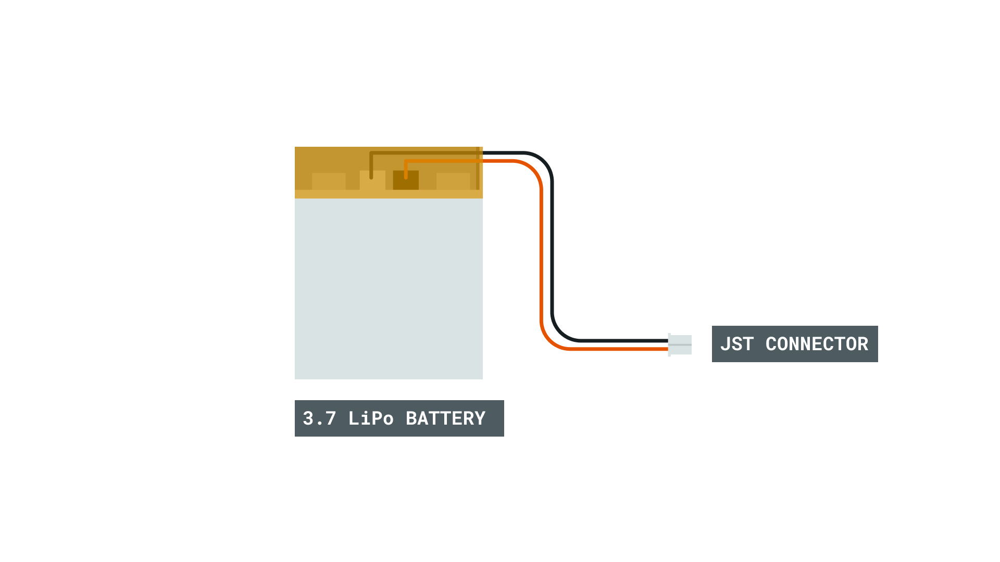
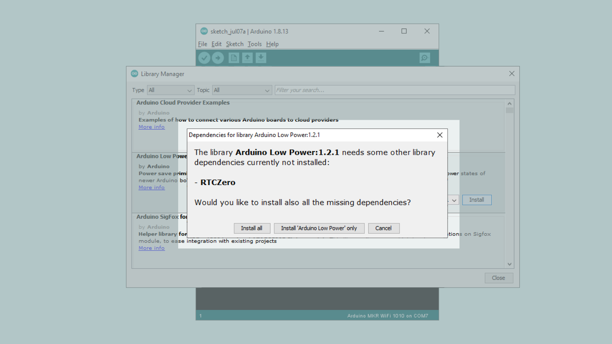

## Introduction

The MKR WiFi 1010 board is designed to run on a Li-Po battery.

Your MKR board has all the circuitry to use a Li-Po battery, charging it when there is power coming from VIN or USB, or using it as main power supply when there is no other source available. If you are going to use a Li-Po battery, it is useful to understand how to reduce power consumption using the ArduinoLowPower Library and the Wi-Fi LowPowerMode. Some simple practices will make your project battery friendly.

___

## Hardware & Software Needed

- Arduino MKR WiFI 1010 
- Li-Po battery 1024 mAh minimum, JST PH connector
- Pushbutton NO
- Power source with micro-USB cable
- Arduino IDE (offline and online versions available)
- Arduino SAMD Board Package installed, [follow this link for instructions](https://www.arduino.cc/en/Guide/MKRWiFi1010#installing-drivers-for-the-mkr-wifi-1010)
- WiFiNINA library (explained later in this tutorial)

### Circuit


### Schematic



___

## Let’s Start!

This tutorial is more of a conceptual one than a practical one, because there is not much we are going to do on the hardware side: just connect your Li-Po battery to the connector and see the board spring up to life. This happens if the battery is charged at some level and it is unlikely that your battery is so discharged that it won’t power up the MKR WiFi 1010. The pushbutton, used for one of the sketches goes between D8 and GND.

The first step is to connect the board to a source of energy, this can be your computer or a phone charger. In both cases there will be a cable that ends with a micro USB that goes into the MKR WiFi 1010 socket. A standard 500 mA supply is ok and will charge your battery in a number of hours that is proportional to the capacity of the battery. The circuit is designed to provide 4.2V and 512 mAh; with a typical C/2 charge/discharge rating of the cells, this is the reason why we suggest a 1024 mAh minimum capacity. The hours taken for the charge are therefore the capacity divided by the charging current. You can find batteries with different C values depending on their chemistry and application, but the ones available for powering microcontroller boards are usually rated at C/2. Operating the Li-Po battery within its specs will grant it a long and cool (no heating) life.



When the battery is charging, you will see the charging LED lit. When no charge is going on, either because the battery is full or the charging timeout has been reached, that LED is off while the Power LED stays on.

At this point our MKR WiFi 1010 is still connected to a power supply through the micro-USB port and the Li-Po cell is just connected but not used.

As soon as we disconnect the USB power, the battery power kicks in and we have an uninterrupted supply to all the components on the board. This is important to understand: no reset is needed when going from one power source to another, so you can be creative in your charging solutions, like solar cells, wind turbines, bicycle dynamos and so on. Just remember that the VIN and USB expect a clean and constant 5V (no more, no less).

We can now go to the software part and start checking the availability in our programming environment, of the two libraries we need:

- [ArduinoLowPower](https://www.arduino.cc/en/Reference/ArduinoLowPower)
- [WiFiNINA](https://www.arduino.cc/en/Reference/WiFiNINA)

Go to **Sketch > Include Library > Manage Libraries…** and the Library manager will open. Type in the search box the name of each library, as written above, and check if they are already installed (you see the “INSTALLED” label near the name), or alternatively just install the latest version.


When installing the Arduino Low Power Lib, it will automatically check if you have the RTCZero Lib, which is a dependency. This is a great feature of the latest lib manager.



Now everything is ready to begin the testing.

The NINA module can just turn off the WiFi, but has no deep sleep mode, while the SAMD microcontroller has one. This means that we have different levels of power saving.

Use `WiFi.lowPowerMode()`

- This is an automatically managed mode where the Wi-Fi NINA Module reduces its power drain, bringing the overall power consumption to 30mA. Any incoming data is received and the device regularly sends out to the beacon signal, each 100ms, to keep the AP connection alive.   

Use `WiFi.end()`

- If `WiFi.begin()` was used to connect to an access point, the connection will be disconnected. If `WiFi.beginAP()` was used before to create an access point, the `WiFi.end()` will stop listening it too. In both cases we need to reinitialize the module and restore the connection with one of the two APIs.

Use `LowPower.sleep()`

- Puts the MCU in sleep mode. The sleep mode allows power optimization with a slower wakeup time. Only the chosen peripherals are on.
        
Use `LowPower.deepSleep()`

- Puts the MCU in deep sleep mode. The deep sleep mode allows power optimization with the slowest wake-up time. All but the RTC peripherals are stopped. The CPU can wakeup only using RTC or wakeup on interrupt capable pins.
  
You find full reference for these APIs in the libraries documentation: here for [WiFiNINA](https://www.arduino.cc/en/Reference/WiFiNINA) and here for [ArduinoLowPower](https://www.arduino.cc/en/Reference/ArduinoLowPower).

These APIs can be combined, one for each type, to achieve the power saving you are looking for. Each one has its pros and cons, especially in terms of how long it take to get back the full functionalities versus the minimum mA used. As a reference, just the green power LED near the USB connector, consumes around 8 mA.

We begin with the typical sleep mode of the microcontroller and a manual pushbutton to wake it up.

This sketch demonstrates the usage of External Interrupts (on pins) to wakeup the SAMD21 of the MKR WiFi 1010 in sleep mode.

Sleep modes allow a significant drop in the power usage of a board while it does nothing waiting for an event to happen. Battery powered application can take advantage of these modes to enhance battery life significantly. 

>**NOTE:** if the processor is sleeping, a new sketch can't be uploaded. To overcome this, manually reset the board (usually with a single or double tap to the RESET button).

```arduino
#include <ArduinoLowPower.h>
// Number of blinks per repetition
// Declare it volatile since it's incremented inside an interrupt
volatile int repetitions = 1;
// Pin used to trigger a wakeup
const int pin = 8;
void setup() {
  pinMode(LED_BUILTIN, OUTPUT);
  // Attach a wakeup interrupt on pin 8, calling repetitionsIncrease when the device is woken up
  LowPower.attachInterruptWakeup(pin, repetitionsIncrease, CHANGE);
}
void loop() {
  for (int i = 0; i < repetitions; i++) {
    digitalWrite(LED_BUILTIN, HIGH);
    delay(500);
    digitalWrite(LED_BUILTIN, LOW);
    delay(500);
  }
  // Triggers an infinite sleep (the device will be woken up only by the registered wakeup sources)
  // The power consumption of the chip will drop consistently
  LowPower.sleep();
}
void repetitionsIncrease() {
  // This function will be called once on device wakeup
  // You can do some little operations here (like changing variables which will be used in the loop)
  // Remember to avoid calling delay() and long running functions since this functions executes in interrupt context
  repetitions ++;
}

```

In the next example we set the microcontroller to sleep for 8 seconds, when it wakes up, it does a double LED blink and goes back to sleep. This could be done using delay() to achieve the same result, but in this case the power consumption is much lower.

```arduino
#include <ArduinoLowPower.h>

void setup() {
  pinMode(LED_BUILTIN, OUTPUT);
  // Uncomment this function if you wish to attach function dummy when RTC wakes up the chip
  // LowPower.attachInterruptWakeup(RTC_ALARM_WAKEUP, dummy, CHANGE);
}

void loop() {
  digitalWrite(LED_BUILTIN, HIGH);
  delay(500);
  digitalWrite(LED_BUILTIN, LOW);
  delay(500);
  digitalWrite(LED_BUILTIN, HIGH);
  delay(500);
  digitalWrite(LED_BUILTIN, LOW);
  delay(500);
  // Triggers a 2000 ms sleep (the device will be woken up only by the registered wakeup sources and by internal RTC)
  // The power consumption of the chip will drop consistently
  LowPower.sleep(8000);
}

void dummy() {
  // This function will be called once on device wakeup
  // You can do some little operations here (like changing variables which will be used in the loop)
  // Remember to avoid calling delay() and long running functions since this functions executes in interrupt context
}

```

**WiFi.lowPowerMode()** is capable of putting the Wi-Fi NINA module in a self managed low power mode. The data is transmitted and received, while the beacon is transmitted at regular intervals to keep the AP mode effective. To use this feature, it is enough to put this API in your sketch after the initialization procedure of the WiFi. Please note that there is no parameter passed to the function; to disable this low power mode you need to use the **WiFi.noLowPowerMode()** function.

In the following example we keep asking the content of the home page of example.org every 20 seconds, allowing the NINA module to manage its power consumption autonomously.  
  
```arduino
#include <WiFiNINA.h>
 
#include "arduino_secrets.h"
///////please enter your sensitive data in the Secret tab/arduino_secrets.h
char ssid[] = SECRET_SSID;   // your network SSID (name)
char pass[] = SECRET_PASS;   // your network password (use for WPA, or use as key for WEP)
int keyIndex = 0;            // your network key Index number (needed only for WEP)
 
int status = WL_IDLE_STATUS;
 
WiFiClient client;  // Initialize the Wifi client library
 
char server[] = "example.org";  // server address:
 
unsigned long lastConnectionTime = 0;            // last time you connected to the server, in milliseconds
const unsigned long postingInterval = 20000; // delay between updates, in milliseconds
 
void setup() {
  Serial.begin(9600);
  while (!Serial) {
    ; // wait for serial port to connect. Needed for native USB port only
  }
 
  if (WiFi.status() == WL_NO_MODULE) {     // check for the WiFi module:
    Serial.println("Communication with WiFi module failed!");
    // don't continue
    while (true);
  }
 
  while (status != WL_CONNECTED) {
    Serial.print("Attempting to connect to SSID: ");
    Serial.println(ssid);
    // Connect to WPA/WPA2 network. Change this line if using open or WEP network:
    status = WiFi.begin(ssid, pass);
    WiFi.lowPowerMode();  // ENABLE WiFi Low Power Mode
    delay(5000);
  }
}
 
void loop() {
  while (client.available()) {
    char c = client.read();
    Serial.write(c);
  }
 
  if (millis() - lastConnectionTime > postingInterval) {
    httpRequest();
  }
 
}
 
void httpRequest() {
  // close any connection before send a new request.
  // This will free the socket on the Nina module
  client.stop();
 
  // if there's a successful connection:
  if (client.connect(server, 80)) {
    Serial.println("connecting...");
    client.println("GET / HTTP/1.1");
    client.println("Host: example.org");
    client.println("User-Agent: ArduinoWiFi/1.1");
    client.println("Connection: close");
    client.println();
 
    lastConnectionTime = millis();
  } else {
    Serial.println("connection failed");
  }
}

```

The consumption of the NINA module alone can go down at around 30mA and this has to be added to the other components on your board.

A more radical way to reduce the consumption of the NINA module is to use **WiFi.end()** that turns off the radio part of the module. The microcontroller inside the module is still using some power, but this is the lowest level of consumption possible. This function in your sketch closes any active connection and requires a full restart of the initialization process: WiFi.begin() or WiFi.beginAP() are required to restore the connections.

## Conclusion

The four APIs covered in this tutorial allow you to minimize the power consumption of the MKR WiFi 1010 and get the most out of your rechargeable battery. The declared battery capacity, divided by the power used by the board will give you the expected number of hours your circuit can run on a single charge. To assess the real mA used we suggest that you use some of the nice and cheap USB power monitors available on the market.

