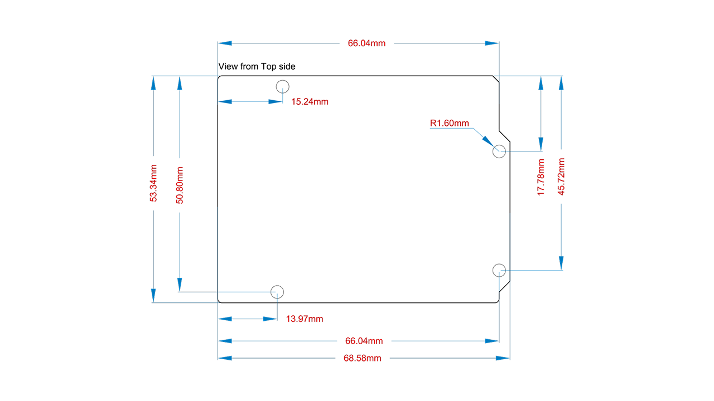

# Description

The Arduino Starter Kit R4 is a hands-on learning platform built around the Arduino UNO R4 WiFi. Featuring an Arm® Cortex®-M4 microcontroller, integrated Wi-Fi® and Bluetooth® via ESP32-S3, and a 12x8 red LED matrix, this kit provides makers, students, and educators with a reliable foundation to learn, prototype, and build real-world IoT projects. With included sensors, motors, and actuators, the Starter Kit R4 bridges theoretical learning and practical experimentation.

# Target Areas

Education, IoT learning, embedded programming, maker prototyping, STEM classrooms

# CONTENTS

## Application Examples

The Starter Kit R4 offers a wide variety of practical applications, from classroom-friendly tutorials to Internet-connected prototypes. Below are a few examples of what learners and developers can build with the kit:

- 
<strong>IoT Projects</strong>: Leverage Wi-Fi® to connect sensors and actuators to the Cloud for smart home automation, weather monitoring, or remote control systems.

- 
<strong>Educational Tools</strong>: Teach students the fundamentals of electronics, embedded coding, and control logic using interactive guided experiments.

- 
<strong>LED Matrix Animations</strong>: Use the onboard 12x8 red LED matrix to create visual displays, status indicators, or animations for feedback and communication.

- 
<strong>Environmental Monitoring</strong>: Build temperature-based monitoring systems using included thermistors and output data via Wi-Fi® or LED visuals.

- 
<strong>Robotics & Motion</strong>: Drive DC or servo motors to explore basic robotics and automated movement control applications.

## Starter Kit R4 Projects Book

The Arduino Starter Kit R4 includes a printed book with 14 projects. Each project helps you learn how to use different components and write code with the Arduino UNO R4 WiFi. The projects start simple and become more advanced as you go.

| **No.** | **Project Title**      | **What You Learn**                               |
| ------: | ---------------------- | ------------------------------------------------ |
|      00 | Get Started            | How to set up the software and board             |
|      01 | Get to Know Your Tools | How to use a breadboard, resistors, and switches |
|      02 | Spaceship Interface    | How to control LEDs with buttons                 |
|      03 | Chill-o-Meter          | How to read temperature using a sensor           |
|      04 | Color Mixing Lamp      | How to use light sensors and fade LEDs           |
|      05 | Mood Cue               | How to give feedback using lights and sensors    |
|      06 | Light Theremin         | How to use light to make sound                   |
|      07 | Keyboard Instrument    | How to play tones with a piezo speaker           |
|      08 | Digital Hourglass      | How to build a timer using LEDs                  |
|      09 | Motorized Pinwheel     | How to control a motor                           |
|      10 | Crystal Ball           | How to make random responses                     |
|      11 | Knock Lock             | How to detect knocks with a piezo sensor         |
|      12 | Touchy-feely Lamp      | How to control light with a touch sensor         |
|      13 | Hacking Buttons        | How to reuse parts to make new controls          |

The book explains each step clearly and includes drawings and sample code. You can also visit the official project page at:
<a href="https://www.arduino.cc/starterkit" target="_blank">arduino.cc/starterkit</a> for updates and more projects.

Suggested additional materials are listed in the details of each project, such as basic crafting materials: paper, tape, markers, scissors and more. These are not included in the kit.
### Starter Kit R4 Online Projects

The Starter Kit R4 includes a set of online projects. These projects build on the skills developed in the first 14 lessons, introducing topics such as computer interaction via USB (Human Interface Device - HID), capacitive touch, and enhanced use of the LED matrix. The first online module, <strong>"Welcome Online"</strong>, provides an introduction to the Arduino Cloud platform and how to use it with your kit.

The projects listed below represent the content available at the time of the kit's launch. Additional online projects will continue to be added over time to expand the learning experience and showcase new projects.

| **No.** | **Project Title** | **What You Learn**                                                                                 |
|--------:|-------------------|----------------------------------------------------------------------------------------------------|
|      00 | Welcome Online    | Learn how to use the online Arduino Cloud platform.                                                |
|      14 | HIDden Powers     | Build a game controller that can interact with your computer, using HID and pushbuttons.           |
|      15 | Heartbeat Monitor | Use the Love Button to pulse a heartbeat on the LED Matrix. |
|      16 | Funky Synth       | Build a funky synth using capacitive touch and a piezo speaker.                                    |

You can follow the link below to access the official online course platform [11], where you will find the online projects with step-by-step instructions:
<a href="https://courses.arduino.cc/starterkitr4" target="_blank">courses.arduino.cc/starterkitr4</a>. 
To access the course, users need an Arduino account.

## Features

### Kit Contents

The Starter Kit R4 includes the UNO R4 WiFi board and a wide selection of electronic components to build, test and explore interactive projects. All components are curated for step-by-step guided experimentation.

- **K000007_R4**: This is the SKU that represents the Starter Kit R4.
- **K000007_R4-6P**: This SKU represents the Starter Kit R4 Classroom pack.

#### Main Board

- Arduino UNO R4 WiFi (SKU: ABX00087) (x1)

#### Cables & Power

- USB-C® cable (x1)
- 9V battery snap connector (x1)

#### Prototyping Tools

- Breadboard (x1)
- Easy-to-assemble base (x1)
- Solid core jumper wires (x70)
- Stranded jumper wires (x2)
- Male pin strip - 40x1 (x1)

#### Input & Output Components

- Pushbuttons (x6)
- LCD display - 16x2 characters (x1)
- Piezo capsule (x1)

#### LEDs

- Bright white LED (x1)
- RGB LED (x1)
- Red LEDs (x8)
- Green LEDs (x8)
- Yellow LEDs (x8)
- Blue LEDs (x3)

#### Sensors

- Phototransistors (x4)
- Temperature sensor (x1)
- Tilt sensor (x1)

#### Actuators

- Small DC motor 6/9 V (x1)
- Small servo motor (x1)

#### Semiconductor Components

- H-bridge motor driver (x1)
- Optocoupler (x2)
- MOSFET transistor (x1)
- Diodes (x3)

#### Passive Components

- Potentiometers (x3)
- Capacitors - 100 µF (x3)
- Resistors - 220 Ω (x11)
- Resistors - 560 Ω (x3)
- Resistors - 1 kΩ (x3)
- Resistors - 4.7 kΩ (x3)
- Resistors - 10 kΩ (x11)
- Resistors - 1 MΩ (x7)
- Resistors - 10 MΩ (x3)

#### Accessories

- Transparent color gels - red, green, blue (x3 total)

#### Arduino UNO R4 WiFi (SKU: ABX00087)

The UNO R4 WiFi is a modern 32-bit development board that combines the performance of the Renesas RA4M1 microcontroller with the wireless connectivity of the ESP32-S3-MINI-1 module. While preserving the classic UNO form factor and 5 V logic compatibility, it introduces new features including a built-in 12x8 LED matrix, CAN bus and QWIIC I2C connector. These additions make it suitable for both traditional prototyping and modern IoT development.

| **Feature**                           | **Specification**                        |
|---------------------------------------|------------------------------------------|
| Main MCU                              | Renesas RA4M1 (R7FA4M1AB3CFM#AA0)        |
| Core                                  | Arm® Cortex®-M4, 48 MHz with FPU         |
| Memory                                | 256 kB Flash, 32 kB SRAM, 8 kB EEPROM    |
| Wireless MCU                          | ESP32-S3-MINI-1-N8                       |
| Wireless Connectivity                 | Wi-Fi® 4 (802.11 b/g/n), Bluetooth® 5 LE |
| Operating Voltage                     | 5 V (RA4M1), 3.3 V (ESP32-S3)            |
| USB Connector                         | USB-C                                    |
| Power Input                           | VIN: 6-24 V / USB: 5 V                   |
| Digital I/O Pins                      | 14                                       |
| Analog Input Pins                     | 6                                        |
| PWM (Pulse Width Modulation)  Outputs | 6                                        |
| DAC (Digital-to-Analog Converter)     | 1 × 12-bit (A0 pin)                      |
| LED Matrix                            | 12x8 red matrix, programmable            |
| Communication Interfaces              | UART (1), I2C (2), SPI (1), CAN (1)      |
| Special Interfaces                    | QWIIC connector (3.3 V I2C), ESP header  |
| Additional Features                   | RTC, OPAMP, DMA controller, CTSU         |
| Dimensions                            | 68.58 mm × 53.34 mm                      |

By default, programming the RA4M1 microcontroller is handled through the ESP32-S3, which works as a USB bridge. This configuration allows uploading via USB-C without requiring additional setup.

The board features a USB-C port for both powering and programming. It also supports serial communication and works as the main development interface.

  
<strong>Warning:</strong> Do not exceed 5 V on the USB-C port to avoid hardware damage.

The RA4M1 microcontroller provides a 12-bit DAC connected to the A0 pin. It can generate analog output signals such as variable voltage levels or waveforms for audio and signal testing applications.

The onboard QWIIC connector (SM04B-SRSS-TB) allows plug-and-play I2C communication with 3.3 V QWIIC-compatible modules. It is connected to a secondary I2C bus powered by the onboard 3.3 V regulator.

The main I2C bus is also accessible on A4 (SDA) and A5 (SCL) pins. Avoid using A4/A5 as analog inputs while I2C communication is active.

  

    For more technical information, schematics, and configuration details, refer to the official UNO R4 WiFi documentation:
    <a href="https://docs.arduino.cc/hardware/uno-r4-wifi/" target="_blank" style="color: #0056b3; text-decoration: underline;">
      UNO R4 WiFi Official Documentation [1]
    </a>
  

## Ratings

### Recommended Operating Conditions

The recommended electrical and thermal operating ranges for the Arduino UNO R4 WiFi board are as follows:

| **Symbol**      | **Description**                      | **Minimum** | **Typical** | **Maximum** | **Unit** |
|-----------------|--------------------------------------|-------------|-------------|-------------|----------|
| VIN  | Input voltage from VIN pad / DC Jack | 6           | 7.0         | 24          | V        |
| VUSB | Input voltage from USB connector     | 4.8         | 5.0         | 5.5         | V        |
| TOP  | Operating Temperature                | -40         | 25          | 85          | °C       |

<strong>Note:</strong> Operating conditions reflect general limits for the main board and consider reasonable usage of connected peripherals. Component-specific ratings may vary.

The UNO R4 WiFi supports power inputs via USB-C or the VIN pin (DC barrel jack). A buck converter (ISL854102FRZ) regulates VIN input (6-24 V) down to 5 V. USB input is internally dropped to ~4.7 V due to a Schottky diode.

A 3.3 V linear regulator (SGM2205-3.3XKC3G/TR) supplies the ESP32-S3 and other 3.3 V peripherals.

### Pin Voltage and Current

- **Logic Levels**: RA4M1 operates at 5 V / ESP32-S3 at 3.3 V
- **Current per GPIO**: Up to 8 mA
- **Important**: Do not apply 5 V signals to ESP32-S3 pins

Always use external power supplies for high-current loads like servos or DC motors.

  

    For more technical information, schematics, and configuration details, refer to the official UNO R4 WiFi documentation:
    <a href="https://docs.arduino.cc/hardware/uno-r4-wifi/" target="_blank" style="color: #0056b3; text-decoration: underline;">
      UNO R4 WiFi Official Documentation [1]
    </a>
  

## Kit Power Supply

The Starter Kit R4 supports multiple powering options via the Arduino UNO R4 WiFi board. When connecting additional peripherals, ensure they are within the supported voltage and current limits.

- 
<strong>VIN / Barrel Jack</strong>: Accepts 6-24 VDC input, regulated to 5 V using the onboard buck converter (ISL854102FRZ). Recommended for projects requiring higher or isolated input voltage sources.

<strong>Note:</strong> A 9 V battery snap connector is included in the kit for use with a 9 V battery as a power source if desired. The 9 V battery is not included and must be purchased separately.

- 
<strong>USB-C Connector</strong>: Provides 5 V directly from the USB host. Actual voltage seen by the board is slightly reduced due to a Schottky diode (~4.7 V). Suitable for desktop or classroom use.

- 
<strong>5 V Pin</strong>: Provides regulated 5 V output when the board is powered via USB or VIN. Use with caution and avoid connecting high-current loads (e.g., motors) directly to this pin.

<strong>Warning:</strong> Exceeding the voltage or current ratings of the board or connected components may result in damage or unsafe operation. Always check the specifications of peripherals before connecting them.

  

    For more technical information, schematics, and configuration details, refer to the official UNO R4 WiFi documentation:
    <a href="https://docs.arduino.cc/hardware/uno-r4-wifi/" target="_blank" style="color: #0056b3; text-decoration: underline;">
      UNO R4 WiFi Official Documentation [1]
    </a>
  

## Device Operation

### Getting Started - IDE

If you want to program your Arduino Starter Kit R4 offline, install the Arduino Desktop IDE [2]. To connect the Arduino UNO R4 WiFi to your computer, you will need a USB-C cable.

### Getting Started - Arduino Cloud Editor

All components of the Arduino Starter Kit R4 work seamlessly on the Arduino Cloud Editor [3] by installing a simple plugin. The Arduino Cloud Editor is hosted online, ensuring it is always up-to-date with the latest features and support for all boards and devices. Follow the Getting Started guide [6] to start coding in the browser and upload your sketches onto the Arduino UNO R4 WiFi.

### Getting Started - Arduino Cloud

The Arduino Starter Kit R4 is fully compatible with the Arduino Cloud, allowing you to log, visualize, and analyze sensor data, trigger events, and automate processes for educational and home IoT applications using the UNO R4 WiFi board. To learn how to integrate your projects with the Cloud, refer to the official documentation [6].

### Sample Sketches

Sample sketches for the Starter Kit R4 can be found either in the "Examples" menu in the Arduino IDE or the LED Matrix tutorial section of Arduino documentation [7]. These examples include basic and advanced applications showcasing motion and environmental monitoring capabilities.

### Online Resources

Now that you have gone through the basics of what you can do with the Starter Kit R4, you can explore the endless possibilities it provides by checking exciting projects on Arduino Project Hub [5], the Arduino Library Reference [9], and the online Starter Kit R4 product page [10].

## Mechanical Information

### Starter Kit R4 (K000007_R4) Dimensions

| **View** | **Measurement** |
|----------|-----------------|
| Width    | 245 mm          |
| Length   | 160 mm          |
| Height   | 41 mm           |
| Weight   | 0.864 Kg        |

### Starter Kit R4 Classroom Pack (K000007_R4-6P) Dimensions

| **View** | **Measurement** |
|----------|-----------------|
| Width    | 245 mm          |
| Length   | 160 mm          |
| Height   | 146 mm          |
| Weight   | 5.4 Kg          |

### UNO R4 WiFi (ABX00087) Dimensions

| **View**      | **Measurement**        |
|---------------|------------------------|
| Width         | 68.58 mm               |
| Length        | 53.34 mm               |
| Height        | ~15 mm (approx. max)   |

### Notes

- Compatible with classic Arduino UNO shields
- Sufficient clearance required when stacking modules

## Product Compliance

The Arduino Starter Kit R4 is composed of multiple individual components, with the UNO R4 WiFi being the main board, it complies with specific regulations and certifications. For detailed product compliance information, please refer to the corresponding datasheets of each component included in the kit:

- [UNO R4 WiFi Compliance Information](https://docs.arduino.cc/hardware/uno-r4-wifi/) **[1]**

## FCC Caution

The UNO R4 WiFi of the Arduino Starter Kit R4 is subject to individual FCC regulations. Please refer to the FCC documentation linked in each Arduino component's datasheet for specific compliance details:

- [UNO R4 WiFi Compliance Information](https://docs.arduino.cc/hardware/uno-r4-wifi/) **[1]**

## Company Information

| **Company name** | Arduino S.r.l.                               |
|------------------|----------------------------------------------|
| **Address**      | Via Andrea Appiani, 25 – 20900 Monza (Italy) |

## Reference Documentation

| **No.** | **Reference**                | **Link**                                                             |
|--------:|------------------------------|----------------------------------------------------------------------|
|       1 | UNO R4 WiFi Documentation    | https://docs.arduino.cc/hardware/uno-r4-wifi/                        |
|       2 | Arduino IDE                  | https://www.arduino.cc/en/software                                   |
|       3 | Arduino Cloud Editor         | https://create.arduino.cc/editor                                     |
|       4 | Language Reference           | https://www.arduino.cc/reference/en/                                 |
|       5 | Project Hub                  | https://create.arduino.cc/projecthub                                 |
|       6 | Cloud Getting Started Guide  | https://docs.arduino.cc/cloud/web-editor/tutorials/getting-started   |
|       7 | LED Matrix Examples          | https://docs.arduino.cc/tutorials/uno-r4-wifi/led-matrix             |
|       8 | Wi-Fi Examples               | https://docs.arduino.cc/tutorials/uno-r4-wifi/wifi-examples          |
|       9 | Library Reference            | https://github.com/arduino-libraries/                                |
|      10 | Online Store                 | https://store.arduino.cc/products/arduino-starter-kit-multi-language |
|      11 | Online Starter Kit R4 Course | https://courses.arduino.cc/starterkitr4                              |

## Document Revision History

| **Date**   | **Revision** | **Changes**        |
|------------|--------------|--------------------|
| 18/09/2025 | 1            | First release      |
