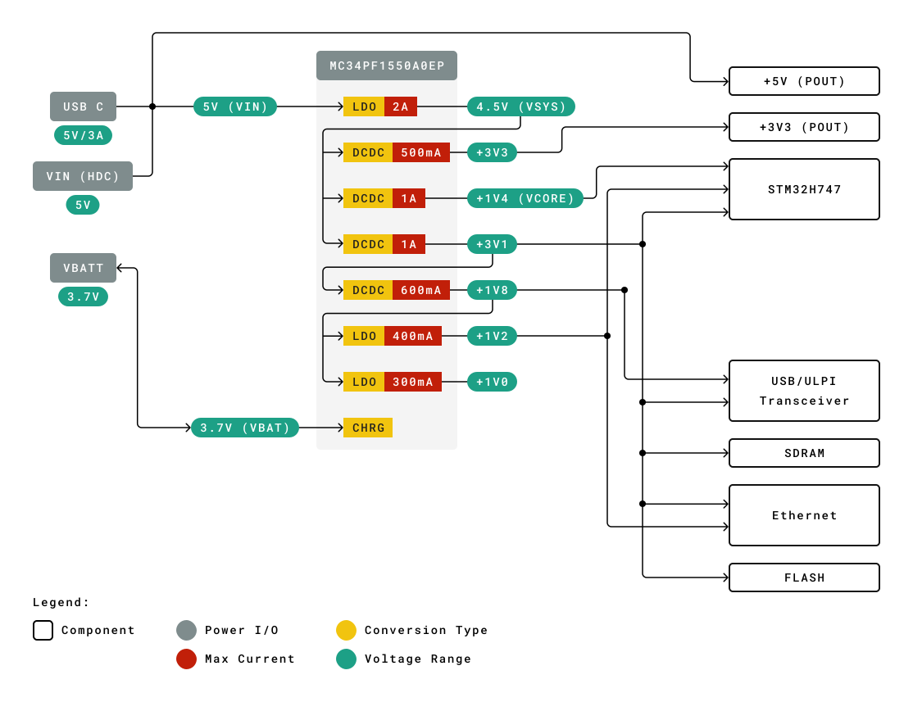
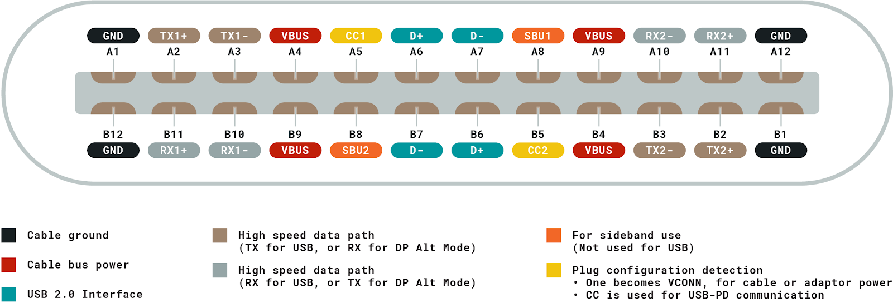
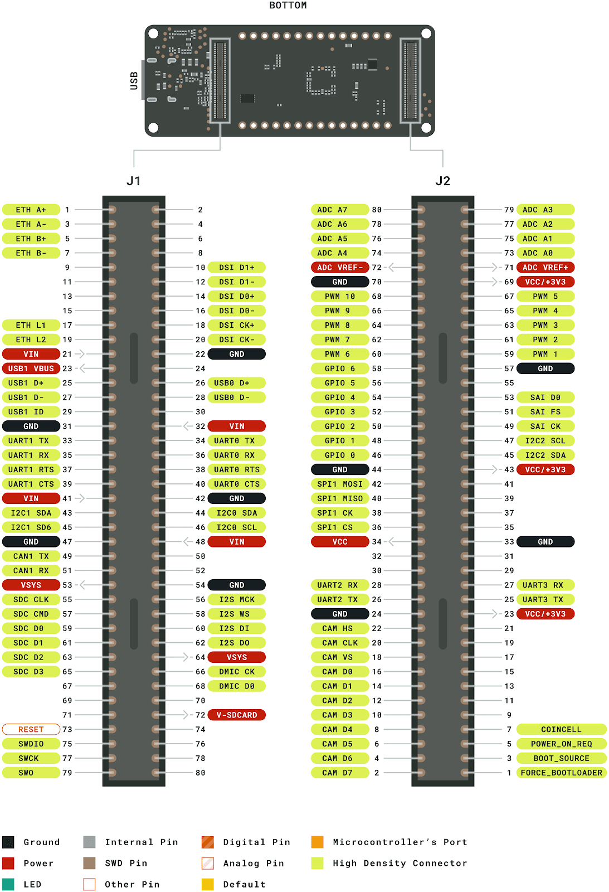
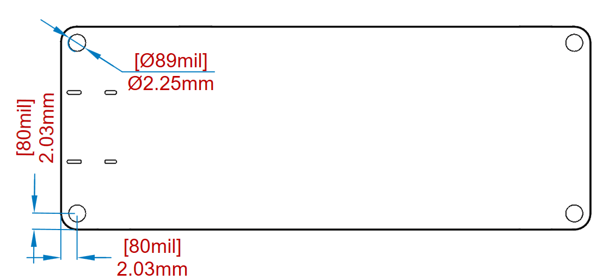

---
# This is the first version of the board's datasheet
# Saving it as back up and for the legacy.
# Contact the PRO content sub-team/ technical content sub-team for more info
# Reason: Replace individual datasheets for the H7 versions with a collective datasheet, same for the 3 boards
identifier: ABX00045
title: Arduino® Portenta H7 Lite
type: pro
---

# Description
The Portenta H7 Lite is a member of the Portenta family, dedicated to various industrial and use cases but with the traditional Arduino openness and ready for the most demanding Pro applications. The Portenta H7 Lite is ready for machine learning and real-time applications thanks to the dual core STM32H747 processor including a Cortex® M7 running at 480 MHz and a Cortex® M4 running at 240 MHz. The two cores communicate via a Remote Procedure Call mechanism that allows calling functions on the other processor seamlessly for real multitasking. By harnessing the computational power of both Portenta H7's cores, machine learning algorithms can run simultaneously alongside low latency sensor/actuator interaction. 

Arduino's expertise in producing high quality PCB in house has been leveraged to ensure that the Portenta H7 Lite can meet the vibrations and temperatures met in daily industrial, automotive and agriculture applications.  

Portenta H7 Lite offers several customization possibilities that allow tailoring board functionality to specific applications for high volume use cases.

# Features
*   **ST STM32H747XI** Processor
    *   Dual core
        *   Arm® Cortex®-M7 core at up to 480 MHz with double-precision FPU and 16K data + 16K instruction L1 cache
        *   Arm® 32-bit Cortex®-M4 core at up to 240 MHz with FPU, Adaptive real-time accelerator (ART Accelerator™)
    *   2 Mbytes of Flash memory with read-while-write support + 1 Mbyte of RAM
    *   Dual mode Quad-SPI memory interface running up to 133 MHz
    *   CRC calculation unit
    *   Security
    *   ROP, PC-ROP, active tamper
    *   3 separate power domains which can be independently clock-gated or switched off:
        *   D1: high-performance capabilities
        *   D2: communication peripherals and timers
        *   D3: reset/clock control/power management
    *   Voltage scaling in Run and Stop mode (6 configurable ranges)
    *   2.95 μA in Standby mode (Backup SRAM OFF, RTC/LSE ON)
    *   4 DMA controllers to unload the CPU
    *   1× high-speed master direct memory access controller (MDMA) with linked list support
    *   2× dual-port DMAs with FIFO
    *   1× basic DMA with request router capabilities
    *   Up to 35 communication peripherals
        *   4× USARTs/4x UARTs (ISO7816 interface, LIN, IrDA, up to 12.5 Mbit/s) and 1x LPUART
        *   6× SPIs, 3 with muxed duplex I2S audio class accuracy via internal audio PLL or external clock, 1x I2S in LP domain (up to 150 MHz)
        *   4x SAIs (serial audio interface)
        *   SPDIFRX interface
        *   SWPMI single-wire protocol master I/F
        *   MDIO Slave interface
        *   2× SD/SDIO/MMC interfaces (up to 125 MHz)
        *   2× CAN controllers: 2 with CAN FD, 1 with time-triggered CAN (TT-CAN)
        *   2× USB OTG interfaces (1FS, 1HS/FS) crystal-less solution with LPM and BCD
        *   Ethernet MAC interface with DMA controller
    *   8-bit camera interface (up to 80 MHz)
    *   11 analog peripherals
    *   3× ADCs with 16-bit max. resolution (up to 36 channels, up to 3.6 MSPS)
    *   1× temperature sensor
    *   2× 12-bit D/A converters (1 MHz)
    *   2× ultra-low-power comparators
    *   2× operational amplifiers (7.3 MHz bandwidth)
    *   1× digital filters for sigma delta modulator (DFSDM) with 8 channels/4 filters
    *   Graphics
    *   MIPI DSI host including an MIPI D-PHY to interface with low-pin count large displays
    *   Chrom-ART graphical hardware Accelerator™ (DMA2D) to reduce CPU load
    *   Hardware JPEG Codec
    *   Up to 22 timers and watchdogs
    *   1× high-resolution timer (2.1 ns max resolution)
    *   2× 32-bit timers with up to 4 IC/OC/PWM or pulse counter and quadrature (incremental) encoder input (up to 240 MHz)
    *   2× 16-bit advanced motor control timers (up to 240 MHz)
    *   10× 16-bit general-purpose timers (up to 240 MHz)
    *   5× 16-bit low-power timers (up to 240 MHz)
    *   4× watchdogs (independent and window)
    *   2× SysTick timers
    *   RTC with sub-second accuracy and hardware calendar
    *   True random number generators (3 oscillators each)
    *   96-bit unique ID
*   **External Memories**
    *   up to 64 MByte SDRAM (optional)
    *   up to 128 MByte QSPI Flash (optional)
*   **High Density connectors**
    *   1x 10/100 Ethernet with PHY
    *   1x CAN
    *   4x UART (2 with flow control)
    *   3x I2C
    *   1x SDCard
    *   1x SPI
    *   1x I2S
    *   1x PDM input
    *   2 lane MIPI DSI output
    *   8 bit parallel camera interface
    *   10x PWM outputs
    *   7x GPIO
    *   8x ADC inputs with separate VREF
*   **Microchip ATECC608** Crypto (optional)
    *   Protected storage for up to 16 Keys, certificates or data
    *   Hardware support for asymmetric sign, verify, key agreement – ECDSA: FIPS186-3 Elliptic Curve Digital Signature
    *   ECDH: FIPS SP800-56A Elliptic Curve Diffie-Hellman
    *   NIST standard P256 elliptic curve support
    *   Hardware support for symmetric algorithms
    *   SHA-256 & HMAC hash including off-chip context save/restore
    *   AES-128: encrypt/decrypt, galois field multiply for GCM
    *   Networking key management support
    *   Turnkey PRF/HKDF calculation for TLS 1.2 & 1.3
    *   Ephemeral key generation and key agreement in SRAM – Small message encryption with keys entirely protected
    *   Secure boot support
    *   Full ECDSA code signature validation, optional stored digest/signature – optional communication key disablement prior to secure boot
    *   Internal high-quality FIPS 800-90 A/B/C Random Number Generator (RNG)
    *   Two high-endurance monotonic counters
    *   Guaranteed unique 72-bit serial number
*   **MKR compatible header**
    *   7x PWM channels
    *   7x ADC channels
    *   1x SPI
    *   1x UART
    *   1x I2C
*   **ESLOV Connector**
    *   I2C port with automatic device enumeration
*   **NXP® PF1550** Programmable PMIC
    *   dynamic voltage scaling
    *   programmable independent 1A voltage output to carrier board
    *   programmable I/O voltage
    *   integrated Li-Po/Li-Ion Battery Charger

# Contents
## The Board
### Application Examples
Due to the dual core processing and the low-power capabilities, Portenta supports a wide array of applications.

**Machine Vision:** In combination with the Portenta Vision Shield it can run machine vision applications. This allows to detect the presence or movement of objects in a video stream.

**AI & Machine Learning:**  Thanks to the power of the two cores it can simultaneously read data from sensors or other devices on one core while the other core processes the data stream and uses machine learning to make sense of the data. When used with the Portenta Vision Shield its camera module or the two directional microphones can be used as data sources.

### Accessories
The [Portenta Vision Shield](https://docs.arduino.cc/hardware/portenta-vision-shield) is a rapid pathway to developing applications that combine vision, audio and connectivity. The ultra low power HM-01B0 CMOS image sensor is designed with always-on applications in mind. The 324x324 data stream can be used with either the Arduino toolchain or OpenMV for gestures, ambient light, proximity sensing, and object identification. The large pixel size (3.6μm) provides a high signal-to-noise ratio. The two omnidirectional digital-microphones (MP34DB02) allows concurrent capture of stereo sounds alongside the video stream on the MicroSD Card, as well as for beamforming uses. Connectivity is provided by either ethernet or LoRa technology. LoRa technology enables the use of this platform as part of wireless sensor network solutions.

### Related Products
* Portenta H7
* Portenta H7 Lite Connected

## Ratings
### Absolute Maximum  
| **Symbol** | **Description**                          | **Min** | **Typ** | **Max** | **Unit** |
| ---------- | ---------------------------------------- | ------- | ------- | ------- | -------- |
| VINMax     | Maximum input voltage from VIN pad       | -0.3    | -       | 21      | V        |
| VUSBMax    | Maximum input voltage from USB connector | -0.3    | -       | 21      | V        |
| PMax       | Maximum Power Consumption                | -       | -       | 5000    | mW       |

### Thermal 
| **Symbol** | **Description**                                   | **Min** | **Typ** | **Max** | **Unit** |
| ---------- | ------------------------------------------------- | ------- | ------- | ------- | -------- |
| TST        | Storage Temperature                               | -40     |         | 85      | °C       |
| TOP        | Operating Temperature (excluding Wireless module) | -40     |         | 85      | °C       |
| TOPw       | Operating Temperature (including Wireless module) | -10     |         | 55      | °C       |

### Recommended Operating Conditions 
| **Symbol** | **Description**                                    | **Min** | **Typ** | **Max** | **Unit** |
| ---------- | -------------------------------------------------- | ------- | ------- | ------- | -------- |
| VIN        | Input voltage from VIN pad                         | 4.5     | 5       | 5.5     | V        |
| VUSB       | Input voltage from USB connector                   | 4.5     | 5       | 5.5     | V        |
| V3V3       | 3.3V output to user application                    |         | 3.1     |         | V        |
| I3V3       | 3.3V output current available for user application | -       | -       | 1000    | mA       |
| VIH        | Input high-level voltage                           | 2.31    | -       | 3.3     | V        |
| VIL        | Input low-level voltage                            | 0       | -       | 0.99    | V        |
| IOH Max    | Current at VDD-0.4 V, output set high              |         |         | 8       | mA       |
| IOL Max    | Current at VSS+0.4 V, output set low               |         |         | 8       | mA       |
| VOH        | Output high voltage, 8 mA                          | 2.7     | -       | 3.3     | V        |
| VOL        | Output low voltage, 8 mA                           | 0       | -       | 0.4     | V        |

### Power Consumption
| **Symbol** | **Description**                     | **Min** | **Typ** | **Max** | **Unit** |
| ---------- | ----------------------------------- | ------- | ------- | ------- | -------- |
| PBL        | Power consumption with busy loop    |         | TBC     |         | mW       |
| PLP        | Power consumption in low power mode |         | TBC     |         | mW       |
| PMAX       | Maximum Power Consumption           |         | TBC     |         | mW       |

## Functional Overview
### Board Topology

| **Ref.** | **Description**                     | **Ref.**        | **Description**           |
| -------- | ----------------------------------- | --------------- | ------------------------- |
| U1       | STM32H747, Main processor           | U10             | Power Manager             |
| U2       | QSPI Flash Memory                   | U11             | Crypto Chip (NXP®)         |
| U3       | USB HS PHY                          | U12, U13, U14   | ESD protection            |
| U4       | SDRAM                               | U16             | Crypto Chip (Microchip)   |
| U5       | Ethernet PHY                        | J1, J2          | High Density Connectors   |
| U6       | MIPI to USB-C®                       | ANT1            | Antenna or U.FL Connector |
| U7       | Level Shifter                       | JANALOGJDIGITAL | MKR compatible headers    |
| U8       | I2C level shifter                   | J4              | Battery connector         |
| U9       | WiFi/BT Module                      | J5              | ESLOV connector           |

### Processor
Main processor is a dual core Cortex M7 running at up to 480 MHz and a Cortex M4 running at up to 240 MHz. The two cores communicate with each other via a hardware assisted mailbox on which Arduino implements a Remote Procedure Call mechanism that allows calling functions on the other processor seamlessly.

Both processors can share all the peripherals and resources and both can run the following applications:

*   Arduino sketches on top of mbed
*   Native mbed applications
*   MicroPython/Javascript interpreter
*   TensorFlow Lite

In all combinations of applications it is possible to invoke synchronous or asynchronous API calls. For example it is possible to extend Python® language with functions implemented as Arduino sketches that are executed in parallel to other Python® functions by the opposite core.

Processor’s various power modes allow quickly switching between high performance and very low power configurations, optimizing power consumption whenever cores are idle.

Internal memory is composed of 2MB of flash with read while write support and 1MB of RAM partitioned as follows:

*   192 Kbytes of Tightly Coupled Memory for time critical routines
    *   64 Kbytes  instruction
    *   128 Kbytes of data
*   864 Kbytes of user SRAM
*   4 Kbytes of SRAM in Backup domain 

### External Memories
Optionally Portenta H7 is available with additional external SDRAM and QSPI Flash memories.

External SDRAM can provide up to 64 MByte directly mapped in CPU addressing space and allows code execution.

External QSPI flash can provide up to 128MByte of storage and can be either memory mapped for code execution (read only) or used as a QSPI peripheral for data storage.   

### Crypto Chips
Portenta H7 lite provides the classic ATECC608A from Microchip that provides low cost backwards compatibility with Arduino applications.  

### Ethernet Phy
The optional 10/100 Ethernet physical interface is directly connected to the internal Ethernet MAC and provides full duplex communication with automatic MDIX support. The Wake On Lan functionality allows reducing power consumption when in sleep mode.  

### High Speed USB Phy
The optional High Speed USB Phy is one of the two USB interfaces available on the high speed connectors and is also available on the USB-C® connector. High Speed USB PHY allows transfer rates of up to 480 Mbps and can be used both as a host and as a device.

When using the USB-C® connector only one USB port is usable on high speed connectors.

When the High Speed USB Phy option is not assembled the USB-C® port only one Full Speed port is available and is shared between USB-C® and High Density connectors  

### USB-C® Connector 
USB-C® connector supports multiple use case scenarios and provides the following functions:

*   Provide board power supply in both DFP and DRP mode
*   Source power to external peripherals when board is powered through VIN
*   expose High Speed (480Mbps) or Full Speed (12 Mbps) USB Host/Device interface

### Power Tree
All power conversion on the Portenta H7 lite is handled by the PF1550 PMIC. Current is drawn by VUSB, VIN or VBATT automatically according to rules specified by the PMIC. The VCC is driven by a buck converter configured to provide 3V3 that is accessible on both the MKR headers and the HDR connector. Two other buck converters provide 3V1 and 2V8 outputs. Additionally, three precision LDO provide low-ripple outputs of 1V0, 1V2 and 1V8.  Voltage range and max current are provided as a general guideline only. Consult the PF1550 datasheet for specific details.

## Board Operation
### Getting Started – IDE

If you want to program your Arduino Portenta H7 Lite while offline you need to install the Arduino Desktop IDE **[1].** To connect the Arduino Portenta H7 Lite to your computer, you’ll need a USB-C® cable. This also provides power to the board, as indicated by the LED.  

### Getting Started – Arduino Web Editor (Create) 
All Arduino and Genuino boards, including this one, work out-of-the-box on the Arduino Web Editor **[2]**, by just installing a simple plugin.

The Arduino Web Editor is hosted online, therefore it will always be up-to-date with the latest features and support for all boards. Follow **[3]** to start coding in the browser and upload your sketches onto your board.

### Getting Started – Arduino IoT Cloud
All Arduino IoT enabled products are supported on Arduino IoT Cloud which allows you to log, graph and analyze sensor data, trigger events, and automate your business or your personal environment. 

### Sample Sketches 
Sample sketches for the Arduino Portenta H7 Lite can be found either in the “Examples” menu in the Arduino IDE or in the “Documentation” section of the Arduino Pro website **[5]**.

### Online Resources
Now that you have gone through the basics of what you can do with the board you can explore the endless possibilities it provides by checking exciting projects on the Arduino Library Reference **[7]** and the web store **[8]** where you will be able to complement your board with sensors, actuators and more.  

### Board Recovery
All Arduino boards have a built-in bootloader which allows flashing the board via USB. In case a sketch locks up the processor and the board is not reachable anymore via USB it is possible to enter bootloader mode by double-tapping the reset button right after power up.  

## Connector Pinouts
### USB-C®

### High Density Connector

### MKR Headers

Detailed information on the Portenta H7 Lite’s pinouts are available in a separate document: [https://content.arduino.cc/assets/Pinout-PortentaH7_latest.pdf](https://content.arduino.cc/assets/Pinout-PortentaH7_latest.pdf) 

### Battery Connector
The Portenta H7 Lite is compatible with a single cell Li-Po or Li-Ion battery (3.7V, 700mAh minimum) connected via a 3-pin BM03B-ACHSS-GAN-TF connector. Battery management is performed by the PF1550 IC.

#### Connector Pinout

#### Battery Charger Specifications:
– Supports single-cell Lithium Ion/Lithium Polymer batteries

– Linear charging (10 mA to 1500 mA input limit)

– Programmable charge voltage (3.5 V to 4.44 V)

– Programmable charge current (100 mA to 1000 mA)

– Programmable charge termination current (5.0 mA to 50 mA)

## Mechanical Information
### Board Outline

### Mounting Holes

### Connector Positions

## Certifications
### Declaration of Conformity CE/RED DoC (EU)
We declare under our sole responsibility that the products above are in conformity with the essential requirements of the following EU Directives and therefore qualify for free movement within markets comprising the European Union (EU) and European Economic Area (EEA). 

**Radio Equipment Directive (RED) 2014/53/EU** 

Conforms to:	EN 300 328 v2.1.1 

​							EN 300 328 v2.1.1 

​							EN 300 328 v2.1.1 

**ROHS Directive 2011/65/EU**

Conforms to:	EN 50581:2012

**Directive 2014/35/EU. (LVD)**

Conforms to:	EN 60950-1:2006/A11:2009/A1:2010/A12:2011/AC:2011

**Directive 2004/40/EC & 2008/46/EC & 2013/35/EU, EMF**

Conforms to:	EN 62311:2008

The Technical Construction Files are maintained at the address shown above. 

### Declaration of Conformity to EU RoHS & REACH 191 11/26/2018 
Arduino boards are in compliance with Directive 2011/65/EU of the European Parliament and Directive 2015/863/EU of the Council of 4 June 2015 on the restriction of the use of certain hazardous substances in electrical and electronic equipment. 

| **Substance**                          | **Maximum Limit (ppm)** |
| -------------------------------------- | ----------------------- |
| Lead (Pb)                              | 1000                    |
| Cadmium (Cd)                           | 100                     |
| Mercury (Hg)                           | 1000                    |
| Hexavalent Chromium (Cr6+)             | 1000                    |
| Poly Brominated Biphenyls (PBB)        | 1000                    |
| Poly Brominated Diphenyl ethers (PBDE) | 1000                    |
| Bis(2-Ethylhexyl} phthalate (DEHP)     | 1000                    |
| Benzyl butyl phthalate (BBP)           | 1000                    |
| Dibutyl phthalate (DBP)                | 1000                    |
| Diisobutyl phthalate (DIBP)            | 1000                    |

Exemptions : No exemptions are claimed. 

Arduino Boards are fully compliant with the related requirements of European Union Regulation (EC) 1907 /2006 concerning the Registration, Evaluation, Authorization and Restriction of Chemicals (REACH). We declare none of the SVHCs (https://echa.europa.eu/web/guest/candidate-list-table), the Candidate List of Substances of Very High Concern for authorization currently released by ECHA, is present in all products (and also package) in quantities totaling in a concentration equal or above 0.1%. To the best of our knowledge, we also declare that our products do not contain any of the substances listed on the "Authorization List" (Annex XIV of the REACH regulations) and Substances of Very High Concern (SVHC) in any significant amounts as specified by the Annex XVII of Candidate list published by ECHA (European Chemical Agency) 1907 /2006/EC.

### Conflict Minerals Declaration 
As a global supplier of electronic and electrical components, Arduino is aware of our obligations with regards to laws and regulations regarding Conflict Minerals, specifically the Dodd-Frank Wall Street Reform and Consumer Protection Act, Section 1502. Arduino does not directly source or process conflict minerals such as Tin, Tantalum, Tungsten, or Gold. Conflict minerals are contained in our products in the form of solder, or as a component in metal alloys. As part of our reasonable due diligence Arduino has contacted component suppliers within our supply chain to verify their continued compliance with the regulations. Based on the information received thus far we declare that our products contain Conflict Minerals sourced from conflict-free areas. 

## FCC Caution
Any Changes or modifications not expressly approved by the party responsible for compliance could void the user’s authority to operate the equipment.

This device complies with part 15 of the FCC Rules. Operation is subject to the following two conditions: 

​	(1) This device may not cause harmful interference

​	(2) this device must accept any interference received, including interference that may cause undesired operation.

**FCC RF Radiation Exposure Statement:**

1. This Transmitter must not be co-located or operating in conjunction with any other antenna or transmitter.

2. This equipment complies with RF radiation exposure limits set forth for an uncontrolled environment.

3. This equipment should be installed and operated with minimum distance 20cm between the radiator & your body.

English: 
User manuals for license-exempt radio apparatus shall contain the following or equivalent notice in a conspicuous location in the user manual or alternatively on the device or both. This device complies with Industry Canada license-exempt RSS standard(s). Operation is subject to the following two conditions:

​	(1) this device may not cause interference

​	(2) this device must accept any interference, including interference that may cause undesired operation of the device.

French: 
Le présent appareil est conforme aux CNR d’Industrie Canada applicables aux appareils radio exempts de licence. L’exploitation est autorisée aux deux conditions suivantes :

​	(1) l’ appareil nedoit pas produire de brouillage

​	(2) l’utilisateur de l’appareil doit accepter tout brouillage radioélectrique subi, même si le brouillage est susceptible d’en compromettre le fonctionnement.

**IC SAR Warning:**

English 
This equipment should be installed and operated with minimum distance 20 cm between the radiator and your body.   

French: 
Lors de l’ installation et de l’ exploitation de ce dispositif, la distance entre le radiateur et le corps est d ’au moins 20 cm.

**Important:** The operating temperature of the EUT can’t exceed 85℃ and shouldn’t be lower than -40℃.

Hereby, Arduino S.r.l. declares that this product is in compliance with essential requirements and other relevant provisions of Directive 2014/53/EU. This product is allowed to be used in all EU member states. 

| Frequency bands | Maximum output power (ERP) |
| --------------- | -------------------------- |
| N/A             | N/A                        |

## Reference Documentation 
| **Reference**             | **Link**                                                     |
| ------------------------- | ------------------------------------------------------------ |
| Arduino IDE (Desktop)     | https://www.arduino.cc/en/Main/Software                      |
| Arduino IDE (Cloud)       | https://create.arduino.cc/editor                             |
| Cloud IDE Getting Started | https://create.arduino.cc/projecthub/Arduino_Genuino/getting-started-with-arduino-web-editor-4b3e4a |
| Forum                     | http://forum.arduino.cc/                                     |
| Arduino Pro Website       | https://www.arduino.cc/pro                                   |
| Library Reference         | https://www.arduino.cc/reference/en/                         |
| Arduino Store             | https://store.arduino.cc/                                    |

## Revision History
| **Date**   | **Revision** | **Changes**   |
| ---------- | ------------ | ------------- |
| 13/09/2021 | 1            | First Release |