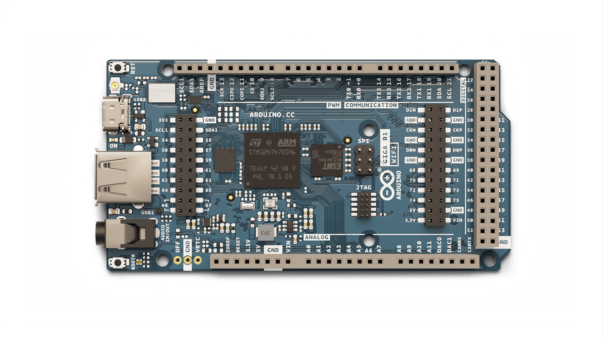
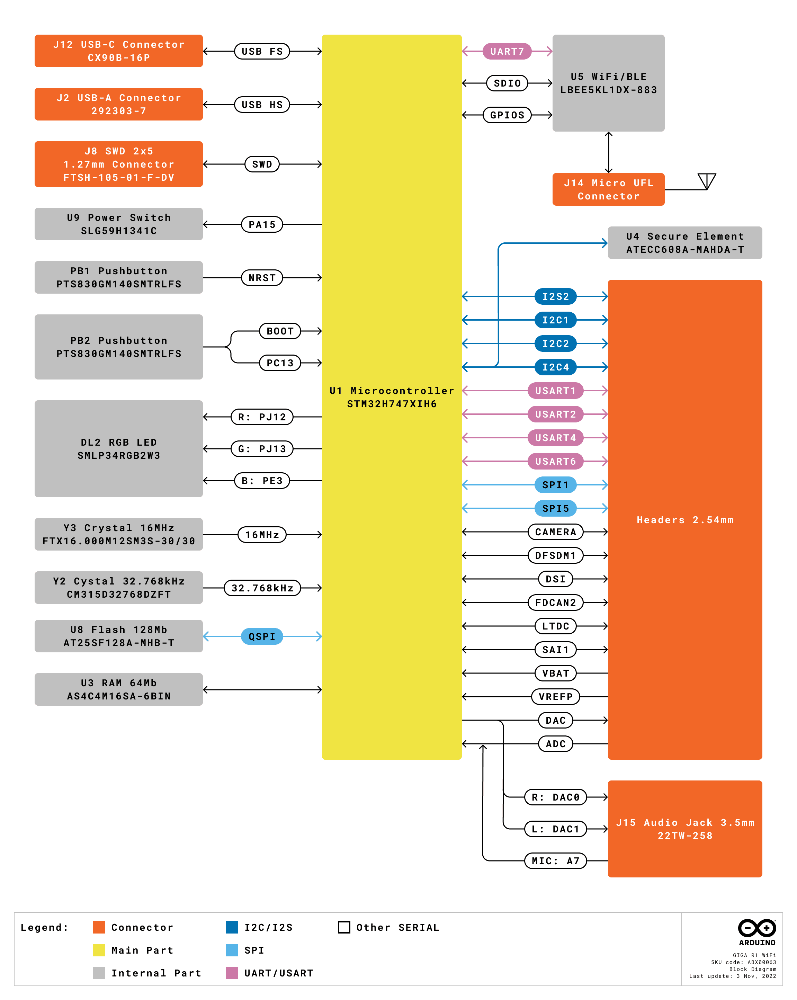
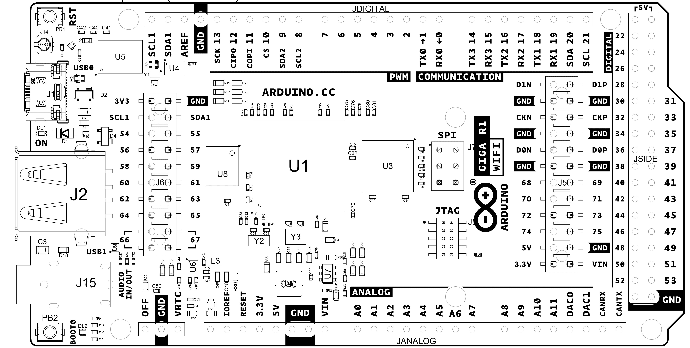
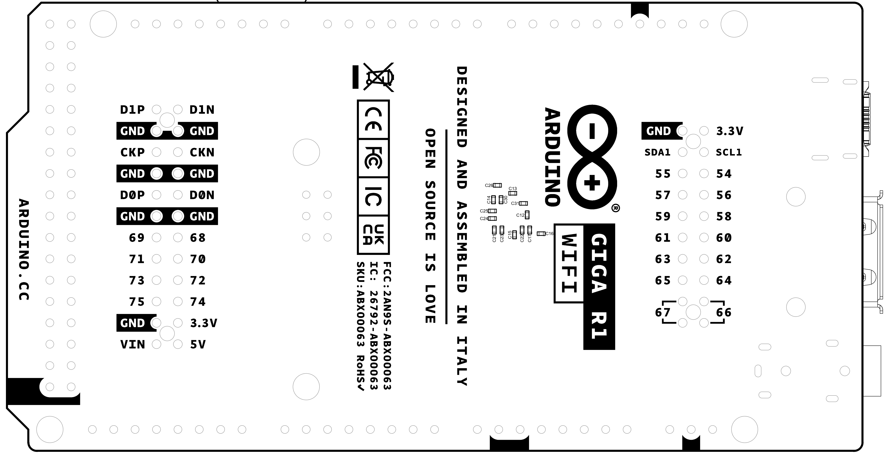
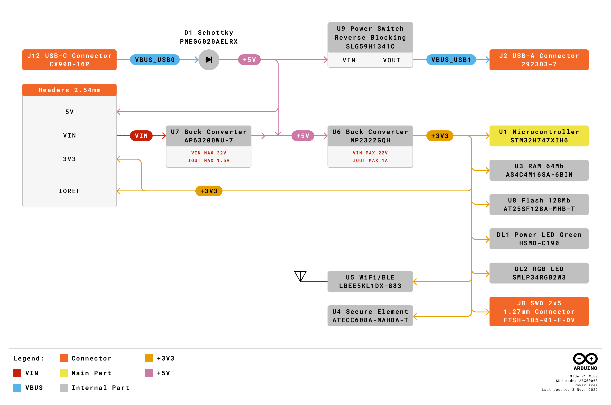
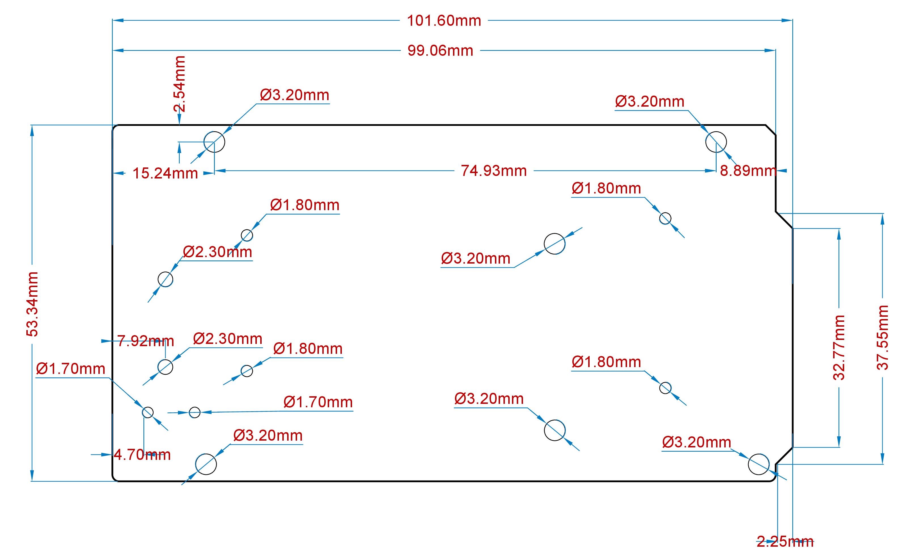

# 概要

Arduino® GIGA R1 WiFi は、STM32H7 の性能を Mega フォームファクタにもたらし、オンボードの Wi‑Fi® と Bluetooth® 接続を備えた初の Mega ボードです。ピンヘッダから容易にアクセスできる 76 本のデジタル入出力（うち 13 本は PWM 対応）、14 本のアナログ入力、2 系統のアナログ出力（DAC）を提供します。デュアルコア Arm® Cortex®‑M7 / Arm® Cortex®‑M4 を搭載した STM32 マイクロプロセッサは、オンボードメモリやオーディオジャックとあいまって、エッジでの機械学習や信号処理を可能にします。

# 対象分野

3D プリンティング、信号処理、メイカー、ロボティクス

# 機能

- **STM32H747XIH6** Microcontroller
  - デュアルコア
    - 32 ビット Arm® Cortex®‑M7 コア（倍精度 FPU および L1 キャッシュ、最大 480 MHz）
    - 32 ビット Arm® Cortex®‑M4 コア（FPU 搭載、最大 240 MHz）
  - DSP 命令セットをフル実装
  - メモリ保護ユニット（MPU）
- **Murata® 1DX** Wi‑Fi®/Bluetooth® Module
  - Wi‑Fi® 802.11b/g/n（65 Mbps）
  - Bluetooth® Low Energy（Cordio スタックによるバージョン 5.X、Arduino Stack によるバージョン 4.2）
  - 外部アンテナ用 Micro UFL コネクタ
- **Memory**
  - **STM32H747XI**
    - 2 MB Flash
    - 1 MB RAM
  - **AT25SF128A‑MHB‑T**
    - 16 MB NOR Flash
    - QSPI インターフェース
  - **AS4C4M16SA**
    - 8 MB SDRAM
- **I/O**
  - デジタル I/O ピン: 76
  - アナログ入力ピン: 12
  - PWM ピン: 13
  - アナログ出力ピン（DAC0/DAC1）: 2
  - USB ホスト: USB 2.0 Type A
  - USB デバイス: USB‑C®
  - ロジックレベル: 3.3V
  - VRTC: ボードがオフの間に RTC へ電源供給
  - OFF ピン: ボードの電源を切る
- **Communication**
  - 4x UART
  - 3x I2C
  - 2x SPI
  - 1x CAN（外部トランシーバが必要）
- **Secure Element** ATECC608A‑MAHDA‑T モジュール
- **USB**
  - **USB Host** USB 2.0 Type A
    - ホスト
  - **USB Peripheral** USB‑C®
    - プログラミング用ポート
    - HID
- **Connectors**
  - カメラ: 20 ピン Arducam カメラコネクタ
  - ディスプレイ: D1N, D0N, D1P, D0P, CKN, CKP, D68–D75
  - オーディオジャック: DAC0, DAC1, A7
  - JTAG コネクタ
- **Power**
  - 回路動作電圧: 3.3V
  - 入力電圧（VIN）: 6–24V
  - I/O ピン当たりの DC 電流: 8 mA

# 目次

# ボード

## アプリケーション例

GIGA R1 WiFi は Portenta H7 と Mega 2560 の長所を兼ね備えています。ピンから容易にアクセスできる豊富な I/O により、新しいアイデアやソリューションの迅速な試作が可能です。STM32H7 は機械学習タスクを処理するのに十分な性能を備えています。オンボードのセキュアエレメントと無線接続により、Arduino Cloud を活用した IoT プロジェクトにも適しています。

- **3D Printing:** Mega フォームファクタは 3D プリンタの構築で高い人気があります。高分解能の ADC インターフェースにセンサを接続して、3D プリント工程を高性能にセンシングできます。デュアルコアの計算能力と組み合わせて、これまでにない制御を実現。フィラメント使用量や印刷状況を、Bluetooth® によるローカル監視または Arduino Cloud などのサードパーティサービスとその Wi‑Fi® 機能を利用して世界中から監視できます。
- **Audio Processing:** GIGA R1 WiFi は 3.5 mm のオーディオ入出力を備え、環境中の音声信号と容易に相互作用できます。ボード上で直接、音声信号の解析と生成が可能です。マイクを接続して、幅広いデジタル／アナログデバイスを制御しましょう。独自の楽器を作り、各種入力で音程を変えることもできます。Arduino Cloud などのサードパーティサービスと連携すれば、オンラインコンサートを実現し、世界中の人々とつながれます。
- **Data acquisition device:** 多数のアナログ入力（ジャックコネクタ（J15）を含む）と、最大 12 ビットの分解能を持つ 2 系統の DAC 出力により、独自のデータ収集装置を構築できます。自作のマルチメータやオシロスコープを作成し、Arduino Cloud などのサードパーティサービスでオンラインダッシュボードを作成可能。独自の電気化学実験を設計し、任意の電流／電圧波形を印加して、自宅にいながら実験の状態を確認できます。

## 付属品

- Micro UFL アンテナ（同梱）
- USB‑C® ケーブル（同梱なし）
- USB 2.0 Type‑A ケーブル（同梱なし）

## 関連製品

- Arduino Mega Proto Shield Rev3 (A000080)
- Arduino 4 Relays Shield (A000110)
- Arduino Motor Shield Rev3 (A000079)

# 定格

## 推奨動作条件

| 記号            | 説明                       | 最小               | 典型的な | 最大               | 単位 |
| --------------- | -------------------------- | ------------------ | -------- | ------------------ | ---- |
| VIN  | 入力電圧（VIN パッドから） | 6                  | 7.0      | 32                 | V    |
| VUSB | 入力電圧（USB コネクタから | 4.8                | 5.0      | 5.5                | V    |
| VDD  | 入力 High レベル電圧       | 0.7*VDD |          | VDD     | V    |
| VIL  | 入力 Low レベル電圧        | 0                  |          | 0.3*VDD | V    |
| TOP  | 動作温度                   | -40                | 25       | 85                 | °C   |

**注記:** VDD はロジックレベルを制御しており、3.3V 電源レールに接続されています。VAREF はアナログロジック用です。

# 機能概要

## ブロック図

## ボードトポロジー

### 表面図

| **参照記号** | **説明**                                     | **参照記号** | **説明　**                              |
| ------------ | -------------------------------------------- | ------------ | --------------------------------------- |
| U1           | STM32H7 デュアルコア マイクロコントローラ IC | U8           | AT25SF128A‑MHB‑T 16 MB フラッシュ IC    |
| U3           | AS4C4M16SA 8MB SDRAM IC                      | U4           | ATECC608A-MAHDA-T セキュアエレメント IC |
| U5           | LBEE5KL1DX-883 Wi-Fi®/Bluetooth® モジュール  | U6           | MP2322GQH 降圧コンバータ 3.3V IC        |
| U7           | MP2269GD‑Z 降圧コンバータ 5V IC              | JANALOG      | アナログ入出力ヘッダ                    |
| JDIGITAL     | デジタル入出力ヘッダ                         | JSIDE        | デジタル入出力ヘッダ                    |
| SPI          | SPI ヘッダ                                   | JTAG         | JTAG ヘッダ                             |
| J2           | USB 2.0 A ホスト                             | J15          | 3.5 mm オーディオ入出力                 |
| PB1          | RESET ボタン                                 | PB2          | BOOT0 ボタン                            |
| J14          | Micro UFL コネクタ                           | J5           | カメラ                                  |
| J6           | カメラ                                       | DL1          | 電源 LED                                |
| DL2          | RGB SMLP34RGB2W3 コモンアノード LED          | J12          | CX90B-16P USB-C® コネクタ               |

### 裏面図

## プロセッサ

GIGA R1 WiFi のメインプロセッサはデュアルコア **STM32H747 (U1)** で、480 MHz で動作する Arm® Cortex®‑M7 と、240 MHz で動作する Arm® Cortex®‑M4 を含みます。両コアは、各プロセッサ間で関数呼び出しをシームレスに行える _リモートプロシージャコール_ 機構を介して通信します。

## Wi‑Fi®/Bluetooth® 接続

Murata® **LBEE5KL1DX‑883** ワイヤレスモジュール（U5）は、Cypress CYW4343W をベースに、超小型パッケージで Wi‑Fi® と Bluetooth® の同時提供を実現します。IEEE 802.11 b/g/n の Wi‑Fi® インターフェースは、アクセスポイント（AP）、ステーション（STA）、または AP/STA の同時デュアルモードとして動作可能で、最大 65 Mbps の転送速度をサポートします。Bluetooth® インターフェースは Bluetooth® Classic と Bluetooth® Low Energy をサポートします。内蔵のアンテナ回路スイッチにより、単一の外部アンテナ（J14）を Wi‑Fi® と Bluetooth® で共有できます。

## オンボードメモリ

GIGA R1 WiFi は、STM32H747（U1）上の 2 MB Flash と 1 MB SRAM に加えて、**AT25SF128A‑MHB‑T（U8）** による 16 MB の NOR Flash と、**AS4C4M16SA（U3）** による 8 MB の SDRAM を備えています。U8 は Quad‑SPI インターフェース経由でメインプロセッサ（U1）に接続され、U3 は 166 MHz で動作します。

## USB コネクタ

GIGA R1 WiFi には 2 つの USB ポートが用意されています。USB 2.0 Type A（J2）と USB‑C®（J12）です。USB 2.0 コネクタは外部デバイスをペリフェラルとして接続でき、USB‑C® コネクタは GIGA ボードを他デバイスのペリフェラルとして接続できます。USB‑C® コネクタ（J12）の SuperSpeed ピンは実装されていない点に注意してください。各コネクタの VBUS には、ESD 保護のために TVS ダイオードアレイ（D4、D2）を配置しています。

## オーディオ

**STM32H7（U1）** には 2 系統の DAC があり、3.5 mm ジャックコネクタ（J15）のステレオオーディオ出力を駆動します。各 DAC の分解能は最大 12 ビットです。左右のチャンネルは、それぞれ DAC0 と DAC1 のピンからもアクセスできます。ジャックコネクタ（J15）にはマイク入力もあり、アナログピン A7 と共有されています。STM32H7 の _Buffered mode_ は低インピーダンス出力を可能にし、_Sample and hold_ 機能は消費電力の低減に寄与します。最大 10 メガサンプル/秒をサポートします。

# 電源ツリー

電源は VIN ピン、または USB コネクタ（J2、J12）の 5V から供給できます。VIN から供給する場合、MP2269GD‑Z（U7）降圧コンバータで電圧を 5V に降下させます。5V 電源レールは、続いて MP2322GQH（U6)降圧コンバータで 3.3V に降下されます。GIGA R1 WiFi 上のコンポーネントのロジックレベルは 3.3V です。

# ボードの動作

## はじめに - IDE

オフラインで GIGA R1 WiFi をプログラムする場合は、Arduino Desktop IDE **[1]** をインストールする必要があります。GIGA R1 WiFi をコンピュータへ接続するには Type‑C® USB ケーブルが必要で、このケーブルはボードへの電源供給も行います（LED（DL1）が点灯）。

## はじめに - Arduino Cloud Editor

すべての Arduino ボード（本製品を含む）は、簡単なプラグインをインストールするだけで Arduino Cloud Editor **[2]** でそのまま動作します。  
Arduino Cloud Editor はオンラインでホストされているため、常に最新の機能とすべてのボードのサポートが提供されます。ブラウザ上でコーディングを開始し、スケッチをボードへ書き込むには **[3]** に従ってください。

## はじめに - Arduino Cloud

すべての Arduino IoT 対応製品は Arduino Cloud に対応しており、センサーデータの記録・グラフ化・解析、イベントのトリガ、家庭やビジネスの自動化が可能です。

## オンラインリソース

基礎を理解したら、Arduino Project Hub **[4]** の刺激的なプロジェクトや、Arduino Library Reference **[5]**、オンラインストア **[6]** をチェックして、ボードをセンサー、アクチュエータなどで拡張しましょう。

## ボードの復旧

すべての Arduino ボードには USB 経由でフラッシュできるブートローダが内蔵されています。もしスケッチがプロセッサをロックし、USB で見えなくなった場合でも、電源投入直後にリセットボタンをダブルタップすることでブートローダモードへ入ることができます。

# 機械情報

## ピン配置

### 三ピンヘッダ - J1

| ピン | 機能 | タイプ  | 説明                           |
| ---- | ---- | ------- | ------------------------------ |
| 1    | OFF  | Digital | 3V3 イネーブルピン (U6)        |
| 2    | GND  | Power   | Ground                         |
| 3    | VRTC | Reset   | リアルタイムクロック用バッテリ |

### アナログ

| ピン | 機能  | タイプ  | 説明                                   |
| ---- | ----- | ------- | -------------------------------------- |
| 1    | NC    | NC      | 接続されていません                     |
| 2    | IOREF | IOREF   | デジタルロジック V の基準（3.3V に接続 |
| 3    | Reset | Reset   | Reset                                  |
| 4    | +3V3  | Power   | 電源レール                             |
| 5    | +5V   | Power   | +5V 電源レール                         |
| 6    | GND   | Power   | Ground                                 |
| 7    | GND   | Power   | Ground                                 |
| 8    | VIN   | Power   | 電源入力                               |
| 9    | A0    | Analog  | アナログ入力 0 /GPIO                   |
| 10   | A1    | Analog  | アナログ入力 1 /GPIO                   |
| 11   | A2    | Analog  | アナログ入力 2 /GPIO                   |
| 12   | A3    | Analog  | アナログ入力 3 /GPIO                   |
| 13   | A4    | Analog  | アナログ入力 4 /GPIO                   |
| 14   | A5    | Analog  | アナログ入力 5 /GPIO                   |
| 15   | A6    | Analog  | アナログ入力 6 /GPIO                   |
| 16   | A7    | Analog  | アナログ入力 7 /GPIO                   |
| 17   | A8    | Analog  | アナログ入力 8 /GPIO                   |
| 18   | A9    | Analog  | アナログ入力 9 /GPIO                   |
| 19   | A10   | Analog  | アナログ入力 10 /GPIO                  |
| 20   | A11   | Analog  | アナログ入力 11 /GPIO                  |
| 21   | DAC0  | Analog  | デジタル‑アナログコンバータ 0          |
| 22   | DAC1  | Analog  | デジタル‑アナログコンバータ 1          |
| 23   | CANRX | Digital | CAN バス受信                           |
| 24   | CANTX | Digital | CAN バス送信                           |

### デジタル

| ピン | 機能     | タイプ   | 説明                                             |
| ---- | -------- | -------- | ------------------------------------------------ |
| 1    | D21/SCL1 | デジタル | GPIO 21/I2C 1 クロック                           |
| 2    | D20/SDA1 | デジタル | GPIO 20/I2C 1 データライン                       |
| 3    | AREF     | デジタル | アナログ基準電圧                                 |
| 4    | GND      | 電源     | グランド                                         |
| 5    | D13/SCK  | デジタル | GPIO 13/SPI クロック (PWM~)                      |
| 6    | D12/CIPO | デジタル | GPIO 12/SPI コントローラ入力 周辺機器出力 (PWM~) |
| 7    | D11/COPI | デジタル | GPIO 11/SPI コントローラ出力 周辺機器入力 (PWM~) |
| 8    | D10/CS   | デジタル | GPIO 10/SPI チップセレクト (PWM~)                |
| 9    | D9/SDA2  | デジタル | GPIO 9/I2C 2 データライン (PWM~)                 |
| 10   | D8/SCL2  | デジタル | GPIO 8/I2C 2 クロックライン (PWM~)               |
| 11   | D7       | デジタル | GPIO 7 (PWM~)                                    |
| 12   | D6       | デジタル | GPIO 6 (PWM~)                                    |
| 13   | D5       | デジタル | GPIO 5 (PWM~)                                    |
| 14   | D4       | デジタル | GPIO 4 (PWM~)                                    |
| 15   | D3       | デジタル | GPIO 3 (PWM~)                                    |
| 16   | D2       | デジタル | GPIO 2 (PWM~)                                    |
| 17   | D1/TX0   | デジタル | GPIO 1 / シリアル 0 送信機                       |
| 18   | D0/TX0   | デジタル | GPIO 0 / シリアル0受信機                         |
| 19   | D14/TX3  | デジタル | GPIO 14 / シリアル3送信機                        |
| 20   | D15/RX3  | デジタル | GPIO 15 / シリアル3受信機                        |
| 21   | D16/TX2  | デジタル | GPIO 16 / シリアル 2 送信機                      |
| 22   | D17/RX2  | デジタル | GPIO 17 / シリアル 2 受信機                      |
| 23   | D18/TX1  | デジタル | GPIO 18 / シリアル 1 送信機                      |
| 24   | D19/RX1  | デジタル | GPIO 19 / シリアル1 レシーバー                   |
| 25   | D20/SDA  | デジタル | GPIO 20 / I2C 0 データライン                     |
| 26   | D21/SCL  | デジタル | GPIO 21 / I2C 0 クロック                         |

### STM32 ICSP

| ピン | 機能  | タイプ | 説明                          |
| ---- | ----- | ------ | ----------------------------- |
| 1    | CIPO  | 内部   | コントローラ入力 周辺機器出力 |
| 2    | +5V   | 内部   | 5V電源                        |
| 3    | SCK   | 内部   | シリアルクロック              |
| 4    | COPI  | 内部   | コントローラ出力 周辺機器入力 |
| 5    | RESET | 内部   | リセット                      |
| 6    | GND   | 内部   | グランド                      |

### デジタルピン D22 - D53 左側 (LHS)

| ピン | 機能 | タイプ   | 説明          |
| ---- | ---- | -------- | ------------- |
| 1    | +5V  | 電源     | +5V電源レール |
| 2    | D22  | デジタル | GPIO 22       |
| 3    | D24  | デジタル | GPIO 24       |
| 4    | D26  | デジタル | GPIO 26       |
| 5    | D28  | デジタル | GPIO 28       |
| 6    | D30  | デジタル | GPIO 30       |
| 7    | D32  | デジタル | GPIO 32       |
| 8    | D34  | デジタル | GPIO 34       |
| 9    | D36  | デジタル | GPIO 36       |
| 10   | D38  | デジタル | GPIO 38       |
| 11   | D40  | デジタル | GPIO 40       |
| 12   | D42  | デジタル | GPIO 42       |

### デジタルピン D22 - D53 右側 (RHS)

| ピン | 機能 | タイプ   | 説明          |
| ---- | ---- | -------- | ------------- |
| 1    | +5V  | 電源     | +5V電源レール |
| 2    | D23  | デジタル | GPIO 23       |
| 3    | D25  | デジタル | GPIO 25       |
| 4    | D27  | デジタル | GPIO 27       |
| 5    | D29  | デジタル | GPIO 29       |
| 6    | D31  | デジタル | GPIO 31       |
| 7    | D33  | デジタル | GPIO 33       |
| 8    | D35  | デジタル | GPIO 35       |
| 9    | D37  | デジタル | GPIO 37       |
| 10   | D39  | デジタル | GPIO 39       |
| 11   | D41  | デジタル | GPIO 41       |
| 12   | D43  | デジタル | GPIO 43       |
| 13   | D45  | デジタル | GPIO 45       |
| 14   | D47  | デジタル | GPIO 47       |
| 15   | D49  | デジタル | GPIO 49       |
| 16   | D51  | デジタル | GPIO 51       |
| 17   | D53  | デジタル | GPIO 53       |
| 18   | GND  | 電源     | グランド      |

# 取付穴および基板外形

## 会社情報

| 会社名   | Arduino SRL                                      |
| -------- | ------------------------------------------------ |
| 会社住所 | Via Andrea Appiani, 25 - 20900 MONZA（イタリア） |

## 参考資料

| 参照                              | リンク                                                       |
| --------------------------------- | ------------------------------------------------------------ |
| Arduino IDE (デスクトップ)        | https://www.arduino.cc/en/Main/Software                      |
| Arduino Cloud Editor              | https://create.arduino.cc/editor                             |
| Arduino Cloud Editor - 入門ガイド | https://docs.arduino.cc/arduino-cloud/guides/editor/         |
| Arduino Project Hub               | https://create.arduino.cc/projecthub?by=part&part_id=11332&sort=trending |
| ライブラリリファレンス            | https://github.com/arduino-libraries/                        |
| オンラインストア                  | https://store.arduino.cc/                                    |

## 変更履歴

| **日付**       | **変更内容**                         |
| -------------- | ------------------------------------ |
| 2023年03月02日 | リリース                             |
| 2023年12月07日 | ピン配置更新                         |
| 2024年04月25日 | 新しいクラウドエディタへのリンク更新 |
| 2025年09月17日 | 認証更新                             |
| 2026年01月16日 | ISEDアンテナ仕様追加                 |
