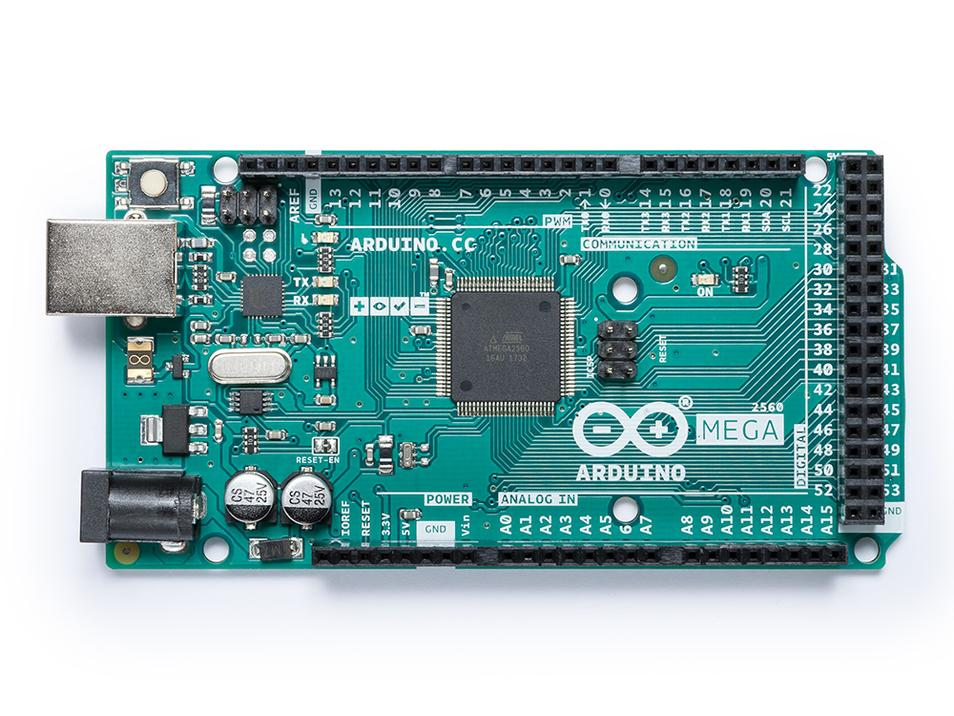
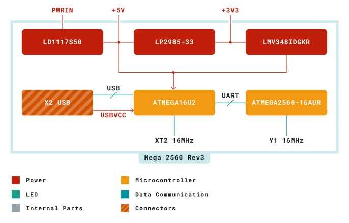
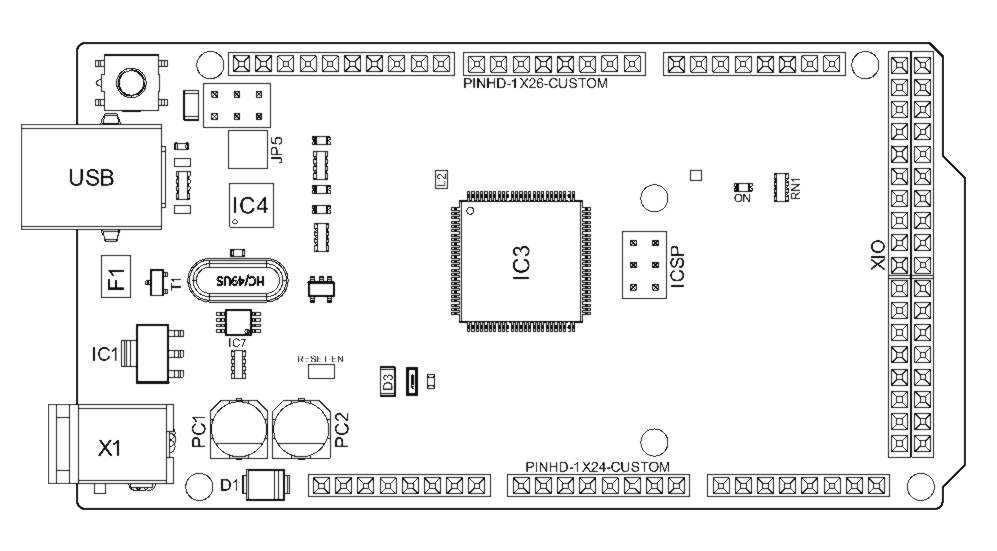
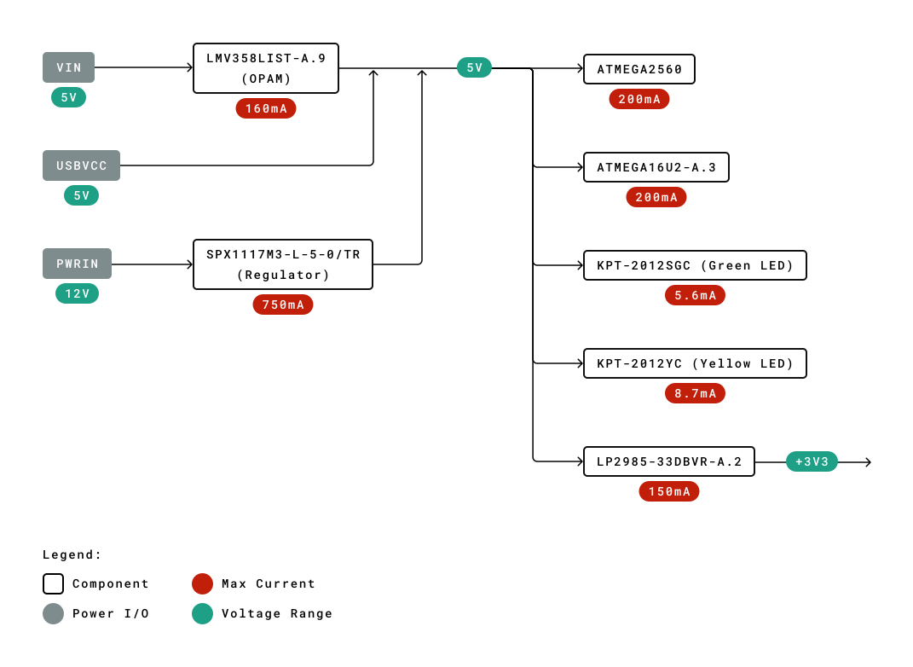
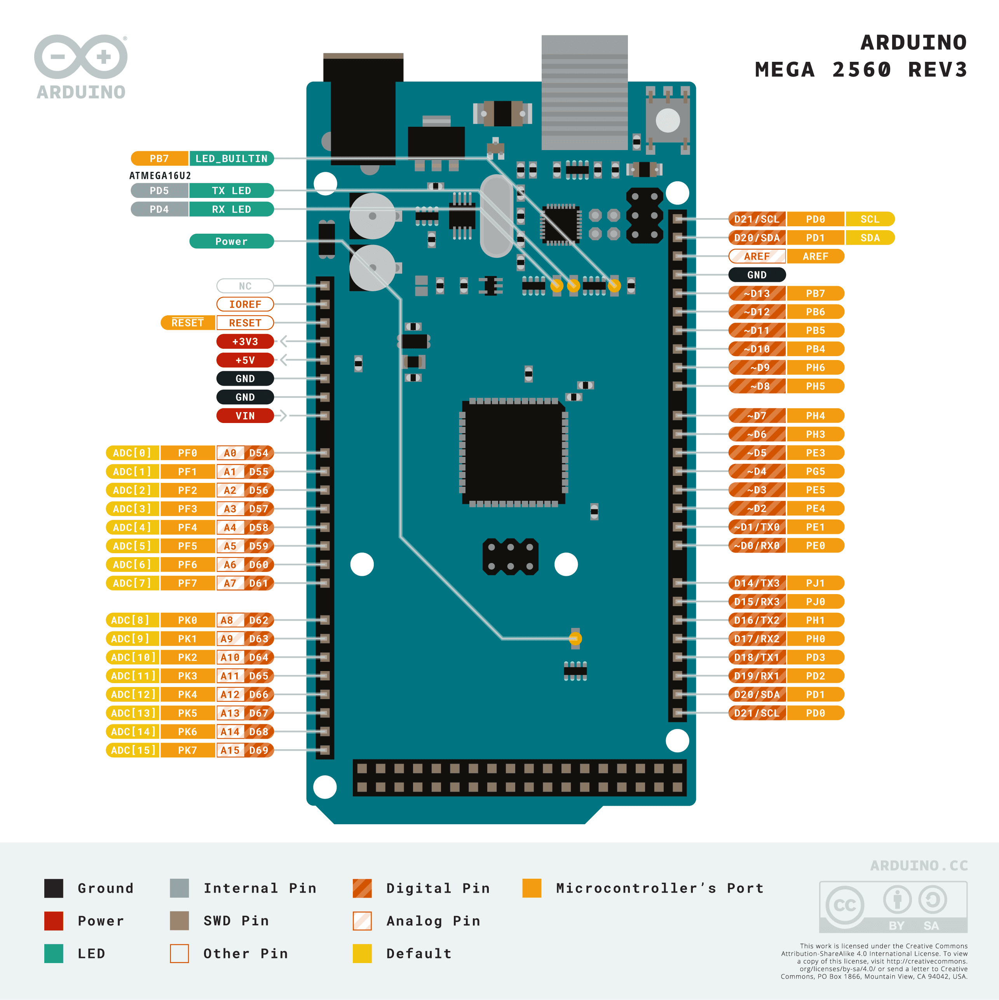
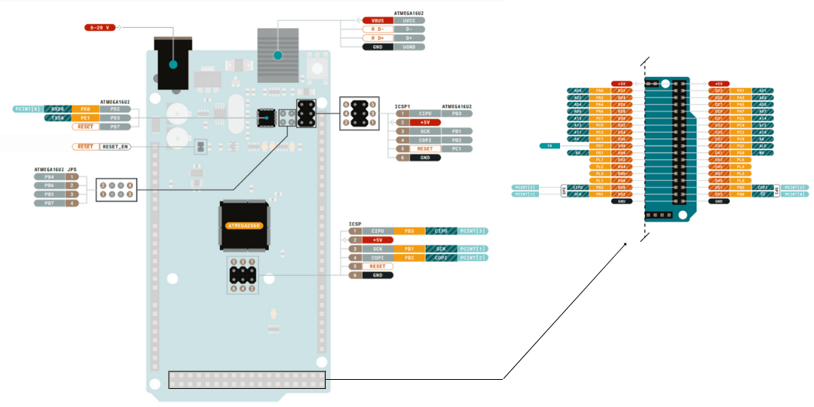
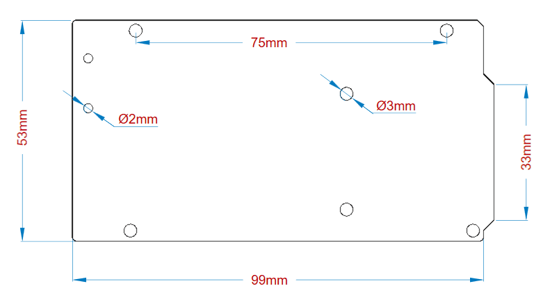
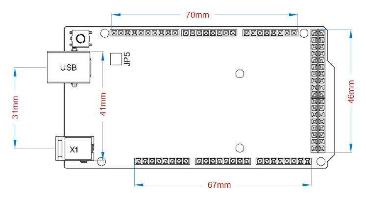

# 中文 (ZH)

# 描述
与 Arduino 的其他开发板相比，Arduino® Mega 2560 Rev3 是一款用于构建广泛应用的示范性开发板。该电路板内置 ATmega2560 微控制器，工作频率为 16 MHz。电路板包含 54 个数字输入/输出引脚、16 个模拟输入、4 个 UART（硬件串行端口）、一个 USB 连接、一个电源插孔、一个 ICSP 接头和一个复位按钮。 

# 目标领域：
3D 打印、机器人、创客

# 特点
- **ATmega2560 处理器**
    - 在 16MHz 的工作频率下吞吐量高达 16 MIPS
    - 256k 字节（其中 8k 字节用于引导加载程序）
    - 4k 字节 EEPROM
    - 8k 字节内部 SRAM
    - 32 × 8 通用工作寄存器
    - 带有独立振荡器的实时计数器
    - 四个 8 位 PWM 通道
    - 4 个可编程串行 USART
    - 控制器/外设 SPI 串行接口
- **ATmega16U2**
    - 在 16MHz 的工作频率下吞吐量高达 16 MIPS
    - 16k 字节 ISP 闪存
    - 512 字节 EEPROM
    - 512 字节 SRAM
    - 仅支持 SPI 主设备模式和硬件流控制 (RTS/CTS) 的 USART
    - 主/从 SPI 串行接口
- **休眠模式**
    - 空闲模式
    - ADC 降噪模式
    - 节能模式
    - 掉电模式
    - 待机模式
    - 扩展待机模式
- **电源**
    - USB 连接
    - 外部交流/直流适配器
- **输入/输出**
    - 54 个数字输入/输出引脚
    - 16 个模拟输入
    - 15 个 PWM 输出

# 目录

## 电路板简介

Mega 2560 Rev3 是 Arduino Mega 的一款升级版电路板，专门用于需要大量输入输出引脚和需要高处理能力的应用和项目。与传统的 Arduino® UNO 电路板相比，尽管两款电路板外形尺寸相似，但 Mega 2560 Rev3 的输入输出引脚数量要多得多。

### 应用示例

- **机器人**： Mega 2560 Rev3 具有高处理能力，可以处理大量机器人应用。它与电机控制器扩展板兼容，能够同时控制多个电机，因此非常适合机器人应用。其大量的 I/O 引脚也能容纳许多机器人传感器。

- **3D 打印**： 算法在 3D 打印机的实施过程中发挥着重要作用。Mega 2560 Rev3 能够处理 3D 打印所需的复杂算法。此外，使用 Arduino IDE 可以轻松地对代码进行细微修改，因此可以根据用户要求定制 3D 打印程序。

- **Wi-Fi**： 该电路板集成无线功能，增强了应用的实用性。Mega 2560 Rev3 与 Wi-Fi® 扩展板兼容，因此可以为 3D 打印和机器人应用提供无线功能。

### 配件

### 相关产品

- Arduino® UNO R3
- Arduino® Nano
- Arduino® Due（不带接头）

## 额定值

### 建议运行条件

| 符号          | 描述                          | 最小值 | 典型值 | 最大值 | 单位 |
| --------------- | ------------------------------------ | --- | --- | --- | ---- |
| VIN  | 来自 VIN 焊盘/DC 插孔的输入电压 | 7   | 7.0 | 12  | V    |
| VUSB | 来自 USB 连接器的输入电压     | 4.8 | 5.0 | 5.5 | V    |
| TOP  | 工作温度                | -40 | 25  | 85  | °C   |

## 功能概述

### 方框图

### 电路板拓扑结构
**前视图**

| **编号** | **描述**                  | **编号** | **描述**                  |
| -------- | -------------------------------- | -------- | -------------------------------- |
| USB      | USB B 连接器                  | F1       | 片式电容器                   |
| IC1      | 5V 线性稳压器              | X1       | 电源插孔连接器             |
| JP5      | 电镀通孔                     | IC4      | ATmega16U2 芯片                  |
| PC1      | 电解铝电容 | PC2      | 电解铝电容 |
| D1       | 通用整流器        | D3       | 通用二极管            |
| L2       | 固定电感器                   | IC3      | ATmega2560 芯片                  |
| ICSP     | 连接器接头                 | ON       | 绿色 LED                        |
| RN1      | 电阻器阵列                   | XIO      | 连接器                        |

### 处理器
Mega 2560 Rev3 电路板的主处理器是 ATmega2560 芯片，工作频率为 16 MHz。它提供了大量的输入和输出线路，可以连接许多外部设备。同时，由于它的 RAM 比其他处理器大得多，因此操作和处理速度不会减慢。该电路板上还配备一个 USB 串行处理器 ATmega16U2，它是 USB 输入信号与主处理器之间的接口。这增加了将外设连接到 Mega 2560 Rev3 电路板的灵活性。

### 电源树

## 电路板操作
### 入门指南 - IDE
如需在离线状态下对 Mega 2560 Rev3 进行编程，则需要安装 Arduino Desktop IDE **[1]** 若要将 Mega 2560 Rev3 连接到计算机，则需要使用 Type-B USB 电缆。如 LED 指示灯所示，该电缆还可以为电路板提供电源。

### 入门指南 - Arduino Cloud Editor
包括本电路板在内的所有 Arduino 电路板，都可以在 Arduino Cloud Editor **[2]**上开箱即用，只需安装一个简单的插件即可。

Arduino Cloud Editor 是在线托管的，因此它将始终提供最新功能并支持所有电路板。接下来**[3]**开始在浏览器上编码并将程序上传到您的电路板上。

### 示例程序
Mega 2560 Rev3 的示例程序可以在 Arduino IDE 的“示例”菜单或 Arduino 网站 **[4]** 的“文档”部分找到。

### 在线资源
现在，您已经了解该电路板的基本功能，就可以通过查看 Arduino Project Hub **[5]**、Arduino Library Reference **[6]** 和在线商店 **[7]** 上的精彩项目来探索它所提供的无限可能性；在这些项目中，您可以为电路板配备传感器、执行器等。

## 连接器引脚布局

### 模拟
| 引脚 | 功能 | 类型   | 描述                                     |
| --- | -------- | ------ | ----------------------------------------------- |
| 1   | NC       | NC     | 未连接                                   |
| 2   | IOREF    | IOREF  | 数字逻辑参考电压 V - 连接至 5V |
| 3   | Reset    | 复位  | 复位                                           |
| 4   | +3V3     | 电源  | +3V3 电源轨                                 |
| 5   | +5V      | 电源  | +5V 电源轨                                  |
| 6   | GND      | 电源  | 接地                                          |
| 7   | GND      | 电源  | 接地                                          |
| 8   | VIN      | 电源  | 电压输入                                   |
| 9   | A0       | 模拟 | 模拟输入0 / GPIO                            |
| 10  | A1       | 模拟 | 模拟输入1 / GPIO                            |
| 11  | A2       | 模拟 | 模拟输入2 / GPIO                            |
| 12  | A3       | 模拟 | 模拟输入3 / GPIO                            |
| 13  | A4       | 模拟 | 模拟输入4 / GPIO                            |
| 14  | A5       | 模拟 | 模拟输入5 / GPIO                            |
| 15  | A6       | 模拟 | 模拟输入6 / GPIO                            |
| 16  | A7       | 模拟 | 模拟输入7 / GPIO                            |
| 17  | A8       | 模拟 | 模拟输入8 / GPIO                            |
| 18  | A9       | 模拟 | 模拟输入9 / GPIO                            |
| 19  | A10      | 模拟 | 模拟输入10 / GPIO                           |
| 20  | A11      | 模拟 | 模拟输入11 / GPIO                           |
| 21  | A12      | 模拟 | 模拟输入12 / GPIO                           |
| 22  | A13      | 模拟 | 模拟输入13 / GPIO                           |
| 23  | A14      | 模拟 | 模拟输入14 / GPIO                           |
| 24  | A15      | 模拟 | 模拟输入15 / GPIO                           |
### 数字
| 引脚 | 功能 | 类型              | 描述                   |
| --- | -------- | ----------------- | ----------------------------- |
| 1   | D21/SCL  | 数字输入/I2C | 数字输入 21/I2C 数据线 |
| 2   | D20/SDA  | 数字输入/I2C | 数字输入 20/I2C 数据线 |
| 3   | AREF     | 数字           | 模拟参考电压      |
| 4   | GND      | 电源             | 接地                        |
| 5   | D13      | 数字/GPIO      | 数字输入 13/GPIO         |
| 6   | D12      | 数字/GPIO      | 数字输入 12/GPIO         |
| 7   | D11      | 数字/GPIO      | 数字输入 11/GPIO         |
| 8   | D10      | 数字/GPIO      | 数字输入 10/GPIO         |
| 9   | D9       | 数字/GPIO      | 数字输入 9/GPIO          |
| 10  | D8       | 数字/GPIO      | 数字输入 8/GPIO          |
| 11  | D7       | 数字/GPIO      | 数字输入 7/GPIO          |
| 12  | D6       | 数字/GPIO      | 数字输入 6/GPIO          |
| 13  | D5       | 数字/GPIO      | 数字输入 5/GPIO          |
| 14  | D4       | 数字/GPIO      | 数字输入 4/GPIO          |
| 15  | D3       | 数字/GPIO      | 数字输入 3/GPIO          |
| 16  | D2       | 数字/GPIO      | 数字输入 2/GPIO          |
| 17  | D1/TX0   | 数字/GPIO      | 数字输入 1/GPIO         |
| 18  | D0/Tx1   | 数字/GPIO      | 数字输入 0/GPIO         |
| 19  | D14      | 数字/GPIO      | 数字输入 14 /GPIO        |
| 20  | D15      | 数字/GPIO      | 数字输入 15 /GPIO        |
| 21  | D16      | 数字/GPIO      | 数字输入 16 /GPIO        |
| 22  | D17      | 数字/GPIO      | 数字输入 17 /GPIO        |
| 23  | D18      | 数字/GPIO      | 数字输入 18 /GPIO        |
| 24  | D19      | 数字/GPIO      | 数字输入 19/GPIO        |
| 25  | D20      | 数字/GPIO      | 数字输入 20/GPIO        |
| 26  | D21      | 数字/GPIO      | 数字输入 21/GPIO        |

### ATMEGA16U2 JP5
| 引脚 | 功能 | 类型     | 描述       |
| --- | -------- | -------- | ----------------- |
| 1   | PB4      | 内部 | 串行线调试 |
| 2   | PB6      | 内部 | 串行线调试 |
| 3   | PB5      | 内部 | 串行线调试 |
| 4   | PB7      | 内部 | 串行线调试 |

### ATMEGA16U2 ICSP1
| 引脚 | 功能 | 类型     | 描述                  |
| --- | -------- | -------- | ---------------------------- |
| 1   | CIPO     | 内部 | 控制器输入外设输出 |
| 2   | +5V      | 内部 | 5 V的电源           |
| 3   | SCK      | 内部 | 串行时钟                 |
| 4   | COPI     | 内部 | 控制器输出外设输入 |
| 5   | RESET    | 内部 | 复位                        |
| 6   | GND      | 内部 | 接地                       |

### 数字引脚 D22 - D53 LHS
| 引脚 | 功能 | 类型    | 描述           |
| --- | -------- | ------- | --------------------- |
| 1   | +5V      | 电源   | 5 V的电源    |
| 2   | D22      | 数字 | 数字输入 22/GPIO |
| 3   | D24      | 数字 | 数字输入 24/GPIO |
| 4   | D26      | 数字 | 数字输入 26/GPIO |
| 5   | D28      | 数字 | 数字输入 28/GPIO |
| 6   | D30      | 数字 | 数字输入 30/GPIO |
| 7   | D32      | 数字 | 数字输入 32/GPIO |
| 8   | D34      | 数字 | 数字输入 34/GPIO |
| 9   | D36      | 数字 | 数字输入 36/GPIO |
| 10  | D38      | 数字 | 数字输入 38/GPIO |
| 11  | D40      | 数字 | 数字输入 40/GPIO |
| 12  | D42      | 数字 | 数字输入 42/GPIO |
| 13  | D44      | 数字 | 数字输入 44/GPIO |
| 14  | D46      | 数字 | 数字输入 46/GPIO |
| 15  | D48      | 数字 | 数字输入 48/GPIO |
| 16  | D50      | 数字 | 数字输入 50/GPIO |
| 17  | D52      | 数字 | 数字输入 52/GPIO |
| 18  | GND      | 电源   | 接地                |

### 数字引脚 D22 - D53 LHS
| 引脚 | 功能 | 类型    | 描述           |
| --- | -------- | ------- | --------------------- |
| 1   | +5V      | 电源   | 5 V的电源    |
| 2   | D23      | 数字 | 数字输入 23/GPIO |
| 3   | D25      | 数字 | 数字输入 25/GPIO |
| 4   | D27      | 数字 | 数字输入 27/GPIO |
| 5   | D29      | 数字 | 数字输入 29/GPIO |
| 6   | D31      | 数字 | 数字输入 31/GPIO |
| 7   | D33      | 数字 | 数字输入 33/GPIO |
| 8   | D35      | 数字 | 数字输入 35/GPIO |
| 9   | D37      | 数字 | 数字输入 37/GPIO |
| 10  | D39      | 数字 | 数字输入 39/GPIO |
| 11  | D41      | 数字 | 数字输入 41/GPIO |
| 12  | D43      | 数字 | 数字输入 43/GPIO |
| 13  | D45      | 数字 | 数字输入 45/GPIO |
| 14  | D47      | 数字 | 数字输入 47/GPIO |
| 15  | D49      | 数字 | 数字输入 49/GPIO |
| 16  | D51      | 数字 | 数字输入 51/GPIO |
| 17  | D53      | 数字 | 数字输入 53/GPIO |
| 18  | GND      | 电源   | 接地                |

## 机械层信息

### 电路板外形图

### 电路板安装孔

# Certifications

## Declaration of Conformity CE DoC (EU)

We declare under our sole responsibility that the products above are in conformity with the essential requirements of the following EU Directives and therefore qualify for free movement within markets comprising the European Union (EU) and European Economic Area (EEA). 

## Declaration of Conformity to EU RoHS & REACH 211 01/19/2021
Arduino boards are in compliance with RoHS 2 Directive 2011/65/EU of the European Parliament and RoHS 3 Directive 2015/863/EU of the Council of 4 June 2015 on the restriction of the use of certain hazardous substances in electrical and electronic equipment. 

| **Substance**                          | **Maximum Limit (ppm)** |
| -------------------------------------- | ----------------------- |
| Lead (Pb)                              | 1000                    |
| Cadmium (Cd)                           | 100                     |
| Mercury (Hg)                           | 1000                    |
| Hexavalent Chromium (Cr6+)             | 1000                    |
| Poly Brominated Biphenyls (PBB)        | 1000                    |
| Poly Brominated Diphenyl ethers (PBDE) | 1000                    |
| Bis(2-Ethylhexyl} phthalate (DEHP)     | 1000                    |
| Benzyl butyl phthalate (BBP)           | 1000                    |
| Dibutyl phthalate (DBP)                | 1000                    |
| Diisobutyl phthalate (DIBP)            | 1000                    |

Exemptions : No exemptions are claimed. 

Arduino Boards are fully compliant with the related requirements of European Union Regulation (EC) 1907 /2006 concerning the Registration, Evaluation, Authorization and Restriction of Chemicals (REACH). We declare none of the SVHCs (https://echa.europa.eu/web/guest/candidate-list-table), the Candidate List of Substances of Very High Concern for authorization currently released by ECHA, is present in all products (and also package) in quantities totaling in a concentration equal or above 0.1%. To the best of our knowledge, we also declare that our products do not contain any of the substances listed on the "Authorization List" (Annex XIV of the REACH regulations) and Substances of Very High Concern (SVHC) in any significant amounts as specified by the Annex XVII of Candidate list published by ECHA (European Chemical Agency) 1907 /2006/EC.

## Conflict Minerals Declaration 
As a global supplier of electronic and electrical components, Arduino is aware of our obligations with regards to laws and regulations regarding Conflict Minerals, specifically the Dodd-Frank Wall Street Reform and Consumer Protection Act, Section 1502. Arduino does not directly source or process conflict minerals such as Tin, Tantalum, Tungsten, or Gold. Conflict minerals are contained in our products in the form of solder, or as a component in metal alloys. As part of our reasonable due diligence Arduino has contacted component suppliers within our supply chain to verify their continued compliance with the regulations. Based on the information received thus far we declare that our products contain Conflict Minerals sourced from conflict-free areas. 

## FCC Caution
Any Changes or modifications not expressly approved by the party responsible for compliance could void the user’s authority to operate the equipment.

This device complies with part 15 of the FCC Rules. Operation is subject to the following two conditions: 

(1) This device may not cause harmful interference

(2) this device must accept any interference received, including interference that may cause undesired operation.

**FCC RF Radiation Exposure Statement:**

1. This Transmitter must not be co-located or operating in conjunction with any other antenna or transmitter.

2. This equipment complies with RF radiation exposure limits set forth for an uncontrolled environment.

3. This equipment should be installed and operated with minimum distance 20cm between the radiator & your body.

English: 
User manuals for licence-exempt radio apparatus shall contain the following or equivalent notice in a conspicuous location in the user manual or alternatively on the device or both. This device complies with Industry Canada licence-exempt RSS standard(s). Operation is subject to the following two conditions:

(1) this device may not cause interference

(2) this device must accept any interference, including interference that may cause undesired operation of the device.

French: 
Le présent appareil est conforme aux CNR d’Industrie Canada applicables aux appareils radio exempts de licence. L’exploitation est autorisée aux deux conditions suivantes :

(1) l’ appareil nedoit pas produire de brouillage

(2) l’utilisateur de l’appareil doit accepter tout brouillage radioélectrique subi, même si le brouillage est susceptible d’en compromettre le fonctionnement.

**IC SAR Warning:**

English 
This equipment should be installed and operated with minimum distance 20 cm between the radiator and your body.  

French: 
Lors de l’ installation et de l’ exploitation de ce dispositif, la distance entre le radiateur et le corps est d ’au moins 20 cm.

**Important:** The operating temperature of the EUT can’t exceed 85℃ and shouldn’t be lower than -40℃.

Hereby, Arduino S.r.l. declares that this product is in compliance with essential requirements and other relevant provisions of Directive 201453/EU. This product is allowed to be used in all EU member states. 

## Company Information

| Company name    | Arduino S.r.l.                                            |
| --------------- | --------------------------------------------------------- |
| Company Address | Arduino SRL, Via Andrea Appiani 25, 20900 Monza MB, Italy |

## Reference Documentation

| Ref                                    | Link                                                                     |
| -------------------------------------- | ------------------------------------------------------------------------ |
| Arduino IDE (Desktop)                  | https://www.arduino.cc/en/Main/Software                                  |
| Arduino Cloud Editor                   | https://create.arduino.cc/editor                                         |
| Arduino Cloud Editor - Getting Started | https://docs.arduino.cc/arduino-cloud/guides/editor/                     |
| Arduino Website                        | https://www.arduino.cc/                                                  |
| Arduino Project Hub                    | https://create.arduino.cc/projecthub?by=part&part_id=11332&sort=trending |
| Library Reference                      | https://www.arduino.cc/reference/en/libraries/                           |
| Online Store                           | https://store.arduino.cc/                                                |

## Revision History

| **Date**   | **Revision** | **Changes**                              |
| ---------- | ------------ | ---------------------------------------- |
| 29/09/2020 | 1            | First Release                            |
| 09/10/2023 | 2            | Updated recommended operating conditions |
| 25/04/2024 | 3            | Updated link to new Cloud Editor         |
| 12/10/2026 |      4       | Added note for Intended Use, and divided language |