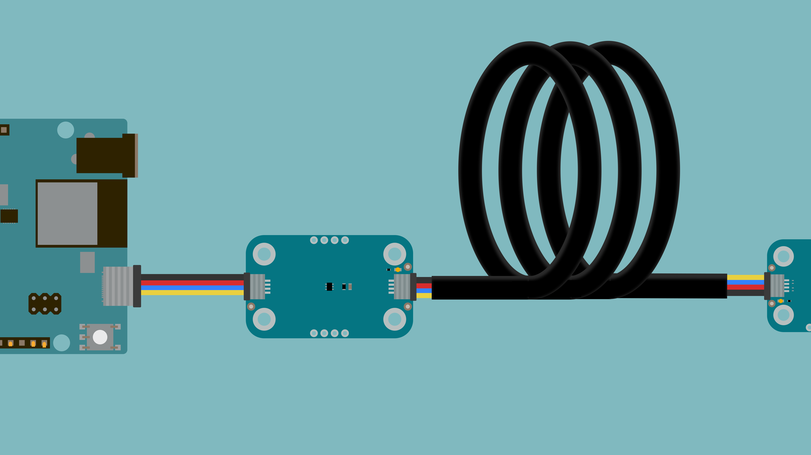
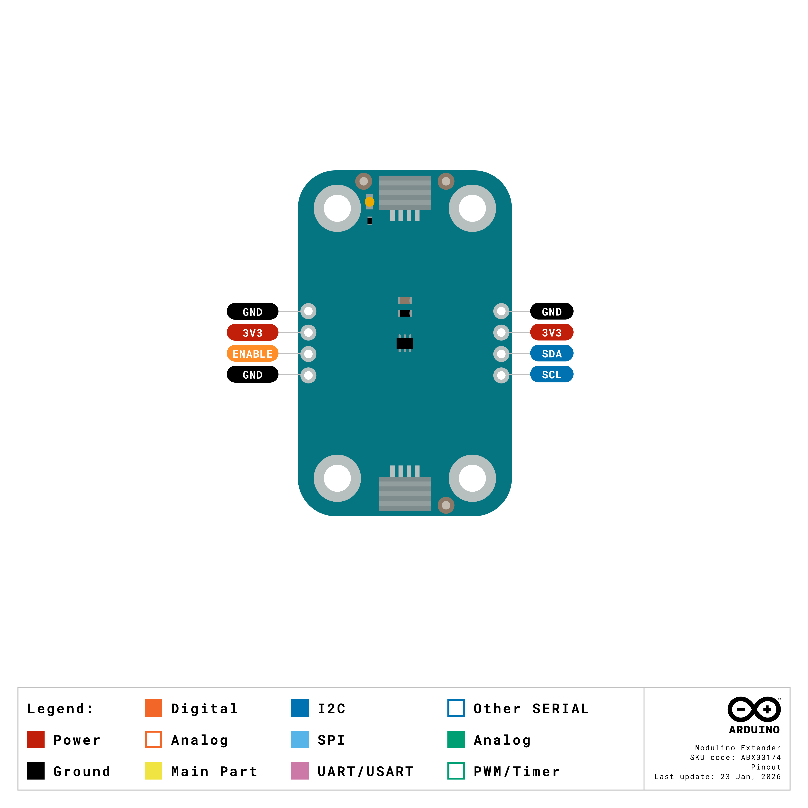
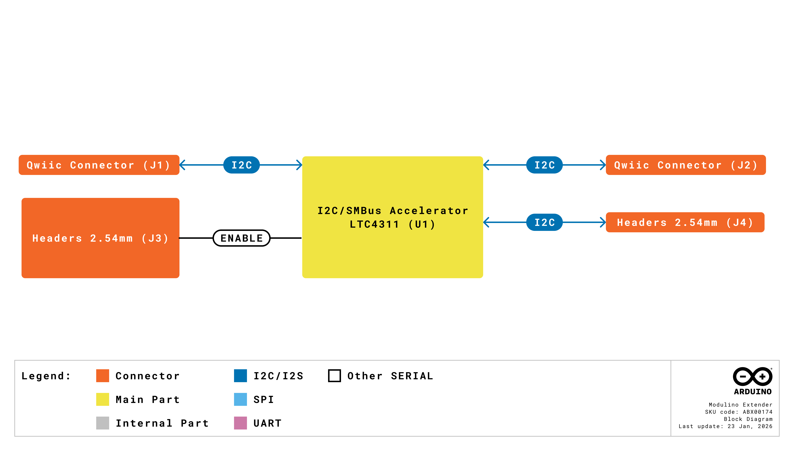
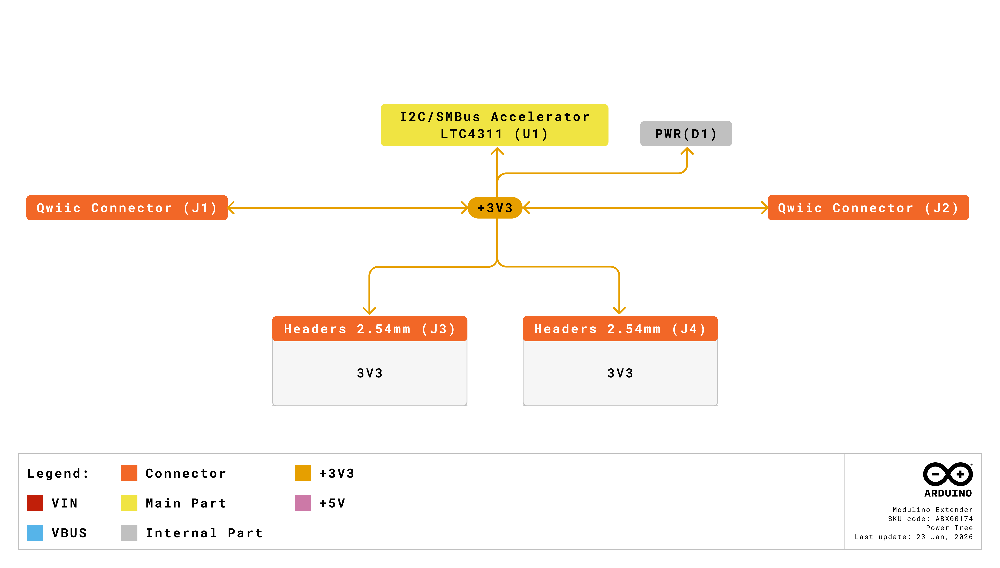

The Modulino Extender extends the reach of an I2C bus, allowing sensors and actuators to be placed far from the controller. Built around the LTC4311 I2C accelerator, it shortens the rise time of the I2C signals on long cable runs and on buses with many devices. The Extender has no I2C address and requires no configuration or code changes.

## Hardware Overview

### General Characteristics

The **Modulino Extender** is built around the **LTC4311** I2C/SMBus accelerator from Analog Devices. The LTC4311 is a dual active pull-up that connects in parallel to the SDA and SCL lines. During each rising edge, it supplies an additional slew-limited pull-up current that shortens the rise time of the line. This compensates for the capacitance added by long cables or by many devices on the same bus, which slows down rising edges when only pull-up resistors are present. The module does not buffer or repeat the I2C signals and has no I2C address, so the controller and the other devices on the bus do not detect it.

|      **Specification**      | **Details**                                                                            |
|:---------------------------:|----------------------------------------------------------------------------------------|
|       I2C accelerator       | Analog Devices LTC4311 (LTC4311ISC6#TRMPBF)                                            |
|      Operating voltage      | 3.3 V (supplied through the Qwiic connectors)                                          |
|        Supply current       | Approximately 1.5 mA, dominated by the power LED                                       |
|       Power indicator       | Green LED                                                                              |
| Maximum I2C clock frequency | 400 kHz (Fast-mode); the achievable frequency decreases with cable length and bus load |
|       Bus capacitance       | Supports loads beyond the 400 pF limit of the I2C specification                        |
|         I2C address         | None (transparent to the bus)                                                          |
|    Operating temperature    | -40 °C to +85 °C                                                                       |

These characteristics make the Extender suitable for sensor networks where devices are located far from the controller, for buses with many devices whose combined capacitance exceeds the I2C specification limit, and for remote installations of sensors and actuators.

### Pinout



#### Qwiic Connectors (2×, 1×4 Each)

| **Pin** | **Function**            |
|:-------:|-------------------------|
|   GND   | Ground                  |
|   3V3   | Power Supply (+3.3 VDC) |
|   SDA   | I2C Data                |
|   SCL   | I2C Clock               |

Both Qwiic connectors share the same I2C and power lines, so either connector can be used to connect the controller and the other to continue the bus toward the remote devices.

#### Optional Headers (2×, 1×4, Not Mounted)

The board includes two optional 1×4 headers. The first header (J4) exposes the I2C bus and power lines:

| **Pin** | **Function**   |
|:-------:|----------------|
|    1    | GND            |
|    2    | +3.3 VDC power |
|    3    | SDA            |
|    4    | SCL            |

The second header (J3) provides access to the `ENABLE` pin of the LTC4311:

| **Pin** | **Function**   |
|:-------:|----------------|
|    1    | GND            |
|    2    | +3.3 VDC power |
|    3    | ENABLE         |
|    4    | GND            |

The Modulino Extender does not include pull-up resistors on the SDA and SCL lines. The LTC4311 accelerates rising edges but does not replace the bus pull-up resistors, which must be present elsewhere on the bus, for example, on the host board or on the connected Modulino nodes.

The `ENABLE` pin controls the accelerator and is connected to +3.3 VDC through a 10 kΩ pull-up resistor, so the LTC4311 is enabled by default. Driving `ENABLE` low through the J3 header places the LTC4311 in a low-current shutdown mode in which it does not load the bus. The power LED remains on in this mode.

### Power Specifications

|         **Parameter**        |       **Condition**      | **Minimum** | **Typical** | **Maximum** | **Unit** |
|:----------------------------:|:------------------------:|:-----------:|:-----------:|:-----------:|:--------:|
|     Module supply voltage    | Through Qwiic connectors |      -      |     3.3     |      -      |     V    |
| LTC4311 supply voltage range |             -            |     1.6     |      -      |     5.5     |     V    |
|    LTC4311 supply current    |        ENABLE high       |      -      |     200     |      -      |    µA    |
|   LTC4311 shutdown current   |        ENABLE low        |      -      |      -      |      5      |    µA    |
|     Module supply current    |       Power LED on       |      -      |     1.5     |      -      |    mA    |

The +1.6 VDC to +5.5 VDC range applies to the LTC4311 itself. The Qwiic connectors and the Modulino nodes operate at +3.3 VDC; supplying +5 VDC through the Qwiic connectors would apply the same voltage to every device on the bus. When both SDA and SCL remain high, the LTC4311 enters an automatic standby mode that reduces its supply current.

### Block Diagram



The **LTC4311** connects in parallel to the SDA and SCL lines shared by both Qwiic connectors. When it detects a rising (low-to-high) transition on either line, it supplies an additional pull-up current that brings the line to the pull-up voltage faster. This keeps the signal edges sharp over long cables and heavily loaded buses. The block diagram shows the Qwiic connectors (J1 and J2) and the I2C header (J4) around the LTC4311; electrically, all of them share the same SDA and SCL lines.

### Power Tree



The +3.3 VDC line from the Qwiic connectors supplies the LTC4311 and the power LED directly, with no regulation stage, and is shared by both connectors and the optional headers. A 10 µF capacitor decouples the LTC4311 supply.

## Why Use the Modulino Extender?

I2C was designed for communication between devices located close to each other. Every cable and device added to the bus increases its capacitance, and since the lines are pulled high only through pull-up resistors, a higher capacitance results in slower rising edges. When the bus capacitance exceeds the 400 pF limit of the I2C specification, rising edges may become too slow for the selected clock frequency, which leads to communication errors. The Modulino Extender accelerates these rising edges, allowing devices to be placed farther from the controller.

A common use case is a long-distance installation, where sensors or actuators are located far from the controller, for example, environmental sensors in different rooms or distributed sensors in an industrial setting. In these cases, the Extender allows longer cable runs than a bus with pull-up resistors alone. The achievable distance depends on the cable, the I2C clock frequency, and the devices connected to the bus.

The Modulino Extender is also useful on buses with many devices. Even with short cables, the combined capacitance of several devices can exceed the I2C specification limit, and the accelerated rising edges help maintain signal integrity under these conditions.

## How to Connect the Modulino Extender

The Modulino Extender requires no configuration. To add it to an I2C bus, follow these steps:

1. Connect a Qwiic cable an Arduino board to one of the Qwiic connectors of the Modulino Extender.
2. Connect the remote device to the other Qwiic connector of the Modulino Extender.
3. For cable runs longer than a standard Qwiic cable, use the cable types described in the [Cable Requirements](#cable-requirements) section.


## Programming with Arduino

The Modulino Extender does not require any changes to the code. It has no I2C address, does not need a library or initialization, and works with any I2C device. Code written for Modulino nodes or other I2C devices runs without modification whether the Modulino Extender is present on the bus or not.

### Using Your Existing Code

The following example reads the distance measured by a Modulino Distance. The same code applies to both of these setups:

```text
Without the Extender: Arduino board → Qwiic cable → Modulino Distance
With the Extender:    Arduino board → Qwiic cable → Modulino Extender → long cable → Modulino Distance
```

```arduino
#include <Arduino_Modulino.h>

ModulinoDistance distance;

void setup() {
  Serial.begin(115200);
  Modulino.begin();
  distance.begin();
}

void loop() {
  if (distance.available()) {
    Serial.println(distance.get());
  }
  delay(100);
}
```

The `Modulino.begin()` function configures the I2C clock at 100 kHz. If an application requires a different clock frequency, call `setClock()` after `Modulino.begin()` on the same I2C interface used by the Modulino library; otherwise, the library setting overrides it. On the UNO R4 WiFi, Nano R4, UNO Q, and VENTUNO Q, this interface is `Wire1`; on other boards, it is `Wire`.

### What Actually Happens

The Extender connects in parallel to the SDA and SCL lines; it does not buffer or repeat the I2C signals. When the LTC4311 detects a rising edge on either line, it supplies an additional pull-up current that shortens the rise time. Signals in both directions benefit from the same acceleration, so the controller and the target devices communicate as if they were connected directly. This process takes place entirely in hardware and has no effect on the code.

## Cable Requirements

For runs longer than a standard Qwiic cable, use twisted-pair cable, preferably shielded, such as Cat5e or Cat6 cable. Longer cables add capacitance and propagation delay, so long cable runs may require a lower I2C clock frequency.

### Connecting Long Cables

Standard Qwiic cables use a 4-pin JST SH connector, while Cat5e and Cat6 cables are typically terminated with RJ45 connectors or connected through screw terminals. A long cable run therefore requires an adapter or a breakout between the cable and the Qwiic connectors at both ends. Alternatively, the cable can be wired directly to the optional J4 header of the Extender, which exposes the I2C bus and power lines.

When using twisted-pair cable, avoid placing SDA and SCL on the same pair, as this increases the crosstalk between the two lines. Pair each signal with a supply or ground conductor instead, for example, SDA with GND and SCL with +3.3 VDC.

### Supply Voltage Drop

The +3.3 VDC supply for the remote devices travels through the same cable as the I2C signals. Over long cable runs, the resistance of the supply and ground conductors causes a voltage drop proportional to the current drawn by the remote devices. Depending on the cable length and the load, the voltage at the remote end may fall below the operating range of the connected devices.

To reduce the voltage drop, use the spare conductors of the cable to double the +3.3 VDC and GND connections, and verify the supply voltage at the remote end with the devices connected and operating.


### Electrical Noise

Route I2C cables away from sources of electrical noise, such as motors, power supplies, and RF transmitters, and avoid running them parallel to power lines.

## Troubleshooting

### Communication Not Working

If the I2C devices do not respond through the Modulino Extender, first check that both Qwiic connections are secure and that the power LED of the Modulino Extender is on. If needed, measure the voltage between the +3.3 VDC and GND pins of the Modulino Extender and at the remote end of the cable, with the devices connected. If the J3 header is mounted and the ENABLE pin is wired, make sure that it is not driven low, as this disables the accelerator.

To determine whether the issue is related to the cable length, connect the remote device through a short Qwiic cable. If it works with the short cable, review the cable type and wiring described in the [Cable Requirements](#cable-requirements) section, and consider reducing the I2C clock frequency. The `begin()` function of a Modulino node, for example `distance.begin()`, returns `false` when the node is not detected on the bus, which helps confirm whether the device is reachable.

### Intermittent Communication

Intermittent communication usually indicates a signal integrity issue. Check the cable terminations and the connections to the adapters, and verify that the cable shield is intact. If the cable runs close to motors, power supplies, or RF transmitters, reroute it away from these sources. Reducing the cable length temporarily helps confirm whether the issue is caused by the cable run.

If the issue persists, check that the bus has pull-up resistors on the SDA and SCL lines, since the LTC4311 accelerates rising edges but does not replace them. The Modulino Extender does not include pull-up resistors, so they must be provided by the host board or by other devices on the bus.

### Unreliable Communication with Many Devices

On buses with many devices, the combined capacitance can still affect communication even with the Modulino Extender. In these cases, consider the following:

- Reduce the I2C clock frequency, as described in the [Using Your Existing Code](#using-your-existing-code) section. The Modulino library uses 100 kHz by default.
- Verify that every device on the bus has a unique I2C address.
- Divide the bus into segments using a Modulino Hub, which connects only one of its ports to the controller at a time.

## Conclusion

This tutorial showed how the Modulino Extender accelerates the rising edges of the I2C signals to extend communication over long cable runs and heavily loaded buses. Because the Extender has no I2C address and requires no configuration, existing code works without modification. For long installations, the choice of cable, the wiring of the signal pairs, the I2C clock frequency, and the supply voltage at the remote end are the main factors to consider.

For more information, refer to the following resources:

- [Modulino Extender product page](https://docs.arduino.cc/hardware/modulino-extender)
- [LTC4311 product page and datasheet (Analog Devices)](https://www.analog.com/en/products/ltc4311.html)
- [I2C-bus specification and user manual (NXP UM10204)](https://www.nxp.com/docs/en/user-guide/UM10204.pdf)