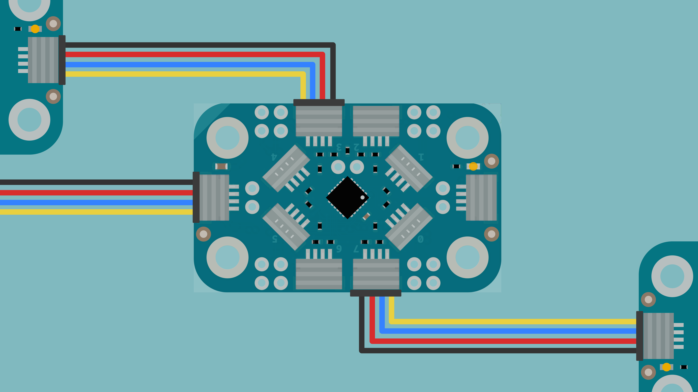
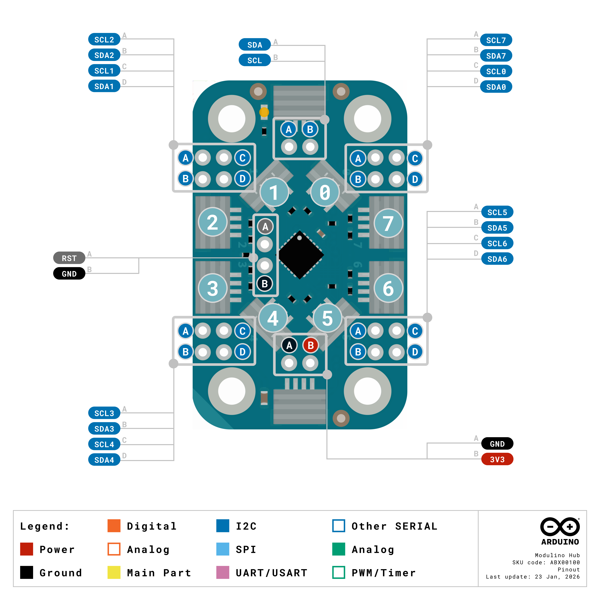
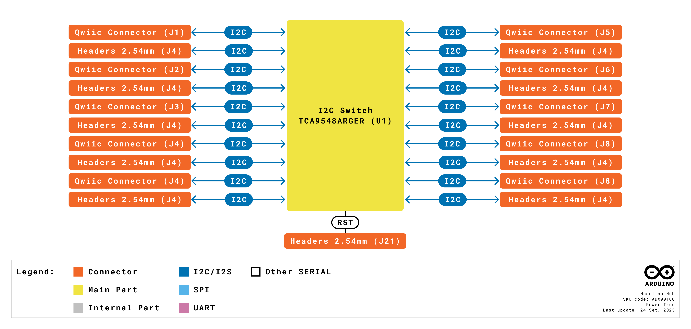
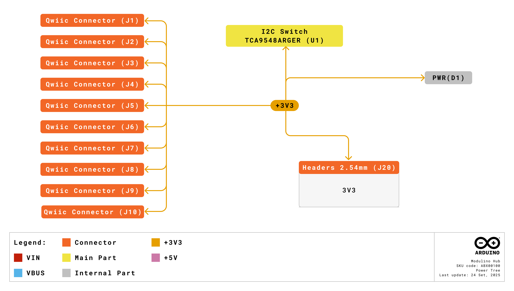
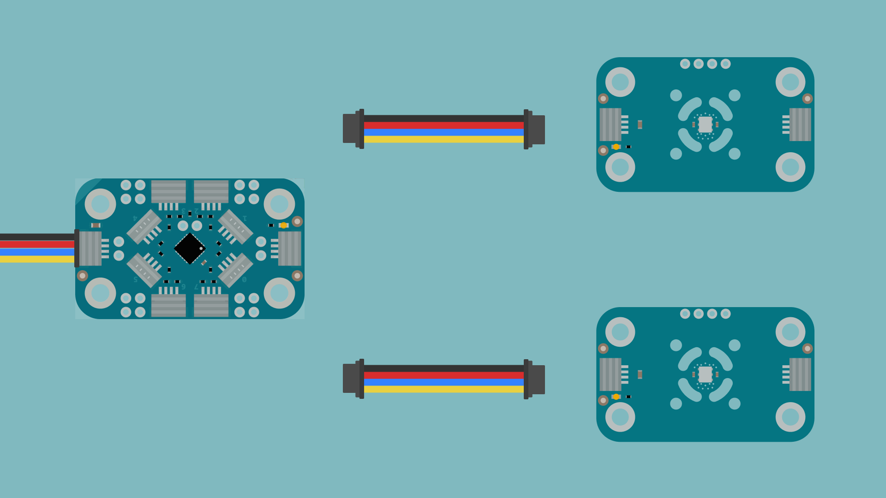

The Modulino Hub is an I2C multiplexer that provides eight independent I2C channels. It allows several devices with the same I2C address to be used in the same project and helps organize larger I2C networks into separate bus segments. This tutorial describes the hardware of the Modulino Hub and shows how to use it with Modulino nodes and other I2C devices, using both the Arduino and MicroPython libraries.

## Why Use the Modulino Hub?

Each device on an I2C bus is identified by its address. When two devices share the same address, the host board cannot distinguish between them, and communication with both fails. Some Modulino nodes, such as the Modulino Thermo, have a fixed I2C address, so two of them cannot be connected to the same bus directly. The Modulino Hub solves this by placing each device on its own channel: when the host selects a channel, the Modulino Hub connects only that channel to the main bus, and the devices on it can be accessed without conflicts.

Devices connected to the main Modulino chain remain visible on the bus at all times. Devices connected to the output channels of the Modulino Hub are only visible while their channel is selected. Modulino nodes and other I2C devices can therefore coexist in the same project, with the Modulino Hub used only for the devices that need it.

Beyond resolving address conflicts, the Modulino Hub helps organize larger projects. Specific channels can be dedicated to different parts of a system, for example, environmental sensors on channels 0 to 2 and input devices on channels 3 to 5. This segmentation also improves signal integrity in larger I2C networks: since unselected channels are isolated from the main bus, the capacitance of their cables and devices does not add to the bus load.

When a project requires more than eight channels, additional Modulino Hubs can be connected to the same bus, as described in the [Address Configuration](#address-configuration) section.

## Hardware Overview

### General Characteristics

The **Modulino Hub** is based on the **TCA9548ARGER**, an 8-channel I2C switch. The Modulino Hub connects to the main Modulino chain through its input connectors and routes the I2C bus to one of its eight output channels, each with its own Qwiic connector. Because each channel is an independent I2C bus segment, devices that share the same I2C address can be connected to different channels and accessed one at a time.

The main characteristics of the Modulino Hub are summarized in the following table:

| **Specification** | **Details**                                  |
|:-----------------:|----------------------------------------------|
|         IC        | TCA9548ARGER (8-channel I2C switch)          |
|      Channels     | 8 independent I2C buses                      |
|   Supply Voltage  | +3.3 VDC (from the Qwiic input connectors)   |
|     Interface     | I2C                                          |
| Pull-up Resistors | 4.7 kΩ on SDA and SCL of each output channel |
|  Qwiic Connectors | 10 (2 input, 8 output)                       |
|     Indicator     | Green power LED                              |

Each output channel includes 4.7 kΩ pull-up resistors to +3.3 VDC on its SDA and SCL lines, so devices connected to the output channels do not require external pull-up resistors. The main bus on the input side does not include pull-up resistors on the Modulino Hub; it relies on the pull-up resistors of the host board and of the other devices in the Modulino chain.

Channels are selected through software. Only the selected channel is connected to the main bus, while the remaining channels stay isolated. In the Modulino library API, channels are referred to as *ports*.

The default I2C address for the **Modulino Hub** is the following:

| **Modulino I2C Address** | **Hardware I2C Address** |  **Configurable Addresses**  |
|:------------------------:|:------------------------:|:----------------------------:|
|          `0x70`          |          `0x70`          | `0x70`-`0x77` (solder jumpers) |

### Pinout



The Modulino Hub provides ten Qwiic connectors: two input connectors for the main Modulino chain and eight output connectors, one for each channel. The two input connectors are located on the short sides of the board and are wired in parallel, so the Modulino Hub can be placed at any point of the Modulino chain while passing the main bus to the next node. The horizontal output connectors for channels 2, 3, 6, and 7 are located on the long sides of the board, while the vertical output connectors for channels 0, 1, 4, and 5 are placed diagonally around the TCA9548ARGER, in the center of the board. The channel number of each output connector is printed on the board next to it.

The following table summarizes the orientation, location, and function of each connector:

| **Connector** | **Orientation** |         **Location**         |              **Function**             |
|:-------------:|:---------------:|:----------------------------:|:-------------------------------------:|
|   Input (2)   |    Horizontal   |          Short sides         | Connection to the main Modulino chain |
|     Output    |    Horizontal   |          Long sides          |        Channels 2, 3, 6, and 7        |
|     Output    |     Vertical    | Center, around the switch IC |        Channels 0, 1, 4, and 5        |

All Qwiic connectors share the same pin assignment:

| **Pin** | **Function** |
|:-------:|:------------:|
|    1    |      GND     |
|    2    |   +3.3 VDC   |
|    3    |      SDA     |
|    4    |      SCL     |

The Modulino Hub also includes unpopulated headers for direct access to its signals, as well as test points for the main bus (+3.3 VDC, GND, SDA, and SCL) on the bottom side of the board. A green LED indicates that the Modulino Hub is powered.

The unpopulated headers and their functions are described in the following table:

|  **Header**  | **Pins** | **Function**                                                            |
|:------------:|:--------:|-------------------------------------------------------------------------|
|   Main bus   | SDA, SCL | Direct access to the main I2C bus                                       |
|     Power    | 3V3, GND | +3.3 VDC supply and ground                                              |
| Channels (8) | SDx, SCx | Direct access to the SDA and SCL lines of each output channel           |
|     Reset    | RST, GND | Active-low reset input of the TCA9548ARGER (4.7 kΩ pull-up to +3.3 VDC) |

### Power Specifications

The electrical characteristics of the Modulino Hub are listed in the following table:

|   **Parameter**   |    **Condition**    | **Minimum** | **Typical** | **Maximum** | **Unit** |
|:-----------------:|:-------------------:|:-----------:|:-----------:|:-----------:|:--------:|
|   Supply Voltage  |          -          |      -      |     3.3     |      -      |     V    |
| Operating Current | No channel selected |      -      |     1.5     |      -      |    mA    |
| Operating Current |   Channel selected  |      -      |     3.5     |      -      |    mA    |

**The Modulino Hub does not include a voltage regulator**. It is powered by the +3.3 VDC supply from the Qwiic input connectors, and the same supply rail powers all devices connected to its output channels. The host board must therefore provide enough current for the Modulino Hub and every device connected to it.

### Address Configuration

The I2C address of the Modulino Hub is set by the three address inputs of the TCA9548ARGER (A0, A1, and A2). Each address input is configured with a pair of solder jumpers on the bottom side of the board: one jumper connects the input to GND (logic low, L) and the other connects it to +3.3 VDC (logic high, H). **By default, all address inputs are connected to GND, which sets the address to `0x70`**.

The solder jumpers associated with each address input are shown in the following table:

| **Address Input** | **Jumper to GND (L)** | **Jumper to +3.3 VDC (H)** |
|:-----------------:|:---------------------:|:--------------------------:|
|        `A0`       |          SJ4          |             SJ1            |
|        `A1`       |          SJ5          |             SJ2            |
|        `A2`       |          SJ6          |             SJ3            |

<Alert type="warning">
Never close both jumpers of the same address input. Doing so creates a short circuit between +3.3 VDC and GND. To set an address input high, first open its GND jumper and then close its +3.3 VDC jumper.
</Alert>

The following table lists the available addresses in the Modulino Hub:

| **A2** | **A1** | **A0** |  **I2C Address** |
|:------:|:------:|:------:|:----------------:|
|    L   |    L   |    L   | `0x70` (default) |
|    L   |    L   |    H   |      `0x71`      |
|    L   |    H   |    L   |      `0x72`      |
|    L   |    H   |    H   |      `0x73`      |
|    H   |    L   |    L   |      `0x74`      |
|    H   |    L   |    H   |      `0x75`      |
|    H   |    H   |    L   |      `0x76`      |
|    H   |    H   |    H   |      `0x77`      |

This addressing scheme allows up to eight Modulino Hubs on the same I2C bus, providing up to 64 independent I2C channels. Since the selected channel shares the bus with the Modulino Hub, devices connected to the output channels must not use the address assigned to any Modulino Hub on the bus.

### Block Diagram



The host board communicates with the Modulino Hub through the input connectors. The **TCA9548ARGER** connects the main bus to the selected output channel, while the remaining channels stay isolated from it. Each output channel has its own pull-up resistors.

### Power Tree



The +3.3 VDC rail from the input Qwiic connectors powers the TCA9548ARGER and the power LED, and is distributed directly to the eight output connectors and to the +3.3 VDC pin of the power header.

## How to Connect

### Basic Connection



To connect the Modulino Hub to your project, follow these steps:

1. Connect your Arduino board to one of the Modulino Hub's input Qwiic connectors, located on the short sides of the board.
2. Connect your Modulino nodes or other I2C devices to any of the eight output Qwiic connectors.
3. Power your Arduino board. The green power LED of the Modulino Hub turns on, and the Modulino Hub is ready to use.

Since the two input connectors are wired in parallel, the Modulino Hub can be placed at any point of the Modulino chain, and other Modulino nodes can continue the chain from the second input connector. Each output channel can also host more than one device, as long as the devices connected to the same channel have different I2C addresses. For example, a Modulino Thermo and a Modulino Movement can share one channel, while a second pair of the same nodes is connected to another channel.

All devices connected to the Modulino Hub are powered by the +3.3 VDC supply of the host board. When connecting many devices, verify that the host board can provide the required current, as described in the [Power Specifications](#power-specifications) section.

### Multiple Modulino Hubs

When a project requires more than eight channels, several Modulino Hubs can be connected to the same I2C bus. Each Modulino Hub must have a unique I2C address, configured through its solder jumpers before it is connected. To connect multiple Modulino Hubs, follow these steps:

1. Assign a different address to each Modulino Hub using the solder jumpers on the bottom side of the board, as described in the [Address Configuration](#address-configuration) section.
2. Connect every Modulino Hub to the main bus through its input connectors. Since the input connectors are wired in parallel, the Modulino Hubs can be chained one after another using their input connectors.
3. Connect your devices to the output channels of each Modulino Hub.

<Alert type="warning">
Do not connect a Modulino Hub to an output channel of another Modulino Hub. This configuration is not supported by the Modulino library for Arduino. Connect every Modulino Hub directly to the main bus through its input connectors.
</Alert>

## Programming with Arduino

### Installing the Library

The Modulino Hub is supported by the [Arduino_Modulino](https://github.com/arduino-libraries/Arduino_Modulino) library. To install it in the Arduino IDE, follow these steps:

1. Open the **Library Manager** from the left sidebar of the Arduino IDE.
2. Search for **Arduino_Modulino** and click **Install**.
3. When prompted, install all the library dependencies.

If you use the Arduino Cloud Editor, the library is already available and no installation is required.

### Using Modulino Nodes

The following example reads the temperature from two Modulino Thermo nodes connected to channels 0 and 1 of the Modulino Hub. Since both nodes share the same I2C address, they could not be used on the same bus without the Modulino Hub.

```arduino
#include <Arduino_Modulino.h>

ModulinoHub hub;                      // Create Hub object (default address 0x70)
ModulinoThermo sensor1(hub.port(0));  // Temperature sensor on channel 0
ModulinoThermo sensor2(hub.port(1));  // Temperature sensor on channel 1

void setup() {
  Serial.begin(9600);
  Modulino.begin();

  if (!sensor1.begin()) {
    Serial.println("Sensor 1 not found.");
  }
  if (!sensor2.begin()) {
    Serial.println("Sensor 2 not found.");
  }
}

void loop() {
  Serial.print("Sensor 1 - ");
  Serial.print(sensor1.getTemperature());
  Serial.println(" °C");

  Serial.print("Sensor 2 - ");
  Serial.print(sensor2.getTemperature());
  Serial.println(" °C");

  delay(1000);
}
```

The `hub.port()` method returns an object that represents a channel of the Modulino Hub, which is passed to the constructor of each Modulino node. With this information, the library selects the corresponding channel before each I2C transaction with the node and releases it afterward, so no manual channel selection is required. To use a Modulino Hub with a different address, pass the address to its constructor, for example, `ModulinoHub hub(0x71);`.

After uploading the sketch, open the Serial Monitor at 9600 baud to see the temperature readings of both sensors.

### Using Third-Party I2C Devices

The Modulino Hub is compatible with other I2C devices, not only Modulino nodes. Since third-party libraries are not aware of the Modulino Hub, the channel must be selected manually with the `select()` method before communicating with the device, and released with the `clear()` method afterward.

The following example uses an SSD1306 OLED display (128x64 pixels) connected to channel 0 of the Modulino Hub. It requires the **Adafruit SSD1306** and **Adafruit GFX** libraries, which can be installed from the Arduino IDE's Library Manager.

```arduino
#include <Arduino_Modulino.h>
#include <Adafruit_GFX.h>
#include <Adafruit_SSD1306.h>

#define SCREEN_WIDTH 128
#define SCREEN_HEIGHT 64

// Declaration for an SSD1306 display connected to I2C (SDA, SCL pins)
#define OLED_RESET     -1 // Reset pin # (or -1 if sharing Arduino reset pin)
#define SCREEN_ADDRESS 0x3C ///< Common addresses are 0x3C or 0x3D; check your display module

// On boards where the Qwiic connector uses Wire1 (for example, UNO R4 WiFi), replace &Wire with &Wire1
Adafruit_SSD1306 display(SCREEN_WIDTH, SCREEN_HEIGHT, &Wire, OLED_RESET);

ModulinoHub hub;

void setup() {
  Serial.begin(115200);
  
  // Initialize Modulino I2C communication
  Modulino.begin();

  // Route I2C traffic to port 0 on the Modulino Hub
  // Change this if your SSD1306 is connected to a different port
  hub.select(0);

  // Initialize the OLED display
  if(!display.begin(SSD1306_SWITCHCAPVCC, SCREEN_ADDRESS)) {
    Serial.println(F("SSD1306 allocation failed. Check connections and port number."));
    while(1); // Don't proceed, loop forever
  }
  
  // Clear the display buffer
  display.clearDisplay();
  
  // Display some text
  display.setTextSize(1);
  display.setTextColor(SSD1306_WHITE);
  display.setCursor(0, 0);
  display.println(F("Modulino Hub"));
  display.println(F("Initialization OK!"));
  display.display();
  delay(2000);

  // Clear the hub routing to free the I2C bus for other ports
  hub.clear();
}

void loop() {
  // Before communicating with the 3rd party I2C device again, 
  // you must re-select the port it's connected to.
  hub.select(0);

  display.clearDisplay();
  display.setCursor(0, 0);
  display.println(F("Modulino Hub: Port 0"));
  display.print(F("Uptime: "));
  display.print(millis() / 1000);
  display.println(F(" seconds"));
  display.display();

  // Once communication is finished for this cycle, 
  // clear the hub's port selection.
  hub.clear();

  delay(1000);
}
```

The `hub.select(0)` call connects channel 0 to the main bus, so the display library can communicate with the display as if it were connected directly to the board. After each communication cycle, `hub.clear()` disconnects all channels from the main bus. Operations that only modify the display buffer do not require I2C communication, but `display.begin()` and `display.display()` do, so they must always run while the channel is selected.

<Alert type="warning">
On the UNO R4 WiFi, Nano R4, UNO Q, and VENTUNO Q boards, the Qwiic connector is connected to the `Wire1` I2C interface, which `Modulino.begin()` uses by default on these boards. When using a third-party library on these boards, pass `Wire1` to it instead of `Wire`; otherwise, the library communicates through a different I2C interface than the Modulino Hub.
</Alert>

When combining Modulino nodes and third-party devices in the same project, always call `hub.clear()` after communicating with a third-party device. A channel that remains selected stays connected to the main bus, and its devices can conflict with devices in the main Modulino chain that share the same address.

## Programming with MicroPython

### Installing the Package

The Modulino Hub is supported by the [Modulino MicroPython package](https://github.com/arduino/arduino-modulino-mpy). The easiest way to install it is the [Arduino MicroPython Package Installer](https://labs.arduino.cc/en/labs/micropython-package-installer), available for Windows, macOS, and Linux. To install the package, follow these steps:

1. Download the installer for your operating system and launch it.
2. Connect your board and select it in the installer.
3. Search for **Modulino** and click **Install**.

Alternatively, the package can be installed from a terminal using `mpremote` and `mip`:

```bash
mpremote mip install github:arduino/arduino-modulino-mpy
```

### Using Modulino Nodes

The following example reads the temperature and relative humidity from two Modulino Thermo nodes connected to channels 0 and 1 of the Modulino Hub:

```python
import time
from modulino import ModulinoHub, ModulinoThermo

print("Initializing Modulino Hub...")
hub = ModulinoHub()

# Initialize each Modulino Thermo with the Hub port it is connected to.
# The library selects the port automatically whenever it communicates with the sensor.
thermo_a = ModulinoThermo(hub_port=hub.get_port(0))
thermo_b = ModulinoThermo(hub_port=hub.get_port(1))

# Wait a moment for the sensor to be ready after being connected to the bus
time.sleep(0.1)

print("Starting continuous temperature and humidity readings...\n")

def print_sensor_data(sensor, port):
    data = sensor.measurements
    temp = data.temperature
    hum = data.relative_humidity
    
    if temp is not None and hum is not None:
        print(f"Port {port}: Temperature: {temp:.2f} °C, Humidity: {hum:.2f} %")
    else:
        print(f"Port {port}: Failed to read data from the sensor.")

while True:
    try:
        print_sensor_data(thermo_a, 0)
        print_sensor_data(thermo_b, 1)    
    except OSError as e:
        print(f"I2C Communication error: {e}")
        
    time.sleep(1)
```

The `hub.get_port()` method returns an object that represents a channel of the Modulino Hub, which is passed to each Modulino node through the `hub_port` parameter. The library then selects the corresponding channel before each I2C transaction with the node and releases it afterward, so no manual channel selection is required. To use a Modulino Hub with a different address, pass the address to its constructor, for example, `hub = ModulinoHub(address=0x71)`.

### Using Third-Party I2C Devices

As in Arduino, third-party libraries are not aware of the Modulino Hub, so the channel must be selected manually. In MicroPython, this is done with the port object as a context manager: every I2C operation placed inside a `with port:` block runs with the channel selected, and the channel is released automatically when the block ends.

The following example uses an SSD1306 OLED display (128x64 pixels) connected to channel 3 of the Modulino Hub. It requires the `ssd1306` driver from the official MicroPython library, which can be installed with the Arduino MicroPython Package Installer by searching for **ssd1306**, or from a terminal with the following command:

```bash
mpremote mip install ssd1306
```

The driver uses the I2C address `0x3C` by default. If your display uses a different address, pass it with the `addr` parameter, for example, `ssd1306.SSD1306_I2C(128, 64, i2c, addr=0x3D)`. The complete example code is shown below:

```python
import time
import ssd1306
from modulino import ModulinoHub

print("Initializing Modulino Hub...")
hub = ModulinoHub()

# The Modulino instance exposes the underlying I2C bus as `i2c_bus`
i2c = hub.i2c_bus

print("Initializing SSD1306 on Port 3...")
# Retrieve the Port object for the port where the 3rd party module is connected.
port = hub.get_port(3)

# Any I2C initialization needs to be surrounded by a "with" statement using the Port object.
with port:
    # Initialize the SSD1306 OLED display (128x64 resolution is common)
    display = ssd1306.SSD1306_I2C(128, 64, i2c)
    
    # We can perform the first operations inside the context
    display.fill(0)
    display.text("Hello Modulino!", 0, 0)
    display.show()

counter = 0

while True:
    try:
        # Buffer operations (like fill, text) don't require I2C communication,
        # so they can safely run outside the with block.
        display.fill(0)
        display.text(f"Count: {counter}", 0, 20)
        
        # We need to use the `with` statement whenever actual I2C transmission happens,
        # which is exactly what display.show() does when pushing the buffer.
        with port:
            display.show()
            
        counter += 1
    except OSError as e:
        print(f"I2C Communication error: {e}")
        
    time.sleep(1)
```

The display driver uses the same I2C bus as the Modulino Hub, obtained through `hub.i2c_bus`. On Arduino boards, the package detects the I2C interface of the Qwiic connector automatically, so no additional configuration is required to select the correct interface.

## Troubleshooting

### Modulino Hub Not Responding

If the Modulino Hub is not detected on the I2C bus, first verify that the green power LED is on. If the LED is off, check that the Qwiic cable is firmly connected to one of the input connectors and that the host board is powered.

If the LED is on, confirm that the address used in your code matches the address configured on the Modulino Hub. The default address is `0x70`; if the solder jumpers were modified, pass the configured address to the `ModulinoHub` constructor. Also verify that no address input has both of its jumpers closed, as described in the [Address Configuration](#address-configuration) section.

To confirm the address of the Modulino Hub, scan the I2C bus. In MicroPython, call `hub.i2c_bus.scan()`, which returns the addresses of all devices detected on the main bus. In Arduino, use an I2C scanner sketch on the I2C interface of the Qwiic connector (`Wire1` on the UNO R4 WiFi, Nano R4, UNO Q, and VENTUNO Q boards).

### Devices on Channels Not Responding

If the devices connected to the output channels are not responding, verify that they are connected to output connectors and not to the input connectors. Then check that the channel number used in your code matches the channel number printed next to the connector on the board.

For third-party devices, confirm that the channel is selected before communicating with the device: with `hub.select()` in Arduino, or inside a `with port:` block in MicroPython. In Arduino, also verify that the third-party library uses the same I2C interface as the Modulino Hub, as described in the [Using Third-Party I2C Devices](#using-third-party-i2c-devices) section.

If several devices share the same channel, verify that each one has a different I2C address and that none of them uses the address of a Modulino Hub on the bus. Finally, if a device still does not respond, connect it directly to the host board, without the Modulino Hub, to confirm that the device itself works correctly.

### Address Conflicts with Multiple Modulino Hubs

If you experience issues when using multiple Modulino Hubs, verify that each Modulino Hub has a unique address configured through its solder jumpers and that each `ModulinoHub` object in your code uses the address of the corresponding Modulino Hub. Scanning the I2C bus should show each Modulino Hub at its configured address, in the range from `0x70` to `0x77`.

### Communication Errors

If I2C communication errors occur, verify that your code releases the selected channel with `hub.clear()` in Arduino, or by exiting the `with port:` block in MicroPython, after communicating with third-party devices. A channel that remains selected stays connected to the main bus and can interfere with communication with other devices.

Long cables increase the capacitance of the bus and can cause communication errors, so use the shortest practical Qwiic cables, especially on the main bus. Also verify that the host board can supply the current required by the Modulino Hub and all connected devices, as described in the [Power Specifications](#power-specifications) section.

Since the Modulino Hub does not include pull-up resistors on the main bus, communication on the main bus depends on the pull-up resistors of the host board and of the other devices in the Modulino chain. If the Modulino Hub is connected to a board without pull-up resistors on its I2C lines, for example through a Qwiic to header cable, add external pull-up resistors to the main bus.

## Conclusion

In this tutorial, you learned how the Modulino Hub uses the TCA9548ARGER I2C switch to provide eight independent I2C channels, how to connect it to your Arduino board and to other devices, and how to configure its address to use multiple Modulino Hubs on the same bus. You also learned how to program it with both the Arduino and MicroPython libraries, using Modulino nodes, which select their channel automatically, and third-party I2C devices, which require manual channel selection.

With the Modulino Hub, devices that share the same I2C address can be used in the same project, and larger I2C networks can be organized into separate bus segments.

### Next Steps

Now that you are familiar with the Modulino Hub, you can extend the examples in this tutorial by connecting several identical Modulino nodes to different channels, or by combining Modulino nodes and third-party I2C devices in the same project. For larger projects, you can organize your devices into groups of channels according to their function, or connect multiple Modulino Hubs to the same bus to reach up to 64 independent channels.

For more examples and a complete reference of the available methods, see the [Arduino_Modulino library](https://github.com/arduino-libraries/Arduino_Modulino) and the [Modulino MicroPython package](https://github.com/arduino/arduino-modulino-mpy) repositories.