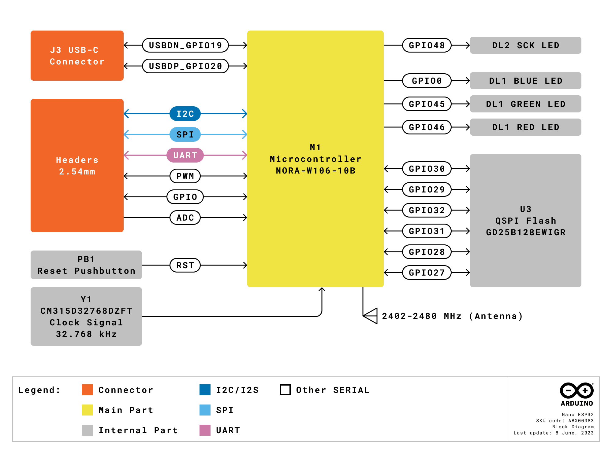
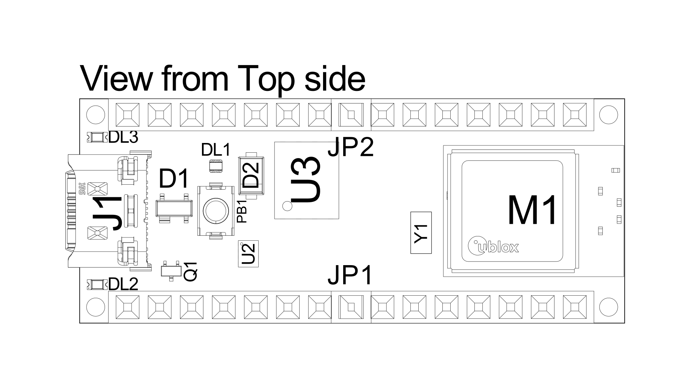
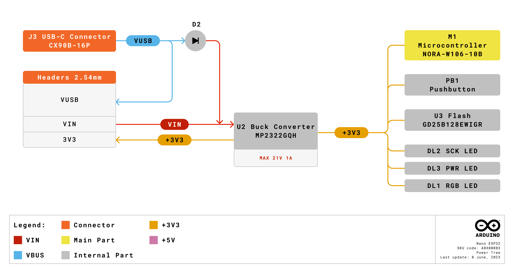
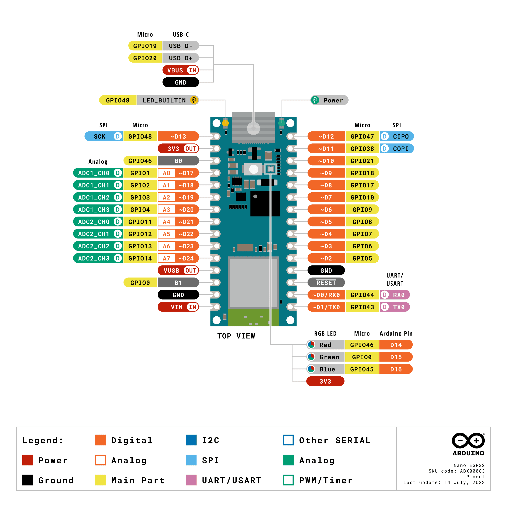
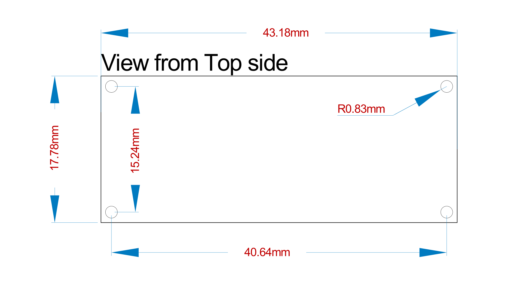

# 中文 (ZH)

# 描述

Arduino Nano ESP32（带和不带接头）是基于 ESP32-S3（嵌入 u-blox® 的 NORA-W106-10B 中）的 Nano 开发板。这是第一款完全基于 ESP32 的 Arduino 电路板，具有 Wi-Fi® 和 Bluetooth® LE 功能。

Nano ESP32 兼容 Arduino Cloud，并支持 MicroPython。它是物联网开发入门的理想板卡。

# 目标领域：

创客、物联网、MicroPython

# 特点

- **Xtensa® 双核 32 位 LX7 微处理器**
  - 工作频率高达 240 MHz
  - 384 kB ROM
  - 512 kB SRAM
  - RTC 采用 16 kB SRAM （低功耗模式）
  - DMA 控制器
- **电源**
  - 工作电压 3.3 V
  - VBUS 通过 USB-C® 连接器提供 5 V 电压
  - 输入电压范围为 6-21 V
- **连接选项**
  - Wi-Fi®
  - Bluetooth® LE
  - 内置天线
  - 2.4 GHz 发射器/接收器
  - 传输速率高达 150 Mbps
- **引脚**
  - 14 个数字引脚（21 个引脚，含模拟引脚）
  - 8 个模拟引脚（在 RTC 模式下可用）
  - SPI(D11,D12,D13)、I2C (A4/A5)、UART(D0/D1)
- **通信端口**
  - SPI
  - I2C
  - I2S
  - UART
  - CAN (TWAI®)
- **低功耗**
  - 在深度休眠模式下功耗为 7 μA\*
  - 在浅度休眠模式下功耗为 240 μA\*
  - RTC 存储器
  - 超低功耗（ULP）协处理器
  - 电源管理单元（PMU）
  - 在 RTC 模式下支持 ADC

\*低功耗模式下的额定功耗仅适用于 ESP32-S3 SoC。电路板上的其他元件（如 LED）也会产生功耗，从而增加电路板的总功耗。

# 目录

## 电路板简介

Nano ESP32 是一款基于 u-blox® NORA-W106-10B 的 3.3 V 开发板，该模块包含一个 ESP32-S3 片上系统 (SoC)。该模块支持 Wi-Fi® 和 Bluetooth® Low Energy (LE)，通过内置天线支持扩频通信。CPU（32 位 Xtensa® LX7）支持高达 240 MHz 的时钟频率。

### 应用示例

**智能家居:** 协助实现智能家居/家庭自动化的理想板卡，可用于智能开关、自动照明和电机控制，例如电动百叶窗。

**物联网传感器:** 该电路板具有多个专用模数转换器通道、可访问的 I2C/SPI 总线和基于 ESP32-S3 的强大无线电模块，可轻松部署用于监控传感器值。

**低功耗设计:** 利用 ESP32-S3 SoC 的内置低功耗模式，实现低功耗的电池供电应用。

## ESP32 核心板

Nano ESP32 采用[Arduino ESP32 电路板封装](https://github.com/arduino/arduino-esp32), 是 Espressif [arduino-esp32](https://github.com/espressif/arduino-esp32) 核心板的衍生板。

# 额定值

## 建议运行条件

| 符号              | 描述                      | 最小值 | 典型值 | 最大值 | 单位 |
| ------------------- | -------------------------------- | --- | --- | --- | ---- |
| VIN      | 来自 VIN 焊盘的输入电压       | 6   | 7.0 | 21  | V    |
| VUSB     | 来自 USB 连接器的输入电压 | 4.8 | 5.0 | 5.5 | V    |
| Tambient | 环境温度              | -40 | 25  | 105 | °C   |

# 功能概述

## 方框图

## 电路板拓扑结构

### 前视图

| **编号** | **描述**                                  |
| -------- | ------------------------------------------------ |
| M1       | NORA-W106-10B (ESP32-S3 SoC)                     |
| J1       | CX90B-16P USB-C® 连接器                       |
| JP1      | 1x15 模拟接头                               |
| JP2      | 1x15 数字接头                              |
| U2       | MP2322GQH 降压转换器                    |
| U3       | GD25B128EWIGR 128 Mbit (16 MB) 外部闪存 |
| DL1      | RGB LED                                          |
| DL2      | LED SCK （串行时钟）                           |
| DL3      | LED Power（绿色）                                |
| D2       | PMEG6020AELRX 肖特基二极管                     |
| D3       | PRTR5V0U2X，215 ESD保护                    |

## NORA-W106-10B（无线电模块 / MCU）

Nano ESP32 采用 **NORA-W106-10B** 独立无线电模块，内嵌 ESP32-S3 系列 SoC 和嵌入式天线。ESP32-S3 基于 Xtensa® LX7 系列微处理器。

### Xtensa® 双核 32 位 LX7 微处理器

NORA-W106 模块内 ESP32-S3 SoC 的微处理器是双核 32 位 Xtensa® LX7。每个内核的运行频率最高可达 240 MHz，拥有 512 kB SRAM 内存。LX7 具有以下特点：

- 32 位自定义指令集
- 128 位数据总线
- 32 位乘法器/除法器

LX7 具有 384 kB ROM（只读存储器）和 512 kB SRAM（静态随机存取存储器）。还具有 8 kB **RTC FAST** 和 **RTC SLOW** 存储器。这些存储器专为低功耗操作而设计，其中 ULP（超低功耗）协处理器可以访问 **SLOW** 存储器，并在深度休眠模式下保留数据。

### Wi-Fi®

NORA-W106-10B 模块支持 Wi-Fi® 4 IEEE 802.11 标准 b/g/n，输出功率 EIRP 高达 10 dBm。此模块的最大范围是 500 米。

- 802.11b: 11 Mbit/s
- 802.11g: 54 Mbit/s
- 802.11n：HT-20 (20 Mhz)，最大值为 72 Mbit/s；HT-40 (40 Mhz)，最大值为 150 Mbit/s

### Bluetooth®

NORA-W106-10B 模块支持 Bluetooth® LE v5.0，输出功率 EIRP 高达 10 dBm，数据传输速率高达 2 Mbps。它可以选择同时扫描和发布，并在外设/中央模式下支持多种连接。

### PSRAM

NORA-W106-10B 模块包括 8 MB 嵌入式 PSRAM。(八进制 SPI）

### 天线增益

NORA-W106-10B 模块上的内置天线采用 GFSK 调制技术，性能额定值如下：

Wi-Fi®:

- 传导输出功率典型值：**17 dBm**。
- 辐射输出功率典型值：**20 dBm EIRP**。
- 传导灵敏度：**-97 dBm**。

Bluetooth® Low Energy：

- 传导输出功率典型值：**7 dBm**。
- 辐射输出功率典型值：**10 dBm EIRP**。
- 传导灵敏度：**-98 dBm**。

该数据检索自 uBlox NORA-W10 数据表（第 7 页，第 1.5 节），可在[此处](https://www.u-blox.com/en/product/nora-w10-series) 访问数据表。

## 系统

### 复位

ESP32-S3 支持四级复位：

- **CPU:** 复位 CPU0/CPU1 内核。
- **内核:** 复位数字系统，RTC 外设（ULP 协处理器、RTC 存储器）除外。
- **系统:** 复位整个数字系统，包括 RTC 外设。
- **芯片:**复位整个芯片。

可以对该电路板进行软件复位，并获得复位原因。

要对电路板进行硬件复位，请使用板载复位按钮 (PB1)。

### 定时器

Nano ESP32 具有以下定时器：

- 52 位系统定时器和 2 个 52 位计数器 (16 MHz) 以及 3 个比较器。
- 4 个通用 54 位定时器
- 3 个看门狗定时器，两个在主系统中 (MWDT0/1)，一个在 RTC 模块中 (RWDT)。

### 中断引脚

Nano ESP32 上的所有 GPIO 均可配置用作中断引脚，并按中断引脚矩阵配置。中断引脚在应用层上使用以下配置进行配置：

- LOW
- HIGH
- CHANGE
- FALLING
- RISING

## 串行通信协议

ESP32-S3 芯片为其支持的各种串行协议提供了灵活性。例如，I2C 总线几乎可以分配给任何可用的 GPIO。

### 集成电路总线 (I2C)

默认引脚：

- A4 - SDA
- A5 - SCL

I2C 总线默认分配给 A4/A5（SDA/SCL）引脚，以实现与旧版的兼容性。不过，由于 ESP32-S3 芯片具备灵活性，该引脚分配可以更改。

SDA 和 SCL 引脚可分配给大多数 GPIO，但其中一些引脚可能具有其他基本功能，导致 I2C 操作无法成功运行。

**请注意**：许多软件库使用标准引脚分配（A4/A5）。

### I2S总线 (I2S)

有两个 I2S 控制器通常用于与音频设备通信。没有为 I2S 分配特定的引脚，可以使用任何空闲的 GPIO。

使用标准或 TDM 模式时，使用以下线路：

- **MCLK** - 主时钟
- **BCLK** - 位时钟
- **WS** - 字选择线
- **DIN/DOUT** - 串行数据

使用 PDM 模式：

- **CLK** - PDM 时钟
- **DIN/DOUT** 串行数据

在 [Espressif 的 Peripheral API - InterIC Sounds (I2S)](https://docs.espressif.com/projects/esp-idf/en/latest/esp32s3/api-reference/peripherals/i2s.html) 中了解更多有关 I2S 协议的信息

### 串行外设接口 (SPI)

- SCK - D13
- CIPO - D12
- COPI - D11
- CS - D10

默认情况下，SPI 控制器分配给上述引脚。

### 通用异步接收器/发射器 (UART)

- D1 / TX
- D0 / RX

默认情况下，UART 控制器分配给上述引脚。

### 双线汽车接口 (TWAI®)

CAN/TWAI® 控制器用于与使用 CAN/TWAI® 协议的系统进行通信，这在汽车行业尤为常见。没有为 CAN/TWAI® 控制器分配特定的引脚，可以使用任何空闲的 GPIO。

**请注意:** TWAI® 也称为 CAN2.0B，或“CAN classic”。CAN 控制器与 CAN FD 框架**不**兼容。

## 外部闪存

Nano ESP32 具有 128 Mbit (16 MB) 外部闪存 GD25B128EWIGR (U3)。该存储器通过四线串行外设接口 (QSPI) 与 ESP32 连接。

该集成电路的工作频率为 133 MHz，数据传输速率高达 664 Mbit/s。

## USB 连接器

Nano ESP32 有一个 USB-C® 端口，用于为电路板供电和编程，以及发送和接收串行通信。

注意：请勿通过 USB-C® 端口以超过 5V 的电压为电路板供电。

## 电源选项

可通过 VIN 引脚或 USB-C® 连接器提供电源。通过 USB 或 VIN 输入的任何电压都会通过 MP2322GQH (U2) 转换器降压至 3.3 V。

该电路板的工作电压为 3.3 V。请注意，该电路板上未提供 5V 引脚，当通过 USB 为电路板供电时，只有 VBUS 可以提供 5 V 电压。

### 电源树

### 引脚电压

Nano ESP32 的所有数字和模拟引脚电压均为 3.3 V。请勿将任何电压较高的设备连接到任何引脚上，否则有可能损坏电路板。

### VIN 额定值

建议输入电压范围为 **6-21 V**。

请勿尝试使用超出建议范围的电压为电路板供电，尤其不要高于 21 V。

转换器的效率取决于通过 VIN 引脚输入的电压。电路板在正常电流消耗下运行时的平均值如下:

- **4.5 V** - >90%.
- **12 V** - 85-90%
- **18 V** - <85%

此信息摘自 MP2322GQH 的数据表。

### VBUS

Nano ESP32 上未提供 5V 引脚。5 V 电压只能通过 **VBUS**提供，由 USB-C® 电源直接提供。

通过 VIN 引脚为电路板供电时，VBUS 引脚未启用。这意味着，除非通过 USB 或外部电源供电，否则无法从电路板提供 5 V 电压。

### 使用 3.3 V 引脚

3.3 V 引脚与 3.3 V 电源轨相连，而 3.3 V 电源轨则与 MP2322GQH 降压转换器的输出相连。该引脚主要用于为外部元件供电。

### 引脚电流

Nano ESP32 上的 GPIO 可处理的**源电流**最高达**40 mA**，**灌电流**最高达**28 mA**。切勿将电流高于上述上限值的设备直接连接到 GPIO。

# 机械层信息

## 引脚布局

### 模拟引脚 (JP1)

| 引脚 | 功能  | 类型   | 描述                             |
| --- | --------- | ------ | --------------------------------------- |
| 1   | D13 / SCK | NC     | 串行时钟                            |
| 2   | +3V3      | 电源  | +3V3 电源轨                         |
| 3   | BOOT0     | 模式   | 电路板复位 0                           |
| 4   | A0        | 模拟 | 模拟输入 0                          |
| 5   | A1        | 模拟 | 模拟输入 1                          |
| 6   | A2        | 模拟 | 模拟输入 2                          |
| 7   | A3        | 模拟 | 模拟输入 3                          |
| 8   | A4        | 模拟 | 模拟输入 4 / I2C 串行数据（SDA） |
| 9   | A5        | 模拟 | 模拟输入 5 / I2C 串行时钟（SCL） |
| 10  | A6        | 模拟 | 模拟输入 6                          |
| 11  | A7        | 模拟 | 模拟输入 7                          |
| 12  | VBUS      | 电源  | USB 电源 (5V)                          |
| 13  | BOOT1     | 模式   | 电路板复位 1                           |
| 14  | GND       | 电源  | 接地                                  |
| 15  | VIN       | 电源  | 电压输入                           |

### 数字引脚 (JP2)

| 引脚 | 功能     | 类型     | 描述                             |
| --- | ------------ | -------- | --------------------------------------- |
| 1   | D12 / CIPO\* | 数字  | 控制器输入外设输出            |
| 2   | D11 / COPI\* | 数字  | 控制器输出外设输入            |
| 3   | D10 / CS\*   | 数字  | 芯片选择                             |
| 4   | D9           | 数字  | 数字引脚 9                           |
| 5   | D8           | 数字  | 数字引脚 8                           |
| 6   | D7           | 数字  | 数字引脚 7                           |
| 7   | D6           | 数字  | 数字引脚 6                           |
| 8   | D5           | 数字  | 数字引脚 5                           |
| 9   | D4           | 数字  | 数字引脚 4                           |
| 10  | D3           | 数字  | 数字引脚 3                           |
| 11  | D2           | 数字  | 数字引脚 2                           |
| 12  | GND          | 电源    | 接地                                  |
| 13  | RST          | 内部 | 复位                                   |
| 14  | D0/RX        | 数字  | 数字引脚 1 /串行接收器 (RX)    |
| 15  | D1/TX        | 数字  | 数字引脚 0 / 串行发射器 (TX) |

\*CIPO/COPI/CS 取代 MISO/MOSI/SS 术语。

## 安装孔和电路板外形图

## 电路板操作

### 入门指南 - IDE

如需在离线状态下对 Nano ESP32 进行编程，则需要安装 Arduino IDE **[1]**。若要将 Nano ESP32 连接到计算机，则需要使用 Type-C® USB 电缆，如 LED 指示灯 (DL1) 所示，该电缆还可以为电路板供电。

### 入门指南 - Arduino Cloud Editor

包括本电路板在内的所有 Arduino 电路板，都可以在 Arduino Cloud Editor **[2]**上开箱即用，只需安装一个简单的插件即可。

Arduino Cloud Editor 是在线托管的，因此它将始终提供最新功能并支持所有电路板。接下来**[3]**开始在浏览器上编码并将程序上传到您的电路板上。

### 入门指南 - Arduino Cloud

Arduino Cloud 支持所有 Arduino 支持 IoT 功能的产品，让您可以记录、绘制和分析传感器数据，触发事件，实现家庭或企业自动化。

### 在线资源

现在，您已经了解该电路板的基本功能，就可以通过查看 Arduino Project Hub **[4]**、Arduino Library Reference **[5]** 和在线商店 **[6]** 上的精彩项目来探索它所提供的无限可能性；在这些项目中，您可以为电路板配备传感器、执行器等。

### 电路板恢复

所有 Arduino 电路板都配置有内置的引导加载程序，可以通过 USB 对电路板进行刷新。如果某一程序锁定了处理器，且无法通过 USB 再次访问电路板，则可以在上电后立即双击复位按钮进入引导加载程序模式。

# Certifications

## Declaration of Conformity CE DoC (EU)

We declare under our sole responsibility that the products above are in conformity with the essential requirements of the following EU Directives and therefore qualify for free movement within markets comprising the European Union (EU) and European Economic Area (EEA).

## Declaration of Conformity to EU RoHS & REACH 211 01/19/2021

Arduino boards are in compliance with RoHS 2 Directive 2011/65/EU of the European Parliament and RoHS 3 Directive 2015/863/EU of the Council of 4 June 2015 on the restriction of the use of certain hazardous substances in electrical and electronic equipment.

| **Substance**                          | **Maximum Limit (ppm)** |
| -------------------------------------- | ----------------------- |
| Lead (Pb)                              | 1000                    |
| Cadmium (Cd)                           | 100                     |
| Mercury (Hg)                           | 1000                    |
| Hexavalent Chromium (Cr6+)             | 1000                    |
| Poly Brominated Biphenyls (PBB)        | 1000                    |
| Poly Brominated Diphenyl ethers (PBDE) | 1000                    |
| Bis(2-Ethylhexyl} phthalate (DEHP)     | 1000                    |
| Benzyl butyl phthalate (BBP)           | 1000                    |
| Dibutyl phthalate (DBP)                | 1000                    |
| Diisobutyl phthalate (DIBP)            | 1000                    |

Exemptions : No exemptions are claimed.

Arduino Boards are fully compliant with the related requirements of European Union Regulation (EC) 1907 /2006 concerning the Registration, Evaluation, Authorization and Restriction of Chemicals (REACH). We declare none of the SVHCs ([https://echa.europa.eu/web/guest/candidate-list-table](https://echa.europa.eu/web/guest/candidate-list-table)), the Candidate List of Substances of Very High Concern for authorization currently released by ECHA, is present in all products (and also package) in quantities totaling in a concentration equal or above 0.1%. To the best of our knowledge, we also declare that our products do not contain any of the substances listed on the "Authorization List" (Annex XIV of the REACH regulations) and Substances of Very High Concern (SVHC) in any significant amounts as specified by the Annex XVII of Candidate list published by ECHA (European Chemical Agency) 1907 /2006/EC.

## Conflict Minerals Declaration

As a global supplier of electronic and electrical components, Arduino is aware of our obligations with regards to laws and regulations regarding Conflict Minerals, specifically the Dodd-Frank Wall Street Reform and Consumer Protection Act, Section 1502. Arduino does not directly source or process conflict minerals such as Tin, Tantalum, Tungsten, or Gold. Conflict minerals are contained in our products in the form of solder, or as a component in metal alloys. As part of our reasonable due diligence Arduino has contacted component suppliers within our supply chain to verify their continued compliance with the regulations. Based on the information received thus far we declare that our products contain Conflict Minerals sourced from conflict-free areas.

## FCC Caution

Any Changes or modifications not expressly approved by the party responsible for compliance could void the user’s authority to operate the equipment.

This device complies with part 15 of the FCC Rules. Operation is subject to the following two conditions:

(1) This device may not cause harmful interference

(2) this device must accept any interference received, including interference that may cause undesired operation.

**FCC RF Radiation Exposure Statement:**

1. This Transmitter must not be co-located or operating in conjunction with any other antenna or transmitter.

2. This equipment complies with RF radiation exposure limits set forth for an uncontrolled environment.

3. This equipment should be installed and operated with a minimum distance of 20 cm between the radiator & your body.

**Note:** This equipment has been tested and found to comply with the limits for a Class B digital
device, pursuant to part 15 of the FCC Rules. These limits are designed to provide
reasonable protection against harmful interference in a residential installation. This equipment
generates, uses and can radiate radio frequency energy and, if not installed and used in
accordance with the instructions, may cause harmful interference to radio communications.
However, there is no guarantee that interference will not occur in a particular installation. If
this equipment does cause harmful interference to radio or television reception, which can be
determined by turning the equipment off and on, the user is encouraged to try to correct the
interference by one or more of the following measures:

- Reorient or relocate the receiving antenna.
- Increase the separation between the equipment and receiver.
- Connect the equipment into an outlet on a circuit different from that to which the
  receiver is connected.
- Consult the dealer or an experienced radio/TV technician for help.

English:
User manuals for licence-exempt radio apparatus shall contain the following or equivalent notice in a conspicuous location in the user manual or alternatively on the device or both. This device complies with Industry Canada licence-exempt RSS standard(s). Operation is subject to the following two conditions:

(1) this device may not cause interference

(2) this device must accept any interference, including interference that may cause undesired operation of the device.

French:
Le présent appareil est conforme aux CNR d’Industrie Canada applicables aux appareils radio exempts de licence. L’exploitation est autorisée aux deux conditions suivantes :

(1) l’ appareil nedoit pas produire de brouillage

(2) l’utilisateur de l’appareil doit accepter tout brouillage radioélectrique subi, même si le brouillage est susceptible d’en compromettre le fonctionnement.

**IC SAR Warning:**

English
This equipment should be installed and operated with a minimum distance of 20 cm between the radiator and your body.

French:
Lors de l’ installation et de l’ exploitation de ce dispositif, la distance entre le radiateur et le corps est d ’au moins 20 cm.

**Important:** The operating temperature of the EUT can’t exceed 85℃ and shouldn’t be lower than -40 ℃.

Hereby, Arduino S.r.l. declares that this product is in compliance with essential requirements and other relevant provisions of Directive 201453/EU. This product is allowed to be used in all EU member states.

## SRRC

This equipment contains a radio transmitter module with model approval code: CMIIT ID: 24J993CLD252.

## Company Information

| Company name    | Arduino S.r.l.                                |
| --------------- | --------------------------------------------- |
| Company Address | Via Andrea Appiani, 25 Monza, MB, 20900 Italy |

## Reference Documentation

| Reference                              | Link                                                                     |
| -------------------------------------- | ------------------------------------------------------------------------ |
| Arduino IDE (Desktop)                  | https://www.arduino.cc/en/Main/Software                                  |
| Arduino Cloud Editor                   | https://create.arduino.cc/editor                                         |
| Arduino Cloud Editor - Getting Started | https://docs.arduino.cc/arduino-cloud/guides/editor/                     |
| Arduino Project Hub                    | https://create.arduino.cc/projecthub?by=part&part_id=11332&sort=trending |
| Library Reference                      | https://github.com/arduino-libraries/                                    |
| Online Store                           | https://store.arduino.cc/                                                                     |

## Change Log

| **Date**   | **Revision** | **Changes**                                            |
| ---------- | ------------ | ------------------------------------------------------ |
| 08/06/2023 |      1       | Release                                                |
| 09/01/2023 |      2       | Update power tree flowchart.                           |
| 09/11/2023 |      3       | Update SPI section, update analog/digital pin section. |
| 11/06/2023 |      4       | Correct company name, correct VBUS/VUSB                |
| 11/09/2023 |      5       | Block Diagram Update, Antenna Specifications           |
| 11/15/2023 |      6       | Ambient temperature update                             |
| 11/23/2023 |      7       | Added label to LP modes                                |
| 23/02/2024 |      8       | Added antenna frequency to block diagram               |
| 25/04/2024 |      9       | Updated link to new Cloud Editor                       |
| 23/08/2024 |      10      | Added SRRC certification                                 |
| 23/08/2024 |      11      | Cloud Editor updated from Web Editor                  |
| 12/10/2026 |      12      | Added note for Intended Use, and divided language |

