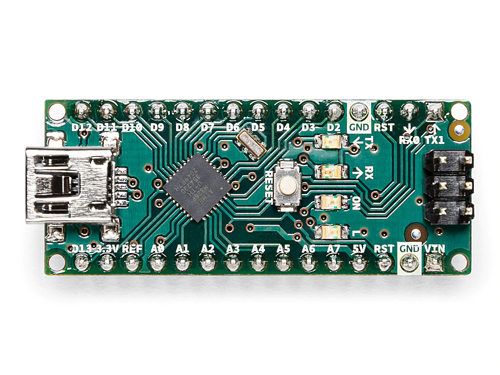
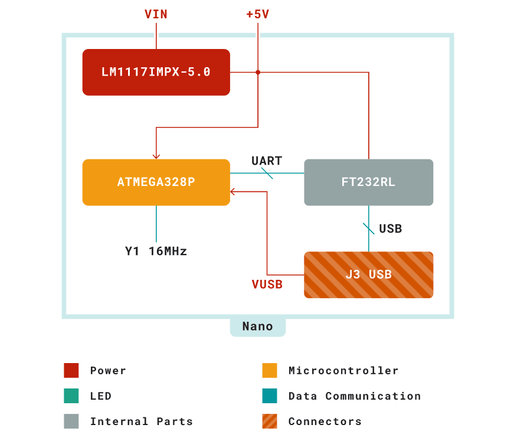
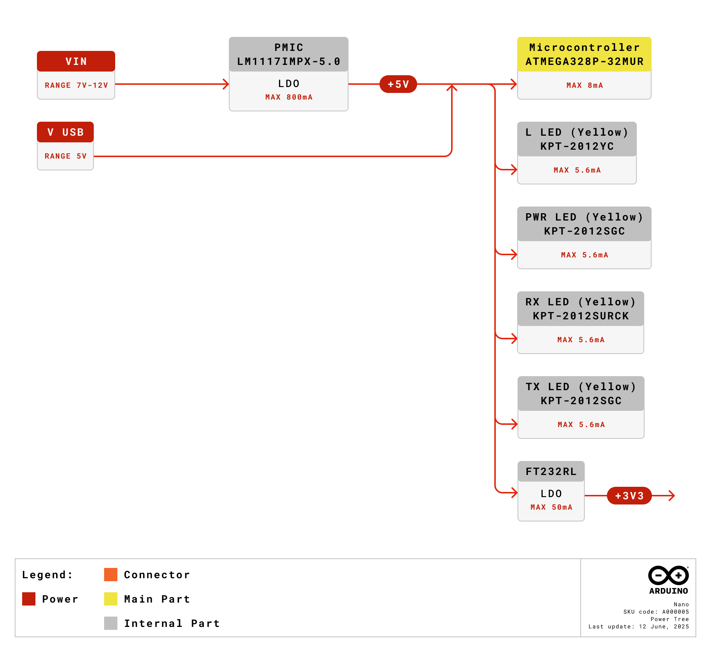
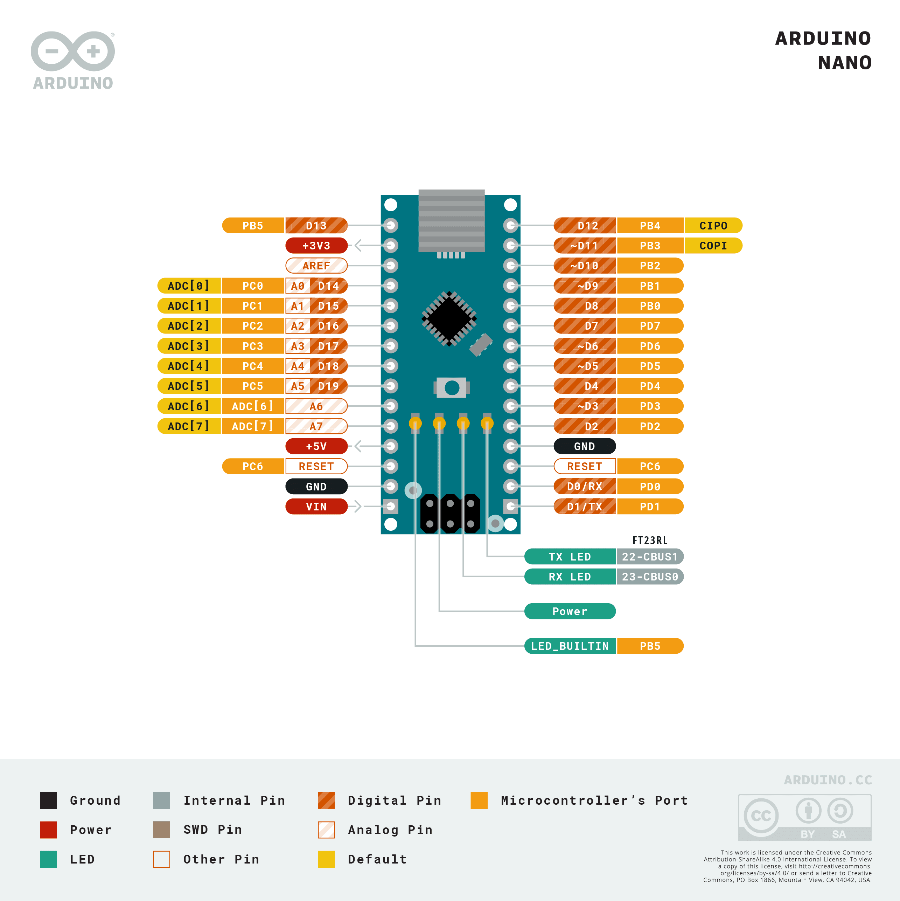
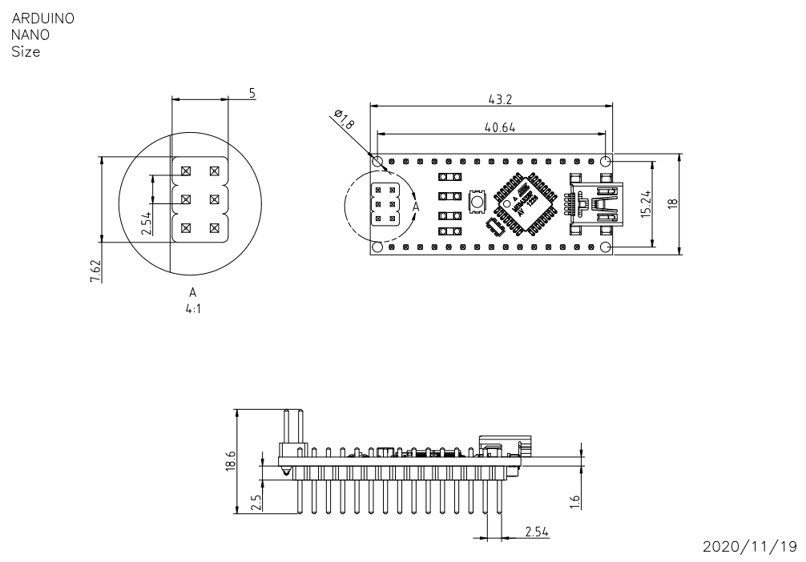

# 中文 (ZH)

# 描述

**Arduino® Nano**是一款智能开发板，旨在以最小的尺寸构建更快的原型。Arduino Nano 是 Nano 系列中最早的一款产品，可为您的试验电路板友好型应用提供足够的接口。该开发板的核心是**ATmega328 微控制器**，时钟频率为 16 MHz，功能与 Arduino Duemilanove 大致相同。该电路板提供 20 个数字输入/输出引脚、8 个模拟引脚和一个微型 USB 端口。

# 目标领域：
创客、安全、环境、机器人和控制系统

# 特点
- **ATmega328** 微控制器
  - 高性能低功耗 8 位处理器
  - 在 16 MHz 时钟频率下实现高达 16 MIPS 的性能
  - 32 kB，其中 2 KB 用于引导加载程序
  - 2 kB 内部 SRAM
  - 1 kB EEPROM
  - 32 x 8 通用工作寄存器
  - 带有独立振荡器的实时计数器
  - 6 通道 PWM
  - 可编程串行 USART
  - 主/从 SPI 串行接口
- **电源**
  - Mini-B USB 连接
  - 7-15V 非稳压外部电源（引脚 30）
  - 5V 稳压外部电源（引脚 27）
- **休眠模式**
  - 空闲
  - ADC 降噪
  - 节能
  - 掉电
  - 待机
  - 延长待机
- **输入/输出**
  - 20 数字
  - 8 模拟
  - 6 PWM 输出

# 目录

## 电路板简介
### 应用示例
Arduino Nano 是 Nano 系列中首款嵌入式微控制器，具有最基本的功能，专为创客社区的微型项目而设计。它拥有大量输入/输出引脚，可利用 UART、SPI 和 I2C 等多种串行通信。硬件兼容 Arduino IDE、Arduino CLI 和网络编辑器。

**安全性**：高性能和低功耗的特点为开发基于安全性的应用提供了机会，如使用指纹传感器的门禁系统。利用串行通信接口连接传感器和外部设备的灵活性扩大了实用范围。

**环境**：微控制器的低功耗特性和电路板的电源选项增强了实施与环境问题有关的远程物联网项目的能力。

**机器人技术**: 机器人技术一直是创客社区最喜欢探索的领域，有了这个微型嵌入式硬件，您现在可以创建复杂而高级的机器人应用程序。

### 配件

### 相关产品

- Arduino Nano 33 BLE
- Arduino 33 IoT
- Arduino Micro

## 额定值

### 建议运行条件
| 符号 | 描述                                       | 最小值        | 最大值     |
| ------ | ------------------------------------------------- | ---------- | ------- | 
|        |  整个电路板的保守温度极限值： |  -40 °C    | 85 °C   |

### 功耗
| 符号          | 描述                         | 最小值 | 典型值 | 最大值 | 单位 |
| --------------- | ----------------------------------- | --- | --- | --- | ---- |
|   USB VCC       | USB 电源输入               |     | TBC |     |  mW  |
|   VIN           | 来自 VIN 焊盘的输入                  |     | TBC |     |  mW  |

## 功能概述
### 方框图

### 处理器

Arduino Nano v3.3 电路板的主处理器是高性能、低功耗的 8 位 ATmega328 微控制器，其时钟频率为 16 MHz。芯片支持 UART TTL (5V)、I2C (TWI) 和 SPI，能够通过串行通信接口连接外部设备。Arduino Nano 可通过 Arduino 软件进行编程，降低了新用户的入门门槛。最小尺寸的嵌入式硬件使其成为创客社区试验电路板友好型项目的最佳选择。

### 电源树

Arduino Nano 可以通过 USB 端口或 VIN 供电。VIN 的输入电源由一个 LDO 进行调节，因此电源电压限制在 5V，使电路板在最佳状态下运行。另外还有一个稳压器，可将电压限制在 3.3V，为需要低电压的元件供电。

## 电路板操作
### 入门指南 - IDE
如需在离线状态下对 Arduino® Nano 进行编程，则需要安装 Arduino® Desktop IDE **[1]** 若要将 Arduino Uno 连接到计算机，则需要使用 Micro-B USB 电缆。如 LED 指示灯所示，该电缆还可以为电路板供电。

### 入门指南 - Arduino Cloud Editor
包括本电路板在内的所有 Arduino® 电路板都可以在 Arduino Cloud Editor **[2]**上开箱即用，只需安装一个简单的插件即可。
Arduino Cloud Editor 是在线托管的，因此它将始终提供最新功能并支持所有电路板。接下来**[3]**开始在浏览器上编码并将程序上传到您的电路板上。

### 示例程序
Arduino® 的示例程序可以在 Arduino® IDE 的“示例”菜单或 Arduino 网站 **[4]** 的“文档”部分找到

### 在线资源
现在，您已经了解该电路板的基本功能，就可以通过查看 Arduino Project Hub **[5]**、Arduino® Library Reference **[6]** 和在线商店 **[7]** 上的精彩项目来探索它所提供的无限可能性；在这些项目中，您可以为电路板配备传感器、执行器等。

## 连接器引脚布局

### 模拟
| 引脚 | 功能 | 类型         | 描述             |
| --- | -------- | ------------ | ----------------------- |
| 1   | +3V3     | 电源        | 5V USB 电源            |
| 2   | A0       | 模拟       | 模拟输入0 / GPIO    |
| 3   | A1       | 模拟       | 模拟输入1 / GPIO    |
| 4   | A2       | 模拟       | 模拟输入2 / GPIO    |
| 5   | A3       | 模拟       | 模拟输入3 / GPIO    |
| 6   | A4       | 模拟       | 模拟输入4 / GPIO    |
| 7   | A5       | 模拟       | 模拟输入5 / GPIO    |
| 8   | A6       | 模拟       | 模拟输入6 / GPIO    |
| 9   | A7       | 模拟       | 模拟输入7 / GPIO    |
| 10  | +5V      | 电源        | +5V 电源轨          |
| 11  | 复位    | 复位        | 复位                   |
| 12  | GND      | 电源        | 接地                  |
| 12  | VIN      | 电源        | 电压输入           |

### 数字
| 引脚 | 功能 | 类型    | 描述             |
| --- | -------- | ------- | ----------------------- |
| 1   | D1/TX1   | 数字 | 数字输入 1/GPIO   |
| 2   | D0/RX0   | 数字 | 数字输入 0/GPIO   |
| 3   | D2       | 数字 | 数字输入 2/GPIO   |
| 4   | D3       | 数字 | 数字输入 3/GPIO   |
| 5   | D4       | 数字 | 数字输入 4/GPIO   |
| 6   | D5       | 数字 | 数字输入 5/GPIO   |
| 7   | D6       | 数字 | 数字输入 6/GPIO   |
| 8   | D7       | 数字 | 数字输入 7/GPIO   |
| 9   | D8       | 数字 | 数字输入 8/GPIO   |
| 10  | D9       | 数字 | 数字输入 9/GPIO   |
| 11  | D10      | 数字 | 数字输入 10/GPIO  |
| 12  | D11      | 数字 | 数字输入 11/GPIO  |
| 13  | D12      | 数字 | 数字输入 12/GPIO  |
| 14  | D13      | 数字 | 数字输入 13/GPIO  |
| 15  | 复位    | 复位   | 复位                   |
| 16  | GND      | 电源   | 接地                  |

### ATmega328
| 引脚 | 功能 | 类型         | 描述             |
| --- | -------- | ------------ | ----------------------- |
| 1   | PB0      | 内部     | 串行线调试       |
| 2   | PB1      | 内部     | 串行线调试       |
| 3   | PB2      | 内部     | 串行线调试       |
| 4   | PB3      | 内部     | 串行线调试       |
| 5   | PB4      | 内部     | 串行线调试       |
| 6   | PB5      | 内部     | 串行线调试       |

## 机械层信息

## Certifications

### Declaration of Conformity CE DoC (EU)

We declare under our sole responsibility that the products above are in conformity with the essential requirements of the following EU Directives and therefore qualify for free movement within markets comprising the European Union (EU) and European Economic Area (EEA). 

### Declaration of Conformity to EU RoHS & REACH 211 01/19/2021
Arduino boards are in compliance with RoHS 2 Directive 2011/65/EU of the European Parliament and RoHS 3 Directive 2015/863/EU of the Council of 4 June 2015 on the restriction of the use of certain hazardous substances in electrical and electronic equipment. 

| **Substance**                          | **Maximum Limit (ppm)** |
| -------------------------------------- | ----------------------- |
| Lead (Pb)                              | 1000                    |
| Cadmium (Cd)                           | 100                     |
| Mercury (Hg)                           | 1000                    |
| Hexavalent Chromium (Cr6+)             | 1000                    |
| Poly Brominated Biphenyls (PBB)        | 1000                    |
| Poly Brominated Diphenyl ethers (PBDE) | 1000                    |
| Bis(2-Ethylhexyl} phthalate (DEHP)     | 1000                    |
| Benzyl butyl phthalate (BBP)           | 1000                    |
| Dibutyl phthalate (DBP)                | 1000                    |
| Diisobutyl phthalate (DIBP)            | 1000                    |

Exemptions : No exemptions are claimed. 

Arduino Boards are fully compliant with the related requirements of European Union Regulation (EC) 1907 /2006 concerning the Registration, Evaluation, Authorization and Restriction of Chemicals (REACH). We declare none of the SVHCs (https://echa.europa.eu/web/guest/candidate-list-table), the Candidate List of Substances of Very High Concern for authorization currently released by ECHA, is present in all products (and also package) in quantities totaling in a concentration equal or above 0.1%. To the best of our knowledge, we also declare that our products do not contain any of the substances listed on the "Authorization List" (Annex XIV of the REACH regulations) and Substances of Very High Concern (SVHC) in any significant amounts as specified by the Annex XVII of Candidate list published by ECHA (European Chemical Agency) 1907 /2006/EC.

### Conflict Minerals Declaration 
As a global supplier of electronic and electrical components, Arduino is aware of our obligations with regards to laws and regulations regarding Conflict Minerals, specifically the Dodd-Frank Wall Street Reform and Consumer Protection Act, Section 1502. Arduino does not directly source or process conflict minerals such as Tin, Tantalum, Tungsten, or Gold. Conflict minerals are contained in our products in the form of solder, or as a component in metal alloys. As part of our reasonable due diligence Arduino has contacted component suppliers within our supply chain to verify their continued compliance with the regulations. Based on the information received thus far we declare that our products contain Conflict Minerals sourced from conflict-free areas. 

### FCC Caution
Any Changes or modifications not expressly approved by the party responsible for compliance could void the user’s authority to operate the equipment.

This device complies with part 15 of the FCC Rules. Operation is subject to the following two conditions: 

(1) This device may not cause harmful interference

(2) this device must accept any interference received, including interference that may cause undesired operation.

**FCC RF Radiation Exposure Statement:**

1. This Transmitter must not be co-located or operating in conjunction with any other antenna or transmitter.

2. This equipment complies with RF radiation exposure limits set forth for an uncontrolled environment.

3. This equipment should be installed and operated with minimum distance 20cm between the radiator & your body.

English: 
User manuals for license-exempt radio apparatus shall contain the following or equivalent notice in a conspicuous location in the user manual or alternatively on the device or both. This device complies with Industry Canada license-exempt RSS standard(s). Operation is subject to the following two conditions:

(1) this device may not cause interference

(2) this device must accept any interference, including interference that may cause undesired operation of the device.

French: 
Le présent appareil est conforme aux CNR d’Industrie Canada applicables aux appareils radio exempts de licence. L’exploitation est autorisée aux deux conditions suivantes :

(1) l’ appareil nedoit pas produire de brouillage

(2) l’utilisateur de l’appareil doit accepter tout brouillage radioélectrique subi, même si le brouillage est susceptible d’en compromettre le fonctionnement.

**IC SAR Warning:**

English 
This equipment should be installed and operated with minimum distance 20 cm between the radiator and your body.  

French: 
Lors de l’ installation et de l’ exploitation de ce dispositif, la distance entre le radiateur et le corps est d ’au moins 20 cm.

**Important:** The operating temperature of the EUT can’t exceed 80℃ and shouldn’t be lower than -20℃.

Hereby, Arduino S.r.l. declares that this product is in compliance with essential requirements and other relevant provisions of Directive 2014/53/EU. This product is allowed to be used in all EU member states. 

## Company Information

| Company name    | Arduino S.r.l.                                                |
| --------------- | ------------------------------------------------------------- |
| Company Address | Via Andrea Appiani 25, 20900 MONZA MB, Italy                  |

## Reference Documentation

| Ref                                    | Link                                                                                                |
| -------------------------------------- | --------------------------------------------------------------------------------------------------- |
| Arduino IDE (Desktop)                  | https://www.arduino.cc/en/software                                                                  |
| Arduino Cloud Editor                   | https://create.arduino.cc/editor                                                                    |
| Arduino Cloud Editor - Getting Started | https://docs.arduino.cc/arduino-cloud/guides/editor/                                                |
| Arduino Documentation                  | https://docs.arduino.cc/hardware/nano                                                               |
| Arduino Project Hub                    | https://create.arduino.cc/projecthub?by=part&part_id=11332&sort=trending                            |
| Library Reference                      | https://www.arduino.cc/reference/en/libraries/                                                      |
| Online Store                           | https://store.arduino.cc/                                                                           |

## Revision History

| **Date**   | **Revision** | **Changes**                           |
| ---------- | ------------ | ------------------------------------- |
| 12/04/2022 | 1            | First Release                         |
| 03/08/2022 | 2            | Reference documentation links updates |
| 25/04/2024 | 3            | Updated link to new Cloud Editor      |
| 12/06/2025 | 4            | Updated power tree                    |
| 12/10/2026 |       5      | Added note for Intended Use, and divided language |
