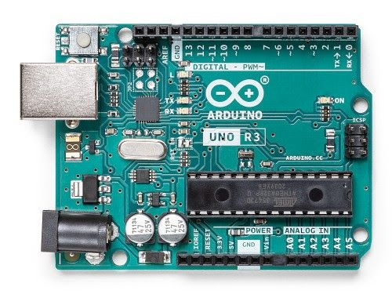
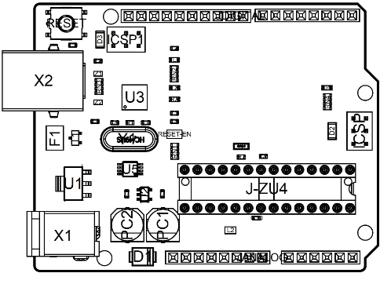
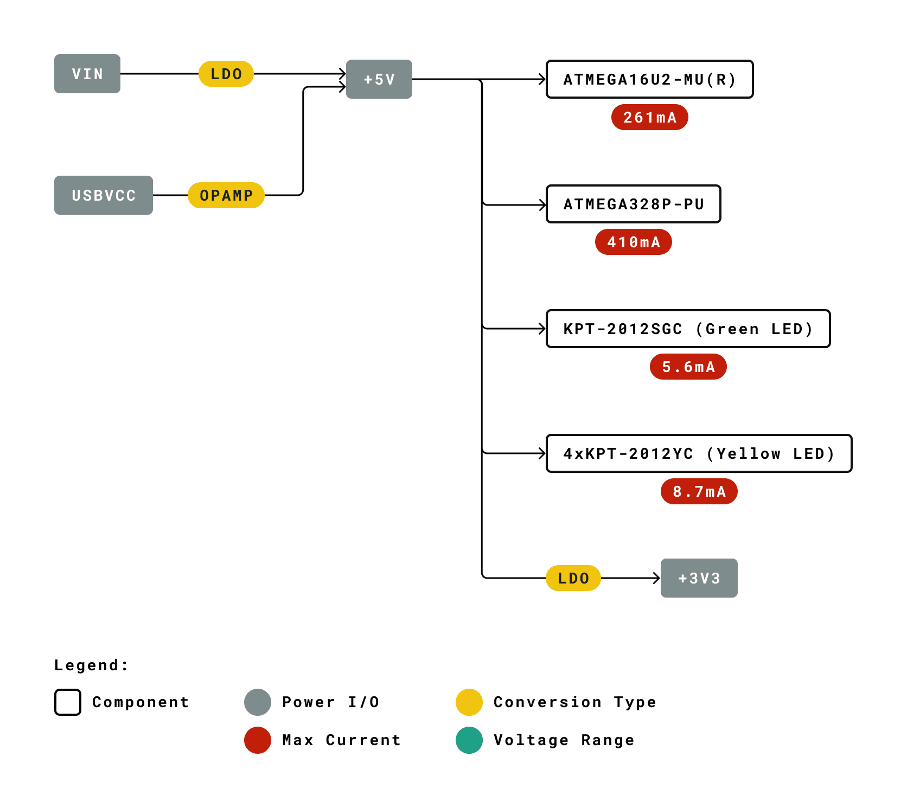
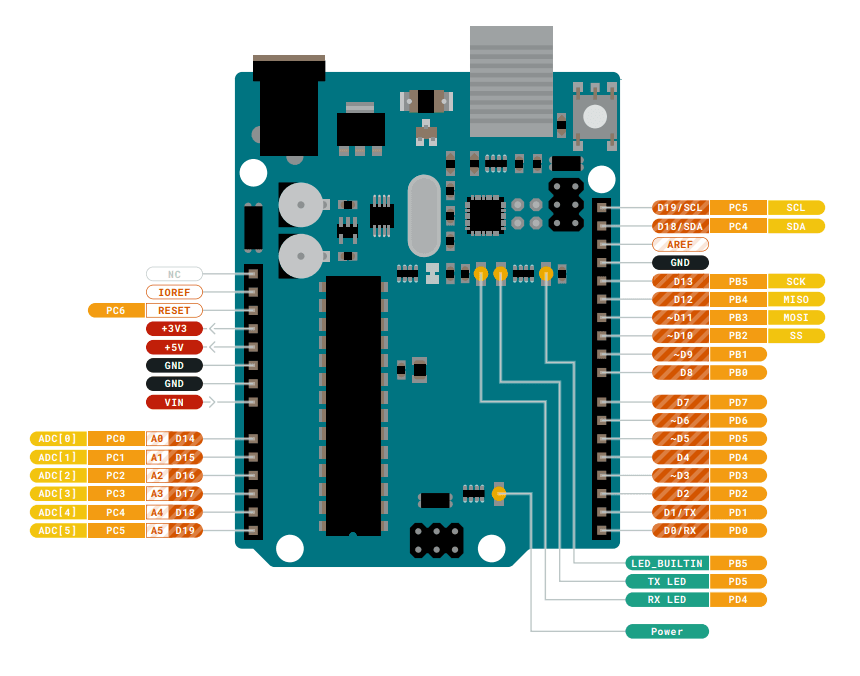
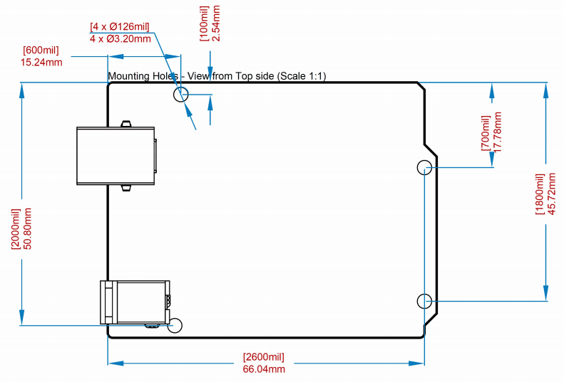

# 中文 (ZH)

# 描述
Arduino UNO R3 是熟悉电子技术和编码的完美开发板。这款多功能开发板配备了著名的 ATmega328P 和 ATMega 16U2 处理器。该开发板将为您带来 Arduino 世界绝佳的初次体验。

# 目标领域：
创客、介绍、工业领域

# 特点
* **ATMega328P** 处理器
    * **内存**
        * AVR CPU 频率高达 16 MHz
        * 32KB 闪存
        * 2KB SRAM
        * 1KB EEPROM 

    * **安全性**
        * 上电复位 (POR)
        * 欠压检测 (BOD)

    * **外设**
        * 2x 8 位定时器/计数器，带专用周期寄存器和比较通道
        * 1x 16 位定时器/计数器，带专用周期寄存器、输入捕获和比较通道
        * 1x USART，带分数波特率发生器和起始帧信号检测功能
        * 1x 控制器/外设串行外设接口 (SPI)
        * 1x 双模控制器/外设 I2C
        * 1 个模拟比较器 (AC)，带可扩展参考输入
        * 看门狗定时器，带独立的片上振荡器
        * 6 通道 PWM
        * 引脚变化时的中断和唤醒

    * **ATMega16U2 处理器**
        *  基于 AVR® RISC 的 8 位微控制器

    * **内存**
        * 16 KB ISP 闪存
        * 512B EEPROM
        * 512B SRAM
        * 用于片上调试和编程的 debugWIRE 接口

    * **电源**
        * 2.7-5.5 伏特

# 目录
## 电路板简介
### 应用示例
UNO 电路板是 Arduino 的旗舰产品。无论您是初次接触电路板产品，还是将 UNO 用作教育或工业相关任务的工具，UNO 都能满足您的需求。 

**初次接触电子技术:** 如果这是您第一次参与编码和电子技术项目，那么就从我们最常用、记录最多的电路板 Arduino UNO 开始吧。它配备了著名的 ATmega328P 处理器、14 个数字输入/输出引脚、6 个模拟输入、USB 连接、ICSP 接头和复位按钮。该电路板包含了您获得良好的 Arduino 初次体验所需的一切。

** 行业标准开发板:** 在工业领域使用 Arduino UNO R3 开发板，有许多公司使用 UNO 开发板作为其 PLC 的大脑。

**教育用途:** 尽管我们推出 UNO R3 电路板已有大约十年之久，但它仍被广泛用于各种教育用途和科学项目。该电路板的高标准和一流性能使其成为从传感器采集实时数据和触发复杂实验室设备等各种应用场合的绝佳资源。 

### 相关产品
* Starter Kit
* Arduino UNO R4 Minima
* Arduino UNO R4 WiFi
* Tinkerkit Braccio Robot

## 额定值

### 建议运行条件

| 符号 | 描述                                      | 最小值            | 最大值            |
| ------ | ------------------------------------------------ | -------------- | -------------- |
|        | 整个电路板的保守温度极限值： | -40 °C (-40°F) | 85 °C ( 185°F) |

>**注意：** 在极端温度下，EEPROM、电压调节器和晶体振荡器可能无法正常工作。

### 功耗

| 符号  | 描述                              | 最小值  | 典型值  | 最大值  | 单位 |
| ------- | ---------------------------------------- | ---- | ---- | ---- | ---- |
| VINMax  | 来自 VIN 焊盘的最大输入电压       | 6    | -    | 20   | V    |
| VUSBMax | 来自 USB 连接器的最大输入电压 |      | -    | 5.5  | V    |
| PMax    | 最大功耗                | -    | -    | xx   | mA   |

## 功能概述

### 电路板拓扑结构
俯视图

| **编号** | **描述**                | **编号** | **描述**                       |
| -------- | ------------------------------ | -------- | ------------------------------------- |
| X1       | 电源插孔 2.1x5.5 毫米           | U1       | SPX1117M3-L-5 调节器               |
| X2       | USB B 连接器                | U3       | ATMEGA16U2 模块                     |
| PC1      | EEE-1EA470WP 25V SMD 电容器 | U5       | LMV358LIST-A.9 IC                     |
| PC2      | EEE-1EA470WP 25V SMD 电容器 | F1       | 片式电容器，高密度          |
| D1       | CGRA4007-G 整流器           | ICSP     | 引脚接头连接器（通过 6 号孔） |
| J-ZU4    | ATMEGA328P 模块              | ICSP1    | 引脚接头连接器（通过 6 号孔） |
| Y1       | ECS-160-20-4X-DU 振荡器    |          |                                       |

### 处理器
主处理器是 ATmega328P，运行频率高达 20 MHz。它的大部分引脚都与外部接头相连，但也有一些引脚用于与 USB 桥协处理器进行内部通信。

### 电源树

## 电路板操作

### 入门指南 - IDE
如需在离线状态下对 Arduino UNO R3 进行编程，则需要安装 [Arduino Desktop IDE](https://www.arduino.cc/en/Main/Software) [1] 若要将 Arduino UNO 连接到计算机，需要使用 USB-B 电缆。如 LED 指示灯所示，该电缆还可以为电路板供电。

### 入门指南 - Arduino Cloud Editor
包括本电路板在内的所有 Arduino 电路板，都可以在 [Arduino Cloud Editor](https://create.arduino.cc/editor) [2] 上开箱即用，只需安装一个简单的插件即可。

Arduino Cloud Editor 是在线托管的，因此它将始终提供最新功能并支持所有电路板。接下来**[3]**开始在浏览器上编码并将程序上传到您的电路板上。

### 示例程序
Arduino UNO R3 的示例程序可以在 Arduino IDE 的“示例”菜单或 [Arduino 网站](https://www.arduino.cc/) [4] 的“文档”部分找到

### 在线资源
现在，您已经了解该电路板的基本功能，就可以通过查看 Arduino [Project Hub](https://create.arduino.cc/projecthub?by=part&part_id=11332&sort=trending) **[5]**、[Arduino Library Reference](https://www.arduino.cc/reference/en/) **[6]** 以及在线 [Arduino 商店](https://store.arduino.cc/) **[7]**上的精彩项目来探索它所提供的无限可能性；在这些项目中，您可以为电路板配备传感器、执行器等。

## 连接器引脚布局

### JANALOG
| 引脚  | **功能** | **类型**         | **描述**                                 |
| ---- | ------------ | ---------------- | ----------------------------------------------- |
| 1    | NC           | NC               | 未连接                                   |
| 2    | IOREF        | IOREF            | 数字逻辑参考电压 V - 连接至 5V |
| 3    | 复位        | 复位            | 复位                                           |
| 4    | +3V3         | 电源            | +3V3 电源轨                                 |
| 5    | +5V          | 电源            | +5V 电源轨                                  |
| 6    | GND          | 电源            | 接地                                          |
| 7    | GND          | 电源            | 接地                                          |
| 8    | VIN          | 电源            | 电压输入                                   |
| 9    | A0           | 模拟/GPIO      | 模拟输入0 / GPIO                            |
| 10   | A1           | 模拟/GPIO      | 模拟输入1 / GPIO                            |
| 11   | A2           | 模拟/GPIO      | 模拟输入2 / GPIO                            |
| 12   | A3           | 模拟/GPIO      | 模拟输入3 / GPIO                            |
| 13   | A4/SDA       | 模拟输入/I2C | 模拟输入 4/I2C 数据线                    |
| 14   | A5/SCL       | 模拟输入/I2C | 模拟输入 5/I2C 时钟线                   |

### JDIGITAL

| 引脚  | **功能** | **类型**     | **描述**                            |
| ---- | ------------ | ------------ | ------------------------------------------ |
| 1    | D0           | 数字引脚/GPIO | 数字引脚 0/GPIO                         |
| 2    | D1           | 数字引脚/GPIO | 数字引脚 1/GPIO                         |
| 3    | D2           | 数字引脚/GPIO | 数字引脚 2/GPIO                         |
| 4    | D3           | 数字引脚/GPIO | 数字引脚 3/GPIO                         |
| 5    | D4           | 数字引脚/GPIO | 数字引脚 4/GPIO                         |
| 6    | D5           | 数字引脚/GPIO | 数字引脚 5/GPIO                         |
| 7    | D6           | 数字引脚/GPIO | 数字引脚 6/GPIO                         |
| 8    | D7           | 数字引脚/GPIO | 数字引脚 7/GPIO                         |
| 9    | D8           | 数字引脚/GPIO | 数字引脚 8/GPIO                         |
| 10   | D9           | 数字引脚/GPIO | 数字引脚 9/GPIO                         |
| 11   | SS           | 数字      | SPI 芯片选择                            |
| 12   | MOSI         | 数字      | SPI1 主输出副输入                 |
| 13   | MISO         | 数字      | SPI 主输入副输出                  |
| 14   | SCK          | 数字      | SPI 串行时钟输出                    |
| 15   | GND          | 电源        | 接地                                     |
| 16   | AREF         | 数字      | 模拟参考电压                   |
| 17   | A4/SD4       | 数字      | 模拟输入 4/I2C 数据线（重复）  |
| 18   | A5/SD5       | 数字      | 模拟输入 5/I2C 时钟线（重复） |

### 机械层信息

### 电路板外形图和安装孔

## Certifications

### Declaration of Conformity CE DoC (EU)

We declare under our sole responsibility that the products above are in conformity with the essential requirements of the following EU Directives and therefore qualify for free movement within markets comprising the European Union (EU) and European Economic Area (EEA). 

|                                                         |                                                   |
| ------------------------------------------------------- | ------------------------------------------------- |
| **ROHS 2 Directive 2011/65/EU**                         |                                                   |
| Conforms to:                                            | EN50581:2012                                      |
| **Directive 2014/35/EU. (LVD)**                         |                                                   |
| Conforms to:                                            | EN 60950-1:2006/A11:2009/A1:2010/A12:2011/AC:2011 |
| **Directive 2004/40/EC & 2008/46/EC & 2013/35/EU, EMF** |                                                   |
| Conforms to:                                            | EN 62311:2008                                     |

 

### Declaration of Conformity to EU RoHS & REACH 211 01/19/2021

Arduino boards are in compliance with RoHS 2 Directive 2011/65/EU of the European Parliament and RoHS 3 Directive 2015/863/EU of the Council of 4 June 2015 on the restriction of the use of certain hazardous substances in electrical and electronic equipment. 

| Substance                              | **Maximum limit (ppm)** |
| -------------------------------------- | ----------------------- |
| Lead (Pb)                              | 1000                    |
| Cadmium (Cd)                           | 100                     |
| Mercury (Hg)                           | 1000                    |
| Hexavalent Chromium (Cr6+)             | 1000                    |
| Poly Brominated Biphenyls (PBB)        | 1000                    |
| Poly Brominated Diphenyl ethers (PBDE) | 1000                    |
| Bis(2-Ethylhexyl} phthalate (DEHP)     | 1000                    |
| Benzyl butyl phthalate (BBP)           | 1000                    |
| Dibutyl phthalate (DBP)                | 1000                    |
| Diisobutyl phthalate (DIBP)            | 1000                    |

Exemptions: No exemptions are claimed. 

Arduino Boards are fully compliant with the related requirements of European Union Regulation (EC) 1907 /2006 concerning the Registration, Evaluation, Authorization and Restriction of Chemicals (REACH). We declare none of the SVHCs (https://echa.europa.eu/web/guest/candidate-list-table), the Candidate List of Substances of Very High Concern for authorization currently released by ECHA, is present in all products (and also package) in quantities totaling in a concentration equal or above 0.1%. To the best of our knowledge, we also declare that our products do not contain any of the substances listed on the "Authorization List" (Annex XIV of the REACH regulations) and Substances of Very High Concern (SVHC) in any significant amounts as specified by the Annex XVII of Candidate list published by ECHA (European Chemical Agency) 1907 /2006/EC.

### Conflict Minerals Declaration 

As a global supplier of electronic and electrical components, Arduino is aware of our obligations with regards to laws and regulations regarding Conflict Minerals, specifically the Dodd-Frank Wall Street Reform and Consumer Protection Act, Section 1502. Arduino does not directly source or process conflict minerals such as Tin, Tantalum, Tungsten, or Gold. Conflict minerals are contained in our products in the form of solder, or as a component in metal alloys. As part of our reasonable due diligence Arduino has contacted component suppliers within our supply chain to verify their continued compliance with the regulations. Based on the information received thus far we declare that our products contain Conflict Minerals sourced from conflict-free areas. 

## FCC Caution

Any Changes or modifications not expressly approved by the party responsible for compliance could void the user’s authority to operate the equipment.

This device complies with part 15 of the FCC Rules. Operation is subject to the following two conditions: 

(1) This device may not cause harmful interference

 (2) this device must accept any interference received, including interference that may cause undesired operation.

**FCC RF Radiation Exposure Statement:**

1. This Transmitter must not be co-located or operating in conjunction with any other antenna or transmitter.

2. This equipment complies with RF radiation exposure limits set forth for an uncontrolled environment.

3. This equipment should be installed and operated with minimum distance 20cm between the radiator & your body.

English: 
User manuals for license-exempt radio apparatus shall contain the following or equivalent notice in a conspicuous location in the user manual or alternatively on the device or both. This device complies with Industry Canada license-exempt RSS standard(s). Operation is subject to the following two conditions:

(1) this device may not cause interference

 (2) this device must accept any interference, including interference that may cause undesired operation of the device.

French: 
Le présent appareil est conforme aux CNR d’Industrie Canada applicables aux appareils radio exempts de licence. L’exploitation est autorisée aux deux conditions suivantes :

(1) l’ appareil nedoit pas produire de brouillage

(2) l’utilisateur de l’appareil doit accepter tout brouillage radioélectrique subi, même si le brouillage est susceptible d’en compromettre le fonctionnement.

**IC SAR Warning:**

English 
This equipment should be installed and operated with minimum distance 20 cm between the radiator and your body.  

French: 
Lors de l’ installation et de l’ exploitation de ce dispositif, la distance entre le radiateur et le corps est d ’au moins 20 cm.

**Important:** The operating temperature of the EUT can’t exceed 85℃ and shouldn’t be lower than -40℃.

Hereby, Arduino S.r.l. declares that this product is in compliance with essential requirements and other relevant provisions of Directive 2014/53/EU. This product is allowed to be used in all EU member states. 
 
## Company Information

| Company name    | Arduino S.r.l                           |
| --------------- | --------------------------------------- |
| Company Address | Via Andrea Appiani 25 20900 MONZA Italy |

## Reference Documentation

| Reference                              | **Link**                                                                 |
| -------------------------------------- | ------------------------------------------------------------------------ |
| Arduino IDE (Desktop)                  | https://www.arduino.cc/en/Main/Software                                  |
| Arduino Cloud Editor                   | https://create.arduino.cc/editor                                         |
| Arduino Cloud Editor - Getting Started | https://docs.arduino.cc/arduino-cloud/guides/editor/                     |
| Arduino Website                        | https://www.arduino.cc/                                                  |
| Arduino Project Hub                    | https://create.arduino.cc/projecthub?by=part&part_id=11332&sort=trending |
| Library Reference                      | https://www.arduino.cc/reference/en/                                     |
| Arduino Store                          | https://store.arduino.cc/                                                |

## Revision History

| Date       | **Revision** | **Changes**                      |
| ---------- | ------------ | -------------------------------- |
| 06/2021    | 1            | Datasheet release                |
| 26/07/2023 | 2            | General Update                   |
| 25/04/2024 | 3            | Updated link to new Cloud Editor |
| 12/10/2026 |       4      | Added note for Intended Use, and divided language |
