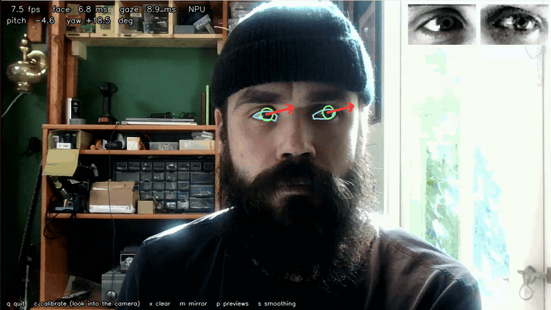

## Overview

In this tutorial you will run a live eye gaze tracking demo on the Arduino® VENTUNO™ Q, using the [`eyegaze`](https://aihub.qualcomm.com/models/eyegaze) model from [Qualcomm® AI Hub](https://aihub.qualcomm.com/). The demo finds your face in a USB camera feed, outlines the eyelid and iris of both eyes, and draws an arrow showing where you are looking. All three models involved run on the Qualcomm® Hexagon™ NPU of the board's Qualcomm® Dragonwing™ QCS8275 processor.

The EyeGaze model only understands a tight crop of a single eye, so it cannot be pointed at a camera feed directly. The demo therefore chains three models:

| Stage | Model | Runtime | Purpose |
| ----- | ----- | ------- | ------- |
| 1 | `mediapipe_face` face detector | LiteRT (TFLite) | Finds the face in the frame |
| 2 | `mediapipe_face` face landmark detector | LiteRT (TFLite) | Locates the corners of both eyes |
| 3 | `eyegaze` | ONNX Runtime | Eye landmarks and gaze direction, once per eye |

In this guide we will cover:

1. Powering and accessing the VENTUNO Q.
2. Setting up a Python virtual environment with both NPU runtimes.
3. Downloading the model files directly on the board.
4. Creating the two scripts and running the demo.
5. Why the EyeGaze model has to be rewritten before it runs fast on the NPU.

<Alert type="info">

**Note:** This tutorial starts from an empty folder and does not require any of the other AI Hub guides. If you have already followed [ONNX Runtime on the VENTUNO Q](/tutorials/ventuno-q/onnx-runtime) or [Real-Time Face Mesh](/tutorials/ventuno-q/face-mesh), most of the environment is in place and you will recognize several of the steps.

</Alert>

## Hardware & Software Requirements

### Hardware

- [Arduino® VENTUNO™ Q](https://store.arduino.cc/products/ventuno-q)
- [Arduino® USB-C Power Supply (65W)](https://store.arduino.cc/products/usb-c-power-supply-65w), or a 7–24 V DC supply on the power jack
- USB camera connected to the USB-A port
- A display, keyboard, and mouse\* connected to the board (the script opens a live window on-screen)

<Alert type="info">

**Note:** To use the VENTUNO Q as an SBC, a mouse is not required (but makes it easier).

</Alert>

### Software

- `adb` (Android® Platform Tools) or `ssh` available on your host machine
- Python 3.12 (pre-installed on the VENTUNO Q)
- Several gigabytes of free storage on the board for the Python packages

<Alert type="warning">

The VENTUNO Q must be powered with its power supply **before** connecting a USB-C® cable to a host computer, otherwise the board may crash. The recommended power supply is a minimum of 65 W in the range of 7–24 V.

</Alert>

## Accessing the Board Shell

With the board powered from its power jack, you can access the shell (terminal) on the VENTUNO Q using either `adb` or `ssh`.

To connect via `adb`, connect a USB-C® cable between the VENTUNO Q and your computer, then run:

```bash
# Using adb (Android Debug Bridge)
adb shell
```

To connect via `ssh`, ensure the VENTUNO Q is connected to the same network as your computer, then run:

```bash
# Using ssh (Secure Shell)
ssh arduino@<ip-address>
```

If you don't know the board's IP address, connect a keyboard and monitor and run `hostname -I` on the board, or configure Wi-Fi® on the board first with `sudo nmtui`.

<Alert type="info">

For more alternatives to remotely access your board, please see the [Remote Access](https://docs.arduino.cc/tutorials/uno-q/remote-access/) tutorial.

</Alert>

<Alert type="info">

**Note:** Because this demo opens a live camera window on-screen, run it from the board's actual desktop session (a physical monitor and keyboard, or a VNC/X11 session into the board). `adb` and `ssh` are still the easiest way to install dependencies and download the models before switching to the desktop session to watch the camera feed.

</Alert>

## Setting Up the Python Environment

All commands in this section are run **on the VENTUNO Q**.

### 1. Create the Project Folder and a Virtual Environment

Create an empty working directory, then create and activate a Python virtual environment inside it:

```bash
mkdir -p /home/arduino/eye-gaze
cd /home/arduino/eye-gaze

python3 -m venv .venv
source .venv/bin/activate
```

The `(.venv)` prefix in your prompt confirms the environment is active. Run the `source` command again at the start of each new session.

### 2. Install the AI Hub Models Package

The `qai-hub-models` package provides the command-line tool used to download the models. It also pulls in OpenCV, NumPy, and ONNX, which the demo uses:

```bash
pip install qai-hub-models
```

<Alert type="info">

**Note:** This installs a large collection of libraries and takes a while.

</Alert>

### 3. Install ONNX Runtime with QNN Support

`qai-hub-models` installs a CPU-only `onnxruntime` package, which conflicts with the NPU-enabled build (both provide the same `onnxruntime` module). Remove it, and pin `onnx` to the version the QNN wheel expects:

```bash
pip uninstall -y onnxruntime
pip install onnx==1.18.0
```

Then download and install the ONNX Runtime QNN wheel. This is the build that includes the `QNNExecutionProvider`, which routes inference to the NPU:

```bash
wget https://cdn.edgeimpulse.com/qc-ai-docs/wheels/onnxruntime_qnn-1.23.0-cp312-cp312-linux_aarch64.whl
pip install onnxruntime_qnn-*-linux_aarch64.whl
```

### 4. Pin the LiteRT Version

The two face models run through LiteRT (`ai-edge-litert`). `qai-hub-models` installs a 2.x release of it, which does not work with the NPU delegate, so put version 1.3.0 back:

```bash
pip install ai-edge-litert==1.3.0 opencv-python numpy
```

<Alert type="info">

**Note:** `pip` prints a line beginning with `ERROR:` reporting that `qai-hub-models` requires a newer `ai-edge-litert`. The downgrade still succeeds, and `qai-hub-models fetch` keeps working afterwards, so this message can be ignored. The reason for the pin is explained in the [Real-Time Face Mesh](/tutorials/ventuno-q/face-mesh) tutorial.

</Alert>

Confirm you ended up with the right versions:

```bash
pip list | grep -i -E "^onnxruntime|^ai-edge-litert|^onnx "
```

The output should list `ai-edge-litert 1.3.0`, `onnx 1.18.0`, and `onnxruntime-qnn 1.23.0`, and no plain `onnxruntime`.

### 5. Install the Qualcomm AI Runtime Libraries

NPU execution needs the **Qualcomm® AI Runtime (QAIRT)** libraries, which are not pulled in by any `pip` package. Install them from the board's apt repositories:

```bash
sudo apt update
sudo apt install qairt-libs qairt-dsp-binaries
```

Confirm that both backends the demo uses are present before continuing:

```bash
ls /usr/lib/libQnnHtp.so /usr/lib/libQnnTFLiteDelegate.so
```

## Downloading the Model Files

The demo needs three downloads. All of them go into a `models/` folder inside the working directory, and you can fetch them **directly on the board**:

| File | Description | Source |
| ---- | ----------- | ------ |
| `eyegaze-onnx-w8a16/` | Quantized EyeGaze model (`.onnx` graph and `.data` weights) | Qualcomm AI Hub |
| `mediapipe_face-tflite-float/` | Float face detector and face landmark detector | Qualcomm AI Hub |
| `anchors_face_back.npy` | Anchor table used to decode the detector output | MediaPipePyTorch reference |

### 1. Fetch the Models From AI Hub

With the virtual environment active and the working directory as the current directory, run:

```bash
cd /home/arduino/eye-gaze

# EyeGaze -> extracts models/eyegaze-onnx-w8a16/
qai-hub-models fetch eyegaze --runtime onnx --precision w8a16 --output-dir models/

# Face detector + face landmarks -> extracts models/mediapipe_face-tflite-float/
qai-hub-models fetch mediapipe_face --runtime tflite --precision float --output-dir models/
```

<Alert type="info">

**Note:** The face models are fetched in **float** precision on purpose. The NPU cannot execute FP32 directly, but the QNN backend converts a float graph to FP16 when it loads it, so both models still run on the NPU — in about 1 ms and 0.4 ms respectively. This avoids the miscalibrated `w8a8` face detector described in the [Real-Time Face Mesh](/tutorials/ventuno-q/face-mesh#known-limitations) tutorial. See the [NPU guide](/tutorials/ventuno-q/npu-guide) for the trade-offs between precisions.

</Alert>

### 2. Download the Anchor Table

The `anchors_face_back.npy` anchor table is not published on AI Hub. It is the static BlazeFace anchor table from the Apache-2.0 [`zmurez/MediaPipePyTorch`](https://github.com/zmurez/MediaPipePyTorch/) reference repository — the same repository `qai-hub-models` uses for its own `mediapipe_face` postprocessing:

```bash
wget -P models/ https://raw.githubusercontent.com/zmurez/MediaPipePyTorch/master/anchors_face_back.npy
```

### 3. Check the Result

List the downloaded files:

```bash
find models -type f | sort
```

You should see exactly these seven files:

```text
models/anchors_face_back.npy
models/eyegaze-onnx-w8a16/eyegaze.data
models/eyegaze-onnx-w8a16/eyegaze.onnx
models/eyegaze-onnx-w8a16/metadata.json
models/mediapipe_face-tflite-float/face_detector.tflite
models/mediapipe_face-tflite-float/face_landmark_detector.tflite
models/mediapipe_face-tflite-float/metadata.json
```

<Alert type="info">

**Note:** Each `metadata.json` lists the model's inputs and outputs with their exact shape, dtype, and quantization scale and zero point. The constants at the top of `eyegaze.py` are taken from `models/eyegaze-onnx-w8a16/metadata.json`.

</Alert>

## Creating the Scripts

The demo consists of two Python files that live next to the `models/` folder:

| File | Purpose |
| ---- | ------- |
| `prepare_model.py` | Rewrites the downloaded EyeGaze model so that it runs entirely on the NPU. It runs automatically the first time you start the demo |
| `eyegaze.py` | The demo itself |

On the VENTUNO Q, move into the working directory and create the first file:

```bash
cd /home/arduino/eye-gaze
nano prepare_model.py
```

Paste the `prepare_model.py` script from the [Code Example](#code-example) section below into the editor. In `nano`, save and exit with `Ctrl+X`, then `Y`, then `Enter`. Then do the same for the second file:

```bash
nano eyegaze.py
```

Your working directory should now contain `.venv/`, `models/`, `prepare_model.py`, and `eyegaze.py` (plus the downloaded `.whl` file, which is no longer needed).

## Running the Demo

With the virtual environment active, run the demo from the board's desktop session:

```bash
cd /home/arduino/eye-gaze
source .venv/bin/activate   # if not already active

python3 eyegaze.py
```

The first run prints one extra line while it converts the EyeGaze model, and writes the result to `models/eyegaze_npu.onnx`. Later runs reuse that file:

```text
Camera: /dev/video2
/home/arduino/eye-gaze/models/eyegaze-onnx-w8a16/eyegaze.onnx -> /home/arduino/eye-gaze/models/eyegaze_npu.onnx: 48 BatchNormalization -> Conv, 3 Reshape fixed
Models on the NPU. Press q to quit.
```

A window titled **"EyeGaze"** opens showing the camera feed, mirrored like a mirror. Once it finds your face, it draws on each eye:

- a **light blue** outline of the eyelid,
- a **green** ring around the iris, and
- a **red** arrow from the center of the iris, pointing where you are looking.

The top-left corner shows the frame rate, the time spent in the face stage and in the eye stage, and the gaze angles in degrees. The two small grayscale images in the top-right corner are the eye crops exactly as the EyeGaze model sees them, which is the quickest way to check that the eyes are being found correctly.

If you launch the script from a remote host (`adb` or `ssh`), you will first need to allow it to render on the display.

On the board itself (not using `adb` or `ssh`), open a terminal and run the following:

```bash
xhost +
export DISPLAY=:0   # replace 0 with your display number
```

This will enable a remote host to run applications on the display. If you do not do this, when running the script from a remote host, you will see `xcb` related error.

### Keyboard Controls

With the window focused:

| Key | Action |
| --- | ------ |
| `q` or `Esc` | Quit |
| `c` | Calibrate: look straight into the camera, then press `c` to make that direction zero |
| `x` | Clear the calibration |
| `m` | Toggle the mirrored view |
| `p` | Toggle the eye crop previews |
| `s` | Toggle smoothing, to compare against the raw model output |

### Command-Line Options

| Option | Description |
| ------ | ----------- |
| `--cpu` | Run all three models on the CPU instead of the NPU |
| `--source N` | Use `/dev/videoN` instead of the first USB camera |
| `--source FILE` | Process an image or video file instead of the camera |
| `--save PATH` | Write the annotated output to an image or video file |
| `--headless` | Do not open a window (useful together with `--save` over `ssh`) |
| `--width`, `--height` | Camera capture resolution (default 1280 × 720) |
| `--no-mirror` | Do not mirror the view |
| `--no-smoothing` | Start with smoothing off |

<Alert type="note">

**Camera index.** The VENTUNO Q's onboard camera pipeline occupies `/dev/video0` and `/dev/video1`, and a USB webcam claims two nodes of which only the first delivers frames. The script therefore does not assume an index: it picks the first node backed by the `uvcvideo` driver. If it reports `No USB webcam found`, check that the camera shows up in `lsusb`, and list the capture devices with:

```bash
for d in /sys/class/video4linux/video*; do echo "$d -> $(cat $d/name)"; done
```

Pass the number of your camera's node with `--source N` to override the automatic choice.

</Alert>

### Getting Good Results

The gaze estimate is only as good as the image of your eyes. Three things matter far more than anything else:

- **Sit close and centered.** Each eye should be at least 60 pixels wide in the frame. At 1280 × 720 that means your face fills roughly a third of the image height. The model reads gaze from the position of the iris inside the eye, so with a small, distant face a single pixel of error already amounts to several degrees.
- **Light your face from the front.** A window or lamp to one side leaves half of the face overexposed and the other half in shadow. Low light also makes most webcams lengthen their exposure, which drops the frame rate (to 7–15 fps on the camera used for this tutorial) and blurs the eyes.
- **Calibrate.** Look straight into the camera lens and press `c`. This removes the constant offset that depends on your face and on where the camera sits relative to the screen.

### Performance

On a VENTUNO Q running Ubuntu 24.04, measured on a 1280 × 720 frame:

| | NPU (burst) | CPU (`--cpu`) |
| - | ----------- | ------------- |
| Face stage (detector and two landmark passes) | 6.2 ms | 121 ms |
| Eye stage (EyeGaze on both eyes) | 8.2 ms | 179 ms |
| **Total per frame** | **~15 ms** | **~316 ms** |
| Single EyeGaze inference | 1.5 ms | 85 ms |

On the NPU the whole pipeline takes about 15 ms per frame, so the frame rate you see is set by the camera rather than by the board. On the CPU the same pipeline manages about three frames per second.

## Code Example

Both scripts are shown in full below. Save them in the working directory, next to the `models/` folder.

**prepare_model.py**

```python
#!/usr/bin/env python3
"""Rewrite AI Hub's EyeGaze w8a16 ONNX so that it runs entirely on the NPU.

onnxruntime-qnn 1.23 rejects two patterns in the published graph. Each rejected
node runs on the CPU instead, which cuts the model into 36 NPU pieces with a CPU
round trip between them: ~20 ms per inference instead of ~1.5 ms.

  * BatchNormalization with per-channel quantized parameters
    ("QNN BatchNorm doesn't support dynamic scale"), 48 of them. Each becomes the
    equivalent 1x1 Conv, quantized like the graph's other Convs (per-channel int8
    weight, int32 bias). The weight is a diagonal matrix: a depthwise Conv would
    be the obvious choice, but the HTP backend runs those ~100x slower here.
  * Reshape with allowzero=1 ("QNN Reshape doesn't support dynamic shape"). No
    target shape contains a zero, so the attribute is simply cleared.

The result matches the original to within 0.06 heatmap pixels / 0.04 degrees.
eyegaze.py runs this automatically when models/eyegaze_npu.onnx is missing.

Usage: python prepare_model.py [SOURCE.onnx] [OUTPUT.onnx]
"""
import sys
from pathlib import Path

import numpy as np
import onnx
from onnx import helper, numpy_helper

MODELS = Path(__file__).resolve().parent / "models"
SOURCE = MODELS / "eyegaze-onnx-w8a16" / "eyegaze.onnx"
OUTPUT = MODELS / "eyegaze_npu.onnx"


def convert(source=SOURCE, output=OUTPUT):
    model = onnx.load(str(source))
    graph = model.graph
    initializers = {t.name: t for t in graph.initializer}
    producer = {name: node for node in graph.node for name in node.output}

    def constant(name):
        return numpy_helper.to_array(initializers[name])

    def dequantized(name):
        """Float value of a BN parameter: what its (Quantize ->) Dequantize chain yields."""
        dq = producer[name]
        assert dq.op_type == "DequantizeLinear", dq.op_type
        if dq.input[0] in initializers:
            q = constant(dq.input[0]).astype(np.float64)
        else:
            quantize = producer[dq.input[0]]
            assert quantize.op_type == "QuantizeLinear", quantize.op_type
            zero_point = constant(quantize.input[2])
            limits = np.iinfo(zero_point.dtype)
            q = np.rint(constant(quantize.input[0]).astype(np.float64) / constant(quantize.input[1]))
            q = np.clip(q + zero_point, limits.min, limits.max)
        return (q - constant(dq.input[2]).astype(np.float64)) * constant(dq.input[1]).astype(np.float64)

    nodes, new_initializers = [], []
    batch_norms = reshapes = 0
    for node in graph.node:
        if node.op_type == "Reshape":
            for attribute in node.attribute:
                if attribute.name == "allowzero" and attribute.i:
                    assert 0 not in constant(node.input[1])
                    attribute.i = 0
                    reshapes += 1
        if node.op_type != "BatchNormalization":
            nodes.append(node)
            continue

        x, *parameters = node.input
        gamma, beta, mean, variance = (dequantized(p) for p in parameters)
        epsilon = next(a.f for a in node.attribute if a.name == "epsilon")
        # gamma * (x - mean) / sqrt(variance + epsilon) + beta  ==  w * x + b
        w = gamma / np.sqrt(variance + epsilon)
        b = beta - mean * w

        # Each output channel has a single non-zero weight, so per-channel int8
        # represents it exactly (as +-127).
        x_scale = float(constant(producer[x].input[1]))
        w_scale = np.maximum(np.abs(w), 1e-12) / 127.0
        b_scale = x_scale * w_scale
        b_q = np.rint(b / b_scale)
        assert np.abs(b_q).max() < 2**31 - 1, f"{node.name}: bias does not fit int32"

        name, channels = node.name, len(w)
        new_initializers += [
            numpy_helper.from_array(np.diag(w).astype(np.float32).reshape(channels, channels, 1, 1),
                                    f"{name}_w"),
            numpy_helper.from_array(w_scale.astype(np.float32), f"{name}_w_scale"),
            numpy_helper.from_array(np.zeros(channels, np.int8), f"{name}_w_zero"),
            numpy_helper.from_array(b_q.astype(np.int32), f"{name}_b_q"),
            numpy_helper.from_array(b_scale.astype(np.float32), f"{name}_b_scale"),
            numpy_helper.from_array(np.zeros(channels, np.int32), f"{name}_b_zero"),
        ]
        nodes += [
            helper.make_node("QuantizeLinear", [f"{name}_w", f"{name}_w_scale", f"{name}_w_zero"],
                             [f"{name}_w_q"], name=f"{name}_w_quantize", axis=0),
            helper.make_node("DequantizeLinear", [f"{name}_w_q", f"{name}_w_scale", f"{name}_w_zero"],
                             [f"{name}_w_dq"], name=f"{name}_w_dequantize", axis=0),
            helper.make_node("DequantizeLinear", [f"{name}_b_q", f"{name}_b_scale", f"{name}_b_zero"],
                             [f"{name}_b_dq"], name=f"{name}_b_dequantize", axis=0),
            helper.make_node("Conv", [x, f"{name}_w_dq", f"{name}_b_dq"], list(node.output),
                             name=f"{name}_as_conv", kernel_shape=[1, 1]),
        ]
        batch_norms += 1

    # Drop the BN parameters' now-unused Quantize/Dequantize chains.
    outputs = {o.name for o in graph.output}
    while True:
        used = {name for node in nodes for name in node.input} | outputs
        kept = [node for node in nodes if any(name in used for name in node.output)]
        if len(kept) == len(nodes):
            break
        nodes = kept

    kept_initializers = [t for t in graph.initializer if t.name in used] + new_initializers
    del graph.node[:], graph.initializer[:], graph.value_info[:]
    graph.node.extend(nodes)
    graph.initializer.extend(kept_initializers)

    onnx.checker.check_model(model)
    onnx.save(model, str(output))  # one file, weights embedded
    print(f"{source} -> {output}: {batch_norms} BatchNormalization -> Conv, "
          f"{reshapes} Reshape fixed")


if __name__ == "__main__":
    convert(*sys.argv[1:3])
```

**eyegaze.py**

```python
#!/usr/bin/env python3
"""Real-time eye gaze estimation on the Arduino VENTUNO Q (Qualcomm AI Hub EyeGaze).

Per frame:

    camera frame
      -> MediaPipe face detector
      -> MediaPipe face landmarks        -> the four eye corners
      -> one level 160x96 crop per eye   -> EyeGaze (EyeNet), once per eye
      -> 34 eye landmarks per eye + one gaze direction from both, smoothed and drawn

Usage:
    python eyegaze.py                       # first USB webcam, models on the NPU
    python eyegaze.py --cpu                 # same, on the CPU (slow)
    python eyegaze.py --source 2            # /dev/video2
    python eyegaze.py --source clip.mp4 --save out.mp4 --headless

Keys: q/Esc quit, c calibrate (look into the camera first), x clear calibration,
      m mirror, p eye previews, s smoothing.
"""
import argparse
import math
import os
import threading
import time
from pathlib import Path

import cv2
import numpy as np
import onnxruntime as ort
from ai_edge_litert.interpreter import Interpreter, load_delegate

HERE = Path(__file__).resolve().parent
MODELS = HERE / "models"
GAZE_SOURCE_MODEL = MODELS / "eyegaze-onnx-w8a16" / "eyegaze.onnx"   # as downloaded from AI Hub
GAZE_MODEL = MODELS / "eyegaze_npu.onnx"                             # made by prepare_model.py
FACE_DETECTOR = MODELS / "mediapipe_face-tflite-float" / "face_detector.tflite"
FACE_LANDMARKS = MODELS / "mediapipe_face-tflite-float" / "face_landmark_detector.tflite"
FACE_ANCHORS = MODELS / "anchors_face_back.npy"

# --- EyeGaze model I/O (models/eyegaze-onnx-w8a16/metadata.json) ---
EYE_W, EYE_H = 160, 96
INPUT_MAX = 65535.0                      # uint16 input, scale 1/65535: 0..65535 <-> 0..1
HEATMAP_SCALE, HEATMAP_ZERO = 0.000017086889783968218, 11910
GAZE_SCALE, GAZE_ZERO = 0.000015449146303581074, 38104
HEATMAP_TO_CROP = 2.0                    # heatmaps are 80x48, half the crop resolution
SOFTARGMAX_BETA = 100.0                  # same sharpness the model uses internally
# The 34 landmarks: eyelid outline, iris outline, iris centre, eyeball centre.
EYELID, IRIS, IRIS_CENTRE = slice(0, 16), slice(16, 32), 32

# --- Eye crops ---
# MediaPipe face-mesh indices. "right"/"left" are the subject's own right and left;
# corner pairs are ordered left-to-right in the (unmirrored) image.
RIGHT_EYE_CORNERS = (33, 133)
LEFT_EYE_CORNERS = (362, 263)
RIGHT_EYE_CONTOUR = (33, 7, 163, 144, 145, 153, 154, 155, 133, 173, 157, 158, 159, 160, 161, 246)
LEFT_EYE_CONTOUR = (362, 382, 381, 380, 374, 373, 390, 249, 263, 466, 388, 387, 386, 385, 384, 398)
EYE_CROP_WIDTH = 1.5                     # crop width, in corner-to-corner distances
# Mean iris heatmap peak: ~0.5 for an open eye, <0.1 when closed or not an eye.
# An eye appears above the first value and stays until it drops below the second.
EYE_CONFIDENCE_ON, EYE_CONFIDENCE_OFF = 0.2, 0.12

# --- Face tracking ---
DETECT_THRESHOLD = 0.6
DETECT_ROI_SCALE = 1.5                   # detector box -> landmark crop
TRACK_ROI_SCALE = 1.5                    # previous landmarks' bounding box -> landmark crop
LANDMARK_THRESHOLD = 0.5
MESH_PASSES = 2

# --- Smoothing (One Euro filter: cutoff = min_cutoff + beta * speed) ---
CORNER_FILTER = dict(min_cutoff=0.3, beta=10.0)      # eye corners, in face sizes
LANDMARK_FILTER = dict(min_cutoff=0.5, beta=0.1)     # eye landmarks, in pixels
GAZE_FILTER = dict(min_cutoff=0.3, beta=3.0)         # pitch/yaw, in radians
IMBALANCE_RATE = 0.05                    # per frame, for the left/right difference estimate

# --- Drawing (BGR) ---
EYELID_COLOR = (255, 220, 120)
IRIS_COLOR = (120, 255, 120)
GAZE_COLOR = (60, 60, 255)
ARROW_LENGTH = 3.0                       # in eye widths, for a gaze at 90 degrees
SHIFT = 4                                # draw with 1/16 px precision so overlays glide


class OneEuroFilter:
    """Low-pass filter whose cutoff rises with speed: steady at rest, quick to follow motion."""

    def __init__(self, min_cutoff, beta, d_cutoff=1.0):
        self.min_cutoff, self.beta, self.d_cutoff = min_cutoff, beta, d_cutoff
        self.x = self.dx = None

    @staticmethod
    def _alpha(cutoff, dt):
        return 1.0 / (1.0 + 1.0 / (2.0 * math.pi * cutoff * dt))

    def __call__(self, x, dt):
        x = np.asarray(x, dtype=np.float64)
        if self.x is None or dt <= 0:
            self.x, self.dx = x, np.zeros_like(x)
            return x
        self.dx += self._alpha(self.d_cutoff, dt) * ((x - self.x) / dt - self.dx)
        speed = np.linalg.norm(self.dx, axis=-1, keepdims=True)
        self.x = self.x + self._alpha(self.min_cutoff + self.beta * speed, dt) * (x - self.x)
        return self.x


def crop_transform(centre, angle, scale, out_w, out_h):
    """Affine (2x3) taking frame pixels to an upright out_w x out_h crop centred on
    `centre`, plus its inverse. `angle` is the tilt, in the frame, of the crop's x axis."""
    c, s = math.cos(angle) * scale, math.sin(angle) * scale
    forward = np.array([[c, s, 0.0], [-s, c, 0.0]])
    forward[:, 2] = np.array([out_w / 2.0, out_h / 2.0]) - forward[:, :2] @ centre
    return forward, cv2.invertAffineTransform(forward)


def transform_points(affine, points):
    return points @ affine[:, :2].T + affine[:, 2]


def litert_model(path, use_npu):
    if use_npu:
        # htp_performance_mode 2 = "burst", the fastest Hexagon clock profile.
        delegates = [load_delegate("libQnnTFLiteDelegate.so",
                                   options={"backend_type": "htp", "htp_performance_mode": "2"})]
        interpreter = Interpreter(model_path=str(path), experimental_delegates=delegates)
    else:
        interpreter = Interpreter(model_path=str(path), num_threads=4)
    interpreter.allocate_tensors()
    return interpreter


class FaceTracker:
    """Finds one face and returns its 468 MediaPipe mesh landmarks in frame pixels."""

    def __init__(self, use_npu):
        self.detector = litert_model(FACE_DETECTOR, use_npu)
        self.mesh = litert_model(FACE_LANDMARKS, use_npu)
        self.det_in = self.detector.get_input_details()[0]
        self.mesh_in = self.mesh.get_input_details()[0]
        self.det_size = int(self.det_in["shape"][1])
        self.mesh_size = int(self.mesh_in["shape"][1])
        # Detector outputs: box coordinates (.., 16) and scores (.., 1) for two anchor
        # grids; the larger grid comes first in the anchor table.
        outs = sorted(self.detector.get_output_details(), key=lambda d: -int(d["shape"][1]))
        self.det_coords = [d["index"] for d in outs if d["shape"][-1] == 16]
        self.det_scores = [d["index"] for d in outs if d["shape"][-1] == 1]
        outs = self.mesh.get_output_details()
        self.mesh_score = next(d["index"] for d in outs if np.prod(d["shape"]) == 1)
        self.mesh_points = next(d["index"] for d in outs if np.prod(d["shape"]) > 1)
        # (896, 2, 2): [[x_centre, y_centre], [w, h]] per anchor, normalised to 0..1.
        self.anchors = np.load(FACE_ANCHORS).astype(np.float32).reshape(-1, 2, 2)
        self.roi = None  # (centre xy, size, angle) of the landmark crop

    def _detect(self, rgb):
        h, w = rgb.shape[:2]
        scale = self.det_size / max(h, w)
        new_w, new_h = round(w * scale), round(h * scale)
        pad_x, pad_y = (self.det_size - new_w) // 2, (self.det_size - new_h) // 2
        canvas = np.zeros((self.det_size, self.det_size, 3), np.float32)
        canvas[pad_y:pad_y + new_h, pad_x:pad_x + new_w] = cv2.resize(rgb, (new_w, new_h)) / 255.0
        self.detector.set_tensor(self.det_in["index"], canvas[None])
        self.detector.invoke()
        scores = np.concatenate([self.detector.get_tensor(i).reshape(-1) for i in self.det_scores])
        best = int(np.argmax(scores))
        if scores[best] < math.log(DETECT_THRESHOLD / (1.0 - DETECT_THRESHOLD)):  # logit
            return None
        coords = np.concatenate([self.detector.get_tensor(i).reshape(-1, 16) for i in self.det_coords])
        # Anchor-relative [box centre, box size, right eye, left eye, nose, mouth, ears].
        offset, size = self.anchors[best]
        points = coords[best].reshape(8, 2) * size
        points[[0, 2, 3]] += offset * self.det_size
        points[[0, 2, 3]] = (points[[0, 2, 3]] - (pad_x, pad_y)) / scale
        box_size = points[1].max() / scale
        eye_a, eye_b = points[2], points[3]
        angle = math.atan2(eye_b[1] - eye_a[1], eye_b[0] - eye_a[0])
        return points[0].astype(np.float64), box_size * DETECT_ROI_SCALE, angle

    def _landmarks(self, rgb):
        """Runs the landmark model on the current ROI and moves the ROI onto the result."""
        centre, size, angle = self.roi
        forward, inverse = crop_transform(centre, angle, self.mesh_size / size,
                                          self.mesh_size, self.mesh_size)
        crop = cv2.warpAffine(rgb, forward, (self.mesh_size, self.mesh_size),
                              borderMode=cv2.BORDER_REPLICATE)
        self.mesh.set_tensor(self.mesh_in["index"], (crop.astype(np.float32) / 255.0)[None])
        self.mesh.invoke()
        if float(self.mesh.get_tensor(self.mesh_score).reshape(-1)[0]) < LANDMARK_THRESHOLD:
            self.roi = None
            return None
        points = self.mesh.get_tensor(self.mesh_points).reshape(-1, 3)[:, :2] * self.mesh_size
        points = transform_points(inverse, points.astype(np.float64))

        lo, hi = points.min(axis=0), points.max(axis=0)
        eye_a, eye_b = points[RIGHT_EYE_CORNERS[0]], points[LEFT_EYE_CORNERS[1]]
        self.roi = ((lo + hi) / 2.0, float((hi - lo).max()) * TRACK_ROI_SCALE,
                    math.atan2(eye_b[1] - eye_a[1], eye_b[0] - eye_a[0]))
        return points

    def __call__(self, rgb):
        # Detect on every frame (about 1 ms on the NPU). Following the previous frame's
        # landmarks alone can slide onto a hand or a beard and stay there; that is only
        # the fallback for frames where the detector misses, e.g. a turned head.
        self.roi = self._detect(rgb) or self.roi
        if self.roi is None:
            return None
        # Twice: the first pass centres the ROI on the face, the second measures on
        # that well-centred crop. The landmarks shift slightly with the face's
        # position in the crop otherwise.
        for _ in range(MESH_PASSES):
            points = self._landmarks(rgb)
            if points is None:
                return None
        return points


class EyeGaze:
    """Qualcomm AI Hub EyeGaze (EyeNet): one eye crop in, eye landmarks and gaze out."""

    def __init__(self, use_npu):
        if not GAZE_MODEL.exists():
            from prepare_model import convert
            convert(GAZE_SOURCE_MODEL, GAZE_MODEL)
        if use_npu:
            providers = [("QNNExecutionProvider",
                          {"backend_type": "htp", "htp_performance_mode": "burst"})]
        else:
            providers = ["CPUExecutionProvider"]
        self.session = ort.InferenceSession(str(GAZE_MODEL), providers=providers)
        self.on_npu = self.session.get_providers()[0] == "QNNExecutionProvider"
        self._xs = np.arange(EYE_W // 2, dtype=np.float32)
        self._ys = np.arange(EYE_H // 2, dtype=np.float32)

    def __call__(self, gray, centre, width, roll, flip):
        """gray: full frame. centre/width/roll: where the eye is, how wide (corner to
        corner, pixels) and how tilted. flip: True for the subject's right eye. EyeNet
        only knows left eyes, so right eyes are mirrored on the way in and back on
        the way out.

        Returns (landmarks (34, 2) in frame pixels, [pitch, yaw] in radians relative
        to the level crop, confidence, the crop).
        """
        forward, inverse = crop_transform(centre, roll, EYE_W / (EYE_CROP_WIDTH * width), EYE_W, EYE_H)
        # Replicated border: black beyond the frame edge would wreck the equalisation.
        crop = cv2.equalizeHist(cv2.warpAffine(gray, forward, (EYE_W, EYE_H),
                                               borderMode=cv2.BORDER_REPLICATE))
        image = crop[:, ::-1] if flip else crop
        tensor = (image.astype(np.float32) * (INPUT_MAX / 255.0)).astype(np.uint16)[None]
        heatmaps, gaze = self.session.run(["heatmaps", "gaze_pitchyaw"], {"image": tensor})

        # Landmarks: soft-argmax over the last hourglass stack's heatmaps. Doing it here
        # in float is ~3x closer to the reference than the NPU's own 16-bit softmax.
        maps = (heatmaps[0, -1].astype(np.float32) - HEATMAP_ZERO) * HEATMAP_SCALE
        peaks = maps.max(axis=(1, 2))
        weights = np.exp(SOFTARGMAX_BETA * (maps - peaks[:, None, None]))
        weights /= weights.sum(axis=(1, 2), keepdims=True)
        points = np.stack([weights.sum(axis=1) @ self._xs, weights.sum(axis=2) @ self._ys],
                          axis=1).astype(np.float64) * HEATMAP_TO_CROP
        pitch_yaw = (gaze[0].astype(np.float64) - GAZE_ZERO) * GAZE_SCALE
        if flip:
            points[:, 0] = EYE_W - points[:, 0]
            pitch_yaw[1] = -pitch_yaw[1]
        return transform_points(inverse, points), pitch_yaw, float(peaks[IRIS].mean()), crop


def gaze_vector(pitch, yaw, roll):
    """Unit vector in camera space (x right, y down, z away from the camera) for a
    gaze measured in an eye crop that is tilted by `roll` in the frame."""
    x, y = -math.cos(pitch) * math.sin(yaw), math.sin(pitch)
    c, s = math.cos(roll), math.sin(roll)
    return np.array([c * x - s * y, s * x + c * y, -math.cos(pitch) * math.cos(yaw)])


class Eye:
    """One eye's filters and latest result."""

    def __init__(self, corners, flip):
        self.corners, self.flip = list(corners), flip
        self.reset()

    def reset(self):
        self.landmark_filter = OneEuroFilter(**LANDMARK_FILTER)
        self.gaze_filter = OneEuroFilter(**GAZE_FILTER)
        self.landmarks = self.pitch_yaw = self.crop = None
        self.width = self.roll = 0.0
        self.visible = False


class GazePipeline:
    def __init__(self, use_npu=True, smoothing=True):
        self.tracker = FaceTracker(use_npu)
        self.eyegaze = EyeGaze(use_npu)
        self.smoothing = smoothing
        self.eyes = [Eye(RIGHT_EYE_CORNERS, flip=True), Eye(LEFT_EYE_CORNERS, flip=False)]
        self.corner_filter = OneEuroFilter(**CORNER_FILTER)
        self.imbalance = np.zeros(2)   # running (left - right) / 2 of [pitch, yaw]
        self.offset = np.zeros(2)      # calibration: [pitch, yaw] read when looking at the camera
        self.pitch_yaw = self.gaze = None
        self.face_ms = self.gaze_ms = 0.0

    def _eye_corners(self, mesh, dt):
        """The four eye corners, steadied. The model reads gaze from where the iris
        sits in the crop (about 2.5 degrees per pixel at this scale), so the corners
        that place the crop must not jitter, nor lag behind a moving head. Hence they
        are filtered relative to the face (its centroid, size and tilt, which average
        over many landmarks) rather than in frame coordinates."""
        corners = mesh[[c for eye in self.eyes for c in eye.corners]]
        if not self.smoothing:
            return corners
        origin = mesh.mean(axis=0)
        size = math.sqrt(((mesh - origin) ** 2).sum(axis=1).mean())
        across = mesh[list(LEFT_EYE_CONTOUR)].mean(axis=0) - mesh[list(RIGHT_EYE_CONTOUR)].mean(axis=0)
        c, s = across / np.linalg.norm(across)
        to_face = np.array([[c, s], [-s, c]])
        in_face = self.corner_filter((corners - origin) @ to_face.T / size, dt)
        return in_face * size @ to_face + origin

    def process(self, frame, dt):
        """Updates self.eyes and self.gaze from a BGR frame taken `dt` seconds after
        the previous one."""
        t0 = time.perf_counter()
        mesh = self.tracker(cv2.cvtColor(frame, cv2.COLOR_BGR2RGB))
        t1 = time.perf_counter()
        self.face_ms = (t1 - t0) * 1000.0
        if mesh is None:
            for eye in self.eyes:
                eye.reset()
            self.corner_filter = OneEuroFilter(**CORNER_FILTER)
            self.pitch_yaw = self.gaze = None
            self.gaze_ms = 0.0
            return

        gray = cv2.cvtColor(frame, cv2.COLOR_BGR2GRAY)
        corners = self._eye_corners(mesh, dt).reshape(2, 2, 2)
        for eye, (a, b) in zip(self.eyes, corners):
            eye.width = float(np.linalg.norm(b - a))
            eye.roll = math.atan2(b[1] - a[1], b[0] - a[0])
            landmarks, pitch_yaw, confidence, eye.crop = self.eyegaze(gray, (a + b) / 2.0, eye.width,
                                                                      eye.roll, eye.flip)
            was_visible = eye.visible
            eye.visible = confidence >= (EYE_CONFIDENCE_OFF if was_visible else EYE_CONFIDENCE_ON)
            if not eye.visible:
                continue
            if self.smoothing:
                if not was_visible:  # don't glide in from wherever the eye was before a blink
                    eye.landmark_filter = OneEuroFilter(**LANDMARK_FILTER)
                    eye.gaze_filter = OneEuroFilter(**GAZE_FILTER)
                landmarks = eye.landmark_filter(landmarks, dt)
                pitch_yaw = eye.gaze_filter(pitch_yaw, dt)
            eye.landmarks, eye.pitch_yaw = landmarks, pitch_yaw
        self._fuse()
        self.gaze_ms = (time.perf_counter() - t1) * 1000.0

    def _fuse(self):
        """One gaze direction from both eyes.

        The right eye goes through the model mirrored, so any constant bias in the
        model's yaw (or in where the face mesh puts the eye corners) comes out with
        opposite signs in the two eyes: on its own each eye is several degrees off
        and the two arrows splay apart. Their mean cancels that. The running half
        difference is kept so that one eye alone can be corrected the same way while
        the other is hidden."""
        right, left = self.eyes
        if right.visible and left.visible:
            self.imbalance += IMBALANCE_RATE * ((left.pitch_yaw - right.pitch_yaw) / 2.0 - self.imbalance)
            self.pitch_yaw, roll = (left.pitch_yaw + right.pitch_yaw) / 2.0, (left.roll + right.roll) / 2.0
        elif left.visible:
            self.pitch_yaw, roll = left.pitch_yaw - self.imbalance, left.roll
        elif right.visible:
            self.pitch_yaw, roll = right.pitch_yaw + self.imbalance, right.roll
        else:
            self.pitch_yaw = self.gaze = None
            return
        self.gaze = gaze_vector(*(self.pitch_yaw - self.offset), roll)

    def calibrate(self):
        """Call while the user looks into the camera: the current reading becomes zero."""
        if self.pitch_yaw is not None:
            self.offset = self.pitch_yaw.copy()

    def clear_calibration(self):
        self.offset = np.zeros(2)

    def gaze_angles(self):
        """(pitch, yaw) in degrees, or None. Seen from the camera: positive pitch
        looks down, positive yaw looks to the image's left."""
        if self.gaze is None:
            return None
        x, y, z = self.gaze
        return math.degrees(math.atan2(y, math.hypot(x, z))), math.degrees(math.atan2(-x, -z))


def fixed(points):
    return np.round(np.asarray(points) * (1 << SHIFT)).astype(np.int32)


def draw_eye(frame, eye, gaze):
    if not eye.visible:
        return
    thickness = max(1, round(frame.shape[0] / 400))
    cv2.polylines(frame, [fixed(eye.landmarks[EYELID])], True, EYELID_COLOR, thickness, cv2.LINE_AA, SHIFT)
    cv2.polylines(frame, [fixed(eye.landmarks[IRIS])], True, IRIS_COLOR, thickness, cv2.LINE_AA, SHIFT)
    start = eye.landmarks[IRIS_CENTRE]
    end = start + gaze[:2] * ARROW_LENGTH * eye.width
    cv2.arrowedLine(frame, tuple(fixed(start).tolist()), tuple(fixed(end).tolist()), GAZE_COLOR,
                    thickness + 1, cv2.LINE_AA, SHIFT, tipLength=0.25)
    cv2.circle(frame, tuple(fixed(start).tolist()), (thickness + 1) << SHIFT, GAZE_COLOR, -1,
               cv2.LINE_AA, SHIFT)


def draw_text(frame, text, origin, scale=0.6):
    cv2.putText(frame, text, origin, cv2.FONT_HERSHEY_SIMPLEX, scale, (0, 0, 0), 4, cv2.LINE_AA)
    cv2.putText(frame, text, origin, cv2.FONT_HERSHEY_SIMPLEX, scale, (255, 255, 255), 1, cv2.LINE_AA)


def render(frame, pipeline, fps, mirror, previews):
    for eye in pipeline.eyes:
        draw_eye(frame, eye, pipeline.gaze)
    if mirror:
        frame = cv2.flip(frame, 1)

    device = "NPU" if pipeline.eyegaze.on_npu else "CPU"
    draw_text(frame, f"{fps:4.1f} fps   face {pipeline.face_ms:4.1f} ms   gaze {pipeline.gaze_ms:4.1f} ms   {device}",
              (12, 26))
    angles = pipeline.gaze_angles()
    if angles is not None:
        draw_text(frame, f"pitch {angles[0]:+5.1f}   yaw {angles[1]:+5.1f}  deg", (12, 52))
    elif all(eye.crop is None for eye in pipeline.eyes):
        draw_text(frame, "no face", (12, 52))
    draw_text(frame, "q quit   c calibrate (look into the camera)   x clear   m mirror   p previews   s smoothing",
              (12, frame.shape[0] - 12), 0.45)

    if previews:
        # What the model sees. Ordered as on screen: the eye drawn on the left goes left.
        eyes = pipeline.eyes[::-1] if mirror else pipeline.eyes
        for i, eye in enumerate(eyes):
            if eye.crop is None:
                continue
            x = frame.shape[1] - (len(eyes) - i) * (EYE_W + 8)
            crop = eye.crop[:, ::-1] if mirror else eye.crop
            frame[8:8 + EYE_H, x:x + EYE_W] = cv2.cvtColor(crop, cv2.COLOR_GRAY2BGR)
            cv2.rectangle(frame, (x, 8), (x + EYE_W - 1, 8 + EYE_H - 1), (255, 255, 255), 1)
    return frame


def find_usb_camera():
    """Index of the first USB (UVC) capture node. On the VENTUNO Q /dev/video0 and
    /dev/video1 belong to the onboard camera pipeline and never deliver frames."""
    nodes = sorted(Path("/sys/class/video4linux").glob("video*"), key=lambda p: int(p.name[5:]))
    for node in nodes:
        driver = os.path.basename(os.path.realpath(node / "device" / "driver"))
        # A UVC camera exposes two nodes; index 0 is video, index 1 is metadata.
        if driver == "uvcvideo" and (node / "index").read_text().strip() == "0":
            return int(node.name[5:])
    return None


class Camera:
    """Webcam read on a background thread, so the main loop always gets the newest
    frame instead of one that has been waiting in the driver's queue."""

    def __init__(self, index, width, height):
        self.cap = cv2.VideoCapture(index, cv2.CAP_V4L2)
        # MJPG: uncompressed YUYV is limited to a few fps above 640x480 over USB 2.
        self.cap.set(cv2.CAP_PROP_FOURCC, cv2.VideoWriter_fourcc(*"MJPG"))
        self.cap.set(cv2.CAP_PROP_FRAME_WIDTH, width)
        self.cap.set(cv2.CAP_PROP_FRAME_HEIGHT, height)
        self.cap.set(cv2.CAP_PROP_FPS, 30)
        self.cap.set(cv2.CAP_PROP_BUFFERSIZE, 1)
        if not self.cap.isOpened():
            raise SystemExit(f"Could not open /dev/video{index}.")
        self.fps = 30.0
        self._frame = self._time = None
        self._count = self._taken = 0
        self._running = True
        self._new = threading.Condition()
        self._thread = threading.Thread(target=self._reader, daemon=True)
        self._thread.start()

    def _reader(self):
        while self._running:
            ok, frame = self.cap.read()
            with self._new:
                self._frame, self._time = (frame if ok else None), time.monotonic()
                self._count += 1
                self._new.notify()
            if not ok:
                return

    def read(self):
        """Blocks until there is a frame newer than the last one returned.
        Returns (frame, capture time in seconds), or (None, None) if the camera stops."""
        with self._new:
            if not self._new.wait_for(lambda: self._count != self._taken, timeout=5.0):
                return None, None
            self._taken = self._count
            return self._frame, self._time

    def release(self):
        self._running = False
        self._thread.join(timeout=2.0)
        self.cap.release()


class VideoFile:
    """Image or video file, played frame by frame (never dropping any)."""

    def __init__(self, path):
        self.cap = cv2.VideoCapture(path)
        if not self.cap.isOpened():
            raise SystemExit(f"Could not open {path}.")
        self.fps = self.cap.get(cv2.CAP_PROP_FPS) or 30.0
        self.is_image = self.cap.get(cv2.CAP_PROP_FRAME_COUNT) <= 1
        self._count = 0

    def read(self):
        ok, frame = self.cap.read()
        self._count += 1
        return (frame, self._count / self.fps) if ok else (None, None)

    def release(self):
        self.cap.release()


def open_source(args):
    if args.source is not None and not args.source.isdigit():
        return VideoFile(args.source)
    index = int(args.source) if args.source is not None else find_usb_camera()
    if index is None:
        raise SystemExit("No USB webcam found. Plug one in, or pass --source N (see `ls /dev/video*`) "
                         "or --source FILE.")
    print(f"Camera: /dev/video{index}")
    return Camera(index, args.width, args.height)


def parse_args():
    parser = argparse.ArgumentParser(description="Real-time eye gaze estimation (Qualcomm AI Hub EyeGaze).")
    parser.add_argument("--source", help="camera index, or an image/video file (default: first USB webcam)")
    parser.add_argument("--cpu", action="store_true", help="run the models on the CPU instead of the NPU")
    parser.add_argument("--use-npu", action="store_true", help=argparse.SUPPRESS)  # now the default
    parser.add_argument("--width", type=int, default=1280, help="camera capture width (default 1280)")
    parser.add_argument("--height", type=int, default=720, help="camera capture height (default 720)")
    parser.add_argument("--no-mirror", action="store_true", help="don't mirror the view")
    parser.add_argument("--no-smoothing", action="store_true", help="show raw model output")
    parser.add_argument("--save", metavar="PATH", help="write the annotated output to an image/video file")
    parser.add_argument("--headless", action="store_true", help="don't open a window")
    return parser.parse_args()


def main():
    args = parse_args()
    ort.set_default_logger_severity(3)
    source = open_source(args)
    is_image = getattr(source, "is_image", False)
    pipeline = GazePipeline(use_npu=not args.cpu, smoothing=not args.no_smoothing)
    print(f"Models on the {'NPU' if pipeline.eyegaze.on_npu else 'CPU'}. Press q to quit.")

    # Mirrored like a mirror for a live camera; files are shown as they are.
    mirror = isinstance(source, Camera) and not args.no_mirror
    previews = True
    writer = None
    fps = 0.0
    last_time = last_loop = None
    try:
        while True:
            frame, now = source.read()
            if frame is None:
                break
            pipeline.process(frame, 0.0 if last_time is None else now - last_time)
            last_time = now

            loop = time.perf_counter()
            if last_loop is not None:
                rate = 1.0 / max(loop - last_loop, 1e-6)
                fps = rate if fps == 0.0 else 0.9 * fps + 0.1 * rate
            last_loop = loop
            output = render(frame, pipeline, fps, mirror, previews)

            if args.save:
                if is_image:
                    cv2.imwrite(args.save, output)
                else:
                    if writer is None:
                        writer = cv2.VideoWriter(args.save, cv2.VideoWriter_fourcc(*"mp4v"), source.fps,
                                                 (output.shape[1], output.shape[0]))
                    writer.write(output)
            if not args.headless:
                cv2.imshow("EyeGaze", output)
                key = cv2.waitKey(0 if is_image else 1) & 0xFF
                if key in (ord("q"), 27):
                    break
                if key == ord("c"):
                    pipeline.calibrate()
                elif key == ord("x"):
                    pipeline.clear_calibration()
                elif key == ord("m"):
                    mirror = not mirror
                elif key == ord("p"):
                    previews = not previews
                elif key == ord("s"):
                    pipeline.smoothing = not pipeline.smoothing
    except KeyboardInterrupt:
        pass
    finally:
        source.release()
        if writer is not None:
            writer.release()
        cv2.destroyAllWindows()


if __name__ == "__main__":
    main()
```

## How It Works



Each camera frame goes through the following steps:

1. **Face detection (NPU).** The frame is letterboxed to 256 × 256 and passed through the face detector. The best-scoring anchor is decoded against the anchor table into a face box and two eye keypoints, which give a rotated square region of interest around the face.
2. **Face landmarks (NPU).** That region is cropped and passed through the landmark model, twice. The first pass centers the region on the face, the second measures on the centered crop. From the 468 landmarks the demo only keeps the four eye corners.
3. **Eye crops.** For each eye, a level 160 × 96 grayscale crop is cut out, 1.5 times as wide as the distance between the eye's corners, and histogram-equalized. The model was trained on left eyes only, so the right eye is mirrored before inference and its results are mirrored back afterwards.
4. **EyeGaze (NPU).** The model runs once per eye and returns three outputs: `heatmaps` (one 80 × 48 heatmap per landmark), `landmarks`, and `gaze_pitchyaw`. The demo computes the 34 landmark positions from the heatmaps itself, in floating point, which is about three times closer to the CPU reference than the `landmarks` output computed on the NPU in 16-bit.
5. **Fusion.** The two eyes are averaged into a single gaze direction. Because the right eye passes through the model mirrored, any constant bias in the model's yaw comes out with opposite signs in the two eyes, so each eye on its own is several degrees off and the two arrows point apart. The average cancels that bias.
6. **Smoothing.** The eye corners, the landmarks, and the gaze angles each pass through a [One Euro filter](https://gery.casiez.net/1euro/), a low-pass filter that smooths heavily while a value is still and lightly while it changes quickly. The eye corners are filtered relative to the face rather than in frame coordinates, so the crops do not lag behind when you move your head.

The 34 landmarks are ordered as 16 points around the eyelid, 16 points around the iris, the center of the iris, and the center of the eyeball. The gaze angles follow the convention of the model's training data, seen from the camera: positive pitch looks down, and positive yaw looks toward the left of the (unmirrored) image.

<Alert type="info">

**Note:** To act on the gaze instead of only drawing it, read `pipeline.gaze_angles()` in the main loop after `pipeline.process(...)`. It returns the fused `(pitch, yaw)` in degrees, or `None` while no eye is visible.

</Alert>

## Why the Model Is Rewritten

Loading the downloaded `eyegaze.onnx` directly with the `QNNExecutionProvider` works, but takes about **20 ms** per inference — more than ten times slower than the roughly 1 ms that AI Hub reports for this model on the VENTUNO Q.

The cause is that the asset was built for a newer ONNX Runtime than the 1.23 QNN wheel available for the board, which rejects two patterns in the graph:

- **48 `BatchNormalization` nodes**, because their parameters are quantized per channel.
- **3 `Reshape` nodes**, because they carry the `allowzero=1` attribute.

Every rejected node falls back to the CPU. That cuts the graph into 36 separate NPU partitions, with the data traveling back to the CPU between each of them.

`prepare_model.py` removes both patterns without changing what the model computes:

- Each `BatchNormalization` becomes the mathematically equivalent 1 × 1 `Conv`, quantized the same way as the graph's other convolutions.
- The `allowzero` attribute is cleared, which is safe because none of the target shapes contain a zero.

The rewritten model loads as a **single NPU partition** and runs in about **1.5 ms**, while matching the original to within 0.04° of gaze.

<Alert type="note">

**Checking for CPU fallback.** `sess.get_providers()` lists `CPUExecutionProvider` even when only a handful of shape operations fall back, so it cannot tell a healthy model from one like this. To see how a model was actually split, create the session with verbose logging. Save the following as `check.py`:

```python
import onnxruntime as ort

so = ort.SessionOptions()
so.log_severity_level = 0
ort.InferenceSession("models/eyegaze-onnx-w8a16/eyegaze.onnx", so,
                     providers=[("QNNExecutionProvider", {"backend_type": "htp"})])
```

Then run it and filter the log for the partition count and the reasons nodes were rejected:

```bash
python3 check.py 2>&1 | grep -E "Number of partitions|REASON" | sort | uniq -c
```

A model that runs well on the NPU reports one partition, or very few.

</Alert>

## Known Limitations

- **Accuracy is limited by the model.** Qualcomm reports a mean angular error of about 15° for EyeGaze on the MPIIGaze benchmark. The arrow shows the direction of your gaze convincingly, but it is not precise enough to tell which word on a screen you are reading.
- **The result depends on where the eye crop is placed.** The model infers gaze from where the iris sits in the crop, at roughly 2.5° per pixel for an eye that is 67 pixels wide. An error of a few pixels in the eye corners therefore shifts the result by ten degrees or more, which is why a small or badly lit face gives a restless arrow.
- **One face only.** The demo follows the highest-scoring face in the frame.
- **Glasses and strong side light** reduce the quality of both the eye corners and the eye crops.

## Conclusion

In this tutorial you set up both NPU runtimes on the VENTUNO Q, downloaded three models from Qualcomm AI Hub, and ran a script that tracks both eyes and estimates gaze direction in real time, with every model accelerated on the Qualcomm® Hexagon™ NPU. You also saw how to recognize a model that silently falls back to the CPU, and how rewriting two unsupported patterns took EyeGaze from 20 ms to 1.5 ms per inference. From here you can build on the gaze output — for example to detect whether someone is looking at a screen, or to drive attention-aware interfaces — directly on the Dragonwing™ QCS8275 processor.
