The Arduino platform has since its start in 2005, grown to become one of the most recognizable brands in the space of electronics and embedded design. 

But what are the cornerstones of Arduino? What is a "board", how do I write code to it, and what are the tools needed to create my own project? The goal with this guide is to provide you with an overview to the Arduino project.

***In this guide, you will gain an overview of the Arduino Ecosystem, and a set of links leading to more detailed articles.***


## Overview

This guide is divided into four main sections: **hardware**, **software tools**, **Arduino API**, and **Quick Reference**. You can navigate to each of these sections directly through the links below:

### Arduino Hardware

In this section, we will dedicate some time to learn about some fundamentals in electronics, and about the basic operation of an Arduino board.

  - [Anatomy of an Arduino Board](#anatomy-of-an-arduino-board)
  - [Basic Operation](#basic-operation)
  - [Circuit Basics](#circuit-basics)
  - [Electronic Signals](#electronic-signals)
  - [Analog Signal](#analog-signal)
  - [Digital Signal](#digital-signal)
  - [Sensors & Actuators](#sensors--actuators)
  - [Serial Communication Protocols](#serial-communication-protocols)
  - [Memory](#memory)
  - [Embedded Sensors](#embedded-sensors)
  - [Internet of Things (IoT)](#internet-of-things-iot)

### Arduino API

In this section you will learn what the Arduino API is, and how to create code that can run on your Arduino board.

  - [Main Parts](#main-parts)
  - [Program Structure](#program-structure)
  - [The "Sketch"](#the-sketch)
  - [Example Sketch](#example-sketch)
  - [Libraries](#libraries)
  - [Core Specific API](#core-specific-api)

### Arduino Software Tools

In this section you will learn how to set up your development environment as well as learning about what options there are.

  - [A Typical Workflow](#a-typical-workflow)
  - [Arduino IDE 1.8.x](#arduino-ide-18x)
  - [Arduino IDE 2](#arduino-ide-2)
  - [Arduino IoT Cloud](#arduino-iot-cloud)
  - [Web Editor](#web-editor)
  - [Library Manager](#library-manager)
  - [Arduino CLI](#arduino-cli)

### Quick Reference

The quick reference is an extract from the full Arduino API, containing popular functions, structures and methods.

  - [General](#general)
  - [Serial Communication](#serial-communication)
  - [GPIO / Pin Management](#gpio--pin-management)
  - [Structure](#structure)

## Arduino Hardware

Over the years, Arduino has released hundreds of hardware designs in many shapes and forms. 

### Anatomy of an Arduino Board

While all Arduino boards differ from each other, there are several key components that can be found on practically any Arduino. Let's take a look at the image below:


- **1.** **Microcontroller** - this is the brain of an Arduino, and is the component that we load programs into. Think of it as a tiny computer, designed to execute only a specific number of things.
- **2.** **USB port** - used to connect your Arduino board to a computer.
- **3.** **USB to Serial chip** - the USB to Serial is an important component, as it helps translating data that comes from e.g. a computer to the on-board microcontroller. This is what makes it possible to program the Arduino board from your computer.
- **4.** **Digital pins** - pins that use digital logic (0,1 or LOW/HIGH). Commonly used for switches and to turn on/off an LED.
- **5.** **Analog pins** - pins that can read analog values in a 10 bit resolution (0-1023).
- **6.** **5V / 3.3V pins**- these pins are used to power external components.
- **7.** **GND** - also known as `ground`, `negative` or simply `-`, is used to complete a circuit, where the electrical level is at 0 volt.
- **8.** **VIN** - stands for Voltage In, where you can connect external power supplies.

Depending on the Arduino board, you will find many more components. The items listed above are generally found on any Arduino board.

### Basic Operation

Most Arduino boards are designed to have a single program running on the microcontroller. This program can be designed to perform one single action, such as blinking an LED. It can also be designed to execute hundreds of actions in a cycle. The scope varies from one program to another.

The program that is loaded to the microcontroller will start execution as soon as it is powered. Every program has a function called "loop". Inside the loop function, you can for example:

- Read a sensor.
- Turn on a light.
- Check whether a condition is met.
- All of the above.

The speed of a program is incredibly fast, unless we tell it to slow down. It depends on the size of the program and how long it takes for the microcontroller to execute it, but it is generally in **microseconds (one millionth of a second)**.  

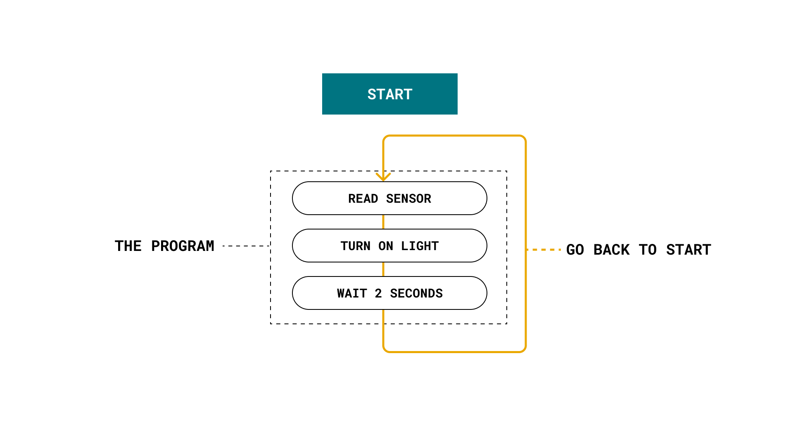

### Circuit Basics

Circuits consist of at least one active electronic component, and a conductive material, such as wires, so that current can pass through. When working with an Arduino, you will in most cases build a circuit for your project. 

A simple example of a circuit, is an **LED circuit**. A wire is connected from a pin on the Arduino, to an LED via a resistor (to protect the LED from high current), and finally to the ground pin (GND). When the pin is set to a **HIGH state**, the microcontroller on the Arduino board will allow an electric current to flow through the circuit, which turns on the LED. When the pin is set to a **LOW state**, the LED will turn off, as an electric current is not flowing through the circuit.

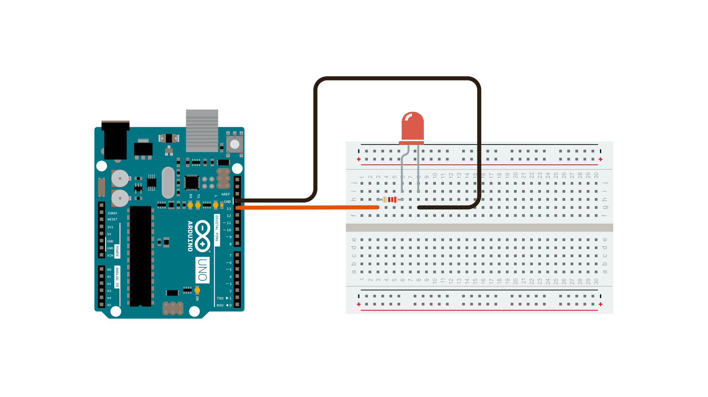

Circuits are typically represented as **schematics**, which are the blueprints for your circuit. The image below shows the schematic's representation of the same circuit shown in the image above.  

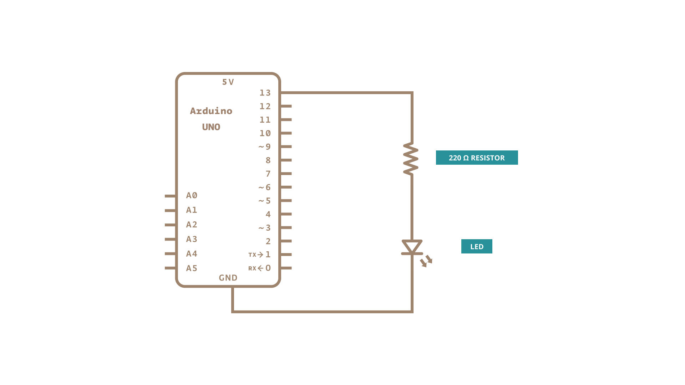

### Electronic Signals

All communication between electronic components are facilitated by **electronic signals.** There are two main types of electronic signals: **analog & digital**. 

#### Analog Signal

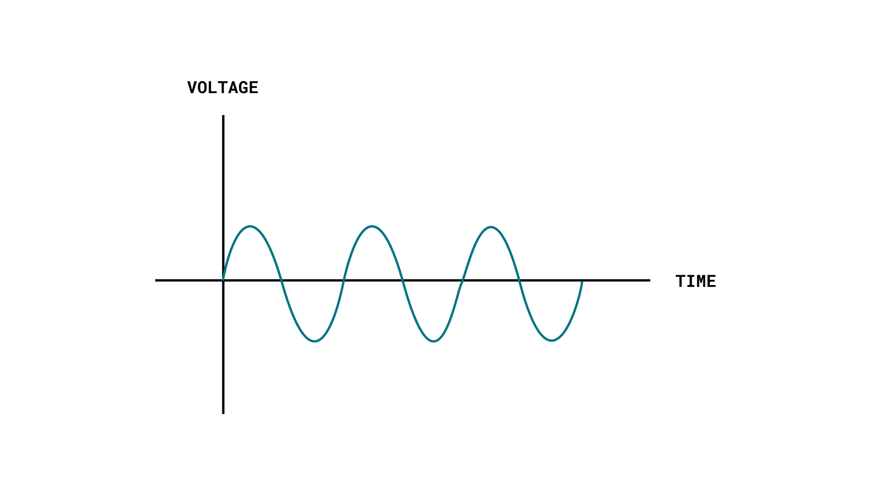

An analog signal is generally bound to a range. In an Arduino, that range is typically 0-5V, or 0-3.3V. 

If we for example use a potentiometer (an analog component used to change the resistance of a circuit), we can manually adjust this range (0-5V). In the program, this is represented in a range of 0-1023, which is a 10-bit resolution. 

If we write an analog signal using Pulse-Width Modulation (PWM), we can use a range between 0-255, as we are using an 8-bit resolution.

***Read more about [Analog Inputs](/learn/microcontrollers/analog-input) and [Analog Outputs (PWM)](/learn/microcontrollers/analog-output).***

#### Digital Signal

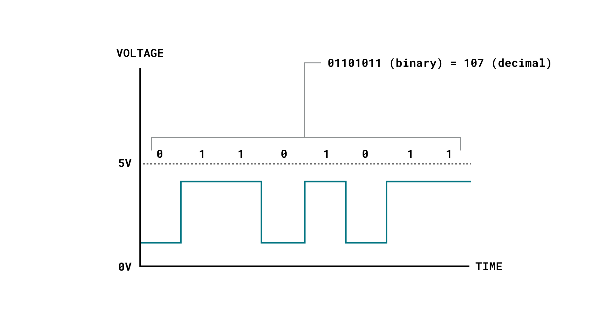

A digital signal works a bit different, representing only two binary states (0 or 1) that are read as high or low states in the program. This is the most common signal type in modern technology. 

You can easily read and write digital signals on an Arduino, which is useful to for example read button states, or to turn something on or off.

Digital signals might seem very basic (just 0 or 1), but are actually way more advanced. For example, we can create a sequence by sending a high or low state rapidly a number of times. This is known as a **binary sequence** or a **bitstream**.

Let's take a look at two binary sequences:

```
101101
101110001110011
```

Which in decimal format is:

```
45
23667
```

This is a clever way of sending large amounts of data from one point to the other, by rapidly sending high & low signals. In order to interpret the data from the signals, we use [Serial Communication Protocols](#serial-communication-protocols).

### Sensors & Actuators

When working with Arduino, it is important to understand **sensors** and **actuators**, and the difference between them. 

#### What Is a Sensor?

A sensor, in simple terms, is used to *sense* its environment, meaning it records a physical parameter, for example temperature, and converts it into an electronic signal. 

Sensors can also take the form of just a simple button: when a state changes (we pressed a button), the electronic signal is switched from low to high (0 to 1). 

There are many types of sensors, and several ways of recording data from them. Perhaps the easiest to use is an analog sensor, where we communicate a range of values through altering the voltage input fed into an Arduino analog pin (usually between 0-5 volts). This simply gives you a range between 0-1023 (a 10-bit resolution).

Digital sensors are a bit more advanced, depending on the type. They rely on [Serial Communication Protocols](#serial-communication-protocols) to send the data accordingly, and requires a bit more effort to translate the data. As mentioned in the [Electronic Signals](#electronic-signals) section above, data is sent using a binary sequence (e.g. `101101` is `45`), and this needs to be addressed and configured on a software level. Luckily, a lot of sensors are accompanied by **software libraries**, which makes it a lot easier to read.

In many cases using a library, all we need is just one line of code:

```arduino
sensorValue = sensor.read();
```

#### What Is an Actuator?

An actuator, in simple terms, is used to *actuate* or *change a physical state*. Some examples are:

- A light (such as an LED).
- A motor.
- A switch.

Actuators converts electric signals into e.g. radiant energy (light) or mechanical energy (movement). 

How actuators are controlled really depends on what type of component we have. The most simple way is to simply turn something on/off, while more advanced is controlling the amount of voltage a component receives (i.e. the speed of a motor).

To control actuators, it is common to use `digitalWrite()` and `analogWrite()`. 

```arduino
digitalWrite(LED, HIGH); //turn on an LED
digitalWrite(LED, LOW);  //turn off an LED

analogWrite(motor, 255); //set a motor to maximum capacity
analogWrite(motor, 25);  //set a motor to 10% of its capacity
```

#### Input & Output

Sensors and actuators, are typically referred to as **inputs and outputs**. When we write a program, it is common to construct conditionals that checks the state of a sensor, and decides whether it should actuate something. 

A basic example of this is a **button** and an **LED**. We can write a conditional that checks if a button is pressed, turn on the LED, and turn it off if the button is not pressed. In an Arduino program, it looks like this:

```arduino
int buttonState = digitalRead(buttonPin);   //read and store the button state (0 or 1)

if(buttonState == HIGH){        //check if state is high (button is pressed)
    digitalWrite(LED, HIGH);    //turn on LED
} else {
    digitalWrite(LED, LOW);     //turn off LED
}
```

### Serial Communication Protocols

There are several serial communication protocols that uses the aforementioned digital signals to send data. The most common are **UART, SPI & I²C**. The UART protocol is among other things, used to send data between a computer and Arduino board, such as uploading a new program, or reading data directly from an Arduino.

The SPI and I²C protocols are used for communication between both internal and external components. The communication is handled by something called a **serial bus**, which is attached to a specific pin on the Arduino. 

Using the I²C protocol, we can connect several sensors on the same pin, and retrieve the data accurately. Each device has an address that we need to specify in the program, which we use when making data requests.

***Find out more in the [Arduino SPI Guide](/learn/communication/spi) and [Arduino I2C Guide](/learn/communication/wire).***

### Memory

The "standard" Arduino typically has two memories: SRAM and Flash memory. 

The SRAM (Static Random-Access Memory) is used to for example store the value of a variable (such as the state of a boolean). When powered off, this memory resets.

The Flash memory is primarily used to store the main program, or the instructions for the microcontroller. This memory is not erased when powered off so that the instructions for the microcontroller are executed as soon as the board is powered.

How much memory is available on an Arduino varies from board to board. For example the **Arduino UNO** has a 32kB flash / 2kB SRAM, while a **Nano 33 IoT** has 256kB flash / 32kB SRAM. You will find this information in each of the product's documentation pages, which are available in the [Arduino Hardware Documentation](/).

***To learn more about memory on an Arduino, visit the [Arduino Memory Guide](/learn/programming/memory-guide).***

### Embedded Sensors

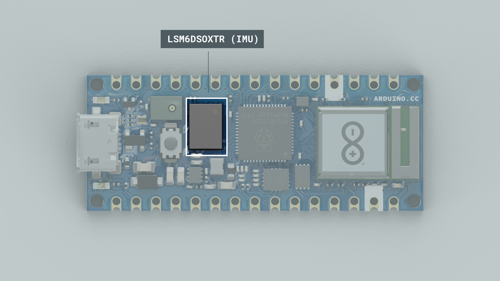

Many new Arduino boards come equipped with **embedded sensors**. For example, the [Nano 33 BLE Sense](https://store.arduino.cc/products/arduino-nano-33-ble-sense) has 7 embedded sensors, but is only **45x18mm** (the size of a thumb). These are all connected via the I²C protocol as mentioned above, and has a unique address.

### Internet of Things (IoT)

Most modern Arduino boards now come equipped with a radio module, designed to communicate wirelessly. There are several different ones: Wi-Fi, Bluetooth®, LoRa®, GSM, NB-IoT and more. Each are designed to communicate using the various technologies available on the market.

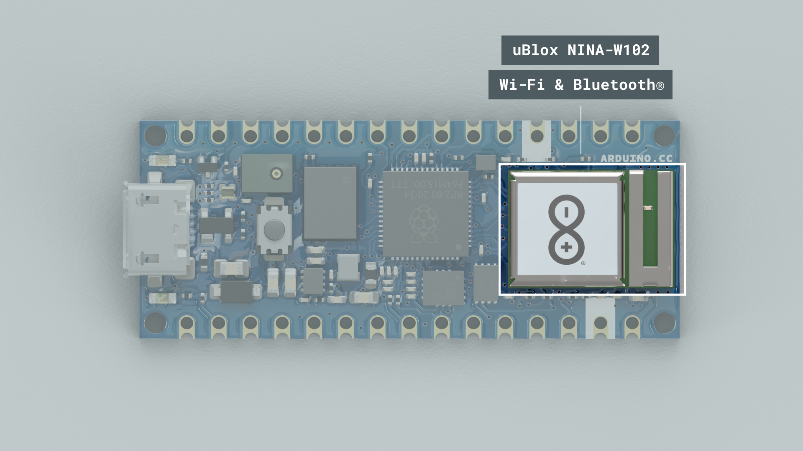

The most popular and inexpensive modules are the Wi-Fi & Bluetooth® modules. The Wi-Fi modules allow your board to connect to routers, and to request and send data over the Internet. In a way, it works the same as your computer when requesting various types of data over the Internet, just in a smaller scale. 

Bluetooth® is used to communicate with nearby devices, and is really useful for maintaining a fast and reliable connection. For example, in real-life applications, Bluetooth® technology for example used in wireless headphones & speakers.

Similarly to serial protocols, radio modules use their own set of protocols to communicate, such as HTTP, MQTT and UPD.

## Arduino API

***Visit the [Arduino Language Reference](https://www.arduino.cc/reference/en/) to explore the full Arduino API.***

The Arduino API, aka the "Arduino Programming Language", consists of several functions, variables and structures based on the C/C++ language. 

### Main Parts

The Arduino API can be divided into three main parts: **functions, variables** and **structure**:

- **Functions:** for controlling the Arduino board and performing computations. For example, to read or write a state to a digital pin, map a value or use serial communication.
- **Variables:** the Arduino constants, data types and conversions. E.g. `int`, `boolean`, `array`.
- **Structure:** the elements of the Arduino (C++) code, such as 
  - *sketch* (`loop()`, `setup()`)
  - *control structure* (`if`, `else`, `while`, `for`)
  - *arithmetic operators* (multiplication, addition, subtraction)
  - *comparison operators*, such as `==` (equal to), `!=` (not equal to), `>` (greater than).

The Arduino API can be described as a simplification of the C++ programming language, with a lot of additions for controlling the Arduino hardware. 

### Program Structure

The absolute minimum requirement of an Arduino program is the use of two functions: `void setup()` and `void loop()`. The "void" indicates that nothing is returned on execution.

- `void setup()` - this function executes only once, when the Arduino is powered on. Here we define things such as the mode of a pin (input or output), the baud rate of serial communication or the initialization of a library.
- `void loop()` - this is where we write the code that we want to execute over and over again, such as turning on/off a lamp based on an input, or to conduct a sensor reading every X second.

The above functions are **always** required in an Arduino sketch, but you are of course able to add several more functions, which is useful for longer programs. 

### The "Sketch"

In the Arduino project, a program is referred to as a "sketch". A sketch is a file that you write your program inside. It has the `.ino` extension, and is always stored in a folder of the same name. 

The folder can include other files, such as a **header file**, that can be included in your sketch. 

### Example Sketch

Below is an example of a standard Arduino sketch, which contains some popular Arduino programming elements. 

```arduino
/* 
This is a comment at the top of a program, 
it will not be recognized as code. Very good 
to add an explanation of what your code does 
here.

This sketch shows how to read a value from a
sensor connected to pin A1, print it out in 
the Serial Monitor, and turn on an LED connected
to pin number 2 if a conditional is met.
*/

int sensorPin = A1; //define pin A1 (analog pin)
int ledPin = 2; //define pin 2 (digital pin)
int sensorValue; //create variable for storing readings

//void setup is for configurations on start up
void setup() { 
    Serial.begin(9600); //initialize serial communication
    pinMode(ledPin, OUTPUT); //define ledPin as an output
}

void loop() {
    sensorValue = analogRead(sensorPin); // do a sensor reading
    
    Serial.print("Sensor value is: "); //print a message to the serial monitor
    Serial.println(sensorValue); //print the value to the serial monitor
    
    //check if sensorValue is below 200
    if(sensorValue < 200) { 
        digitalWrite(ledPin, HIGH); //if it is, turn on the LED on pin 2.
    }
    //if sensorValue is above 200, turn off the LED
    else{ 
        digitalWrite(ledPin, LOW);
    }
}
```

### Libraries

Arduino libraries are an extension of the standard Arduino API, and consists of **thousands of libraries**, both official and contributed by the community.

Libraries simplifies the use of otherwise complex code, such as reading a specific sensor, controlling a motor or connecting to the Internet. Instead of having to write all of this code yourself, you can just install a library, include it at the top of your code, and use any of the available functionalities of it. All Arduino libraries are open source and free to use by **anyone.**

To use a library, you need to include it at the top of your code, as the example below:

```arduino
#include <Library.h>
```

Most libraries also have a set of examples that are useful to get started with the library.

***You can browse through all official and contributed libraries in the [Arduino Libraries page](https://www.arduino.cc/reference/en/libraries/).***

### Core Specific API

Every Arduino board requires a "core", or "package", that needs to be installed in order to program it. All packages contain the standard Arduino API, but also a specific API that can only be used with specific boards. 

For example, the classic [ArduinoCore-avr](https://github.com/arduino/ArduinoCore-avr) package, automatically includes the [EEPROM](/learn/built-in-libraries/eeprom), and [SoftwareSerial](/learn/built-in-libraries/software-serial) libraries, and can be used freely without any additional installation. In this package you will find the classic Arduino UNO, Nano, Mega2560 and more.

Another example is the [ArduinoCore-mbed](https://github.com/arduino/ArduinoCore-mbed) package, which includes over 40 libraries, designed for specific board features, such as:

- **PDM** - used for sampling audio from microphones found onboard the Nano 33 BLE Sense and Nano RP2040 Connect.
- **Ethernet** - for using the Ethernet functionalities of the Portenta Vision Shield.
- **GSM** - to access GSM functionalities on the Portenta Cat. M1/NB IoT GNSS Shield.

These features are documented in the **documentation landing page** of each product. A list of all hardware can be found at [docs.arduino.cc](/).

## Arduino Software Tools

***The Arduino IDEs are available for download for free in the [Software downloads page](https://www.arduino.cc/en/software).***

Another integral part of the Arduino ecosystem are its software tools.

The Arduino IDE, as it is commonly referred to, is an **integrated development environment.** But what does that mean exactly?

In order to program your board, you need to write a program, compile that program into machine code, and finally: send over the new program to your board.

The Arduino IDE facilitates all this, from the first line of code written, to have it executed on the Arduino board's microcontroller. It is a program, or application, that you can download (or use an online version), to manage all of your code development. Back in the day, this was a complicated process, that required a good set of knowledge in electronics & computer science. Now, **anyone** can learn how to do it, with the help of the Arduino IDE.

Today, there are three Arduino IDEs available:

- Arduino IDE 1.8.x (classic)
- Arduino IDE 2 (new)
- Arduino Web Editor (online)

### A Typical Workflow

To upload code to an Arduino board using the IDE, one typically does the following:

**1. Install your board** - this means installing the right "package" for your board. Without the package, you can simply not use your board. Installing is done directly in the IDE, and is a quick and easy operation.

**2. Create a new sketch** - a sketch is your main program file. Here we write a set of instructions we want to execute on the microcontroller.

**3. Compile your sketch** - the code we write is not exactly how it looks like when uploaded to our Arduino: compiling code means that we check it for errors, and convert it into a binary file (1s and 0s). If something fails, you will get this in the error console.

**4. Upload your sketch** - once the compilation is successful, the code can be uploaded to your board. In this step, we connect the board to the computer physically, and select the right serial port. 

**5. Serial Monitor (optional)** - for most Arduino projects, it is important to know what's going on on your board. The Serial Monitor tool available in all IDEs allow for data to be sent from your board to your computer. 

### Arduino IDE 1.8.x

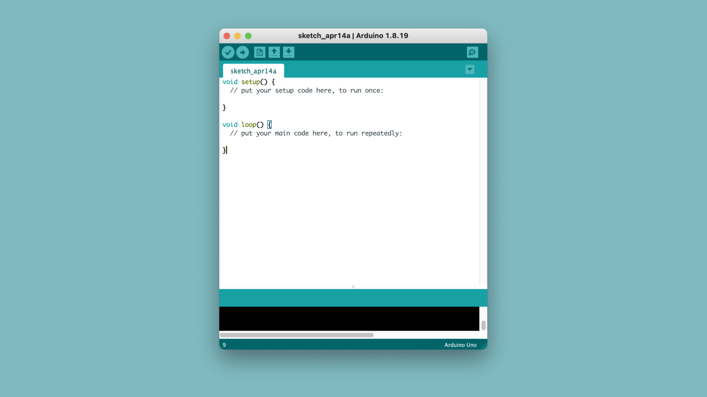

For what is now considered the "legacy" editor, the Arduino IDE 1.8.X, or "Java IDE", is the editor that was first released back when Arduino started.

***Learn more by visiting the [Arduino IDE 1 documentation](/software/ide-v1).***

### Arduino IDE 2


In 2021, the Arduino IDE 2 was released. The new IDE has the same functionality, but also supports features such as auto-completion and debugging. 

***Learn more by visiting the [Arduino IDE 2 documentation](/software/ide-v2).***

### Web Editor

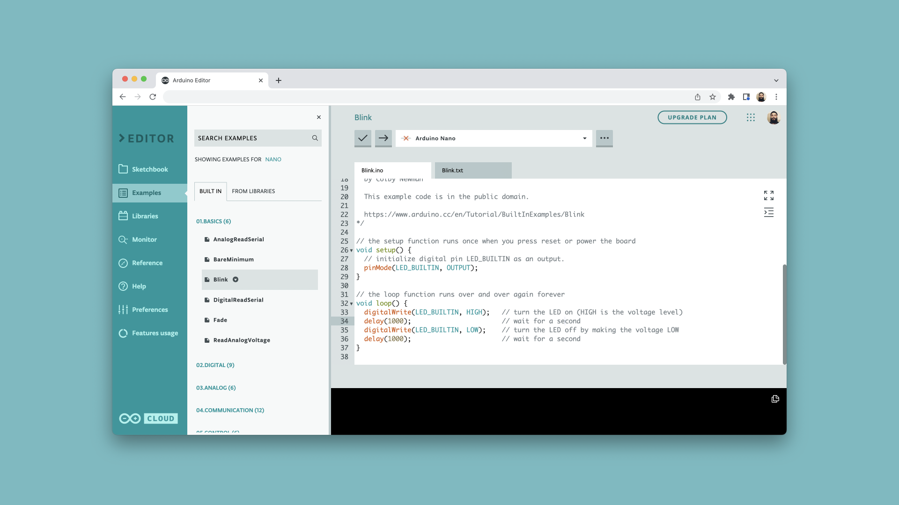

The [Arduino Web Editor](https://create.arduino.cc/editor) is an online IDE, part of the Arduino Cloud suite. Similar in function, this editor is completely web based, with online storage among other features. To use the Web Editor, you will need to register an Arduino account.

***Learn more by visiting the [Web Editor documentation](/cloud/web-editor).***

### Arduino IoT Cloud

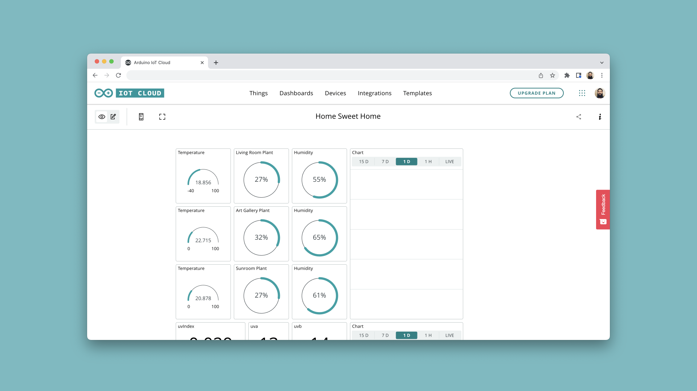

The [Arduino IoT Cloud](https://create.arduino.cc/iot/) allows you to configure, program and control/monitor your devices - all in one web based application. With the use of **things**, or your "digital twin", you can control and monitor variables directly from **dashboards**. The service also supports webhooks and integrations with other services, such as **Amazon Alexa.**

The cloud is made for **anyone** to use, and it does not require much previous experience to get started.

***Get started by reading the [Getting Started with the Arduino IoT Cloud](/cloud/iot-cloud/tutorials/iot-cloud-getting-started) guide, or visit the [full documentation](/cloud/iot-cloud).***


### Library Manager

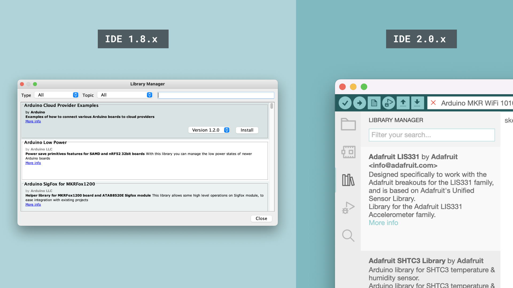

Every version of the IDE has a library manager for installing Arduino software libraries. Thousands of libraries, both official and contributed libraries, are available for direct download. Code examples for each library is made available on download.

***To explore all available Arduino libraries, visit the [Arduino Libraries page](https://www.arduino.cc/reference/en/libraries/).***

### Arduino CLI

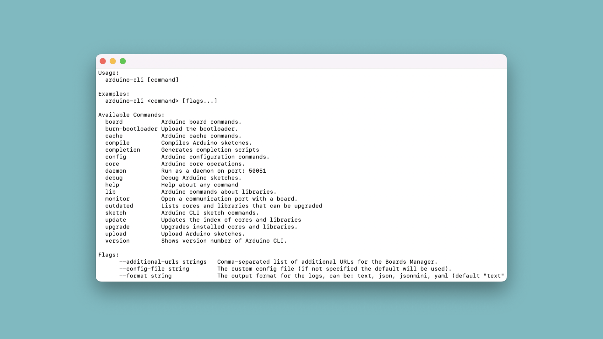

The Arduino CLI is a command line tool that can be used to compile and upload code to your board. It has no visual UI, but is very useful for automation. It is designed for more advanced users.

A proper use of the CLI can speed up your development time by far, as any operation is executed much faster than in the regular IDE.

***To learn more, visit the [Arduino CLI documentation](https://arduino.github.io/arduino-cli/).***

## Quick Reference

In this section, you will find a list of some of the most common elements in the standard Arduino API. This will help you get familiar with some key building blocks.

To explore the whole Arduino API, please refer to the [Arduino Language Reference](https://www.arduino.cc/reference/en/), an in-depth wiki maintained by Arduino and its community. You will find hundreds of entries, accompanied by code examples and elaborate descriptions.

### General

#### `setup()`

The `setup()` function is where you make program configurations.

```arduino
void setup() {
    //program configurations here
}
```

#### `loop()`

The `loop()` function is where your main program is stored. It will run as long as your board is powered.

```arduino
void loop() {
    //main program here
}
```

#### `delay()`

The `delay()` function pauses the program for a set number of milliseconds.

The classic blink sequence is found in the snippet below:

```arduino
void loop() {

   digitalWrite(LED, HIGH); //turn on an LED
   delay(1000); //as program is paused, with the LED on
   digitalWrite(LED, LOW); //program is unpaused, and the LED is turned off
   delay(1000); //program is paused, with the LED off

}
```

The `delay()` function is an incredibly useful function, and you will find it in almost all examples. But, for efficiency of the code, it is not the best option, as it prevents the Arduino from doing anything for the duration of the delay.

For this, we can use the `millis()` function.

#### `millis()`

The `millis()` function is a bit more advanced, but an incredibly resourceful function. It allows you to have multiple events happening simultaneously, without pausing the program. This is done by measuring time (in milliseconds) passed since the program started.

Then, with the use of **intervals** and continuously storing the **time for last event**, a simple algorithm can be made to have events happening at specific times without pausing the program.

See the example below:

```arduino
unsigned long previousMillis_1 = 0; //store time for first event
unsigned long previousMillis_2 = 0; //store time for second event

const long interval_1 = 1000; //interval for first event
const long interval_2 = 2000; //interval for second event


void setup(){

}

void loop() {

//check time since program started, and store in "currentMillis"
unsigned long currentMillis = millis();

   //conditional that checks whether 1 second has passed since last event
   if (currentMillis - previousMillis_1 >= interval_1) {
        previousMillis_1 = millis();
       //execute a piece of code, every *1 second*
   }

   //conditional that checks whether 2 seconds have passed since last event
   if (currentMillis - previousMillis_2 >= interval_2) {
        previousMillis_2 = millis();
    //execute a piece of code, every *2 seconds*
   }

}
```

While the `millis()` function is a more advanced concept than the `delay()` function, it is a good to start practicing it early on.

#### Functions

***Learn more about [Arduino functions](/learn/programming/functions).***

You can create custom functions that either just executes code and returns to the program, or that returns a result.

Example of a `void` function that does not return:

```arduino
int x;

void loop(){
    thisFunction(); //execute the function
}

void thisFunction() {
    x++; //increase x by 1 each time function is run.
}
```

Example of a type `int` function that returns a value.

```arduino

int value;

void setup(){

}

void loop(){
    value = returnFunction();
}

int returnFunction() {
    int returnValue = 5 + 2;
    return returnValue;
}
```

#### Variable Definition

Variables can either be created **locally** or **globally**. Variables that are defined in the `loop()` are considered local, and variables defined at the top of your sketch are considered global. 

```arduino
int sensorReading = x; //global variable

void setup(){

}

void loop(){
    int sensorReading = x; //local variable
}
```

#### Data Types

***See all data types in the [Language Reference](https://www.arduino.cc/reference/en#data-types).***

There are several data types available for use, and below are some of the most common:

```
bool 
byte
char
double
float
int
long
short
String
```

To store data in for example an `int` (integer):

```arduino
int exampleNumber = 25;
```

For numbers with a lot of decimals, we can use `float`:

```arduino
float exampleNumber = 22.2123002;
```

Or to store a string, we can use the `String` function:

```arduino
String exampleSentence = "This is a string!";
```

For simple switches and true/false, we use booleans:

```arduino
bool exampleSwitch = true; // true/false
```

### Serial Communication

***Read more about the [Serial class](https://www.arduino.cc/reference/en/language/functions/communication/serial/).***

Serial communication is **essential** to Arduino programming, as it is the easiest way to know what goes on on your board.

For this, we can use the `Serial` class.

#### `Serial.begin()`

Initializes serial communication between board & computer. This is defined in the `void setup()` function, where you also specify baud rate (speed of communication).

```arduino
void setup() {
    Serial.begin(9600);
}
```

#### `Serial.print()`

Prints data to the serial port, which can be viewed in the Arduino IDE **Serial Monitor** tool.

```arduino
void loop() {
    Serial.print();
}
```

#### `Serial.read()`

Reads the incoming serial data.

```arduino
void loop() {
    int incomingByte = Serial.read();
}
```

### GPIO / Pin Management

Configuring, controlling and reading the state of a digital/analog pin on an Arduino.

#### `pinMode()`

Configures a digital pin to behave as an input or output. Is configured inside the `void setup()` function.

```arduino
pinMode(pin, INPUT); //configures pin as an input
pinMode(pin, OUTPUT); //configures pin as an output
pinMode(pin, INPUT_PULLUP); //enables the internal pull-up resistor
```

***You can read more about digital pins in the article about [Digital Pins](/learn/microcontrollers/digital-pins).***

#### `digitalRead()`

Reads the state of a digital pin. Used to for example detect a button click.

```arduino
int state = digitalRead(pin); //store the state in the "state" variable
```

#### `digitalWrite()`

Writes a high or low state to a digital pin. Used to switch on or off a component.

```arduino
digitalWrite(pin, HIGH); // writes a high (1) state to a pin (aka turn it on)
digitalWrite(pin, LOW); // writes a low (0) state to a pin (aka turn it off)
```

#### `analogRead()`

Reads the voltage of an analog pin, and returns a value between 0-1023 (10-bit resolution). Used to read analog components.

```arduino
sensorValue = analogRead(A1); //stores reading of A1 in "sensorValue" variable
```

#### `analogWrite()`

Writes a value between 0-255 (8-bit resolution). Used for dimming lights or setting the speed of a motor. Also referred to as **PWM**, or Pulse Width Modulation. 

```arduino
analogWrite(pin, value); //write a range between 0-255 to a specific pin
```

PWM is only available on specific pins (marked with a "~" symbol).

### Structure

The structure of the Arduino API is based on C++, and can be considered the building blocks of a program. 

#### Conditionals

Conditionals are some of the most popular used elements in any program. In Arduino, a typical conditional consists of an `if` and `else` statement.

```arduino
if(variable == true){
    //do something
}
else {
    //do something else
}
```

You can make use of several if/else statements in your code.

#### Loops / Iterations

The `for` and `while` loops are commonly used in programs, to execute a block of code *for* a set number of times, or *while* a condition is met.

A basic use of a `while` loop to execute a block of code while `variable` is true.

```arduino
while (variable == true) {
    //do something
}
```

A basic use of a `for` loop is to execute a block of code a custom number of times (in this case, 10).

```arduino
  for (int x = 0; x < 10; x++) {
      //do something 10 times
  }
```

To break out of a loop, you can use `break`. In the snippet below, if a condition is met (variable is true), we break out of the loop.

```arduino
  for (int x = 0; x <= 10; x++) {
      if(variable == true) {
          break;
      }
  }
```

#### Arithmetic Operators

Arithmetic operators are used for addition, subtraction, multiplication, division and other mathematical calculations.

```arduino
int x = 5;
int y = 2;

x + y; //result is 7
x * y; //result is 10
x - y; //result is 3
```

#### Comparison Operators

Comparison operators are used for comparing one property to another, and are a key component of a conditional statement.

There are several comparison operators:

```arduino
!= //not equal to
< //less than
<= //less than or equal to
== //equal to
> //greater than
>= //greater than or equal to
```

To use them in a conditional, see the following example:

```arduino
if(value > 10) {
    //do something
}
```

#### Boolean Operators

Boolean operators (logical NOT `!`, AND `&&` and OR `||`) can for example be used for more advanced conditionals.

To use the AND `&&` operator:

```arduino
if(value > 10 && otherValue > 10){
    //do something if only if *both* conditions are met
}
```

To use the OR `||` operator:

```arduino
if(value > 10 || otherValue > 10){
    //do something if a one *or* the other condition is met
}
```

To use the NOT `!` operator:

```arduino
if(!value){
    //do something if value is false (!)
}
```

#### Compound Operators

Compound operators consists of **two operators**, which are used to perform two operations in the same statement. This can for example be to add `+` and assign `=` a value at the same time.

Here are some examples:

```arduino
x = 5;
y = 2;

x++; //increase by one, so x is now 6
x--; //decrease by one, so x is now 4

x += y; //x is now 7 (add and assign)
x -= y; //x is now 3 (subtract and assign)
x *= y; //x is now 10 (multiply and assign)
```

## Conclusion

In this guide, we have touched upon some of the fundamentals of Arduino: hardware, software tools, what is the Arduino API, and a quick intro to it. This guide serves mainly as an introduction to Arduino, and understanding the fundamental concepts. 

To learn more, you can explore the [Arduino Documentation](/) and the [Arduino Language Reference](https://www.arduino.cc/reference/en/), where you will discover thousands of detailed tutorials, examples, API entries and other resources.

To purchase an Arduino board, visit the [Arduino Store](https://store.arduino.cc/).

To download a version of the Arduino IDE, visit the [Arduino Software page](https://www.arduino.cc/en/software).
