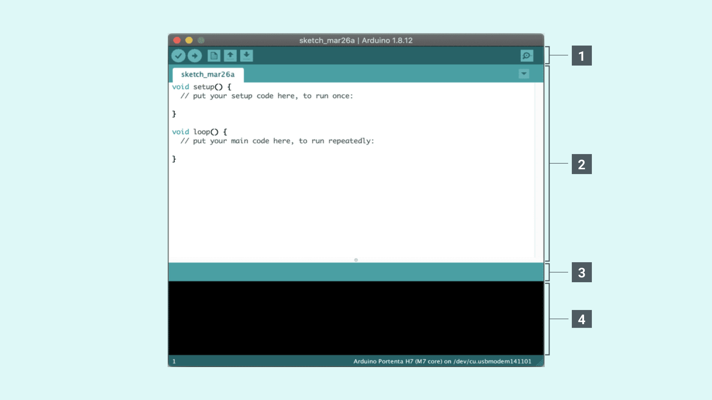
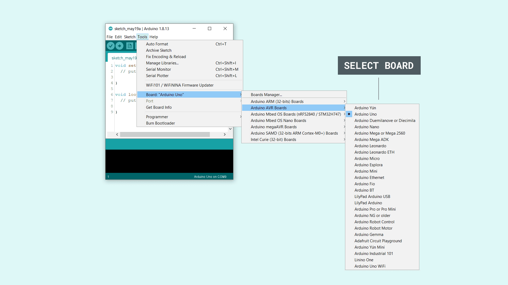
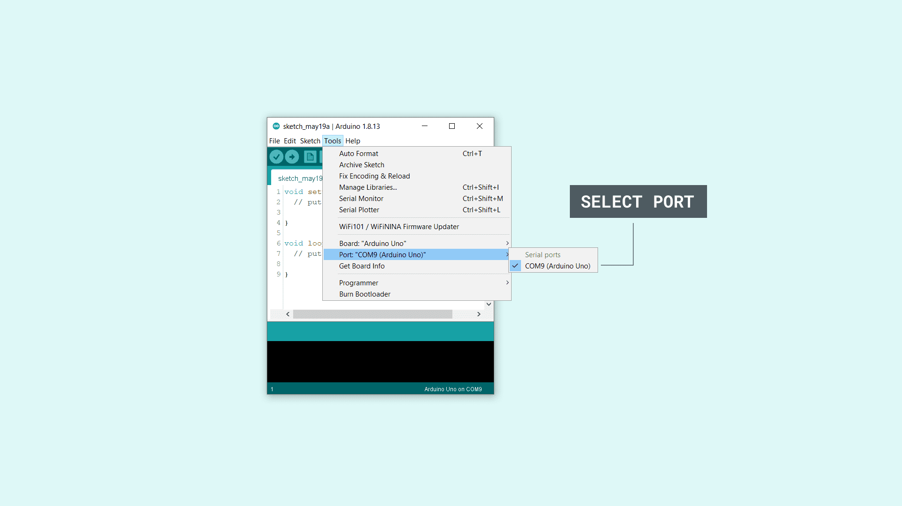
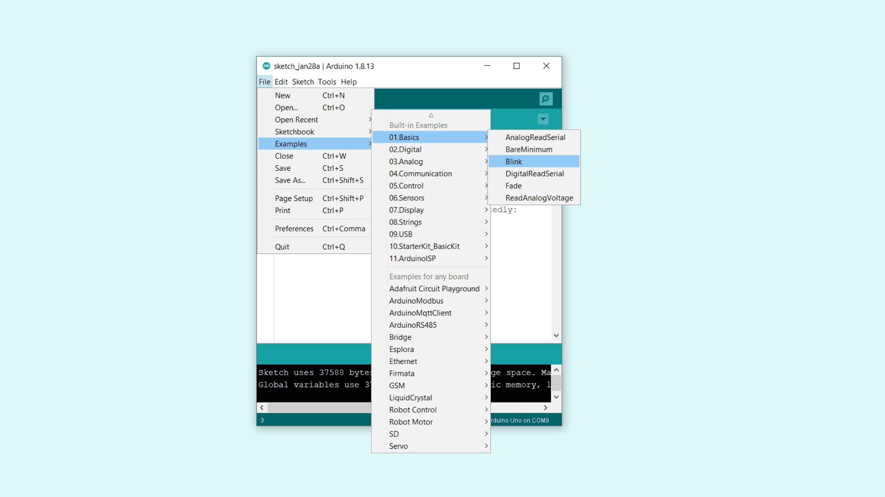
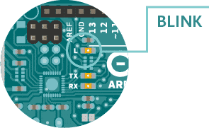
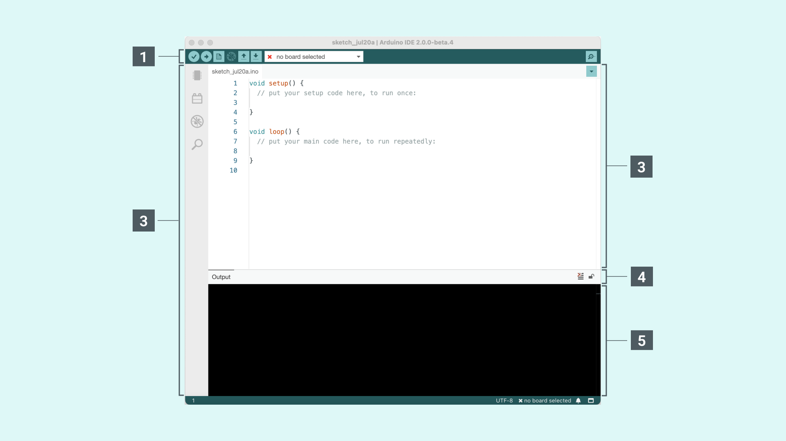
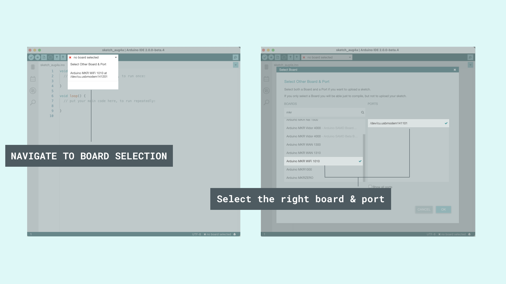
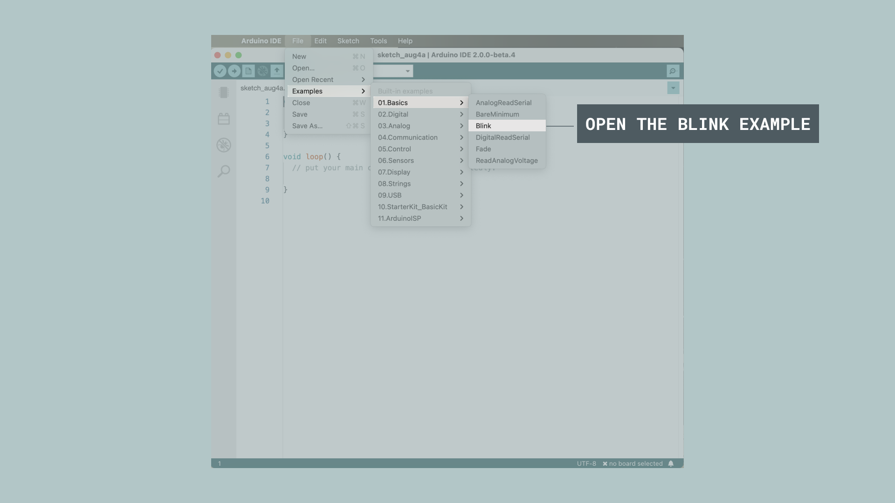

The Arduino Software (IDE) makes it easy to write code and upload it to the board offline. We recommend it for users with poor or no internet connection. This software can be used with any Arduino board.

There are currently two versions of the Arduino IDE, one is the IDE 1.x.x and the other is IDE 2.x. The IDE 2.x is new major release that is faster and even more powerful to the IDE 1.x.x. In addition to a more modern editor and a more responsive interface it includes advanced features to help users with their coding and debugging.

The following steps can guide you with using the offline IDE (you can choose either IDE 1.x.x or IDE 2.x):

**1.** Download and install the Arduino Software IDE:

   - **Arduino IDE 1.x.x** ([Windows](https://www.arduino.cc/en/Guide/Windows), [Mac OS](https://www.arduino.cc/en/Guide/macOS), [Linux](https://www.arduino.cc/en/Guide/Linux), [Portable IDE](https://www.arduino.cc/en/Guide/PortableIDE) for Windows and Linux, [ChromeOS](https://chrome.google.com/webstore/detail/arduino-create/dcgicpihgkmccjigalccipmjlnjopdfe)).
   - [**Arduino IDE 2.x**]([https://www.arduino.cc/en/Tutorial/getting-started-with-ide-v2/ide-v2-downloading-and-installing](https://www.arduino.cc/en/Tutorial/getting-started-with-ide-v2/ide-v2-downloading-and-installing))

**2.** Connect your Arduino board to your device.

**3.** Open the Arduino Software (IDE).

**The Arduino Integrated Development Environment** - or Arduino Software (IDE) - connects to the Arduino boards to upload programs and communicate with them. Programs written using Arduino Software (IDE) are called **sketches**. These sketches are written in the text editor and are saved with the file extension .ino.

## Using the offline IDE 1.x.x

The editor contains the four main areas:

**1.** A **Toolbar with buttons** for common functions and a series of menus. The toolbar buttons allow you to verify and upload programs, create, open, and save sketches, and open the serial monitor.

**2.** The **message area**, gives feedback while saving and exporting and also displays errors.

**3.** The **text editor** for writing your code.

**4.** The **text console** displays text output by the Arduino Software (IDE), including complete error messages and other information.

The bottom right-hand corner of the window displays the configured board and serial port.

Now that you are all set up, **let’s try to make your board blink!**

**5**. **Connect your Arduino** or Genuino board to your computer.

**6.** Now, you need to **select the right core & board**. This is done by navigating to **Tools > Board > Arduino AVR Boards > Board**. Make sure you select the board that you are using. If you cannot find your board, you can add it from **Tools > Board > Boards Manager**.

**7.** Now, let's make sure that your board is found by the computer, by **selecting the port**. This is simply done by navigating to **Tools > Port**, where you select your board from the list.

**8.** Let’s **try an example**: navigate to **File > Examples > 01.Basics > Blink**.

**9.** To **upload it to your board**, simply click on the arrow in the top left corner. This process takes a few seconds, and it is important to not disconnect the board during this process. If the upload is successful, the message "Done uploading" will appear in the bottom output area.

**10.** Once the upload is complete, you should then see on your board the yellow LED with an L next to it start blinking. You can **adjust the speed of blinking** by changing the delay number in the parenthesis to 100, and upload the Blink sketch again. Now the LED should blink much faster.

**Congratulations!** You have successfully programmed your board to blink its on-board LED! You can find more information about the [Arduino Software (IDE) 2.x here](https://www.arduino.cc/en/Tutorial/getting-started-with-ide-v2).

## Using the offline IDE 2.x

The editor contains the four main areas:

**1.** A **toolbar with buttons** for common functions and a series of menus. The toolbar buttons allow you to verify and upload programs, create, open, and save sketches, choose your board and port and open the serial monitor.

**2.** The **Sidebar** for regularly used tools. It gives you quick access to board managers, libraries, debugging your board as well as a search and replacement tool.

**3.** The **text editor** for writing your code.

**4.** **Console controls** gives control over the output on the console.

**5.** The **text console** displays text output by the Arduino Software (IDE), including complete error messages and other information.

The bottom right-hand corner of the window displays the configured board and serial port.

Now that you are all set up, **let’s try to make your board blink!**

**1.** **Connect your Arduino** or Genuino board to your computer.

**2.** Now, you need to **select the right board & port**. This is done from the toolbar. Make sure you select the board that you are using. If you cannot find your board, you can add it from the board manager in the sidebar.

**3.** Let’s **try an example**: navigate to **File > Examples > 01.Basics > Blink**.

**4.** To **upload it to your board**, simply click on the arrow in the top left corner. This process takes a few seconds, and it is important to not disconnect the board during this process. If the upload is successful, the message "Done uploading" will appear in the bottom output area.

**5.** Once the upload is complete, you should see on your board the yellow LED with the letter **L** next to it, start blinking. You can **adjust the speed of blinking** by changing the delay number in the parenthesis to 100, and upload the Blink sketch again. Now the LED should blink much faster.

**Congratulations!** You have successfully programmed your board to blink its on-board LED! You can find more information about the [Arduino Software (IDE) here](/software/ide-v2).
