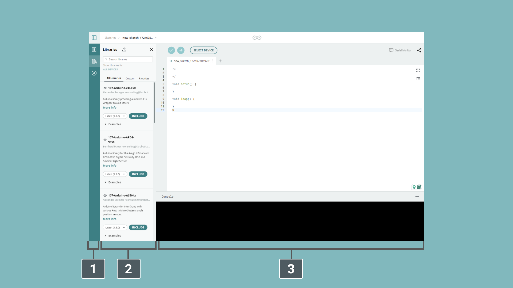
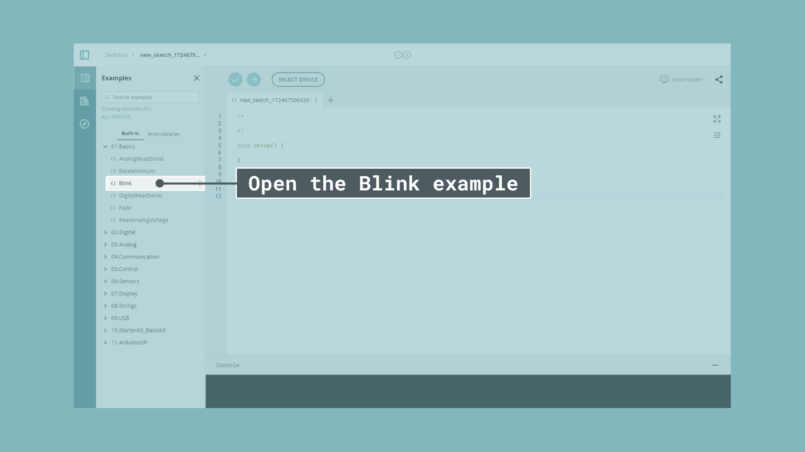

The Arduino Web Editor allows you to write code and upload sketches to any official Arduino board directly from your web browser (Chrome, Firefox, Safari and Edge). However, we recommend you use Google Chrome. 

This IDE (Integrated Development Environment) is part of [Arduino Create](https://create.arduino.cc/), an online platform that enables developers to write code, access tutorials, configure boards, and share projects. Designed to provide users with a continuous workflow, Arduino Create connects the dots between each part of a developer's journey from inspiration to implementation. Meaning, you now have the ability to manage every aspect of your project right from a single dashboard.

The Arduino Web Editor is hosted online, therefore it is always be up-to-date with the latest features and support for new boards.This IDE lets you write code and save it to the Cloud, always backing it up and making it accessible from any device. It automatically recognizes any Arduino and Genuino board connected to your PC, and configures itself accordingly.

All you need to get started is an Arduino account. The following steps can guide you to start using the Arduino Web Editor:

**1.** [Install the Arduino Create Agent](https://create.arduino.cc/getting-started/plugin/welcome) plugin.
   
**2.** [Create a new Arduino Account at this link](https://auth.arduino.cc/register). Complete the registration form, then hit the "create account" button. Then you will receive an email with a link to activate your account. Select the link and a new page will open with your confirmed account information.
   
**3.** [Log in the Arduino Web Editor](http://create.arduino.cc/editor).

### Using the online IDE

After logging in, you are ready to start using the Arduino Web Editor. The web app is divided into three main columns.

The Arduino Web Editor’s interface is as follows:

**1.** The **first column** lets you navigate between:
   
 - **Your Sketchbook**: a collection of all your sketches (a **sketch** is a program you upload on your board).
- **Examples**: read-only sketches that demonstrate all the basic Arduino commands (built-in tab), and the behavior of your libraries (from the libraries tab).
- **Libraries**: packages that can be included to your sketch to provide extra functionalities.
- **Serial monitor**: a feature that enables you to monitor, receive and send data to and from your board via the USB cable.
- **Help**: helpful links and a glossary about Arduino terms.
- **Preferences**: options to customize the look and behavior of your editor, such as text size and color theme.

**2.** The **second column** views the content of the chosen option.
   
**3.** The **third column**, the code area, is the one you will use the most. Here, you can write code, verify it and upload it to your boards, save your sketches on the Cloud, and share them with anyone you want.

Now that you are all set up, **let’s try to make your board blink!**

**1.** **Connect your Arduino** or Genuino board to your computer. Boards and serial ports are auto-discovered and selectable in a single dropdown. Pick the Arduino/Genuino board you want to upload to from the list at the top of the third column.
   
**2.** Let’s **try an example**: Choose Examples on the menu on the left (first column), then Basic and Blink. The [Blink sketch](https://create.arduino.cc/example/builtin/01.Basics%5CBlink/Blink/preview) is now displayed in the code area.

**3.** To **upload it to your board**, press the "Upload" button near the dropdown menu. While the code is verifying and uploading, a "BUSY" label replaces the upload button. If the upload is successful, the message "Success: done uploading" will appear in the bottom output area.
   
**4.** Once the upload is complete, you should see on your board the yellow LED with an **L** next to it start blinking. You can **adjust the speed of blinking** by changing the delay number in the parenthesis to 100, and upload the Blink sketch again. Now the LED should blink much faster.

**Congratulations!** You have successfully programmed your board to blink its on-board LED! You can find more information about the [Arduino Web Editor here](https://create.arduino.cc/projecthub/Arduino_Genuino/getting-started-with-arduino-web-editor-on-various-platforms-4b3e4a).