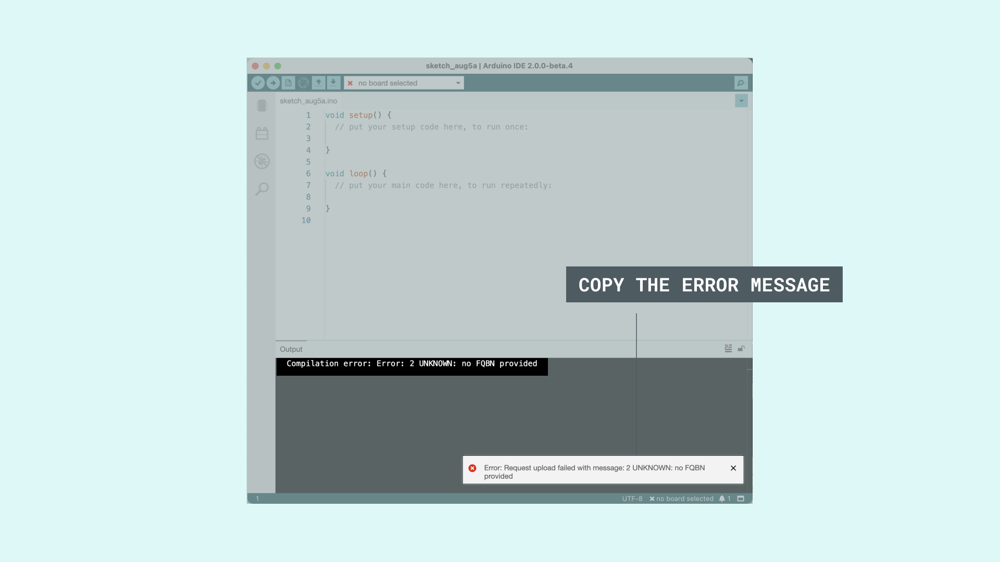
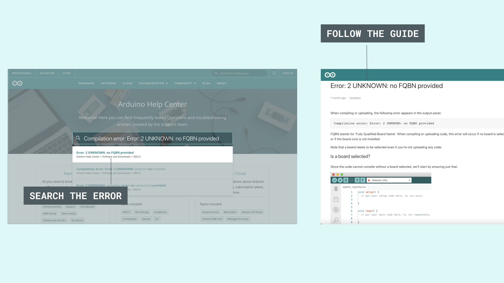

There are many factors involved in uploading a program to your Arduino board, and if any of them are missing, the upload could fail.

You can check the following suggestions to help you solve any potential problem:

**1.** Make sure that you chose the **right board and port**, and have installed all the **drivers needed**.

**2.** If you are still running into an error, you can copy the error message and search it through our [troubleshooting guide page](https://support.arduino.cc/hc).

**3.** If you cannot find any help through our [troubleshooting guide page](https://support.arduino.cc/hc), you can use our [forum support](https://forum.arduino.cc/c/using-arduino/installation-troubleshooting/18) for help.

Below you will find further guidance on the steps mentioned.
## Board & Port

The online Arduino Web Editor detects your board and port automatically, but if you are using the offline Arduino Software IDE, you need to select both your board and port manually using the following tips:

- Make sure you have the right item selected in the **Tools > Board** menu. If you have an Arduino UNO, you'll need to choose it.

- Then, check that the proper port is selected in the **Tools > Serial Port** menu (if your port doesn't appear, try restarting the IDE with the board connected to the computer):

  - On the **Mac**, the serial port should be something like /dev/tty.usbmodem621 (for the UNO or Mega 2560) or /dev/tty.usbserial-A02f8e (for older, FTDI-based boards).
  - On **Linux**, it should be /dev/ttyACM0 or similar (for the UNO or Mega 2560) or /dev/ttyUSB0 or similar (for older boards).
  - For **Windows**, it will be a COM port, but you'll need to check in the Device Manager (under Ports) to see which one. If you don't seem to have a serial port for your Arduino board, see the following information about drivers.

## Drivers

Drivers provide a way for the software on your computer (i.e. the Arduino software) to talk to any hardware you connect to it (i.e. the Arduino board).

The easiest way to check if the drivers for your board are installed correctly is by opening the **Tools > Serial Port** menu in the Arduino software with the Arduino board connected to your computer. 

Additional menu items should appear relative to when you open the menu without the Arduino connected to your computer. Note that it shouldn't matter what name the Arduino board's serial port gets assigned as long as that's the one you pick from the menu.

- On **Windows 7** (particularly the 64-bit version), you might need to go into the Device Manager and update the drivers for the UNO or Mega 2560. Just right click on the device (the board should be connected to your computer), and point Windows at the appropriate .inf file again. The .inf is in the drivers/ directory of the Arduino software (not in the FTDI USB Drivers sub-directory of it).

- If you get this error when installing the UNO or Mega 2560 drivers on **Windows XP**: "The system cannot find the file specified", you might try [this suggestion](https://www.techguy.org/threads/cannot-find-the-file-specified-during-the-installation-of-the-device.235959/) (about adding a "RunOnce" key to "HKEY_LOCAL_MACHINE\SOFTWARE\Microsoft\Windows\CurrentVersion").

- On **Linux**, the UNO and Mega 2560 show up as devices of the form /dev/ttyACM0. These are not supported by the standard version of the RXTX library that the Arduino software uses for serial communication. The Arduino software download for Linux includes a version of the RXTX library patched to also search for these /dev/ttyACM* devices. There's also an [Ubuntu package](https://launchpad.net/ubuntu/+source/rxtx/2.2pre2-3) (for 11.04) which includes support for these devices. If, however, you're using the RXTX package from your distribution, you may need to symlink from /dev/ttyACM0 to /dev/ttyUSB0 (for example) so that the serial port appears in the Arduino software.

Run:

```
sudo usermod -a -G tty yourUserName
sudo usermod -a -G dialout yourUserName
```

Log off and log on again for the changes to take effect.

## Troubleshooting Guide

In the [Arduino Help Center](https://support.arduino.cc/hc) you will find articles on frequently asked questions, and troubleshooting guides for most of the errors you might encounter. You can use our help center by browsing through the different categories and the questions provided in each of them, or by searching your error in the search tab.





## Forum Support

If it still doesn't work, you can ask for [help in the forum](https://forum.arduino.cc/c/using-arduino/installation-troubleshooting/18). Please include the following information:

- Your operating system.
- What kind of board you have. If it's a Mini, LilyPad or other board that requires extra wiring, include a photo of your circuit, if possible.
- Whether you were ever able to upload to the board. If so, what were you doing with the board before it stopped working, and what software have you recently added or removed from your computer?
- The messages displayed when you try to upload with verbose output enabled. To enable verbose output check the box next to File > Preferences > Show verbose output during: > upload.
- Click on Copy error messages button on the right side of the box. When submitting in the forum please use code tags button on the forum website toolbar) to post the output so that it will be correctly formatted.
