**Embedded systems** are microprocessor or microcontroller-based systems with a dedicated operational role. Rather than being made of separate components, like desktop computers, laptops or, gaming consoles, embedded systems integrate all the hardware and software necessary for a particular purpose. Nowadays, embedded systems are everywhere: automobiles, cameras, household appliances, and mobile devices are just some examples.

Embedded systems design can be challenging since it combines hardware design, firmware, and software development, all in one particular device or product. In order to produce high-quality embedded firmware and software for a particular device or product, **debugging** is a necessary step in their development process. **Debugging is the process of confirming that, one by one, many things that we believe to be true and functional in our code are true**. We find a "**bug**" in our code when one our more assumptions are not valid. 

***People worldwide have been talking about "bugs" for a long time; even [Thomas Alva Edison](https://spectrum.ieee.org/did-you-know-edison-coined-the-term-bug) used the word back in his days. The word bug has been used as an old term for "monster"; like gremlins in machinery, bugs are malicious.***

The following article will discuss different **debugging tools and techniques** used to find bugs in microcontroller-based systems, especially those based on [Arduino® hardware](https://store.arduino.cc/collections/boards).  

## Debugging tools and techniques

There are some basic debugging tools and techniques that we can use and implement to validate our code:

* The compiler and syntax errors.
* Traditional techniques: trace code and GPIOs.
* Remote debuggers.
* Simulators.
* In-circuit emulators and in-circuit debuggers.
* Hardware tools: multimeters, logic analyzers, oscilloscopes, and software-defined radios. 

Let us take a look into each one of the debugging tools and techniques.

### The Compiler and Syntax Errors

**Compiling** is transforming high-level code into machine language that can be understood by a processor, for example a microcontroller. In this process, the compiler also helps to identify **syntax errors**. Syntax errors indicate something wrong with the program's syntax; for example, **when a semi-colon is omitted at the end of a statement in a program**, the compiler generates a syntax error. 

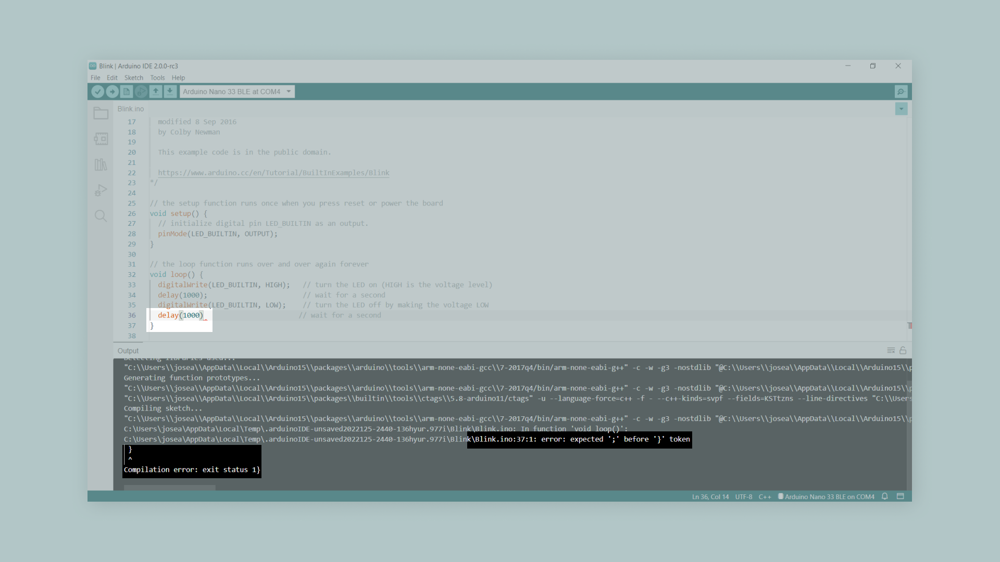

Using the compiler for debugging syntax errors can be sometimes tricky; let us analyze two commonly encountered situations: 

* **The compiler shows 100 errors**: This usually does not mean there are 100 errors; it often gets thrown off track for a while when the compiler finds an error. The compiler tries to recover and pick up again after the first error, but sometimes it reports false errors. **Only the first error message is genuinely reliable**; try to fix one error at a time and then recompile the program.
* **Getting weird compiler messages**: Compiler errors are shown in terse jargon, sometimes hard to read and understand, but with hidden and valuable information. **Read the error message carefully**; it will always tell where, inside the code, the error occurred.

### Traditional Techniques: Trace Code and GPIO's

Adding **trace code** is probably the simplest and most basic debugging technique used in embedded systems software design. This method adds trace code to the program to print out messages or values of variables (using the `Serial.print()` function, for example) as the program executes. For example, determining if a particular function is halting or freezing in our code can be made with trace code as shown in the example code below:

```arduino
// Print a message if the execution gets here
Serial.println("Code got here");

// Try to execute myFunction1()
myFunction1(); 

// Print a message if the execution gets here
Serial.println("Code got here, myFunction1 executed"); 

// Try to execute myFunction2()
myFunction2(); 

// Print a message if the execution gets here
Serial.println("Code got here, myFunction2 executed"); 
```

Using trace code for debugging is usually applicable only during the early stages of an embedded system code development. **Adding trace code to our programs takes a significant amount of processing time and resources**. Therefore, it can easily disrupt critical timing tasks in our programs. Additionally, if we use the UART for other tasks, we can have problems displaying trace code. 

***You can pass flash-memory based Strings to `Serial.print()` instruction by wrapping them with `F()`; for example, `Serial.println(F("Code got here"))` prints a flash-memory based String.***

Another trace code technique consists of **dumping strategic information into an array at run time**, we can then observe the contents of the array at a later time (for example, when the program terminates); this technique is also known as **dump into array**. Assume `good` and `bad` are two strategic variables we want to capture. The first step is to define a debug buffer in RAM to save the debugging measurements as shown in the code below:

```arduino
#define DUMP_BUFFER_SIZE 32
unsigned char goodBuffer[DUMP_BUFFER_SIZE];
unsigned char badBuffer[DUMP_BUFFER_SIZE];
unsigned long count = 0;
```

The variable `count` is used to index into the debug buffer, it must be initialized to zero before the debugging process begins. The code shown below dumps strategic information from the `good` and `bad` variables into the debug buffer: 

```arduino
void Save_Debug_Buffer(void) {
  if (count < DUMP_BUFFER_SIZE) {
    goodBuffer[count] = good;
    badBuffer[count] = bad;
    count++;
  }
}
```

**General Purpose Input/Output (GPIO) pins** can help debug purposes when the UART is in use or adding trace code is not particularly helpful. For example, we can turn on or off the built-in LED of an Arduino® board by inserting a `digitalWrite(LED_BUILTIN, HIGH)` instruction before or after questionable areas in our programs as shown in the example code below. If the built-in LED turns on, then we know that a particular line of code executed:

```arduino
// Print a message if the execution gets here
Serial.println("Code got here");

// Try to execute myFunction1()
myFunction1(); 

// Turn on the built-in LED for one second to indicate that myFunction1 was executed
digitalWrite(LED_BUILTIN, HIGH); 
delay(1000);
digitalWrite(LED_BUILTIN, LOW); 

// Try to execute myFunction2()
myFunction2(); 

// Turn on the built-in LED for one second to indicate that myFunction2 was executed
digitalWrite(LED_BUILTIN, HIGH); 
delay(1000);
digitalWrite(LED_BUILTIN, LOW);
```

### Remote Debuggers

**Remote debugging** is another common approach used to debug embedded systems. **Remote debuggers work by connecting a particular embedded system to a host computer** and then using software in the host computer to interact with the embedded system hardware. Remote debuggers are helpful when the development environment is on a different architecture rather than the target system. For example, think about developing code on a Windows-based computer for an ARM-based microcontroller system. 

Remote debuggers usually have two essential parts: a **front-end debugger** and a **back-end debugger**. 

* The front-end debugger contains the user interface (can be graphical or command-line-based) and offers the programmer choices about the execution of the code in the embedded system hardware.
* The back-end debugger, also known as the "debug monitor," is specific for a particular processor architecture or family an usually work with an external hardware tool, like an in-circuit emulator or an in-circuit debugger. It starts when the processor resets and handles the runtime instruction between the front-end debugger and the embedded system hardware. 

***The debugger tool is a newly introduced yet less famous feature of Arduino IDE 2. Check out [this tutorial](https://docs.arduino.cc/software/ide-v2/tutorials/ide-v2-debugger) that shows how to use the Arduino® IDE 2 debugger with supported boards.***

### Simulators

Simulators are tools used to **simulate the functionality and the instruction set of the target processor**. These tools, usually, can only simulate the target processor functionalities but not its environment and external parts and components. Simulators are handy in the early stages of the development process, where we only have the software but have not implemented any hardware yet.

***[Tinkercad Circuits](https://www.tinkercad.com/learn/circuits) is an excellent simulator for beginners in the Arduino® ecosystem. This tool can simulate the instruction set of an Arduino® UNO board and the functionalities of several electronic components such as resistors, LEDs, motors, LCDs, and some sensors.***

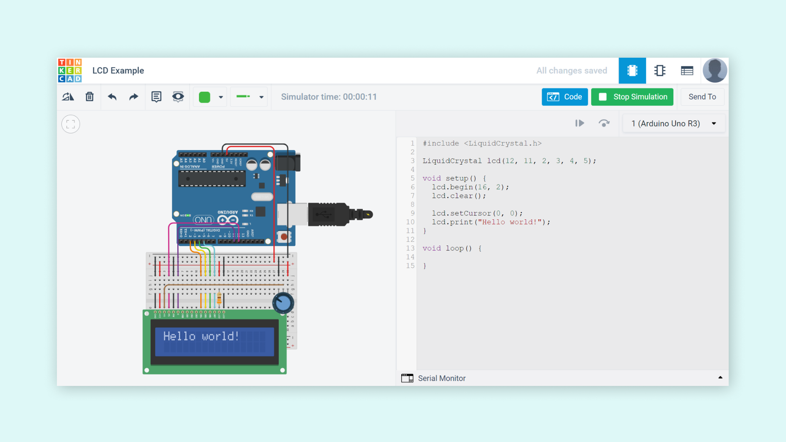

### In-Circuit Emulators and In-Circuit Debuggers

An **in-circuit emulator** (or ICE) is a specialized tool that allows developers to examine the state of the processor while a particular program is running. ICEs are considered embedded systems by themselves; they are a copy of the target processor and its memory (RAM and ROM); this is why they provide an unintrusive way to debug code at the target processor. Historically, ICEs were the tool of choice of embedded systems developers, but as processor complexity and clock speed increased, ICEs became more expensive, and their availability declined considerably.

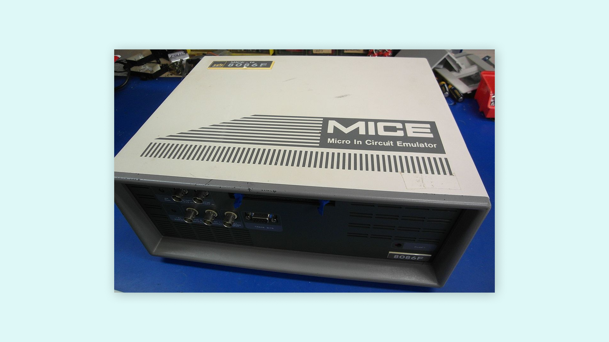

> [Binarysequence](https://commons.wikimedia.org/wiki/File:Microtek_8086_In-Circuit_Emulator.jpg), [CC BY-SA 3.0](https://creativecommons.org/licenses/by-sa/3.0>), via Wikimedia Commons.

An **in-circuit debugger** (or ICD) is also a specialized tool connected between a host computer and a processor for debugging real-time applications faster and easier; this tool uses some memory and GPIO pins of the target microcontroller during the debugging operations. With an ICD, developers access an on-chip debug module which is integrated into the CPU over an interface (for example, JTAG). This debug module allows developers to load, run, halt and step the processor.

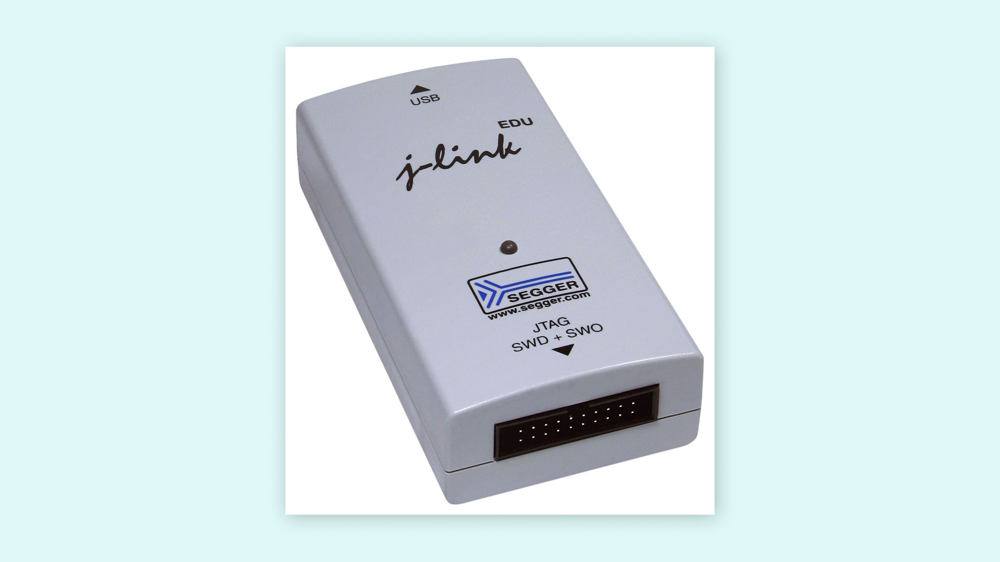

> [SEGGER Microcontroller GmbH & Co](https://commons.wikimedia.org/wiki/File:Segger_J-Link_EDU.jpg), [CC BY-SA 3.0](https://creativecommons.org/licenses/by-sa/3.0), via Wikimedia Commons.

***The fundamental difference between an ICE and an ICD relies on the resources used to control the debug target. In ICEs, resources are provided by the emulation hardware; in ICDs, resources are provided by the target processor.*** 

#### Arduino® ICD Support

The Arduino® boards with a SAMD microcontroller support ICD debugging; these boards are the following:

* [Zero](https://store.arduino.cc/products/arduino-zero). 
* [Nano 33 IoT](https://store.arduino.cc/products/arduino-nano-33-iot).
* [MKR Zero](https://store.arduino.cc/collections/boards/products/arduino-mkr-zero-i2s-bus-sd-for-sound-music-digital-audio-data).
* [MKR WiFi 1010](https://store.arduino.cc/collections/boards/products/arduino-mkr-wifi-1010).
* [MKR WAN 1300](https://store.arduino.cc/products/arduino-mkr-wan-1300-lora-connectivity).
* [MKR WAN 1310](https://store.arduino.cc/products/arduino-mkr-wan-1310).
* [MKR FOX 1200](https://store.arduino.cc/products/arduino-mkr-fox-1200).
* [MKR NB 1500](https://store.arduino.cc/products/arduino-mkr-nb-1500).
* [MKR GSM 1400](https://store.arduino.cc/products/arduino-mkr-gsm-1400).
* [MKR Vidor 4000](https://store.arduino.cc/products/arduino-mkr-vidor-4000).

The Arduino® Zero board features an on-board debugger, the Atmel® Embedded Debugger (EDGB). In addition to programming and debugging support, the EDGB also offers data streaming capabilities between the host computer and the target processor. Check out [this tutorial](https://docs.arduino.cc/tutorials/zero/debugging-with-zero) to learn how to use the Arduino® Zero board debugging capabilities with the [Arduino IDE 2](https://www.arduino.cc/en/software). 


Arduino® boards with a SAMD microcontroller feature native on-chip debug capabilities; these debugging capabilities can be used with an external ICD tool over JTAG or SWD interfaces. **CMSIS-DAP compliant debug probes can be used with the Arduino IDE 2** out of the box without any configuration file; non-standard debug probes require a special configuration. Check out these tutorials to learn how to use an external ICD tool with SAMD based Arduino boards and the Arduino IDE 2:

* [Debugging with the SEGGER J-Link](https://docs.arduino.cc/tutorials/mkr-wifi-1010/mkr-jlink-setup).
* [Debugging with the Atmel-ICE](https://docs.arduino.cc/tutorials/mkr-wifi-1010/atmel-ice).

The [Arduino® Portenta H7](https://store.arduino.cc/products/portenta-h7), [H7 Lite](https://store.arduino.cc/products/portenta-h7-lite), and [H7 Lite Connected](https://store.arduino.cc/products/portenta-h7-lite-connected) boards from the [Pro family](https://www.arduino.cc/pro) also support ICD debugging; these boards use the TRACE32 debugger from Lauterbach. The TRACE32 debugger allows testing embedded hardware and software by using the in-circuit debug interface of processors. Check out this tutorial to learn how to use the TRACE32 debugger with the Portenta family boards: 

* [Lauterbach TRACE32 GDB Front-End Debugger for Portenta H7](https://docs.arduino.cc/tutorials/portenta-h7/lauterbach-debugger).

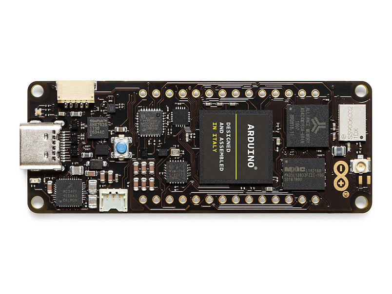

### Hardware Tools

Embedded systems developers and typical software developers differ on a key aspect: their "closeness" to hardware; embedded system developers are usually closer to hardware than typical software developers. There are several tools that embedded systems developers use to find out what is going on with the hardware, which is very helpful for low-level software debugging. These tools are **multimeters**, **logic analyzers**, **oscilloscopes**, and **software-defined radios** (SDRs). 

Let us take a look at each one of the hardware debugging tools. A basic understanding of these tools can significantly improve debugging skills, especially while developing embedded systems. 

***Multimeters, logic analyzers, oscilloscopes and, software-defined radios help debug interactions between the processor and other electronic parts on an embedded system. These tools do not control the flow of execution of the code of an embedded system.*** 

#### Multimeters

A digital multimeter (DMM) is a hardware tool that can be used to measure two or more electrical values, usually voltage (in volts), current (in amps), and resistance (in ohms). DMMs are great tools and one of the most fundamental pieces of test equipment that can be used to debug electrical problems within an embedded system.

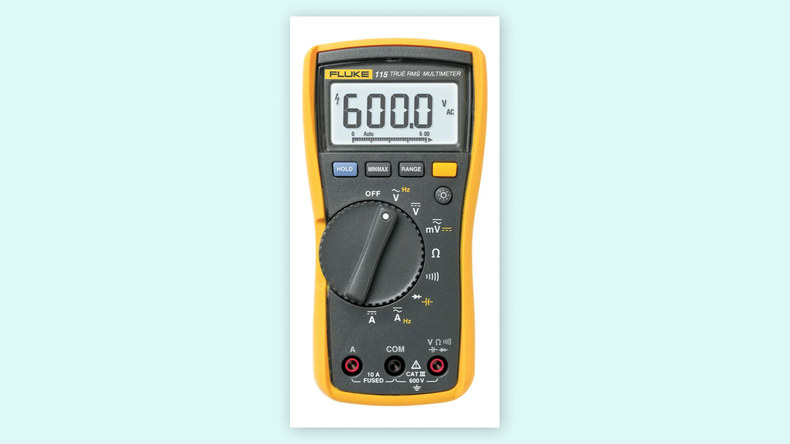

> [oomlout](https://commons.wikimedia.org/wiki/File:Digital_Multimeter.jpg), [CC BY-SA 2.0](https://creativecommons.org/licenses/by-sa/2.0), via Wikimedia Commons. 

#### Logic Analyzers

A logic analyzer is a hardware tool designed specifically for capturing, displaying, and measuring electrical signals in a digital circuit. This tool consists of several digital inputs pins capable of detecting whether an electric signal is at a specific logic level (1 or 0). Logic analyzers are also capable of showing the relationship and timing of different electrical signals in a digital circuit and often capable also of analyzing digital communication protocols (for example, SPI communication protocol).

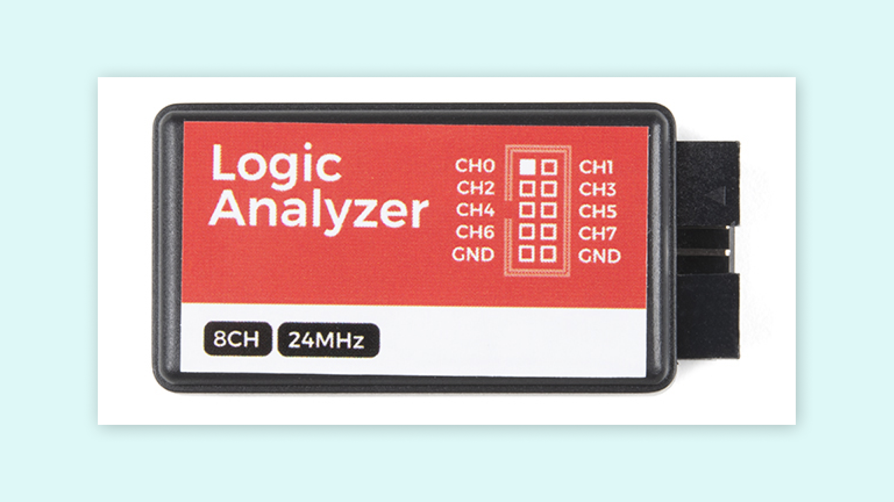

> [SparkFun Electronics](https://commons.wikimedia.org/wiki/File:8-Channel_-_51738307039.jpg), [CC BY-SA 2.0](https://creativecommons.org/licenses/by-sa/2.0), via Wikimedia Commons.

#### Oscilloscopes

An oscilloscope is a hardware tool that graphically displays electrical signals and shows how those signals change over time. Signals are measured in an oscilloscope with the help of a sensor.

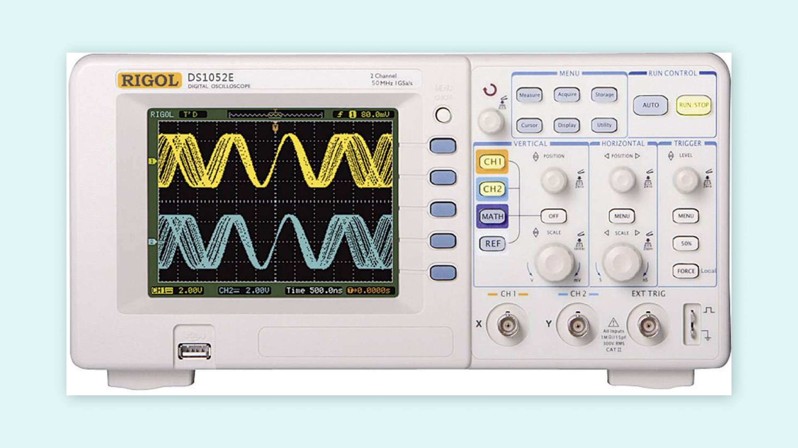

> [Dave Jones from Australia](https://commons.wikimedia.org/wiki/File:Rigol_DS1054Z_Oscilloscope_Teardown_PCB_(15354160277).jpg), [CC BY-SA 2.0](https://creativecommons.org/licenses/by-sa/2.0), via Wikimedia Commons.

#### Software-Defined Radios

A software-defined radio (SDR) is a radio communication system that uses software for the modulation and demodulation of radio signals. Traditional radio communications systems processing relies on hardware components; this limits their reprogramming to a very low level. SDRs are much more flexible since they can be reconfigured by software. 

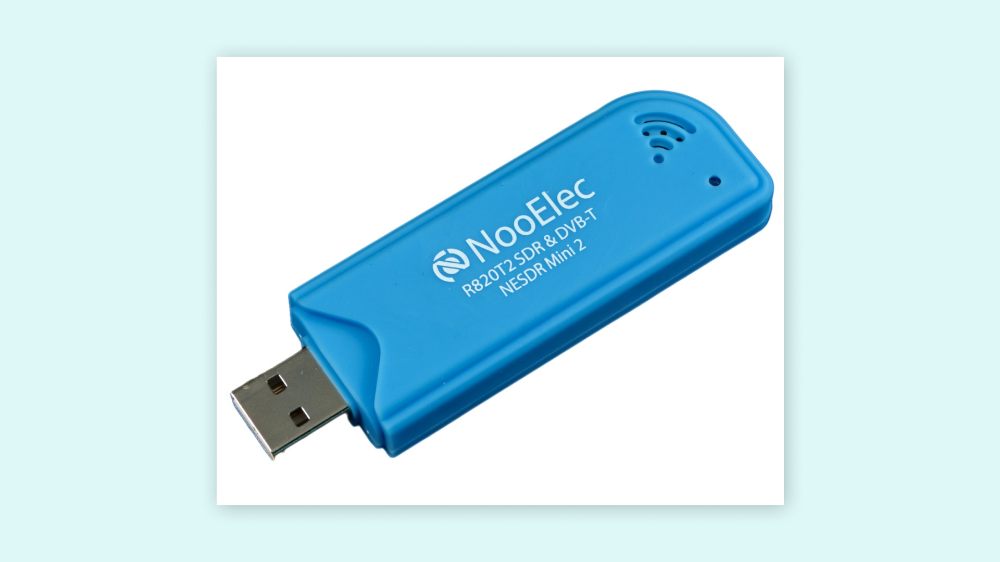

> [Alexander Neumann](https://commons.wikimedia.org/wiki/File:Hackrf-one-img_0004.jpg), Public domain, via Wikimedia Commons.

#### Debugging with Hardware Tools

While there may be several debugging techniques, using a LED as a pass mark for the debugging process is the simplest yet fastest method one can utilize. The indicator will be set in different points of interest to observe the correct execution of tasks visually. For instance, there can be multiple points located simultaneously to turn it on or off the LED on a single point of interest at a time for step-by-step verification. This will provide just enough information to construct an additional layer of the code or proceed to the following structure sector to debug its behavior. It will not give precise or in-depth information about registry or data exchange, so it has to be used as a tool for code structures that are not complex in their architectural nature and behave mainly in a linear trend execution. It is handy when a debugger is not available and quickly understand how the code behaves.

Sometimes, LEDs might not be present or might not be available in a particular system; there is no way to make a visual inspection in the system. However, we can use an oscilloscope directly to monitor the state of GPIO pins of the system in this case. The oscilloscope, in this case, can be used to monitor specific GPIO pins and see if the code gives specific feedback by driving the GPIO pin to the desired logic state. A DMM can also be handy for the same task. 

To get the most out of an oscilloscope and GPIO pins is by measuring its **performance**, this means to determine a signal's **electrical and timing properties**. For example, an unnecessary delay in the code can be identified with this information: 

```arduino
void myFunction() {
  digitalWrite(LED_BUILTIN, HIGH); 
  Serial.println("Code got here");
  count++;
  digitalWrite(LED_BUILTIN, LOW); 
}
```

`myFunction()` execution duration can be measured by setting a GPIO pin to be driven to a high logic level when its execution begins; when `myFunction()` execution ends, the GPIO pin can be driven to a low logic level. An oscilloscope can then provide information if the function execution took precisely the defined time, longer or shorter than expected, or if it has any unaccounted electrical behavior that changes the expected behavior.

Now let us talk about **wireless communications**. Wireless communications are a key feature in developing new Internet of Things (IoT) devices with different requirements or specifications and for different purposes. Wireless communication is present on many embedded systems, and Arduino® hardware is no exception for this feature. The question now is: how do we debug wireless communications between devices? 

A simple and common technique used to debug wireless communications between two or more devices consists of using **acknowledge flags**. Using acknowledge flags aids in understanding the device's behavior when communication is established between them by providing their current status. This process is also found on physical communication protocols, such as I2C or SPI. Because of the different protocol types in wireless communications, using acknowledge flags as a debugging method can be applied but differ in their own rules. The easiest way to confirm that the data exchange was successful is to check the data log on each end device. Hardware tools mentioned earlier (DMMs, oscilloscopes, and logic analyzers) can be used to provide more in-depth details and add more value to this type of debugging technique. 

However, not everything is connected on a physical layer, but on an **abstract layer**. This abstract layer in wireless communications is where electromagnetic waves propagate through space. Why would we need to debug electromagnetic waves propagating through space? Sometimes, we need to verify that the wireless transceiver configuration of a particular embedded system is correct, for example, its **transmission power**. SDRs can be helpful in this situation: SDRs can be used as cheap **spectrum analyzers**. A spectrum analyzer is a hardware tool that measures the magnitude of a signal versus the frequency; this tool is mainly used to measure a signal's power spectrum. Using SDRs as spectrum analyzers is usually an optional debugging method in the development process, ensuring a more robust system design.

***Several programs can be used with SDRs; [GQRX](https://gqrx.dk/) is one of the most popular software; GQRX is open-source and with cross-platform support (Linux and macOS). [AirSpy](https://airspy.com/) and [CubicSDR](https://cubicsdr.com/) are other popular software used with SDRs and cross-platform support (Windows, Linux, and macOS).*** 

Shown visual representation of the signal via SDR software can now be used to verify the transmission power outputted by the device and the amount of data transmitted. This will help visualize the device's wireless communication configuration properties. It will be possible to verify the transmission and reception power, the number of bytes transmitted, and the frequency it is supposed to transmit. These properties can be debugged through the frequency spectrum and refined to provide edge wireless communication performance on embedded systems.

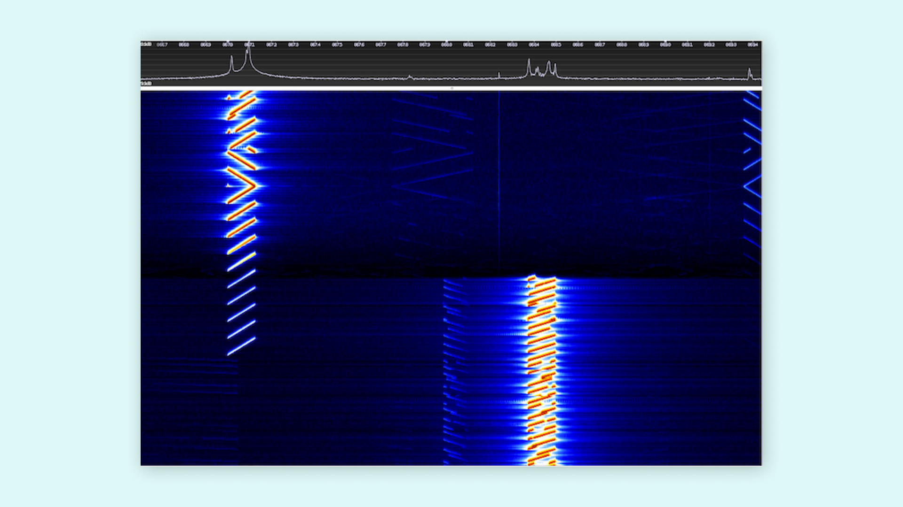

## Debugging Techniques Example

A simple example will demonstrate the implementation of some of the debugging techniques we discussed before and how they can be handy for the development process of code in the Arduino® ecosystem. We will use the [Arduino® Nano 33 BLE Sense](https://store.arduino.cc/products/arduino-nano-33-ble-sense) board, and its onboard inertial measurement unit (IMU) features to show the debugging process's importance. The example code uses accelerometer, gyroscope, and magnetometer data simultaneously, having the tasks be executed to obtain every value:

```arduino
/*
  Program:
  - Debugging_techniques_example.ino

  Description:
  - This example combines data from the LSM9DS1 accelerometer, gyroscope, and magnetometer into a single code. On top of it,
  it helps to understand different methods and techniques of debugging when the code structure combines multiple tasks.

  The circuit:
  - Arduino Nano 33 BLE Sense.

  Code based on examples created by Riccardo Rizzo, Jose García, and Benjamin Dannegård.
  Modified by Taddy Ho Chung and José Bagur (16/02/22).
*/

#include <Arduino_LSM9DS1.h>

#define DUMP_BUFFER_SIZE 32
unsigned char GoodBuffer[DUMP_BUFFER_SIZE];
unsigned char BadBuffer[DUMP_BUFFER_SIZE];
unsigned long count = 0;
uint8_t good, bad = 0;

float x, y, z, ledvalue;
int degreesX = 0, degreesY = 0;
int plusThreshold = 30, minusThreshold = -30;

void setup() {
  Serial.begin(9600);
  while (!Serial);
  Serial.println("- Started");

  if (!IMU.begin()) {
    Serial.println("- Failed to initialize IMU!");
    
    bad++;
    save_bebug_buffer();
    disp_debug_buffer();
    debug_stop();
  }

  accelermeter_setup();
  gyroscope_setup();
  
}

void loop() {
  for (int i = 0; i < 5; i++) {
    accelerometer_task();
    gyroscope_task();
    magnetometer_task();
  }
  
  save_debug_buffer();
  debug_stop();
}

// Accelerometer setup
void accelermeter_setup() {
  Serial.print(F("- Accelerometer sample rate: "));
  Serial.print(IMU.accelerationSampleRate());
  Serial.println(F(" Hz"));
}

// Read accelerometer data in all three directions task
void accelerometer_task() {
  if (IMU.accelerationAvailable()) {
    Serial.println(F("- Accelerometer data ready"));
    IMU.readAcceleration(x, y, z);
    good++;
  } else {
    Serial.println(F("- Accelerometer data not ready"));
    bad++;
  }

  if (x > 0.1) {
    x = 100 * x;
    degreesX = map(x, 0, 97, 0, 90);
    Serial.print(F("- Tilting up "));
    Serial.print(degreesX);
    Serial.println(F("  degrees"));
  }

  if (x < -0.1) {
    x = 100 * x;
    degreesX = map(x, 0, -100, 0, 90);
    Serial.print(F("- Tilting down "));
    Serial.print(degreesX);
    Serial.println(F("  degrees"));
  }

  if (y > 0.1) {
    y = 100 * y;
    degreesY = map(y, 0, 97, 0, 90);
    Serial.print(F("- Tilting left "));
    Serial.print(degreesY);
    Serial.println(F("  degrees"));
  }

  if (y < -0.1) {
    y = 100 * y;
    degreesY = map(y, 0, -100, 0, 90);
    Serial.print(F("- Tilting right "));
    Serial.print(degreesY);
    Serial.println(F("  degrees"));
  }
  
  delay(1000);
}

// Gyroscope setup
void gyroscope_setup() {
  Serial.print(F("- Gyroscope sample rate = "));
  Serial.print(IMU.gyroscopeSampleRate());
  Serial.println(F(" Hz"));
  Serial.println();
  Serial.println(F("- Gyroscope in degrees/second"));
}

// Read gyroscope data in all three directions task
void gyroscope_task( ) {
  if (IMU.gyroscopeAvailable()) {
    IMU.readGyroscope(x, y, z);
    Serial.println(F("- Gyroscope data ready"));
    good++;
  } else {
    Serial.println(F("- Gyroscope data not ready"));
    bad++;
  }

  if(y > plusThreshold) {
    Serial.println(F("- Collision front"));
    delay(500);
  }

  if(y < minusThreshold) {
    Serial.println(F("- Collision back"));
    delay(500);
  }

  if(x < minusThreshold) {
    Serial.println(F("- Collision right"));
    delay(500);
  }

  if(x > plusThreshold) {
    Serial.println(F("- Collision left"));
    delay(500);
  }
}

// Read magnetometer data in all three directions task
void magnetometer_task(){
  IMU.readMagneticField(x, y, z);
  
  if(x < 0) {
    ledvalue = -(x);
  }
  else {
    ledvalue = x;
  }
  
  analogWrite(LED_BUILTIN, ledvalue);
  delay(500);
}

// For debugging purposes
void save_debug_buffer(void) {
  if (count < DUMP_BUFFER_SIZE) {
    GoodBuffer[count] = good;
    BadBuffer[count] = bad;
    disp_debug_buffer();
    count++;
  }
}

// Debugging array buffer
void disp_debug_buffer() {
  Serial.println(F("\n Debugging array buffer result >>"));
  Serial.print(F("- Good marks: "));
  Serial.println(GoodBuffer[count]);
  
  Serial.print(F("- Bad marks: "));
  Serial.println(BadBuffer[count]);
}

void debug_stop() {
  Serial.flush();
  exit(1);
}
```

As shown, the complete code unifies the accelerometer, gyroscope, and magnetometer into a single code structure. As it involves tasks from different modules, it is separated into different functions and executed in a more identifiable manner. The code includes a **trace code** technique for debugging (dump into an array) to understand precisely how the code operates. The `good` and `bad` marks are located at the points of interest in the code and will dump into assigned arrays to be able to display at the end of the code. 

It is crucial to know when to stop the code from debugging. While the code shown above can be debugged at runtime, it is much easier to know when to stop or how to stop the code operation. For instance, stopping within the first run gives the following result: 

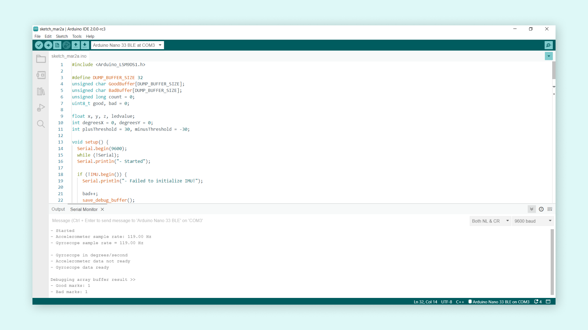

In the Arduino Serial Monitor, we can observe that it has a `1` good mark and a `1` bad mark. The good mark came from the gyroscope having ready the data for use, while the bad mark came from the accelerometer as the data was not ready. So it is possible to see that the accelerometer does not have enough time to get the data ready before it gets to the measurement task. We can try by running a certain number of instances before it gets to the array dump sector, and the result can be seen as follows: 

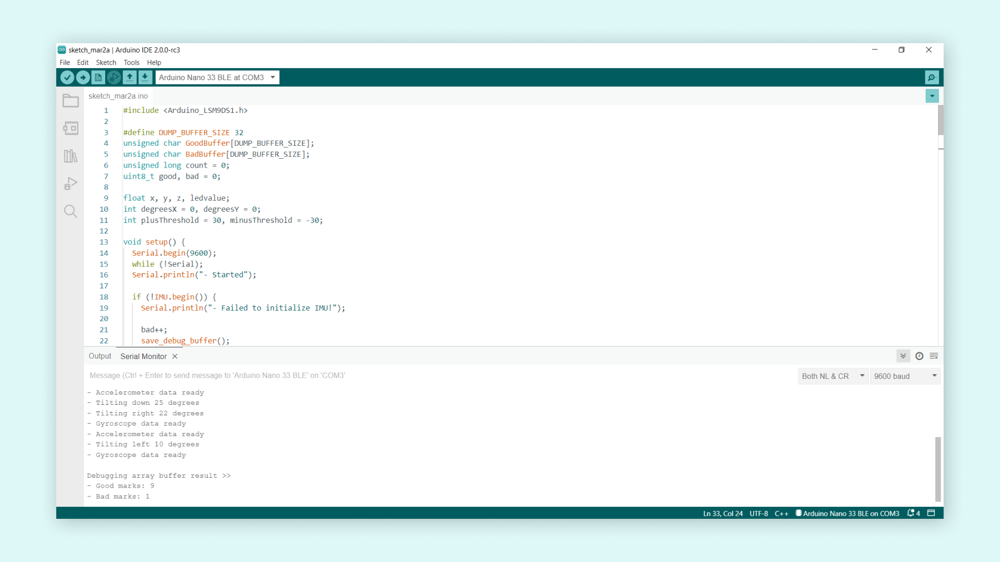

The accelerometer performed its task without any issue except the first runtime instance, resulting in `9` good marks but `1` bad mark due to this behavior. The `Serial.println(F())` instruction of module setups and task runtimes also shows us if the code could get past the operations without any issue. By this, it is possible to know the code structure does not misbehave, but for the first time when the device is starting, the accelerometer requires more time to get the data ready in the first instance.

Additionally, it is possible to modify the loop code by simply adding a `digitalWrite(12, HIGH)` instruction before tasks are called instruction and a `digitalWrite(12, LOW)` instruction after the tasks are executed to measure the time it takes to complete them using GPIO 12 of the board and an oscilloscope. This can also be helpful to understand the power consumption it draws from this runtime instance:

```arduino
void loop() {
  for (int i = 0; i < 5; i++) {
    digitalWrite(12, LOW);
    accelerometer_task();
    gyroscope_task();
    magnetometer_task();
    digitalWrite(12, HIGH); 
  }
  
  save_debug_buffer();
  debug_stop();
}
```

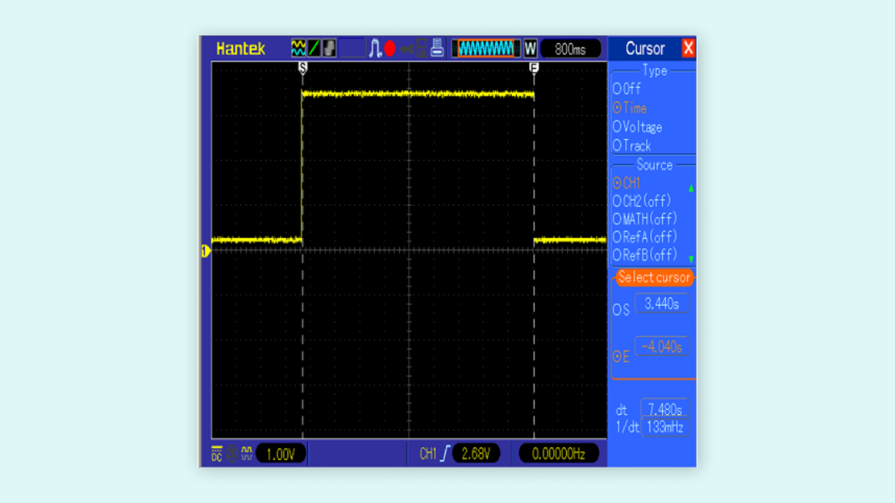

## Final Thoughts about Debugging

Debugging is a necessary step for developing robust and reliable embedded systems software. We can end this article by mentioning the **four** most essential phases of debugging stated by Robin Knoke in this [article](https://www.embedded.com/debugging-embedded-c/) about debugging embedded C that was published in the Embedded Systems Programming magazine:

* **Testing**: this phase exercises the capability of the embedded software by stimulating it with a wide range of input values and in different environments.
* **Stabilization**: this phase attempt to control the conditions that generate a specific bug.
* **Localization**: this phase involves narrowing the range of possibilities until the bug can be isolated to a specific code segment in the embedded software.
* **Correction**: this phase involves eradicating the bug from the software. 

Knowing the potential causes of bugs allows us to adopt strategies that minimize their occurrence. Many different debugging techniques and external devices are present to aid this process. Maybe some software designs do not require the usage of external debuggers, for example. However, when the software involves different requirements, especially scalability, things change drastically for the development process. The debugging techniques and the external debuggers will support this development process, thus granting sophisticated software. In most cases, we will know how the device will behave with the software, its computational performance, and even achieve non-power hungry devices due to clean memory management.

Debugging may be an overlooked aspect in developing embedded systems, but it is its most serious yet crucial tool. If we desire to develop robust and reliable embedded systems, the debugging process should consistently be implemented to achieve these goals.

## Further Reading and Resources

Debugging is an exciting topic to study; if you want to learn more about debugging tools and techniques, check out the following links: 

- Do you want to improve your debugging and engineering skills? A highly recommended reading is [Debugging: The 9 Indispensable Rules for Finding Even the Most Elusive Software and Hardware Problems](http://debuggingrules.com/) by David J. Agans. 
- Do you want to learn more about digital multimeters? Learn more about them in [this](https://www.fluke.com/en-us/learn/blog/electrical/what-is-a-digital-multimeter) article from Fluke®.
- Do you want to learn more about oscilloscopes? Learn more about them in [this](https://www.tek.com/en/blog/what-is-an-oscilloscope) article from Tektronix®.
- Do you want to learn more about logic analyzers? Learn more about them in [this](https://articles.saleae.com/logic-analyzers/what-is-a-logic-analyzer) article from Saleae®.
- Do you want to learn more about spectrum analyzers? Learn more about them in [this](https://www.tek.com/en/documents/primer/what-spectrum-analyzer-and-why-do-you-need-one) article from Tektronix®.
- Do you want to learn more about SDRs? Check out the Great Scott Gadgets [video series](https://greatscottgadgets.com/sdr/) about SDRs. The video series from Great Scott Gadgets is a complete course about SDRs. You will learn the fundamentals of Digital Signal Processing (DSP) and build flexible SDR applications using GNU Radio.
  
## References 
  
[1] P. Koopman, Better Embedded System Software. S.L.: Drumnadrochit Press, 2010.<br />
[2] D. J. Agans, Debugging: The Nine Indispensable Rules for Finding Even the Most Elusive Software and Hardware Problems. New York: Amacom, 2002.<br />
[3] M. Barr and A. Massa, Programming Embedded Systems: with C and GNU Development Tools. Johanneshov: MTM, 2013.<br />
[4] J. W. Valvano, Embedded Systems: Introduction to ARM® Cortex™-M Microcontrollers. United States: Self-published, 2015.