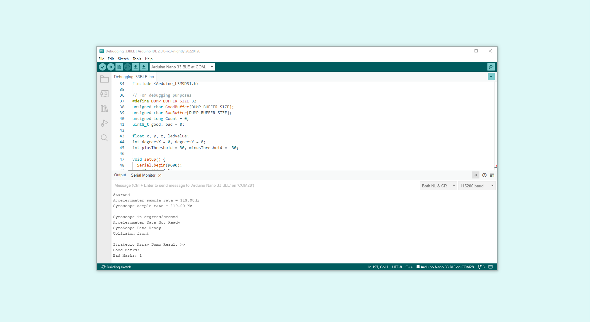
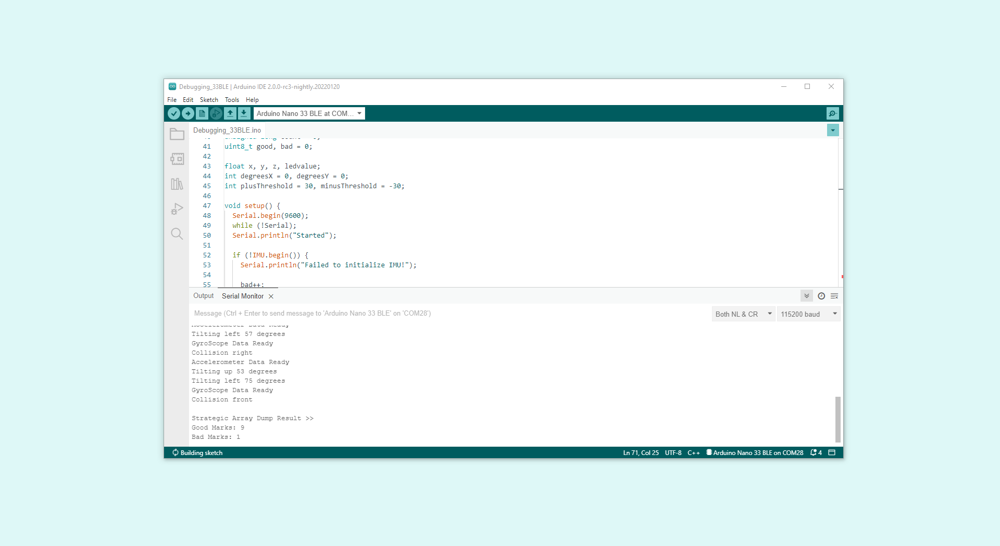

**Embedded systems** are microprocessor or microcontroller-based systems with a dedicated operational role. Rather than being made of separate components, like desktop computers, laptops or, gaming consoles, embedded systems integrate all the hardware and software necessary for a particular purpose. Nowadays, embedded systems are everywhere: automobiles, cameras, household appliances, and mobile devices are just some examples.

Embedded systems design can be challenging since it combines hardware design, firmware, and software development, all in one particular device or product. In order to produce high-quality embedded firmware and software for a particular device or product, **debugging** is a necessary step in their development process. **Debugging is the process of confirming that, one by one, many things that we believe to be true and functional in our code are true**. We find a "**bug**" in our code when one our more assumptions are not valid. 

***People worldwide have been talking about "bugs" for a long time; even [Thomas Alva Edison](https://spectrum.ieee.org/did-you-know-edison-coined-the-term-bug) used the word back in his days. The word bug has been used as an old term for "monster"; like gremlins in machinery, bugs are malicious.***

The following article will discuss different **debugging tools and techniques** used to find bugs in microcontroller-based systems, especially those based on [Arduino® hardware](https://store.arduino.cc/collections/boards).  

## Debugging tools and techniques

There are some basic debugging tools and techniques that we can use and implement to validate our code:

* The compiler and syntax errors.
* Traditional techniques: trace code and GPIOs.
* Remote debuggers.
* Simulators.
* In-circuit emulators and in-circuit debuggers.
* Hardware tools: oscilloscopes, logic analyzers and software-defined radios. 

Let us take a look into each one of the debugging tools and techniques.

### The Compiler and Syntax Errors

**Compiling** is transforming high-level code into machine language that can be understood by a processor, for example a microcontroller. In this process, the compiler also helps to identify **syntax errors**. Syntax errors indicate something wrong with the program's syntax; for example, **when a semi-colon is omitted at the end of a statement in a program**, the compiler generates a syntax error. 


Using the compiler for debugging syntax errors can be sometimes tricky; let us analyze two commonly encountered situations: 

* **The compiler shows 100 errors**: This usually does not mean there are 100 errors; it often gets thrown off track for a while when the compiler finds an error. The compiler tries to recover and pick up again after the first error, but sometimes it reports false errors. **Only the first error message is genuinely reliable**; try to fix one error at a time and then recompile the program.
* **Getting weird compiler messages**: Compiler errors are shown in terse jargon, sometimes hard to read and understand, but with hidden and valuable information. **Read the error message carefully**; it will always tell where, inside the code, the error occurred.

### Traditional Techniques: Trace Code and GPIO's

Adding **trace code** is probably the simplest and most basic debugging technique used in embedded systems software design. This method adds trace code to the program to print out messages or values of variables (using the `Serial.print()` function, for example) as the program executes. For example, determining if a particular function is halting or freezing in our code can be made with trace code as shown in the example code below:

```arduino
// Print a message if the execution gets here
Serial.println("Code got here");

// Try to execute myFunction1()
myFunction1(); 

// Print a message if the execution gets here
Serial.println("Code got here, myFunction1 executed"); 

// Try to execute myFunction2()
myFunction2(); 

// Print a message if the execution gets here
Serial.println("Code got here, myFunction2 executed"); 
```

Using trace code for debugging is usually applicable only during the early stages of an embedded system code development. **Adding trace code to our programs takes a significant amount of processing time and resources**. Therefore, it can easily disrupt critical timing tasks in our programs. Additionally, if we use the UART for other tasks, we can have problems displaying trace code. 

***You can pass flash-memory based Strings to `Serial.print()` instruction by wrapping them with `F()`; for example, `Serial.println(F("Code got here"))` prints a flash-memory based String.***

Another trace code technique consists of **dumping strategic information into an array at run time**, we can then observe the contents of the array at a later time (for example, when the program terminates); this technique is also known as **dump into array**. Assume `good` and `bad` are two strategic variables we want to capture. The first step is to define a debug buffer in RAM to save the debugging measurements as shown in the code below:

```arduino
#define DUMP_BUFFER_SIZE 32
unsigned char goodBuffer[DUMP_BUFFER_SIZE];
unsigned char badBuffer[DUMP_BUFFER_SIZE];
unsigned long count = 0;
```

The variable `count` is used to index into the debug buffer, it must be initialized to zero before the debugging process begins. The code shown below dumps strategic information from the `good` and `bad` variables into the debug buffer: 

```arduino
void Save_Debug_Buffer(void) {
  if (count < DUMP_BUFFER_SIZE) {
    goodBuffer[count] = good;
    badBuffer[count] = bad;
    count++;
  }
}
```

**General Purpose Input/Output (GPIO) pins** can help debug purposes when the UART is in use or adding trace code is not particularly helpful. For example, we can turn on or off the built-in LED of an Arduino® board by inserting a `digitalWrite(LED_BUILTIN, HIGH)` instruction before or after questionable areas in our programs as shown in the example code below. If the built-in LED turns on, then we know that a particular line of code executed:

```arduino
// Print a message if the execution gets here
Serial.println("Code got here");

// Try to execute myFunction1()
myFunction1(); 

// Turn on the built-in LED for one second to indicate that myFunction1 was executed
digitalWrite(LED_BUILTIN, HIGH); 
delay(1000);
digitalWrite(LED_BUILTIN, LOW); 

// Try to execute myFunction2()
myFunction2(); 

// Turn on the built-in LED for one second to indicate that myFunction2 was executed
digitalWrite(LED_BUILTIN, HIGH); 
delay(1000);
digitalWrite(LED_BUILTIN, LOW);
```

### Remote Debuggers

**Remote debugging** is another common approach used to debug embedded systems. **Remote debuggers work by connecting a particular embedded system to a host computer** and then using software in the host computer to interact with the embedded system hardware. Remote debuggers are helpful when the development environment is on a different architecture rather than the target system. For example, think about developing code on a Windows-based computer for an ARM-based microcontroller system. 

Remote debuggers usually have two essential parts: a **front-end debugger** and a **back-end debugger**. 

* The front-end debugger contains the user interface (can be graphical or command-line-based) and offers the programmer choices about the execution of the code in the embedded system hardware.
* The back-end debugger, also known as the "debug monitor," is specific for a particular processor architecture or family an usually work with an external hardware tool, like an in-circuit emulator or an in-circuit debugger. It starts when the processor resets and handles the runtime instruction between the front-end debugger and the embedded system hardware. 

***The debugger tool is a newly introduced yet less famous feature of Arduino IDE 2.0. Check out [this tutorial](https://docs.arduino.cc/software/ide-v2/tutorials/ide-v2-debugger) that shows how to use the Arduino® IDE 2.0 debugger with compatible boards.***

### Simulators

Simulators are tools used to **simulate the functionality and the instruction set of the target processor**. These tools, usually, can only simulate the target processor functionalities but not its environment and external parts and components. Simulators are handy in the early stages of the development process, where we only have the software but have not implemented any hardware yet.

***[Tinkercad Circuits](https://www.tinkercad.com/learn/circuits) is an excellent simulator for beginners in the Arduino® ecosystem. This tool can simulate the instruction set of an Arduino® UNO board and the functionalities of several electronic components such as resistors, LEDs, motors, LCDs, and some sensors.***


### In-Circuit Emulators and In-Circuit Debuggers

An **in-circuit emulator** (or ICE) is a specialized tool that allows developers to examine the state of the processor while a particular program is running. ICEs are considered embedded systems by themselves; they are a copy of the target processor and its memory (RAM and ROM); this is why they provide an unintrusive way to debug code at the target processor. Historically, ICEs were the tool of choice of embedded systems developers, but as processor complexity and clock speed increased, ICEs became more expensive, and their availability declined considerably.

An **in-circuit debugger** (or ICD) is also a specialized tool connected between a host computer and a processor for debugging real-time applications faster and easier; this uses some memory and GPIO pins of the target microcontroller during the debugging operations. With an ICD, a monitor program runs inside the processor; with this program, the developer can set breakpoints, run code, single step the program, examine variables and registers on the processor, and, if required, change their values.

***The fundamental difference between an ICE and an ICD relies on the resources used to control the debug target. In ICEs, resources are provided by the emulation hardware; in ICDs, resources are provided by the target processor.*** 

### Hardware Tools

Embedded systems developers and typical software developers differ on a key aspect: their "closeness" to hardware; embedded system developers are usually closer to hardware than typical software developers. There are several tools that embedded systems developers use to find out what is going on with the hardware, which is very helpful for low-level software debugging. These tools are **logic analyzers**, **oscilloscopes**, and **software-defined radios** (SDRs). 

Let us take a look at each one of the hardware debugging tools. A basic understanding of these tools can significantly improve debugging skills, especially while developing embedded systems devel. 

***Logic analyzers, oscilloscopes and software-defined radios help debug interactions between the processor and other electronic parts on an embedded system. These tools do not control the flow of execution of the code of an embedded system.*** 

#### Logic Analyzers

A logic analyzer is a hardware tool designed specifically for capturing, displaying, and measuring electrical signals in a digital circuit. This tool consists of several digital inputs pins capable of detecting whether an electric signal is at a specific logic level (1 or 0). Logic analyzers are also capable of showing the relationship and timing of different electrical signals in a digital circuit and often capable also of analyzing digital communication protocols (for example, SPI communication protocol).


#### Oscilloscopes

An oscilloscope is a hardware tool that graphically displays electrical signals and shows how those signals change over time. Signals are measured in an oscilloscope with the help of a sensor.


#### Software-Defined Radios

A software-defined radio (SDR) is a radio communication system that uses software for the modulation and demodulation of radio signals. Traditional radio communications systems processing relies on hardware components; this limits their reprogramming to a very low level. SDRs are much more flexible since they can be reconfigured by software. 


#### Debugging with Hardware Tools

While there may be several debugging techniques, using a LED as a pass mark for the debugging process is the simplest yet fastest method one can utilize. The indicator will be set in different points of interest to observe the correct execution of tasks visually. For instance, there can be multiple points located simultaneously to turn it on or off the LED on a single point of interest at a time for step-by-step verification. This will provide just enough information to construct an additional layer of the code or proceed to the following structure sector to debug its behavior. It will not give precise or in-depth information about registry or data exchange, so it has to be used as a tool for code structures that are not complex in their architectural nature and behave mainly in a linear trend execution. It is handy when a debugger is not available and quickly understand how the code behaves.

Sometimes, LEDs might not be present or might not be available in a particular system; there is no way to make a visual inspection in the system. However, we can use an oscilloscope directly to monitor the state of GPIO pins of the system in this case. The oscilloscope, in this case, can be used to monitor specific GPIO pins and see if the code gives specific feedback by driving the GPIO pin to the desired logic state. A **multimeter** can also be handy for the same task. 

To get the most out of an oscilloscope and GPIO pins is by measuring its **performance**. Oscilloscopes can also be used to determine specific signal's **electrical and timing properties**. For example, an unnecessary delay in the code can be identified with this information: 

`myFunction()` execution duration can be measured by setting a GPIO pin to be driven to a high logic level when its execution begins; when `myFunction()` execution ends, the GPIO pin can be driven to a low logic level. The oscilloscope can then provide information if the function execution took precisely the defined time, longer or shorter than expected, or if it has any unaccounted electrical behavior that changes the expected behavior.

Wireless communications help the development of new Internet of Things (IoT) devices with different requirements or specifications and for different purposes. Wireless communication is present on many embedded systems, and Arduino® hardware is no exception for this feature. The question now is: how do we debug wireless communications between devices? 

A simple technique used to debug wireless communications between devices consists of using acknowledge flags. Acknowledge flags are used to verify successful communication between devices; this process is found on physical communication layers, such as I2C or SPI, providing the present status between these devices. It goes the same for wireless communication between devices. Due to different protocol types in wireless communication, acknowledged methods may differ. The easiest way to confirm that the data exchange was successful is to check the log on each end device. So why would we need to debug on a radio frequency spectrum that is working correctly? It is to verify that the transceiver configuration is correct, mainly its transmission power. 

There are several software to assist this process and one of them is GQRX supported on OSX and Linux. For the Windows operating system, AirSpy could be software of choice to assist for this type of task. The SDR via USB stick can be used as a low cost spectrum analyzer, using the user's computer as a hot for radio station. The devices to be debugged are powered on while SDR takes care of catching any present transmission on the air and display it on the screen. 

Shown visual representation of the signal via SDR software can now be used to verify the transmission power outputted by the device and the amount of data that flew on the air. This will help to visualize the properties of the device's wireless communication configuration. It will be possible to verify the transmission and reception power, the amount of bytes transmitted, and the frequency on which it is supposed to be transmitting. A very handy tool to debug wireless communication states of the devices. 

All these properties can be debugged through the radio frequency spectrum and refined to provide edge wireless communication performance on embedded systems. 

## Debugging Techniques Example

A simple example will be used to demonstrate implementation of different debugging techniques and how they can be very useful for the development process. We are going to use [Arduino Nano 33 BLE](https://docs.arduino.cc/hardware/nano-33-ble) and use the LSM9DS1 inertial measurement unit's features to show the importance and ease of debugging process. The example code will be based on using [accelerometer](https://docs.arduino.cc/tutorials/nano-33-ble/imu_accelerometer), [gyroscope](https://docs.arduino.cc/tutorials/nano-33-ble/imu_gyroscope), and [magnetometer](https://docs.arduino.cc/tutorials/nano-33-ble/imu_magnetometer) at the same time, having the tasks to be executed in order to be able to obtain every value of the module. 

```arduino
/*
  LSM9DS1 accelerometer, gyroscope, and magnetometer tasks operation with debugging.

  This example combines data from the LSM9DS1 accelerometer, gyroscope, and magnetometer into a single code. On top of it,
  it helps to understand different methods and techniques of debugging when the code structure combines multiple tasks.

  The circuit:
  - Arduino Nano 33 BLE Sense.

  Based on examples created by Riccardo Rizzo, Jose García, and Benjamin Dannegård.
  Modified by Taddy Ho Chung & José Bagur (16/02/22).
*/

#include <Arduino_LSM9DS1.h>

// For debugging purposes
#define DUMP_BUFFER_SIZE 32
unsigned char GoodBuffer[DUMP_BUFFER_SIZE];
unsigned char BadBuffer[DUMP_BUFFER_SIZE];
unsigned long Count = 0;
uint8_t good, bad = 0;

float x, y, z, ledvalue;
int degreesX = 0, degreesY = 0;
int plusThreshold = 30, minusThreshold = -30;

void setup() {
  Serial.begin(9600);
  while (!Serial);
  Serial.println("Started");

  if (!IMU.begin()) {
    Serial.println("Failed to initialize IMU!");
    
    bad++;
    Save_Debug_Buffer();
    Disp_Debug_Buffer();

    debug_stop();
  }

  accelermeter_setup();
  gyroscope_setup();
  
}

void loop() {
  for (int i = 0; i < 5; i++){
    accelerometer_task();
    gyroscope_task();
    magnetometer_task();
  }
  
  Save_Debug_Buffer();

  debug_stop();
}

void accelermeter_setup(){
  Serial.print(F("Accelerometer sample rate = "));
  Serial.print(IMU.accelerationSampleRate());
  Serial.println(F("Hz"));
}

void accelerometer_task(){
  if (IMU.accelerationAvailable()) {
    Serial.println(F("Accelerometer Data Ready "));
    IMU.readAcceleration(x, y, z);
    good++;
  } else {
    Serial.println(F("Accelerometer Data Not Ready "));
    bad++;
  }

  if (x > 0.1) {
    x = 100 * x;
    degreesX = map(x, 0, 97, 0, 90);
    Serial.print(F("Tilting up "));
    Serial.print(degreesX);
    Serial.println(F("  degrees"));
  }
  if (x < -0.1) {
    x = 100 * x;
    degreesX = map(x, 0, -100, 0, 90);
    Serial.print(F("Tilting down "));
    Serial.print(degreesX);
    Serial.println(F("  degrees"));
  }
  if (y > 0.1) {
    y = 100 * y;
    degreesY = map(y, 0, 97, 0, 90);
    Serial.print(F("Tilting left "));
    Serial.print(degreesY);
    Serial.println(F("  degrees"));
  }
  if (y < -0.1) {
    y = 100 * y;
    degreesY = map(y, 0, -100, 0, 90);
    Serial.print(F("Tilting right "));
    Serial.print(degreesY);
    Serial.println(F("  degrees"));
  }
  delay(1000);
}

void gyroscope_setup(){
  Serial.print(F("Gyroscope sample rate = "));
  Serial.print(IMU.gyroscopeSampleRate());
  Serial.println(F(" Hz"));
  Serial.println();
  Serial.println(F("Gyroscope in degrees/second"));
}

void gyroscope_task(){
  if (IMU.gyroscopeAvailable()) {
    IMU.readGyroscope(x, y, z);
    Serial.println(F("GyroScope Data Ready "));
    good++;
  } else {
    Serial.println(F("GyroScope Data Not Ready "));
    bad++;
  }

  if(y > plusThreshold){
    Serial.println(F("Collision front"));
    delay(500);
  }

  if(y < minusThreshold){
    Serial.println(F("Collision back"));
    delay(500);
  }

  if(x < minusThreshold){
    Serial.println(F("Collision right"));
    delay(500);
  }

  if(x > plusThreshold){
    Serial.println(F("Collision left"));
    delay(500);
  }
}

void magnetometer_task(){
  // read magnetic field in all three directions
  IMU.readMagneticField(x, y, z);
  
  if(x < 0){
    ledvalue = -(x);
  }
  else{
    ledvalue = x;
  }
  
  analogWrite(LED_BUILTIN, ledvalue);
  delay(500);
}

// For debugging purposes
void Save_Debug_Buffer(void) {
  if (Count < DUMP_BUFFER_SIZE) {
    GoodBuffer[Count] = good;
    BadBuffer[Count] = bad;
    Disp_Debug_Buffer();
    Count++;
  }
}

void Disp_Debug_Buffer(){
  // Simple log of Good or Bad Pass Marks during runtime
  Serial.println(F("\n Strategic Array Dump Result >>"));
  Serial.print(F("Good Marks: "));
  Serial.println(GoodBuffer[Count]);
  
  Serial.print(F("Bad Marks: "));
  Serial.println(BadBuffer[Count]);
}

void debug_stop(){
  Serial.flush();
  exit(1);
}
```

The complete code as shown unifies accelerometer, gyroscope, and magnetometer into a single code structure. As it involves tasks from different modules, it is separated into different functions and executed in a more identifiable manner. It includes the **Strategic Array Dump** to understand exactly how the code operates. The `good` and `bad` marks are located at the points of interest, and will dump into assigned arrays to be able to display at the end of the code. 

It is crucial to know when to stop the code to be able to debug the code. While the code above is capable of debugging at runtime, it is much easier to debug knowing when to or how to stop the code operation. For instance, stopping within first run, will give you following result. 



In the serial monitor we can observe that it has 1 good mark and 1 bad mark. The good mark came from the gyroscope having ready the data for the use, while the bad mark comes from the accelerometer as the data was not ready. So it is possible to see the accelerometer does not have enough time to get the data ready before it gets to the measurement task. We can try by running certain amount of instances before it gets to array dump sector, and the result can be seen as follows.



The accelerometer was able to perform its task without any issue with the exception of the first runtime instance, resulting in 9 good marks but 1 bad mark due to this behaviour. By this, it is possible to know the code structure does not misbehave, but for the first time when the device is starting, the accelerometer requires more time to be able to get the data ready in the first instance. The `Serial.println(F())` of module setups, and task runtimes also show us if the code was able to get past the operations without any issue. 

Additionally, it is possible to modify the loop code by adding simply GPIO 13 to drive High and Low to measure the time it takes to complete 3 module tasks. It will be also helpful to understand the power consumption it draws from this runtime instance. 

```arduino
void loop() {
  for (int i = 0; i < 5; i++){
    digitalWrite(13, HIGH); 
    accelerometer_task();
    gyroscope_task();
    magnetometer_task();
    digitalWrite(13, LOW); 
  }
  
  Save_Debug_Buffer();

  debug_stop();
}
```

## Final Thoughts about Debugging

Debugging is a necessary step for developing robust and reliable embedded systems software. We can end this article by mentioning the **four** most essential phases of debugging:

* **Testing**: this phase exercises the capability of the embedded software by stimulating it with a wide range of input values and in different environments.
* **Stabilization**: this phase attempt to control the conditions that generate a specific bug.
* **Localization**: this phase involves narrowing the range of possibilities until the bug can be isolated to a specific code segment in the embedded software.
* **Correction**: this phase involves eradicating the bug from the software. 

Knowing the potential causes of bugs, allows us to adopt strategies that can minimize their occurrence. 

## Further Reading and Resources

Debugging is an exciting topic to study; if you want to learn more about debugging tools and techniques, check out the following links: 

- Do you want to improve your debugging and engineering skills? A highly recommended reading is [Debugging: The 9 Indispensable Rules for Finding Even the Most Elusive Software and Hardware Problems](http://debuggingrules.com/) by David J. Agans. 
- Do you want to learn more about oscilloscopes? Learn more about them in [this](https://www.tek.com/en/blog/what-is-an-oscilloscope) article from Tektronix®.
- Do you want to learn more about logic analyzers? Learn more about them in [this](https://articles.saleae.com/logic-analyzers/what-is-a-logic-analyzer) article from Saleae®.
- Do you want to learn more about SDRs? Check out the Great Scott Gadgets [video series](https://greatscottgadgets.com/sdr/) about SDRs. The video series from Great Scott Gadgets is a complete course about SDRs. You will learn the fundamentals of Digital Signal Processing (DSP) and build flexible SDR applications using GNU Radio.
  
## References 
  
* P. Koopman, Better Embedded System Software. S.L.: Drumnadrochit Press, 2010.
* D. J. Agans, Debugging: The Nine Indispensable Rules for Finding Even the Most Elusive Software and Hardware Problems. New York: Amacom, 2002.
* M. Barr and A. Massa, Programming Embedded Systems: with C and GNU Development Tools. Johanneshov: MTM, 2013.  
* J. W. Valvano, Embedded Systems: Introduction to ARM® Cortex™-M Microcontrollers. United States: Self-published, 2015.S