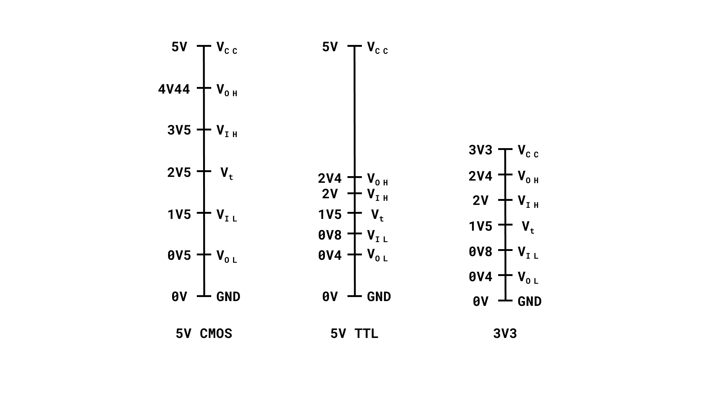
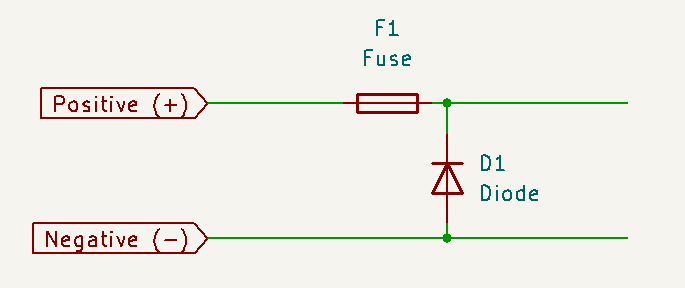
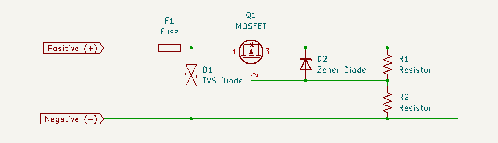
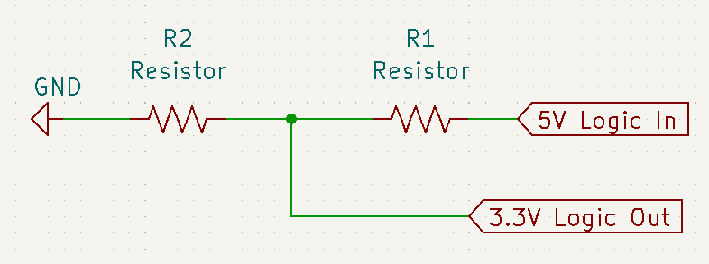
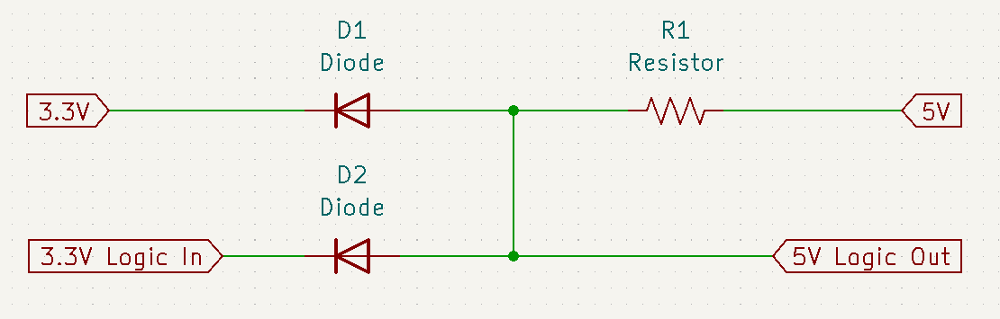
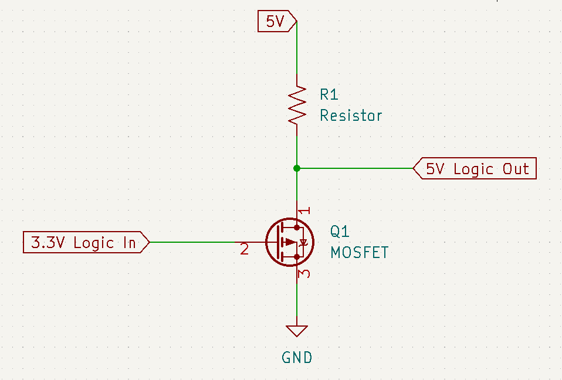
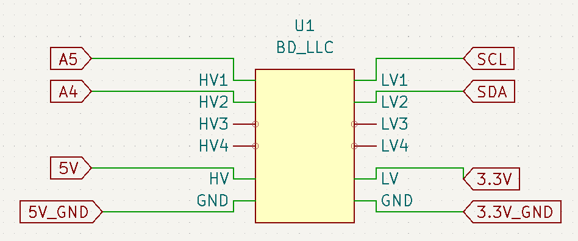
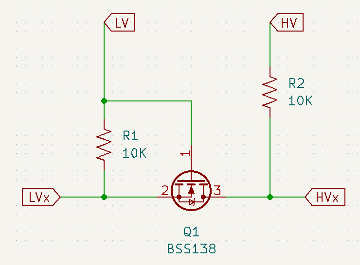

## 3V3 vs. 5V

When designed, most electronic circuits and devices must choose a **power supply**. The **voltage** of the power supply is usually determined either by convenience or the need for power efficiency that the electronic circuit or device itself has as a requirement.

**3V3** and **5V** are standard voltage levels nowadays in power supplies. Although there is only a 1V7 difference between both voltages, it is enough to provide a significant difference in power efficiency. This guide will show you why 3V3 is the current standard voltage level for power supplies in electronic circuits and devices and some general tips when designing and handling these voltage levels in your circuits or devices powered by Arduino.

## 3V3, the Standard Voltage Level

So, why is the **3.3V** a standard power supply voltage level? Because power consumption has always been a concern for designers, lower power supply voltage levels were introduced to make more power-efficient circuits and devices. For over 30 years, powering electronic circuits and devices using a 5V level was common practice; today, most electronic circuits and devices use a 3V3 power supply voltage level, some are even migrating to a 2V5 level (or even to lower voltages!).

***Reducing the power supply voltage yields an exponential decrease in power consumption.***

A standard exists for defining the voltage levels of input and output voltages for every power supply voltage level; this standard was developed by The Joint Electron Device Engineering Council (JEDEC); it is the JEDEC Standard 8-A for LV interface levels. The JEDEC Standard 8-A for LV interface levels is described in the image shown below for 3V3 and 5V logic families:

In the image shown above:

* VOL: maximum output voltage level an electronic device will provide for a LOW signal
* VIL: maximum input voltage level an electronic device will still considered as a LOW signal
* Vt: threshold voltage at which an electronic device switches its interpretation of a signal from low to high or vice versa
* VIH: minimum input voltage level an electronic device will still considered as a HIGH signal.
* VOH: minimum output voltage level an electronic device will still considered as a HIGH signal

***For more in-depth information about current microelectronic standards, please look at the [JEDEC](https://www.jedec.org/) website.***

## How to Avoid Burning Circuits 101

Every electronic designer driving the power lines of electronic circuits and devices can cause, accidentally or on purpose, a short circuit and, therefore, damage the electronic circuits or devices. Accidents and mistakes always happen, but we can follow some tips and tricks to avoid them. Let's check it out!

### Color Coded Power Lines

**Color coding** the power lines is the easiest yet most effective visual method to avoid an incorrect connection in the power lines of electronic circuits or devices. When prototyping an electronic circuit or device, some developers make the common mistake of using the same color on every cable while being jumbled all over the place, making it impossible to identify which. 

Color coding power lines makes it much easier to identify the voltage and Ground (GND) lines. According to industry regulations and standards, red is typically used to indicate a voltage line, while black is used to indicate a GND line; colors vary depending on the regulation or standard. 

***For more information on electrical regulations and standards, please check out the [National Electrical Safety Code®](https://standards.ieee.org/products-programs/nesc/) from the Institute of Electrical and Electronics Engineers (IEEE).***

### Fuse Integration

One easy way to protect electronic devices is to integrate an onboard power protection circuit into the device. Several circuit designs can be implemented to achieve this; one of the easiest circuits to implement is using a fuse. 

Fuse integration to electronic devices is not a complicated design process. The following schematic shows a **simple reverse polarity protection** circuit that can be used in low-power DC circuits:

This simple reverse polarity protection circuit uses a fuse and a diode that later connects to the electronic circuit, which can be referred to as the **load**.

### A Better Reverse Polarity Protection Circuit

Implementing complicated power protection circuit does not mean the load is absolutely protected. Depending on the component selection and cost for implementation, the solution can become much more elegant, and the same applies for reverse polarity protection. The following reverse polarity protection is designed by Mehdi Sadaghdar.

The key points of the circuit presented above are the Transient Voltage Suppressor diode and the MOSFET of P-Channel type. This protection circuit will help you save the Protected Load and to have it as a good reference for protection design. Although due to its electric components, it becomes a little more advanced to cover in the scope of this guide.

***If you are interested in reading more, visit [this article](https://www.electroboom.com/?p=914) by Mehdi Sadaghdar.***

### Over-Voltage and Over-Current Protection

Sometimes the electronic device, that should receive 3.3V level of input from the supply may receive a "dirty" tension. This causes the electronic device to suffer abnormal electronic behaviour. As it could destabilise the system completely or change the logic forcefully due to changed logic range to be unrecognised. There are more of this undesired behaviour, if over-voltage or over-current is introduced to the system. 

So for this matter, how do we protect the system? The solution can be based of the proper Reverse Polarity Protection showed previously. The proper Polarity Reverse Polarith Protection implements a bidirectional Transient Voltage Suppressor while adding the P-Channel MOSFET with a zenerdiode and two resistors to get all its flavours. 

***To give quick explanation on Transient Voltage Suppressor - It is a type of a diode that helps to protect high-spike voltages generated at the output of Power Supply.***

But a simple Reverse Polarity Protection, with a Transient Voltage Suppressor diode can be used to protect the over-voltage and over-current issues. If you want to go further into protecting the Load from over-voltage and over-current, it is possible to integrate **Surge Stopper** to provide active protection. May increase the cost, however it is a good measure to protect the Load. 

## Stepping the Voltage - Level Shifters

Arduino boards relies on 3.3V and 5V levels. But sometimes there may not be available pins that matches the voltage requirement to adequately drive the sensor or any such line. In this section, we will take a look at how we can **step up and down voltages.**   

We will use a bidirectional Logic Level Converter to step the voltage level, to be able to use sensors or logics at higher or lower voltage levels. This is an option to use if tight electric specification is implemented on the board. 

***The bidirectional Logic Level Converter used can be found [here](https://www.sparkfun.com/products/12009) (SparkFun).***

### Stepping Down Voltage

We will begin by learning how to step down the voltage. Usually, voltage is driven down to lower level needed by the external module or sensors. It can also be due to need of lower voltage line to handle a separate circuit. It is crucial that you know the electric requirement that will demand if the electronic design is more complex than usual design. Such as tight electric specification and multiple signal lines to handle with operating at high speeds.

A **voltage divider** is the simplest yet easy to implement solution. It uses 2 resistors to create a lower voltage output. So, knowing the **input voltage** and targeted **output voltage** and a **reference resistor**, it is simple enough to calculate the other required resistor to implement to produce desired voltage. Below is a voltage dividing circuit.

When using this circuit, you will still need to be cautious of the residing capacitance that is connected at the output of this circuit and with the quick rise times, as for certain applications with cautious timing requirements or modules non-response to quick rise times will be affected. 

### Stepping Up

To **step up** voltage, you will need to use a little bit more constructive electric circuit by using diodes. The following circuit shows how to use diodes to step up voltage.

You will need to biase the diodes with precaution and the resistor that is much lower than the input impedance of the 5V gate. One of the know-hows shared by Microchip is to use **Schottky** diodes to gain slight high-level voltage and reduce low-level voltage from incrementing. Following circuit uses a different setup. 

This circuit uses the MOSFET as a switch and takes the 5V logic from the drain. It is useful if the logic inversion can be treated, as 3.3V logic becomes inverted. To begin with MOSFET, a 2N7000 or a BSS138 MOSFET can be used for this circuit. 

### Bi-Directional Logic Level Converter

Previous electric circuits are **uni-directional** logic level shifters. Meaning that to use different stepping configuration, you will need to change the entire electric circuit to go from stepping up to down, and vice-versa. On top of it, if the electronic size is factor to take it into account, then you can use a off-the-shelf logic level converter.

You can use the [Bi-Directional Logic Level Shifter](https://www.sparkfun.com/products/12009) from SparkFun to test and also for deployment if the requirements enables its integration. The advantage of this particular shifter is that it provides 4 channels to shift within the voltage references given. High Voltage level and Low Voltage level references are injected with desired voltage level and channels are used to transmit the data in between.

The circuit above uses the bi-directional logic shifter to establish I2C interface with any sensor capable of the protocol. The SCL and SDA lines go through a High Voltage channel and establishes communication with the sensor that is connected at its respective Low Voltage Channel. 

The configuration of the Logic Shifter usually does not change, as the the purpose is to transmit the signal from a High to a Low Level or vice-versa, depending on the architecture operation. Thus, the previous schematic illustrates usual global connection configuration. As it can be to interface the Arduino board with another computing module working on a different voltage level. Below schematic shows the specific of each channel and focus the scope inside the schematic symbol box of the Logic Shifter. 

Each channel is composed by two resistors and a MOSFET that will use the reference High and Low voltages to transfer the signal from the respective module. 

## Further Reading and Resources

Handling different voltage levels covers vast electronic department, and without exception for 3.3V and 5V levels which are the most used voltage levels. To get deeper into the topic handling voltage levels, you can follow some of the links that might get our attention.

- If you want to know about some know-hows from Microchip, you can read [Microchip: 3V Tips 'n Tricks](https://www.newark.com/pdfs/techarticles/microchip/3_3vto5vAnalogTipsnTricksBrchr.pdf) to learn about wide variety of techniques used with 3.3V and 5V levels.
- Level Shifting the voltage has its own science dedicated to it and Philips Semiconductor welcomes you if you are ready learn deeper about [Bi-Directional Level Shifter for I2C Bus and Other Systems](http://cdn.sparkfun.com/tutorialimages/BD-LogicLevelConverter/an97055.pdf) with their Application Note AN97055.  

## References

- [1] Larsson, E. (2006). Introduction to Advanced System-on-Chip Test Design and Optimization. Springer Publishing.
- [2] Kularatna, N. (2018). DC Power Supplies Power Management and Surge Protection for Power Electronic Systems. Amsterdam University Press.
- [3] Ballan, H., & Declercq, M. (2010). High Voltage Devices and Circuits in Standard CMOS Technologies. Springer Publishing.