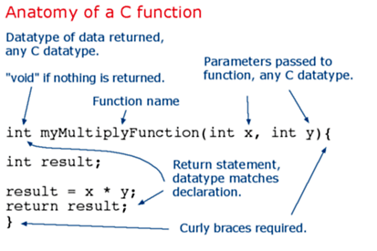

Segmenting code into functions allows a programmer to create modular pieces of code that perform a defined task and then return to the area of code from which the function was "called". The typical case for creating a function is when one needs to perform the same action multiple times in a program.

For programmers accustomed to using BASIC, functions in Arduino provide (and extend) the utility of using subroutines (GOSUB in BASIC).

Standardizing code fragments into functions has several advantages:

- Functions help the programmer stay organized. Often this helps to conceptualize the program.

- Functions codify one action in one place so that the function only has to be thought out and debugged once.

- This also reduces chances for errors in modification, if the code needs to be changed.

Functions make the whole sketch smaller and more compact because sections of code are reused many times.
They make it easier to reuse code in other programs by making it more modular, and as a nice side effect, using functions also often makes the code more readable.
There are two required functions in an Arduino sketch, setup() and loop(). Other functions must be created outside the brackets of those two functions. As an example, we will create a simple function to multiply two numbers.

## Example



To "call" our simple multiply function, we pass it parameters of the datatype that it is expecting:

```arduino
void loop(){
int i = 2;
int j = 3;
int k;

k = myMultiplyFunction(i, j); // k now contains 6
}
```

Our function needs to be declared outside any other function, so "myMultiplyFunction()" can go either above or below the "loop()" function.

The entire sketch would then look like this:

```arduino
void setup(){
  Serial.begin(9600);
}

void loop() {
  int i = 2;
  int j = 3;
  int k;

  k = myMultiplyFunction(i, j); // k now contains 6
  Serial.println(k);
  delay(500);
}

int myMultiplyFunction(int x, int y){
  int result;
  result = x * y;
  return result;
}
```

## Another example

This function will read a sensor five times with analogRead() and calculate the average of five readings. It then scales the data to 8 bits (0-255), and inverts it, returning the inverted result.

```arduino
int ReadSens_and_Condition(){
  int i;
  int sval = 0;

  for (i = 0; i < 5; i++){
    sval = sval + analogRead(0);    // sensor on analog pin 0
  }

  sval = sval / 5;    // average
  sval = sval / 4;    // scale to 8 bits (0 - 255)
  sval = 255 - sval;  // invert output
  return sval;
}
```

To call our function we just assign it to a variable.

```arduino
int sens;

sens = ReadSens_and_Condition();
```

As you can see, even if a function is not passed any parameters, the "()" brackets are required to call it.
