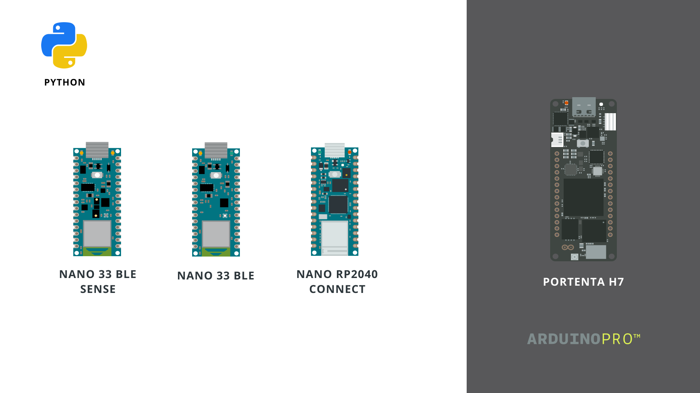
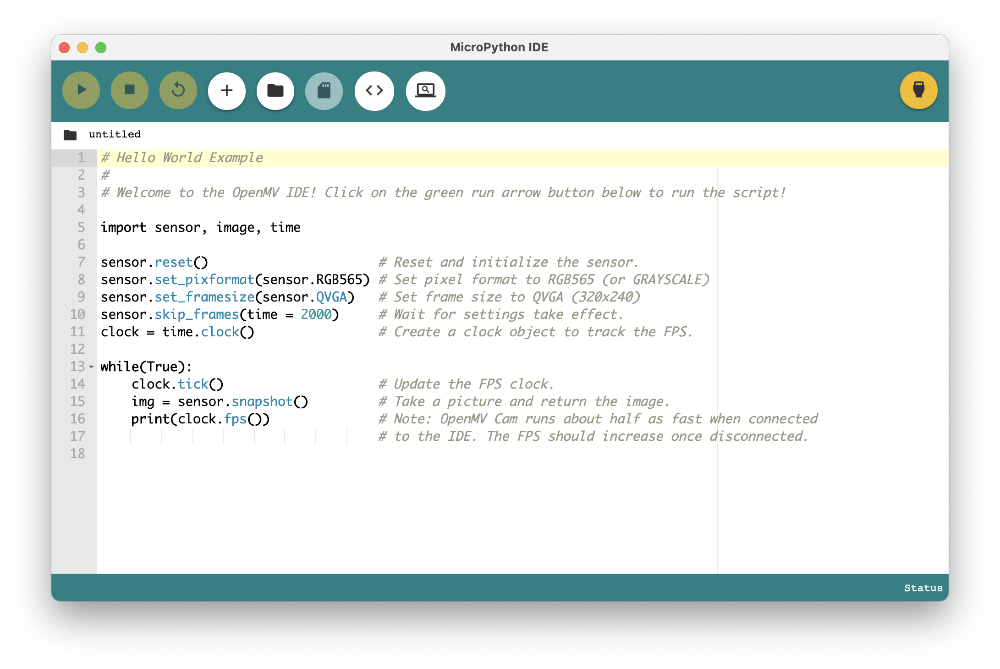

***To download the firmware required to run MicroPython on your Arduino board, visit the [Arduino MicroPython downloads page](/micropython).***

[MicroPython](https://micropython.org/) is an implementation of the [Python® programming language](https://www.python.org/) that comes with a subset of the Python® standard library, and is designed **to run on microcontrollers**. 

A great advantage of using MicroPython is that it is easy to learn and has [great documentation](http://docs.micropython.org/en/latest/) for a number of boards. At the moment, there are four boards that can be used together with MicroPython, you can read more about them in the [compatible boards section](#compatible-boards).

Arduino also supports [OpenMV's branch of MicroPython](https://github.com/openmv/micropython), and through the [OpenMV IDE](https://openmv.io/pages/download) you can install MicroPython, connect/disconnect your board and upload your scripts.



There's quite the difference between how we program an Arduino board with the Arduino IDE, using the Arduino programming language (based on C++), and how we program it using MicroPython. When uploading what we call a sketch to a board, we first compile the sketch we write, then upload it to the board, replacing the old sketch with a new.

To use MicroPython, we first need to install it on the board. Then, we can load a `script.py`, like the following blink example:

```python
import time
from machine import Pin

led = Pin(6, Pin.OUT)

while True:
    led.on()
    time.sleep_ms(250)
    led.off()
    time.sleep_ms(250)
```

As MicroPython is already running on the board, we don't need to compile and upload the code, we only need to provide the instructions (which is done via serial communication).

***When installing MicroPython on a board, it can only run MicroPython scripts, until we "uninstall" it. To put the board back in "normal mode" we need to reset the bootloader, which is a unique process for each board. These instructions are available in the [compatible boards](#micropython-compatible-boards) section in this article. Basically, you have to put the board in bootloader mode and upload any .ino sketch. ***

## Arduino Lab for MicroPython



The [Arduino Lab for MicroPython](https://labs.arduino.cc/en/labs/micropython) is a lightweight editor designed for simple interaction between your computer and board. With it, you can select your port, load scripts, and use the REPL shell and more. 

- [Download Arduino Lab for MicroPython Editor](https://labs.arduino.cc/en/labs/micropython).
- [MicroPython Firmware downloads page](/micropython).

## OpenMV Editor

[OpenMV](https://openmv.io/) is a platform that supports programming Arduino boards using a fork of MicroPython. Through the OpenMV editor, we can install this fork, and upload scripts directly to the board. There's also a number of examples available directly in the editor. 

OpenMV is a great platform for computer vision and machine learning projects.


### OpenMV Examples

Further down this article, you can find a lot of useful code examples that will help you to get started. 

***You can also check out the full list of examples in the [OpenMV's GitHub repository](https://github.com/openmv/openmv/tree/master/scripts/examples/10-Arduino-Boards).***

## Compatible Boards

There are currently **five Arduino boards that officially supports MicroPython.** They are listed below:

- [Nano 33 BLE](https://store.arduino.cc/arduino-nano-33-ble)
- [Nano 33 BLE Sense](https://store.arduino.cc/arduino-nano-33-ble-sense)
- [Nano RP2040 Connect](https://store.arduino.cc/nano-rp2040-connect-with-headers)
- [GIGA R1 WiFi](https://store.arduino.cc/products/giga-r1-wifi)
- [Portenta H7](https://store.arduino.cc/portenta-h7)

All of above are also compatible with the **OpenMV IDE**.

***Currently, the GIGA R1 WiFi is not supported by OpenMV IDE.***

### Nano 33 BLE


If you need help getting started with MicroPython on the **Nano 33 BLE** board, you can check out the tutorials below:

- [Install MicroPython on your Nano BLE](/tutorials/nano-33-ble-sense/micropython-installation#arduino-nano-33-ble).
- [Getting started with OpenMV and Nano 33 BLE](/tutorials/nano-33-ble/getting-started-omv) 
- [Nano 33 BLE Python® API guide](/tutorials/nano-33-ble/ble-python-api) (a collection of useful scripts).

***To reset the bootloader on the Nano 33 BLE board, double tap the reset button quickly. This will reset your board to factory setting.***

### Nano 33 BLE Sense


If you need help getting started with MicroPython on the **Nano 33 BLE Sense** board, you can check out the tutorials below: 

- [Install MicroPython on your Nano BLE Sense](/tutorials/nano-33-ble-sense/micropython-installation#arduino-nano-33-ble).
- [Getting started with OpenMV and Nano 33 BLE Sense](/tutorials/nano-33-ble-sense/getting-started-omv)
- [Nano 33 BLE Sense Python® guide](/tutorials/nano-33-ble-sense/ble-sense-python-api) (a collection of useful scripts).

***To reset the bootloader on the Nano 33 BLE Sense board, double tap the reset button quickly. This will reset your board to factory setting.***

### Nano RP2040 Connect


If you need help getting started with MicroPython on the **Nano RP2040 Connect** board, you can check out the tutorials below:

- [Install MicroPython on your Nano RP2040 Connect](/tutorials/nano-rp2040-connect/micropython-installation#arduino-nano-rp2040-connect) 
- [Nano RP2040 Connect Python® guide](/tutorials/nano-rp2040-connect/rp2040-python-api)
- [Getting Started with OpenMV and MicroPython on Nano RP2040 Connect](/tutorials/nano-rp2040-connect/rp2040-openmv-setup)


***To reset the bootloader, you will need to short to connect a jumper wire between the REC and GND pin, and press the reset button. More detailed instructions are available in the [Nano RP2040 Connect technical reference](/tutorials/nano-rp2040-connect/rp2040-01-technical-reference#board-not-detected).***

### GIGA R1 


If you need help getting started with MicroPython on the **Arduino GIGA R1** board, you can check out the tutorial below:

- [MicroPython on the GIGA R1](/tutorials/giga-r1-wifi/giga-micropython)

***MicroPython support for the GIGA R1 is currently in an experimental phase.***

### Portenta H7


If you need help getting started with  MicroPython on the **Portenta H7** board, you can check out the tutorial below:

- [Install MicroPython on Portenta H7](/tutorials/portenta-h7/micropython-installation#arduino-portenta-h7).
- [Getting Started with OpenMV and MicroPython on Portenta H7](https://docs.arduino.cc/tutorials/portenta-h7/por-openmv-gs)

## Learn Python®

As MicroPython is an implementation of the Python® language, you can also run a lot of Python® scripts directly on the board. For example, running this Python® script on your computer also works when running it on your board.

```python
value1 = 2
value2 = 5

print(value1 + value2)
```

This means it's time to learn the **Python®** language, which there is a lot of resources for. We recommend taking a look at the following resources to better understand the Python® language:

- [python.org](https://www.python.org/)
- [learnpython.org](https://www.learnpython.org/)
- [w3schools guide to Python®](https://www.w3schools.com/python/default.asp)

### MicroPython Docs

Visit the [MicroPython documentation](https://docs.micropython.org/en/latest/) for an understanding on how Python® runs on microcontrollers.

***Note that many examples in the MicroPython Docs will not work directly with Arduino boards, but will provide an understanding of how Python® can run on your board.***

## API

Below you will find some useful examples that can be used by any Arduino board. For more specific features, such as on-board sensors, connectivity and communication, please refer to the individual guides:

- [Nano RP2040 Connect Python® API guide](/tutorials/nano-rp2040-connect/rp2040-python-api)
- [Nano BLE API guide](/tutorials/nano-33-ble/ble-python-api)
- [Nano BLE Sense API guide](/tutorials/nano-33-ble-sense/ble-sense-python-api)

### Print

A simple script that will print `"Hello world!"` every second.

```python
import time

content = "Hello world!"

while True:
    print(content)
    time.sleep(1)
```

### Functions

This script prints `"Hello world!"` every second. In addition, `counter_function()` also  

```python
import time

content = "Hello world!"
count = 0

def counter_function():
    global count
    count = count + 1

while True:
    counter_function()
    print(content, count)
    time.sleep(1)
```

### For Loop

Simple use of a for loop and functions. This script counts to 10, and then back to 0.

```python
import time

content = "Hello world!"
count = 0

def function_increase():
    global count
    count = count +1
    print(count)

def function_decrease():
    global count
    count = count -1
    print(count)

while True:
   for x in range(10):
    function_increase()
    time.sleep(1)
    
   for x in range(10):
    function_decrease()
    time.sleep(1)
   
```

### Digital Write

Writes a high and low value to a digital pin every one second. Also prints state in the terminal.

```python
from machine import Pin
import utime

p2 = Pin(25, Pin.OUT)

while True:
    p2.value(0)
    print("off")
    utime.sleep(1)  
    p2.value(1)
    print("on")
    utime.sleep(1)
```

### Digital Read (pull up)

Reading digital pins with a `PULL_UP` configuration.

```python
from machine import Pin
import utime

p2 = Pin(25, Pin.IN, Pin.PULL_UP)

while True:
    print(p2.value())
    utime.sleep(1)
```

### Digital Read (pull down)

Reading digital pins with a `PULL_DOWN` configuration.

```python
from machine import Pin
import utime

p2 = Pin(25, Pin.IN, Pin.PULL_DOWN)

while True:
    print(p2.value())
    utime.sleep(1)
```

### Analog Read

Read an analog pin and print it to the terminal with a delay of 0.5 seconds.

```python
import machine
import time

# Make sure to follow the GPIO map for the board you are using.
# Pin 29 in this case is the "A3" pin on the Nano BLE / BLE Sense
adc_pin = machine.Pin(29) 
adc = machine.ADC(adc_pin)

while True:
    reading = adc.read_u16()     
    print("ADC: ",reading)
    time.sleep_ms(500)
```

### PWM

Write a specific duty to a specific pin. 

```python
from machine import Pin, PWM, ADC

pwm = PWM(Pin(15))
duty = 30000 #between 0-65000

pwm.freq(1000)

while True:
	pwm.duty_u16(duty)
```

### Delay

To use a simple delay, we can use the `time` module. If we want to write in **seconds**, we can use `time.sleep(seconds)`, and for milliseconds `time.sleep_ms(milliseconds)`.

```python
import time

while True:
    time.sleep(0.5) #or time.sleep_ms(500)
    print("Hello world!")
```

### Interrupt

Below is an example of a simple interrupt that uses a pull up button and an LED. 

The program blinks an LED, until the button is pressed. The button is attached to an interrupt, which turns off an LED for 3 seconds.

```python
import machine
from machine import Pin
import time

interrupt = False 
 
def callback(pin):
  global interrupt
  interrupt = True
  
led = Pin(6, Pin.OUT)
 
button = machine.Pin(25, machine.Pin.IN, machine.Pin.PULL_UP)
 
button.irq(trigger=machine.Pin.IRQ_FALLING, handler=callback)
 
while True:
  
  led.on()
  time.sleep(0.5)
  led.off()
  time.sleep(0.5)
  
  if interrupt:
    state = machine.disable_irq()
    machine.enable_irq(state)
    led.off()
    print("Interrupt: LED off for 3 seconds!")
    time.sleep(3)
    interrupt = False
```

