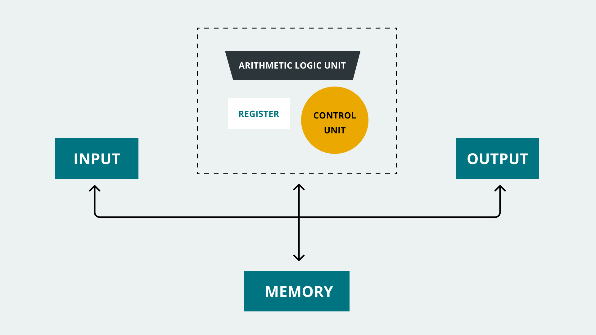
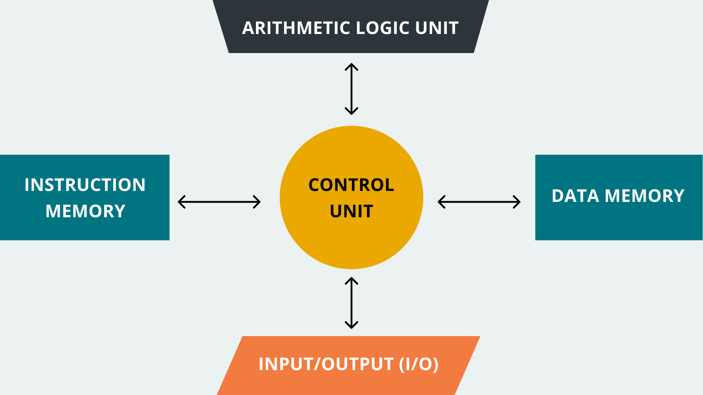
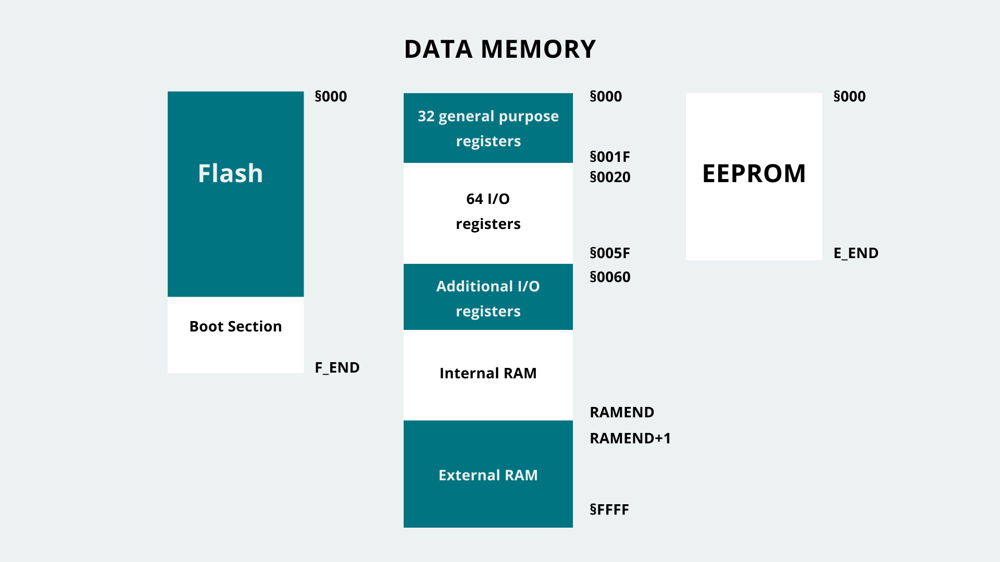
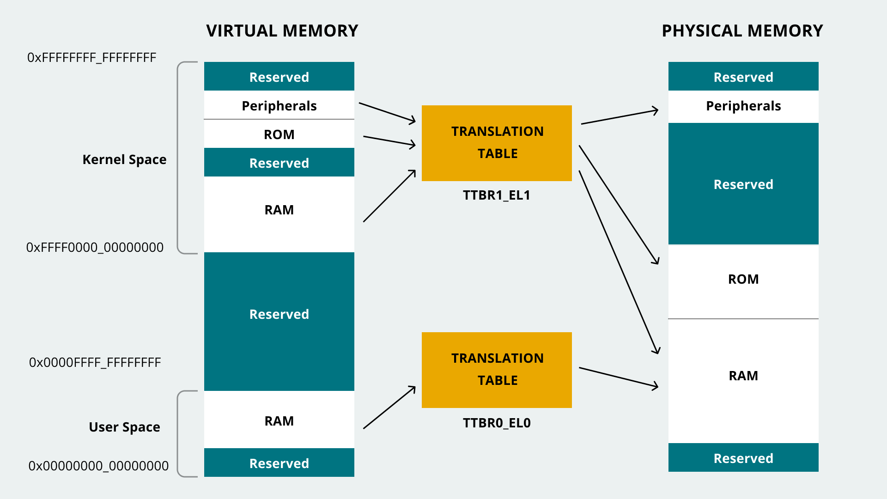
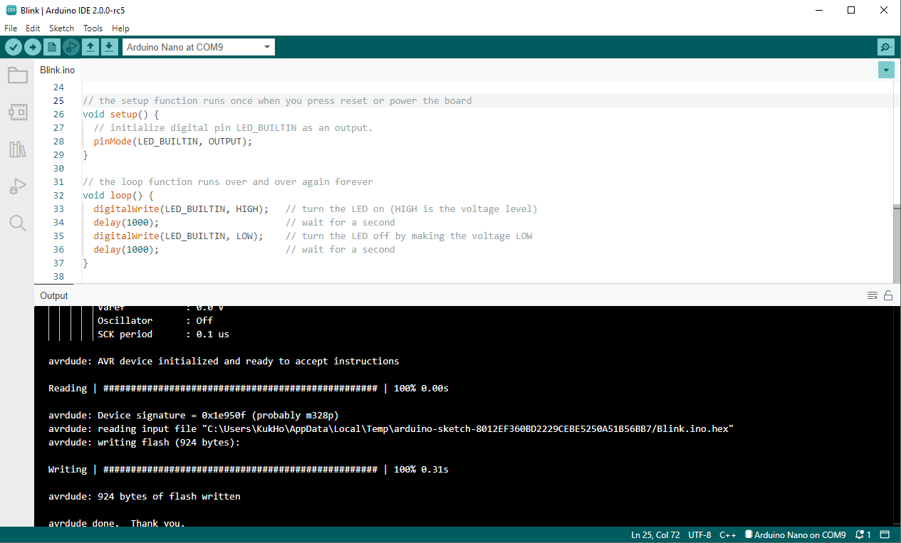
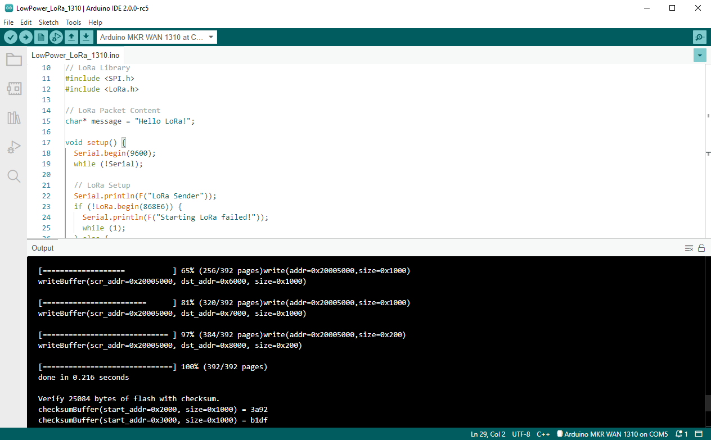
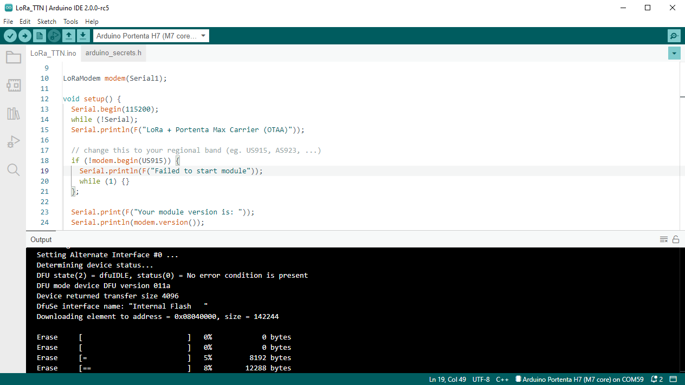

A microcontroller unit (also known as an MCU) is an integrated circuit (IC), typically used to perform specific applications or tasks. Usually, this type of IC gathers information or data from its surroundings, processes it, and generates specific outputs according to the gathered data. Microcontrollers today are everywhere; they are an essential part of modern embedded systems that can be found practically everywhere in our world, from smart watches to electric vehicles; they are even on the Martian surface right now. 

One essential part of a microcontroller is its **memory**; memory stores information temporarily or permanently in microcontrollers, and can be used for several purposes. In this article, we will explore memory organization in microcontrollers, focusing on those present in Arduino® boards. We will also explore several ways to manage, measure, and optimize memory usage in Arduino-based systems.

## What is Memory?

Memory blocks are essential parts of modern embedded systems, especially microcontroller-based ones. **Memory blocks are semiconductor devices that store and retrieve information or data**; a microcontroller central processing unit (CPU) uses and processes data stored in memory blocks to perform specific tasks.

As shown in the image below, memory blocks in microcontrollers are usually described as **arrays**. Memory arrays are divided into **cells** that can store data and be accessed using a unique identifier representing its **address** or position relative to the memory array. Information in memory cells is stored using binary digits (bits), usually organized in bytes (8-bits); it can also be retrieved later by the MCU or other components of a microcontroller-based system. 

Memory in computing systems can be **volatile** or **non-volatile**. Volatile memory is a **temporary memory**, this means that data is stored while the system is running, but it is lost forever when the system is turned off. Non-volatile memory is **permanent memory**; data is not lost even if the system is turned off. 

## Memory Architectures 101

Computer architecture is a vast topic; we will focus on a general picture that will let us understand how memory is organized in the microcontrollers used in Arduino® boards.

In the early days of computing, two computer architectures, i.e., the organization of the components inside a computing system, emerged: **von Neumann** and **Harvard**. 

### Von Neumann Architecture

The von Neumann architecture, named after the mathematician, physicist, and computer scientist John von Neumann, was first introduced in the mid '40s. It is also known as the Princeton architecture. This architecture stores program data and instructions in the same memory unit. 



Both are accessed by the CPU using the same communications bus, as shown below. Von Neumann's architecture is fundamental since nearly all digital computers design have been based on this architecture.

### Harvard Architecture

The Harvard architecture, named after the Harvard *Mark I* relay-based computer, was first introduced in the mid '40s. This architecture's main characteristic is that it uses **two separate memory units**, one for storing program instructions and one for storing program data. Both memory units in the Harvard architecture are accessed by the CPU using different communication buses. 



### Modern Architectures: Hybrids

Modern computing systems use **hybrid architectures** models that maximize performance using the best of both worlds, the von Neumann and the Harvard models. 

Microcontrollers are usually used in embedded applications. They must perform defined tasks reliably and efficiently, with low or constrained resources; this is why the **Harvard architecture model is mainly used in microcontrollers**: microcontrollers have a small program and data memory that needs to be accessed simultaneously. However, Harvard architecture is not always used in microcontrollers; some microcontroller families use hybrid or Von Neumann architecture models. 

### Arduino® Boards Architectures

Arduino® boards are mainly based on two families of microcontrollers: **AVR®** and **ARM®**. While AVR® family microcontrollers are based on the Harvard architecture model, ARM® family microcontrollers can be based on either von Neuman or Harvard architectures models. The following table summarizes Arduino boards microcontrollers architectures:

|      **Board**      | **Microcontroller** |    **Family**    | **Architecture** |
|---------------------|---------------------|------------------|------------------|
|       UNO Mini      |      ATmega328P     |        AVR       |      Harvard     |
|       UNO Rev3      |      ATmega328P     |        AVR       |      Harvard     |
|    UNO WiFi Rev2    |      ATmega4809     |        AVR       |      Harvard     |
|     UNO Rev3 SMD    |      ATmega328P     |        AVR       |      Harvard     |
|       Leonardo      |      ATmega32u4     |        AVR       |      Harvard     |
|    Mega 2560 Rev3   |      ATmega2560     |        AVR       |      Harvard     |
|        Micro        |      ATmega32u4     |        AVR       |      Harvard     |
|         Zero        |     ATSAMD21G18     |  Arm® Cortex®-M0+  |    Von Neumann   |
|     Portenta H7     |      STM32H747      | Arm® Cortex®-M4/M7 |      Harvard     |
|    Nicla Sense ME   |       nRF52832      |   Arm® Cortex®-M4  |      Harvard     |
| Nano RP2040 Connect |        RP2040       |  Arm® Cortex®-M0+  |    Von Neumann   |
|     MKR FOX 1200    |     ATSAMD21G18     |  Arm® Cortex®-M0+  |    Von Neumann   |
|     MKR NB 1500     |     ATSAMD21G18     |  Arm® Cortex®-M0+  |    Von Neumann   |
|    MKR Vidor 4000   |     ATSAMD21G18     |  Arm® Cortex®-M0+  |    Von Neumann   |
|    MKR WiFi 1010    |     ATSAMD21G18     |  Arm® Cortex®-M0+  |    Von Neumann   |
|       MKR Zero      |     ATSAMD21G18     |  Arm® Cortex®-M0+  |    Von Neumann   |
|     MKR1000 WIFI    |     ATSAMW25H18     |  Arm® Cortex®-M0+  |    Von Neumann   |
|     MKR WAN 1300    |     ATSAMD21G18     |  Arm® Cortex®-M0+  |    Von Neumann   |
|     MKR WAN 1310    |     ATSAMD21G18     |  Arm® Cortex®-M0+  |    Von Neumann   |
|         Nano        |      ATmega328P     |        AVR       |      Harvard     |
|      Nano Every     |      ATmega4809     |        AVR       |      Harvard     |
|     Nano 33 IoT     |     ATSAMD21G18     |  Arm® Cortex®-M0+  |    Von Neumann   |
|     Nano 33 BLE     |       nRF52840      |   Arm® Cortex®-M4  |      Harvard     |
|  Nano 33 BLE Sense  |       nRF52840      |   Arm® Cortex®-M4  |      Harvard     |

## Memory Types

All the different memory units inside a microcontroller can be divided into two main types: **RAM** and **ROM**. RAM (from Random-Access Memory) in microcontroller-based systems is a volatile memory used to store temporary data such as the system's firmware variables. ROM (from Read-Only Memory) in microcontroller-based systems is non-volatile memory used to store permanent data such as the system's firmware.

RAM and ROM in microcontroller-based systems are organized into three main categories:

- Flash
- RAM
- EEPROM

### Flash

**Flash** memory in microcontroller-based systems is part of its ROM. The flash memory is where the system's firmware is stored to be executed. For example, think of the famous `Blink.ino` sketch: when we compile this sketch, we create a binary file that is later stored in the flash memory of an Arduino board. The sketch is then executed when the board is powered on.

### RAM

**RAM** in microcontroller-based systems is where the system's **temporary data or run-time data is stored**; for example, the variables created by functions of a program. RAM in microcontrollers usually is **SRAM**; this is a type of RAM that uses a flip-flop to store one bit of data. There is also another type of RAM that can be found in microcontrollers: DRAM.

### EEPROM

In microcontroller-based systems, Erasable Programmable Read-Only Memory, or EEPROM, is also part of its ROM; actually, Flash memory is a type of EEPROM. The main difference between Flash memory and EEPROM is how they are managed; EEPROM can be managed at the byte level (write or erased) while Flash can be managed at the block level.

## Arduino® Boards Memory Allocation

As stated before, Arduino® boards are mainly based on two families of microcontrollers, AVR® and ARM®; it is important to know that **memory allocation differs in both architectures**. In Harvard-based AVR architecture, memory is organized as shown in the image below:



Important to mention about AVR-based Arduino boards is how their SRAM is organized into different sections:

- `Text`
- `Data`
- `BSS`
- `Stack`
- `Heap`
  
The `text` section contains instructions loaded into the flash memory; `data` section contains variables initialized in the sketch, `BSS` section contains uninitialized data, `stack` section stores data of functions and interrupts, and `heap` section stores variables created during run time.

In hybrid ARM architectures, a so called **memory map** is implemented, with a different address map configuration of 32-bit, 36-bit, and 40-bit that depends on the requirement of System On a Chip (SoC) address space with extra DRAM. The Memory Map grants interface with SoC design, while having most system control on a high level coding. Memory access instructions can be used on high level code to manage interrupt modules and built-in peripherals. All of this controlled by **Memory Management Unit (MMU)**.

The memory resource is handled by the MMU. The main role of the MMU is to enable the processor to run multiple tasks independently in its own virtual memory space; the MMU then uses translation tables to establish a bridge between the virtual and the physical memory addresses. Virtual Address is managed via software with memory instructions, and Physical address is the memory system that is controlled depending on the Translation Table input given by the Virtual Address.

An example of how memory is organized in ARM-based microcontrollers, virtually and physically, is shown in the image below:



The ARM-based microcontroller's memory is organized into the following sections within the address type mentioned previously:

- **Virtual address:**
  - `Kernel code and data`
  - `Application code and data`

- **Physical address:**
  - `ROM`
  - `RAM`
  - `Flash`
  - `Peripherals`

The following table summarizes a specific Arduino® board's memory allocation:

|             **Board**             | **Microcontroller** |    **Family**    | **Architecture** | **Flash** | **SRAM** | **EEPROM** |
|-----------------------------------|---------------------|------------------|------------------|-----------|----------|------------|
|              UNO Mini             |      ATmega328P     |        AVR       |      Harvard     |    32kB   |    2kB   |     1kB    |
|              UNO Rev3             |      ATmega328P     |        AVR       |      Harvard     |    32kB   |    2kB   |     1kB    |
|           UNO WiFi Rev2           |      ATmega4809     |        AVR       |      Harvard     |    48kB   |    6kB   |    256B    |
|            UNO Rev3 SMD           |      ATmega328P     |        AVR       |      Harvard     |    32kB   |    2kB   |     1kB    |
|              Leonardo             |      ATmega32u4     |        AVR       |      Harvard     |    32kB   |   2.5kB  |     1kB    |
|           Mega 2560 Rev3          |      ATmega2560     |        AVR       |      Harvard     |   256kB   |    8kB   |     4kB    |
|               Micro               |      ATmega32u4     |        AVR       |      Harvard     |    32kB   |   2.5kB  |     1kB    |
|                Zero               |     ATSAMD21G18     |  Arm® Cortex®-M0+  |    Von Neumann   |   256kB   |   32kB   |      -     |
| Portenta H7 (basic configuration) |      STM32H747      | Arm® Cortex®-M4/M7 |      Harvard     |    16MB   |    8MB   |      -     |
|           Nicla Sense ME          |       nRF52832      |   Arm® Cortex®-M4  |      Harvard     |   512kB   |   64kB   |      -     |
|        Nano RP2040 Connect        |        RP2040       |  Arm® Cortex®-M0+  |    Von Neumann   |     -     |   264kB  |      -     |
|            MKR FOX 1200           |     ATSAMD21G18     |  Arm® Cortex®-M0+  |    Von Neumann   |   256kB   |   32kB   |      -     |
|            MKR NB 1500            |     ATSAMD21G18     |  Arm® Cortex®-M0+  |    Von Neumann   |   256kB   |   32kB   |      -     |
|           MKR Vidor 4000          |     ATSAMD21G18     |  Arm® Cortex®-M0+  |    Von Neumann   |   256kB   |   32kB   |      -     |
|           MKR WiFi 1010           |     ATSAMD21G18     |  Arm® Cortex®-M0+  |    Von Neumann   |   256kB   |   32kB   |      -     |
|              MKR Zero             |     ATSAMD21G18     |  Arm® Cortex®-M0+  |    Von Neumann   |   256kB   |   32kB   |      -     |
|            MKR1000 WIFI           |     ATSAMW25H18     |  Arm® Cortex®-M0+  |    Von Neumann   |   256kB   |   32kB   |      -     |
|            MKR WAN 1300           |     ATSAMD21G18     |  Arm® Cortex®-M0+  |    Von Neumann   |   256kB   |   32kB   |      -     |
|            MKR WAN 1310           |     ATSAMD21G18     |  Arm® Cortex®-M0+  |    Von Neumann   |   256kB   |   32kB   |      -     |
|                Nano               |      ATmega328P     |        AVR       |      Harvard     |    32kB   |    2kB   |     1kB    |
|             Nano Every            |      ATmega4809     |        AVR       |      Harvard     |    48kB   |    6kB   |    256B    |
|            Nano 33 IoT            |     ATSAMD21G18     |  Arm® Cortex®-M0+  |    Von Neumann   |   256kB   |   32kB   |      -     |
|            Nano 33 BLE            |       nRF52840      |   Arm® Cortex®-M4  |      Harvard     |    1MB    |   256kB  |      -     |
|         Nano 33 BLE Sense         |       nRF52840      |   Arm® Cortex®-M4  |      Harvard     |    1MB    |   256kB  |      -     |

***Pro hardware SDRAM and Flash memory are highly customizable in volumes. Check out the [Pro site](https://www.arduino.cc/pro/) for more information.***

## Measuring Memory Usage in Arduino® Boards

Memory usage statistics help comprehend the insight of resource management affected by the designed code structure. Memory load demand is one statistic that will give you an insight into how efficient the code is designed. It is a crucial development consideration element because the resources are finite inside a microcontroller-based system; **software should always perform without reaching maximum load capacity to avoid problems or issues**. Memory load could be observed either as **available RAM** at disposal for specific tasks or **flash storage remaining capacity** for required headroom.

***To avoid run-time problems, microcontroller-based systems should always run without reaching their maximum memory capacity.***

Let us talk more about **memory usage measurement** in Arduino® boards.

### Flash Memory Measurement 

Flash memory on Arduino® boards can be measured with the help of the Arduino IDE. As stated before, Flash memory is where the application code is stored; **the Arduino IDE reports Flash memory usage through its compiler output console** to let developers know how much Flash memory resources are being used. 

For example, the IDE's compiler output console an AVR-based Arduino® board, the Nano, is shown in the image below:



The IDE's compiler output console log for an ARM-based Arduino® board, the MKR WAN 1310, is shown in the image below:



The IDE's compiler output console log for another ARM-based Arduino®, the Portenta H7, is shown in the image below:



Notice that the compiler's output changes depending on if the board is AVR-based or ARM-based. 

### SRAM Memory Measurement

Sometimes, there are situations where even when code is compiled and uploaded successfully by the IDE into a board, it suffers from sudden halts. These issues are likely due to memory resource-hogging or insufficient memory to allocate. It is necessary to understand which code sector the memory demand is going beyond the available resources to solve this. The following example code can be used to **measure SRAM usage in AVR-based Arduino® boards**:

```arduino
void display_freeram() {
  Serial.print(F("- SRAM left: "));
  Serial.println(freeRam());
}

int freeRam() {
  extern int __heap_start,*__brkval;
  int v;
  return (int)&v - (__brkval == 0  
    ? (int)&__heap_start : (int) __brkval);  
}
```

Remember that the `heap` section is where variables created during the run time are stored. In the code, `__heap_start` and `__brkval` are as following:

- **`__heap_start`**: the beginning of the `heap` section. 
- **`__brkval`**: the last memory address pointer used by the `heap`.

The following example code can be used to **measure SRAM usage in ARM-based Arduino® boards**:

```arduino
extern "C" char* sbrk(int incr);

void display_freeram(){
  Serial.print(F("- SRAM left: "));
  Serial.println(freeRam());
}

int freeRam() {
  char top;
  return &top - reinterpret_cast<char*>(sbrk(0));
}
```

The code above is taken from Michael P. Flaga's library [Arduino-MemoryFree](https://github.com/mpflaga/Arduino-MemoryFree). 

### EEPROM Memory Measurement

EEPROM memory management can be done easily using native libraries already installed into the Arduino IDE. The `EEPROM` library can be used to read, write and erase the EEPROM memory. The following code shows how a byte of information can be stored in the EEPROM memory and then read using the `write` and `read` functions:

```arduino
#include <EEPROM.h>

void setup() {
}

void loop {
  // Write data into an specific address of the EEPROM memory 
  EEPROM.write(address, value);

  // Read data of an specific address of the EEPROM memory 
  EEPROM.read(address);
}
```

Also, it is possible to clear the entire EEPROM memory by setting it to 0, as shown in the code below:

```arduino
#include <EEPROM.h>

void setup() {
}

void loop {
  for (int i = 0 ; i < EEPROM.length() ; i++) {
    // Clear EEPROM memory 
    EEPROM.write(i, 0);

}
```


***For more information on how to manage the EEPROM memory, you can refer to [this guide](https://docs.arduino.cc/learn/programming/eeprom-guide).***

## Optimizing Memory Usage in Arduino-based Systems

Knowing how code uses memory resources of a system is just the first recommended task in the development process; a whole different task is **optimizing memory usage**. As the term development may infer, the requirements may change or be adjusted depending on external factors such as reduced device capacity due to the unavailability of the components. Thus the code architecture may require optimization to run on the reduced limited memory resources.

The memory usage optimization process also implies reduced computational complexities, trimming down extra time required to process tasks while using fewer memory resources to do the same tasks. The memory usage optimization process may help the overall code optimization process, as it will handle how the memory is managed more suitably by requiring intelligent algorithms development.

Let us talk about some memory usage optimization techniques.

### Flash Memory Optimization 

Flash memory optimization is the most likely straightforward optimization possible source. Flash memory is where the capacity used by compiled code can be significantly reduced by considering some details.

#### Detach Unused Sources

Detaching new sources includes **unused libraries** and **code residues**. Code residues can be composed of no-longer-used functions and floating variables that take up the unnecessary space in memory. This will vastly improve the compiled code size and make a more clear compilation process.


#### Modular Tasks
**Modular tasks** mean **functions that wrap code that will be used repetitively or continuously** by receiving different parameters. It is a great way to maintain clean code structure and performance while reducing the memory space required for additional tasks that might need to be implemented.

This leads to a compact code structure, which is much easier to understand when debugging is required and demands the developer consider computing complexity when designing the code structure or such a specific algorithm.

### SRAM Memory Optimization

SRAM memory is probably the most important memory unit inside a microcontroller-based system; optimizing the SRAM usage is essential for designing reliable microcontroller-based systems. SRAM shortages are usually the most common memory problems found; SRAM optimization can help in reducing this type of issue.

The ideal way to use the Print Line command is to use the `F()` String Wrapper around the literals. See the example below:

#### String Wrapper

`Serial.print()` or `Serial.println()` instructions uses SRAM space, which can be convenient but not desirable. The ideal way to use a `Serial.print()` or `Serial.println()` instruction is with the use of the **`F()` String wrapper** around the literals. For example: 

```arduino
Serial.println(F("Something"));
```

Wrapping the String `Something` with the `F()` wrapper will **move the Strings to Flash memory only rather than to use SRAM space** also. Using the `F()` wrapper can be observed as offloading such data to Flash memory instead of SRAM. Flash memory is much more spacious than SRAM, so it is better to use Flash memory space than SRAM, which will use `heap` section. This does not mean that memory space will always be available, as Flash memory does have limited space. It is not recommended to clog code with `Serial.print()` or `Serial.println()` instructions, but use them where they most matter inside the code.

#### PROGMEM

Not only Strings occupy SRAM space, but **global variables** also take up quite a good amount of SRAM space. As global and static variables are streamed into SRAM space and push the `heap` memory section towards the `stack`. The space occupied by these variables streamed into SRAM space will be saved at its location and will not be changing, meaning more of these variables are created, they will use more space, and consequently, the system presenting problems and issues due to poor memory management. 

`PROGMEM`, which stands for **Program Memory**, can be used to store variable data into Flash memory space, just as the `F()` wrapper described before, but the use of `PROGMEM` presents one disadvantage: data read speed. Using RAM will provide a much faster data read speed, but `PROGMEM`, as it uses Flash memory, will be slower than RAM, given the same data size. Thus, it is essential to design code knowing which variables are crucial and which do not or have a lower priority.

The use of `PROGMEM` in an **AVR-based Arduino® board** is shown in the example code below:

```arduino
#include <avr/pgmspace.h>

// Basic PROGMEM structure 
const PROGMEM DataType Variable_Name[] = {var0, var1, var2 ...};

// Storing an unsigned, 16-bit, integer
const PROGMEM uint16_t NumSet[] = {0, 1, 1, 2, 3, 5, 8 ...};

// Storing a char in PROGMEM
const char greetMessage[] PROGMEM = {"Something"};
```

***You can read more about PROGMEM in the [Arduino Language Reference](https://www.arduino.cc/reference/en/language/variables/utilities/progmem/).***

For **ARM-based Arduino® board**, to implement similar solution, we will need to use `static const` over the variables. 

```arduino
static const int Variable = Data;
```

The usage differs in different levels summarized as following:
- *Namespace Level*
  - At Namespace level, we are pointing at the variables and it is differed whether `static` is declared or not. If declared, it infers that the variable is explicit static; on the other hand, it is implicit static declaration.

- *Function Level*
  - If it is declared within `static`, any type of applicable data that is to be managed will be between function calls. 

- *Class Level*
  - On a Class level, `static` declaration will mean any type of applicable data that is handled will be shared in between the instances. 

#### Non-Dynamic Memory Allocation 

Dynamic memory allocation is usually a suitable method if the RAM size of the system is big enough to get around with; however, for microcontroller-based systems, such as embedded systems, counting every Byte of RAM is not recommended.

Dynamic memory allocations cause **heap fragmentation**. With heap fragmentation, many areas of RAM affected by it cannot be reused again, leaving dead Bytes that can be taken as an advantage for other tasks. On top of it, when dynamic memory allocation proceeds to de-allocate to free up the space, it does not necessarily reduce the heap size. So to avoid heap or RAM fragmentation as much as possible, the following rules can be followed: 

- **Prioritize using the stack rather than the heap**:
  
  - **Stack** memory is fragmentation-free and can be freed up thoroughly when the function returns. Heap, in contrast, may not free up the space even though it was instructed to do so. Using local variables will help to do this and try not to use dynamic memory allocation, composed of different calls: `malloc, calloc, realloc`.

- **Reduced global and static data (if possible)**:
  
  - Meantime the code is running, memory area occupied by these data will not be freed up. The data will not be modified as constant data takes up precious space.

- **Use short Strings/literals**:
  
  - It is good to keep Strings/literals as short as possible. A single char takes **one** Byte of RAM, so the shorter, the better memory space usage. This does not mean keeping it short and using it in several different code areas is possible. Use it when required and keep it as short as possible to spare RAM space for other tasks.

  - **Arrays** are also recommended to be at a minimum size. If it requires resizing the array, you can always re-set the array size in code. It may be a tedious, also non-efficient method to hard-code the array sizes. However, if the code utilizes small array sizes and less than three arrays, it may suffice via manual resizing, knowing the requirements. An intelligent way to do this is a resizable array with limited size. The tasks will use the array without going over the size boundary. Thus it is suitable for extensive code. Although, the limit of the array size must be analyzed and kept as small as possible.

#### Reserve Function

In tasks in code work with Strings that change in size depending on the operation outcome, `reserve()` is the way to go. This function will help **reserve buffer space and pre-allocate for a String variable**, changing its size and avoiding memory fragmentation. A String variable that changes in its size could result from an int type variable wrapped to be used as a String, for example.

The following code shows how to use the `reserve()` instruction:

```arduino
// String_Variable is an String type variable
// Alloc_Size is the memory to be pre-allocated in number of Bytes with unsigned int type
String_Variable.reserve(Alloc_Size);
```


***For more information about the `reserve()` function, visit [Arduino Language Reference](https://www.arduino.cc/reference/en/language/variables/data-types/string/functions/reserve/).***

#### Buffer Size Control

Backend processes also require a memory pool for their processing purpose. It is something on which the system will work according to the size of the memory pool defined. This **buffer size can be user-defined**, which can be reduced to allocate a lower memory size. Think about defining an array variable size, in which it is important not to allocate excessive size when it uses only a third portion of the defined size.

Let us discuss an example: serial communications in Arduino. Serial communications is a regularly used service in Arduino-based systems; Serial communications in Arduino work using the preinstalled Serial library (external libraries can also emulate serial communications using software). In between backend services, serial communications define the needed memory pool as a buffer with a defined size. If high-speed serial communication is not part of the requirements, the serial buffer size can be redefined to save some memory consumption. This can be made easily by modifying the following code line in the  `HardwareSerial.h` file that can be found in the installation folder of the Arduino IDE:


```arduino
#define SERIAL_TX_BUFFER_SIZE 64

#define SERIAL_RX_BUFFER_SIZE 64
```

***External libraries can usually be modified to optimize buffer sizes used for performing specific tasks of the libraries.***

#### Corrective Data Type Usage

Implementation of adequate **data type** leads to a good overall code architecture. It may be desirable for developers to use easiest or the most accessible data type to handle the data in code. However, it is important to consider the amount of memory space that it takes up when using certain data types.

Data types exist to ease data stream format and to be handled without making illegal access. The illegal access in terms of data types are meant when the data is handled in the code with incompatible format. So it is a good practice to not to abuse the the data type and use only convenient types for every data bits. Rather, design and allocate memory carefully according to the requirements, which will help to reserve some memory space if further designed tasks needs extra space.

The following table shows basic value data types in Arduino:  

|     **Type**    | **Byte Length** |       **Range of Values**       |
|:---------------:|:---------------:|:-------------------------------:|
|    `boolean`    |        1        | Limited to logic true and false |
|      `char`     |        1        |           -128 to 127           |
| `unsigned char` |        1        |             0 to 255            |
|      `byte`     |        1        |             0 to 255            |
|      `int`      |        2        |        -32,768 to 32,767        |
|  `unsigned int` |        2        |           0 to 65,535           |
|      `word`     |        2        |           0 to 65,535           |
|      `long`     |        4        | -2,147,483,648 to 2,147,483,647 |
| `unsigned long` |        4        |        0 to 4,294,967,295       |
|     `float`     |        4        | -3.4028235E+38 to 3.4028235E+38 |
|     `double`    |        4        | -3.4028235E+38 to 3.4028235E+38 |

### EEPROM Memory Optimization

EEPROM memory optimization is usually not required; data that are to be used by EEPROM space do not need Flash memory as a storage source. On top of it, **it is not a good practice to offload SRAM data on EEPROM**. SRAM data are placed within volatility in mind, so offloading to EEPROM space, which is non-volatile memory, will mean the offloaded data will be engraved into EEPROM space. 

With EEPROM, it is crucial to know that `write` operation is limited. The `read` operation is unlimited for EEPROM; however, the `write` operation is finite and usually capped at 100,000 cycles. Thus, it is essential to save only essential parameters for sensors or modules to work with primarily unchanging data. Additionally, avoid implementing `write` operations into loops to avoid constant `write` operations, these operations should be minimized while the system is working.

#### EEPROM Emulation with Flash Memory

As EEPROM is limited with the write operation cycle, it also applies to Flash memory. Both of them are subjected to data retention loss after the manufacturer's defined life cycle. EEPROM is based on NOR-type memory, while the Flash memory is NAND type, making the EEPROM more costly than Flash memory. EEPROM works by accessing the data byte-wise, whereas Flash memory accesses block by block.

Sometimes the developer would have to use the EEPROM as alternative storage for task operations, but we know it will be impractical coding due to its size and behavior properties. It is possible to use Flash memory to emulate the EEPROM to solve this. Thanks to the [FlashStorage](https://github.com/cmaglie/FlashStorage) library created by Chrisitan Maglie, it is possible to emulate the EEPROM by using Flash memory.

***The FlashStorage library will help you to use the Flash memory to emulate the EEPROM, but of course, please remember the EEPROM's properties when using the library. As for EEPROM, the Flash memory is also limited in the `write` cycles. With two new additional functions stated in the library, `EEPROM.commit()` should not be called inside a loop function; otherwise, it will wipe out the Flash memory's `write` operation cycles, thus losing data retention ability.***

### Further Reading and Resources

Memory architectures in microcontroller-based systems is a pretty vast topic; if you want to learn more about this topic, check out the following links:

- 8-bit AVR® Core documentation in the [Microchip® Developer help site](https://microchipdeveloper.com/8avr:avrcore). Here you can find detailed information of the 8-bit AVR® Central Processing Unit (CPU).
- ARM architecture [documentation site](https://developer.arm.com/documentation/). Here you can find detailed information of the different ARM processors. Check out the Cortex-M0+ and Cortex-M4 Technical Reference Manuals. 

### References

[1] S. F. Barrett and D. J. Pack, Microchip AVR® Microcontroller Primer: Programming and Interfacing, Third Edition (Synthesis Lectures on Digital Circuits and Systems), Morgan & Claypool, 2019. <br />
[2] J. Y. Yiu, The Definitive Guide to Arm® Cortex®--M0 and Cortex-M0+ Processors, Second ed., Newnes, 2015.<br />
[3] J. Yiu, The Definitive Guide to ARM® Cortex®-M3 and Cortex®-M4 Processors, Third ed., Newnes, 2014.<br />
