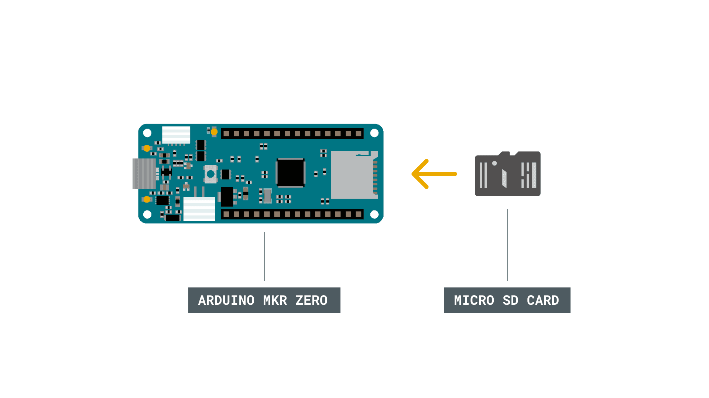

>This article was revised on 2021/11/18 by Karl Söderby.

This guide collects compatible hardware and great code examples that you can use if you want to get started with Secure Digital (SD) cards. 

***The examples in this guide comes from the [SD Library](https://www.arduino.cc/en/Reference/SD), which originally is based on [SdFat](https://github.com/greiman/SdFat) by William Greiman.***

## Hardware & Software Required

- Arduino Board with SD Card Slot\*
- Arduino IDE ([online](https://create.arduino.cc/) or [offline](https://www.arduino.cc/en/main/software)).
- Formatted SD Card

\*The boards/shields that have an SD card slot are listed below:

- [MKR Zero](https://store.arduino.cc/products/arduino-mkr-zero-i2s-bus-sd-for-sound-music-digital-audio-data)
- [MKR IoT Carrier](https://store.arduino.cc/products/arduino-mkr-iot-carrier)
- [MKR MEM Shield](https://store.arduino.cc/products/arduino-mkr-mem-shield)
- [MKR SD Proto Shield](https://store.arduino.cc/products/mkr-proto-shield)
- [MKR ENV Shield](https://store.arduino.cc/products/arduino-mkr-env-shield-rev2)
- [MKR Ethernet Shield](https://store.arduino.cc/products/arduino-ethernet-shield-2)
- [Arduino Education Shield](https://store.arduino.cc/products/arduino-education-shield)


## Circuit

Here is an example of how to insert an SD card into the MKR Zero board. None of the examples below requires any additional circuit. 



## Examples

Below are a series of examples

### Read and Write

This example shows how to read and write data to and from an SD card.

- In `setup()`, create a new file with `SD.open()` named "test.txt". `FILE_WRITE` enables read and write access to the file, starting at the end. If a file `"test.txt"` was already on the card, that file would be opened.
- Name the instance of the opened file "myFile".
- Once opened, use `myFile.println()` to write a string to the card, followed by a carriage return. Once the content is written, close the file.
- Again, open the file with `SD.open()`.  Once opened, ask the Arduino to read the contents of the file with `SD.read()` and send them over the serial port. After all the contents of the file are read, close the file with `SD.close()`.

***Note that pin 4 is default Chip Select (CS) pin for most boards. To set CS for MKR Zero, you can use 28 instead of 4, alt. use the SDCARD_SS_PIN definition.***

```arduino
/*
  SD card read/write

  This example shows how to read and write data to and from an SD card file
  The circuit:
   SD card attached to SPI bus as follows:
 ** MOSI - pin 11
 ** MISO - pin 12
 ** CLK - pin 13
 ** CS - pin 4 (for MKRZero SD: SDCARD_SS_PIN)

  created   Nov 2010
  by David A. Mellis
  modified 9 Apr 2012
  by Tom Igoe

  This example code is in the public domain.

*/

#include <SPI.h>
#include <SD.h>

File myFile;

void setup() {
  // Open serial communications and wait for port to open:
  Serial.begin(9600);
  while (!Serial) {
    ; // wait for serial port to connect. Needed for native USB port only
  }


  Serial.print("Initializing SD card...");

  if (!SD.begin(4)) {
    Serial.println("initialization failed!");
    while (1);
  }
  Serial.println("initialization done.");

  // open the file. note that only one file can be open at a time,
  // so you have to close this one before opening another.
  myFile = SD.open("test.txt", FILE_WRITE);

  // if the file opened okay, write to it:
  if (myFile) {
    Serial.print("Writing to test.txt...");
    myFile.println("testing 1, 2, 3.");
    // close the file:
    myFile.close();
    Serial.println("done.");
  } else {
    // if the file didn't open, print an error:
    Serial.println("error opening test.txt");
  }

  // re-open the file for reading:
  myFile = SD.open("test.txt");
  if (myFile) {
    Serial.println("test.txt:");

    // read from the file until there's nothing else in it:
    while (myFile.available()) {
      Serial.write(myFile.read());
    }
    // close the file:
    myFile.close();
  } else {
    // if the file didn't open, print an error:
    Serial.println("error opening test.txt");
  }
}

void loop() {
  // nothing happens after setup
}


```

### Card Information

This example shows how to read information about a SD card. The example reports volume type, free space and other information using the SD library, sending it over the serial port.

```arduino

/*

  SD card test

  This example shows how use the utility libraries on which the'

  SD library is based in order to get info about your SD card.

  Very useful for testing a card when you're not sure whether its working or not.

  Pin numbers reflect the default SPI pins for Uno and Nano models

  The circuit:

    SD card attached to SPI bus as follows:

 ** SDO - pin 11 on Arduino Uno/Duemilanove/Diecimila

 ** SDI - pin 12 on Arduino Uno/Duemilanove/Diecimila

 ** CLK - pin 13 on Arduino Uno/Duemilanove/Diecimila

 ** CS - depends on your SD card shield or module.

        Pin 10 used here for consistency with other Arduino examples

  created  28 Mar 2011

  by Limor Fried

  modified 24 July 2020

  by Tom Igoe

*/
// include the SD library:
#include <SPI.h>
#include <SD.h>

// set up variables using the SD utility library functions:

Sd2Card card;

SdVolume volume;

SdFile root;

// change this to match your SD shield or module;
// Default SPI on Uno and Nano: pin 10
// Arduino Ethernet shield: pin 4
// Adafruit® SD shields and modules: pin 10
// Sparkfun SD shield: pin 8
// MKRZero SD: SDCARD_SS_PIN

const int chipSelect = 10;

void setup() {

  // Open serial communications and wait for port to open:

  Serial.begin(9600);

  while (!Serial) {

    ; // wait for serial port to connect. Needed for native USB port only

  }

  Serial.print("\nInitializing SD card...");

  // we'll use the initialization code from the utility libraries

  // since we're just testing if the card is working!

  if (!card.init(SPI_HALF_SPEED, chipSelect)) {

    Serial.println("initialization failed. Things to check:");

    Serial.println("* is a card inserted?");

    Serial.println("* is your wiring correct?");

    Serial.println("* did you change the chipSelect pin to match your shield or module?");

    while (1);

  } else {

    Serial.println("Wiring is correct and a card is present.");

  }

  // print the type of card

  Serial.println();

  Serial.print("Card type:         ");

  switch (card.type()) {

    case SD_CARD_TYPE_SD1:

      Serial.println("SD1");

      break;

    case SD_CARD_TYPE_SD2:

      Serial.println("SD2");

      break;

    case SD_CARD_TYPE_SDHC:

      Serial.println("SDHC");

      break;

    default:

      Serial.println("Unknown");

  }

  // Now we will try to open the 'volume'/'partition' - it should be FAT16 or FAT32

  if (!volume.init(card)) {

    Serial.println("Could not find FAT16/FAT32 partition.\nMake sure you've formatted the card");

    while (1);

  }

  Serial.print("Clusters:          ");

  Serial.println(volume.clusterCount());

  Serial.print("Blocks x Cluster:  ");

  Serial.println(volume.blocksPerCluster());

  Serial.print("Total Blocks:      ");

  Serial.println(volume.blocksPerCluster() * volume.clusterCount());

  Serial.println();

  // print the type and size of the first FAT-type volume

  uint32_t volumesize;

  Serial.print("Volume type is:    FAT");

  Serial.println(volume.fatType(), DEC);

  volumesize = volume.blocksPerCluster();    // clusters are collections of blocks

  volumesize *= volume.clusterCount();       // we'll have a lot of clusters

  volumesize /= 2;                           // SD card blocks are always 512 bytes (2 blocks are 1KB)

  Serial.print("Volume size (Kb):  ");

  Serial.println(volumesize);

  Serial.print("Volume size (Mb):  ");

  volumesize /= 1024;

  Serial.println(volumesize);

  Serial.print("Volume size (Gb):  ");

  Serial.println((float)volumesize / 1024.0);

  Serial.println("\nFiles found on the card (name, date and size in bytes): ");

  root.openRoot(volume);

  // list all files in the card with date and size

  root.ls(LS_R | LS_DATE | LS_SIZE);

  root.close();
}

void loop(void) {
}
```

***Please note: the cluster size is defined at format time by the user and has some default values that can be changed by users following some rules. In the sketch above we are using the default size for a block that is set at 512 bytes by standards. This value is not the cluster size: that is calculated as the number of blocks per cluster.  You may find more in depth information about cluster sizes [in this article](https://web.archive.org/web/20240309213220/https://support.microsoft.com/en-us/topic/default-cluster-size-for-ntfs-fat-and-exfat-9772e6f1-e31a-00d7-e18f-73169155af95).***

### Dump File

This example shows how to read a file from a SD card using the SD library and send it over the serial port.

On the SD card, there is a file named "datalog.txt". In the `loop()`, the file is opened when calling `SD.open()`. To send the file serially to a computer, use `Serial.print()`, reading the contents of the file with `SD.read()`.


```arduino

/*

  SD card file dump

  This example shows how to read a file from the SD card using the

  SD library and send it over the serial port.

  Pin numbers reflect the default SPI pins for Uno and Nano models.

  The circuit:

   SD card attached to SPI bus as follows:

 ** SDO - pin 11

 ** SDI - pin 12

 ** CLK - pin 13

 ** CS - depends on your SD card shield or module.

        Pin 10 used here for consistency with other Arduino examples

   (for MKRZero SD: SDCARD_SS_PIN)

  created  22 December 2010

  by Limor Fried

  modified 9 Apr 2012

  by Tom Igoe

  This example code is in the public domain.

*/
#include <SD.h>

const int chipSelect = 10;

void setup() {

  // Open serial communications and wait for port to open:

  Serial.begin(9600);

  // wait for Serial Monitor to connect. Needed for native USB port boards only:

  while (!Serial);

  Serial.print("Initializing SD card...");

  if (!SD.begin(chipSelect)) {

    Serial.println("initialization failed. Things to check:");

    Serial.println("1. is a card inserted?");

    Serial.println("2. is your wiring correct?");

    Serial.println("3. did you change the chipSelect pin to match your shield or module?");

    Serial.println("Note: press reset or reopen this serial monitor after fixing your issue!");

    while (true);

  }

  Serial.println("initialization done.");

  // open the file. note that only one file can be open at a time,

  // so you have to close this one before opening another.

  File dataFile = SD.open("datalog.txt");

  // if the file is available, write to it:

  if (dataFile) {

    while (dataFile.available()) {

      Serial.write(dataFile.read());

    }

    dataFile.close();

  }

  // if the file isn't open, pop up an error:

  else {

    Serial.println("error opening datalog.txt");

  }
}

void loop() {
}
```

### File Management

This example shows how to create and destroy a file on a SD card.

In the `setup()`, open a new file with `SD.open()` named "example.txt". `FILE_WRITE` enables read and write access to the file, starting at the end. In this example though, immediately close the file by calling `myFile.close()`.

After checking to make sure the file exists with `SD.exists()`, delete the file from the card with `SD.remove`.

```arduino

/*

  SD card basic file example

  This example shows how to create and destroy an SD card file

  The circuit. Pin numbers reflect the default

  SPI pins for Uno and Nano models:

   SD card attached to SPI bus as follows:

 ** SDO - pin 11

 ** SDI - pin 12

 ** CLK - pin 13

 ** CS - depends on your SD card shield or module.

        Pin 10 used here for consistency with other Arduino examples

    (for MKRZero SD: SDCARD_SS_PIN)

  created   Nov 2010

  by David A. Mellis

  modified 24 July 2020

  by Tom Igoe

  This example code is in the public domain.

*/
#include <SD.h>

const int chipSelect = 10;

File myFile;

void setup() {

  // Open serial communications and wait for port to open:

  Serial.begin(9600);

  // wait for Serial Monitor to connect. Needed for native USB port boards only:
while (!Serial);

  Serial.print("Initializing SD card...");

  if (!SD.begin(10)) {

    Serial.println("initialization failed!");

    while (1);

  }

  Serial.println("initialization done.");

  if (SD.exists("example.txt")) {

    Serial.println("example.txt exists.");

  } else {

    Serial.println("example.txt doesn't exist.");

  }

  // open a new file and immediately close it:

  Serial.println("Creating example.txt...");

  myFile = SD.open("example.txt", FILE_WRITE);

  myFile.close();

  // Check to see if the file exists:

  if (SD.exists("example.txt")) {

    Serial.println("example.txt exists.");

  } else {

    Serial.println("example.txt doesn't exist.");

  }

  // delete the file:

  Serial.println("Removing example.txt...");

  SD.remove("example.txt");

  if (SD.exists("example.txt")) {

    Serial.println("example.txt exists.");

  } else {

    Serial.println("example.txt doesn't exist.");

  }
}

void loop() {

  // nothing happens after setup finishes.
}
```

### List Files

This example shows how to list the files available in the directory of the SD card.

The main `loop()` does nothing because the function that prints out the file directory of "/" of the SD card is called from the `setup()`. This because we need to see it just once.

The `printDirectory` function scans through the list of entries and prints on serial every file and directory present. For files the size is printed as well.

```arduino

/*

  Listfiles

  This example shows how print out the files in a

  directory on a SD card.Pin numbers reflect the default

  SPI pins for Uno and Nano models

  The circuit:

   SD card attached to SPI bus as follows:

 ** SDO - pin 11

 ** SDI - pin 12

 ** CLK - pin 13

 ** CS - depends on your SD card shield or module.

        Pin 10 used here for consistency with other Arduino examples

    (for MKRZero SD: SDCARD_SS_PIN)

  created   Nov 2010

  by David A. Mellis

  modified 9 Apr 2012

  by Tom Igoe

  modified 2 Feb 2014

  by Scott Fitzgerald

  modified 24 July 2020

  by Tom Igoe


  This example code is in the public domain.

*/
#include <SD.h>

const int chipSelect = 10;

File root;

void setup() {

 // Open serial communications and wait for port to open:

  Serial.begin(9600);

  // wait for Serial Monitor to connect. Needed for native USB port boards only:

  while (!Serial);

  Serial.print("Initializing SD card...");

  if (!SD.begin(chipSelect)) {

    Serial.println("initialization failed. Things to check:");

    Serial.println("1. is a card inserted?");

    Serial.println("2. is your wiring correct?");

    Serial.println("3. did you change the chipSelect pin to match your shield or module?");

    Serial.println("Note: press reset or reopen this serial monitor after fixing your issue!");

    while (true);

  }

  Serial.println("initialization done.");

  root = SD.open("/");

  printDirectory(root, 0);

  Serial.println("done!");
}

void loop() {

  // nothing happens after setup finishes.
}

void printDirectory(File dir, int numTabs) {

  while (true) {

    File entry =  dir.openNextFile();

    if (! entry) {

      // no more files

      break;

    }

    for (uint8_t i = 0; i < numTabs; i++) {

      Serial.print('\t');

    }

    Serial.print(entry.name());

    if (entry.isDirectory()) {

      Serial.println("/");

      printDirectory(entry, numTabs + 1);

    } else {

      // files have sizes, directories do not

      Serial.print("\t\t");

      Serial.println(entry.size(), DEC);

    }

    entry.close();

  }
}
```

