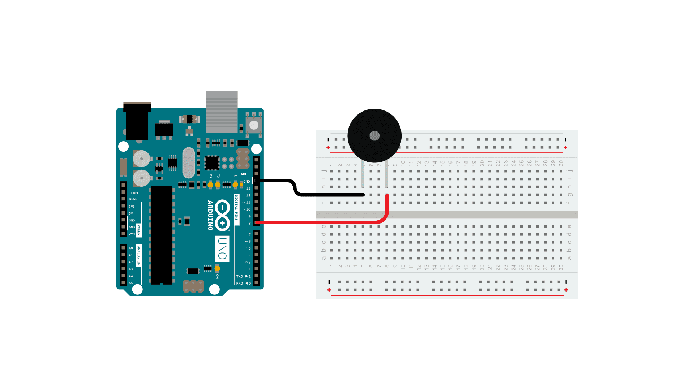
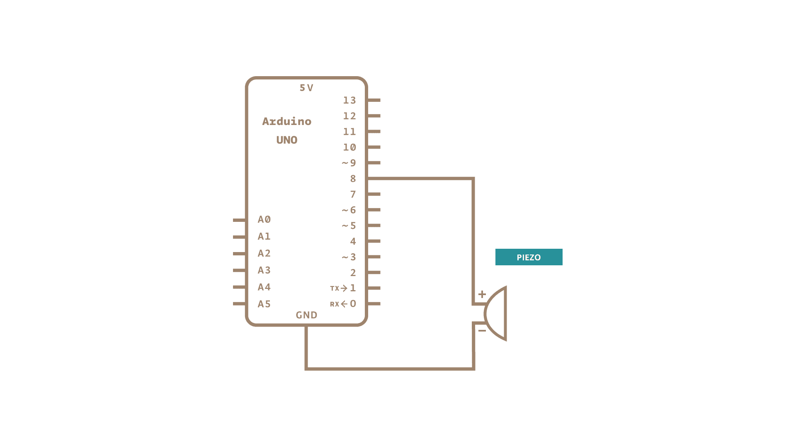
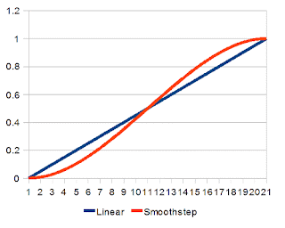

> This article was revised on 2022/09/28 by Hannes Siebeneicher.

This article highlights different approaches to making sounds and even entire songs with an Arduino. In 2013 Brett Hagman created the [tone()](https://www.arduino.cc/reference/en/language/functions/advanced-io/tone/) library which is a good starting point for creating different types of sounds using an Arduino. As the examples in this article are gathered from the Arduino playground and were mostly created before 2013 a lot of steps are still done manually, which can be skipped when using the [tone()](https://www.arduino.cc/reference/en/language/functions/advanced-io/tone/) library.

The examples are nevertheless still relevant as they explain some basic concepts of generating tone frequencies, interpolation and even provide you with some songs to try out. If you want to see an example for a simple melody using the [tone()](https://www.arduino.cc/reference/en/language/functions/advanced-io/tone/) library and familiarize yourself with the concept of external sound data files, you can check out [this example](https://docs.arduino.cc/built-in-examples/digital/toneMelody).

Most sketches in this article use pin 8 as output for the piezo buzzer or speaker which means you only need to connect your components a shown below and try out the different examples by uploading them to your Arduino. Only the **PCMAudio** example uses pin 11 as it is making use of [PWM](https://www.arduino.cc/en/Tutorial/Foundations/PWM).

## Hardware Required

- Arduino board
- piezo buzzer or a speaker
- hook-up wires

## Circuit



## Schematic



## Basics

Most times a piezo buzzer is used to produce sounds with an Arduino. When voltage is applied to a piezoelectric ceramic material it causes it to vibrate rapidly, resulting in the generation of sound waves. Every wave has an associated property called frequency which measures how many cycles happen every second. This unit of cycles is called Hertz (Hz). E.g., A middle C on the piano has a frequency of 262 Hz which means that the air oscillates back and forth 262 times every second.

Another property of a wave is its period, which equals to one divided by the frequency, measuring the length and time of the wave. So, for that middle C on the piano the cycle repeats every 3.8 milliseconds. While a normal pure tone is a sine wave, it is much easier to create a square wave using an Arduino by turning the pin on, waiting for a certain amount of time, then turning the pin off and waiting again.

## Freqout

The following example was created by Paul Badger in 2007. It shows a simple tone generation function generating square waves of arbitrary frequency and duration. The program also includes a top-octave lookup table & transportation function.

```
#include <math.h>  // requires an Atmega168 chip

#define outpin 8   // audio out to speaker or amp
int ptime;
int   k,  x, dur, freq, t;
int i, j;


float ps;         // variable for pow pitchShift routine

float noteval;

// note values for two octave scale
// divide them by powers of two to generate other octaves
float A     = 14080;
float AS    = 14917.2;
float B     = 15804.3;
float C     = 16744;
float CS    = 17739.7;
float D     = 18794.5;
float DS    = 19912.1;
float E     = 21096.2;
float F     = 22350.6;
float FS    = 23679.6;
float G     = 25087.7;
float GS    = 26579.5;
float A2    = 28160;
float A2S   = 29834.5;
float B2    = 31608.5;
float C2    = 33488.1;
float C2S   = 35479.4;
float D2    = 37589.1;
float D2S   = 39824.3;
float E2    = 42192.3;
float F2    = 44701.2;
float F2S   = 47359.3;
float G2    = 50175.4;
float G2S   = 53159;
float A3    = 56320;

//octaves  - corresponds to piano octaves
float oct8 = 4;
float oct7 = 8;
float oct6 = 16;
float oct5 = 32;
float oct4 = 64;
float oct3 = 128;
float oct2 = 256;
float oct1 = 512;
float oct0 = 1024;

//rhythm values
int wh = 1024;
int h  = 512;
int dq = 448;
int q = 256;
int qt = 170;
int de = 192;
int e = 128;
int et = 85;
int dsx = 96;
int sx = 64;
int thx = 32;

// major scale just for demo, hack this

float majScale[] = {
  A,  B,  CS,  D,  E,  FS,  GS,  A2,   B2,  C2S,  D2,  E2,  F2S,  G2S,  A3};

void setup() {
  Serial.begin(9600);
}


void loop(){
 for(i= 0; i<=11; i++){
    ps = (float)i / 12;         // choose new transpose interval every loop
    for(x= 0; x<=15; x++){
      noteval = (majScale[x] / oct4) * pow(2,ps);    // transpose scale up 12 tones
// pow function generates transposition
// eliminate " * pow(2,ps) " to cut out transpose routine

      dur = 100;
      freqout((int)noteval, dur);

      delay(10);
    }
  }
}

void freqout(int freq, int t)  // freq in hz, t in ms
{
  int hperiod;                               //calculate 1/2 period in us
  long cycles, i;
  pinMode(outpin, OUTPUT);                   // turn on output pin

  hperiod = (500000 / freq) - 7;             // subtract 7 us to make up for digitalWrite overhead

  cycles = ((long)freq * (long)t) / 1000;    // calculate cycles
 // Serial.print(freq);
 // Serial.print((char)9);                   // ascii 9 is tab - you have to coerce it to a char to work
 // Serial.print(hperiod);
 // Serial.print((char)9);
 // Serial.println(cycles);

  for (i=0; i<= cycles; i++){              // play note for t ms
    digitalWrite(outpin, HIGH);
    delayMicroseconds(hperiod);
    digitalWrite(outpin, LOW);
    delayMicroseconds(hperiod - 1);     // - 1 to make up for digitaWrite overhead
  }
pinMode(outpin, INPUT);                // shut off pin to avoid noise from other operations

}
```

### Duration extension

In the example below some minor tweaks have been made, mostly changing the array to have durations and a sentinel was added to mark the end. The example shown above remains as it shows a great simplistic structure.

```
  float EIGHTH = 1;
  float QUARTER = 2;
  float DOTTED_QUARTER =3;
  float HALF = 4;
  float ETERNITY =-1;
  float TEMPO = 150;

  float majScale[] = {
    A,QUARTER,  B,QUARTER,  CS,QUARTER,  D,QUARTER,  E,QUARTER,  FS,QUARTER,  GS,QUARTER,  A2,QUARTER,  B2,QUARTER,
    C2S,QUARTER,  D2,QUARTER,  E2,QUARTER, F2S,QUARTER, G2S,QUARTER, A3,QUARTER, REST,ETERNITY
  };

  float odeToJoy[] = {
    F2S,QUARTER, F2S,QUARTER, G2,QUARTER, A3,QUARTER, A3,QUARTER, G2,QUARTER, F2S,QUARTER, E2,QUARTER, D2,QUARTER,
    D2,QUARTER, E2,QUARTER, F2S,QUARTER, F2S,DOTTED_QUARTER, E2,EIGHTH, E2,HALF, F2S,QUARTER, F2S,QUARTER, G2,QUARTER,
    A3,QUARTER, A3,QUARTER,G2,QUARTER, F2S,QUARTER, E2,QUARTER, D2,QUARTER, D2,QUARTER, E2,QUARTER, F2S,QUARTER, E2,DOTTED_QUARTER,
    D2,EIGHTH, D2,HALF, E2,QUARTER, E2,QUARTER, F2S,QUARTER, D2,QUARTER, E2,QUARTER, F2S,EIGHTH, G2,EIGHTH, F2S,QUARTER, D2,QUARTER,
    E2,QUARTER, F2S,EIGHTH, G2,EIGHTH,  F2S,QUARTER, E2,QUARTER, D2,QUARTER, E2,QUARTER, A,QUARTER, REST,ETERNITY
  };

  void play(float song[]) {
    for(x= 0; x<10000; x=x+2) {
      noteval = (song[x] / 64);
      dur = TEMPO * song[x+1];
      if(dur < 0) {
        break;
      freqout((int)noteval, dur);
      delay(10);
      }
    }
  }
```

### Examples

[Function Library](https://playground.arduino.cc/Main/FunctionLibrary/)

## Smoothstep

This example is made by [Dan Thompson](https://danthompsonsblog.blogspot.com/) in 2009 for smooth interpolation between two values. Smoothstep is a common formula used for many different applications such as Animation and Audio. This sketch includes a Serial Printout to help you visualize the formula. Visit [danthompsonsblog.blogspot.com](https://danthompsonsblog.blogspot.com/2009/02/smoothstep-interpolation-with-arduino.html) for the full smoothstep tutorial as well as many others. For a comprehensive overview of interpolation as well as some great Tips and Tricks [visit this page](http://sol.gfxile.net/interpolation/).



### Code

```

///////////////////////////////////////
// Smoothstep Interpolation Example //
///////////////////////////////////////

// Dan Thompson 2009
//
// Inpired by the code and chat on this site.
// https://sol.gfxile.net/interpolation/
//
// Use this code at your own risk.
//
// This sketch was written with motion controlled timelapse photography
// in mind. I have tried to make it generic enough to understand the smoothstep
// concept so that one might adapt this powerful formula in other areas as well.
//
// For the full tutorial visit https://danthompsonsblog.blogspot.com/
//
// Usage:
// 1. Upload the sketch to the Arduino.
// 2. Click on the Serial monitor to see some visual feed back of the SMOOTHSTEP function.
// 3. Scroll through the print out to see the SMOOTHSTEP curve.
// 4. Play with the code and adapt it to your needs! ;)

#define SMOOTHSTEP(x) ((x) _ (x) _ (3 - 2 \* (x))) //SMOOTHSTEP expression.

int j = 0; //Just an Iterator.
int i = 0; //Just another Iterator.
float A = 0.0; //Input Min Value
float B = 100.0; //Input Max Value
float N = 100.0; //Input number of steps for transition
float X; //final smoothstepped value
float v; //smoothstep expression variable

void setup() {
Serial.begin(9600); //establish serial connection for debugging
}

void loop()
{
if (j < N) // Keep looping until we hit the pre-defined max number
// of steps
{
v = j / N; // Iteration divided by the number of steps.
v = SMOOTHSTEP(v); // Run the smoothstep expression on v.
X = (B _ v) + (A _ (1 - v)); // Run the linear interpolation expression using the current
//smoothstep result.
for ( i=0; i < X ; i++) // This loop could the relevant code for each time your
//motor steps.
{
Serial.print("1"); //Prints the number "1" for each step.
 }
Serial.print(" "); //Puts a space between each line of steps and their
//corresponding float value
Serial.println(X); // prints the soothstepped value
Serial.println("CLICK!!!"); // this could be where you trigger your timelapse shutter
j++; // Increments j by 1.
}
}

```

## PCMAudio

The following example was created by Michael Smith and is the precursor for the [PCM](https://www.arduino.cc/reference/en/libraries/pcm/) library created by David Mellis. It play's 8-bit PCM audio on pin 11 using pulse-width modulation [(PWM)](https://www.arduino.cc/en/Tutorial/Foundations/PWM). It uses two timers. The first changes the sample value 8000 times a second. The second holds pin 11 high for 0-255 ticks out of a 256-tick cycle, depending on the sample value. The second timer repeats 62500 times per second (16000000 / 256), which is much faster than the playback rate (8000 Hz), so it almost sounds halfway decent, just really quiet on a PC speaker.

Takes over Timer 1 (16-bit) for the 8000 Hz timer. This breaks PWM (analogWrite()) for Arduino pins 9 & 10. It then takes Timer 2 (8-bit) for the pulse width modulation, breaking the PWM for pins 11 & 13.

### References:

- [http://tet.pub.ro/](http://tet.pub.ro/Documente/Proiect%20final/Documentatie/Difuzor/Arduino%20Sound%20%E2%80%93%20Part%201%20%E2%80%93%20uCHobby.pdf) (PDF).
- https://www.evilmadscientist.com/article.php/avrdac
- https://www.gamedev.net/reference/articles/article442.asp

### Code

```
#include <stdint.h>
#include <avr/interrupt.h>
#include <avr/io.h>
#include <avr/pgmspace.h>

#define SAMPLE_RATE 8000

/*
* The audio data needs to be unsigned, 8-bit, 8000 Hz, and small enough
* to fit in flash. 10000-13000 samples is about the limit.
*
* sounddata.h should look like this:
*     const int sounddata_length=10000;
*     const unsigned char sounddata_data[] PROGMEM = { ..... };
*
* You can use wav2c from GBA CSS:
*     https://thieumsweb.free.fr/english/gbacss.html
* Then add "PROGMEM" in the right place. I hacked it up to dump the samples
* as unsigned rather than signed, but it shouldn't matter.
*
* https://musicthing.blogspot.com/2005/05/tiny-music-makers-pt-4-mac-startup.html
* mplayer -ao pcm macstartup.mp3
* sox audiodump.wav -v 1.32 -c 1 -r 8000 -u -1 macstartup-8000.wav
* sox macstartup-8000.wav macstartup-cut.wav trim 0 10000s
* wav2c macstartup-cut.wav sounddata.h sounddata
*
* (starfox) nb. under sox 12.18 (distributed in CentOS 5), i needed to run
* the following command to convert my wav file to the appropriate format:
* sox audiodump.wav -c 1 -r 8000 -u -b macstartup-8000.wav
*/

#include "sounddata.h"

int ledPin = 13;
int speakerPin = 11; // Can be either 3 or 11, two PWM outputs connected to Timer 2
volatile uint16_t sample;
byte lastSample;


void stopPlayback()
{
   // Disable playback per-sample interrupt.
   TIMSK1 &= ~_BV(OCIE1A);

   // Disable the per-sample timer completely.
   TCCR1B &= ~_BV(CS10);

   // Disable the PWM timer.
   TCCR2B &= ~_BV(CS10);

   digitalWrite(speakerPin, LOW);
}

// This is called at 8000 Hz to load the next sample.
ISR(TIMER1_COMPA_vect) {
   if (sample >= sounddata_length) {
       if (sample == sounddata_length + lastSample) {
           stopPlayback();
       }
       else {
           if(speakerPin==11){
               // Ramp down to zero to reduce the click at the end of playback.
               OCR2A = sounddata_length + lastSample - sample;
           } else {
               OCR2B = sounddata_length + lastSample - sample;
           }
       }
   }
   else {
       if(speakerPin==11){
           OCR2A = pgm_read_byte(&sounddata_data[sample]);
       } else {
           OCR2B = pgm_read_byte(&sounddata_data[sample]);
       }
   }

   ++sample;
}

void startPlayback()
{
   pinMode(speakerPin, OUTPUT);

   // Set up Timer 2 to do pulse width modulation on the speaker
   // pin.

   // Use internal clock (datasheet p.160)
   ASSR &= ~(_BV(EXCLK) | _BV(AS2));

   // Set fast PWM mode  (p.157)
   TCCR2A |= _BV(WGM21) | _BV(WGM20);
   TCCR2B &= ~_BV(WGM22);

   if(speakerPin==11){
       // Do non-inverting PWM on pin OC2A (p.155)
       // On the Arduino this is pin 11.
       TCCR2A = (TCCR2A | _BV(COM2A1)) & ~_BV(COM2A0);
       TCCR2A &= ~(_BV(COM2B1) | _BV(COM2B0));
       // No prescaler (p.158)
       TCCR2B = (TCCR2B & ~(_BV(CS12) | _BV(CS11))) | _BV(CS10);

       // Set initial pulse width to the first sample.
       OCR2A = pgm_read_byte(&sounddata_data[0]);
   } else {
       // Do non-inverting PWM on pin OC2B (p.155)
       // On the Arduino this is pin 3.
       TCCR2A = (TCCR2A | _BV(COM2B1)) & ~_BV(COM2B0);
       TCCR2A &= ~(_BV(COM2A1) | _BV(COM2A0));
       // No prescaler (p.158)
       TCCR2B = (TCCR2B & ~(_BV(CS12) | _BV(CS11))) | _BV(CS10);

       // Set initial pulse width to the first sample.
       OCR2B = pgm_read_byte(&sounddata_data[0]);
   }


   // Set up Timer 1 to send a sample every interrupt.

   cli();

   // Set CTC mode (Clear Timer on Compare Match) (p.133)
   // Have to set OCR1A *after*, otherwise it gets reset to 0!
   TCCR1B = (TCCR1B & ~_BV(WGM13)) | _BV(WGM12);
   TCCR1A = TCCR1A & ~(_BV(WGM11) | _BV(WGM10));

   // No prescaler (p.134)
   TCCR1B = (TCCR1B & ~(_BV(CS12) | _BV(CS11))) | _BV(CS10);

   // Set the compare register (OCR1A).
   // OCR1A is a 16-bit register, so we have to do this with
   // interrupts disabled to be safe.
   OCR1A = F_CPU / SAMPLE_RATE;    // 16e6 / 8000 = 2000

   // Enable interrupt when TCNT1 == OCR1A (p.136)
   TIMSK1 |= _BV(OCIE1A);

   lastSample = pgm_read_byte(&sounddata_data[sounddata_length-1]);
   sample = 0;
   sei();
}


void setup()
{
   pinMode(ledPin, OUTPUT);
   digitalWrite(ledPin, HIGH);
   startPlayback();
}

void loop()
{
   while (true);
}
```

The above sketch also requires the `sounddata.h` file which you can find below:

```
// sounddata sound made by wav2c
// (wav2c modified to use unsigned samples)

/_ const int sounddata_sampleRate=8000; _/
const int sounddata_length=10000;

const unsigned char sounddata_data[] PROGMEM = {
128, 128, 128, 128, 128, 128, 128, 128, 128, 128, 128, 128, 128, 128, 128, 128, 128, 128, 128, 128, 128,
128, 128, 128, 128, 128, 128, 128, 128, 128, 128, 128, 128, 128, 128, 128, 128, 128, 128, 128, 128,
128, 128, 128, 128, 128, 128, 128, 128, 128, 128, 128, 128, 128, 128, 128, 128, 128, 128, 128, 128,
128, 128, 128, 128, 128, 128, 128, 128, 128, 128, 128, 128, 128, 128, 128, 128, 128, 128, 128, 128,
128, 128, 128, 128, 128, 128, 128, 128, 128, 128, 128, 128, 128, 128, 128, 128, 128, 128, 128, 128,
128, 128, 128, 128, 128, 128, 128, 128, 128, 128, 128, 128, 128, 128, 128, 128, 128, 128, 128, 128,
128, 128, 128, 128, 128, 128, 128, 128, 128, 128, 128, 128, 128, 128, 128, 128, 128, 128, 128, 128,
128, 128, 128, 128, 128, 128, 128, 128, 128, 128, 128, 128, 128, 128, 128, 128, 128, 128, 128, 128,
128, 128, 128, 128, 128, 128, 128, 128, 128, 128, 128, 128, 128, 128, 128, 128, 128, 128, 128, 128,
128, 128, 128, 128, 128, 128, 128, 128, 128, 128, 128, 128, 128, 128, 129, 127, 129, 128, 127, 133,
117, 109, 125, 121, 116, 132, 140, 126, 114, 114, 116, 120, 114, 93, 73, 66, 76, 116, 142, 129,
128, 129, 120, 119, 118, 104, 87, 123, 181, 194, 196, 198, 189, 176, 160, 162, 172, 164, 164, 183,
197, 188, 168, 167, 170, 165, 185, 209, 206, 196, 196, 199, 185, 162, 156, 167, 176, 173, 170, 166,
151, 142, 140, 134, 130, 127, 113, 86, 67, 66, 69, 75, 73, 75, 86, 90, 91, 84, 65, 48,
41, 30, 26, 56, 91, 88, 72, 70, 73, 82, 89, 73, 57, 60, 74, 89, 92, 77, 63, 60,
53, 47, 56, 64, 63, 61, 56, 54, 52, 36, 16, 22, 51, 66, 67, 70, 76, 88, 99, 92,
77, 74, 85, 100, 106, 97, 83, 85, 96, 108, 133, 160, 164, 144, 113, 96, 91, 82, 74, 76,
89, 97, 97, 97, 82, 54, 40, 41, 41, 43, 56, 74, 78, 64, 55, 64, 72, 72, 84, 102,
108, 116, 126, 127, 124, 127, 134, 134, 138, 148, 152, 156, 164, 165, 169, 171, 160, 156, 157, 152,
151, 145, 133, 136, 153, 166, 165, 163, 165, 161, 156, 158, 155, 147, 148, 160, 185, 209, 215, 220,
220, 204, 200, 208, 205, 200, 202, 209, 214, 213, 205, 198, 194, 194, 203, 219, 231, 235, 230, 219,
200, 184, 177, 170, 170, 177, 172, 164, 163, 158, 156, 160, 163, 161, 142, 116, 103, 96, 89, 93,
101, 105, 111, 116, 120, 110, 89, 80, 78, 75, 73, 80, 93, 91, 77, 69, 70, 77, 91, 98,
89, 87, 93, 95, 95, 94, 97, 96, 91, 94, 99, 100, 101, 95, 83, 78, 79, 71, 56, 41,
37, 53, 64, 63, 72, 82, 83, 82, 80, 73, 67, 69, 69, 66, 68, 79, 99, 121, 143, 165,
180, 174, 148, 131, 122, 112, 115, 120, 121, 126, 122, 108, 87, 72, 71, 73, 79, 81, 83, 86,
83, 77, 70, 71, 85, 100, 112, 118, 130, 146, 154, 166, 174, 172, 172, 161, 147, 146, 153, 157,
161, 165, 168, 170, 162, 138, 122, 121, 121, 123, 128, 138, 151, 161, 165, 161, 153, 150, 149, 147,
136, 129, 140, 150, 156, 176, 194, 193, 179, 168, 167, 174, 185, 188, 181, 174, 164, 156, 156, 155,
163, 185, 210, 224, 229, 235, 233, 215, 195, 176, 168, 170, 171, 168, 162, 162, 163, 165, 174, 181,
184, 172, 151, 135, 125, 125, 132, 138, 139, 139, 139, 133, 121, 116, 117, 115, 104, 94, 94, 94,
92, 90, 82, 70, 64, 69, 77, 82, 87, 85, 85, 92, 97, 105, 112, 108, 103, 107, 116, 122,
121, 115, 101, 87, 80, 71, 67, 72, 70, 68, 78, 82, 78, 78, 79, 81, 79, 68, 59, 57,
53, 60, 83, 106, 125, 146, 174, 192, 188, 186, 180, 161, 155, 157, 158, 156, 152, 148, 131, 117,
111, 100, 97, 101, 104, 107, 110, 113, 112, 108, 106, 108, 122, 130, 141, 164, 175, 180, 185, 186,
186, 182, 174, 167, 155, 150, 154, 155, 143, 132, 136, 139, 127, 114, 108, 107, 104, 103, 114, 120,
124, 131, 134, 132, 123, 115, 109, 101, 108, 130, 144, 154, 161, 171, 184, 184, 171, 155, 147, 155,
165, 165, 151, 142, 144, 136, 137, 152, 158, 162, 177, 200, 209, 206, 201, 181, 163, 159, 154, 154,
151, 146, 161, 176, 170, 168, 175, 181, 176, 160, 148, 141, 138, 140, 140, 139, 140, 148, 155, 152,
146, 135, 123, 111, 103, 110, 113, 100, 81, 62, 55, 52, 40, 33, 38, 60, 86, 95, 99, 106,
111, 113, 105, 91, 87, 94, 101, 106, 103, 90, 76, 67, 63, 68, 72, 68, 63, 58, 68, 86,
82, 68, 60, 56, 53, 45, 37, 40, 58, 77, 92, 110, 128, 149, 169, 174, 161, 151, 144, 139,
142, 146, 146, 147, 142, 132, 129, 127, 116, 99, 94, 103, 113, 119, 122, 128, 133, 128, 119, 118,
132, 160, 193, 215, 221, 222, 226, 224, 217, 211, 200, 181, 166, 158, 152, 148, 139, 125, 118, 118,
119, 122, 123, 123, 124, 126, 127, 124, 127, 141, 143, 131, 118, 107, 110, 127, 146, 159, 163, 165,
166, 164, 164, 160, 146, 131, 124, 135, 147, 145, 140, 138, 130, 124, 130, 136, 145, 163, 177, 182,
181, 179, 177, 169, 159, 154, 155, 165, 176, 184, 195, 195, 183, 173, 163, 156, 158, 160, 159, 165,
171, 164, 154, 154, 159, 167, 170, 167, 157, 141, 128, 120, 115, 111, 102, 95, 87, 64, 50, 49,
45, 54, 77, 101, 123, 136, 139, 136, 128, 119, 112, 105, 101, 110, 123, 112, 94, 88, 78, 72,
83, 89, 80, 69, 65, 57, 58, 64, 59, 53, 39, 16, 18, 36, 46, 66, 92, 107, 119, 135,
145, 150, 160, 158, 147, 145, 144, 150, 160, 153, 150, 150, 140, 128, 120, 116, 104, 91, 88, 90,
106, 123, 123, 123, 114, 100, 105, 119, 142, 181, 211, 222, 220, 214, 208, 204, 201, 186, 171, 166,
162, 154, 138, 128, 120, 101, 93, 94, 103, 119, 117, 109, 109, 112, 119, 121, 121, 124, 122, 119,
117, 124, 142, 158, 174, 183, 173, 168, 165, 149, 135, 132, 126, 119, 124, 127, 125, 133, 126, 111,
116, 123, 127, 135, 145, 157, 167, 174, 176, 177, 182, 181, 184, 194, 194, 198, 213, 219, 219, 219,
206, 184, 164, 153, 154, 163, 166, 162, 165, 164, 154, 154, 160, 161, 165, 166, 158, 146, 140, 130,
122, 121, 109, 95, 89, 74, 61, 65, 74, 88, 110, 132, 149, 159, 149, 124, 107, 99, 91, 92,
98, 101, 101, 90, 81, 84, 86, 82, 82, 80, 68, 58, 56, 53, 47, 42, 37, 35, 35, 30,
28, 31, 40, 56, 74, 91, 99, 98, 101, 110, 114, 111, 110, 119, 127, 133, 140, 139, 128, 118,
116, 109, 94, 87, 83, 79, 89, 110, 119, 116, 117, 117, 114, 117, 116, 119, 137, 164, 191, 204,
192, 180, 180, 175, 161, 152, 149, 139, 128, 122, 111, 98, 89, 88, 93, 97, 94, 98, 104, 101,
107, 119, 117, 121, 140, 152, 157, 164, 165, 171, 183, 190, 194, 191, 182, 172, 166, 154, 137, 132,
134, 134, 138, 141, 130, 120, 123, 123, 120, 117, 109, 110, 125, 150, 168, 164, 163, 179, 196, 210,
218, 220, 224, 227, 230, 238, 237, 218, 205, 202, 194, 189, 188, 184, 181, 181, 182, 174, 162, 161,
168, 181, 194, 187, 176, 170, 156, 151, 143, 127, 125, 125, 116, 103, 94, 95, 107, 124, 145, 161,
159, 151, 153, 145, 123, 106, 95, 85, 82, 86, 87, 78, 74, 79, 79, 73, 64, 58, 62, 62,
64, 59, 43, 41, 53, 59, 57, 51, 47, 49, 71, 99, 107, 105, 98, 87, 93, 109, 117, 114,
110, 113, 120, 132, 136, 131, 129, 123, 112, 105, 97, 95, 103, 115, 123, 125, 130, 140, 145, 145,
137, 134, 142, 147, 157, 176, 187, 183, 171, 157, 142, 132, 132, 133, 131, 127, 111, 92, 84, 83,
81, 72, 63, 60, 69, 90, 112, 122, 115, 112, 124, 131, 135, 144, 145, 149, 161, 174, 184, 181,
171, 160, 148, 143, 138, 127, 119, 119, 126, 130, 120, 107, 100, 99, 104, 109, 105, 95, 95, 106,
121, 138, 149, 158, 165, 170, 183, 200, 214, 227, 233, 236, 236, 225, 214, 206, 194, 188, 181, 173,
174, 175, 176, 174, 164, 159, 159, 153, 149, 150, 154, 166, 172, 160, 146, 136, 130, 131, 127, 112,
96, 91, 97, 107, 117, 125, 125, 120, 119, 120, 119, 112, 96, 80, 70, 65, 67, 69, 63, 63,
61, 48, 41, 46, 58, 73, 84, 91, 90, 85, 88, 88, 84, 79, 74, 84, 94, 99, 116, 128,
122, 111, 104, 99, 96, 101, 117, 128, 127, 124, 130, 139, 139, 138, 133, 115, 105, 115, 131, 141,
147, 149, 147, 149, 159, 162, 159, 158, 155, 156, 160, 162, 168, 168, 163, 166, 168, 148, 121, 118,
128, 127, 127, 124, 108, 93, 85, 76, 67, 56, 58, 82, 102, 108, 122, 137, 135, 131, 134, 133,
135, 145, 158, 165, 166, 167, 161, 152, 151, 147, 140, 128, 117, 116, 116, 113, 117, 115, 108, 105,
105, 99, 91, 98, 112, 115, 120, 133, 145, 158, 171, 182, 188, 190, 201, 222, 235, 239, 241, 245,
239, 230, 224, 214, 196, 178, 176, 183, 191, 200, 199, 189, 175, 159, 148, 140, 135, 150, 173, 185,
185, 178, 157, 135, 125, 115, 104, 101, 102, 100, 95, 93, 91, 81, 73, 74, 80, 87, 77, 72,
72, 56, 45, 47, 45, 42, 39, 37, 27, 16, 24, 54, 82, 92, 91, 94, 92, 88, 84, 75,
73, 80, 93, 113, 127, 129, 117, 107, 100, 90, 85, 82, 83, 101, 122, 134, 139, 141, 137, 130,
126, 116, 108, 120, 145, 168, 176, 173, 165, 151, 142, 144, 146, 149, 150, 155, 163, 158, 152, 144,
136, 140, 142, 136, 132, 126, 123, 122, 118, 120, 120, 115, 115, 108, 91, 82, 85, 98, 120, 144,
163, 171, 156, 138, 134, 129, 123, 128, 140, 155, 166, 169, 157, 140, 132, 125, 121, 121, 115, 110,
115, 113, 101, 92, 87, 83, 83, 86, 85, 81, 88, 106, 120, 127, 126, 121, 126, 144, 161, 167,
166, 173, 196, 217, 224, 226, 220, 211, 213, 217, 208, 200, 197, 187, 184, 190, 194, 198, 199, 186,
174, 167, 160, 160, 173, 188, 198, 206, 200, 181, 169, 152, 130, 119, 110, 110, 125, 126, 115, 102,
83, 68, 66, 72, 75, 79, 75, 61, 51, 49, 43, 38, 40, 41, 35, 32, 39, 48, 59, 72,
87, 98, 91, 87, 92, 84, 71, 66, 73, 91, 110, 123, 127, 113, 95, 88, 82, 76, 76, 84,
96, 109, 119, 123, 129, 127, 119, 121, 122, 126, 139, 148, 162, 173, 169, 158, 142, 127, 121, 121,
124, 125, 134, 149, 154, 158, 145, 119, 114, 119, 119, 128, 140, 142, 138, 130, 123, 125, 128, 125,
128, 137, 141, 147, 157, 156, 149, 158, 174, 171, 153, 139, 127, 123, 130, 136, 151, 166, 166, 158,
144, 130, 122, 113, 110, 115, 119, 122, 122, 112, 96, 85, 82, 79, 82, 95, 108, 112, 107, 103,
111, 126, 125, 113, 118, 129, 136, 149, 162, 173, 184, 194, 198, 186, 179, 191, 197, 190, 190, 198,
201, 193, 187, 185, 188, 197, 202, 206, 212, 213, 207, 198, 191, 193, 203, 203, 191, 178, 160, 137,
123, 116, 112, 120, 129, 122, 103, 88, 80, 63, 47, 46, 56, 65, 54, 41, 42, 45, 46, 47,
54, 64, 60, 61, 77, 79, 73, 90, 111, 109, 98, 100, 102, 93, 88, 95, 116, 137, 141, 140,
137, 122, 104, 97, 99, 101, 106, 110, 115, 127, 130, 129, 139, 148, 146, 143, 147, 144, 139, 149,
168, 172, 155, 139, 129, 117, 107, 110, 121, 133, 144, 153, 154, 138, 118, 103, 94, 96, 112, 136,
150, 143, 129, 125, 129, 133, 145, 158, 156, 149, 151, 156, 160, 162, 160, 153, 143, 131, 117, 107,
107, 110, 113, 123, 134, 131, 118, 111, 112, 104, 90, 99, 118, 121, 123, 131, 121, 104, 101, 112,
127, 132, 127, 126, 128, 125, 118, 125, 133, 123, 111, 107, 113, 124, 133, 150, 170, 179, 181, 183,
184, 180, 176, 182, 188, 193, 198, 205, 213, 211, 209, 215, 222, 226, 225, 228, 232, 224, 204, 190,
192, 199, 196, 193, 186, 168, 151, 136, 126, 125, 126, 123, 112, 95, 77, 64, 53, 40, 32, 34,
43, 47, 44, 40, 42, 48, 50, 48, 51, 50, 47, 52, 57, 63, 75, 81, 88, 95, 96, 98,
97, 88, 89, 111, 137, 148, 149, 144, 125, 109, 101, 101, 109, 120, 123, 124, 135, 142, 143, 153,
160, 156, 152, 148, 141, 135, 131, 128, 129, 126, 113, 105, 108, 101, 88, 91, 99, 104, 114, 118,
116, 114, 98, 78, 78, 91, 101, 119, 134, 135, 134, 135, 142, 157, 162, 155, 150, 147, 140, 140,
151, 154, 145, 133, 119, 115, 116, 102, 91, 99, 106, 106, 109, 104, 92, 89, 87, 82, 85, 91,
102, 123, 134, 131, 129, 121, 116, 126, 133, 132, 127, 121, 113, 114, 121, 124, 123, 118, 110, 113,
119, 114, 117, 137, 153, 158, 160, 159, 158, 158, 156, 152, 154, 163, 176, 193, 210, 213, 206, 205,
209, 214, 223, 226, 220, 217, 209, 199, 198, 192, 182, 178, 178, 174, 161, 151, 153, 150, 145, 136,
119, 104, 86, 68, 60, 49, 44, 52, 61, 68, 69, 58, 52, 56, 57, 57, 60, 56, 49, 51,
59, 69, 74, 80, 95, 115, 130, 134, 133, 134, 134, 145, 168, 173, 168, 168, 162, 149, 145, 147,
154, 168, 178, 183, 184, 174, 166, 168, 175, 174, 160, 154, 152, 138, 131, 133, 126, 111, 100, 94,
97, 93, 86, 97, 105, 101, 102, 107, 108, 102, 92, 87, 89, 97, 117, 149, 170, 162, 148, 150,
159, 168, 176, 176, 165, 147, 133, 131, 137, 138, 130, 122, 119, 117, 114, 110, 104, 104, 107, 101,
96, 91, 82, 81, 83, 79, 82, 100, 122, 141, 147, 140, 132, 121, 113, 119, 125, 122, 111, 103,
108, 113, 117, 124, 120, 116, 119, 117, 128, 142, 141, 148, 159, 161, 163, 169, 171, 171, 176, 183,
186, 181, 187, 202, 205, 198, 192, 192, 193, 195, 203, 204, 191, 184, 182, 179, 189, 195, 185, 180,
176, 165, 159, 161, 162, 155, 142, 130, 121, 104, 78, 66, 65, 46, 34, 51, 65, 66, 62, 48,
35, 34, 36, 35, 42, 49, 49, 53, 57, 57, 66, 76, 84, 95, 109, 120, 130, 137, 129, 122,
133, 143, 148, 152, 152, 157, 165, 164, 168, 183, 186, 181, 188, 189, 176, 171, 173, 173, 165, 149,
140, 139, 139, 134, 127, 118, 95, 78, 82, 82, 75, 76, 69, 64, 78, 90, 85, 80, 79, 83,
98, 117, 131, 145, 153, 153, 153, 151, 151, 155, 157, 152, 146, 146, 141, 133, 136, 134, 125, 123,
121, 123, 136, 137, 117, 102, 94, 84, 90, 98, 87, 82, 93, 104, 108, 115, 130, 138, 135, 128,
125, 122, 114, 113, 112, 101, 99, 107, 109, 110, 114, 117, 113, 103, 102, 118, 141, 151, 146, 144,
151, 165, 181, 181, 176, 181, 179, 177, 185, 190, 188, 185, 182, 174, 172, 175, 172, 177, 185, 187,
187, 183, 181, 192, 203, 202, 185, 175, 188, 200, 200, 190, 175, 162, 152, 146, 141, 128, 112, 104,
94, 76, 69, 77, 78, 73, 63, 51, 36, 24, 28, 39, 47, 54, 55, 54, 59, 67, 74, 74,
73, 86, 103, 113, 121, 126, 125, 127, 136, 142, 145, 155, 169, 183, 185, 178, 170, 166, 172, 183,
190, 187, 172, 166, 172, 167, 161, 158, 145, 134, 126, 115, 108, 94, 74, 66, 67, 63, 58, 61,
62, 65, 74, 73, 66, 69, 85, 103, 117, 131, 137, 139, 148, 152, 146, 138, 138, 144, 140, 133,
140, 150, 140, 128, 129, 124, 116, 118, 121, 124, 128, 128, 116, 96, 86, 91, 105, 116, 115, 117,
127, 128, 130, 140, 147, 145, 138, 123, 118, 126, 125, 112, 102, 101, 106, 112, 110, 112, 113, 102,
92, 93, 102, 117, 141, 164, 165, 155, 161, 173, 176, 178, 181, 192, 198, 188, 181, 185, 183, 172,
165, 159, 158, 164, 163, 158, 164, 171, 169, 164, 164, 176, 190, 194, 185, 173, 169, 179, 189, 186,
179, 169, 157, 141, 127, 126, 124, 109, 93, 80, 74, 78, 77, 65, 46, 33, 32, 34, 33, 38,
51, 62, 58, 52, 59, 68, 69, 68, 79, 96, 109, 117, 120, 127, 134, 139, 148, 148, 152, 175,
191, 190, 190, 191, 183, 166, 160, 171, 189, 199, 189, 169, 157, 161, 171, 173, 166, 155, 144, 129,
112, 107, 107, 96, 86, 88, 86, 83, 82, 83, 89, 88, 89, 96, 95, 106, 133, 152, 149, 130,
123, 127, 122, 123, 131, 132, 132, 130, 124, 120, 120, 121, 123, 123, 123, 128, 132, 131, 132, 130,
118, 103, 97, 113, 142, 163, 164, 149, 132, 127, 133, 142, 146, 146, 137, 116, 102, 103, 103, 97,
95, 96, 100, 108, 106, 98, 97, 94, 87, 80, 82, 102, 138, 167, 171, 159, 151, 154, 168, 183,
189, 188, 188, 182, 172, 168, 169, 166, 154, 148, 153, 156, 155, 154, 159, 170, 169, 156, 151, 167,
193, 208, 199, 177, 169, 177, 188, 193, 191, 183, 170, 155, 139, 120, 110, 105, 96, 89, 83, 75,
71, 60, 42, 32, 28, 22, 21, 30, 51, 71, 70, 53, 42, 42, 51, 63, 75, 95, 116, 127,
128, 125, 132, 145, 153, 163, 171, 176, 184, 193, 196, 190, 183, 174, 159, 157, 173, 185, 183, 170,
160, 165, 177, 184, 176, 157, 139, 125, 107, 96, 97, 97, 98, 100, 95, 93, 97, 99, 103, 100,
89, 89, 98, 113, 137, 148, 145, 129, 106, 97, 96, 97, 102, 108, 118, 124, 119, 112, 110, 110,
116, 126, 125, 125, 139, 151, 153, 150, 137, 126, 128, 138, 156, 168, 169, 159, 150, 145, 141, 141,
145, 140, 125, 109, 95, 88, 86, 86, 92, 96, 97, 99, 99, 97, 92, 80, 67, 73, 96, 117,
139, 157, 162, 164, 160, 158, 164, 167, 169, 172, 171, 167, 160, 154, 148, 144, 142, 142, 146, 151,
153, 160, 172, 172, 168, 172, 173, 179, 192, 192, 188, 186, 178, 182, 193, 194, 194, 185, 169, 152,
133, 115, 98, 86, 84, 80, 73, 67, 56, 43, 37, 31, 24, 27, 32, 34, 51, 68, 65, 56,
54, 57, 63, 74, 91, 106, 123, 141, 154, 164, 170, 170, 173, 186, 193, 193, 199, 200, 196, 187,
172, 163, 158, 155, 167, 174, 168, 166, 166, 165, 174, 180, 167, 151, 143, 131, 115, 111, 110, 106,
106, 116, 126, 129, 122, 111, 104, 95, 85, 95, 113, 117, 122, 125, 116, 102, 86, 76, 79, 85,
86, 88, 93, 93, 95, 101, 98, 99, 109, 115, 120, 130, 136, 138, 140, 144, 147, 148, 146, 144,
153, 160, 159, 155, 146, 138, 137, 135, 127, 118, 112, 105, 97, 93, 87, 79, 83, 97, 100, 90,
87, 91, 83, 63, 62, 78, 90, 113, 150, 172, 169, 159, 153, 154, 160, 165, 166, 162, 158, 156,
156, 157, 154, 155, 161, 162, 162, 169, 169, 168, 175, 178, 180, 194, 205, 202, 197, 199, 198, 188,
178, 182, 202, 210, 190, 168, 158, 141, 123, 118, 110, 91, 77, 76, 70, 56, 51, 50, 40, 30,
28, 32, 33, 34, 50, 64, 62, 69, 80, 75, 78, 94, 105, 121, 147, 175, 196, 198, 197, 206,
214, 217, 218, 216, 210, 199, 191, 175, 160, 165, 172, 165, 164, 171, 172, 165, 158, 157, 161, 158,
152, 151, 142, 124, 117, 118, 115, 122, 141, 154, 148, 131, 120, 112, 105, 102, 108, 112, 104, 100,
105, 104, 98, 89, 76, 61, 53, 58, 62, 56, 56, 66, 72, 81, 98, 105, 101, 107, 125, 134,
135, 135, 134, 136, 139, 142, 141, 138, 140, 143, 139, 128, 118, 114, 108, 101, 101, 106, 103, 89,
75, 66, 61, 67, 83, 95, 94, 87, 76, 61, 49, 51, 62, 72, 89, 115, 139, 149, 146, 141,
139, 139, 141, 139, 131, 129, 132, 138, 143, 148, 156, 163, 164, 166, 174, 178, 172, 170, 178, 194,
217, 227, 220, 217, 225, 229, 225, 219, 213, 209, 204, 200, 194, 181, 169, 153, 132, 121, 110, 100,
98, 100, 103, 94, 74, 59, 53, 49, 47, 47, 51, 57, 73, 93, 98, 94, 91, 95, 105, 118,
141, 166, 183, 189, 192, 200, 200, 204, 214, 209, 204, 197, 181, 174, 165, 156, 160, 158, 151, 153,
156, 155, 158, 157, 156, 164, 165, 163, 163, 151, 139, 140, 141, 145, 151, 155, 158, 160, 162, 151,
127, 111, 112, 114, 110, 100, 90, 90, 98, 100, 94, 84, 70, 59, 50, 45, 47, 51, 59, 76,
90, 104, 112, 111, 114, 131, 155, 165, 155, 145, 141, 141, 146, 140, 125, 124, 129, 126, 116, 110,
106, 98, 90, 85, 82, 82, 78, 64, 47, 43, 51, 59, 65, 77, 90, 89, 73, 58, 57, 70,
87, 94, 92, 106, 127, 138, 142, 137, 133, 135, 131, 123, 117, 115, 120, 126, 130, 139, 146, 147,
148, 152, 156, 164, 168, 166, 181, 209, 230, 231, 222, 225, 236, 237, 231, 220, 210, 204, 196, 188,
174, 156, 143, 130, 114, 101, 91, 80, 69, 68, 74, 77, 73, 59, 47, 46, 49, 55, 57, 56,
63, 88, 113, 119, 120, 128, 131, 137, 153, 166, 179, 189, 193, 199, 200, 198, 200, 198, 191, 183,
174, 165, 156, 156, 158, 151, 143, 147, 153, 155, 155, 150, 147, 162, 180, 186, 177, 159, 152, 155,
153, 152, 154, 149, 146, 160, 159, 135, 120, 112, 110, 113, 107, 97, 85, 77, 84, 94, 88, 70,
61, 59, 52, 51, 53, 48, 56, 94, 130, 138, 134, 129, 134, 150, 162, 168, 164, 151, 145, 144,
137, 132, 128, 126, 129, 127, 129, 130, 115, 102, 95, 80, 74, 82, 82, 72, 61, 59, 61, 62,
74, 99, 113, 106, 92, 85, 84, 86, 91, 96, 99, 110, 129, 138, 140, 140, 138, 137, 133, 124,
120, 121, 126, 134, 140, 137, 136, 147, 161, 171, 176, 174, 170, 189, 221, 237, 238, 236, 232, 231,
231, 232, 228, 216, 201, 190, 179, 164, 155, 150, 131, 111, 101, 90, 82, 72, 64, 68, 74, 75,
76, 71, 61, 54, 49, 50, 54, 58, 78, 116, 136, 137, 132, 130, 134, 140, 153, 170, 175, 185,
197, 202, 209, 210, 197, 185, 184, 181, 171, 161, 154, 151, 147, 143, 141, 144, 151, 156, 160, 173,
190, 200, 205, 197, 180, 174, 169, 164, 165, 160, 152, 154, 155, 154, 149, 137, 122, 106, 94, 90,
86, 80, 67, 56, 64, 72, 66, 57, 48, 40, 35, 34, 46, 70, 87, 99, 118, 129, 126, 129,
135, 143, 149, 147, 147, 141, 129, 127, 132, 131, 121, 111, 120, 133, 132, 129, 121, 105, 90, 80,
81, 91, 93, 85, 82, 88, 98, 109, 117, 122, 118, 112, 114, 111, 99, 101, 102, 87, 78, 90,
113, 133, 140, 136, 128, 117, 109, 109, 109, 108, 113, 123, 131, 132, 135, 141, 148, 160, 171, 178,
186, 196, 207, 213, 219, 225, 217, 207, 209, 214, 207, 188, 181, 180, 167, 155, 151, 138, 110, 87,
80, 77, 68, 64, 65, 68, 71, 71, 69, 67, 62, 59, 64, 68, 61, 58, 78, 107, 130, 145,
145, 139, 141, 145, 151, 164, 181, 196, 205, 212, 214, 205, 191, 181, 181, 187, 191, 183, 166, 156,
155, 154, 143, 141, 157, 175, 188, 199, 205, 206, 202, 191, 181, 170, 162, 164, 167, 155, 140, 143,
147, 142, 136, 122, 100, 83, 77, 83, 89, 79, 58, 47, 52, 61, 63, 53, 45, 47, 51, 59,
71, 75, 75, 84, 97, 105, 107, 107, 112, 121, 129, 134, 138, 137, 124, 116, 118, 116, 105, 99,
112, 134, 149, 145, 129, 116, 103, 99, 109, 118, 118, 115, 121, 129, 129, 128, 123, 114, 113, 114,
115, 120, 117, 107, 106, 107, 104, 104, 115, 125, 127, 125, 121, 123, 125, 119, 116, 113, 110, 124,
147, 152, 151, 165, 173, 173, 188, 202, 203, 203, 210, 217, 221, 220, 208, 199, 204, 208, 202, 196,
186, 176, 164, 147, 129, 111, 93, 81, 74, 70, 63, 56, 55, 57, 70, 78, 74, 67, 61, 55,
55, 58, 59, 55, 59, 85, 115, 130, 139, 148, 149, 153, 170, 182, 183, 185, 188, 189, 188, 190,
195, 188, 181, 185, 188, 180, 168, 160, 163, 168, 161, 161, 179, 190, 194, 199, 200, 198, 195, 192,
177, 158, 155, 158, 157, 151, 140, 134, 132, 122, 105, 94, 85, 80, 87, 94, 91, 81, 63, 49,
55, 69, 78, 77, 72, 75, 90, 101, 100, 87, 74, 73, 87, 106, 111, 107, 110, 114, 117, 126,
132, 122, 105, 92, 92, 99, 99, 95, 106, 122, 125, 128, 126, 112, 113, 135, 144, 134, 123, 119,
119, 119, 117, 110, 106, 106, 103, 104, 114, 122, 127, 122, 112, 109, 106, 108, 117, 116, 113, 124,
132, 131, 134, 136, 126, 114, 108, 122, 152, 170, 167, 164, 173, 184, 184, 182, 182, 189, 202, 210,
212, 209, 202, 203, 208, 205, 200, 196, 188, 175, 163, 158, 151, 131, 104, 82, 74, 72, 70, 68,
67, 71, 80, 83, 79, 70, 64, 58, 52, 51, 54, 60, 74, 89, 104, 127, 151, 156, 150, 161,
179, 178, 164, 159, 168, 181, 189, 190, 190, 187, 181, 182, 187, 191, 195, 198, 193, 177, 166, 177,
195, 196, 186, 184, 189, 187, 182, 185, 189, 178, 158, 143, 140, 139, 130, 119, 112, 106, 96, 86,
85, 91, 96, 95, 87, 74, 64, 69, 81, 82, 78, 82, 91, 92, 92, 97, 97, 88, 73, 66,
78, 99, 112, 118, 118, 109, 104, 111, 116, 113, 110, 107, 103, 99, 93, 96, 104, 106, 113, 125,
128, 128, 135, 143, 145, 135, 120, 111, 108, 106, 104, 100, 96, 94, 97, 104, 109, 115, 117, 114,
114, 107, 98, 105, 116, 115, 114, 122, 122, 114, 113, 121, 126, 118, 112, 121, 136, 146, 151, 159,
172, 175, 166, 165, 175, 185, 190, 196, 203, 198, 192, 195, 195, 190, 186, 185, 181, 171, 160, 156,
155, 141, 109, 86, 77, 74, 78, 83, 83, 83, 82, 83, 82, 77, 70, 66, 61, 54, 53, 67,
84, 93, 103, 120, 133, 143, 154, 164, 173, 173, 156, 150, 162, 174, 178, 180, 180, 179, 179, 185,
195, 199, 197, 196, 189, 184, 190, 204, 203, 186, 177, 183, 187, 186, 187, 191, 194, 187, 167, 147,
136, 133, 130, 125, 121, 116, 108, 101, 95, 90, 89, 87, 85, 86, 90, 100, 100, 83, 79, 93,
100, 93, 85, 80, 81, 83, 80, 80, 90, 98, 100, 106, 108, 108, 108, 107, 106, 109, 113, 108,
100, 95, 92, 98, 103, 102, 115, 138, 146, 146, 145, 143, 150, 150, 131, 108, 94, 91, 95, 101,
103, 104, 104, 94, 88, 93, 96, 99, 104, 104, 105, 115, 119, 108, 107, 117, 122, 116, 111, 125,
147, 152, 143, 130, 129, 140, 152, 165, 173, 173, 172, 173, 176, 180, 189, 193, 189, 181, 179, 190,
199, 190, 181, 177, 165, 149, 138, 132, 133, 128, 107, 88, 81, 84, 86, 83, 79, 77, 78, 76,
68, 62, 56, 47, 40, 39, 53, 81, 98, 95, 104, 125, 143, 156, 163, 170, 176, 171, 162, 156,
150, 156, 167, 169, 172, 179, 186, 192, 192, 182, 173, 175, 179, 176, 179, 188, 187, 182, 183, 189,
197, 196, 185, 181, 182, 181, 175, 161, 147, 141, 133, 122, 122, 125, 114, 106, 100, 85, 77, 84,
92, 89, 81, 82, 88, 89, 87, 91, 93, 77, 65, 66, 65, 70, 83, 84, 85, 95, 99, 102,
111, 112, 108, 102, 96, 95, 94, 93, 89, 83, 79, 89, 104, 120, 139, 152, 154, 150, 149, 150,
150, 151, 132, 104, 94, 91, 93, 107, 116, 107, 91, 83, 88, 94, 96, 95, 95, 95, 99, 113,
128, 129, 131, 140, 139, 133, 138, 153, 163, 162, 156, 153, 158, 165, 170, 171, 174, 183, 186, 184,
188, 190, 188, 185, 177, 174, 179, 187, 199, 201, 191, 180, 170, 157, 142, 135, 135, 127, 114, 112,
117, 114, 100, 84, 82, 84, 77, 70, 64, 55, 47, 43, 38, 40, 53, 74, 94, 103, 115, 143,
161, 162, 165, 165, 167, 178, 176, 161, 158, 168, 175, 181, 188, 192, 193, 186, 174, 173, 180, 181,
176, 173, 171, 179, 194, 198, 196, 201, 203, 198, 190, 189, 197, 195, 180, 168, 158, 148, 139, 127,
119, 121, 119, 113, 105, 88, 84, 98, 97, 80, 71, 80, 96, 102, 93, 82, 79, 76, 65, 61,
71, 82, 85, 88, 94, 101, 105, 104, 100, 100, 96, 87, 81, 73, 71, 78, 76, 63, 59, 75,
104, 124, 124, 127, 140, 147, 143, 134, 127, 128, 124, 107, 91, 87, 92, 101, 105, 98, 85, 82,
81, 74, 76, 83, 85, 86, 86, 91, 109, 127, 131, 129, 134, 138, 140, 151, 161, 167, 175, 170,
163, 169, 175, 178, 183, 183, 178, 181, 189, 187, 185, 189, 187, 178, 171, 178, 194, 198, 188, 172,
156, 145, 141, 138, 129, 122, 123, 121, 120, 116, 106, 103, 99, 89, 81, 71, 57, 50, 51, 48,
46, 51, 61, 80, 100, 110, 113, 124, 137, 148, 161, 166, 166, 171, 169, 157, 155, 160, 166, 175,
184, 186, 180, 174, 168, 162, 159, 159, 157, 155, 159, 171, 184, 190, 195, 201, 201, 196, 191, 187,
188, 185, 173, 161, 152, 146, 140, 132, 125, 127, 124, 109, 93, 80, 77, 86, 90, 85, 82, 87,
88, 78, 67, 64, 69, 72, 72, 80, 91, 98, 102, 103, 103, 105, 112, 117, 115, 110, 98, 88,
80, 67, 70, 84, 85, 75, 74, 83, 102, 119, 121, 126, 141, 142, 132, 124, 120, 123, 121, 109,
103, 105, 108, 113, 114, 106, 96, 88, 82, 76, 76, 84, 90, 94, 103, 114, 126, 137, 135, 126,
128, 142, 154, 161, 168, 175, 173, 162, 159, 164, 169, 178, 187, 189, 192, 188, 178, 170, 164, 164,
171, 181, 183, 179, 178, 176, 163, 148, 140, 139, 134, 126, 118, 109, 108, 112, 115, 115, 110, 102,
95, 86, 79, 75, 69, 66, 62, 58, 62, 65, 72, 83, 89, 96, 106, 116, 129, 141, 151, 156,
161, 168, 173, 172, 164, 162, 169, 180, 190, 194, 193, 187, 175, 167, 156, 147, 160, 174, 181, 193,
200, 202, 204, 203, 201, 196, 187, 182, 179, 177, 175, 169, 160, 150, 138, 135, 135, 135, 131, 116,
102, 92, 85, 90, 103, 106, 99, 93, 90, 86, 84, 78, 78, 85, 89, 96, 102, 106, 107, 104,
105, 115, 120, 123, 130, 127, 109, 95, 93, 90, 86, 84, 89, 88, 82, 90, 101, 108, 118, 124,
124, 121, 118, 119, 118, 122, 128, 122, 110, 106, 108, 107, 103, 99, 93, 87, 84, 85, 83, 78,
80, 85, 93, 107, 114, 121, 134, 138, 138, 141, 149, 159, 164, 170, 175, 172, 176, 189, 192, 190,
193, 194, 193, 187, 178, 169, 164, 169, 177, 181, 181, 182, 175, 161, 150, 144, 138, 129, 121, 117,
111, 103, 98, 95, 96, 101, 97, 89, 83, 83, 79, 71, 65, 63, 61, 57, 55, 55, 54, 61,
68, 73, 87, 105, 119, 127, 129, 132, 142, 159, 168, 162, 155, 151, 155, 161, 165, 171, 175, 170,
162, 156, 151, 152, 161, 167, 170, 179, 188, 191, 197, 200, 195, 185, 178, 179, 181, 185, 188, 182,
172, 161, 150, 144, 136, 129, 124, 117, 107, 99, 97, 101, 109, 108, 100, 96, 94, 91, 92, 90,
86, 89, 97, 99, 97, 99, 100, 99, 99, 104, 114, 122, 126, 123, 111, 100, 96, 94, 85, 76,
75, 77, 79, 90, 108, 117, 124, 129, 129, 128, 128, 129, 128, 129, 137, 136, 119, 100, 90, 88,
87, 89, 93, 97, 99, 100, 89, 72, 70, 84, 97, 105, 107, 110, 122, 132, 133, 135, 149, 160,
159, 162, 171, 180, 185, 186, 189, 193, 194, 190, 184, 176, 169, 167, 163, 159, 163, 169, 172, 171,
165, 153, 148, 149, 139, 129, 122, 114, 109, 106, 106, 113, 112, 102, 93, 89, 93, 100, 100, 97,
99, 94, 79, 60, 48, 53, 64, 72, 81, 91, 103, 118, 124, 121, 124, 133, 145, 159, 167, 165,
159, 153, 156, 162, 169, 182, 188, 187, 183, 177, 171, 163, 158, 169, 181, 183, 185, 186, 186, 192,
194, 188, 183, 183, 182, 180, 176, 168, 160, 161, 156, 142, 139, 135, 123, 125, 127, 121, 114, 104,
98, 97, 95, 101, 102, 88, 81, 87, 87, 83, 79, 79, 81, 83, 90, 95, 94, 100, 109, 113,
112, 112, 113, 112, 107, 94, 75, 56, 51, 68, 83, 95, 108, 119, 125, 128, 132, 137, 135, 129,
125, 131, 137, 127, 109, 102, 93, 78, 80, 95, 106, 113, 111, 99, 85, 78, 81, 89, 94, 96,
101, 109, 119, 133, 146, 150, 148, 149, 154, 163, 175, 177, 172, 175, 186, 196, 201, 193, 183, 183,
179, 170, 161, 151, 147, 148, 149, 151, 147, 138, 133, 127, 121, 115, 109, 104, 106, 115, 121, 113,
102, 98, 101, 106, 104, 103, 105, 104, 104, 100, 87, 69, 57, 58, 68, 76, 92, 110, 113, 112,
119, 120, 122, 132, 141, 147, 156, 160, 156, 157, 169, 181, 188, 197, 205, 210, 214, 207, 191, 181,
173, 171, 181, 188, 187, 192, 195, 191, 189, 187, 183, 179, 176, 174, 175, 171, 160, 155, 152, 148,
143, 137, 136, 141, 148, 144, 127, 114, 111, 110, 111, 109, 104, 97, 84, 76, 83, 85, 75, 76,
81, 84, 92, 91, 87, 91, 98, 105, 115, 123, 119, 107, 96, 84, 71, 63, 68, 79, 84, 92,
110, 125, 130, 126, 124, 127, 126, 125, 122, 124, 131, 123, 107, 94, 81, 74, 77, 86, 97, 102,
103, 101, 94, 82, 75, 74, 79, 88, 100, 114, 121, 125, 132, 135, 134, 142, 150, 158, 167, 169,
171, 173, 177, 191, 204, 203, 196, 191, 191, 185, 167, 153, 150, 152, 151, 153, 149, 135, 120, 112,
115, 115, 113, 122, 130, 130, 130, 130, 125, 119, 116, 113, 110, 118, 127, 121, 110, 107, 96, 74,
67, 73, 73, 76, 89, 99, 98, 92, 96, 108, 109, 106, 115, 127, 135, 144, 154, 159, 156, 163,
188, 211, 215, 208, 205, 205, 200, 191, 188, 193, 192, 189, 187, 180, 175, 174, 177, 179, 174, 166,
161, 161, 165, 162, 150, 140, 135, 134, 144, 157, 159, 154, 147, 146, 143, 126, 117, 118, 114, 110,
107, 99, 82, 70, 72, 71, 63, 61, 69, 83, 89, 85, 86, 85, 80, 86, 104, 113, 105, 91,
74, 63, 62, 61, 67, 77, 83, 96, 108, 106, 104, 107, 114, 124, 133, 134, 128, 121, 113, 103,
92, 82, 73, 70, 79, 93, 102, 100, 92, 91, 92, 84, 78, 79, 85, 94, 102, 115, 121, 122,
135, 145, 137, 132, 141, 151, 160, 171, 178, 183, 187, 193, 207, 219, 218, 212, 202, 194, 189, 175,
159, 158, 156, 154, 152, 133, 110, 104, 105, 112, 126, 132, 132, 141, 144, 136, 126, 120, 122, 124,
128, 140, 145, 134, 116, 103, 94, 82, 75, 82, 92, 99, 102, 100, 95, 92, 99, 112, 116, 110,
109, 118, 126, 132, 142, 153, 163, 180, 199, 210, 211, 210, 212, 213, 212, 203, 193, 190, 191, 193,
193, 186, 177, 174, 177, 185, 184, 171, 159, 153, 154, 155, 148, 141, 137, 138, 154, 177, 186, 183,
178, 170, 153, 134, 124, 121, 125, 128, 121, 105, 80, 65, 61, 58, 57, 57, 62, 72, 79, 81,
78, 73, 74, 85, 99, 102, 90, 72, 61, 59, 59, 59, 68, 81, 94, 95, 83, 87, 98, 105,
121, 129, 121, 110, 98, 93, 88, 79, 72, 66, 63, 71, 85, 93, 92, 91, 93, 90, 83, 76,
81, 89, 95, 114, 133, 138, 138, 133, 127, 132, 131, 126, 133, 145, 158, 168, 168, 162, 171, 195,
219, 230, 226, 217, 207, 198, 190, 174, 158, 155, 159, 162, 151, 131, 116, 110, 118, 140, 153, 149,
143, 140, 139, 134, 131, 131, 130, 139, 146, 137, 129, 123, 112, 101, 91, 81, 80, 88, 95, 98,
92, 84, 86, 91, 90, 96, 99, 92, 88, 96, 114, 132, 144, 149, 159, 184, 204, 210, 217, 219,
213, 204, 192, 183, 182, 188, 198, 205, 205, 198, 191, 184, 178, 175, 170, 156, 145, 143, 145, 143,
134, 124, 130, 158, 196, 214, 207, 194, 182, 170, 162, 152, 137, 136, 143, 138, 121, 96, 77, 69,
63, 63, 69, 68, 62, 66, 77, 77, 70, 68, 71, 87, 104, 102, 89, 78, 68, 69, 78, 74,
71, 80, 85, 86, 92, 98, 106, 114, 113, 109, 107, 104, 99, 97, 91, 80, 71, 66, 65, 76,
87, 87, 86, 86, 84, 79, 72, 71, 79, 89, 112, 136, 145, 146, 141, 130, 122, 122, 126, 119,
112, 119, 132, 140, 143, 151, 168, 189, 217, 230, 217, 200, 189, 184, 180, 169, 157, 148, 147, 152,
150, 140, 133, 134, 141, 152, 159, 155, 149, 151, 154, 149, 141, 137, 142, 149, 151, 143, 132, 126,
119, 111, 101, 89, 86, 88, 88, 89, 84, 84, 98, 105, 101, 97, 99, 106, 113, 124, 134, 140,
148, 165, 179, 189, 200, 207, 205, 199, 194, 193, 191, 192, 195, 196, 199, 205, 201, 194, 191, 181,
165, 158, 158, 153, 143, 132, 126, 127, 133, 146, 166, 181, 199, 212, 200, 177, 161, 155, 154, 149,
136, 121, 119, 123, 116, 104, 87, 71, 69, 67, 65, 65, 57, 51, 58, 62, 62, 70, 81, 87,
93, 100, 104, 102, 91, 83, 80, 76, 73, 72, 74, 80, 82, 87, 100, 106, 104, 104, 109, 108,
100, 93, 84, 70, 64, 67, 70, 66, 67, 70, 70, 68, 61, 55, 60, 79, 97, 99, 105, 119,
127, 133, 138, 131, 123, 122, 122, 115, 104, 101, 114, 130, 141, 155, 171, 189, 205, 209, 201, 182,
162, 156, 159, 159, 155, 140, 132, 143, 150, 153, 155, 143, 138, 148, 156, 156, 144, 135, 137, 140,
142, 146, 147, 152, 158, 152, 136, 121, 110, 101, 93, 85, 81, 75, 66, 71, 81, 87, 100, 109,
110, 115, 133, 147, 139, 129, 133, 143, 161, 176, 176, 183, 198, 206, 209, 210, 208, 207, 205, 198,
196, 195, 192, 196, 198, 193, 186, 176, 164, 156, 158, 163, 157, 145, 140, 153, 179, 193, 192, 194,
205, 211, 200, 181, 168, 157, 147, 139, 129, 120, 117, 117, 107, 90, 82, 79, 72, 68, 64, 56,
46, 40, 42, 53, 71, 86, 89, 91, 106, 125, 127, 115, 102, 91, 85, 79, 70, 66, 68, 78,
90, 95, 102, 113, 115, 114, 117, 116, 109, 99, 90, 88, 84, 73, 64, 58, 62, 73, 82, 87,
82, 73, 79, 88, 86, 84, 90, 101, 109, 107, 105, 115, 121, 121, 126, 128, 119, 112, 119, 139,
154, 162, 168, 171, 181, 192, 185, 175, 170, 161, 160, 165, 160, 152, 147, 149, 158, 156, 149, 149,
148, 142, 138, 138, 142, 149, 157, 165, 167, 163, 154, 149, 149, 147, 142, 132, 119, 103, 85, 70,
65, 64, 63, 72, 87, 90, 93, 106, 119, 133, 138, 137, 141, 142, 144, 152, 159, 167, 171, 174,
181, 194, 204, 202, 193, 185, 179, 176, 174, 172, 173, 173, 166, 158, 153, 154, 159, 165, 171, 172,
168, 166, 172, 185, 193, 194, 195, 193, 193, 201, 208, 205, 193, 177, 162, 147, 126, 109, 104, 104,
101, 90, 74, 67, 67, 62, 55, 50, 51, 67, 87, 96, 103, 102, 96, 98, 106, 116, 125, 121,
110, 98, 87, 78, 75, 77, 80, 84, 87, 88, 96, 110, 120, 120, 113, 110, 115, 116, 104, 91,
83, 74, 72, 80, 85, 90, 99, 96, 80, 74, 74, 74, 74, 70, 66, 76, 93, 96, 93, 95,
98, 105, 113, 117, 124, 131, 131, 137, 147, 152, 157, 163, 171, 184, 196, 196, 187, 179, 174, 169,
161, 146, 138, 144, 150, 143, 137, 139, 137, 139, 146, 147, 155, 167, 167, 163, 156, 147, 145, 146,
143, 139, 139, 128, 109, 99, 90, 74, 65, 63, 67, 83, 97, 96, 93, 101, 115, 124, 131, 137,
150, 164, 169, 174, 178, 172, 167, 164, 165, 180, 194, 189, 179, 174, 165, 157, 155, 153, 145, 147,
158, 158, 151, 150, 153, 164, 170, 165, 171, 185, 187, 187, 192, 195, 193, 193, 206, 220, 223, 210,
187, 169, 153, 132, 114, 98, 82, 79, 84, 76, 61, 54, 50, 51, 59, 62, 76, 100, 114, 114,
105, 100, 101, 104, 105, 104, 111, 113, 104, 99, 94, 82, 71, 63, 57, 59, 73, 86, 92, 96,
99, 102, 104, 105, 112, 120, 116, 107, 96, 85, 79, 77, 84, 89, 88, 88, 84, 75, 68, 67,
66, 65, 67, 74, 93, 104, 91, 81, 79, 85, 101, 110, 121, 138, 147, 150, 155, 159, 165, 178,
188, 192, 196, 196, 189, 187, 182, 170, 157, 147, 142, 144, 156, 161, 157, 155, 155, 156, 159, 154,
152, 162, 175, 178, 174, 165, 159, 152, 141, 138, 144, 148, 141, 123, 104, 89, 73, 66, 73, 83,
97, 112, 113, 109, 110, 116, 127, 145, 164, 177, 184, 184, 179, 171, 160, 153, 160, 170, 173, 177,
175, 162, 157, 163, 161, 155, 153, 153, 159, 159, 147, 145, 153, 157, 156, 157, 164, 173, 182, 195,
205, 207, 209, 215, 219, 211, 201, 197, 185, 169, 153, 129, 104, 85, 77, 80, 86, 88, 79, 65,
55, 50, 47, 54, 76, 102, 115, 116, 111, 106, 103, 99, 93, 92, 100, 105, 99, 92, 79, 62,
53, 49, 52, 62, 74, 86, 86, 81, 85, 94, 101, 106, 108, 108, 105, 101, 96, 92, 89, 84,
79, 82, 89, 89, 84, 78, 70, 66, 63, 58, 63, 72, 77, 79, 74, 71, 76, 86, 95, 98,
105, 123, 144, 164, 179, 181, 183, 187, 181, 178, 180, 184, 191, 188, 174, 167, 161, 155, 153, 153,
160, 168, 163, 157, 154, 150, 145, 137, 139, 156, 175, 182, 178, 171, 167, 162, 160, 156, 150, 149,
144, 130, 110, 95, 88, 88, 94, 100, 116, 133, 127, 115, 114, 121, 133, 143, 153, 168, 180, 185,
178, 169, 167, 164, 163, 167, 166, 170, 180, 180, 179, 184, 185, 176, 165, 153, 150, 158, 159, 154,
153, 158, 162, 156, 151, 163, 181, 201, 217, 225, 226, 221, 210, 199, 187, 180, 174, 161, 141, 119,
103, 93, 87, 84, 84, 84, 76, 60, 44, 33, 30, 30, 45, 74, 98, 113, 113, 98, 89, 89,
92, 95, 93, 90, 88, 81, 73, 71, 72, 72, 75, 78, 75, 78, 87, 92, 95, 103, 106, 99,
91, 95, 98, 94, 96, 97, 97, 98, 101, 102, 94, 86, 82, 78, 79, 81, 77, 69, 65, 65,
69, 76, 81, 84, 84, 86, 95, 98, 103, 127, 153, 169, 186, 196, 194, 189, 183, 175, 171, 179,
184, 181, 181, 180, 169, 157, 153, 156, 155, 151, 149, 150, 146, 141, 137, 129, 125, 140, 154, 161,
169, 172, 176, 185, 183, 173, 160, 145, 132, 121, 111, 107, 104, 103, 113, 126, 125, 115, 108, 103,
106, 115, 123, 131, 141, 153, 161, 164, 167, 168, 164, 161, 166, 174, 179, 184, 193, 193, 190, 193,
190, 175, 159, 148, 142, 147, 160, 168, 170, 165, 155, 143, 143, 161, 172, 182, 210, 227, 220, 213,
211, 206, 193, 181, 171, 157, 147, 138, 126, 116, 104, 87, 76, 68, 62, 53, 42, 33, 30, 34,
53, 84, 101, 98, 92, 88, 85, 91, 103, 105, 95, 86, 80, 83, 85, 81, 75, 74, 81, 91,
90, 88, 93, 96, 96, 98, 100, 95, 91, 95, 93, 86, 93, 101, 105, 113, 115, 112, 103, 87,
79, 81, 79, 76, 72, 61, 56, 58, 64, 71, 74, 74, 76, 80, 85, 94, 114, 140, 148, 146,
165, 187, 187, 182, 184, 186, 187, 191, 200, 201, 186, 173, 169, 161, 156, 155, 151, 149, 153, 152,
146, 141, 133, 123, 122, 138, 157, 162, 168, 182, 188, 184, 182, 179, 165, 144, 133, 134, 127, 119,
119, 121, 128, 126, 113, 103, 93, 86, 87, 99, 117, 127, 138, 154, 156, 145, 141, 147, 157, 167,
179, 190, 193, 193, 193, 189, 181, 175, 170, 160, 151, 142, 134, 137, 153, 165, 158, 148, 145, 137,
132, 145, 160, 172, 194, 213, 219, 217, 211, 202, 189, 179, 180, 181, 170, 156, 140, 122, 105, 87,
67, 58, 57, 44, 29, 27, 31, 37, 52, 75, 85, 81, 85, 91, 92, 96, 106, 112, 102, 92,
98, 102, 93, 84, 83, 90, 99, 110, 119, 115, 106, 100, 91, 83, 87, 93, 93, 96, 97, 96,
102, 108, 110, 114, 115, 116, 113, 101, 97, 101, 92, 83, 77, 68, 63, 66, 67, 68, 73, 76,
73, 75, 86, 94, 102, 117, 128, 137, 162, 188, 196, 195, 192, 191, 190, 185, 189, 193, 185, 178,
170, 158, 152, 151, 151, 150, 149, 145, 139, 133, 129, 130, 136, 148, 162, 172, 181, 185, 185, 185,
183, 181, 174, 158, 150, 147, 135, 124, 118, 114, 115, 118, 115, 104, 90, 78, 72, 80, 98, 111,
125, 140, 144, 144, 155, 168, 175, 184, 193, 199, 202, 199, 199, 198, 188, 178, 173, 164, 153, 145,
144, 149, 153, 155, 154, 150, 144, 134, 128, 136, 151, 169, 198, 221, 226, 224, 212, 198, 192, 190,
195, 201, 190, 167, 142, 120, 101, 84, 73, 66, 55, 39, 29, 31, 36, 39, 46, 63, 78, 89,
96, 98, 100, 102, 104, 107, 104, 102, 107, 103, 90, 82, 84, 90, 103, 115, 114, 108, 96, 84,
82, 75, 70, 74, 80, 85, 88, 96, 112, 119, 120, 123, 120, 114, 108, 104, 107, 106, 94, 78,
65, 64, 66, 62, 62, 64, 63, 64, 65, 65, 63, 58, 68, 89, 103, 116, 146, 179, 189, 185,
184, 186, 184, 186, 192, 193, 187, 172, 157, 154, 152, 147, 145, 144, 141, 138, 137, 137, 132, 127,
137, 155, 163, 167, 176, 186, 183, 175, 171, 164, 158, 155, 151, 150, 146, 135, 121, 112, 114, 117,
111, 98, 85, 77, 75, 74, 79, 90, 105, 123, 136, 147, 162, 179, 193, 199, 200, 199, 199, 200,
200, 200, 194, 184, 173, 164, 155, 151, 155, 156, 145, 141, 148, 144, 129, 115, 118, 131, 137, 156,
195, 222, 226, 222, 211, 200, 201, 208, 214, 212, 197, 176, 153, 128, 102, 82, 70, 64, 53, 40,
39, 43, 41, 37, 41, 57, 75, 87, 90, 96, 109, 113, 107, 105, 108, 112, 113, 114, 111, 105,
101, 104, 117, 120, 113, 109, 96, 78, 72, 72, 71, 73, 73, 75, 90, 109, 120, 124, 126, 128,
121, 107, 102, 108, 111, 109, 105, 95, 79, 68, 65, 62, 61, 60, 60, 63, 62, 56, 52, 50,
53, 65, 83, 108, 140, 167, 180, 192, 201, 194, 189, 194, 200, 204, 196, 179, 168, 161, 157, 151,
144, 145, 144, 140, 145, 154, 156, 154, 157, 163, 166, 175, 184, 188, 190, 185, 174, 162, 157, 159,
165, 172, 170, 157, 138, 122, 123, 123, 107, 95, 92, 83, 73, 71, 80, 89, 97, 114, 140, 164,
178, 186, 196, 203, 200, 196, 198, 199, 195, 194, 196, 191, 182, 174, 173, 170, 161, 152, 140, 126,
119, 117, 116, 115, 114, 118, 127, 144, 177, 207, 220, 228, 226, 212, 206, 212, 212, 205, 193, 169,
145, 126, 103, 81, 64, 53, 49, 51, 51, 46, 43, 37, 38, 48, 57, 68, 84, 94, 99, 100,
96, 96, 105, 115, 127, 138, 136, 129, 125, 123, 123, 120, 110, 97, 83, 71, 62, 60, 63, 70,
85, 96, 99, 105, 112, 115, 115, 106, 95, 96, 102, 102, 102, 103, 100, 89, 79, 75, 66, 56,
53, 51, 47, 39, 35, 35, 36, 39, 50, 61, 72, 96, 130, 161, 184, 197, 198, 194, 191, 186,
183, 185, 186, 183, 181, 175, 165, 156, 155, 158, 159, 162, 166, 167, 165, 163, 165, 166, 165, 172,
181, 175, 168, 165, 159, 156, 161, 171, 178, 178, 172, 157, 140, 131, 123, 113, 109, 106, 92, 78,
70, 70, 82, 104, 126, 139, 145, 156, 172, 181, 185, 185, 188, 192, 191, 189, 187, 183, 184, 185,
188, 193, 189, 169, 145, 127, 113, 102, 100, 109, 115, 115, 120, 130, 140, 158, 184, 207, 225, 233,
233, 227, 214, 200, 192, 189, 176, 155, 135, 115, 95, 78, 64, 59, 61, 54, 44, 41, 40, 40,
43, 46, 51, 64, 81, 91, 97, 101, 106, 112, 122, 133, 137, 137, 133, 128, 131, 130, 126, 124,
113, 96, 81, 63, 49, 49, 60, 80, 99, 104, 98, 93, 95, 96, 91, 91, 101, 110, 116, 119,
116, 110, 101, 96, 96, 95, 86, 68, 52, 43, 38, 35, 33, 31, 36, 46, 55, 67, 75, 83,
110, 144, 163, 174, 181, 178, 176, 172, 165, 169, 176, 178, 182, 184, 182, 176, 169, 168, 173, 174,
171, 169, 167, 165, 172, 178, 169, 165, 170, 169, 161, 157, 157, 159, 167, 174, 172, 159, 150, 148,
143, 132, 129, 135, 133, 122, 114, 104, 86, 85, 100, 117, 136, 148, 146, 147, 158, 168, 179, 186,
186, 188, 194, 193, 184, 179, 186, 197, 198, 193, 189, 173, 146, 123, 107, 96, 96, 112, 131, 142,
151, 160, 153, 147, 162, 185, 207, 218, 217, 207, 196, 185, 170, 154, 143, 131, 116, 103, 94, 84,
75, 70, 64, 53, 44, 44, 51, 53, 56, 62, 65, 75, 92, 103, 105, 102, 103, 106, 110, 119,
123, 117, 117, 120, 116, 111, 116, 116, 104, 90, 74, 53, 41, 46, 61, 74, 87, 97, 92, 83,
84, 91, 99, 109, 120, 127, 130, 127, 118, 114, 113, 108, 100, 94, 88, 75, 58, 46, 39, 31,
24, 35, 54, 62, 71, 83, 83, 87, 116, 148, 164, 176, 181, 173, 168, 168, 167, 173, 188, 196,
191, 185, 187, 195, 196, 189, 185, 179, 174, 177, 184, 190, 193, 189, 172, 156, 157, 161, 157, 155,
155, 151, 150, 150, 149, 148, 145, 138, 131, 130, 138, 149, 151, 139, 122, 106, 97, 103, 110, 115,
130, 147, 145, 141, 158, 183, 188, 183, 177, 171, 172, 175, 177, 185, 190, 189, 184, 178, 174, 166,
151, 133, 123, 124, 130, 143, 159, 168, 171, 170, 164, 157, 162, 183, 203, 207, 202, 191, 179, 169,
151, 134, 125, 111, 93, 85, 84, 83, 78, 69, 60, 57, 60, 62, 61, 63, 74, 83, 88, 92,
97, 108, 113, 106, 100, 99, 95, 97, 108, 113, 111, 110, 106, 96, 89, 89, 84, 70, 58, 49,
45, 53, 60, 68, 84, 93, 95, 97, 100, 108, 116, 119, 121, 123, 121, 114, 108, 111, 111, 99,
85, 75, 72, 70, 61, 50, 40, 30, 30, 38, 46, 58, 73, 82, 91, 103, 119, 143, 161, 165,
167, 171, 169, 163, 168, 179, 184, 186, 183, 176, 178, 181, 176, 172, 178, 185, 185, 181, 181, 187,
191, 188, 181, 170, 163, 162, 159, 160, 163, 154, 139, 127, 130, 142, 149, 146, 138, 134, 139, 146,
145, 134, 128, 126, 123, 118, 115, 122, 142, 157, 163, 166, 171, 178, 181, 178, 173, 172, 172, 167,
170, 185, 188, 173, 158, 152, 155, 157, 151, 140, 133, 134, 141, 144, 145, 155, 175, 187, 186, 177,
177, 189, 196, 193, 190, 183, 167, 146, 127, 115, 110, 107, 98, 90, 87, 82, 71, 64, 66, 75,
83, 81, 79, 83, 93, 107, 114, 106, 100, 107, 110, 109, 110, 106, 101, 96, 92, 96, 99, 91,
80, 71, 63, 61, 63, 61, 59, 60, 61, 57, 52, 61, 88, 116, 126, 121, 115, 118, 123, 130,
136, 131, 123, 120, 114, 111, 109, 98, 85, 77, 72, 65, 54, 43, 34, 28, 28, 35, 45, 63,
87, 105, 113, 112, 117, 141, 164, 170, 171, 169, 162, 161, 164, 164, 166, 168, 169, 169, 168, 166,
164, 167, 175, 178, 173, 172, 174, 181, 192, 190, 180, 172, 167, 164, 158, 154, 151, 145, 139, 131,
129, 134, 132, 124, 128, 136, 135, 136, 137, 129, 125, 131, 137, 138, 132, 133, 154, 172, 172, 169,
172, 174, 174, 180, 185, 186, 187, 184, 180, 183, 181, 171, 167, 164, 159, 154, 144, 134, 136, 140,
138, 140, 142, 151, 178, 194, 191, 185, 180, 186, 194, 189, 181, 171, 155, 137, 123, 116, 112, 112,
111, 102, 93, 85, 77, 72, 71, 78, 86, 84, 86, 104, 121, 123, 113, 100, 94, 98, 105, 107,
105, 100, 96, 93, 86, 79, 78, 72, 58, 52, 54, 57, 65, 69, 65, 62, 60, 60, 62, 70,
92, 112, 111, 106, 114, 126, 131, 130, 130, 128, 123, 121, 121, 122, 119, 110, 99, 85, 72, 63,
54, 44, 34, 27, 31, 43, 57, 71, 94, 112, 112, 109, 111, 128, 147, 148, 147, 153, 155, 154,
150, 150, 154, 157, 157, 160, 167, 168, 166, 171, 176, 171, 163, 161, 167, 178, 193, 196, 184, 175,
166, 163, 166, 162, 156, 149, 137, 126, 121, 125, 132, 138, 137, 132, 132, 137, 144, 146, 139, 138,
143, 146, 148, 150, 157, 167, 164, 158, 159, 166, 176, 182, 188, 193, 196, 198, 198, 197, 195, 184,
169, 160, 155, 149, 151, 156, 150, 140, 137, 138, 142, 147, 164, 183, 187, 181, 173, 169, 171, 165,
153, 148, 142, 130, 118, 112, 116, 119, 115, 111, 108, 99, 87, 80, 78, 80, 84, 98, 114, 120,
125, 125, 113, 103, 98, 94, 102, 107, 102, 102, 103, 94, 78, 66, 67, 70, 66, 61, 55, 56,
70, 80, 80, 76, 67, 62, 58, 53, 69, 92, 101, 113, 123, 122, 123, 127, 131, 133, 133, 132,
129, 130, 130, 123, 109, 92, 76, 63, 55, 52, 48, 43, 46, 60, 71, 76, 95, 110, 105, 95,
89, 94, 112, 120, 124, 137, 146, 144, 137, 133, 139, 146, 153, 160, 167, 169, 166, 165, 171, 170,
164, 166, 170, 172, 176, 181, 181, 177, 171, 165, 163, 157, 145, 134, 132, 133, 125, 119, 131, 145,
145, 142, 142, 139, 139, 145, 150, 152, 155, 161, 159, 152, 156, 167, 173, 175, 174, 170, 175, 181,
185, 191, 199, 205, 203, 191, 182, 177, 172, 169, 164, 161, 165, 167, 163, 156, 154, 158, 157, 154,
158, 168, 175, 172, 163, 155, 156, 158, 151, 145, 143, 137, 127, 119, 115, 117, 125, 127, 113, 96,
84, 81, 85, 88, 98, 123, 133, 125, 125, 128, 121, 111, 98, 90, 92, 94, 92, 87, 87, 91,
85, 73, 66, 61, 61, 60, 55, 50, 49, 58, 66, 61, 51, 46, 46, 47, 54, 74, 99, 115,
116, 116, 120, 121, 119, 120, 124, 130, 132, 127, 117, 108, 108, 107, 93, 77, 65, 61, 59, 54,
59, 75, 83, 85, 91, 96, 94, 92, 91, 88, 93, 115, 134, 135, 131, 136, 142, 141, 138, 140,
149, 158, 161, 158, 153, 159, 171, 169, 166, 174, 178, 172, 171, 174, 177, 177, 168, 156, 147, 137,
131, 130, 126, 128, 137, 143, 138, 132, 135, 141, 141, 133, 131, 138, 145, 148, 150, 156, 165, 169,
169, 174, 181, 185, 184, 175, 169, 175, 182, 184, 185, 189, 191, 186, 178, 171, 167, 171, 176, 176,
171, 173, 179, 175, 172, 176, 173, 170, 172, 174, 176, 181, 182, 173, 162, 156, 154, 154, 145, 134,
134, 134, 128, 119, 115, 114, 106, 96, 89, 85, 87, 98, 117, 135, 139, 134, 134, 135, 135, 127,
112, 102, 95, 94, 99, 101, 97, 95, 95, 90, 82, 68, 52, 46, 45, 40, 35, 42, 50, 47,
44, 47, 45, 46, 65, 91, 106, 115, 124, 123, 117, 115, 118, 117, 122, 126, 122, 120, 122, 119,
110, 100, 90, 78, 68, 63, 57, 53, 62, 79, 86, 87, 93, 97, 96, 93, 88, 86, 93, 112,
130, 130, 126, 129, 136, 143, 148, 147, 144, 143, 142, 150, 159, 162, 168, 170, 171, 174, 174, 170,
169, 174, 178, 177, 175, 167, 152, 145, 141, 130, 133, 148, 156, 155, 151, 141, 134, 134, 129, 121,
121, 127, 130, 136, 149, 166, 178, 184, 193, 195, 192, 191, 184, 174, 172, 175, 180, 183, 184, 181,
178, 179, 172, 163, 163, 170, 172, 169, 168, 172, 171, 168, 167, 169, 167, 162, 162, 165, 170, 174,
174, 168, 155, 145, 141, 137, 126, 115, 117, 125, 125, 118, 108, 100, 91, 79, 74, 79, 90, 109,
128, 140, 146, 149, 153, 147, 134, 127, 118, 107, 105, 109, 112, 107, 98, 96, 94, 84, 72, 57,
43, 36, 30, 22, 21, 25, 30, 40, 46, 42, 48, 70, 91, 104, 113, 126, 136, 132, 128, 127,
126, 126, 126, 129, 137, 138, 132, 125, 113, 102, 92, 77, 67, 57, 52, 62, 72, 80, 89, 90,
93, 95, 87, 89, 99, 99, 98, 110, 123, 129, 127, 125, 127, 133, 137, 137, 140, 148, 151, 152,
156, 157, 158, 165, 172, 172, 166, 162, 166, 170, 166, 162, 162, 157, 152, 149, 145, 146, 147, 152,
162, 164, 157, 150, 140, 129, 120, 112, 105, 108, 123, 145, 163, 170, 177, 186, 192, 195, 192, 189,
187, 182, 181, 181, 181, 188, 191, 189, 189, 182, 173, 174, 176, 176, 177, 178, 174, 165, 160, 163,
167, 164, 158, 157, 162, 165, 160, 155, 153, 142, 133, 137, 140, 132, 124, 116, 110, 109, 108, 106,
102, 97, 91, 87, 83, 85, 94, 114, 135, 145, 146, 144, 142, 140, 130, 119, 115, 113, 112, 109,
106, 108, 103, 91, 87, 80, 67, 54, 42, 29, 18, 9, 5, 13, 27, 38, 48, 54, 56, 68,
91, 110, 117, 119, 121, 123, 129, 134, 135, 138, 144, 144, 144, 142, 133, 120, 105, 92, 83, 72,
62, 58, 57, 61, 70, 78, 83, 92, 99, 101, 104, 107, 106, 107, 111, 119, 129, 135, 135, 131,
129, 132, 133, 134, 136, 142, 149, 150, 149, 150, 153, 161, 169, 169, 163, 157, 157, 159, 156, 152,
155, 160, 161, 164, 169, 170, 172, 172, 173, 173, 166, 152, 137, 128, 119, 109, 109, 121, 134, 145,
156, 160, 161, 166, 174, 184, 191, 189, 186, 185, 178, 173, 182, 193, 203, 204, 198, 197, 196, 192,
187, 182, 180, 177, 175, 173, 168, 166, 169, 171, 170, 169, 168, 165, 154, 143, 134, 128, 126, 130,
133, 130, 124, 113, 101, 101, 102, 98, 98, 98, 97, 96, 99, 104, 108, 119, 131, 134, 132, 130,
132, 135, 131, 123, 121, 121, 117, 110, 105, 99, 95, 89, 85, 81, 69, 55, 43, 29, 17, 12,
16, 26, 33, 42, 55, 61, 67, 77, 91, 107, 118, 120, 125, 128, 130, 134, 140, 145, 146, 143,
142, 136, 124, 111, 96, 80, 69, 62, 59, 57, 52, 50, 56, 65, 74, 86, 96, 109, 116,
};
```

## Rick Roll

The following example was created by Samantha Lagestee in 2017. Inspired by the popular meme, this code rickrolls people by playing the song "Never Gonna Give You Up" by Rick Astley on a piezo buzzer. Open the serial port to see the lyrics and sing along.

### Code

```

/\* Rick Roll Code
AUTHOR: Samantha Lagestee
Copyright 2017 samilagestee at gmail dot com

    This program is free software: you can redistribute it and/or
    modify it under the terms of the GNU General Public License as
    published by the Free Software Foundation, either version 3 of
    the License, or (at your option) any later version.

    DISCLAIMER: The song "Never Gonna Give You Up" by Rick Astley
    is not the creative property of the author. This code simply
    plays a Piezo buzzer rendition of the song.

\*/

#define a3f 208 // 208 Hz
#define b3f 233 // 233 Hz
#define b3 247 // 247 Hz
#define c4 261 // 261 Hz MIDDLE C
#define c4s 277 // 277 Hz
#define e4f 311 // 311 Hz
#define f4 349 // 349 Hz
#define a4f 415 // 415 Hz
#define b4f 466 // 466 Hz
#define b4 493 // 493 Hz
#define c5 523 // 523 Hz
#define c5s 554 // 554 Hz
#define e5f 622 // 622 Hz
#define f5 698 // 698 Hz
#define f5s 740 // 740 Hz
#define a5f 831 // 831 Hz

#define rest -1

// change these pins according to your setup
int piezo = 8;
int led = 9;

volatile int beatlength = 100; // determines tempo
float beatseparationconstant = 0.3;

int a; // part index
int b; // song index
int c; // lyric index

boolean flag; // play/pause

// Parts 1 and 2 (Intro)

int song1_intro_melody[] =
{c5s, e5f, e5f, f5, a5f, f5s, f5, e5f, c5s, e5f, rest, a4f, a4f};

int song1_intro_rhythmn[] =
{6, 10, 6, 6, 1, 1, 1, 1, 6, 10, 4, 2, 10};

// Parts 3 or 5 (Verse 1)

int song1_verse1_melody[] =
{ rest, c4s, c4s, c4s, c4s, e4f, rest, c4, b3f, a3f,
rest, b3f, b3f, c4, c4s, a3f, a4f, a4f, e4f,
rest, b3f, b3f, c4, c4s, b3f, c4s, e4f, rest, c4, b3f, b3f, a3f,
rest, b3f, b3f, c4, c4s, a3f, a3f, e4f, e4f, e4f, f4, e4f,
c4s, e4f, f4, c4s, e4f, e4f, e4f, f4, e4f, a3f,
rest, b3f, c4, c4s, a3f, rest, e4f, f4, e4f
};

int song1_verse1_rhythmn[] =
{ 2, 1, 1, 1, 1, 2, 1, 1, 1, 5,
1, 1, 1, 1, 3, 1, 2, 1, 5,
1, 1, 1, 1, 1, 1, 1, 2, 1, 1, 1, 1, 3,
1, 1, 1, 1, 2, 1, 1, 1, 1, 1, 1, 4,
5, 1, 1, 1, 1, 1, 1, 1, 2, 2,
2, 1, 1, 1, 3, 1, 1, 1, 3
};

char\* lyrics_verse1[] =
{ "We're ", "no ", "strangers ", "", "to ", "love ", "", "\r\n",
"You ", "know ", "the ", "rules ", "and ", "so ", "do ", "I\r\n",
"A ", "full ", "commitment's ", "", "", "what ", "I'm ", "thinking ", "", "of", "\r\n",
"You ", "wouldn't ", "", "get ", "this ", "from ", "any ", "", "other ", "", "guy\r\n",
"I ", "just ", "wanna ", "", "tell ", "you ", "how ", "I'm ", "feeling", "\r\n",
"Gotta ", "", "make ", "you ", "understand", "", "\r\n"
};

// Parts 4 or 6 (Chorus)

int song1_chorus_melody[] =
{ b4f, b4f, a4f, a4f,
f5, f5, e5f, b4f, b4f, a4f, a4f, e5f, e5f, c5s, c5, b4f,
c5s, c5s, c5s, c5s,
c5s, e5f, c5, b4f, a4f, a4f, a4f, e5f, c5s,
b4f, b4f, a4f, a4f,
f5, f5, e5f, b4f, b4f, a4f, a4f, a5f, c5, c5s, c5, b4f,
c5s, c5s, c5s, c5s,
c5s, e5f, c5, b4f, a4f, rest, a4f, e5f, c5s, rest
};

int song1_chorus_rhythmn[] =
{ 1, 1, 1, 1,
3, 3, 6, 1, 1, 1, 1, 3, 3, 3, 1, 2,
1, 1, 1, 1,
3, 3, 3, 1, 2, 2, 2, 4, 8,
1, 1, 1, 1,
3, 3, 6, 1, 1, 1, 1, 3, 3, 3, 1, 2,
1, 1, 1, 1,
3, 3, 3, 1, 2, 2, 2, 4, 8, 4
};

char\* lyrics_chorus[] =
{ "Never ", "", "gonna ", "", "give ", "you ", "up\r\n",
"Never ", "", "gonna ", "", "let ", "you ", "down", "", "\r\n",
"Never ", "", "gonna ", "", "run ", "around ", "", "", "", "and ", "desert ", "", "you\r\n",
"Never ", "", "gonna ", "", "make ", "you ", "cry\r\n",
"Never ", "", "gonna ", "", "say ", "goodbye ", "", "", "\r\n",
"Never ", "", "gonna ", "", "tell ", "a ", "lie ", "", "", "and ", "hurt ", "you\r\n"
};

void setup()
{
pinMode(piezo, OUTPUT);
pinMode(led, OUTPUT);
digitalWrite(led, LOW);
Serial.begin(9600);
flag = true;
a = 4;
b = 0;
c = 0;
}

void loop()
{
// edit code here to define play conditions
/_
if (CONDITION 1) { // play
flag = true;
}
else if (CONDITION2) { // pause
flag = false;
}
_/

// play next step in song
if (flag == true) {
play();
}
}

void play() {
int notelength;
if (a == 1 || a == 2) { // Intro
// intro
notelength = beatlength _ song1_intro_rhythmn[b];
if (song1_intro_melody[b] > 0) { // if not a rest, play note
digitalWrite(led, HIGH);
tone(piezo, song1_intro_melody[b], notelength);
}
b++;
if (b >= sizeof(song1_intro_melody) / sizeof(int)) {
a++;
b = 0;
c = 0;
}
}
else if (a == 3 || a == 5) { // Verse 1
// verse
notelength = beatlength _ 2 _ song1_verse1_rhythmn[b];
if (song1_verse1_melody[b] > 0) {
digitalWrite(led, HIGH);
Serial.print(lyrics_verse1[c]);
tone(piezo, song1_verse1_melody[b], notelength);
c++;
}
b++;
if (b >= sizeof(song1_verse1_melody) / sizeof(int)) {
a++;
b = 0;
c = 0;
}
}
else if (a == 4 || a == 6) { //chorus
// chorus
notelength = beatlength _ song1_chorus_rhythmn[b];
if (song1_chorus_melody[b] > 0) {
digitalWrite(led, HIGH);
Serial.print(lyrics_chorus[c]);
tone(piezo, song1_chorus_melody[b], notelength);
c++;
}
b++;
if (b >= sizeof(song1_chorus_melody) / sizeof(int)) {
Serial.println("");
a++;
b = 0;
c = 0;
}
}
delay(notelength); // necessary because piezo is on independent timer
noTone(piezo);
digitalWrite(led, LOW);
delay(notelength \* beatseparationconstant); // create separation between notes
if (a == 7) { // loop back around to beginning of song
a = 1;
}
}
```

## MusicalAlgoFun

This is a simple song with the Arduino created by Alexandre Quessy in 2006.

### Code

```

/\*

- Au Clair de la Lune with an Arduino and a PC speaker.
- The calculation of the tones is made following the mathematical
- operation:
-
-       timeUpDown = 1/(2 * toneFrequency) = period / 2
- )c( Copyleft AlexandreQuessy 2006 http://alexandre.quessy.net
- Inspired from D. Cuartielles's http://www.arduino.cc/en/Tutorial/PlayMelody
  \*/

int ledPin = 9;
int speakerOut = 8;

/_ 2 octavas :: semitones. 0 = do, 2 = re, etc. _/
/_ MIDI notes from 48 to 71. Indices here are from 0 to 23. _/

int timeUpDown[] = {3822, 3606, 3404, 3214, 3032, 2862,
2702, 2550, 2406, 2272, 2144, 2024,
1911, 1803, 1702, 1607, 1516, 1431,
1351, 1275, 1203, 1136, 1072, 1012};
/_ our song. Each number is a (MIDI note - 48) on a beat. _/

byte song[] = {12,12,12,14, 16,16,14,14, 12,16,14,14, 12,12,12,12,
14,14,14,14, 9,9,9,9, 14,12,11,9, 7,7,7,7};
// do do do re mi re do mi re re do...

byte beat = 0;
int MAXCOUNT = 32;
float TEMPO_SECONDS = 0.2;
byte statePin = LOW;
byte period = 0;
int i, timeUp;

void setup() {
pinMode(ledPin, OUTPUT);
pinMode(speakerOut, OUTPUT);
}

void loop() {
digitalWrite(speakerOut, LOW);
 for (beat = 0; beat < MAXCOUNT; beat++) {
statePin = !statePin;
digitalWrite(ledPin, statePin);

    timeUp = timeUpDown[song[beat]];

    period = ((1000000 / timeUp) / 2) * TEMPO_SECONDS;
    for (i = 0; i < period; i++) {
      digitalWrite(speakerOut, HIGH);
      delayMicroseconds(timeUp);
      digitalWrite(speakerOut, LOW);
      delayMicroseconds(timeUp);
    }
    /* Uncomment this if you want notes to be discrete */
    /* delay(50); */

}
digitalWrite(speakerOut, LOW);
delay(1000);
}

```

### Improved version

```

/\*

- Square wave tune with an Arduino and a PC speaker.
- The calculation of the tones is made following the mathematical
- operation:
-
- timeUpDown = 1/(2 \* toneFrequency) = period / 2
- )c( Copyleft 2009 Daniel Gimpelevich
- Inspired from AlexandreQuessy's https://playground.arduino.cc/Code/MusicalAlgoFun
  \*/

const byte ledPin = 13;
const byte speakerOut = 11; /_ This makes a standard old PC speaker connector fit nicely over the pins. _/

/_ 10.5 octaves :: semitones. 60 = do, 62 = re, etc. _/
/_ MIDI notes from 0, or C(-1), to 127, or G9. _/
/_ Rests are note number -1. _/

unsigned int timeUpDown[128];

/_ our song. Each number pair is a MIDI note and a note symbol. _/
/_ Symbols are 1 for whole, -1 for dotted whole, 2 for half, _/
/_ -2 for dotted half, 4 for quarter, -4 for dotted quarter, etc. _/

const byte BPM = 120;
const char song[] = {
64,4,64,4,65,4,67,4, 67,4,65,4,64,4,62,4,
60,4,60,4,62,4,64,4, 64,-4,62,8,62,2,
64,4,64,4,65,4,67,4, 67,4,65,4,64,4,62,4,
60,4,60,4,62,4,64,4, 62,-4,60,8,60,2,
62,4,62,4,64,4,60,4, 62,4,64,8,65,8,64,4,60,4,
62,4,64,8,65,8,64,4,62,4, 60,4,62,4,55,2,
64,4,64,4,65,4,67,4, 67,4,65,4,64,4,62,4,
60,4,60,4,62,4,64,4, 62,-4,60,8,60,2};

int period, i;
unsigned int timeUp, beat;
byte statePin = LOW;
const float TEMPO_SECONDS = 60.0 / BPM;
const unsigned int MAXCOUNT = sizeof(song) / 2;

void setup() {
pinMode(ledPin, OUTPUT);
pinMode(speakerOut, OUTPUT);
for (i = 128; i--;)
timeUpDown[i] = 1000000 / (pow(2, (i - 69) / 12.0) \* 880);
}

void loop() {
digitalWrite(speakerOut, LOW);
 for (beat = 0; beat < MAXCOUNT; beat++) {
statePin = !statePin;
digitalWrite(ledPin, statePin);

    i = song[beat * 2];
    timeUp = (i < 0) ? 0 : timeUpDown[i];

    period = (timeUp ? (1000000 / timeUp) / 2 : 250) * TEMPO_SECONDS
      * 4 / song[beat * 2 + 1];
    if (period < 0)
      period = period * -3 / 2;
    for (i = 0; i < period; i++) {
      digitalWrite(speakerOut, timeUp ? HIGH : LOW);
      delayMicroseconds(timeUp ? timeUp : 2000);
      digitalWrite(speakerOut, LOW);
      delayMicroseconds(timeUp ? timeUp : 2000);
    }
    delay(50);

}
digitalWrite(speakerOut, LOW);
delay(1000);
}
```
