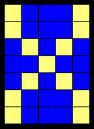
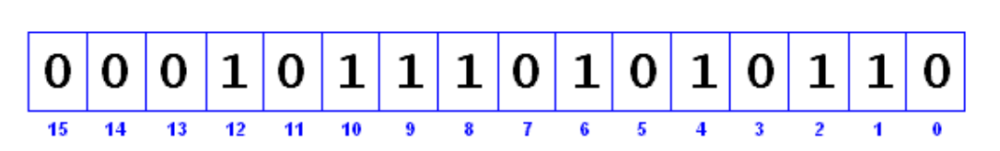

> This article was revised on 2022/09/28 by Hannes Siebeneicher.

Often when programming in the Arduino environment (or on any computer, for that matter), the ability to manipulate individual bits will become useful or even necessary. Here are some situations where bit math can be helpful:

- Saving memory by packing up to 8 true/false data values in a single byte.
- Turning on/off individual bits in a control register or hardware port register.
- Performing certain arithmetic operations involving multiplying or dividing by powers of 2.

In this article, we first explore the basic bitwise operators available in the C++ language. Then we learn how to combine them to perform certain common useful operations. This article is based on the bit math tutorial by [CosineKitty](https://playground.arduino.cc/Profiles/CosineKitty/).

## The Binary System

To better explain the bitwise operators, this tutorial will express most integer values using binary notation, also known as _base two_. In this system, all integer values use only the values 0 and 1 for each digit. This is how virtually all modern computers store data internally. Each 0 or 1 digit is called a _bit_, short for _binary digit_.

In the familiar decimal system (_base ten_), a number like 572 means 5\*10^2 \+ 7\*10^1 \+ 2\*10^0. Likewise, in binary a number like 11010 means 1\*2^4 \+ 1\*2^3 \+ 0\*2^2 \+ 1\*2^1 \+ 0\*2^0 \= 16 + 8 + 2 = 26.

It is crucial that you understand how the binary system works in order to follow the remainder of this tutorial. If you need help in this area, one good place to start is the [Wikipedia article on the binary system](https://en.wikipedia.org/wiki/Binary%5Fnumeral%5Fsystem).

Arduino allows you to specify binary numbers by prefixing them with `0b`, e.g., `0b11 == 3`. For legacy reasons, it also defines the constants `B0` through `B11111111`, which can be used in the same way.

## Bitwise AND

The bitwise AND operator in C++ is a single ampersand, `&`, used between two other integer expressions. Bitwise AND operates on each bit position of the surrounding expressions independently, according to this rule: if both input bits are 1, the resulting output is 1, otherwise the output is 0\. Another way of expressing this is:

```arduino
    0 & 0 == 0
    0 & 1 == 0
    1 & 0 == 0
    1 & 1 == 1
```

In Arduino, the type `int` is a 16-bit value, so using `&` between two `int` expressions causes 16 simultaneous AND operations to occur. In a code fragment like:

```arduino
    int a =  92;    // in binary: 0000000001011100
    int b = 101;    // in binary: 0000000001100101
    int c = a & b;  // result:    0000000001000100, or 68 in decimal.
```

Each of the 16 bits in `a` and `b` are processed by using the bitwise AND, and all 16 resulting bits are stored in `c`, resulting in the value `01000100` in binary, which is 68 in decimal.

One of the most common uses of bitwise AND is to select a particular bit (or bits) from an integer value, often called _masking_. For example, if you wanted to access the least significant bit in a variable `x`, and store the bit in another variable `y`, you could use the following code:

```arduino
    int x = 5;       // binary: 101
    int y = x & 1;   // now y == 1
    x = 4;           // binary: 100
    y = x & 1;       // now y == 0
```

## Bitwise OR

The bitwise OR operator in C++ is the vertical bar symbol, `|`. Like the `&` operator, `|` operates independently each bit in its two surrounding integer expressions, but what it does is different (of course). The bitwise OR of two bits is 1 if either or both of the input bits is 1, otherwise it is 0\. In other words:

```arduino
    0 | 0 == 0
    0 | 1 == 1
    1 | 0 == 1
    1 | 1 == 1
```

Here is an example of the bitwise OR used in a snippet of C++ code:

```arduino
    int a =  92;    // in binary: 0000000001011100
    int b = 101;    // in binary: 0000000001100101
    int c = a | b;  // result:    0000000001111101, or 125 in decimal.
```

Bitwise OR is often used to make sure that a given bit is turned on (set to 1) in a given expression. For example, to copy the bits from `a` into `b`, while making sure the lowest bit is set to 1, use the following code:

```arduino
    b = a | 1;
```

## Bitwise XOR

There is a somewhat unusual operator in C++ called _bitwise exclusive OR_, also known as bitwise XOR. (In English this is usually pronounced "eks-or".) The bitwise XOR operator is written using the caret symbol `^`. This operator is similar to the bitwise OR operator `|`, except that it evaluates to 1 for a given position when exactly one of the input bits for that position is 1\. If both are 0 or both are 1, the XOR operator evaluates to 0 :

```arduino
    0 ^ 0 == 0
    0 ^ 1 == 1
    1 ^ 0 == 1
    1 ^ 1 == 0
```

Another way to look at bitwise XOR is that each bit in the result is a 1 if the input bits are different, or 0 if they are the same.

Here is a simple code example:

```arduino
    int x = 12;     // binary: 1100
    int y = 10;     // binary: 1010
    int z = x ^ y;  // binary: 0110, or decimal 6
```

The `^` operator is often used to toggle (i.e. change from 0 to 1, or 1 to 0) some of the bits in an integer expression while leaving others alone. For example:

```arduino
    y = x ^ 1;   // toggle the lowest bit in x, and store the result in y.
```

## Bitwise NOT

The bitwise NOT operator in C++ is the tilde character `~`. Unlike `&` and `|`, the bitwise NOT operator is applied to a single operand to its right. Bitwise NOT changes each bit to its opposite: 0 becomes 1, and 1 becomes 0\. For example:

```arduino
    int a = 103;    // binary:  0000000001100111
    int b = ~a;     // binary:  1111111110011000 = -104
```

You might be surprised to see a negative number like -104 as the result of this operation. This is because the highest bit in an `int` variable is the so-called _sign bit_. If the highest bit is 1, the number is interpreted as negative. This encoding of positive and negative numbers is referred to as _two's complement_. For more information, see the [Wikipedia article on two's complement](https://en.wikipedia.org/wiki/Two%27s%5Fcomplement).

As an aside, it is interesting to note that for any integer `x`, `~x` is the same as `-x-1`.

At times, the sign bit in a signed integer expression can cause some unwanted surprises, as we shall see later.

## Bit Shift Operators

There are two _bit shift_ operators in C++: the _left shift_ operator `<<` and the _right shift_ operator `>>`. These operators cause the bits in the left operand to be shifted left or right by the number of positions specified by the right operand. For example:

```arduino
    int a = 5;        // binary: 0000000000000101
    int b = a << 3;   // binary: 0000000000101000, or 40 in decimal
    int c = b >> 3;   // binary: 0000000000000101, or back to 5 like we started with
```

When you shift a value `x` by `y` bits (`x << y`), the leftmost `y` bits in `x` are lost, literally shifted out of existence:

```arduino
    int a = 5;        // binary: 0000000000000101
    int b = a << 14;  // binary: 0100000000000000 - the first 1 in 101 was discarded
```

If you are certain that none of the ones in a value are being shifted into oblivion, a simple way to think of the left-shift operator is that it multiplies the left operand by 2 raised to the right operand power. For example, to generate powers of 2, the following expressions can be employed:

```arduino
    1 <<  0  ==    1
    1 <<  1  ==    2
    1 <<  2  ==    4
    1 <<  3  ==    8
    ...
    1 <<  8  ==  256
    1 <<  9  ==  512
    1 << 10  == 1024
    ...
```

When you shift `x` right by `y` bits (`x >> y`), and the highest bit in `x` is a 1, the behavior depends on the exact data type of `x`. If `x` is of type `int`, the highest bit is the sign bit, determining whether `x` is negative or not, as we have discussed above. In that case, the sign bit is copied into lower bits, for esoteric historical reasons:

```arduino
    int x = -16;     // binary: 1111111111110000
    int y = x >> 3;  // binary: 1111111111111110
```

This behavior, called _sign extension_, is often not the behavior you want. Instead, you may wish zeros to be shifted in from the left. It turns out that the right shift rules are different for `unsigned int` expressions, so you can use a typecast to suppress ones being copied from the left:

```arduino
    int x = -16;               // binary: 1111111111110000
    int y = unsigned(x) >> 3;  // binary: 0001111111111110
```

If you are careful to avoid sign extension, you can use the right-shift operator `>>` as a way to divide by powers of 2\. For example:

```arduino
    int x = 1000;
    int y = x >> 3;   // integer division of 1000 by 8, causing y = 125.
```

## Assignment Operators

Often in programming, you want to operate on the value of a variable `x` and store the modified value back into `x`. In most programming languages, for example, you can increase the value of a variable `x` by 7 using the following code:

```arduino
    x = x + 7;    // increase x by 7
```

Because this kind of thing occurs so frequently in programming, C++ provides a shorthand notation in the form of specialized _assignment operators_. The above code fragment can be written more concisely as:

```arduino
    x += 7;    // increase x by 7
```

It turns out that bitwise AND, bitwise OR, left shift, and right shift, all have shorthand assignment operators. Here is an example:

```arduino
    int x = 1;  // binary: 0000000000000001
    x <<= 3;    // binary: 0000000000001000
    x |= 3;     // binary: 0000000000001011 - because 3 is 11 in binary
    x &= 1;     // binary: 0000000000000001
    x ^= 4;     // binary: 0000000000000101 - toggle using binary mask 100
    x ^= 4;     // binary: 0000000000000001 - toggle with mask 100 again
```

There is no shorthand assignment operator for the bitwise NOT operator `~`; if you want to toggle all the bits in `x`, you need to do this:

```arduino
    x = ~x;    // toggle all bits in x and store back in x
```

## A word of caution: bitwise operators vs. boolean operators

It is very easy to confuse the bitwise operators in C++ with the boolean operators. For instance, the bitwise AND operator `&` is not the same as the boolean AND operator `&&`, for two reasons:

- They don't calculate numbers the same way. Bitwise `&` operates independently on each bit in its operands, whereas `&&` converts both of its operands to a boolean value (`true`\==1 or `false`\==0), then returns either a single `true` or `false` value. For example, `4 & 2 == 0`, because 4 is 100 in binary and 2 is 010 in binary, and none of the bits are 1 in both integers. However, `4 && 2 == true`, and `true` numerically is equal to `1`. This is because 4 is not 0, and 2 is not 0, so both are considered as boolean `true` values.
- Bitwise operators always evaluate both of their operands, whereas boolean operators use so-called _short-cut_ evaluation. This matters only if the operands have side-effects, such as causing output to occur or modifying the value of something else in memory. Here is an example of how two similar looking lines of code can have very different behavior:

```arduino
    int fred (int x)
    {
        Serial.print ("fred ");
        Serial.println (x, DEC);
        return x;
    }
```

```arduino
    void setup()
    {
        Serial.begin (9600);
    }
```

```arduino
    void loop()
    {
        delay(1000);    // wait 1 second, so output is not flooded with serial data!
        int x = fred(0) & fred(1);
    }
```

If you compile and upload this program, and then monitor the serial output from the Arduino GUI, you will see the following lines of text repeated every second:

```arduino
    fred 0
    fred 1
```

This is because both `fred(0)` and `fred(1)` are called, resulting in the generated output, the return values 0 and 1 are bitwise-ANDed together, storing 0 in `x`. If you edit the line

```arduino
        int x = fred(0) & fred(1);
```

and replace the bitwise `&` with its boolean counterpart `&&`,

```arduino
        int x = fred(0) && fred(1);
```

and compile, upload, and run the program again, you may be surprised to see only a single line of text repeated every second in the serial monitor window:

```arduino
    fred 0
```

Why does this happen? This is because boolean `&&` is using a short-cut: if its left operand is zero (a.k.a. `false`), it is already certain that the result of the expression will be `false`, so there is no need to evaluate the right operand. In other words, the line of code `int x = fred(0) && fred(1);` is identical in meaning to:

```arduino
    int x;
    if (fred(0) == 0) {
        x = false;  // stores 0 in x
    } else {
        if (fred(1) == 0) {
            x = false;  // stores 0 in x
        } else {
            x = true;   // stores 1 in x
        }
    }
```

Clearly, the boolean `&&` is a lot more concise way to express this surprisingly complex piece of logic.

As with bitwise AND and boolean AND, there are differences between bitwise OR and boolean OR. The bitwise OR operator `|` always evaluates both of its operands, whereas the boolean OR operator `||` evaluates its right operand only if its left operand is `false` (zero). Also, bitwise `|` operates independently on all of the bits in its operands, whereas boolean `||` treats both of its operands as either true (nonzero) or false (zero), and evaluates to either true (if either operand is nonzero) or false (if both operands are zero).

## Putting it all together: common problems solved

Now we start exploring how we can combine the various bitwise operators to perform useful tasks using C++ syntax in the Arduino environment.

### A word about port registers in the Atmega8 microcontroller

Usually when you want to read or write to digital pins in the Atmega8, you use the built-in functions digitalRead() or digitalWrite() supplied by the Arduino environment. Suppose that in your `setup()` function, you wanted to define the digital pins 2 through 13 as output, and then you wanted pins 11, 12, and 13 to be set HIGH, and all the other pins set LOW. Here is how one would typically accomplish this:

```arduino
    void setup()
    {
        int pin;
        for (pin=2; pin <= 13; ++pin) {
            pinMode (pin, OUTPUT);
        }
        for (pin=2; pin <= 10; ++pin) {
            digitalWrite (pin, LOW);
        }
        for (pin=11; pin <= 13; ++pin) {
            digitalWrite (pin, HIGH);
        }
    }
```

It turns out there is a way to accomplish the same thing using direct access to Atmega8 hardware ports and bitwise operators:

```arduino
    void setup()
    {
        // set pins 1 (serial transmit) and 2..7 as output,
        // but leave pin 0 (serial receive) as input
        // (otherwise serial port will stop working!) ...
        DDRD = B11111110;  // digital pins 7,6,5,4,3,2,1,0
```

```arduino
        // set pins 8..13 as output...
        DDRB = B00111111;  // digital pins -,-,13,12,11,10,9,8
```

```arduino
        // Turn off digital output pins 2..7 ...
        PORTD &= B00000011;   // turns off 2..7, but leaves pins 0 and 1 alone
```

```arduino
        // Write simultaneously to pins 8..13...
        PORTB = B00111000;   // turns on 13,12,11; turns off 10,9,8
    }
```

This code takes advantage of the fact that the control registers `DDRD` and `DDRB` each contain 8 bits that determine whether a given digital pin is output (1) or input (0). The upper 2 bits in DDRB are not used, because there is no such thing is digital pin 14 or 15 on the Atmega8\. Likewise, the port registers `PORTB` and `PORTD` contain one bit for the most recently written value to each digital pin, HIGH (1) or LOW (0).

Generally speaking, doing this sort of thing is **not** a good idea. Why not? Here are a few reasons:

- The code is much more difficult for you to debug and maintain and is a lot harder for other people to understand. It only takes a few microseconds for the processor to execute code, but it might take hours for you to figure out why it isn't working right and fix it! Your time is valuable, right? But the computer's time is very cheap, measured in the cost of the electricity you feed it. Usually, it is much better to write code the most obvious way.
- The code is less portable. If you use digitalRead() and digitalWrite(), it is much easier to write code that will run on all of the Atmel microcontrollers, whereas the control and port registers can be different on each kind of microcontroller.
- It is a lot easier to cause unintentional malfunctions with direct port access. Notice how the line `DDRD = B11111110;` above mentions that it must leave pin 0 as an input pin. Pin 0 is the receive line on the serial port. It would be very easy to accidentally cause your serial port to stop working by changing pin 0 into an output pin! Now that would be very confusing when you suddenly are unable to receive serial data, wouldn't it?

So you might be saying to yourself, great, why would I ever want to use this stuff then? Here are some of the positive aspects of direct port access:

- If you are running low on program memory, you can use these tricks to make your code smaller. It requires a lot fewer bytes of compiled code to simultaneously write a bunch of hardware pins simultaneously via the port registers than it would using a `for` loop to set each pin separately. In some cases, this might make the difference between your program fitting in flash memory or not!
- Sometimes you might need to set multiple output pins at exactly the same time. Calling `digitalWrite(10,HIGH);` followed by `digitalWrite(11,HIGH);` will cause pin 10 to go HIGH several microseconds before pin 11, which may confuse certain time-sensitive external digital circuits you have hooked up. Alternatively, you could set both pins high at exactly the same moment in time using `PORTB |= B1100;`
- You may need to be able to turn pins on and off very quickly, meaning within fractions of a microsecond. If you look at the source code in `lib/targets/arduino/wiring.c`, you will see that digitalRead() and digitalWrite() are each about a dozen or so lines of code, which get compiled into quite a few machine instructions. Each machine instruction requires one clock cycle at 16MHz, which can add up in time-sensitive applications. Direct port access can do the same job in a lot fewer clock cycles.

### More advanced example: disabling an interrupt

Now let's take what we have learned and start to make sense of some of the weird things you will sometimes see advanced programmers do in their code. For example, what does it mean when someone does the following?

```arduino
      // Disable the interrupt.
      GICR &= ~(1 << INT0);
```

This is an actual code sample from the Arduino 0007 runtime library, in the file `lib\targets\arduino\winterrupts.c`. First of all, we need to know what GICR and INT0 mean. It turns out that GICR is a control register that defines whether certain CPU interrupts are enabled (1) or disabled (0). If we search through the Arduino standard header files for INT0, we find various definitions. Depending on what kind of microcontroller you are writing for, you have either

```arduino
    #define INT0   6
```

or

```arduino
    #define INT0   0
```

So on some processors, the above line of code will compile to:

```arduino
    GICR &= ~(1 << 0);
```

and on others, it will compile to:

```arduino
    GICR &= ~(1 << 6);
```

Let us study the latter case, as it is more illustrative. First of all, the value `(1 << 6)` means that we shift 1 left by 6 bits, which is the same as 26, or 64\. More useful in this context is to see this value in binary: 01000000\. Then, the bitwise NOT operator `~` is applied to this value, resulting in all the bits being toggled: 10111111\. Then the bitwise AND assignment operator is used, so the code above has the same effect as:

```arduino
    GICR = GICR & B10111111;
```

This has the effect of leaving all the bits alone in GICR, except for the second-to-highest bit, which is turned off.

In the case where INT0 has been defined to 0 for your particular microcontroller, the line of code would instead be interpreted as:

```arduino
    GICR = GICR & B11111110;
```

which turns off the lowest bit in the GICR register but leaves the other bits as they were. This is an example of how the Arduino environment can support a wide variety of microcontrollers with a single line of runtime library source code.

### Saving memory by packing multiple data items in a single byte

There are many situations where you have a lot of data values, each of which can be either true or false. An example of this is if you are building your own LED grid and you want to display symbols on the grid by turning individual LEDs on or off. An example of a 5x7 bitmap for the letter X might look like this:



A simple way to store such an image is using an array of integers. The code for this approach might look like this:

```arduino
    const prog_uint8_t BitMap[5][7] = {   // store in program memory to save RAM
        {1,1,0,0,0,1,1},
        {0,0,1,0,1,0,0},
        {0,0,0,1,0,0,0},
        {0,0,1,0,1,0,0},
        {1,1,0,0,0,1,1}
    };
```

```arduino
    void DisplayBitMap()
    {
        for (byte x=0; x<5; ++x) {
            for (byte y=0; y<7; ++y) {
                byte data = pgm_read_byte (&BitMap[x][y]);   // fetch data from program memory
                if (data) {
                    // turn on the LED at location (x,y)
                } else {
                    // turn off the LED at location (x,y)
                }
            }
        }
    }
```

If this were the only bitmap you had in your program, this would be a simple and effective solution to the problem. We are using 1 byte of program memory (of which there are about 7K available in the Atmega8) for each pixel in our bitmap, for a total of 35 bytes. This is not so bad, but what if you wanted a bitmap for each of the 96 printable characters in the ASCII character set? This would consume 96\*35 = 3360 bytes, which would leave a lot less flash memory for holding your program code.

There is a much more efficient way to store a bitmap. Let us replace the 2-dimensional array above with a 1-dimensional array of bytes. Each byte contains 8 bits, and we will use the lowest 7 bits of each to represent the 7 pixels in a column of our 5x7 bitmap:

```arduino
    const prog_uint8_t BitMap[5] = {   // store in program memory to save RAM
        B1100011,
        B0010100,
        B0001000,
        B0010100,
        B1100011
    };
```

(Here we are using the predefined binary constants available starting in Arduino 0007.) This allows us to use 5 bytes for each bitmap instead of 35\. But how do we make use of this more compact data format? Here is the answer: we rewrite the function DisplayBitMap() to access the individual bits in each byte of the BitMap...

```arduino
    void DisplayBitMap()
    {
        for (byte x=0; x<5; ++x) {
            byte data = pgm_read_byte (&BitMap[x]);   // fetch data from program memory
            for (byte y=0; y<7; ++y) {
                if (data & (1<<y)) {
                    // turn on the LED at location (x,y)
                } else {
                    // turn off the LED at location (x,y)
                }
            }
        }
    }
```

The crucial line to understand is

```arduino
    if (data & (1<<y)) {
```

The expression `(1<<y)` selects a given bit inside `data` that we want to access. Then using bitwise AND, `data & (1<<y)` tests the given bit. If that bit is set, a nonzero value results, causing the `if` to see it as being true. Otherwise, if the bit is zero, it is treated as false, so the `else` executes.

## Quick Reference

In this quick reference, we refer to the bits in a 16-bit integer starting with the least significant bit as bit 0, and the most significant bit (the sign bit if the integer is signed) as bit 15, as illustrated in this diagram:



Whenever you see the variable `n`, its value is assumed to be 0 through 15.

```arduino
    y = (x >> n) & 1;    // n=0..15.  stores nth bit of x in y.  y becomes 0 or 1.
```

```arduino
    x &= ~(1 << n);      // forces nth bit of x to be 0.  all other bits left alone.
```

```arduino
    x &= (1<<(n+1))-1;   // leaves alone the lowest n bits of x; all higher bits set to 0.
```

```arduino
    x |= (1 << n);       // forces nth bit of x to be 1.  all other bits left alone.
```

```arduino
    x ^= (1 << n);       // toggles nth bit of x.  all other bits left alone.
```

```arduino
    x = ~x;              // toggles ALL the bits in x.
```

Here is an interesting function that uses both bitwise `&` and boolean `&&`. It returns true if and only if the given 32-bit integer `x` is a perfect power of 2, i.e., 1, 2, 4, 8, 16, 32, 64, etc. For example, calling `IsPowerOfTwo(64)` will return `true`, but `IsPowerOfTwo(65)` returns `false`. To see how this function works, let us use the number 64 as an example of a power of 2\. In binary, 64 is `1000000`. When we subtract 1 from `1000000`, we get `0111111`. Applying bitwise `&`, the result is `0000000`. But if we do the same with 65 (binary 1000001), we get `1000001 & 1000000 == 1000000`, which is not zero.

```arduino
    bool IsPowerOfTwo (long x)
    {
        return (x > 0) && (x & (x-1) == 0);
    }
```

Here is a function that counts how many bits in the 16-bit integer `x` are 1 and returns the count:

```arduino
    int CountSetBits (int x)
    {
        int count = 0;
        for (int n=0; n<16; ++n) {
            if (x & (1<<n)) {
                ++count;
            }
        }
        return count;
    }
```

Another way is this:

```arduino
    int CountSetBits (int x)
    {
        unsigned int count;
        for (count = 0; x; count++)
            x &= x - 1;
        return count;
    }
```

Various tricks for common bit-oriented operations can be found [here](https://graphics.stanford.edu/~seander/bithacks.html).
