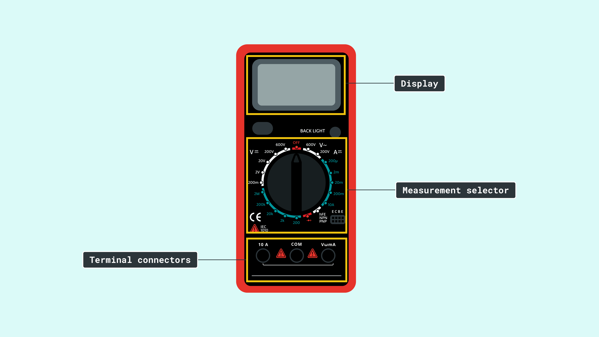
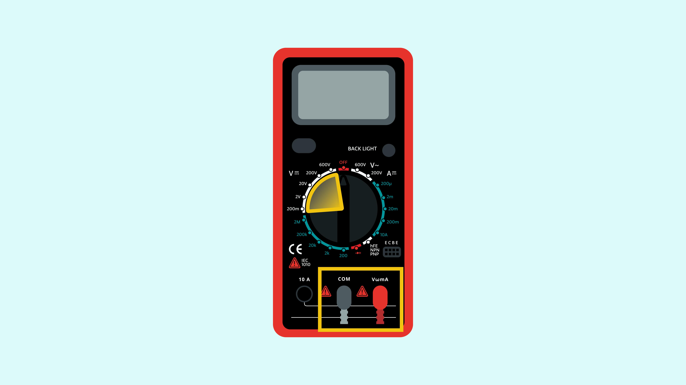
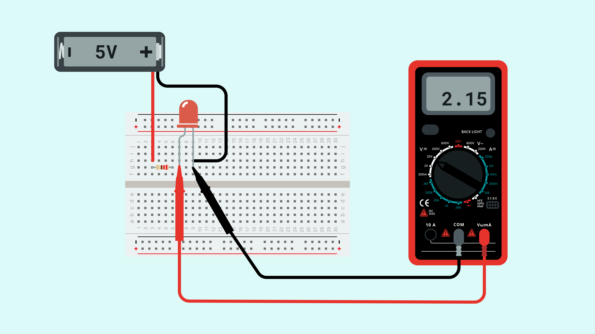
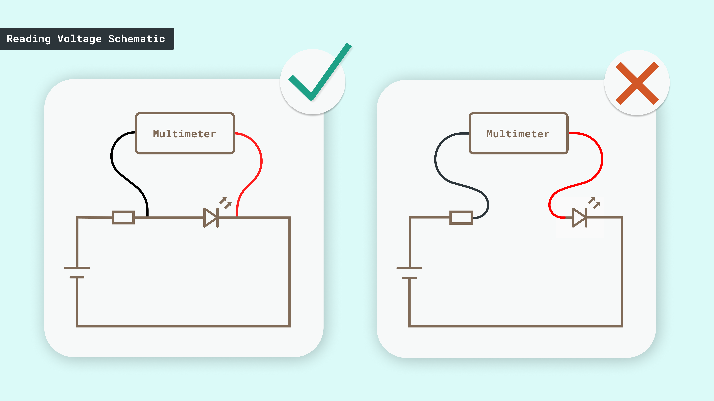
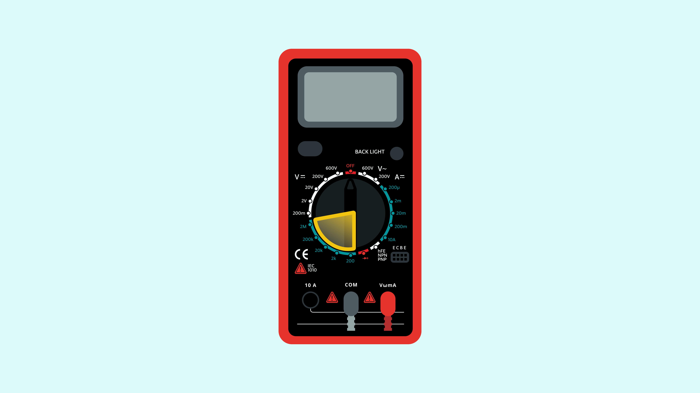
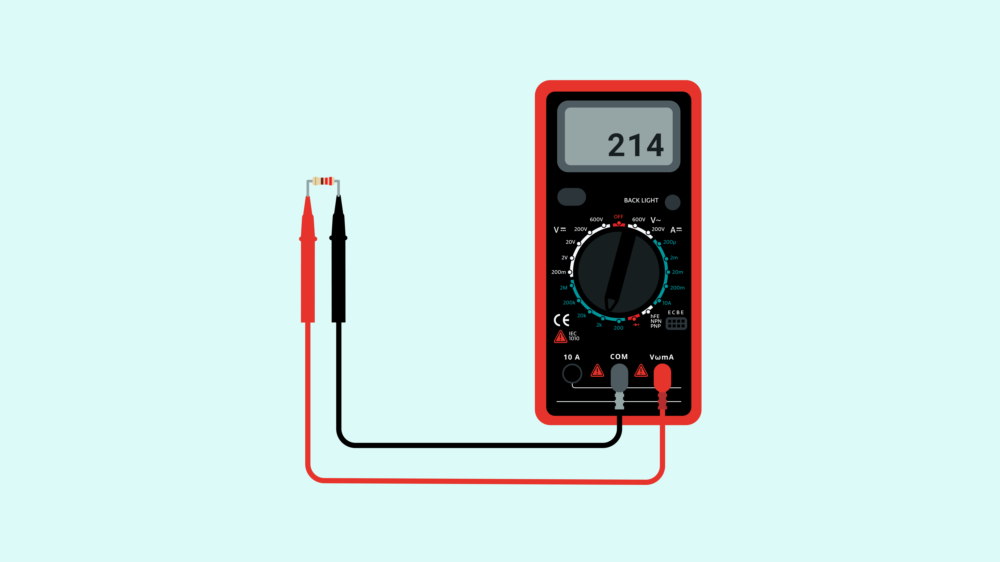
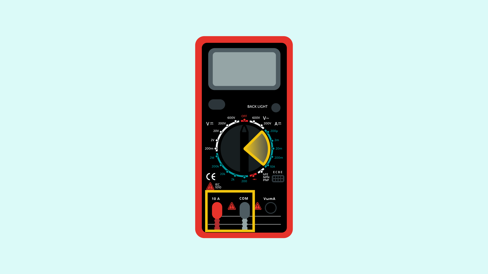
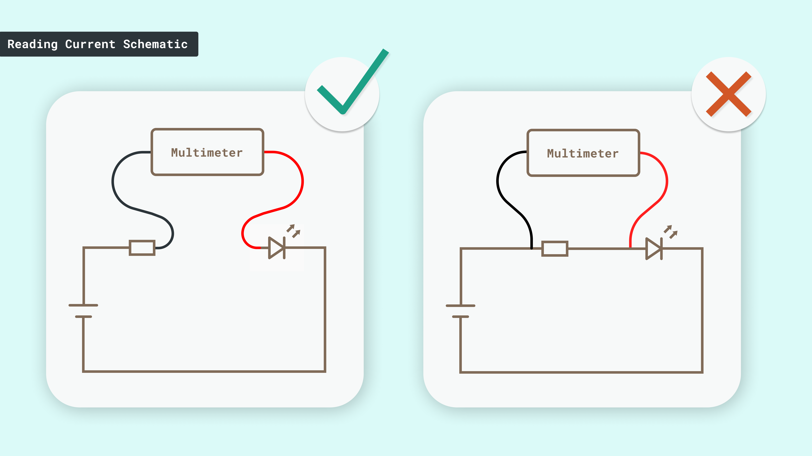
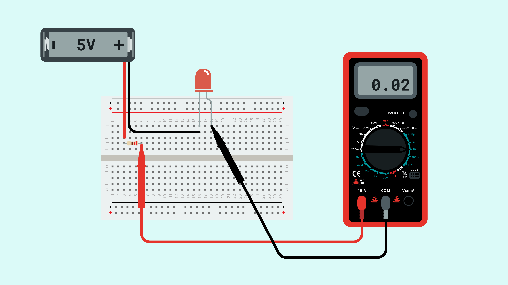

A multimeter is a test tool, mostly used in electronics, that should always be present in the FabLab of a Maker. 

It is a diagnostic tool that allows us, for instance to: 

- debug circuits, 
- display the value of resistors,
- measure voltage and current in our circuits,
- identify conductive/non conductive materials, and much more!

## Parts of the Multimeter

There are many different types of multimeters, some with more or less features. The following image lists the parts that the majority of multimeters have.

- The display will show various numeric values of the different measurements we take with the multimeter.
- By changing the position of the measurement selector switch, we will be able to configure the multimeter to measure different parameters.
- Depending on the parameters we want to measure, the connection of the terminals should be done in an appropriate manner.

## How to choose a multimeter

It is hard to say exactly which characteristics a multimeter should have, since there are different needs depending on the background of the user and the intended usage, but let's say that independently of the level of the user, a multimeter should have:

- Voltage reading
- Current reading
- Resistance reading, from at least 10 Ohm to 1M Ohm
- Continuity detection (with acoustic feedback)

Then, depending on the user background, there will be some features that could make the multimeter easier to use, or make it a more complex tool. Some of these features are:
- **Autoscale**: This feature will configure the data scale of the multimeter to show the readings in the easiest format possible for the user to understand them. However, this feature may compromise the accuracy of the readings.
- **Hold**: This feature "freezes" the reading on the screen, so the user can check it out even after removing the terminal connectors from the measurement points.
- **Advanced features** such as: Frequency counter, capacitance testing, inductance testing, duty cycle, etc. These features allow us to measure quite advanced properties of different components and signals in the electronic circuits; but usually a background in electronics is needed, to makes sense of these readings and to know how to execute the measurements correctly in the circuits.

## How to use a Multimeter

Multimeters have different working modes, depending on what are you interested on measuring. Let's start by how to use a multimeter to measure voltage, resistance, conductivity and current. 

### Reading voltage

This will require to place the measurement selector in the Volts section the **black** terminal in the COM and the **red** terminal in the V|Ω|mA terminal.

With this configuration, the selected scale should be adjusted based on the  measured voltage.

If you want to measure the voltage close to a 9V battery, the scale should be 20. 
- The scale limits the higher value that can be measured, meaning that if the selector is within the 2000m, the highest value that can be measured with that scale is 2000mV = 2V.

In order to know what scale to select, you should check what is the approximate value that you will be measuring, and select the scale according to it:

- From 0 to 200mV --> 200m
- From 200mV to 2000mV (2V) --> 2000m
- From 2V to 20V --> 20V
    
If you try to measure a higher value than the one specified on the scale, the display will show "over-value", which is usually shown with the number "1" on the display.

### Terminals 

Once you have selected the scale to use, it is time to use the terminals:

- The black terminal (Common) should be placed in the point of the circuit closer to the ground  "-" terminal of the battery.
- The red terminal should be placed in the point you want to know what is the voltage in the circuit.

The image below shows how to read the voltage falling in an LED. In order to know the voltage falling on a component, you will need to connect the multimeter in parallel with it.

You can see how the black terminal checks the negative terminal of the LED, which is connected to the negative pole of the battery and the red terminal on the positive terminal of the LED.

### Reading resistance 

In order to measure resistance, the measurement selector should be in the Ohm section. 

The scale to measure resistance works exactly as explained in the "Measuring voltage section".

In order to know the value of a resistor, you need to keep in mind that the measurement must be done on a resistor that is not connected to any other component! Then, you can make the reading:

Place each one of the terminals of the multimeter in each one of the terminals of the resistor.

### Continuity Testing

This feature allows you to know if a material is or is not conductive.

To make this test, you will need to "touch" a material with both terminals of the multimeter, once you do so, depending on the multimeter you will see:

- OL / 0 in the display if the material is not conductive
- 1 on the display & Beep if the material is conductive 

### Reading Current

Reading current is a little bit more complex than reading voltage or resistance. In order to make current with the multimeter, first you will need to connect the red terminal to the 10A(DCA) connector and place the selector in the A section.

Once the connections are configured, as shown above, and the selector is properly placed you can measure the current that is flowing on a circuit. Just make sure that the multimeter is connected in series with the rest of the components of that same circuit.

The image below shows how to read the current flowing through a circuit with a LED and a resistor. Here, you can see how the multimeter is connected in series with the resistor and the LED, as if it was one more component of the circuit.

