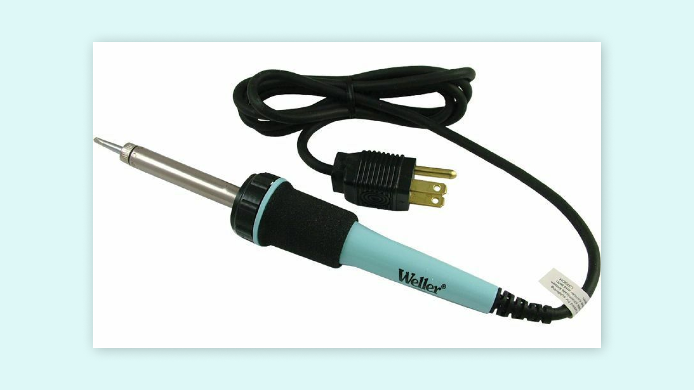
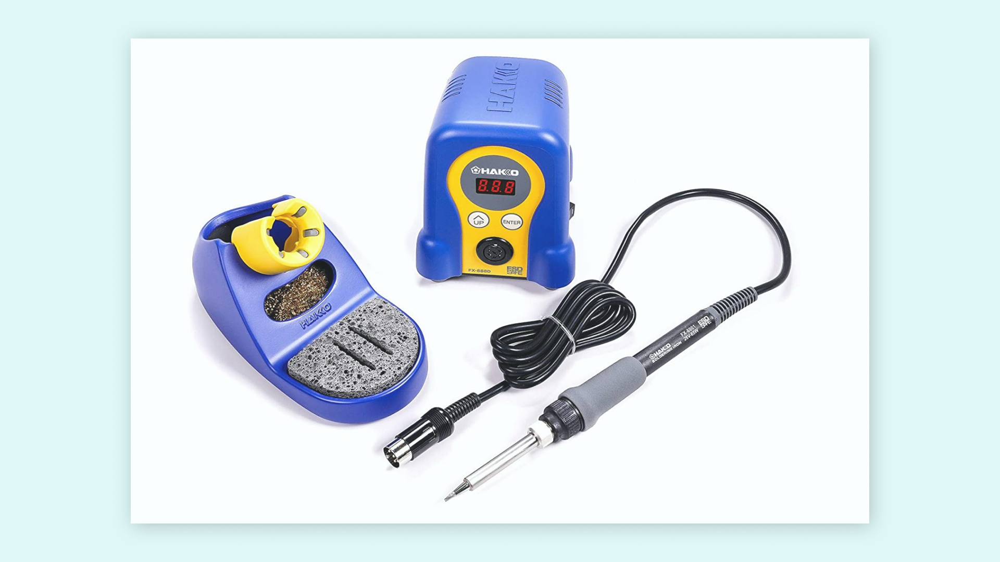
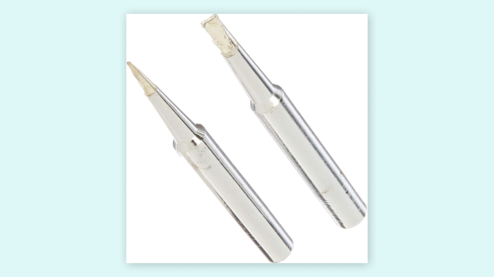
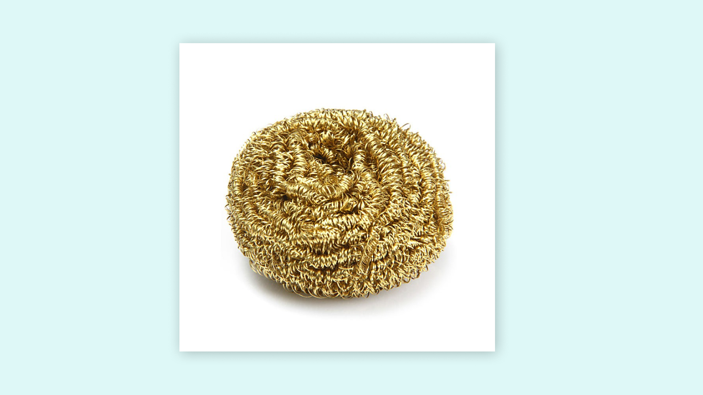
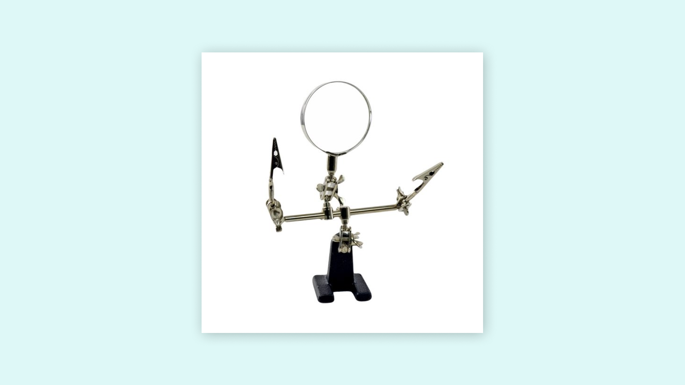
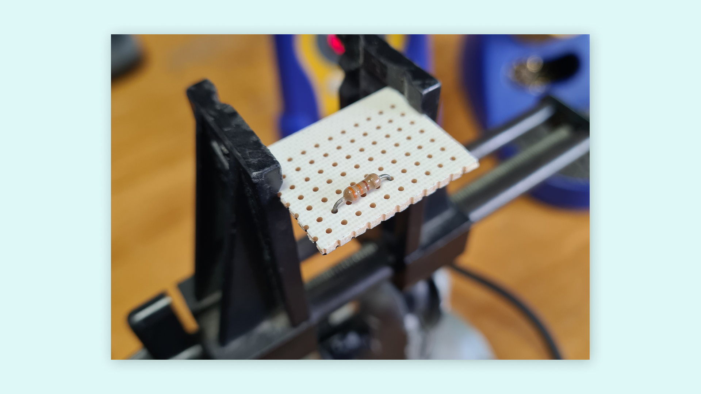
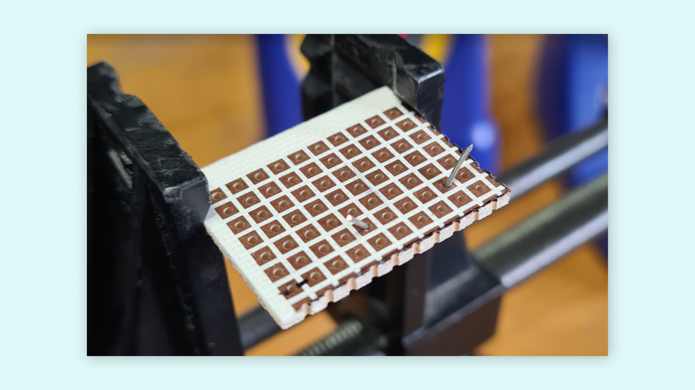
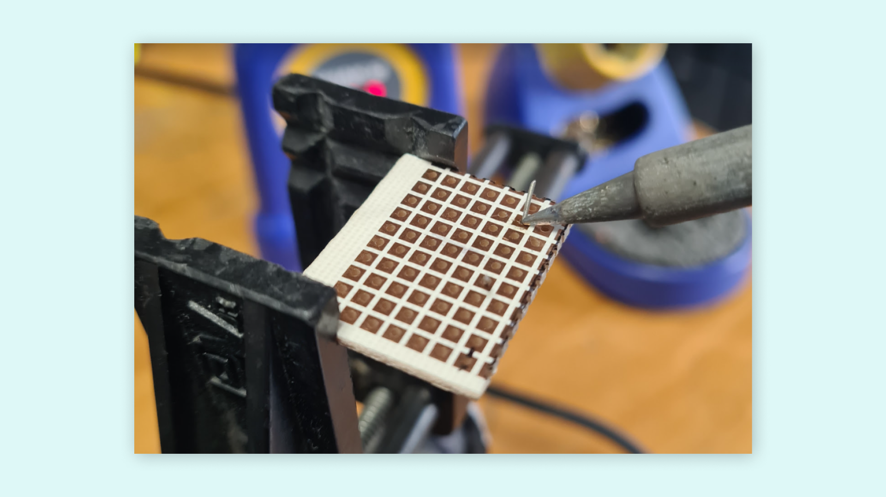
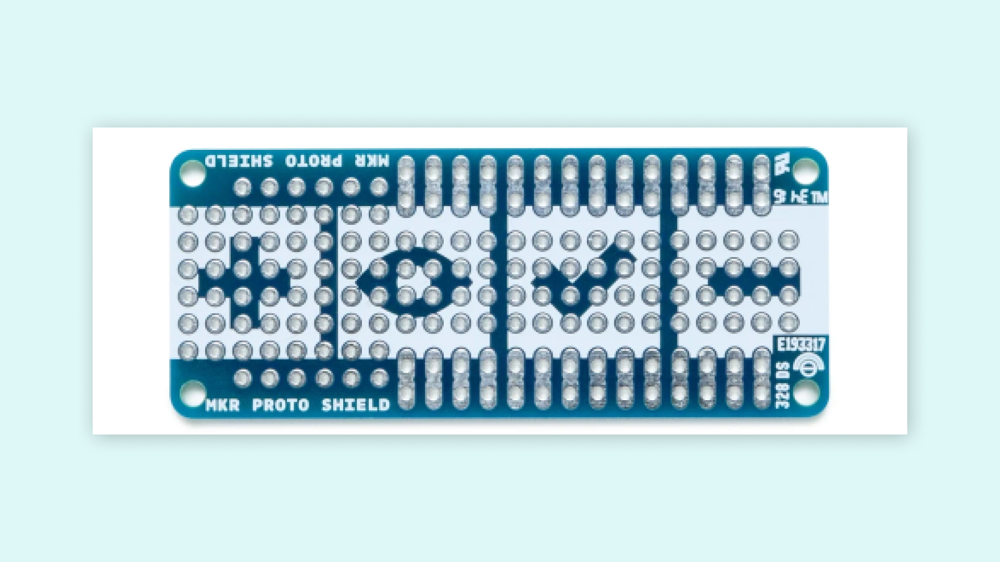
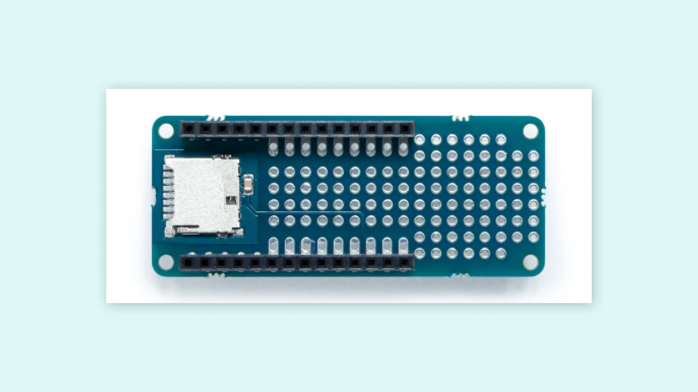

Usually, when we work on building electronic circuits projects, we use breadboards, especially when prototyping. When we have finished the prototyping stage, we often need to migrate our projects from a breadboard to a dedicated board, like printed circuit boards (PCBs), to have our project safely and for a long time. It is in these cases when we need to know how to solder electronic parts or components. 

**Soldering** is a process where two electronic parts or components are joined together by melting **solder** around an electrical or/and mechanical connection between those components using a handheld tool called **soldering iron**. Solder creates a solid and permanent electrical and mechanical bond between the electronic components after it cools. 

For mastering soldering, we need practice, a lot, but also good tools. Let's first talk about the **essential tools and materials** we need to start soldering. 

## Soldering Tools

### Soldering Irons and Soldering Stations

A **soldering iron** is the fundamental piece of **handheld equipment** used in the process of soldering. Soldering irons heat up to melt solder around electrical or mechanical connections; as it melts, solder flows into the spaces between and around two components. Once bonded, the solder is left to cool and harden, creating a permanent and conductive join; it can melt back into liquid form by reheating enough the join. The process of reheating and separating a previously soldered joint is called **desoldering**.

A **soldering station** is a more advanced and professional type of soldering iron with a separate temperature control unit; soldering irons provide just one fixed heat setting while soldering stations offer a range of specific temperatures. Soldering stations provide a far greater degree of accuracy for heat-critical applications. 

***15W to 30W pen-style soldering irons are a good start for beginners.***

### Soldering Iron Tips 

Nowadays, most soldering irons have interchangeable and replaceable **tips**, sometimes also referred to as **bits**. There are many different types and variations of soldering tips, each one used for specific purposes and with particular advantages or disadvantages in its use. The most common and standard tips used in soldering irons are the **conical tip** and the **chisel tip**. Let's talk about these types of soldering tips:

* **Conical tip**: a fine, pencil-like tip that can deliver heat to smaller areas without affecting its surroundings. This tip is a standard-shaped bit for general applications, but it is also handy for delicate and precision electronics.
* **Chisel tip**: a broad and flattened tip well-suited for soldering wires, through-hole components, surface-mount components, and desoldering.

Finding the best tip for soldering jobs can be tricky. Conical and chisel tips should be enough for soldering standard through-hole and surface-mount electronic components for starters.

***One of the most significant causes of soldering problems is poor tip maintenance. It is essential to take good care of your soldering tips to increase their overall longevity and reduce the need for regular replacement.***

### Brass and Conventional Sponges

Using a **sponge** will help keep soldering iron tips clean by removing oxidation (oxidated tips will get black and not accept solder). Conventional wet sponges work for cleaning soldering iron tips, but they tend to shorten the lifespan of the tips due to thermal shock. Also, wet sponges drop, temporarily, the temperature of the tip when wiped. 

A better alternative are **brass sponges** for cleaning soldering tips. Brass sponges removes debris in tips better; they have a smaller thermal shock and they don't need water as conventional sponges.

### Solder

Solder is a **metal alloy** that melts to create a permanent bond between electrical parts or components. Solder comes in both lead and lead-free presentations, also in different diameters; the most common diameters used are 0.8mm and 1.5mm. Inside the solder core a material known as **flux** helps improve electrical contact and mechanical strength of solder. 

For electronics soldering, the most commonly used solder is **lead-free rosin core solder**. This type of solder consists of a tin and a copper alloy. Leaded rosin core solder is also widely used, but it's becoming less popular due to health concerns with lead.

***When using solder, make sure to have proper ventilation and to wash your hands after soldering.***

### Helping Hands

A **helping hand**, also called "third hand," is a device that can assist you while soldering by holding the parts or components you are trying to solder, leaving your hands free to work. 

## Soldering 101

Now that we know about the essential tools and materials used for soldering, let's get into soldering. Before we can start, we need to prepare our soldering iron tip by **tinning** it with solder, this should be always the first step. Tinning is a process that helps to improve heat transfer from the soldering iron to the electronic part or component we want to solder; it also helps to protect the soldering tip against oxidation. 

Let's begin by making sure our soldering tip is attached correctly to our soldering iron, then turn it on and let it heat up. If you use a soldering station, set the temperature to 400° C (or 752° F). When the soldering iron, or soldering station, is heated up and ready:

* Wipe the soldering tip with a conventional wet sponge or a brass sponge. The purpose of this is to clean the tip by removing any present oxidation or debris on it. After cleaning the soldering tip, we should wait a few seconds to let the soldering tip heat up again.
* Touch the solder with the soldering iron tip, apply a small amount of solder on the soldering tip making sure the solder flows evenly around it.

***Remember to tinning the soldering iron tip before and after every soldering session. Tinning is a good practice that can increase soldering tip life.***

### Soldering Circuit Boards

Now, let's solder a resistor to a circuit board. For this process, it’s recommended to use a helping hand or other type of clamp device like a vice. Let's start with **mounting** the resistor to the circuit board. Insert the resistor into the holes of the circuit board.

Then, flip the circuit board and bend its leads outwards 45°.

Touch the copper pad and one of the resistors leads simultaneously, hold the soldering iron in place to **heat the joint** formed by the pad and the resistor lead for three to four seconds.

**Apply solder** to the joint while holding the soldering iron on the copper pad and the resistor lead. Avoid applying solder directly to the soldering tip; the joint should be hot enough to melt the solder.

When there is enough solder in the joint, remove the soldering iron and let it cool down naturally. Once cool, **snip the extra wire** from the resistor lead. Avoid bad joints by blowing on the solder and not allowing it to cool down naturally. Repeat this process with the other resistor lead and the rest of the components of the circuit. 

***Good solder joints are smooth, shiny, and have a volcano-like shape. Good solder joints also have enough solder to cover the entire joint but not too much to spill it.***

### Soldering Wires

Working with electric circuits also involves working with wires; let's learn how to solder them. For soldering wires, it's also recommended to use a helping hand or another type of clamp device:

1. Let's start by **removing the insulation** from the end of the wires we are going to solder. If the wire is stranded, we must twist the strands with our fingers.
2. Touch the end of one wire with the soldering tip, hold the soldering iron in place to **heat the wire** for three to four seconds. 
3. While holding the soldering iron on the wire, **apply the solder until it's fully coated**. Repeat this process on the other wire end. 
4. With the two wires tinned, hold their tinned end on top of each other and heat them with the soldering iron. This should **melt the solder and coat them**. If it is needed, apply solder so both wires are coated evenly. 
5. Remove the soldering iron and let it cool down and harden naturally. 

***Use heat shrink to cover connections between wires.***

### Desoldering

What happens if we want to remove a solder joint? Or if we're going to change it to correct? Or what about removing a component from a circuit board. Solder joints can be removed or changed easily by reheating and separating them; this is named **desoldering**. To desolder a joint, we will need **desoldering braid**, also known as **solder wick**. 

Using desoldering braid is simple:

1. Place the desoldering braid on the top of the solder joint to remove.
2. Heat the soldering braid and the solder joint with the tip of a soldering iron. Start removing the soldering braid; you will see that solder has been extracted and removed. 

***Be careful while using a soldering braid because it will get hot.***

If you have a lot of solder, using desoldering braid may not be the best option. In this case, a device called **solder sucker** is a better option. A solder sucker is a handheld mechanical vacuum that sucks up hot solder, usually by pressing a button.

Using a solder sucker is also simple:

1. Press the solder sucker plunger down. 
2. Heat the solder joint with the tip of a soldering iron, then place the tip of the solder sucker on top of the hot solder joint.
3. Press the button of the solder sucker to suck solder. 
   
## Arduino® Proto Shields

Designing custom circuits with Arduino® boards is easily done using Proto Shields. For example, The [MKR Proto Shield](https://store.arduino.cc/products/mkr-proto-shield) is a prototyping shield designed for the MKR family boards. This shield easily plugs onto any MKR board using its provided female/male headers and offers a duplicate breakout for each pin on the board along with many solderable through-holes on a standard 0.1” (2.54mm) grid. 

Another example is the [MKR SD Proto Shield](https://store.arduino.cc/products/mkr-sd-proto-shield). This shield allows you to easily connect a microSD card to an MKR family board; in this shield, there's also a small prototyping area for soldering components.

Check out the [documentation](https://docs.arduino.cc/hardware/mkr-sd-proto-shield) of the MKR SD Proto Shield for more information, tutorials and resources.